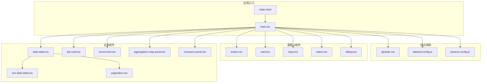
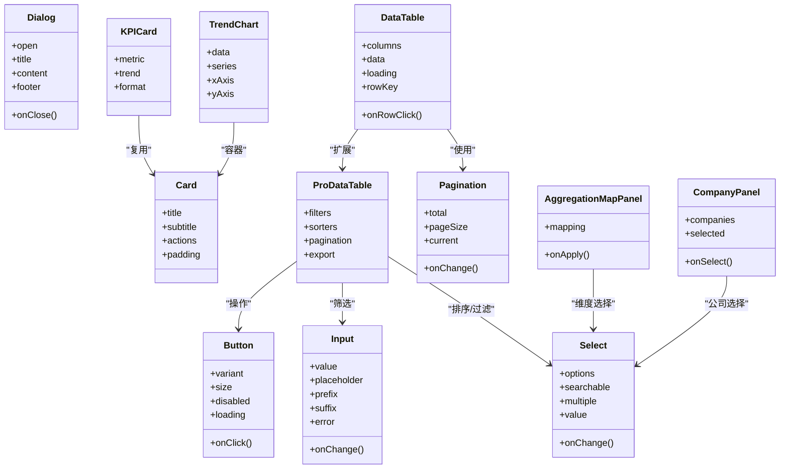
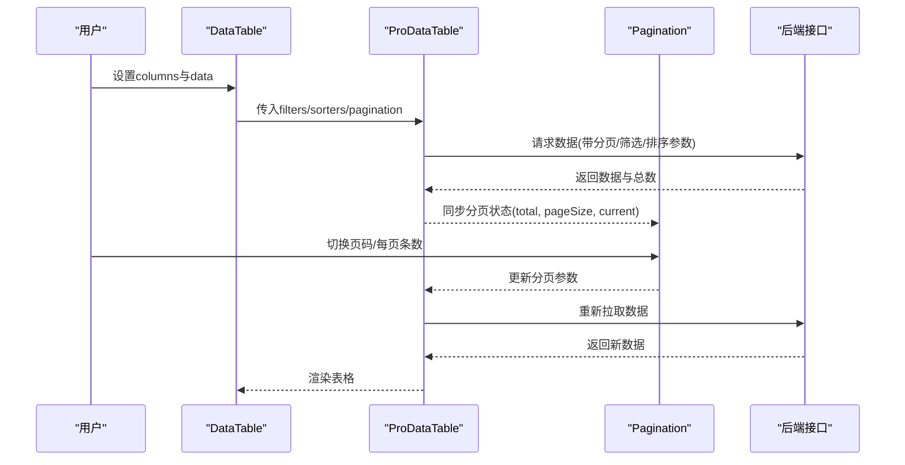
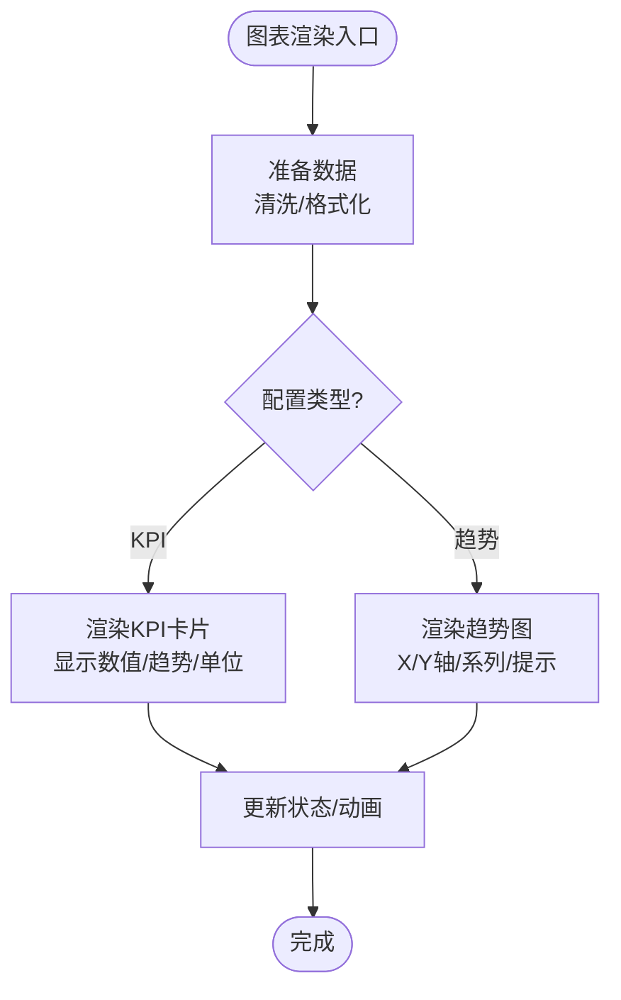
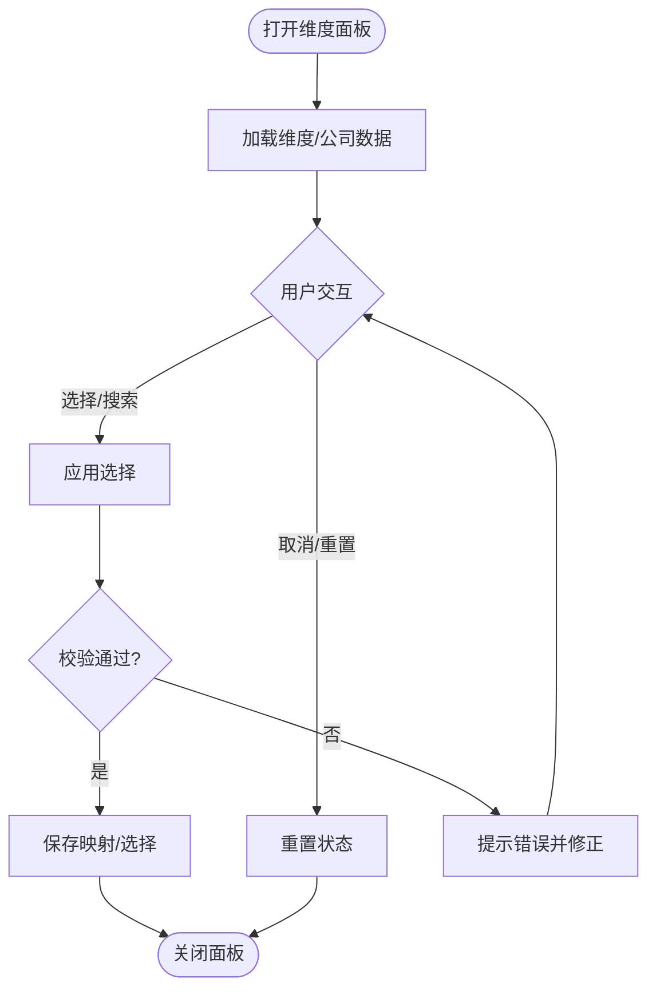
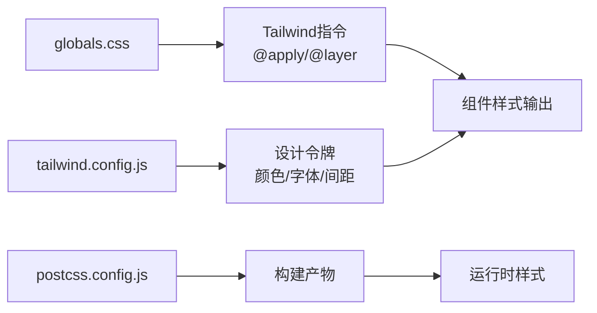
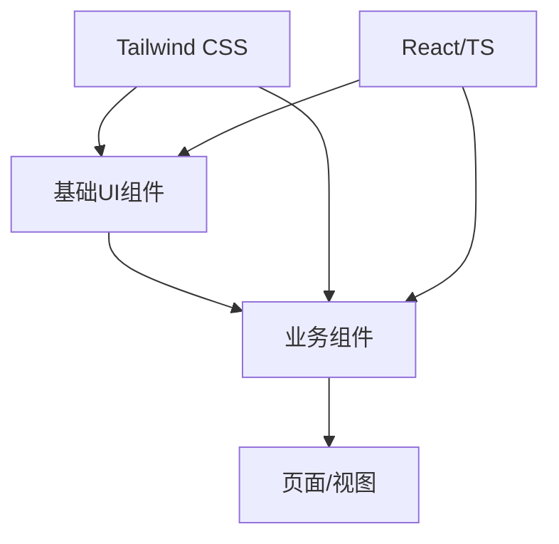

# UI组件库

<cite>
**本文引用的文件**   
- [web/src/components/ui/button.tsx](file://web/src/components/ui/button.tsx)
- [web/src/components/ui/card.tsx](file://web/src/components/ui/card.tsx)
- [web/src/components/ui/input.tsx](file://web/src/components/ui/input.tsx)
- [web/src/components/ui/select.tsx](file://web/src/components/ui/select.tsx)
- [web/src/components/ui/dialog.tsx](file://web/src/components/ui/dialog.tsx)
- [web/src/components/data-table/data-table.tsx](file://web/src/components/data-table/data-table.tsx)
- [web/src/components/data-table/pro-data-table.tsx](file://web/src/components/data-table/pro-data-table.tsx)
- [web/src/components/data-table/pagination.tsx](file://web/src/components/data-table/pagination.tsx)
- [web/src/components/charts/kpi-card.tsx](file://web/src/components/charts/kpi-card.tsx)
- [web/src/components/charts/trend-chart.tsx](file://web/src/components/charts/trend-chart.tsx)
- [web/src/components/dimension/aggregation-map-panel.tsx](file://web/src/components/dimension/aggregation-map-panel.tsx)
- [web/src/components/dimension/company-panel.tsx](file://web/src/components/dimension/company-panel.tsx)
- [web/src/styles/globals.css](file://web/src/styles/globals.css)
- [web/tailwind.config.js](file://web/tailwind.config.js)
- [web/postcss.config.js](file://web/postcss.config.js)
- [web/index.html](file://web/index.html)
- [web/src/main.tsx](file://web/src/main.tsx)
</cite>

## 目录
1. [简介](#简介)
2. [项目结构](#项目结构)
3. [核心组件](#核心组件)
4. [架构总览](#架构总览)
5. [详细组件分析](#详细组件分析)
6. [依赖关系分析](#依赖关系分析)
7. [性能考量](#性能考量)
8. [故障排查指南](#故障排查指南)
9. [结论](#结论)
10. [附录](#附录)

## 简介
本指南面向FY200前端UI组件库的使用与定制，覆盖基础UI组件（Button、Card、Input、Select、Dialog等）的Props配置与样式定制方法；深入讲解复杂业务组件（DataTable数据表格、图表可视化、维度选择器）的实现要点与交互逻辑；阐述主题系统与样式定制方案（Tailwind CSS配置与自定义扩展）；并说明可访问性支持、响应式设计与国际化适配。最后提供组件组合的最佳实践与常见问题解决方案，帮助快速构建高质量、一致且易维护的管理后台界面。

## 项目结构
前端采用React + TypeScript + Vite + Tailwind CSS技术栈，组件按功能域组织：
- ui：基础原子组件（按钮、卡片、输入、选择、对话框等）
- data-table：数据表格与分页
- charts：KPI卡片、趋势图等可视化组件
- dimension：维度选择面板（聚合映射、公司选择）
- styles：全局样式与主题变量
- tailwind.config.js：Tailwind主题与插件配置
- postcss.config.js：PostCSS处理链
- index.html / main.tsx：应用入口与资源注入

**图示来源** 
- [web/index.html](file://web/index.html)
- [web/src/main.tsx](file://web/src/main.tsx)
- [web/src/styles/globals.css](file://web/src/styles/globals.css)
- [web/tailwind.config.js](file://web/tailwind.config.js)
- [web/postcss.config.js](file://web/postcss.config.js)
- [web/src/components/ui/button.tsx](file://web/src/components/ui/button.tsx)
- [web/src/components/ui/card.tsx](file://web/src/components/ui/card.tsx)
- [web/src/components/ui/input.tsx](file://web/src/components/ui/input.tsx)
- [web/src/components/ui/select.tsx](file://web/src/components/ui/select.tsx)
- [web/src/components/ui/dialog.tsx](file://web/src/components/ui/dialog.tsx)
- [web/src/components/data-table/data-table.tsx](file://web/src/components/data-table/data-table.tsx)
- [web/src/components/data-table/pro-data-table.tsx](file://web/src/components/data-table/pro-data-table.tsx)
- [web/src/components/data-table/pagination.tsx](file://web/src/components/data-table/pagination.tsx)
- [web/src/components/charts/kpi-card.tsx](file://web/src/components/charts/kpi-card.tsx)
- [web/src/components/charts/trend-chart.tsx](file://web/src/components/charts/trend-chart.tsx)
- [web/src/components/dimension/aggregation-map-panel.tsx](file://web/src/components/dimension/aggregation-map-panel.tsx)
- [web/src/components/dimension/company-panel.tsx](file://web/src/components/dimension/company-panel.tsx)

**章节来源**
- [web/index.html](file://web/index.html)
- [web/src/main.tsx](file://web/src/main.tsx)
- [web/src/styles/globals.css](file://web/src/styles/globals.css)
- [web/tailwind.config.js](file://web/tailwind.config.js)
- [web/postcss.config.js](file://web/postcss.config.js)

## 核心组件
本节聚焦基础UI组件的用法与定制要点，包括常用Props、状态控制、事件回调与样式覆盖方式。所有组件均遵循一致的命名约定与无障碍属性规范，便于组合与扩展。

- Button
  - 用途：触发操作或提交表单
  - 关键能力：类型（默认/主色/危险）、尺寸、禁用态、加载态、图标插槽
  - 样式定制：通过Tailwind类名覆盖颜色、圆角、阴影；支持暗色模式变体
  - 可访问性：role、aria-*、键盘可达、焦点可见
  - 参考实现路径：[web/src/components/ui/button.tsx](file://web/src/components/ui/button.tsx)

- Card
  - 用途：内容容器，常用于信息分组与展示
  - 关键能力：标题、副标题、操作区、内边距、阴影、圆角
  - 样式定制：背景、边框、悬停效果；支持嵌套Grid/Flex布局
  - 参考实现路径：[web/src/components/ui/card.tsx](file://web/src/components/ui/card.tsx)

- Input
  - 用途：文本输入、搜索、过滤
  - 关键能力：受控值、占位符、前缀/后缀图标、只读/禁用、错误提示
  - 样式定制：边框、聚焦高亮、输入框高度、对齐方式
  - 可访问性：关联Label、错误描述、ARIA提示
  - 参考实现路径：[web/src/components/ui/input.tsx](file://web/src/components/ui/input.tsx)

- Select
  - 用途：单选或多选下拉
  - 关键能力：选项列表、搜索过滤、分组、禁用项、受控值
  - 样式定制：下拉定位、滚动条、选中态高亮
  - 可访问性：键盘导航、Aria标签、屏幕阅读器友好
  - 参考实现路径：[web/src/components/ui/select.tsx](file://web/src/components/ui/select.tsx)

- Dialog
  - 用途：模态弹窗、确认与表单录入
  - 关键能力：打开/关闭、遮罩、ESC关闭、点击外部关闭、焦点管理
  - 样式定制：尺寸、动画、层级、背景模糊
  - 可访问性：焦点陷阱、Aria角色、标题与描述
  - 参考实现路径：[web/src/components/ui/dialog.tsx](file://web/src/components/ui/dialog.tsx)

**章节来源**
- [web/src/components/ui/button.tsx](file://web/src/components/ui/button.tsx)
- [web/src/components/ui/card.tsx](file://web/src/components/ui/card.tsx)
- [web/src/components/ui/input.tsx](file://web/src/components/ui/input.tsx)
- [web/src/components/ui/select.tsx](file://web/src/components/ui/select.tsx)
- [web/src/components/ui/dialog.tsx](file://web/src/components/ui/dialog.tsx)

## 架构总览
组件库采用“原子化基础组件 + 复合业务组件”的分层架构：
- 原子层：ui组件提供最小粒度的交互与展示能力
- 复合层：data-table、charts、dimension等基于原子组件组合而成
- 样式层：Tailwind CSS统一设计令牌，全局样式集中管理
- 入口层：index.html与main.tsx负责资源加载与应用初始化

**图示来源** 
- [web/src/components/ui/button.tsx](file://web/src/components/ui/button.tsx)
- [web/src/components/ui/card.tsx](file://web/src/components/ui/card.tsx)
- [web/src/components/ui/input.tsx](file://web/src/src/components/ui/input.tsx)
- [web/src/components/ui/select.tsx](file://web/src/components/ui/select.tsx)
- [web/src/components/ui/dialog.tsx](file://web/src/components/ui/dialog.tsx)
- [web/src/components/data-table/data-table.tsx](file://web/src/components/data-table/data-table.tsx)
- [web/src/components/data-table/pro-data-table.tsx](file://web/src/components/data-table/pro-data-table.tsx)
- [web/src/components/data-table/pagination.tsx](file://web/src/components/data-table/pagination.tsx)
- [web/src/components/charts/kpi-card.tsx](file://web/src/components/charts/kpi-card.tsx)
- [web/src/components/charts/trend-chart.tsx](file://web/src/components/charts/trend-chart.tsx)
- [web/src/components/dimension/aggregation-map-panel.tsx](file://web/src/components/dimension/aggregation-map-panel.tsx)
- [web/src/components/dimension/company-panel.tsx](file://web/src/components/dimension/company-panel.tsx)

## 详细组件分析

### 数据表格（DataTable）
- 功能要点
  - 列定义：字段、标题、渲染函数、宽度、对齐、可排序/可筛选
  - 数据绑定：受控数据源、行键、行选择、行展开
  - 交互：行点击、批量操作、导出、刷新
  - 分页：页码、每页条数、跳转、总数
- 推荐用法
  - 使用ProDataTable扩展高级筛选、排序与导出
  - 将分页组件与表格联动，避免一次性渲染大数据集
  - 通过列渲染函数实现金额格式化、状态标签、操作按钮
- 可访问性与性能
  - 为表格添加语义化标签与ARIA描述
  - 虚拟滚动与分页结合优化大表渲染
- 参考实现路径
  - [web/src/components/data-table/data-table.tsx](file://web/src/components/data-table/data-table.tsx)
  - [web/src/components/data-table/pro-data-table.tsx](file://web/src/components/data-table/pro-data-table.tsx)
  - [web/src/components/data-table/pagination.tsx](file://web/src/components/data-table/pagination.tsx)

**图示来源** 
- [web/src/components/data-table/data-table.tsx](file://web/src/components/data-table/data-table.tsx)
- [web/src/components/data-table/pro-data-table.tsx](file://web/src/components/data-table/pro-data-table.tsx)
- [web/src/components/data-table/pagination.tsx](file://web/src/components/data-table/pagination.tsx)

**章节来源**
- [web/src/components/data-table/data-table.tsx](file://web/src/components/data-table/data-table.tsx)
- [web/src/components/data-table/pro-data-table.tsx](file://web/src/components/data-table/pro-data-table.tsx)
- [web/src/components/data-table/pagination.tsx](file://web/src/components/data-table/pagination.tsx)

### 图表组件（KPICard与TrendChart）
- 功能要点
  - KPICard：指标数值、趋势方向、格式化（万元/百分比）、对比周期
  - TrendChart：时间序列折线/柱状图、多系列、坐标轴配置、交互提示
- 推荐用法
  - 在Dashboard中组合KPICard展示核心指标
  - 使用TrendChart进行趋势分析与异常点标注
  - 通过主题变量统一配色与字号
- 参考实现路径
  - [web/src/components/charts/kpi-card.tsx](file://web/src/components/charts/kpi-card.tsx)
  - [web/src/components/charts/trend-chart.tsx](file://web/src/components/charts/trend-chart.tsx)

**图示来源** 
- [web/src/components/charts/kpi-card.tsx](file://web/src/components/charts/kpi-card.tsx)
- [web/src/components/charts/trend-chart.tsx](file://web/src/components/charts/trend-chart.tsx)

**章节来源**
- [web/src/components/charts/kpi-card.tsx](file://web/src/components/charts/kpi-card.tsx)
- [web/src/components/charts/trend-chart.tsx](file://web/src/components/charts/trend-chart.tsx)

### 维度选择器（AggregationMapPanel与CompanyPanel）
- 功能要点
  - AggregationMapPanel：维度到指标的映射配置，支持拖拽/勾选、校验与回滚
  - CompanyPanel：公司维度选择，支持多选、搜索、全选/反选
- 推荐用法
  - 在报表/看板配置页中使用AggregationMapPanel定义计算规则
  - 在筛选区域使用CompanyPanel限定数据范围
- 参考实现路径
  - [web/src/components/dimension/aggregation-map-panel.tsx](file://web/src/components/dimension/aggregation-map-panel.tsx)
  - [web/src/components/dimension/company-panel.tsx](file://web/src/components/dimension/company-panel.tsx)

**图示来源** 
- [web/src/components/dimension/aggregation-map-panel.tsx](file://web/src/components/dimension/aggregation-map-panel.tsx)
- [web/src/components/dimension/company-panel.tsx](file://web/src/components/dimension/company-panel.tsx)

**章节来源**
- [web/src/components/dimension/aggregation-map-panel.tsx](file://web/src/components/dimension/aggregation-map-panel.tsx)
- [web/src/components/dimension/company-panel.tsx](file://web/src/components/dimension/company-panel.tsx)

### 主题系统与样式定制
- Tailwind配置
  - 主题色板、字体、间距、圆角、阴影等设计令牌集中管理
  - 插件扩展：暗黑模式、响应式断点、工具类生成
- 全局样式
  - 通过globals.css引入Tailwind指令与自定义变量
  - 统一页面背景、滚动条、打印样式
- 最佳实践
  - 优先使用Tailwind原子类，必要时扩展自定义类
  - 使用CSS变量驱动主题切换（明/暗）
  - 保持组件样式隔离，避免全局污染

**图示来源** 
- [web/tailwind.config.js](file://web/tailwind.config.js)
- [web/src/styles/globals.css](file://web/src/styles/globals.css)
- [web/postcss.config.js](file://web/postcss.config.js)

**章节来源**
- [web/tailwind.config.js](file://web/tailwind.config.js)
- [web/src/styles/globals.css](file://web/src/styles/globals.css)
- [web/postcss.config.js](file://web/postcss.config.js)

## 依赖关系分析
- 组件耦合
  - ProDataTable对DataTable进行增强，依赖Pagination进行分页控制
  - 图表组件复用Card作为容器，降低重复布局代码
  - 维度面板依赖Select/Input等基础组件完成交互
- 外部依赖
  - Tailwind CSS用于样式生成与主题管理
  - React与TypeScript确保类型安全与组件复用
- 潜在风险
  - 过度依赖第三方图表库可能导致包体积增大
  - 全局样式冲突需通过命名空间或CSS模块化解耦

**图示来源** 
- [web/src/components/ui/button.tsx](file://web/src/components/ui/button.tsx)
- [web/src/components/ui/card.tsx](file://web/src/components/ui/card.tsx)
- [web/src/components/ui/input.tsx](file://web/src/components/ui/input.tsx)
- [web/src/components/ui/select.tsx](file://web/src/components/ui/select.tsx)
- [web/src/components/ui/dialog.tsx](file://web/src/components/ui/dialog.tsx)
- [web/src/components/data-table/data-table.tsx](file://web/src/components/data-table/data-table.tsx)
- [web/src/components/data-table/pro-data-table.tsx](file://web/src/components/data-table/pro-data-table.tsx)
- [web/src/components/data-table/pagination.tsx](file://web/src/components/data-table/pagination.tsx)
- [web/src/components/charts/kpi-card.tsx](file://web/src/components/charts/kpi-card.tsx)
- [web/src/components/charts/trend-chart.tsx](file://web/src/components/charts/trend-chart.tsx)
- [web/src/components/dimension/aggregation-map-panel.tsx](file://web/src/components/dimension/aggregation-map-panel.tsx)
- [web/src/components/dimension/company-panel.tsx](file://web/src/components/dimension/company-panel.tsx)
- [web/tailwind.config.js](file://web/tailwind.config.js)

**章节来源**
- [web/src/components/ui/button.tsx](file://web/src/components/ui/button.tsx)
- [web/src/components/ui/card.tsx](file://web/src/components/ui/card.tsx)
- [web/src/components/ui/input.tsx](file://web/src/components/ui/input.tsx)
- [web/src/components/ui/select.tsx](file://web/src/components/ui/select.tsx)
- [web/src/components/ui/dialog.tsx](file://web/src/components/ui/dialog.tsx)
- [web/src/components/data-table/data-table.tsx](file://web/src/components/data-table/data-table.tsx)
- [web/src/components/data-table/pro-data-table.tsx](file://web/src/components/data-table/pro-data-table.tsx)
- [web/src/components/data-table/pagination.tsx](file://web/src/components/data-table/pagination.tsx)
- [web/src/components/charts/kpi-card.tsx](file://web/src/components/charts/kpi-card.tsx)
- [web/src/components/charts/trend-chart.tsx](file://web/src/components/charts/trend-chart.tsx)
- [web/src/components/dimension/aggregation-map-panel.tsx](file://web/src/components/dimension/aggregation-map-panel.tsx)
- [web/src/components/dimension/company-panel.tsx](file://web/src/components/dimension/company-panel.tsx)
- [web/tailwind.config.js](file://web/tailwind.config.js)

## 性能考量
- 表格渲染
  - 使用分页与虚拟滚动减少DOM节点数量
  - 列渲染函数缓存，避免重复计算
- 图表绘制
  - 按需加载图表库，懒加载非首屏图表
  - 数据采样与增量更新，避免全量重绘
- 样式与打包
  - 启用Tree Shaking与Code Splitting
  - 使用Tailwind Purge减少未用样式
- 可访问性
  - 合理使用ARIA与语义标签，提升屏幕阅读器体验
  - 键盘导航与焦点管理，保证无鼠标可用

## 故障排查指南
- 样式不生效
  - 检查Tailwind指令是否正确引入与编译
  - 确认全局样式未被覆盖，必要时提高优先级
- 表格数据不更新
  - 核对分页参数与接口契约是否一致
  - 检查行键唯一性与受控状态更新
- 图表空白或错位
  - 验证数据格式与坐标轴配置
  - 检查容器尺寸与渲染时机
- 对话框焦点丢失
  - 确认焦点陷阱与ESC关闭逻辑
  - 检查Aria角色与标题描述

## 结论
本UI组件库以原子化基础组件为核心，结合Tailwind CSS的主题与样式体系，构建了可扩展、可定制的前端界面基础设施。通过数据表格、图表与维度选择器等复合组件，满足财务数据分析平台的复杂业务需求。遵循可访问性、响应式与国际化规范，配合最佳实践与问题排查指南，可显著提升开发效率与用户体验。

## 附录
- 入口与资源
  - [web/index.html](file://web/index.html)
  - [web/src/main.tsx](file://web/src/main.tsx)
- 样式与主题
  - [web/src/styles/globals.css](file://web/src/styles/globals.css)
  - [web/tailwind.config.js](file://web/tailwind.config.js)
  - [web/postcss.config.js](file://web/postcss.config.js)
- 基础组件
  - [web/src/components/ui/button.tsx](file://web/src/components/ui/button.tsx)
  - [web/src/components/ui/card.tsx](file://web/src/components/ui/card.tsx)
  - [web/src/components/ui/input.tsx](file://web/src/components/ui/input.tsx)
  - [web/src/components/ui/select.tsx](file://web/src/components/ui/select.tsx)
  - [web/src/components/ui/dialog.tsx](file://web/src/components/ui/dialog.tsx)
- 业务组件
  - [web/src/components/data-table/data-table.tsx](file://web/src/components/data-table/data-table.tsx)
  - [web/src/components/data-table/pro-data-table.tsx](file://web/src/components/data-table/pro-data-table.tsx)
  - [web/src/components/data-table/pagination.tsx](file://web/src/components/data-table/pagination.tsx)
  - [web/src/components/charts/kpi-card.tsx](file://web/src/components/charts/kpi-card.tsx)
  - [web/src/components/charts/trend-chart.tsx](file://web/src/components/charts/trend-chart.tsx)
  - [web/src/components/dimension/aggregation-map-panel.tsx](file://web/src/components/dimension/aggregation-map-panel.tsx)
  - [web/src/components/dimension/company-panel.tsx](file://web/src/components/dimension/company-panel.tsx)