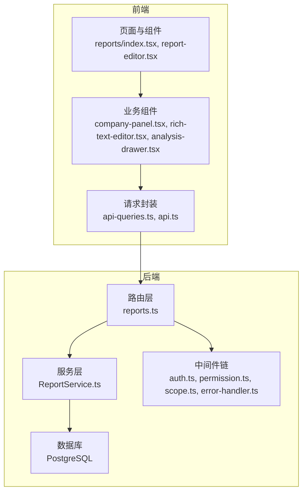
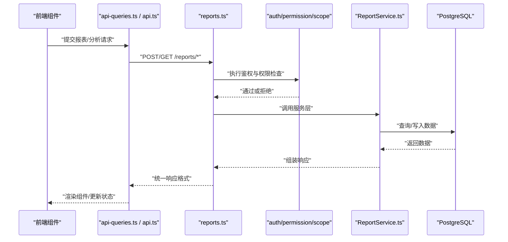
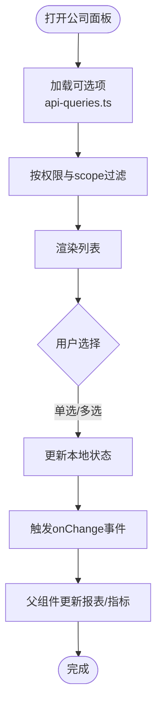
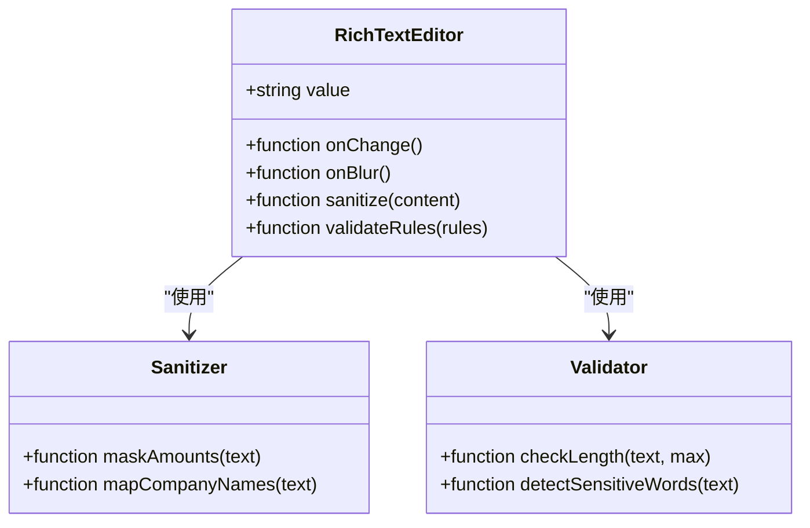
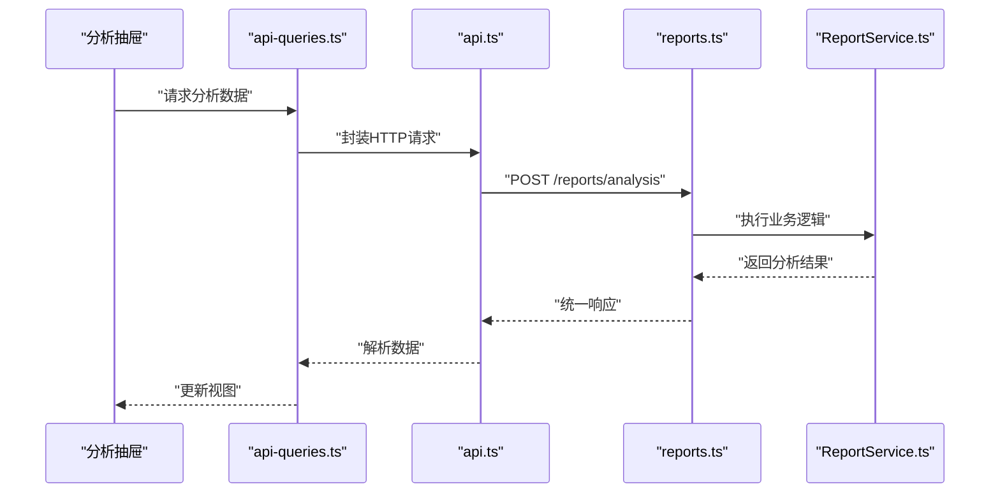
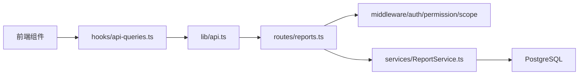

# 业务组件

<cite>
**本文引用的文件**   
- [web/src/components/dimension/company-panel.tsx](file://web/src/components/dimension/company-panel.tsx)
- [web/src/components/editor/rich-text-editor.tsx](file://web/src/components/editor/rich-text-editor.tsx)
- [web/src/components/indicators/analysis-drawer.tsx](file://web/src/components/indicators/analysis-drawer.tsx)
- [web/src/pages/reports/index.tsx](file://web/src/pages/reports/index.tsx)
- [web/src/pages/reports/report-editor.tsx](file://web/src/pages/reports/report-editor.tsx)
- [web/src/hooks/api-queries.ts](file://web/src/hooks/api-queries.ts)
- [web/src/lib/api.ts](file://web/src/lib/api.ts)
- [server/src/routes/reports.ts](file://server/src/routes/reports.ts)
- [server/src/services/ReportService.ts](file://server/src/services/ReportService.ts)
- [server/src/middleware/auth.ts](file://server/src/middleware/auth.ts)
- [server/src/middleware/permission.ts](file://server/src/middleware/permission.ts)
- [server/src/middleware/scope.ts](file://server/src/middleware/scope.ts)
- [server/src/middleware/error-handler.ts](file://server/src/middleware/error-handler.ts)
- [server/src/lib/formula.ts](file://server/src/lib/formula.ts)
- [server/src/lib/response.ts](file://server/src/lib/response.ts)
</cite>

## 目录
1. [简介](#简介)
2. [项目结构](#项目结构)
3. [核心组件](#核心组件)
4. [架构总览](#架构总览)
5. [详细组件分析](#详细组件分析)
6. [依赖关系分析](#依赖关系分析)
7. [性能考虑](#性能考虑)
8. [故障排查指南](#故障排查指南)
9. [结论](#结论)
10. [附录](#附录)

## 简介
本指南面向FY200项目的业务组件使用与集成，覆盖维度选择器、公司面板、富文本编辑器、分析抽屉等关键前端组件，并结合后端报表服务说明数据流、状态管理与事件处理模式。文档同时提供可扩展性与定制化开发方法，以及业务规则验证与错误处理的最佳实践，帮助开发者快速、安全地集成与扩展这些组件。

## 项目结构
FY200采用前后端分离架构：
- 前端（web）：基于React + TypeScript，组件位于src/components，页面位于src/pages，API调用封装在src/hooks与src/lib。
- 后端（server）：Express + Prisma + PostgreSQL，路由位于src/routes，服务逻辑位于src/services，中间件链负责鉴权、权限、作用域、审计与错误处理。

图表来源
- [web/src/pages/reports/index.tsx](file://web/src/pages/reports/index.tsx)
- [web/src/pages/reports/report-editor.tsx](file://web/src/pages/reports/report-editor.tsx)
- [web/src/components/dimension/company-panel.tsx](file://web/src/components/dimension/company-panel.tsx)
- [web/src/components/editor/rich-text-editor.tsx](file://web/src/components/editor/rich-text-editor.tsx)
- [web/src/components/indicators/analysis-drawer.tsx](file://web/src/components/indicators/analysis-drawer.tsx)
- [web/src/hooks/api-queries.ts](file://web/src/hooks/api-queries.ts)
- [web/src/lib/api.ts](file://web/src/lib/api.ts)
- [server/src/routes/reports.ts](file://server/src/routes/reports.ts)
- [server/src/services/ReportService.ts](file://server/src/services/ReportService.ts)
- [server/src/middleware/auth.ts](file://server/src/middleware/auth.ts)
- [server/src/middleware/permission.ts](file://server/src/middleware/permission.ts)
- [server/src/middleware/scope.ts](file://server/src/middleware/scope.ts)
- [server/src/middleware/error-handler.ts](file://server/src/middleware/error-handler.ts)

章节来源
- [web/src/pages/reports/index.tsx](file://web/src/pages/reports/index.tsx)
- [web/src/pages/reports/report-editor.tsx](file://web/src/pages/reports/report-editor.tsx)
- [web/src/components/dimension/company-panel.tsx](file://web/src/components/dimension/company-panel.tsx)
- [web/src/components/editor/rich-text-editor.tsx](file://web/src/components/editor/rich-text-editor.tsx)
- [web/src/components/indicators/analysis-drawer.tsx](file://web/src/components/indicators/analysis-drawer.tsx)
- [web/src/hooks/api-queries.ts](file://web/src/hooks/api-queries.ts)
- [web/src/lib/api.ts](file://web/src/lib/api.ts)
- [server/src/routes/reports.ts](file://server/src/routes/reports.ts)
- [server/src/services/ReportService.ts](file://server/src/services/ReportService.ts)
- [server/src/middleware/auth.ts](file://server/src/middleware/auth.ts)
- [server/src/middleware/permission.ts](file://server/src/middleware/permission.ts)
- [server/src/middleware/scope.ts](file://server/src/middleware/scope.ts)
- [server/src/middleware/error-handler.ts](file://server/src/middleware/error-handler.ts)

## 核心组件
- 公司面板（Company Panel）：用于选择公司与组织维度，联动指标计算与报表筛选。支持多选、搜索、级联过滤与权限作用域控制。
- 富文本编辑器（Rich Text Editor）：用于编辑报告描述、备注与分析说明，内置内容清洗、脱敏与格式校验。
- 分析抽屉（Analysis Drawer）：展示指标分析结果、趋势与对比，支持导出与交互操作。

章节来源
- [web/src/components/dimension/company-panel.tsx](file://web/src/components/dimension/company-panel.tsx)
- [web/src/components/editor/rich-text-editor.tsx](file://web/src/components/editor/rich-text-editor.tsx)
- [web/src/components/indicators/analysis-drawer.tsx](file://web/src/components/indicators/analysis-drawer.tsx)

## 架构总览
前端通过hooks与lib发起HTTP请求，后端路由接收并进入中间件链进行鉴权、权限与作用域控制，再由服务层执行业务逻辑与公式计算，最终返回结构化响应。

图表来源
- [web/src/hooks/api-queries.ts](file://web/src/hooks/api-queries.ts)
- [web/src/lib/api.ts](file://web/src/lib/api.ts)
- [server/src/routes/reports.ts](file://server/src/routes/reports.ts)
- [server/src/middleware/auth.ts](file://server/src/middleware/auth.ts)
- [server/src/middleware/permission.ts](file://server/src/middleware/permission.ts)
- [server/src/middleware/scope.ts](file://server/src/middleware/scope.ts)
- [server/src/services/ReportService.ts](file://server/src/services/ReportService.ts)

## 详细组件分析

### 公司面板（Company Panel）
- 功能特性
  - 多维度选择：公司、组织、时间范围等。
  - 权限作用域：根据当前用户角色与scope限制可选范围。
  - 联动更新：选择变化触发指标重算与报表刷新。
- 配置方法
  - 传入初始值与默认选中项。
  - 设置onChange回调以同步父组件状态。
  - 配置过滤条件与搜索行为。
- 业务逻辑与状态管理
  - 本地状态维护已选项与加载态。
  - 通过hooks发起API获取可选项，结合权限与scope过滤。
  - 防抖与缓存减少重复请求。
- 数据流与事件
  - 选择变更事件向上冒泡至父组件。
  - 父组件统一调度报表查询与指标计算。
- 可扩展性
  - 支持自定义过滤器与排序策略。
  - 可通过插槽或配置对象注入额外字段。

图表来源
- [web/src/components/dimension/company-panel.tsx](file://web/src/components/dimension/company-panel.tsx)
- [web/src/hooks/api-queries.ts](file://web/src/hooks/api-queries.ts)
- [server/src/middleware/scope.ts](file://server/src/middleware/scope.ts)

章节来源
- [web/src/components/dimension/company-panel.tsx](file://web/src/components/dimension/company-panel.tsx)
- [web/src/hooks/api-queries.ts](file://web/src/hooks/api-queries.ts)
- [server/src/middleware/scope.ts](file://server/src/middleware/scope.ts)

### 富文本编辑器（Rich Text Editor）
- 功能特性
  - 支持基础富文本格式与图片插入。
  - 内容清洗与脱敏：金额区间化、公司名称动态映射。
  - 输入校验：长度限制、敏感词检测。
- 配置方法
  - 设置初始内容与占位符。
  - 配置校验规则与回调函数。
  - 启用/禁用特定工具栏按钮。
- 业务逻辑与状态管理
  - 受控组件模式，value由父组件管理。
  - 实时预览与草稿保存。
- 数据流与事件
  - onChange事件携带清洗后的内容。
  - onBlur触发校验提示。
- 可扩展性
  - 插件机制扩展工具栏与处理器。
  - 自定义脱敏规则与校验策略。

图表来源
- [web/src/components/editor/rich-text-editor.tsx](file://web/src/components/editor/rich-text-editor.tsx)

章节来源
- [web/src/components/editor/rich-text-editor.tsx](file://web/src/components/editor/rich-text-editor.tsx)

### 分析抽屉（Analysis Drawer）
- 功能特性
  - 展示指标分析结果、趋势图与对比表。
  - 支持导出PDF/Excel与分享链接。
  - 交互操作：筛选、钻取、下钻到明细。
- 配置方法
  - 传入指标定义与数据源。
  - 配置图表类型与展示样式。
  - 设置导出选项与权限控制。
- 业务逻辑与状态管理
  - 本地状态管理展开/收起与加载态。
  - 异步加载分析结果，失败重试与降级显示。
- 数据流与事件
  - 通过hooks拉取数据，错误时上报日志。
  - 导出事件触发后端生成任务。
- 可扩展性
  - 新增指标类型与可视化组件。
  - 自定义导出模板与分享策略。

图表来源
- [web/src/components/indicators/analysis-drawer.tsx](file://web/src/components/indicators/analysis-drawer.tsx)
- [web/src/hooks/api-queries.ts](file://web/src/hooks/api-queries.ts)
- [web/src/lib/api.ts](file://web/src/lib/api.ts)
- [server/src/routes/reports.ts](file://server/src/routes/reports.ts)
- [server/src/services/ReportService.ts](file://server/src/services/ReportService.ts)

章节来源
- [web/src/components/indicators/analysis-drawer.tsx](file://web/src/components/indicators/analysis-drawer.tsx)
- [web/src/hooks/api-queries.ts](file://web/src/hooks/api-queries.ts)
- [web/src/lib/api.ts](file://web/src/lib/api.ts)
- [server/src/routes/reports.ts](file://server/src/routes/reports.ts)
- [server/src/services/ReportService.ts](file://server/src/services/ReportService.ts)

### 页面集成示例（报表页与编辑器）
- 报表页（reports/index.tsx）
  - 组合公司面板、分析抽屉与数据表格。
  - 统一管理筛选状态与分页。
- 编辑器（report-editor.tsx）
  - 嵌入富文本编辑器用于报告内容编辑。
  - 保存与版本控制逻辑。

章节来源
- [web/src/pages/reports/index.tsx](file://web/src/pages/reports/index.tsx)
- [web/src/pages/reports/report-editor.tsx](file://web/src/pages/reports/report-editor.tsx)

## 依赖关系分析
- 前端依赖
  - hooks与lib模块封装HTTP请求与错误处理。
  - 组件间通过props与事件通信，避免直接耦合。
- 后端依赖
  - 路由层依赖中间件链确保安全性与一致性。
  - 服务层依赖Prisma与数据库，公式计算使用安全解析器。

图表来源
- [web/src/components/dimension/company-panel.tsx](file://web/src/components/dimension/company-panel.tsx)
- [web/src/components/editor/rich-text-editor.tsx](file://web/src/components/editor/rich-text-editor.tsx)
- [web/src/components/indicators/analysis-drawer.tsx](file://web/src/components/indicators/analysis-drawer.tsx)
- [web/src/hooks/api-queries.ts](file://web/src/hooks/api-queries.ts)
- [web/src/lib/api.ts](file://web/src/lib/api.ts)
- [server/src/routes/reports.ts](file://server/src/routes/reports.ts)
- [server/src/middleware/auth.ts](file://server/src/middleware/auth.ts)
- [server/src/middleware/permission.ts](file://server/src/middleware/permission.ts)
- [server/src/middleware/scope.ts](file://server/src/middleware/scope.ts)
- [server/src/services/ReportService.ts](file://server/src/services/ReportService.ts)

章节来源
- [web/src/hooks/api-queries.ts](file://web/src/hooks/api-queries.ts)
- [web/src/lib/api.ts](file://web/src/lib/api.ts)
- [server/src/routes/reports.ts](file://server/src/routes/reports.ts)
- [server/src/middleware/auth.ts](file://server/src/middleware/auth.ts)
- [server/src/middleware/permission.ts](file://server/src/middleware/permission.ts)
- [server/src/middleware/scope.ts](file://server/src/middleware/scope.ts)
- [server/src/services/ReportService.ts](file://server/src/services/ReportService.ts)

## 性能考虑
- 前端优化
  - 使用防抖与节流减少频繁请求。
  - 虚拟滚动与分页加载大数据集。
  - 组件懒加载与代码分割。
- 后端优化
  - 数据库索引与查询优化。
  - 缓存热点数据与结果集。
  - 异步任务与队列处理耗时操作。

## 故障排查指南
- 常见问题
  - 鉴权失败：检查JWT令牌与黑名单。
  - 权限不足：确认用户角色与资源权限。
  - 作用域限制：验证scope配置与数据可见性。
- 错误处理最佳实践
  - 统一错误码与消息格式。
  - 前端友好提示与重试机制。
  - 后端日志记录与监控告警。

章节来源
- [server/src/middleware/auth.ts](file://server/src/middleware/auth.ts)
- [server/src/middleware/permission.ts](file://server/src/middleware/permission.ts)
- [server/src/middleware/scope.ts](file://server/src/middleware/scope.ts)
- [server/src/middleware/error-handler.ts](file://server/src/middleware/error-handler.ts)
- [server/src/lib/response.ts](file://server/src/lib/response.ts)

## 结论
FY200项目的业务组件设计清晰、职责明确，通过前后端协作实现了高效的数据处理与展示。遵循本指南的集成方法与最佳实践，开发者可以快速扩展与定制组件以满足业务需求。

## 附录
- 公式计算与安全解析
  - 使用白名单算子避免eval风险。
  - 同比/环比实时计算不存库。
- AI双管道架构
  - polish管道：文本→脱敏→LLM→还原。
  - analyze管道：结构化→计算→脱敏→LLM→生成。

章节来源
- [server/src/lib/formula.ts](file://server/src/lib/formula.ts)