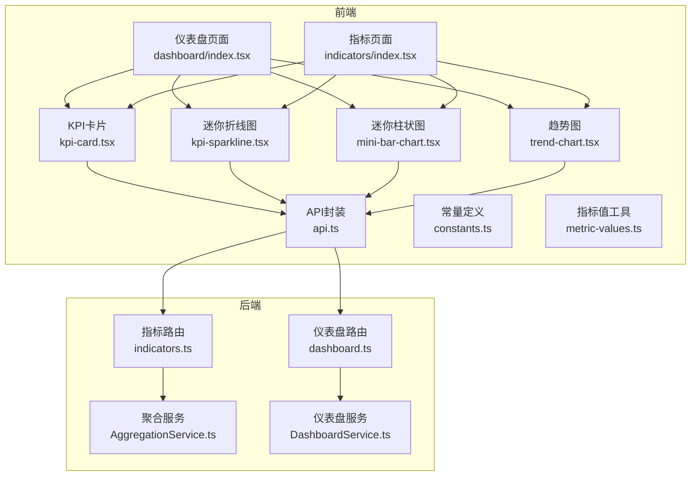
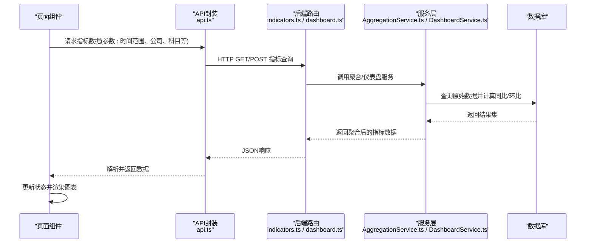
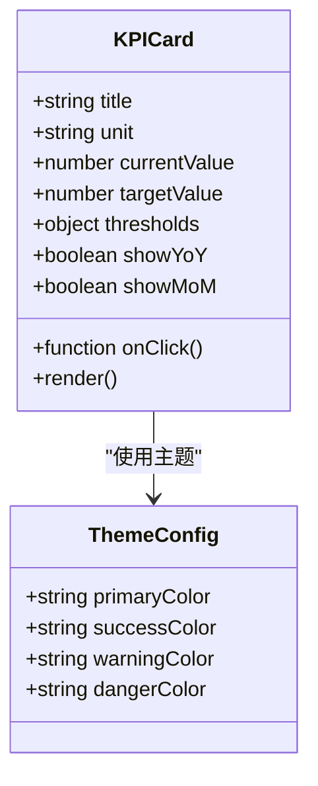
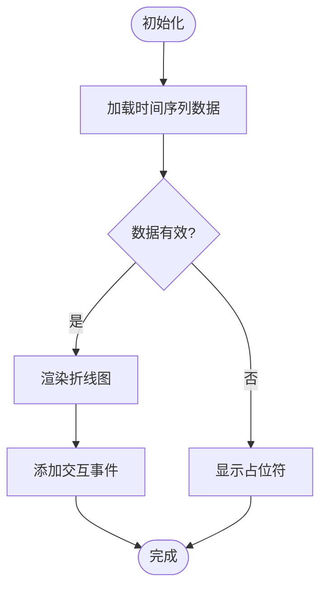
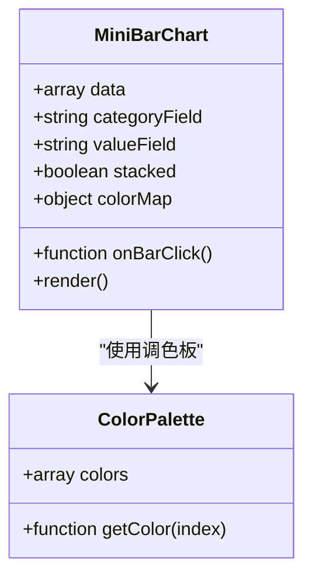
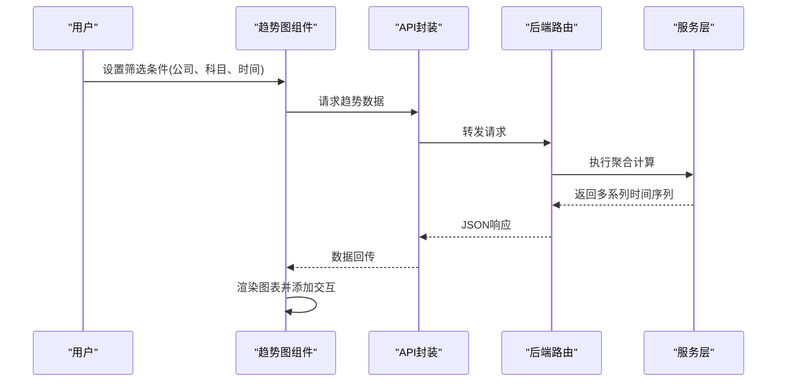
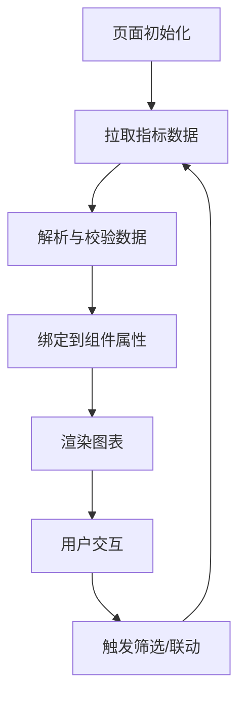
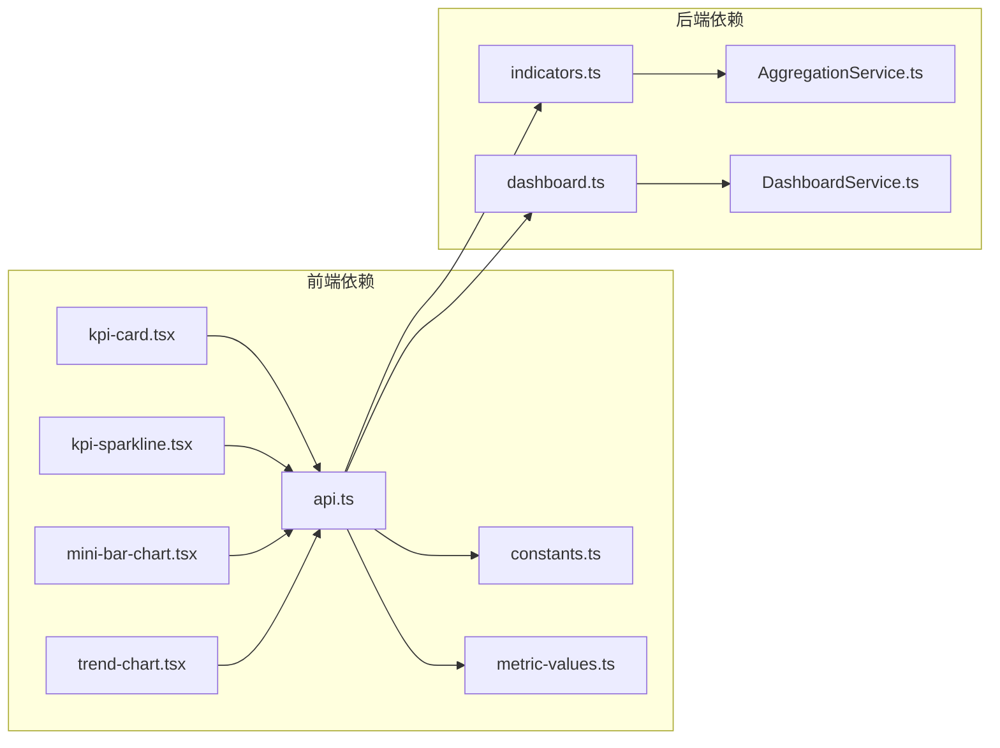

# 图表可视化组件

<cite>
**本文引用的文件**   
- [kpi-card.tsx](file://web/src/components/charts/kpi-card.tsx)
- [kpi-sparkline.tsx](file://web/src/components/charts/kpi-sparkline.tsx)
- [mini-bar-chart.tsx](file://web/src/components/charts/mini-bar-chart.tsx)
- [trend-chart.tsx](file://web/src/components/charts/trend-chart.tsx)
- [dashboard/index.tsx](file://web/src/pages/dashboard/index.tsx)
- [indicators/index.tsx](file://web/src/pages/indicators/index.tsx)
- [api.ts](file://web/src/lib/api.ts)
- [constants.ts](file://web/src/lib/constants.ts)
- [metric-values.ts](file://web/src/lib/metric-values.ts)
- [AggregationService.ts](file://server/src/services/AggregationService.ts)
- [DashboardService.ts](file://server/src/services/DashboardService.ts)
- [indicators.ts](file://server/src/routes/indicators.ts)
- [dashboard.ts](file://server/src/routes/dashboard.ts)
</cite>

## 目录
1. [简介](#简介)
2. [项目结构](#项目结构)
3. [核心组件](#核心组件)
4. [架构总览](#架构总览)
5. [详细组件分析](#详细组件分析)
6. [依赖关系分析](#依赖关系分析)
7. [性能考虑](#性能考虑)
8. [故障排查指南](#故障排查指南)
9. [结论](#结论)
10. [附录](#附录)

## 简介
本文件面向FY200财年经营数据分析平台的前端图表可视化组件，聚焦KPI卡片、迷你折线图（火花线）、柱状图与趋势图的配置选项、数据绑定方式、主题定制、颜色配置、动画效果与交互行为。文档同时阐述数据的实时更新机制与性能优化策略，并提供财务指标展示、趋势分析、对比分析等典型场景的配置示例。最后给出响应式设计与移动端适配方案，以及可访问性与SEO优化建议。

## 项目结构
前端图表组件位于 web/src/components/charts 目录下，包含四个核心组件：
- KPI卡片：用于展示关键指标的当前值、同比/环比、状态标识等
- 迷你折线图：用于在有限空间内展示短期趋势
- 迷你柱状图：用于对比多个维度或时间点的数值
- 趋势图：用于展示较长时间跨度的趋势变化与多系列对比

这些组件通过统一的API层与服务端聚合服务对接，获取实时或近实时的指标数据，并在页面中渲染为交互式图表。

**图示来源** 
- [dashboard/index.tsx](file://web/src/pages/dashboard/index.tsx)
- [indicators/index.tsx](file://web/src/pages/indicators/index.tsx)
- [kpi-card.tsx](file://web/src/components/charts/kpi-card.tsx)
- [kpi-sparkline.tsx](file://web/src/components/charts/kpi-sparkline.tsx)
- [mini-bar-chart.tsx](file://web/src/components/charts/mini-bar-chart.tsx)
- [trend-chart.tsx](file://web/src/components/charts/trend-chart.tsx)
- [api.ts](file://web/src/lib/api.ts)
- [constants.ts](file://web/src/lib/constants.ts)
- [metric-values.ts](file://web/src/lib/metric-values.ts)
- [indicators.ts](file://server/src/routes/indicators.ts)
- [dashboard.ts](file://server/src/routes/dashboard.ts)
- [AggregationService.ts](file://server/src/services/AggregationService.ts)
- [DashboardService.ts](file://server/src/services/DashboardService.ts)

**章节来源**
- [dashboard/index.tsx](file://web/src/pages/dashboard/index.tsx)
- [indicators/index.tsx](file://web/src/pages/indicators/index.tsx)
- [kpi-card.tsx](file://web/src/components/charts/kpi-card.tsx)
- [kpi-sparkline.tsx](file://web/src/components/charts/kpi-sparkline.tsx)
- [mini-bar-chart.tsx](file://web/src/components/charts/mini-bar-chart.tsx)
- [trend-chart.tsx](file://web/src/components/charts/trend-chart.tsx)
- [api.ts](file://web/src/lib/api.ts)
- [constants.ts](file://web/src/lib/constants.ts)
- [metric-values.ts](file://web/src/lib/metric-values.ts)
- [indicators.ts](file://server/src/routes/indicators.ts)
- [dashboard.ts](file://server/src/routes/dashboard.ts)
- [AggregationService.ts](file://server/src/services/AggregationService.ts)
- [DashboardService.ts](file://server/src/services/DashboardService.ts)

## 核心组件
- KPI卡片：支持标题、单位、格式化显示、同比/环比计算、状态指示、阈值告警、点击跳转等能力。适合展示收入、利润、成本等关键财务指标。
- 迷你折线图：轻量级时间序列展示，支持平滑曲线、点标记、区间选择、Tooltip提示、缩放与拖拽。适合短期波动观察。
- 迷你柱状图：分组/堆叠柱状图，支持颜色映射、标签显示、排序与筛选。适合多维度对比与排名。
- 趋势图：多系列时间序列，支持双轴、交叉线、区域填充、动态过滤、导出与打印。适合中长期趋势分析与对比。

上述组件均遵循统一的数据契约与主题接口，便于在业务页面中组合使用。

**章节来源**
- [kpi-card.tsx](file://web/src/components/charts/kpi-card.tsx)
- [kpi-sparkline.tsx](file://web/src/components/charts/kpi-sparkline.tsx)
- [mini-bar-chart.tsx](file://web/src/components/charts/mini-bar-chart.tsx)
- [trend-chart.tsx](file://web/src/components/charts/trend-chart.tsx)

## 架构总览
图表数据流从前端的页面组件发起请求，经由API封装调用后端路由，路由再调用服务层进行指标聚合与计算，最终返回结构化数据供前端渲染。

**图示来源** 
- [api.ts](file://web/src/lib/api.ts)
- [indicators.ts](file://server/src/routes/indicators.ts)
- [dashboard.ts](file://server/src/routes/dashboard.ts)
- [AggregationService.ts](file://server/src/services/AggregationService.ts)
- [DashboardService.ts](file://server/src/services/DashboardService.ts)

**章节来源**
- [api.ts](file://web/src/lib/api.ts)
- [indicators.ts](file://server/src/routes/indicators.ts)
- [dashboard.ts](file://server/src/routes/dashboard.ts)
- [AggregationService.ts](file://server/src/services/AggregationService.ts)
- [DashboardService.ts](file://server/src/services/DashboardService.ts)

## 详细组件分析

### KPI卡片组件
- 配置项
  - 标题、单位、格式化规则（金额、百分比）
  - 当前值、目标值、阈值区间
  - 同比/环比字段、计算逻辑
  - 状态指示（正常、预警、异常）
  - 点击行为（跳转详情、打开抽屉）
- 数据绑定
  - 从API返回的指标对象映射到组件属性
  - 支持空值与异常值的占位显示
- 主题与颜色
  - 支持全局主题色与组件级覆盖
  - 根据阈值自动切换颜色（如红绿涨跌）
- 动画与交互
  - 数值变化时数字滚动动画
  - Tooltip显示明细与说明
  - 点击触发导航或弹窗

**图示来源** 
- [kpi-card.tsx](file://web/src/components/charts/kpi-card.tsx)
- [constants.ts](file://web/src/lib/constants.ts)

**章节来源**
- [kpi-card.tsx](file://web/src/components/charts/kpi-card.tsx)
- [constants.ts](file://web/src/lib/constants.ts)

### 迷你折线图组件
- 配置项
  - 时间轴字段、数值字段、系列名称
  - 平滑曲线开关、点标记显示
  - Tooltip格式、坐标轴刻度
  - 区间选择与缩放
- 数据绑定
  - 将时间序列数组映射为图表数据集
  - 支持多系列叠加与颜色映射
- 主题与颜色
  - 线条颜色、背景网格、阴影填充
  - 暗色模式适配
- 动画与交互
  - 入场动画、悬停高亮、拖拽平移
  - 双击重置视图

**图示来源** 
- [kpi-sparkline.tsx](file://web/src/components/charts/kpi-sparkline.tsx)

**章节来源**
- [kpi-sparkline.tsx](file://web/src/components/charts/kpi-sparkline.tsx)

### 迷你柱状图组件
- 配置项
  - 分类字段、数值字段、分组/堆叠模式
  - 颜色映射表、排序规则
  - 标签显示、百分比模式
- 数据绑定
  - 将分类-数值对映射为柱状数据集
  - 支持多系列对比
- 主题与颜色
  - 柱体颜色、边框、阴影
  - 自定义调色板
- 动画与交互
  - 柱体入场动画、悬停放大
  - 点击筛选与联动

**图示来源** 
- [mini-bar-chart.tsx](file://web/src/components/charts/mini-bar-chart.tsx)
- [constants.ts](file://web/src/lib/constants.ts)

**章节来源**
- [mini-bar-chart.tsx](file://web/src/components/charts/mini-bar-chart.tsx)
- [constants.ts](file://web/src/lib/constants.ts)

### 趋势图组件
- 配置项
  - 多系列时间序列、双轴配置
  - 区域填充、交叉线、参考线
  - 动态过滤、导出与打印
- 数据绑定
  - 将多系列时间序列映射为图表数据集
  - 支持按公司、科目、期间筛选
- 主题与颜色
  - 系列颜色、轴线样式、网格线
  - 暗色模式与打印样式
- 动画与交互
  - 系列切换动画、悬停提示、缩放和平移
  - 联动其他图表的筛选

**图示来源** 
- [trend-chart.tsx](file://web/src/components/charts/trend-chart.tsx)
- [api.ts](file://web/src/lib/api.ts)
- [indicators.ts](file://server/src/routes/indicators.ts)
- [AggregationService.ts](file://server/src/services/AggregationService.ts)

**章节来源**
- [trend-chart.tsx](file://web/src/components/charts/trend-chart.tsx)
- [api.ts](file://web/src/lib/api.ts)
- [indicators.ts](file://server/src/routes/indicators.ts)
- [AggregationService.ts](file://server/src/services/AggregationService.ts)

### 概念性概览
以下流程图展示了图表组件在业务页面中的通用工作流，不直接对应具体代码文件。

[此图为概念性流程，无需图示来源]

## 依赖关系分析
图表组件依赖前端的API封装、常量定义与指标值工具；后端通过路由与服务层提供聚合计算能力。

**图示来源** 
- [kpi-card.tsx](file://web/src/components/charts/kpi-card.tsx)
- [kpi-sparkline.tsx](file://web/src/components/charts/kpi-sparkline.tsx)
- [mini-bar-chart.tsx](file://web/src/components/charts/mini-bar-chart.tsx)
- [trend-chart.tsx](file://web/src/components/charts/trend-chart.tsx)
- [api.ts](file://web/src/lib/api.ts)
- [constants.ts](file://web/src/lib/constants.ts)
- [metric-values.ts](file://web/src/lib/metric-values.ts)
- [indicators.ts](file://server/src/routes/indicators.ts)
- [dashboard.ts](file://server/src/routes/dashboard.ts)
- [AggregationService.ts](file://server/src/services/AggregationService.ts)
- [DashboardService.ts](file://server/src/services/DashboardService.ts)

**章节来源**
- [api.ts](file://web/src/lib/api.ts)
- [constants.ts](file://web/src/lib/constants.ts)
- [metric-values.ts](file://web/src/lib/metric-values.ts)
- [indicators.ts](file://server/src/routes/indicators.ts)
- [dashboard.ts](file://server/src/routes/dashboard.ts)
- [AggregationService.ts](file://server/src/services/AggregationService.ts)
- [DashboardService.ts](file://server/src/services/DashboardService.ts)

## 性能考虑
- 数据缓存与去重：对相同参数的请求进行缓存，避免重复网络请求
- 增量更新：仅更新变化的数据片段，减少重渲染开销
- 虚拟滚动：大数据量时使用虚拟列表提升渲染性能
- 防抖与节流：对频繁交互（如拖拽、缩放）进行节流处理
- 服务端聚合：复杂计算在后端完成，减轻前端负担
- 懒加载：按需加载图表库与资源，缩短首屏时间

[本节为通用指导，无需章节来源]

## 故障排查指南
- 数据为空或异常
  - 检查API返回结构与字段映射
  - 验证时间范围与筛选条件是否合法
  - 查看后端日志与数据库查询结果
- 渲染失败
  - 确认组件属性类型与默认值
  - 检查主题配置与颜色映射
  - 调试浏览器控制台错误信息
- 性能问题
  - 监控网络请求与响应时间
  - 分析渲染耗时与内存占用
  - 优化数据量与更新频率

**章节来源**
- [api.ts](file://web/src/lib/api.ts)
- [kpi-card.tsx](file://web/src/components/charts/kpi-card.tsx)
- [kpi-sparkline.tsx](file://web/src/components/charts/kpi-sparkline.tsx)
- [mini-bar-chart.tsx](file://web/src/components/charts/mini-bar-chart.tsx)
- [trend-chart.tsx](file://web/src/components/charts/trend-chart.tsx)

## 结论
FY200项目的图表可视化组件提供了丰富的配置选项与灵活的交互能力，适用于财务指标展示、趋势分析与对比分析等多种业务场景。通过统一的主题定制与颜色配置，组件能够适应不同的视觉需求。结合后端的实时计算与前端的数据缓存策略，系统在性能与用户体验之间取得了良好平衡。建议在后续迭代中进一步优化响应式设计与可访问性，以提升移动端体验与包容性。

[本节为总结性内容，无需章节来源]

## 附录
- 响应式设计建议
  - 使用弹性布局与媒体查询适配不同屏幕尺寸
  - 在小屏幕上简化图表细节，突出关键信息
  - 支持触摸手势操作，提升移动端交互体验
- SEO优化建议
  - 为图表提供语义化HTML描述
  - 使用结构化数据标注关键指标
  - 确保文本内容与图片替代文本的可读性
- 可访问性支持
  - 提供键盘导航与屏幕阅读器支持
  - 确保颜色对比度符合WCAG标准
  - 为交互元素添加ARIA属性

[本节为通用指导，无需章节来源]