# 基础UI组件

<cite>
**本文引用的文件**   
- [button.tsx](file://web/src/components/ui/button.tsx)
- [card.tsx](file://web/src/components/ui/card.tsx)
- [input.tsx](file://web/src/components/ui/input.tsx)
- [select.tsx](file://web/src/components/ui/select.tsx)
- [dialog.tsx](file://web/src/components/ui/dialog.tsx)
- [confirm-dialog.tsx](file://web/src/components/ui/confirm-dialog.tsx)
- [badge.tsx](file://web/src/components/ui/badge.tsx)
- [avatar.tsx](file://web/src/components/ui/avatar.tsx)
- [label.tsx](file://web/src/components/ui/label.tsx)
- [tooltip.tsx](file://web/src/components/ui/tooltip.tsx)
- [skeleton.tsx](file://web/src/components/ui/skeleton.tsx)
- [skeleton-blocks.tsx](file://web/src/components/ui/skeleton-blocks.tsx)
- [status-indicator.tsx](file://web/src/components/ui/status-indicator.tsx)
- [switch.tsx](file://web/src/components/ui/switch.tsx)
- [tabs.tsx](file://web/src/components/ui/tabs.tsx)
- [separator.tsx](file://web/src/components/ui/separator.tsx)
- [dropdown-menu.tsx](file://web/src/components/ui/dropdown-menu.tsx)
- [main-layout.tsx](file://web/src/components/layout/main-layout.tsx)
- [page-container.tsx](file://web/src/components/layout/page-container.tsx)
- [App.tsx](file://web/src/App.tsx)
- [main.tsx](file://web/src/main.tsx)
- [globals.css](file://web/src/styles/globals.css)
- [tailwind.config.js](file://web/tailwind.config.js)
- [vite.config.ts](file://web/vite.config.ts)
</cite>

## 目录
1. [简介](#简介)
2. [项目结构](#项目结构)
3. [核心组件](#核心组件)
4. [架构总览](#架构总览)
5. [详细组件分析](#详细组件分析)
6. [依赖关系分析](#依赖关系分析)
7. [性能考量](#性能考量)
8. [故障排查指南](#故障排查指南)
9. [结论](#结论)
10. [附录](#附录)

## 简介
本文件为 FY200 项目基础 UI 组件的使用文档，聚焦 Button、Card、Input、Select、Dialog、Badge、Avatar 等核心组件。内容涵盖：
- Props 配置与事件处理
- 样式定制与主题适配（Tailwind CSS）
- 可访问性（a11y）支持与国际化（i18n）建议
- 响应式行为与组合使用模式
- 表单集成、状态管理、错误处理的实践示例
- 性能优化与最佳实践

FY200 是浙江壹品慧财年经营数据分析平台，定位“Excel进、看板/报表出”的内部管理口径财务数据平台，单位统一为万元/人民币。前端基于 React + Vite + Tailwind CSS，UI 组件位于 web/src/components/ui。

## 项目结构
基础 UI 组件集中在 web/src/components/ui，布局与页面级容器在 web/src/components/layout，全局样式与主题由 Tailwind 配置驱动。入口文件为 main.tsx 与 App.tsx。

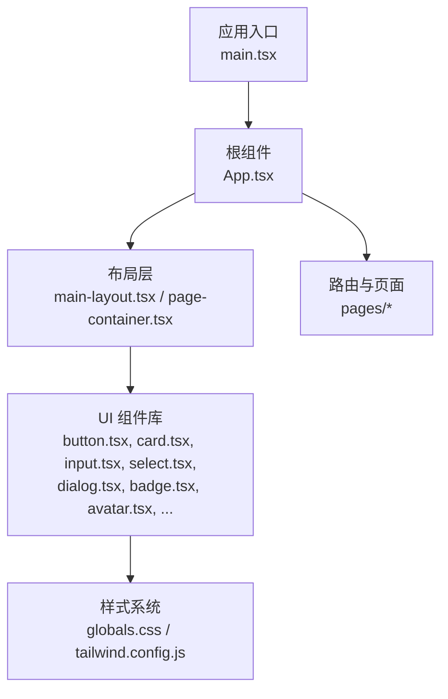

图表来源
- [main.tsx](file://web/src/main.tsx)
- [App.tsx](file://web/src/App.tsx)
- [main-layout.tsx](file://web/src/components/layout/main-layout.tsx)
- [page-container.tsx](file://web/src/components/layout/page-container.tsx)
- [globals.css](file://web/src/styles/globals.css)
- [tailwind.config.js](file://web/tailwind.config.js)

章节来源
- [main.tsx](file://web/src/main.tsx)
- [App.tsx](file://web/src/App.tsx)
- [main-layout.tsx](file://web/src/components/layout/main-layout.tsx)
- [page-container.tsx](file://web/src/components/layout/page-container.tsx)
- [globals.css](file://web/src/styles/globals.css)
- [tailwind.config.js](file://web/tailwind.config.js)

## 核心组件
本节概述各组件的职责与常见用法要点（Props、事件、样式、可访问性）。具体实现细节请参考对应文件的源码路径。

- Button 按钮
  - 用途：触发操作或导航
  - 常用能力：加载态、禁用态、尺寸变体、图标支持、键盘可达
  - 事件：onClick、onKeyDown、onFocus、onBlur
  - 样式：通过 className 与 Tailwind 类名覆盖；支持主题色扩展
  - 可访问性：role="button"、tabIndex、aria-* 属性、焦点可见性

- Card 卡片
  - 用途：信息分组与展示
  - 常用能力：标题、描述、动作区、阴影与圆角
  - 事件：点击穿透控制、内部交互隔离
  - 样式：容器化布局，配合 Grid/Flex 进行响应式排版
  - 可访问性：语义化标签、标题层级合理

- Input 输入框
  - 用途：文本输入、搜索、过滤
  - 常用能力：受控与非受控、占位符、前缀/后缀、只读/禁用、校验提示
  - 事件：onChange、onSubmit、onFocus、onBlur、onKeyDown
  - 样式：边框、颜色、尺寸、错误高亮
  - 可访问性：关联 Label、aria-invalid、aria-describedby

- Select 选择器
  - 用途：单选/多选下拉
  - 常用能力：选项渲染、搜索过滤、分组、虚拟滚动（按需）
  - 事件：onChange、onOpenChange、onClose
  - 样式：下拉面板定位、滚动条、选中态
  - 可访问性：ARIA 列表、键盘导航、焦点管理

- Dialog 对话框
  - 用途：模态交互、确认、表单弹窗
  - 常用能力：打开/关闭、遮罩、ESC 关闭、焦点陷阱
  - 事件：onOpenChange、onClose、onSubmit
  - 样式：层级 z-index、动画、响应式宽度
  - 可访问性：role="dialog"、aria-modal、焦点管理、Esc 关闭

- Badge 徽章
  - 用途：状态标记、计数、标签
  - 常用能力：颜色变体、形状、大小
  - 事件：通常无交互，仅展示
  - 样式：背景色、边框、内边距
  - 可访问性：语义化 span/div，必要时 aria-label

- Avatar 头像
  - 用途：用户标识、头像展示
  - 常用能力：图片、占位符、尺寸、失败回退
  - 事件：onError（图片加载失败）
  - 样式：圆形裁剪、边框、阴影
  - 可访问性：alt 文本、loading 懒加载

章节来源
- [button.tsx](file://web/src/components/ui/button.tsx)
- [card.tsx](file://web/src/components/ui/card.tsx)
- [input.tsx](file://web/src/components/ui/input.tsx)
- [select.tsx](file://web/src/components/ui/select.tsx)
- [dialog.tsx](file://web/src/components/ui/dialog.tsx)
- [badge.tsx](file://web/src/components/ui/badge.tsx)
- [avatar.tsx](file://web/src/components/ui/avatar.tsx)

## 架构总览
UI 组件遵循“轻量封装 + 样式解耦”的设计原则：
- 组件层：React 函数组件，暴露稳定 Props 接口
- 样式层：Tailwind CSS 原子类 + 自定义主题变量
- 布局层：Layout 组件提供页面骨架与响应式断点
- 主题层：通过 Tailwind 配置与 CSS 变量统一管理

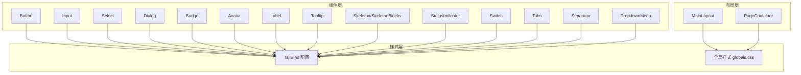

图表来源
- [button.tsx](file://web/src/components/ui/button.tsx)
- [input.tsx](file://web/src/components/ui/input.tsx)
- [select.tsx](file://web/src/components/ui/select.tsx)
- [dialog.tsx](file://web/src/components/ui/dialog.tsx)
- [badge.tsx](file://web/src/components/ui/badge.tsx)
- [avatar.tsx](file://web/src/components/ui/avatar.tsx)
- [label.tsx](file://web/src/components/ui/label.tsx)
- [tooltip.tsx](file://web/src/components/ui/tooltip.tsx)
- [skeleton.tsx](file://web/src/components/ui/skeleton.tsx)
- [skeleton-blocks.tsx](file://web/src/components/ui/skeleton-blocks.tsx)
- [status-indicator.tsx](file://web/src/components/ui/status-indicator.tsx)
- [switch.tsx](file://web/src/components/ui/switch.tsx)
- [tabs.tsx](file://web/src/components/ui/tabs.tsx)
- [separator.tsx](file://web/src/components/ui/separator.tsx)
- [dropdown-menu.tsx](file://web/src/components/ui/dropdown-menu.tsx)
- [main-layout.tsx](file://web/src/components/layout/main-layout.tsx)
- [page-container.tsx](file://web/src/components/layout/page-container.tsx)
- [globals.css](file://web/src/styles/globals.css)
- [tailwind.config.js](file://web/tailwind.config.js)

## 详细组件分析

### Button 按钮
- 设计要点
  - 支持多种尺寸与视觉变体（主按钮、次按钮、危险按钮等）
  - 内置加载态与禁用态，避免重复提交
  - 支持图标与文字组合，保持对齐一致
- 关键 Props（示例字段，实际以源码为准）
  - variant: 视觉风格
  - size: 尺寸
  - disabled: 禁用
  - loading: 加载
  - icon: 图标节点
  - onClick: 点击回调
  - onKeyDown/onFocus/onBlur: 键盘与焦点事件
- 事件处理
  - 防抖/节流：对高频点击进行保护
  - 异步操作：loading 态与错误反馈
- 样式定制
  - 通过 className 追加 Tailwind 类
  - 主题色通过 Tailwind 配置扩展
- 可访问性
  - role="button"、tabIndex、aria-disabled、aria-busy
  - 焦点可见性与键盘可达
- 组合使用
  - 与 Tooltip 搭配显示操作说明
  - 与 Icon 组合表达意图

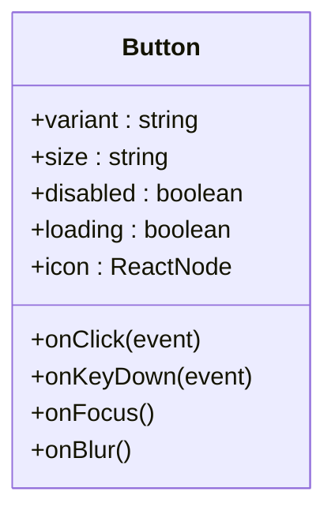

图表来源
- [button.tsx](file://web/src/components/ui/button.tsx)

章节来源
- [button.tsx](file://web/src/components/ui/button.tsx)
- [tooltip.tsx](file://web/src/components/ui/tooltip.tsx)

### Card 卡片
- 设计要点
  - 信息分组容器，适合 KPI、报表摘要、操作面板
  - 标题、描述、动作区分离，便于复用
- 关键 Props
  - title: 标题
  - description: 描述
  - actions: 动作区节点
  - className: 自定义样式
- 事件处理
  - 点击穿透控制，避免误触
- 样式定制
  - 阴影、圆角、间距、响应式网格
- 可访问性
  - 语义化标题层级，确保屏幕阅读器顺序正确

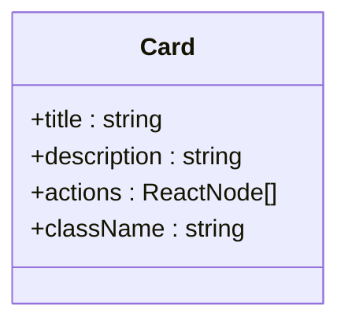

图表来源
- [card.tsx](file://web/src/components/ui/card.tsx)

章节来源
- [card.tsx](file://web/src/components/ui/card.tsx)

### Input 输入框
- 设计要点
  - 受控与非受控两种模式，默认推荐受控
  - 支持前缀/后缀、只读、禁用、校验提示
- 关键 Props
  - value/onChange: 受控值
  - placeholder: 占位符
  - prefix/suffix: 前后缀节点
  - readOnly/disabled: 状态
  - error/helperText: 校验与帮助文本
  - id/name: 表单关联
- 事件处理
  - onChange 统一类型转换
  - onBlur 触发校验
  - onSubmit 表单提交
- 样式定制
  - 边框颜色、错误高亮、尺寸
- 可访问性
  - 关联 Label（id + htmlFor）
  - aria-invalid、aria-describedby

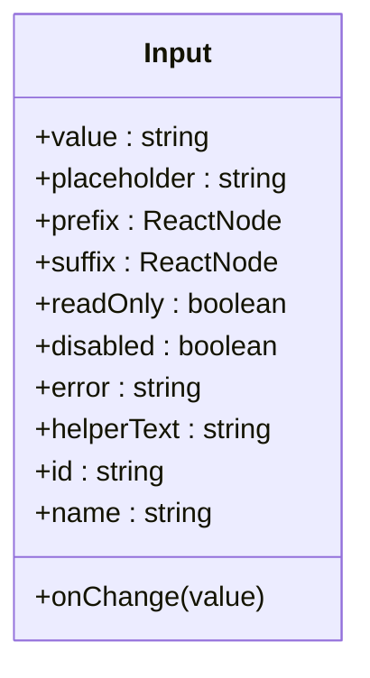

图表来源
- [input.tsx](file://web/src/components/ui/input.tsx)
- [label.tsx](file://web/src/components/ui/label.tsx)

章节来源
- [input.tsx](file://web/src/components/ui/input.tsx)
- [label.tsx](file://web/src/components/ui/label.tsx)

### Select 选择器
- 设计要点
  - 单选/多选、搜索过滤、分组、虚拟滚动（可选）
- 关键 Props
  - options: 选项数组
  - value/multiple: 值与多选
  - searchable: 是否可搜索
  - onOpenChange: 打开/关闭回调
  - renderOption: 自定义选项渲染
- 事件处理
  - onChange 值变更
  - onOpenChange 打开/关闭
- 样式定制
  - 下拉面板定位、滚动条、选中态
- 可访问性
  - ARIA 列表、键盘导航、焦点管理

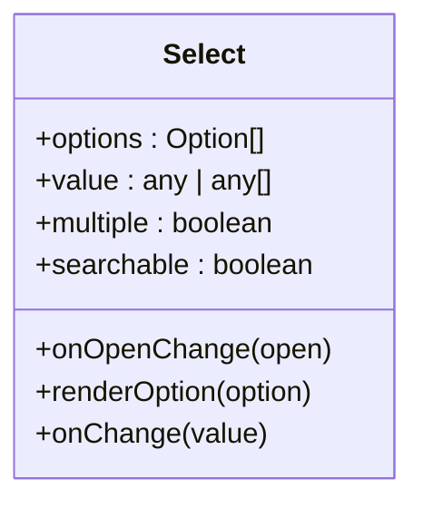

图表来源
- [select.tsx](file://web/src/components/ui/select.tsx)

章节来源
- [select.tsx](file://web/src/components/ui/select.tsx)

### Dialog 对话框
- 设计要点
  - 模态交互、确认、表单弹窗
  - 遮罩、ESC 关闭、焦点陷阱
- 关键 Props
  - open: 打开状态
  - onClose: 关闭回调
  - title: 标题
  - content: 内容节点
  - footer: 底部动作区
- 事件处理
  - onOpenChange: 打开/关闭
  - ESC 关闭、点击遮罩关闭
- 样式定制
  - 层级 z-index、动画、响应式宽度
- 可访问性
  - role="dialog"、aria-modal、焦点管理

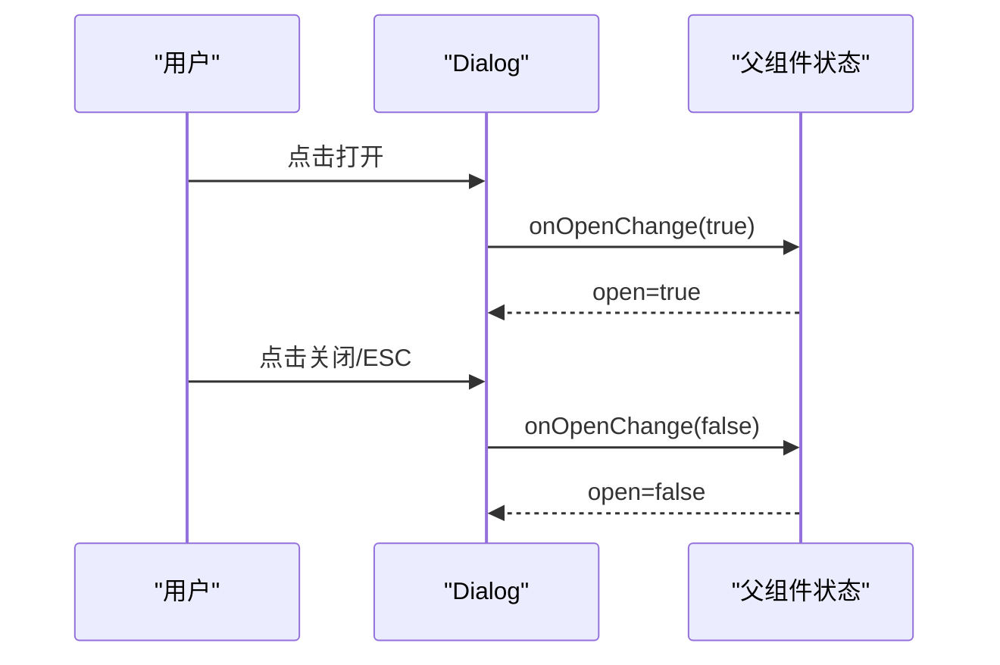

图表来源
- [dialog.tsx](file://web/src/components/ui/dialog.tsx)

章节来源
- [dialog.tsx](file://web/src/components/ui/dialog.tsx)

### ConfirmDialog 确认对话框
- 设计要点
  - 用于危险操作的二次确认
- 关键 Props
  - open: 打开状态
  - onConfirm: 确认回调
  - onCancel: 取消回调
  - message: 提示文案
- 事件处理
  - 确认/取消分支逻辑
- 可访问性
  - 与 Dialog 一致的 ARIA 与焦点管理

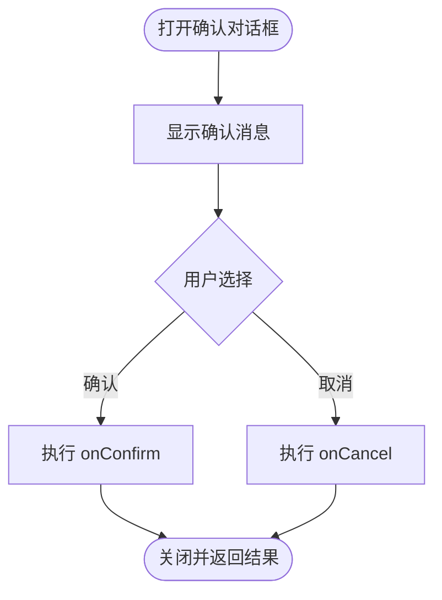

图表来源
- [confirm-dialog.tsx](file://web/src/components/ui/confirm-dialog.tsx)

章节来源
- [confirm-dialog.tsx](file://web/src/components/ui/confirm-dialog.tsx)

### Badge 徽章
- 设计要点
  - 状态标记、计数、标签
- 关键 Props
  - text: 文本
  - color: 颜色变体
  - size: 尺寸
- 样式定制
  - 背景色、边框、内边距
- 可访问性
  - 语义化标签，必要时 aria-label

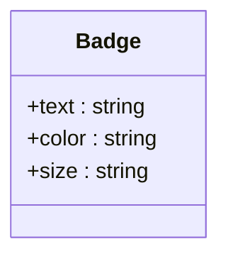

图表来源
- [badge.tsx](file://web/src/components/ui/badge.tsx)

章节来源
- [badge.tsx](file://web/src/components/ui/badge.tsx)

### Avatar 头像
- 设计要点
  - 用户标识、头像展示
- 关键 Props
  - src: 图片地址
  - alt: 替代文本
  - fallback: 占位符
  - size: 尺寸
- 事件处理
  - onError 图片加载失败回退
- 样式定制
  - 圆形裁剪、边框、阴影
- 可访问性
  - alt 文本、loading 懒加载

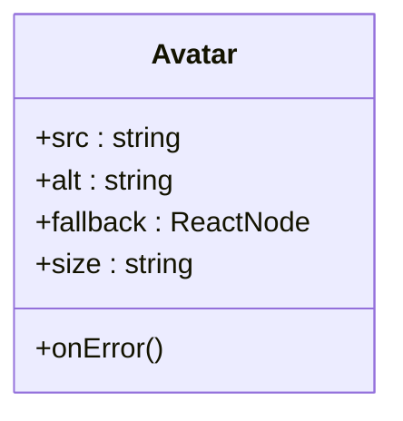

图表来源
- [avatar.tsx](file://web/src/components/ui/avatar.tsx)

章节来源
- [avatar.tsx](file://web/src/components/ui/avatar.tsx)

### 其他辅助组件
- Label 标签：与 Input 关联，提升可访问性
- Tooltip 提示：悬停提示，增强操作说明
- Skeleton/SkeletonBlocks 骨架屏：加载占位，提升感知性能
- StatusIndicator 状态指示：成功/警告/错误等状态
- Switch 开关：布尔值切换
- Tabs 标签页：多视图切换
- Separator 分割线：视觉分隔
- DropdownMenu 下拉菜单：操作集合

章节来源
- [label.tsx](file://web/src/components/ui/label.tsx)
- [tooltip.tsx](file://web/src/components/ui/tooltip.tsx)
- [skeleton.tsx](file://web/src/components/ui/skeleton.tsx)
- [skeleton-blocks.tsx](file://web/src/components/ui/skeleton-blocks.tsx)
- [status-indicator.tsx](file://web/src/components/ui/status-indicator.tsx)
- [switch.tsx](file://web/src/components/ui/switch.tsx)
- [tabs.tsx](file://web/src/components/ui/tabs.tsx)
- [separator.tsx](file://web/src/components/ui/separator.tsx)
- [dropdown-menu.tsx](file://web/src/components/ui/dropdown-menu.tsx)

## 依赖关系分析
- 组件与样式
  - 所有 UI 组件通过 Tailwind 原子类构建样式，主题扩展在 tailwind.config.js
  - 全局样式在 globals.css 中定义基础变量与重置
- 组件与布局
  - Layout 组件提供页面骨架与响应式断点，页面容器 PageContainer 统一边距与标题区
- 组件与工具
  - 表单相关组件与 Label 组合提升可访问性
  - Dialog/ConfirmDialog 与 Tooltip 组合提升交互说明

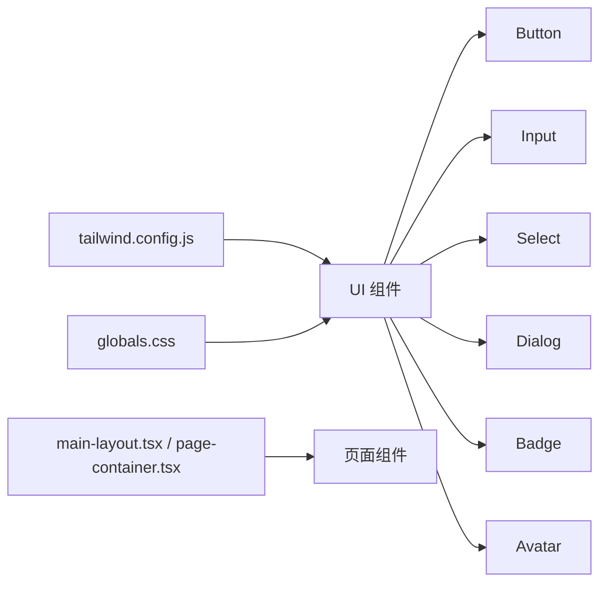

图表来源
- [tailwind.config.js](file://web/tailwind.config.js)
- [globals.css](file://web/src/styles/globals.css)
- [main-layout.tsx](file://web/src/components/layout/main-layout.tsx)
- [page-container.tsx](file://web/src/components/layout/page-container.tsx)
- [button.tsx](file://web/src/components/ui/button.tsx)
- [input.tsx](file://web/src/components/ui/input.tsx)
- [select.tsx](file://web/src/components/ui/select.tsx)
- [dialog.tsx](file://web/src/components/ui/dialog.tsx)
- [badge.tsx](file://web/src/components/ui/badge.tsx)
- [avatar.tsx](file://web/src/components/ui/avatar.tsx)

章节来源
- [tailwind.config.js](file://web/tailwind.config.js)
- [globals.css](file://web/src/styles/globals.css)
- [main-layout.tsx](file://web/src/components/layout/main-layout.tsx)
- [page-container.tsx](file://web/src/components/layout/page-container.tsx)

## 性能考量
- 渲染优化
  - 使用 React.memo 包裹纯展示组件（如 Badge、Avatar）
  - 大列表 Select 启用虚拟滚动，减少 DOM 节点
- 资源加载
  - Avatar 图片使用 loading="lazy" 与错误回退
  - 骨架屏 Skeleton 提前占位，降低首屏抖动
- 事件处理
  - 高频事件（onChange、onScroll）使用防抖/节流
  - Dialog 打开/关闭时避免不必要的重渲染
- 样式与主题
  - 通过 Tailwind 配置集中管理主题，避免重复类名
  - 减少动态 style 计算，优先使用预定义类
- 可访问性与无障碍
  - 正确的 ARIA 属性与键盘可达，提升用户体验与合规性

[本节为通用指导，不直接分析具体文件]

## 故障排查指南
- 常见问题
  - 输入框校验不生效：检查 id/name 与 Label 的 htmlFor 匹配，确认 aria-invalid 与 aria-describedby 设置
  - 对话框无法关闭：确认 onOpenChange 是否正确更新 open 状态，ESC 事件是否被拦截
  - 下拉选项不可见：检查 z-index 层级与定位，确保遮罩与面板层级正确
  - 头像加载失败：实现 onError 回退逻辑，提供占位图
- 调试建议
  - 使用浏览器开发者工具检查 ARIA 属性与焦点顺序
  - 在控制台打印关键状态（open、value、error）
  - 使用骨架屏与日志输出定位渲染瓶颈

章节来源
- [input.tsx](file://web/src/components/ui/input.tsx)
- [dialog.tsx](file://web/src/components/ui/dialog.tsx)
- [select.tsx](file://web/src/components/ui/select.tsx)
- [avatar.tsx](file://web/src/components/ui/avatar.tsx)

## 结论
FY200 的基础 UI 组件以 React + Tailwind 为核心，强调可访问性、主题化与组合复用。通过统一的样式系统与布局层，组件在不同页面与场景中保持一致体验。建议在表单集成、状态管理与错误处理中遵循本文档的最佳实践，以提升可维护性与用户体验。

[本节为总结，不直接分析具体文件]

## 附录
- 国际化（i18n）建议
  - 将文案抽离至语言包，组件 Props 支持 i18n key
  - 日期、数字、货币格式化使用统一工具
- 响应式行为
  - 使用 Tailwind 断点（sm/md/lg/xl）控制布局
  - Dialog 在小屏下全宽，表格与表单自适应
- 主题适配
  - 通过 Tailwind 配置扩展颜色、字体、间距
  - 深色模式可通过媒体查询与类名切换

[本节为概念性内容，不直接分析具体文件]