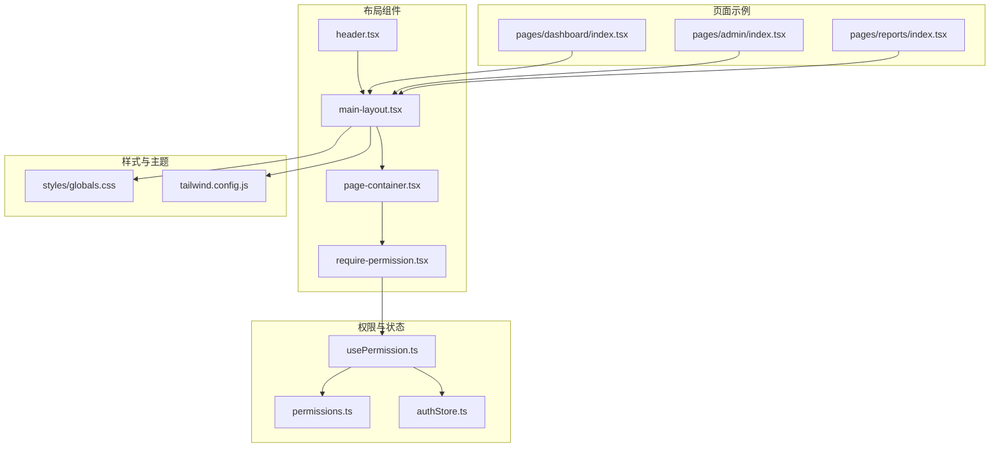
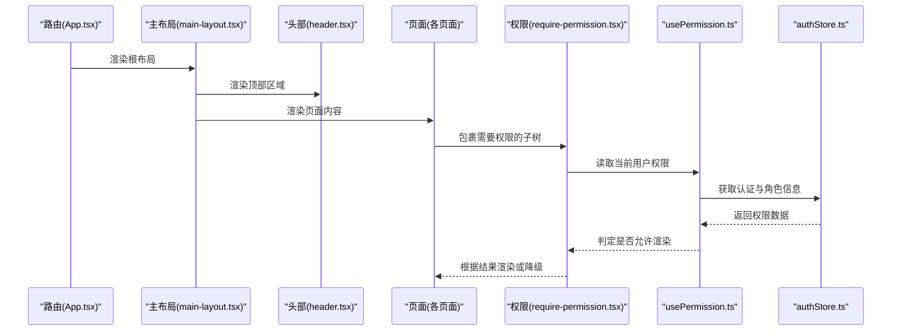
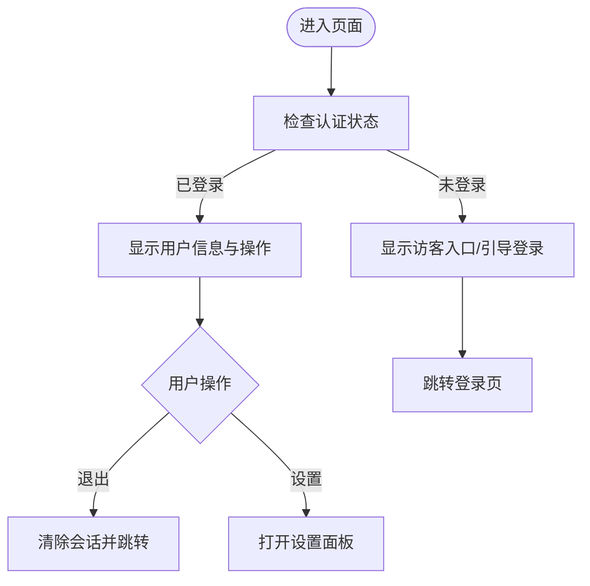
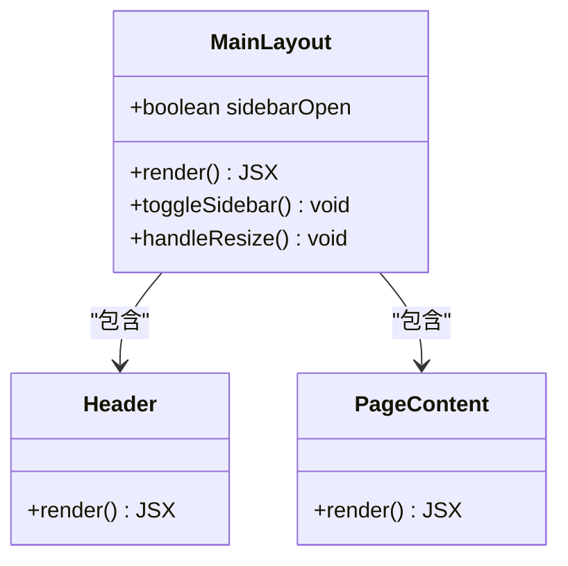
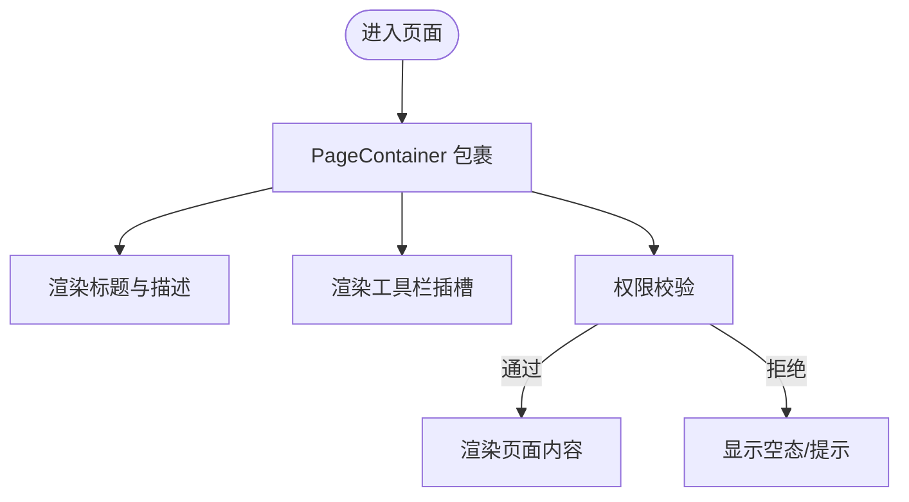
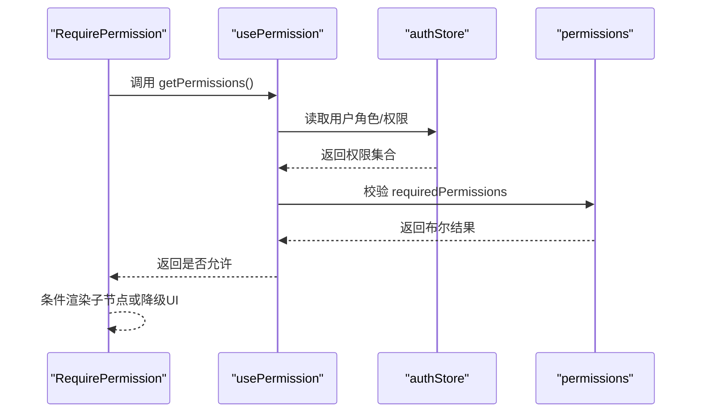
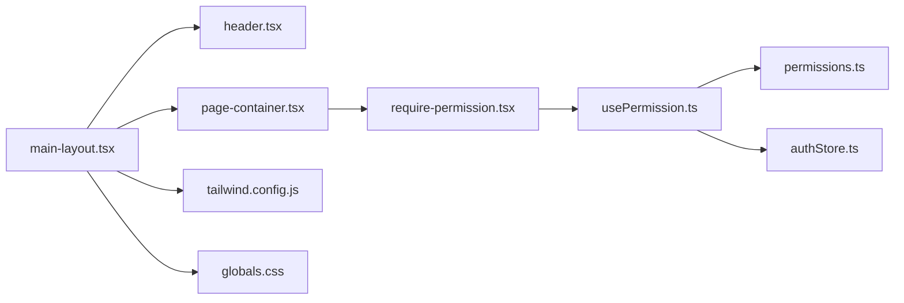

# 布局组件

<cite>
**本文引用的文件**   
- [web/src/components/layout/header.tsx](file://web/src/components/layout/header.tsx)
- [web/src/components/layout/main-layout.tsx](file://web/src/components/layout/main-layout.tsx)
- [web/src/components/layout/page-container.tsx](file://web/src/components/layout/page-container.tsx)
- [web/src/components/layout/require-permission.tsx](file://web/src/components/layout/require-permission.tsx)
- [web/src/hooks/usePermission.ts](file://web/src/hooks/usePermission.ts)
- [web/src/lib/permissions.ts](file://web/src/lib/permissions.ts)
- [web/src/stores/authStore.ts](file://web/src/stores/authStore.ts)
- [web/src/App.tsx](file://web/src/App.tsx)
- [web/src/pages/dashboard/index.tsx](file://web/src/pages/dashboard/index.tsx)
- [web/src/pages/admin/index.tsx](file://web/src/pages/admin/index.tsx)
- [web/src/pages/reports/index.tsx](file://web/src/pages/reports/index.tsx)
- [web/src/styles/globals.css](file://web/src/styles/globals.css)
- [web/tailwind.config.js](file://web/tailwind.config.js)
</cite>

## 目录
1. [简介](#简介)
2. [项目结构](#项目结构)
3. [核心组件](#核心组件)
4. [架构总览](#架构总览)
5. [详细组件分析](#详细组件分析)
6. [依赖关系分析](#依赖关系分析)
7. [性能考虑](#性能考虑)
8. [故障排查指南](#故障排查指南)
9. [结论](#结论)
10. [附录](#附录)

## 简介
本指南面向FY200项目的布局与权限体系，聚焦页面头部、主布局容器、页面包装器以及权限控制组件的结构与配置方法。文档同时阐述响应式布局设计模式与移动端适配策略，给出不同页面类型的布局配置示例路径，并说明状态管理与导航集成方式，最后提供性能优化与用户体验改进的最佳实践。

## 项目结构
前端采用模块化组织，布局相关代码集中在 web/src/components/layout 目录下，权限能力由 hooks 与 lib 层提供，全局样式与主题通过 Tailwind 配置。页面级入口在 pages 目录中按功能域划分。

图表来源
- [web/src/components/layout/header.tsx](file://web/src/components/layout/header.tsx)
- [web/src/components/layout/main-layout.tsx](file://web/src/components/layout/main-layout.tsx)
- [web/src/components/layout/page-container.tsx](file://web/src/components/layout/page-container.tsx)
- [web/src/components/layout/require-permission.tsx](file://web/src/components/layout/require-permission.tsx)
- [web/src/hooks/usePermission.ts](file://web/src/hooks/usePermission.ts)
- [web/src/lib/permissions.ts](file://web/src/lib/permissions.ts)
- [web/src/stores/authStore.ts](file://web/src/stores/authStore.ts)
- [web/src/styles/globals.css](file://web/src/styles/globals.css)
- [web/tailwind.config.js](file://web/tailwind.config.js)

章节来源
- [web/src/App.tsx](file://web/src/App.tsx)
- [web/src/components/layout/main-layout.tsx](file://web/src/components/layout/main-layout.tsx)

## 核心组件
- 页面头部（Header）：承载品牌标识、用户信息、全局操作入口等；通常与路由和认证状态联动。
- 主布局容器（MainLayout）：定义整体页面骨架（侧边栏/顶部栏/内容区），处理响应式切换与滚动行为。
- 页面包装器（PageContainer）：为具体页面提供统一的间距、标题、工具栏插槽与权限校验包裹。
- 权限控制（RequirePermission）：基于当前用户权限决定是否渲染子节点或降级展示。

章节来源
- [web/src/components/layout/header.tsx](file://web/src/components/layout/header.tsx)
- [web/src/components/layout/main-layout.tsx](file://web/src/components/layout/main-layout.tsx)
- [web/src/components/layout/page-container.tsx](file://web/src/components/layout/page-container.tsx)
- [web/src/components/layout/require-permission.tsx](file://web/src/components/layout/require-permission.tsx)

## 架构总览
下图展示了从路由到布局再到页面内容的调用链，以及权限校验的介入点。

图表来源
- [web/src/App.tsx](file://web/src/App.tsx)
- [web/src/components/layout/main-layout.tsx](file://web/src/components/layout/main-layout.tsx)
- [web/src/components/layout/header.tsx](file://web/src/components/layout/header.tsx)
- [web/src/components/layout/require-permission.tsx](file://web/src/components/layout/require-permission.tsx)
- [web/src/hooks/usePermission.ts](file://web/src/hooks/usePermission.ts)
- [web/src/stores/authStore.ts](file://web/src/stores/authStore.ts)

## 详细组件分析

### 页面头部（Header）
- 职责：展示系统名称、用户头像/昵称、退出登录、通知入口等；与认证状态联动。
- 配置要点：
  - 支持暗色/亮色主题切换（若启用）。
  - 移动端可折叠菜单，避免遮挡关键操作。
  - 与路由联动的高亮当前菜单项。
- 交互流程：点击“退出”触发鉴权清理与跳转；点击“设置”打开抽屉或弹窗。

章节来源
- [web/src/components/layout/header.tsx](file://web/src/components/layout/header.tsx)
- [web/src/stores/authStore.ts](file://web/src/stores/authStore.ts)

### 主布局容器（MainLayout）
- 职责：统一页面骨架（顶部栏、侧边栏、内容区）、处理响应式布局与滚动行为。
- 配置要点：
  - 侧边栏展开/收起状态持久化（localStorage）。
  - 小屏自动隐藏侧边栏并提供抽屉式导航。
  - 内容区自适应高度，避免溢出。
- 响应式策略：使用 Tailwind 断点（sm/md/lg/xl）控制栅格与间距。

图表来源
- [web/src/components/layout/main-layout.tsx](file://web/src/components/layout/main-layout.tsx)
- [web/src/components/layout/header.tsx](file://web/src/components/layout/header.tsx)

章节来源
- [web/src/components/layout/main-layout.tsx](file://web/src/components/layout/main-layout.tsx)
- [web/tailwind.config.js](file://web/tailwind.config.js)
- [web/src/styles/globals.css](file://web/src/styles/globals.css)

### 页面包装器（PageContainer）
- 职责：为页面提供统一的外边距、标题区、工具栏插槽、面包屑与权限包裹。
- 配置要点：
  - 支持 title、description、actions 插槽。
  - 内部默认包裹权限校验，确保无权限时降级展示。
  - 响应式间距与最大宽度限制。

章节来源
- [web/src/components/layout/page-container.tsx](file://web/src/components/layout/page-container.tsx)
- [web/src/components/layout/require-permission.tsx](file://web/src/components/layout/require-permission.tsx)

### 权限控制（RequirePermission）
- 职责：基于当前用户权限决定子树渲染或降级展示。
- 实现原理：
  - usePermission 钩子从 authStore 获取用户角色/权限集合。
  - permissions 库提供权限常量与判断函数。
  - RequirePermission 组件接收 requiredPermissions 列表，匹配通过后渲染 children，否则返回空或占位。
- 使用方式：将需要保护的页面片段用 RequirePermission 包裹，传入所需权限码。

图表来源
- [web/src/components/layout/require-permission.tsx](file://web/src/components/layout/require-permission.tsx)
- [web/src/hooks/usePermission.ts](file://web/src/hooks/usePermission.ts)
- [web/src/lib/permissions.ts](file://web/src/lib/permissions.ts)
- [web/src/stores/authStore.ts](file://web/src/stores/authStore.ts)

章节来源
- [web/src/components/layout/require-permission.tsx](file://web/src/components/layout/require-permission.tsx)
- [web/src/hooks/usePermission.ts](file://web/src/hooks/usePermission.ts)
- [web/src/lib/permissions.ts](file://web/src/lib/permissions.ts)
- [web/src/stores/authStore.ts](file://web/src/stores/authStore.ts)

### 不同页面类型的布局配置示例
- 仪表盘（Dashboard）：使用 MainLayout + PageContainer，展示 KPI 卡片与图表，无需额外权限或仅基础查看权限。
- 管理后台（Admin）：使用 RequirePermission 包裹敏感操作按钮与表格编辑功能。
- 报表（Reports）：结合 PageContainer 的工具栏插槽导出、筛选等操作，部分操作需审批权限。

章节来源
- [web/src/pages/dashboard/index.tsx](file://web/src/pages/dashboard/index.tsx)
- [web/src/pages/admin/index.tsx](file://web/src/pages/admin/index.tsx)
- [web/src/pages/reports/index.tsx](file://web/src/pages/reports/index.tsx)
- [web/src/components/layout/page-container.tsx](file://web/src/components/layout/page-container.tsx)
- [web/src/components/layout/require-permission.tsx](file://web/src/components/layout/require-permission.tsx)

## 依赖关系分析
- 组件耦合：
  - MainLayout 依赖 Header 与 PageContainer，形成稳定的布局骨架。
  - PageContainer 依赖 RequirePermission，保证页面级权限一致性。
  - RequirePermission 依赖 usePermission 与 permissions 库，解耦权限逻辑。
- 外部依赖：
  - Tailwind CSS 用于响应式与主题。
  - 全局样式 globals.css 提供基础重置与通用类。

图表来源
- [web/src/components/layout/main-layout.tsx](file://web/src/components/layout/main-layout.tsx)
- [web/src/components/layout/header.tsx](file://web/src/components/layout/header.tsx)
- [web/src/components/layout/page-container.tsx](file://web/src/components/layout/page-container.tsx)
- [web/src/components/layout/require-permission.tsx](file://web/src/components/layout/require-permission.tsx)
- [web/src/hooks/usePermission.ts](file://web/src/hooks/usePermission.ts)
- [web/src/lib/permissions.ts](file://web/src/lib/permissions.ts)
- [web/src/stores/authStore.ts](file://web/src/stores/authStore.ts)
- [web/tailwind.config.js](file://web/tailwind.config.js)
- [web/src/styles/globals.css](file://web/src/styles/globals.css)

章节来源
- [web/src/components/layout/main-layout.tsx](file://web/src/components/layout/main-layout.tsx)
- [web/src/components/layout/page-container.tsx](file://web/src/components/layout/page-container.tsx)
- [web/src/components/layout/require-permission.tsx](file://web/src/components/layout/require-permission.tsx)
- [web/src/hooks/usePermission.ts](file://web/src/hooks/usePermission.ts)
- [web/src/lib/permissions.ts](file://web/src/lib/permissions.ts)
- [web/src/stores/authStore.ts](file://web/src/stores/authStore.ts)
- [web/tailwind.config.js](file://web/tailwind.config.js)
- [web/src/styles/globals.css](file://web/src/styles/globals.css)

## 性能考虑
- 减少重渲染：
  - 将权限判断结果 memoize，避免频繁计算。
  - 对大型表格/图表进行懒加载与虚拟滚动。
- 首屏优化：
  - 按需加载页面组件与图表库。
  - 预取常用资源（字体、图标）。
- 交互体验：
  - 骨架屏与占位图提升感知速度。
  - 防抖/节流搜索与筛选输入。
- 内存与网络：
  - 及时取消未完成的请求。
  - 合理缓存 API 响应（如 React Query）。

[本节为通用指导，不直接分析具体文件]

## 故障排查指南
- 权限无效：
  - 检查 authStore 是否正确初始化用户角色与权限集合。
  - 确认 permissions 库中的权限码与后端一致。
  - 验证 RequirePermission 的 requiredPermissions 列表是否准确。
- 布局异常：
  - 检查 Tailwind 断点与自定义样式冲突。
  - 确认 MainLayout 的侧边栏状态持久化逻辑未被覆盖。
- 移动端适配：
  - 检查 header 的折叠菜单在小屏下是否可见。
  - 验证 PageContainer 的间距与最大宽度在小屏下的表现。

章节来源
- [web/src/stores/authStore.ts](file://web/src/stores/authStore.ts)
- [web/src/lib/permissions.ts](file://web/src/lib/permissions.ts)
- [web/src/components/layout/require-permission.tsx](file://web/src/components/layout/require-permission.tsx)
- [web/src/components/layout/main-layout.tsx](file://web/src/components/layout/main-layout.tsx)
- [web/src/components/layout/header.tsx](file://web/src/components/layout/header.tsx)
- [web/src/components/layout/page-container.tsx](file://web/src/components/layout/page-container.tsx)
- [web/tailwind.config.js](file://web/tailwind.config.js)
- [web/src/styles/globals.css](file://web/src/styles/globals.css)

## 结论
FY200 的布局与权限体系以清晰的组件分层与解耦的权限逻辑为核心，配合 Tailwind 的响应式能力，能够稳定支撑多端一致的界面体验。通过合理的状态管理、懒加载与骨架屏策略，可在保证安全性的前提下提升性能与用户体验。建议持续完善权限模型与监控埋点，以便快速定位问题与优化体验。

## 附录
- 最佳实践清单：
  - 所有敏感操作均使用 RequirePermission 包裹。
  - 页面统一使用 PageContainer 提供一致的视觉与交互。
  - 响应式断点遵循 Tailwind 默认值，避免过度定制。
  - 复杂组件拆分与懒加载，降低首屏体积。
  - 错误边界与友好降级，提升鲁棒性。

[本节为通用指导，不直接分析具体文件]