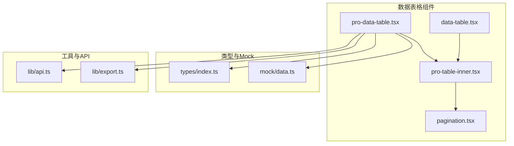
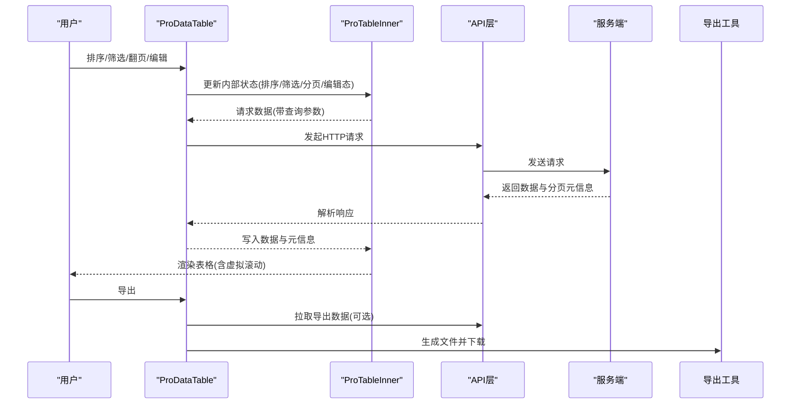
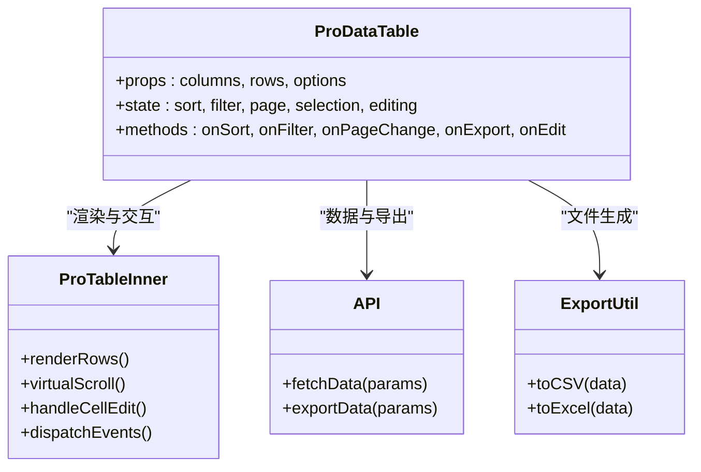

# 数据表格组件

<cite>
**本文引用的文件**   
- [data-table.tsx](file://web/src/components/data-table/data-table.tsx)
- [pro-data-table.tsx](file://web/src/components/data-table/pro-data-table.tsx)
- [pro-table-inner.tsx](file://web/src/components/data-table/pro-table-inner.tsx)
- [pagination.tsx](file://web/src/components/data-table/pagination.tsx)
- [api.ts](file://web/src/lib/api.ts)
- [export.ts](file://web/src/lib/export.ts)
- [index.ts](file://web/src/types/index.ts)
- [data.ts](file://web/src/mock/data.ts)
- [data-table.test.tsx](file://web/src/components/data-table/__tests__/data-table.test.tsx)
</cite>

## 目录
1. [简介](#简介)
2. [项目结构](#项目结构)
3. [核心组件](#核心组件)
4. [架构总览](#架构总览)
5. [详细组件分析](#详细组件分析)
6. [依赖关系分析](#依赖关系分析)
7. [性能考虑](#性能考虑)
8. [故障排查指南](#故障排查指南)
9. [结论](#结论)
10. [附录](#附录)

## 简介
本指南面向FY200项目的数据表格组件，聚焦DataTable与ProDataTable两大组件的高级能力：排序、筛选、分页、虚拟滚动、列自定义、多行选择、批量操作、单元格编辑、导出等。文档同时覆盖数据绑定机制、状态管理、性能优化策略、可访问性支持与移动端适配，并提供与后端API集成的完整示例路径与最佳实践。

## 项目结构
数据表格相关代码位于前端模块的components/data-table目录，包含基础表格、高级表格、内部实现与分页组件；数据与类型定义在types与mock中；API请求与导出工具在lib下。

图表来源
- [data-table.tsx](file://web/src/components/data-table/data-table.tsx)
- [pro-data-table.tsx](file://web/src/components/data-table/pro-data-table.tsx)
- [pro-table-inner.tsx](file://web/src/components/data-table/pro-table-inner.tsx)
- [pagination.tsx](file://web/src/components/data-table/pagination.tsx)
- [api.ts](file://web/src/lib/api.ts)
- [export.ts](file://web/src/lib/export.ts)
- [index.ts](file://web/src/types/index.ts)
- [data.ts](file://web/src/mock/data.ts)

章节来源
- [data-table.tsx](file://web/src/components/data-table/data-table.tsx)
- [pro-data-table.tsx](file://web/src/components/data-table/pro-data-table.tsx)
- [pro-table-inner.tsx](file://web/src/components/data-table/pro-table-inner.tsx)
- [pagination.tsx](file://web/src/components/data-table/pagination.tsx)
- [api.ts](file://web/src/lib/api.ts)
- [export.ts](file://web/src/lib/export.ts)
- [index.ts](file://web/src/types/index.ts)
- [data.ts](file://web/src/mock/data.ts)

## 核心组件
- DataTable：轻量级表格，提供基础渲染、列定义、简单交互（如点击行）与可扩展插槽。适合静态或小型数据集展示。
- ProDataTable：企业级表格，内置排序、筛选、分页、虚拟滚动、列配置、多选、批量操作、导出、单元格编辑等能力，并通过hooks与API层集成进行数据绑定与状态管理。

关键职责划分
- data-table.tsx：基础渲染与列映射、事件透传、样式与无障碍属性注入。
- pro-data-table.tsx：对外暴露的“高级表格”入口，聚合排序/筛选/分页/虚拟滚动/导出/编辑等能力，协调内部状态与副作用。
- pro-table-inner.tsx：内部实现，负责高性能渲染、虚拟滚动容器、行列计算、事件分发与UI组装。
- pagination.tsx：分页控件，支持页码、每页条数、跳转、异步加载回调。

章节来源
- [data-table.tsx](file://web/src/components/data-table/data-table.tsx)
- [pro-data-table.tsx](file://web/src/components/data-table/pro-data-table.tsx)
- [pro-table-inner.tsx](file://web/src/components/data-table/pro-table-inner.tsx)
- [pagination.tsx](file://web/src/components/data-table/pagination.tsx)

## 架构总览
ProDataTable通过内部状态机驱动数据流：用户交互触发排序/筛选/分页/编辑等动作，更新本地状态后调用API获取服务端数据，再回写至表格渲染。导出功能独立于数据流，基于当前视图或筛选结果生成文件。

图表来源
- [pro-data-table.tsx](file://web/src/components/data-table/pro-data-table.tsx)
- [pro-table-inner.tsx](file://web/src/components/data-table/pro-table-inner.tsx)
- [api.ts](file://web/src/lib/api.ts)
- [export.ts](file://web/src/lib/export.ts)

## 详细组件分析

### DataTable 基础表格
- 列定义：通过列数组配置字段名、标题、宽度、对齐、格式化函数、是否可排序等。
- 数据绑定：接收rows与columns，内部将数据映射为行/单元格，支持自定义渲染器。
- 交互：行点击、单元格点击、键盘导航、ARIA属性（role、aria-sort、aria-label等）。
- 性能：对大数据集建议结合分页或虚拟滚动；避免在渲染函数中进行昂贵计算。

使用要点
- 列宽自适应与固定列：合理设置列宽，必要时启用横向滚动。
- 格式化与单位：统一在列formatter中处理单位与显示格式。
- 可访问性：确保表头有scope，按钮与输入框具备label与提示。

章节来源
- [data-table.tsx](file://web/src/components/data-table/data-table.tsx)

### ProDataTable 高级表格
- 排序：支持单列/多列排序，前后端均可实现；推荐后端排序以支持大数据量。
- 筛选：文本模糊、数值范围、枚举下拉、日期区间；支持条件组合与保存常用筛选。
- 分页：客户端分页与服务端分页；服务端分页需配合API返回total、page、pageSize等。
- 虚拟滚动：长列表按需渲染可视区域，显著降低DOM节点数量与重排开销。
- 列自定义：拖拽调整列顺序/显隐、冻结列、列宽拖拽、列模板渲染。
- 多选与批量操作：行选择、全选、反选、批量删除/导出/状态变更。
- 单元格编辑：行内编辑、校验、撤销/提交、冲突解决。
- 导出：按当前筛选/排序/分页导出CSV/Excel，或全量导出（后台任务+下载链接）。

数据绑定与状态管理
- 受控模式：外部传入rows/columns/状态，内部仅更新UI；适合小数据或完全由父组件管理。
- 非受控模式：内部维护排序/筛选/分页/编辑状态，通过回调通知父组件；适合复杂交互。
- 与API集成：封装统一的查询参数映射（sort、filter、page、pageSize），响应解析为表格所需数据结构。

性能优化
- 虚拟滚动：开启后仅渲染可视区行，减少内存占用。
- 防抖与节流：搜索输入防抖、窗口resize节流。
- 懒加载：列模板按需加载重型组件。
- 去重与缓存：相同查询参数复用结果，避免重复请求。

可访问性与移动端适配
- 键盘可达：Tab导航、Enter/Space激活、Esc关闭编辑器。
- 屏幕阅读器：语义化表头、状态提示、错误提示。
- 移动端：列隐藏/折叠、横向滚动、触摸友好的交互尺寸。

章节来源
- [pro-data-table.tsx](file://web/src/components/data-table/pro-data-table.tsx)
- [pro-table-inner.tsx](file://web/src/components/data-table/pro-table-inner.tsx)
- [pagination.tsx](file://web/src/components/data-table/pagination.tsx)

### 分页组件 Pagination
- 支持页码、每页条数切换、跳转、异步加载回调。
- 与ProDataTable联动，传递page/pageSize并刷新数据。
- 无障碍：按钮与输入框具备明确标签与状态描述。

章节来源
- [pagination.tsx](file://web/src/components/data-table/pagination.tsx)

### 类型与Mock
- types/index.ts：定义列、行、排序、筛选、分页、导出等通用类型，保证前后端契约一致。
- mock/data.ts：提供模拟数据用于开发调试与演示。

章节来源
- [index.ts](file://web/src/types/index.ts)
- [data.ts](file://web/src/mock/data.ts)

## 依赖关系分析
ProDataTable依赖API层进行数据获取与导出，依赖导出工具生成文件，依赖类型定义保证数据结构一致性。内部通过pro-table-inner完成高性能渲染与交互编排。

图表来源
- [pro-data-table.tsx](file://web/src/components/data-table/pro-data-table.tsx)
- [pro-table-inner.tsx](file://web/src/components/data-table/pro-table-inner.tsx)
- [api.ts](file://web/src/lib/api.ts)
- [export.ts](file://web/src/lib/export.ts)

章节来源
- [pro-data-table.tsx](file://web/src/components/data-table/pro-data-table.tsx)
- [pro-table-inner.tsx](file://web/src/components/data-table/pro-table-inner.tsx)
- [api.ts](file://web/src/lib/api.ts)
- [export.ts](file://web/src/lib/export.ts)

## 性能考虑
- 虚拟滚动：对超过数百行的列表务必开启，避免一次性渲染全部DOM。
- 服务端分页与排序：大数据场景优先在服务端执行，减少网络与渲染压力。
- 防抖搜索：输入框增加防抖，避免频繁请求。
- 列模板懒加载：仅在需要时加载重型组件或第三方库。
- 去重与缓存：相同查询参数合并请求，利用浏览器缓存或内存缓存。
- 导出优化：大批量导出采用后台任务+轮询下载，避免阻塞主线程。

[本节为通用指导，不直接分析具体文件]

## 故障排查指南
常见问题与定位步骤
- 数据不更新：检查API响应结构与类型定义是否匹配；确认分页/排序/筛选参数是否正确传递。
- 排序失效：确认后端是否支持对应字段排序；若前端排序，检查排序键与比较函数。
- 筛选无效：检查筛选条件序列化与反序列化逻辑；确认字段名与数据类型一致。
- 分页异常：核对total、page、pageSize返回值；确保服务端分页逻辑正确。
- 虚拟滚动错位：检查行高是否固定或估算准确；避免动态高度导致滚动偏移。
- 导出失败：检查导出接口权限与数据量限制；大文件导出建议使用后台任务。
- 可访问性问题：使用屏幕阅读器验证；确保所有交互元素具备必要标签与状态。

调试建议
- 使用浏览器开发者工具观察网络请求与响应。
- 在ProDataTable回调中打印状态变化，定位问题阶段。
- 针对导出与虚拟滚动，分别用小规模数据验证基本流程。

章节来源
- [data-table.test.tsx](file://web/src/components/data-table/__tests__/data-table.test.tsx)

## 结论
DataTable与ProDataTable共同构成了FY200项目的数据表格体系：前者满足轻量展示需求，后者覆盖企业级复杂场景。通过清晰的数据绑定、稳健的状态管理与完善的性能优化策略，能够高效支撑排序、筛选、分页、虚拟滚动、列自定义、多选与批量操作、单元格编辑与导出等能力。结合可访问性与移动端适配，可在多终端提供一致的表格体验。

[本节为总结性内容，不直接分析具体文件]

## 附录

### 与后端API集成示例（步骤）
- 定义查询参数映射：将排序、筛选、分页转换为后端期望的字段与格式。
- 封装请求方法：统一处理错误、重试与超时。
- 解析响应：将后端分页元信息与数据分离，供表格使用。
- 导出接口：根据当前筛选与排序生成导出URL或任务ID。

章节来源
- [api.ts](file://web/src/lib/api.ts)
- [export.ts](file://web/src/lib/export.ts)

### 常见配置清单
- 列配置：字段名、标题、宽度、对齐、格式化、可排序、可筛选、可编辑、是否可见。
- 排序：单列/多列、升序/降序、默认排序。
- 筛选：文本、数值范围、枚举、日期区间、条件组合。
- 分页：客户端/服务端、每页条数、跳转行为。
- 虚拟滚动：开启阈值、行高估算、边界缓冲。
- 多选与批量：选择模式、批量操作项、确认提示。
- 编辑：编辑模式、校验规则、提交策略。
- 导出：格式、范围（当前页/筛选结果/全量）、并发限制。

章节来源
- [index.ts](file://web/src/types/index.ts)
- [pro-data-table.tsx](file://web/src/components/data-table/pro-data-table.tsx)