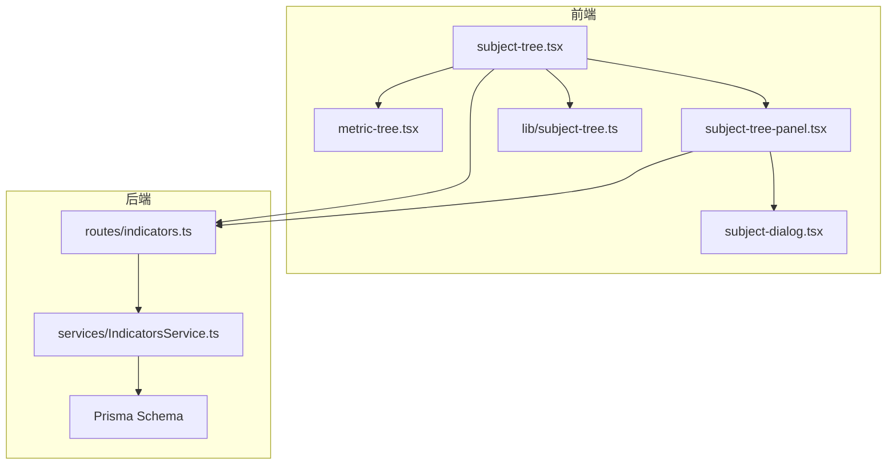
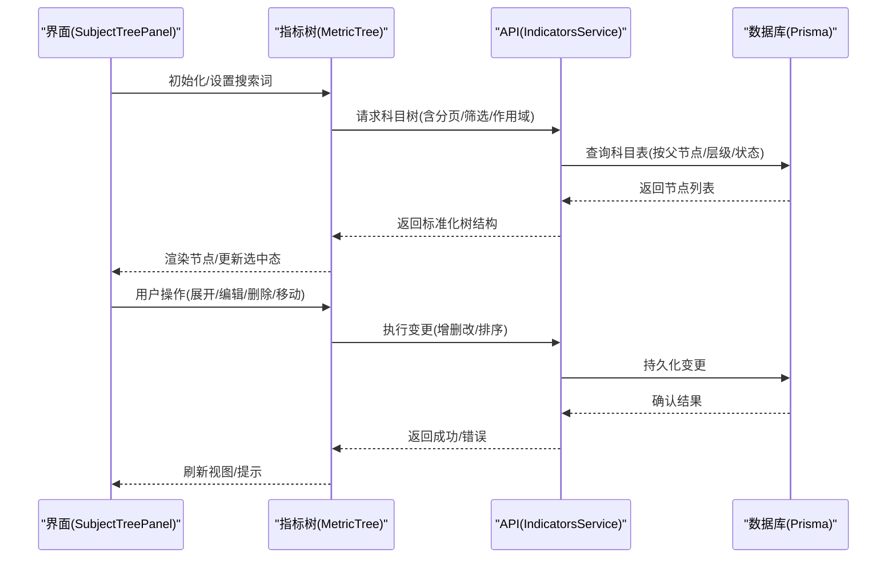
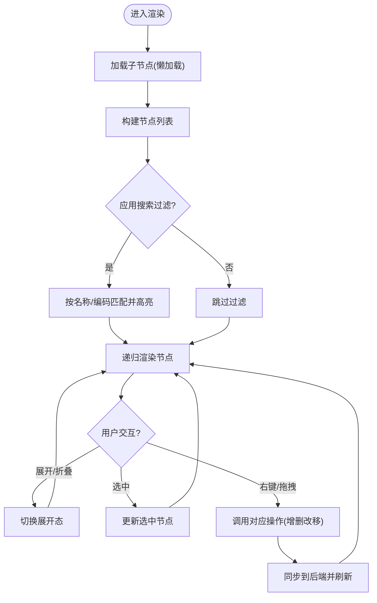
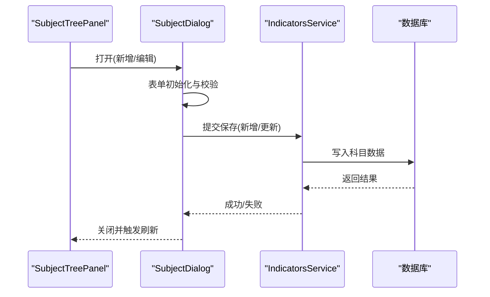
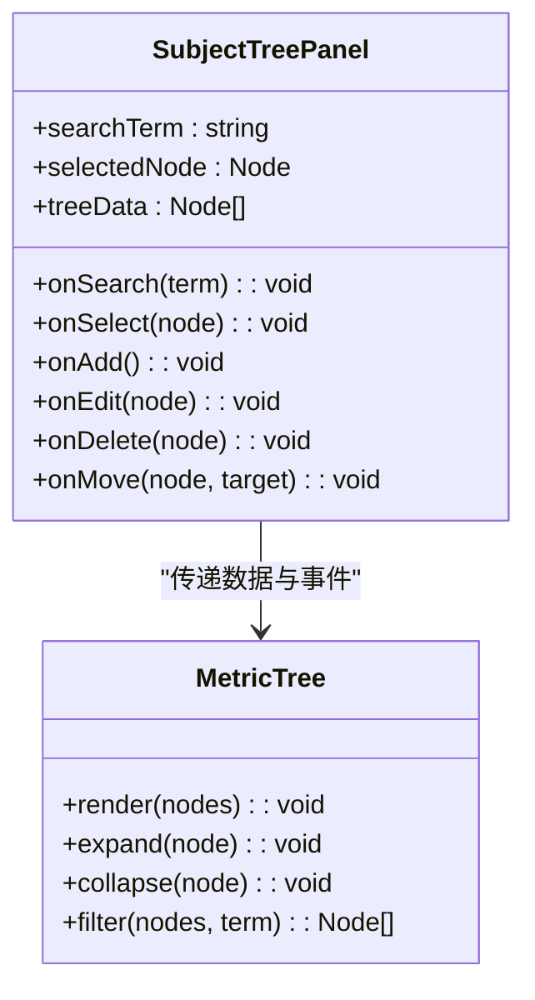
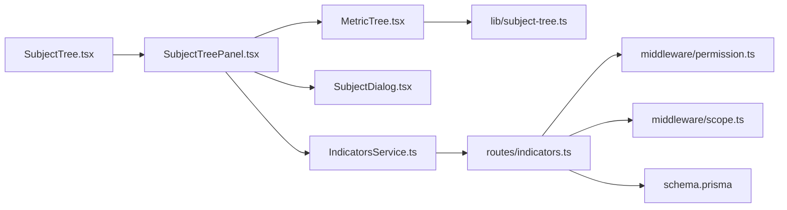

# 科目树组件

<cite>
**本文引用的文件**   
- [web/src/components/subject-tree/metric-tree.tsx](file://web/src/components/subject-tree/metric-tree.tsx)
- [web/src/components/subject-tree/subject-dialog.tsx](file://web/src/components/subject-tree/subject-dialog.tsx)
- [web/src/components/subject-tree/subject-tree-panel.tsx](file://web/src/components/subject-tree/subject-tree-panel.tsx)
- [web/src/components/subject-tree/subject-tree.tsx](file://web/src/components/subject-tree/subject-tree.tsx)
- [web/src/lib/subject-tree.ts](file://web/src/lib/subject-tree.ts)
- [server/prisma/schema.prisma](file://server/prisma/schema.prisma)
- [server/src/middleware/permission.ts](file://server/src/middleware/permission.ts)
- [server/src/middleware/scope.ts](file://server/src/middleware/scope.ts)
- [server/src/routes/indicators.ts](file://server/src/routes/indicators.ts)
- [server/src/services/IndicatorsService.ts](file://server/src/services/IndicatorsService.ts)
</cite>

## 目录
1. [简介](#简介)
2. [项目结构](#项目结构)
3. [核心组件](#核心组件)
4. [架构总览](#架构总览)
5. [详细组件分析](#详细组件分析)
6. [依赖关系分析](#依赖关系分析)
7. [性能考虑](#性能考虑)
8. [故障排查指南](#故障排查指南)
9. [结论](#结论)
10. [附录](#附录)

## 简介
本文件面向FY200项目的“科目树”功能，系统性说明指标树、科目对话框、科目树面板等前端组件的实现原理与使用方法，覆盖树形结构的渲染机制、节点操作、搜索过滤、权限控制、层级关系管理与数据同步策略。同时提供初始化、数据加载、用户交互的完整示例路径，并给出大数据量处理与扩展开发的指导。

## 项目结构
科目树相关的前端代码集中在 web/src/components/subject-tree 目录，配套的数据结构与工具在 web/src/lib/subject-tree.ts；后端通过 Prisma 模型与路由/服务层暴露科目树接口，中间件负责权限与作用域控制。

图表来源
- [web/src/components/subject-tree/subject-tree.tsx](file://web/src/components/subject-tree/subject-tree.tsx)
- [web/src/components/subject-tree/metric-tree.tsx](file://web/src/components/subject-tree/metric-tree.tsx)
- [web/src/components/subject-tree/subject-tree-panel.tsx](file://web/src/components/subject-tree/subject-tree-panel.tsx)
- [web/src/components/subject-tree/subject-dialog.tsx](file://web/src/components/subject-tree/subject-dialog.tsx)
- [web/src/lib/subject-tree.ts](file://web/src/lib/subject-tree.ts)
- [server/src/routes/indicators.ts](file://server/src/routes/indicators.ts)
- [server/src/services/IndicatorsService.ts](file://server/src/services/IndicatorsService.ts)
- [server/prisma/schema.prisma](file://server/prisma/schema.prisma)

章节来源
- [web/src/components/subject-tree/subject-tree.tsx](file://web/src/components/subject-tree/subject-tree.tsx)
- [web/src/components/subject-tree/metric-tree.tsx](file://web/src/components/subject-tree/metric-tree.tsx)
- [web/src/components/subject-tree/subject-tree-panel.tsx](file://web/src/components/subject-tree/subject-tree-panel.tsx)
- [web/src/components/subject-tree/subject-dialog.tsx](file://web/src/components/subject-tree/subject-dialog.tsx)
- [web/src/lib/subject-tree.ts](file://web/src/lib/subject-tree.ts)
- [server/src/routes/indicators.ts](file://server/src/routes/indicators.ts)
- [server/src/services/IndicatorsService.ts](file://server/src/services/IndicatorsService.ts)
- [server/prisma/schema.prisma](file://server/prisma/schema.prisma)

## 核心组件
- 指标树（MetricTree）：负责递归渲染科目树节点，支持展开/折叠、选中、右键菜单、拖拽排序、懒加载子节点等。
- 科目对话框（SubjectDialog）：用于新增/编辑科目，包含名称、编码、层级、父节点选择、是否叶子节点、状态等字段校验与提交。
- 科目树面板（SubjectTreePanel）：聚合搜索框、工具栏（新增/导入/导出）、树容器与分页/懒加载逻辑，驱动整体交互。
- 科目树（SubjectTree）：页面级入口，管理全局状态（当前选中、搜索词、权限、作用域），协调面板与树组件。

章节来源
- [web/src/components/subject-tree/metric-tree.tsx](file://web/src/components/subject-tree/metric-tree.tsx)
- [web/src/components/subject-tree/subject-dialog.tsx](file://web/src/components/subject-tree/subject-dialog.tsx)
- [web/src/components/subject-tree/subject-tree-panel.tsx](file://web/src/components/subject-tree/subject-tree-panel.tsx)
- [web/src/components/subject-tree/subject-tree.tsx](file://web/src/components/subject-tree/subject-tree.tsx)

## 架构总览
科目树采用前后端分离架构：前端通过 REST API 获取科目树数据，使用本地状态与工具函数进行渲染与交互；后端基于 Express + Prisma，结合权限与作用域中间件对数据进行过滤与保护。

图表来源
- [web/src/components/subject-tree/subject-tree-panel.tsx](file://web/src/components/subject-tree/subject-tree-panel.tsx)
- [web/src/components/subject-tree/metric-tree.tsx](file://web/src/components/subject-tree/metric-tree.tsx)
- [server/src/routes/indicators.ts](file://server/src/routes/indicators.ts)
- [server/src/services/IndicatorsService.ts](file://server/src/services/IndicatorsService.ts)
- [server/prisma/schema.prisma](file://server/prisma/schema.prisma)

## 详细组件分析

### 指标树（MetricTree）
- 渲染机制：递归渲染节点，支持虚拟滚动或按需渲染以提升性能；每个节点展示名称、编码、状态、操作按钮。
- 节点操作：展开/折叠、选中、右键菜单（新增同级/子级、编辑、删除、移动）、拖拽排序。
- 搜索过滤：支持按名称/编码模糊匹配，命中高亮；可限制仅显示匹配路径。
- 权限控制：根据当前用户权限隐藏敏感操作（如删除、批量移动）。
- 数据同步：展开时懒加载子节点；变更后触发局部刷新，避免全量重绘。

图表来源
- [web/src/components/subject-tree/metric-tree.tsx](file://web/src/components/subject-tree/metric-tree.tsx)
- [web/src/lib/subject-tree.ts](file://web/src/lib/subject-tree.ts)

章节来源
- [web/src/components/subject-tree/metric-tree.tsx](file://web/src/components/subject-tree/metric-tree.tsx)
- [web/src/lib/subject-tree.ts](file://web/src/lib/subject-tree.ts)

### 科目对话框（SubjectDialog）
- 表单字段：名称、编码、父节点、层级、是否叶子、状态、备注等。
- 校验规则：必填、唯一性（编码）、层级合法性、父子关系约束。
- 交互流程：打开对话框→填充数据（编辑模式）→校验→提交→成功后关闭并刷新树。
- 权限控制：根据角色/权限隐藏编辑或删除按钮。

图表来源
- [web/src/components/subject-tree/subject-dialog.tsx](file://web/src/components/subject-tree/subject-dialog.tsx)
- [server/src/routes/indicators.ts](file://server/src/routes/indicators.ts)
- [server/src/services/IndicatorsService.ts](file://server/src/services/IndicatorsService.ts)
- [server/prisma/schema.prisma](file://server/prisma/schema.prisma)

章节来源
- [web/src/components/subject-tree/subject-dialog.tsx](file://web/src/components/subject-tree/subject-dialog.tsx)

### 科目树面板（SubjectTreePanel）
- 功能：搜索框、工具栏（新增、导入、导出）、树容器、分页/懒加载、选中项管理。
- 数据流：接收树数据→传递给指标树→监听用户事件→调用API→更新状态。
- 权限控制：根据当前用户权限动态显示/隐藏操作按钮。
- 性能优化：防抖搜索、分页/懒加载、增量更新。

图表来源
- [web/src/components/subject-tree/subject-tree-panel.tsx](file://web/src/components/subject-tree/subject-tree-panel.tsx)
- [web/src/components/subject-tree/metric-tree.tsx](file://web/src/components/subject-tree/metric-tree.tsx)

章节来源
- [web/src/components/subject-tree/subject-tree-panel.tsx](file://web/src/components/subject-tree/subject-tree-panel.tsx)

### 科目树（SubjectTree）
- 职责：页面级状态管理（选中、搜索、权限、作用域），协调面板与树组件。
- 生命周期：初始化加载根节点→监听搜索变化→响应用户操作→同步后端。
- 权限集成：读取当前用户权限，决定操作可见性与可用性。

章节来源
- [web/src/components/subject-tree/subject-tree.tsx](file://web/src/components/subject-tree/subject-tree.tsx)

## 依赖关系分析
- 前端依赖：React组件、本地状态管理、工具函数（数据结构转换、校验、格式化）。
- 后端依赖：Express路由、Prisma服务、权限与作用域中间件、数据库模型。
- 关键接口：获取科目树、新增/更新/删除、移动排序、搜索过滤。

图表来源
- [web/src/components/subject-tree/subject-tree.tsx](file://web/src/components/subject-tree/subject-tree.tsx)
- [web/src/components/subject-tree/subject-tree-panel.tsx](file://web/src/components/subject-tree/subject-tree-panel.tsx)
- [web/src/components/subject-tree/metric-tree.tsx](file://web/src/components/subject-tree/metric-tree.tsx)
- [web/src/components/subject-tree/subject-dialog.tsx](file://web/src/components/subject-tree/subject-dialog.tsx)
- [web/src/lib/subject-tree.ts](file://web/src/lib/subject-tree.ts)
- [server/src/routes/indicators.ts](file://server/src/routes/indicators.ts)
- [server/src/services/IndicatorsService.ts](file://server/src/services/IndicatorsService.ts)
- [server/src/middleware/permission.ts](file://server/src/middleware/permission.ts)
- [server/src/middleware/scope.ts](file://server/src/middleware/scope.ts)
- [server/prisma/schema.prisma](file://server/prisma/schema.prisma)

章节来源
- [web/src/lib/subject-tree.ts](file://web/src/lib/subject-tree.ts)
- [server/src/routes/indicators.ts](file://server/src/routes/indicators.ts)
- [server/src/services/IndicatorsService.ts](file://server/src/services/IndicatorsService.ts)
- [server/src/middleware/permission.ts](file://server/src/middleware/permission.ts)
- [server/src/middleware/scope.ts](file://server/src/middleware/scope.ts)
- [server/prisma/schema.prisma](file://server/prisma/schema.prisma)

## 性能考虑
- 懒加载与分页：仅在展开节点时加载子节点，避免一次性加载全部数据。
- 搜索优化：防抖输入、服务端模糊查询、命中高亮不重排整棵树。
- 渲染优化：虚拟滚动、键值稳定、最小化重渲染（选择性更新）。
- 网络优化：缓存最近访问节点、合并请求、错误重试与降级。
- 大数据策略：分片加载、增量更新、禁用不必要的动画与日志输出。

[本节为通用性能建议，不直接分析具体文件]

## 故障排查指南
- 权限问题：检查中间件 permission 与 scope 配置，确认用户角色与数据作用域。
- 数据不同步：确认 API 返回状态与前端刷新逻辑，检查事务与回滚。
- 搜索无结果：验证搜索词清洗与服务端过滤条件。
- 拖拽异常：检查目标节点类型与层级限制，确保父子关系合法。
- 性能卡顿：启用懒加载与虚拟滚动，减少渲染节点数量。

章节来源
- [server/src/middleware/permission.ts](file://server/src/middleware/permission.ts)
- [server/src/middleware/scope.ts](file://server/src/middleware/scope.ts)
- [server/src/routes/indicators.ts](file://server/src/routes/indicators.ts)
- [server/src/services/IndicatorsService.ts](file://server/src/services/IndicatorsService.ts)

## 结论
科目树组件通过清晰的前端分层与后端权限控制，实现了高效、可扩展的树形结构管理。遵循懒加载、搜索优化与权限隔离原则，可在大数据量场景下保持良好性能。扩展开发应聚焦于节点类型、操作权限与数据模型的解耦设计。

[本节为总结性内容，不直接分析具体文件]

## 附录
- 初始化示例路径：参考 subject-tree.tsx 的初始化流程与参数配置。
- 数据加载示例路径：参考 subject-tree-panel.tsx 的 API 调用与状态更新。
- 用户交互示例路径：参考 metric-tree.tsx 的事件处理与回调。
- 权限控制示例路径：参考 permission.ts 与 scope.ts 的鉴权逻辑。
- 数据模型示例路径：参考 schema.prisma 的科目表定义与关联关系。

[本节为指引性内容，不直接分析具体文件]