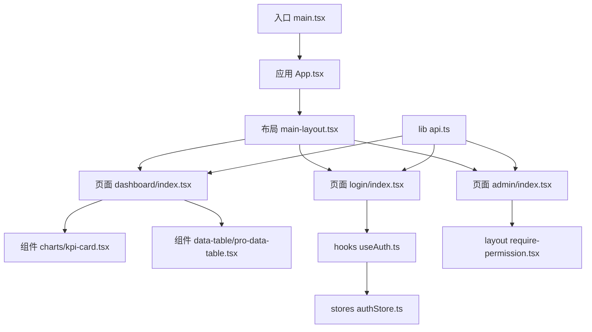
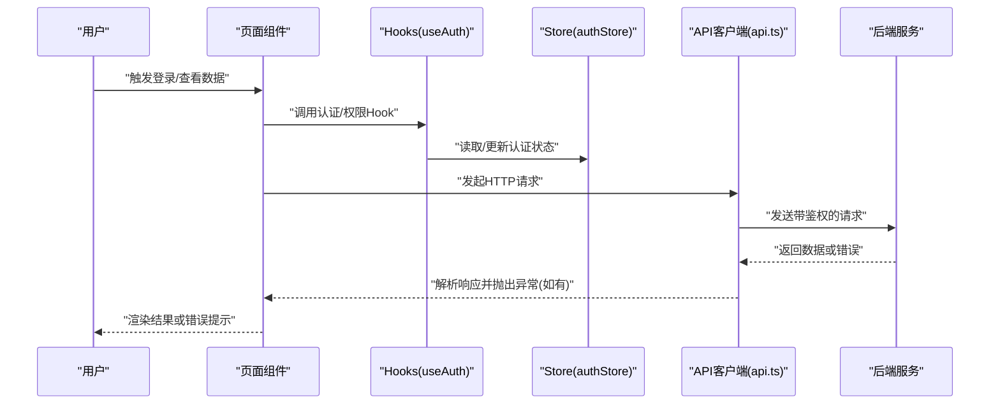
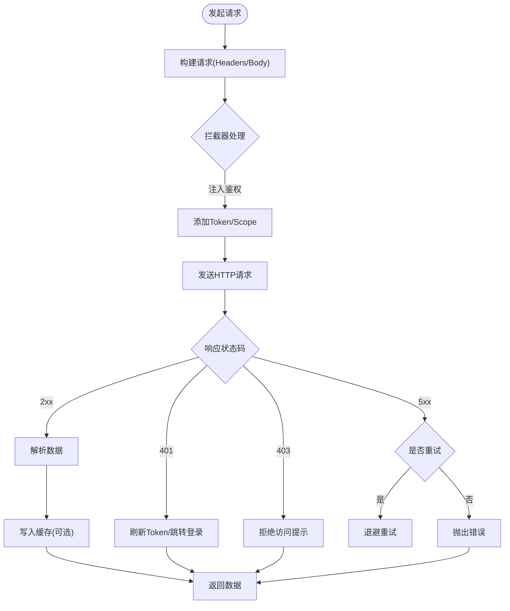
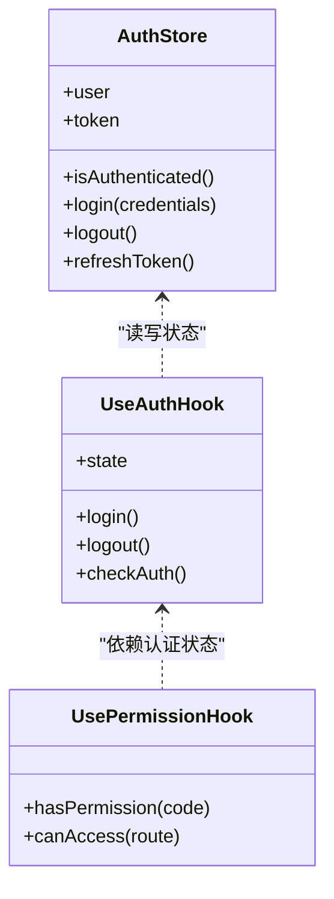
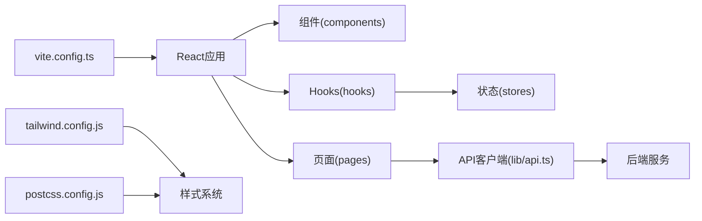

# 前端开发指南

<cite>
**本文引用的文件**   
- [web/package.json](file://web/package.json)
- [web/vite.config.ts](file://web/vite.config.ts)
- [web/postcss.config.js](file://web/postcss.config.js)
- [web/tailwind.config.js](file://web/tailwind.config.js)
- [web/src/main.tsx](file://web/src/main.tsx)
- [web/src/App.tsx](file://web/src/App.tsx)
- [web/src/index.css](file://web/src/index.css)
- [web/src/styles/globals.css](file://web/src/styles/globals.css)
- [web/src/lib/api.ts](file://web/src/lib/api.ts)
- [web/src/hooks/useAuth.ts](file://web/src/hooks/useAuth.ts)
- [web/src/hooks/usePermission.ts](file://web/src/hooks/usePermission.ts)
- [web/src/stores/authStore.ts](file://web/src/stores/authStore.ts)
- [web/src/components/ui/button.tsx](file://web/src/components/ui/button.tsx)
- [web/src/components/data-table/pro-data-table.tsx](file://web/src/components/data-table/pro-data-table.tsx)
- [web/src/components/charts/kpi-card.tsx](file://web/src/components/charts/kpi-card.tsx)
- [web/src/pages/dashboard/index.tsx](file://web/src/pages/dashboard/index.tsx)
- [web/src/pages/login/index.tsx](file://web/src/pages/login/index.tsx)
- [web/src/pages/admin/index.tsx](file://web/src/pages/admin/index.tsx)
- [web/src/components/layout/main-layout.tsx](file://web/src/components/layout/main-layout.tsx)
- [web/src/components/layout/require-permission.tsx](file://web/src/components/layout/require-permission.tsx)
- [web/src/lib/constants.ts](file://web/src/lib/constants.ts)
- [web/src/lib/utils.ts](file://web/src/lib/utils.ts)
- [web/src/test/setup.ts](file://web/src/test/setup.ts)
- [web/vitest.config.ts](file://web/vitest.config.ts)
</cite>

## 目录
1. [简介](#简介)
2. [项目结构](#项目结构)
3. [核心组件](#核心组件)
4. [架构总览](#架构总览)
5. [详细组件分析](#详细组件分析)
6. [依赖关系分析](#依赖关系分析)
7. [性能考虑](#性能考虑)
8. [故障排查指南](#故障排查指南)
9. [结论](#结论)
10. [附录](#附录)

## 简介
本指南面向FY200财务经营数据分析平台的前端开发，聚焦React + Vite + Tailwind CSS技术栈。内容涵盖：
- React组件架构与可复用组织方式
- 页面组件职责划分与状态管理
- Vite构建配置与优化
- Tailwind样式系统与主题定制
- API客户端实现（请求拦截、错误处理、缓存）
- Hooks最佳实践（useAuth、usePermission等）
- UI组件库使用与扩展
- 测试策略（单元与集成）
- 性能优化与调试技巧

## 项目结构
前端位于 web 目录，采用按功能域与层次混合的组织方式：
- src/components：UI原子组件与业务组件（图表、数据表格、布局、权限控制等）
- src/pages：页面级组件（登录、仪表盘、报表、指标、库存、交易、管理等）
- src/hooks：通用Hooks（认证、权限、API查询等）
- src/stores：轻量状态存储（如认证状态）
- src/lib：工具与基础设施（API客户端、常量、导出、校验等）
- src/styles：全局样式与Tailwind入口
- test：测试环境初始化
- vite.config.ts、postcss.config.js、tailwind.config.js：构建与样式配置

**图示来源** 
- [web/src/main.tsx](file://web/src/main.tsx)
- [web/src/App.tsx](file://web/src/App.tsx)
- [web/src/components/layout/main-layout.tsx](file://web/src/components/layout/main-layout.tsx)
- [web/src/pages/dashboard/index.tsx](file://web/src/pages/dashboard/index.tsx)
- [web/src/pages/login/index.tsx](file://web/src/pages/login/index.tsx)
- [web/src/pages/admin/index.tsx](file://web/src/pages/admin/index.tsx)
- [web/src/components/charts/kpi-card.tsx](file://web/src/components/charts/kpi-card.tsx)
- [web/src/components/data-table/pro-data-table.tsx](file://web/src/components/data-table/pro-data-table.tsx)
- [web/src/hooks/useAuth.ts](file://web/src/hooks/useAuth.ts)
- [web/src/stores/authStore.ts](file://web/src/stores/authStore.ts)
- [web/src/lib/api.ts](file://web/src/lib/api.ts)

**章节来源**
- [web/package.json](file://web/package.json)
- [web/src/main.tsx](file://web/src/main.tsx)
- [web/src/App.tsx](file://web/src/App.tsx)

## 核心组件
- UI原子组件：按钮、输入、卡片、标签、开关、下拉菜单、分隔符、骨架屏、状态指示器、提示框、确认对话框、头像等，统一在 components/ui 下，便于跨页面复用与主题化。
- 数据展示组件：KPI卡片、迷你折线/柱状图、趋势图等，封装图表渲染与交互逻辑，提供简洁的Props接口。
- 数据表格组件：基础与高级表格，支持分页、排序、筛选、列定义、行操作等，适合报表与清单类页面。
- 布局组件：主布局、头部、页面容器、权限守卫等，负责路由壳、导航、权限控制与页面包装。
- 业务组件：科目树、维度面板、指标分析抽屉、富文本编辑器等，承载具体业务场景。

建议：
- 原子组件只关注UI与交互，不直接访问API或复杂状态。
- 页面组件组合原子与业务组件，编排数据流与用户流程。
- 通过props与事件回调进行通信，避免深层嵌套传递过多参数。

**章节来源**
- [web/src/components/ui/button.tsx](file://web/src/components/ui/button.tsx)
- [web/src/components/charts/kpi-card.tsx](file://web/src/components/charts/kpi-card.tsx)
- [web/src/components/data-table/pro-data-table.tsx](file://web/src/components/data-table/pro-data-table.tsx)
- [web/src/components/layout/main-layout.tsx](file://web/src/components/layout/main-layout.tsx)

## 架构总览
前端采用“页面+组件+Hook+Store”的分层架构：
- 页面层：路由挂载，聚合数据与交互，调用API与状态管理。
- 组件层：UI原子与业务组件，保持高内聚低耦合。
- Hook层：认证、权限、API查询等逻辑复用。
- Store层：轻量状态（如认证信息），集中管理易变数据。
- 基础设施：API客户端、工具函数、常量、样式系统。

**图示来源** 
- [web/src/pages/login/index.tsx](file://web/src/pages/login/index.tsx)
- [web/src/pages/dashboard/index.tsx](file://web/src/pages/dashboard/index.tsx)
- [web/src/hooks/useAuth.ts](file://web/src/hooks/useAuth.ts)
- [web/src/stores/authStore.ts](file://web/src/stores/authStore.ts)
- [web/src/lib/api.ts](file://web/src/lib/api.ts)

**章节来源**
- [web/src/lib/api.ts](file://web/src/lib/api.ts)
- [web/src/hooks/useAuth.ts](file://web/src/hooks/useAuth.ts)
- [web/src/stores/authStore.ts](file://web/src/stores/authStore.ts)

## 详细组件分析

### API客户端与请求拦截
- 职责：统一封装HTTP请求、响应处理、错误分类、重试与缓存策略。
- 关键点：
  - 请求拦截：注入Authorization头、租户/范围标识、traceId等。
  - 响应拦截：统一解析成功/失败，处理JWT过期刷新、黑名单拦截。
  - 错误处理：区分网络错误、业务错误、权限错误，提供友好提示。
  - 缓存策略：对GET请求实施内存缓存或时间窗口缓存，减少重复请求。
  - 类型安全：结合TS类型约束，确保请求/响应结构一致。

**图示来源** 
- [web/src/lib/api.ts](file://web/src/lib/api.ts)

**章节来源**
- [web/src/lib/api.ts](file://web/src/lib/api.ts)

### 认证与权限Hooks
- useAuth：管理登录态、Token生命周期、用户信息、登出与刷新。
- usePermission：基于角色/权限点判断可见性与操作能力，配合路由守卫与组件级权限控制。
- 最佳实践：
  - 将敏感状态放入Store，避免组件内分散管理。
  - 权限判断应幂等且可测试，优先使用白名单策略。
  - 与路由守卫联动，未授权时重定向到登录或无权限页。

**图示来源** 
- [web/src/stores/authStore.ts](file://web/src/stores/authStore.ts)
- [web/src/hooks/useAuth.ts](file://web/src/hooks/useAuth.ts)
- [web/src/hooks/usePermission.ts](file://web/src/hooks/usePermission.ts)

**章节来源**
- [web/src/hooks/useAuth.ts](file://web/src/hooks/useAuth.ts)
- [web/src/hooks/usePermission.ts](file://web/src/hooks/usePermission.ts)
- [web/src/stores/authStore.ts](file://web/src/stores/authStore.ts)

### UI组件库使用与扩展
- 按钮：支持尺寸、颜色、禁用、加载态、图标等；可通过主题变量定制外观。
- 表格：支持列定义、分页、排序、筛选、行选择、导出；可扩展自定义单元格渲染。
- 图表：KPI卡片、迷你图、趋势图；封装ECharts/AntV等库，提供统一配置接口。
- 表单元素：输入、选择、文本域、标签、开关等；遵循无障碍与校验规范。
- 扩展建议：
  - 为每个组件提供默认主题与覆盖机制。
  - 暴露稳定的Props接口，避免内部实现细节泄露。
  - 编写单元测试覆盖关键交互路径。

**章节来源**
- [web/src/components/ui/button.tsx](file://web/src/components/ui/button.tsx)
- [web/src/components/data-table/pro-data-table.tsx](file://web/src/components/data-table/pro-data-table.tsx)
- [web/src/components/charts/kpi-card.tsx](file://web/src/components/charts/kpi-card.tsx)

### 页面组件职责划分
- 登录页：处理用户输入、调用认证Hook、错误提示与跳转。
- 仪表盘：聚合KPI与图表数据，展示核心指标与趋势。
- 管理页：受权限保护，提供数据维护与配置能力。
- 职责边界：
  - 页面仅编排数据与交互，不包含复杂计算。
  - 复杂逻辑下沉至Hook或服务层。
  - 通过路由与权限守卫控制访问。

**章节来源**
- [web/src/pages/login/index.tsx](file://web/src/pages/login/index.tsx)
- [web/src/pages/dashboard/index.tsx](file://web/src/pages/dashboard/index.tsx)
- [web/src/pages/admin/index.tsx](file://web/src/pages/admin/index.tsx)

### 布局与权限守卫
- 主布局：侧边栏、顶部导航、面包屑、消息通知等。
- 权限守卫：基于角色/权限点控制菜单与页面可见性。
- 最佳实践：
  - 权限判断集中在守卫中，避免重复逻辑。
  - 路由元信息携带权限标识，便于统一校验。

**章节来源**
- [web/src/components/layout/main-layout.tsx](file://web/src/components/layout/main-layout.tsx)
- [web/src/components/layout/require-permission.tsx](file://web/src/components/layout/require-permission.tsx)

## 依赖关系分析
- 构建与样式：Vite作为构建工具，PostCSS与Tailwind CSS协同工作，提供原子化样式与主题定制。
- 运行时依赖：React生态（组件、Hooks、路由）、状态管理（轻量Store）、HTTP客户端（封装api.ts）。
- 外部服务：后端Express API，JWT鉴权，Prisma数据库访问。

**图示来源** 
- [web/vite.config.ts](file://web/vite.config.ts)
- [web/tailwind.config.js](file://web/tailwind.config.js)
- [web/postcss.config.js](file://web/postcss.config.js)
- [web/src/lib/api.ts](file://web/src/lib/api.ts)

**章节来源**
- [web/vite.config.ts](file://web/vite.config.ts)
- [web/tailwind.config.js](file://web/tailwind.config.js)
- [web/postcss.config.js](file://web/postcss.config.js)

## 性能考虑
- 构建优化：
  - 启用代码分割与懒加载，按需加载页面与组件。
  - 压缩资源、Tree Shaking、预加载关键资源。
  - 合理使用插件（如图片压缩、字体子集化）。
- 运行时优化：
  - 列表虚拟化、分页加载、防抖节流。
  - 缓存策略：内存缓存、HTTP缓存、SWR/React Query模式。
  - 避免不必要的重渲染：memo、useMemo、useCallback。
- 调试与监控：
  - 使用浏览器开发者工具、React DevTools。
  - 埋点与日志上报，定位性能瓶颈。

[本节为通用指导，无需特定文件引用]

## 故障排查指南
- 常见问题：
  - 401未授权：检查Token有效期与刷新逻辑，确认请求头是否正确注入。
  - 403禁止访问：核对权限点与角色映射，确认路由守卫配置。
  - 网络错误：检查CORS、代理配置、后端服务可用性。
  - 样式错乱：确认Tailwind配置与PostCSS顺序，清理缓存后重试。
- 调试步骤：
  - 打开Network面板查看请求/响应。
  - 使用Console输出关键状态与错误堆栈。
  - 断点调试Hook与API调用链。
  - 验证本地Mock数据与真实后端一致性。

**章节来源**
- [web/src/lib/api.ts](file://web/src/lib/api.ts)
- [web/src/hooks/useAuth.ts](file://web/src/hooks/useAuth.ts)
- [web/src/components/layout/require-permission.tsx](file://web/src/components/layout/require-permission.tsx)

## 结论
本指南系统化梳理了FY200前端架构与开发实践，强调组件化、Hook化与状态管理的清晰边界，结合Vite与Tailwind提升开发与体验。通过统一的API客户端与权限模型，保障安全性与可维护性。建议团队遵循本文规范，持续优化性能与可测试性。

[本节为总结性内容，无需特定文件引用]

## 附录
- 环境变量与常量：集中管理API地址、功能开关、主题变量等。
- 工具函数：格式化、校验、导出、加密等通用能力。
- 测试策略：
  - 单元测试：针对Hook、工具函数、组件片段。
  - 集成测试：模拟API与用户流程，验证端到端行为。
  - 测试环境：配置vitest与Jest，设置DOM环境与Mock。

**章节来源**
- [web/src/lib/constants.ts](file://web/src/lib/constants.ts)
- [web/src/lib/utils.ts](file://web/src/lib/utils.ts)
- [web/src/test/setup.ts](file://web/src/test/setup.ts)
- [web/vitest.config.ts](file://web/vitest.config.ts)