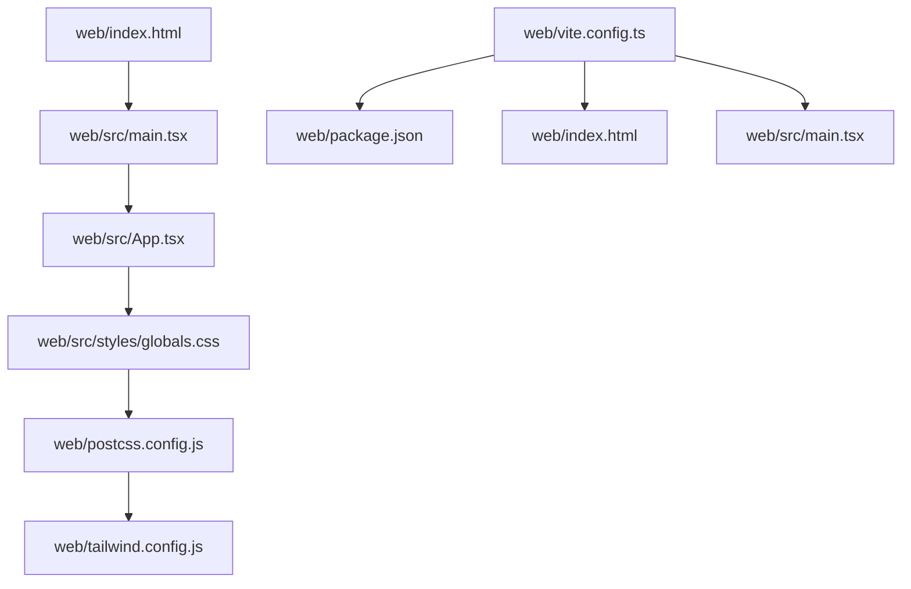
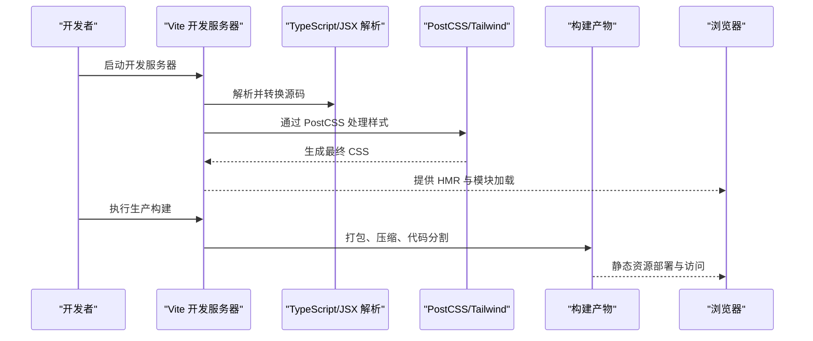
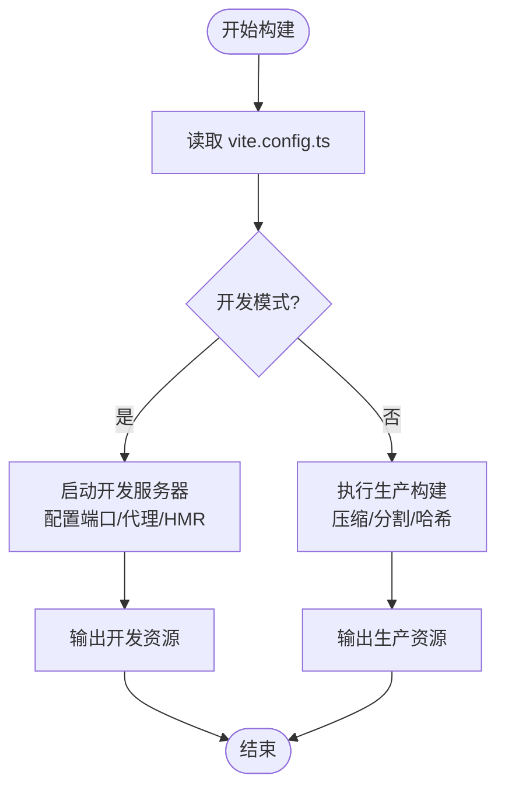
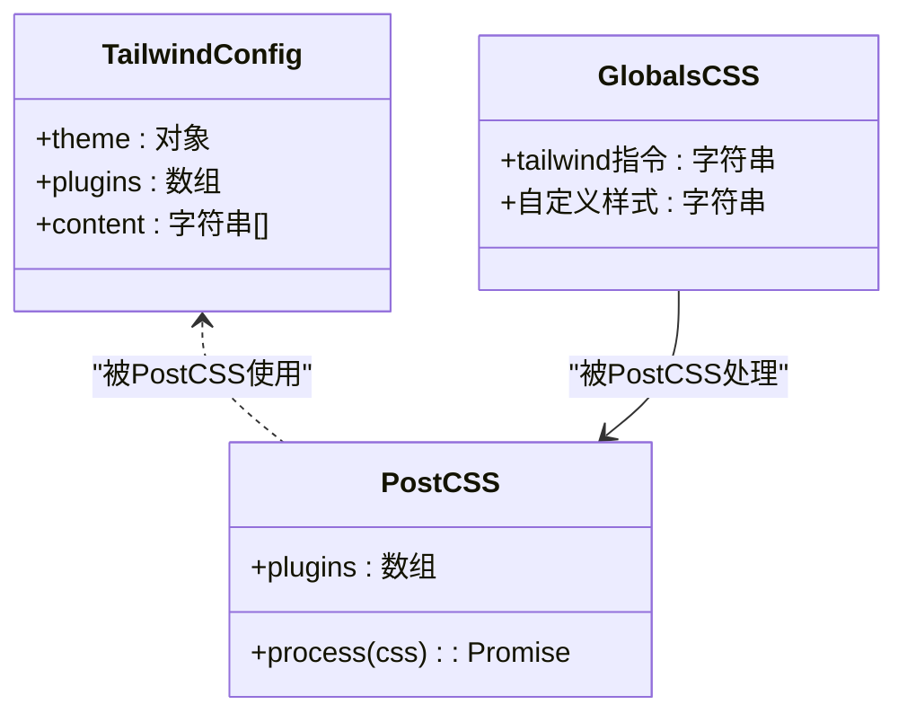
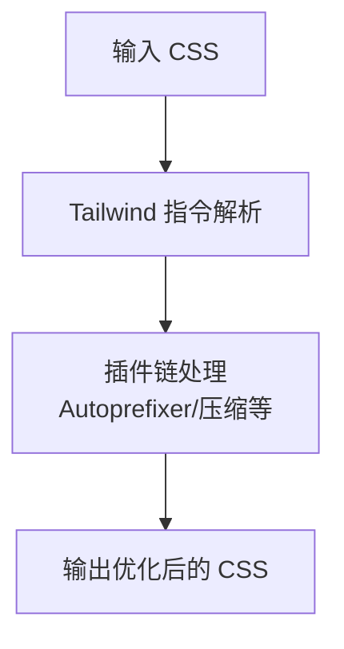
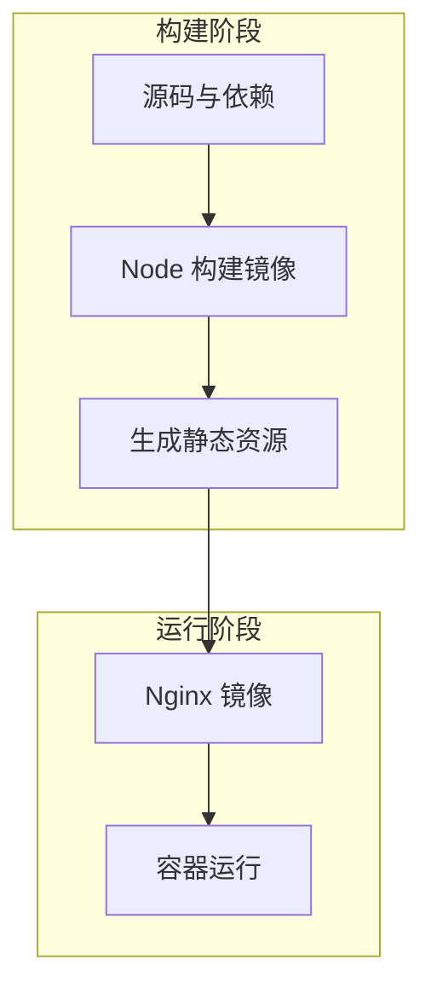
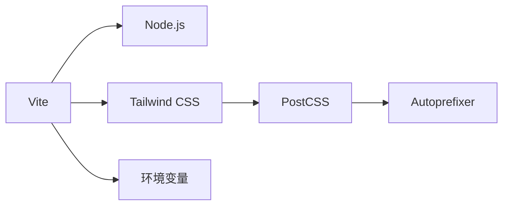

# 构建与部署

<cite>
**本文引用的文件**   
- [web/vite.config.ts](file://web/vite.config.ts)
- [web/package.json](file://web/package.json)
- [web/postcss.config.js](file://web/postcss.config.js)
- [web/tailwind.config.js](file://web/tailwind.config.js)
- [web/index.html](file://web/index.html)
- [web/src/styles/globals.css](file://web/src/styles/globals.css)
- [web/src/main.tsx](file://web/src/main.tsx)
- [web/src/App.tsx](file://web/src/App.tsx)
</cite>

## 目录
1. [简介](#简介)
2. [项目结构](#项目结构)
3. [核心组件](#核心组件)
4. [架构总览](#架构总览)
5. [详细组件分析](#详细组件分析)
6. [依赖分析](#依赖分析)
7. [性能考虑](#性能考虑)
8. [故障排查指南](#故障排查指南)
9. [结论](#结论)
10. [附录](#附录)

## 简介
本指南面向FY200前端（位于 web 目录）的构建与部署，覆盖以下主题：
- Vite 开发服务器与生产构建配置、优化项与代码分割策略
- Tailwind CSS 集成与自定义主题、插件使用与样式优化
- PostCSS 处理流程与配置
- 环境变量管理与多环境部署策略
- Docker 容器化部署方案（镜像构建、资源优化、性能调优）
- CI/CD 流水线与自动化部署流程

本项目为浙江壹品慧财年经营数据分析平台，定位“Excel进、看板/报表出”的内部管理口径财务数据平台。前端基于 React + TypeScript + Vite + Tailwind CSS + PostCSS 技术栈，配合后端 Express + Prisma + PostgreSQL 提供完整的数据分析与报表能力。

## 项目结构
前端工程位于 web 目录，关键构建与样式相关文件如下：
- vite.config.ts：Vite 构建与开发服务器配置
- package.json：脚本命令与依赖声明
- postcss.config.js：PostCSS 处理链配置
- tailwind.config.js：Tailwind 主题与插件配置
- index.html：应用入口 HTML
- src/styles/globals.css：全局样式与 Tailwind 指令
- src/main.tsx：React 应用挂载点
- src/App.tsx：应用根组件

**图表来源** 
- [web/vite.config.ts](file://web/vite.config.ts)
- [web/package.json](file://web/package.json)
- [web/postcss.config.js](file://web/postcss.config.js)
- [web/tailwind.config.js](file://web/tailwind.config.js)
- [web/index.html](file://web/index.html)
- [web/src/styles/globals.css](file://web/src/styles/globals.css)
- [web/src/main.tsx](file://web/src/main.tsx)
- [web/src/App.tsx](file://web/src/App.tsx)

**章节来源**
- [web/vite.config.ts](file://web/vite.config.ts)
- [web/package.json](file://web/package.json)
- [web/postcss.config.js](file://web/postcss.config.js)
- [web/tailwind.config.js](file://web/tailwind.config.js)
- [web/index.html](file://web/index.html)
- [web/src/styles/globals.css](file://web/src/styles/globals.css)
- [web/src/main.tsx](file://web/src/main.tsx)
- [web/src/App.tsx](file://web/src/App.tsx)

## 核心组件
- Vite 构建系统：负责开发服务器、模块热替换、打包与优化
- Tailwind CSS：原子化样式框架，通过 PostCSS 进行编译与优化
- PostCSS：CSS 后处理器，串联 Tailwind、Autoprefixer 等插件
- 环境变量：通过 Vite 注入到前端，支持多环境差异化配置
- 入口与路由：index.html 作为页面入口，main.tsx 挂载 React 应用，App.tsx 组织页面与布局

**章节来源**
- [web/vite.config.ts](file://web/vite.config.ts)
- [web/postcss.config.js](file://web/postcss.config.js)
- [web/tailwind.config.js](file://web/tailwind.config.js)
- [web/index.html](file://web/index.html)
- [web/src/main.tsx](file://web/src/main.tsx)
- [web/src/App.tsx](file://web/src/App.tsx)

## 架构总览
下图展示了从源码到构建产物与运行时的整体流程，包括开发服务器与生产构建路径。

**图表来源** 
- [web/vite.config.ts](file://web/vite.config.ts)
- [web/postcss.config.js](file://web/postcss.config.js)
- [web/tailwind.config.js](file://web/tailwind.config.js)
- [web/index.html](file://web/index.html)
- [web/src/main.tsx](file://web/src/main.tsx)

## 详细组件分析

### Vite 构建与优化
- 开发服务器
  - 端口与代理：可通过配置指定开发服务器端口与 API 代理，便于本地联调后端服务
  - 模块热替换（HMR）：默认启用，提升开发体验
  - 源码映射：开发阶段开启 sourcemap，便于调试
- 生产构建
  - 输出目录与基础路径：可配置构建产物输出目录与公共基础路径
  - 代码分割：按路由或大模块拆分，减少首屏体积
  - 压缩与优化：启用 JS/CSS 压缩、Tree Shaking、预加载提示
  - 资源哈希：文件名带内容哈希，利于缓存更新
- 环境变量
  - 通过 Vite 注入的环境变量可在运行时读取，支持 .env.* 文件与环境前缀
  - 建议区分开发、测试、生产环境，避免硬编码敏感信息

**图表来源** 
- [web/vite.config.ts](file://web/vite.config.ts)

**章节来源**
- [web/vite.config.ts](file://web/vite.config.ts)
- [web/package.json](file://web/package.json)

### Tailwind CSS 集成与主题
- 安装与初始化
  - 在项目中安装 Tailwind 与相关依赖，并通过 CLI 初始化配置文件
- 主题定制
  - 在 tailwind.config.js 中扩展颜色、字体、间距、断点等设计令牌
  - 使用自定义插件扩展工具类或生成动态样式
- 样式优化
  - 通过 PurgeCSS（Tailwind v3 内置）移除未使用的样式，减小 CSS 体积
  - 结合 PostCSS 插件（如 Autoprefixer）确保跨浏览器兼容
- 使用方式
  - 在入口样式文件中引入 Tailwind 指令，确保全局样式生效

**图表来源** 
- [web/tailwind.config.js](file://web/tailwind.config.js)
- [web/postcss.config.js](file://web/postcss.config.js)
- [web/src/styles/globals.css](file://web/src/styles/globals.css)

**章节来源**
- [web/tailwind.config.js](file://web/tailwind.config.js)
- [web/postcss.config.js](file://web/postcss.config.js)
- [web/src/styles/globals.css](file://web/src/styles/globals.css)

### PostCSS 处理流程
- 处理链
  - 输入 CSS → Tailwind 指令解析 → 插件链（如 Autoprefixer）→ 输出 CSS
- 插件配置
  - 在 postcss.config.js 中注册插件与参数
  - 确保 Tailwind 与 Autoprefixer 的顺序正确
- 优化策略
  - 启用 CSS 压缩与去重
  - 按需引入与 Tree Shaking，减少无用样式

**图表来源** 
- [web/postcss.config.js](file://web/postcss.config.js)
- [web/tailwind.config.js](file://web/tailwind.config.js)

**章节来源**
- [web/postcss.config.js](file://web/postcss.config.js)
- [web/tailwind.config.js](file://web/tailwind.config.js)

### 环境变量与多环境部署
- 环境变量管理
  - 使用 .env.development、.env.production 等文件定义不同环境的变量
  - 通过 Vite 注入到前端，运行时通过特定 API 读取
- 多环境策略
  - 开发环境：启用详细日志、禁用部分安全限制、指向本地后端
  - 测试环境：模拟数据、限流与权限校验开关
  - 生产环境：关闭调试、启用严格安全策略、指向线上后端
- 最佳实践
  - 敏感信息不入库，使用 CI/CD 注入密钥
  - 统一命名规范，避免冲突

**章节来源**
- [web/vite.config.ts](file://web/vite.config.ts)
- [web/package.json](file://web/package.json)

### Docker 容器化部署
- 镜像构建
  - 使用多阶段构建：第一阶段构建静态资源，第二阶段仅包含静态服务器（如 Nginx）
  - 最小化基础镜像，减少攻击面与镜像体积
- 资源优化
  - 构建产物压缩与缓存命中优化
  - 合理设置 HTTP 缓存头与 CDN 策略
- 性能调优
  - 调整 Nginx 并发与缓冲参数
  - 启用 gzip/brotli 压缩
  - 合理分配内存与 CPU 资源

[本节为概念性说明，无需列出具体文件来源]

### CI/CD 流水线与自动化部署
- 流水线步骤
  - 拉取代码 → 安装依赖 → 单元测试 → 构建产物 → 推送镜像 → 部署到目标环境
- 自动化策略
  - 分支触发：主分支自动发布生产，特性分支自动发布预览
  - 缓存依赖：加速构建时间
  - 制品归档：保存构建产物与测试报告
- 回滚与监控
  - 版本标记与快速回滚
  - 健康检查与告警

[本节为概念性说明，无需列出具体文件来源]

## 依赖分析
前端构建依赖关系如下：
- Vite 依赖 Node.js 环境与包管理器
- Tailwind CSS 依赖 PostCSS 与相关插件
- 环境变量由 Vite 注入，影响构建与运行时行为

**图表来源** 
- [web/vite.config.ts](file://web/vite.config.ts)
- [web/postcss.config.js](file://web/postcss.config.js)
- [web/tailwind.config.js](file://web/tailwind.config.js)

**章节来源**
- [web/vite.config.ts](file://web/vite.config.ts)
- [web/postcss.config.js](file://web/postcss.config.js)
- [web/tailwind.config.js](file://web/tailwind.config.js)

## 性能考虑
- 首屏优化
  - 路由级代码分割与懒加载
  - 关键 CSS 内联与非关键 CSS 异步加载
  - 图片与媒体资源优化（WebP、懒加载）
- 缓存策略
  - 静态资源使用内容哈希，长期缓存
  - HTML 短缓存或无缓存，确保更新及时
- 网络优化
  - 启用 HTTP/2 与 TLS 优化
  - 使用 CDN 分发静态资源
- 监控与分析
  - 接入性能监控（如 Lighthouse、Sentry）
  - 定期分析构建产物体积与加载耗时

[本节为通用指导，无需列出具体文件来源]

## 故障排查指南
- 构建失败
  - 检查 Node.js 版本与依赖是否匹配
  - 查看控制台错误堆栈，定位具体模块问题
- 样式异常
  - 确认 Tailwind 指令是否正确引入
  - 检查 postcss.config.js 插件顺序与参数
- 环境变量未生效
  - 确认 .env 文件命名与位置
  - 检查 Vite 注入的前缀与读取方式
- 部署问题
  - 验证静态资源路径与基础路径配置
  - 检查服务器权限与端口占用

**章节来源**
- [web/vite.config.ts](file://web/vite.config.ts)
- [web/postcss.config.js](file://web/postcss.config.js)
- [web/tailwind.config.js](file://web/tailwind.config.js)

## 结论
本指南系统性地梳理了 FY200 前端的构建与部署流程，涵盖 Vite、Tailwind、PostCSS、环境变量、Docker 与 CI/CD 等关键环节。遵循本文档的配置与优化建议，可有效提升开发效率与生产稳定性，确保平台在高并发与大数据量场景下的良好表现。

[本节为总结性内容，无需列出具体文件来源]

## 附录
- 常用命令
  - 开发：启动本地开发服务器
  - 构建：生成生产环境静态资源
  - 预览：本地预览构建产物
- 参考文档
  - Vite 官方文档
  - Tailwind CSS 官方文档
  - PostCSS 官方文档
  - Docker 官方文档

[本节为补充信息，无需列出具体文件来源]