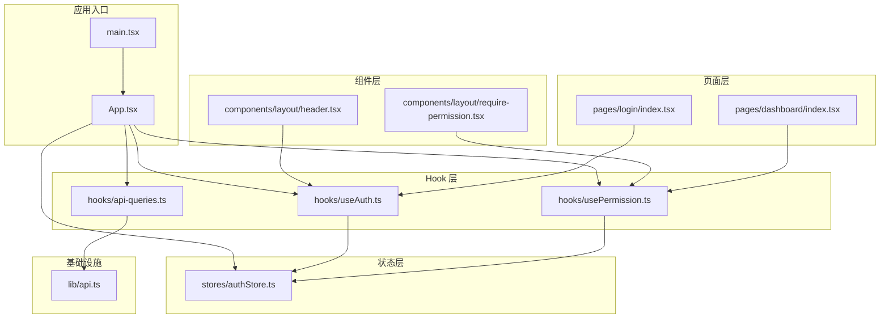
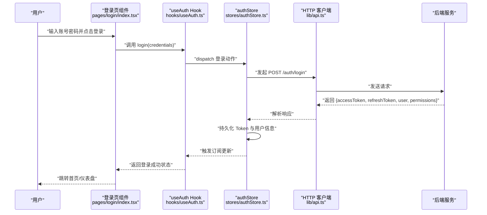
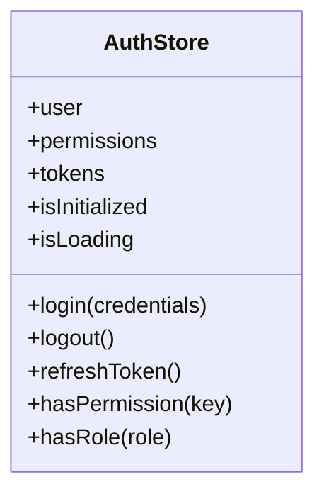
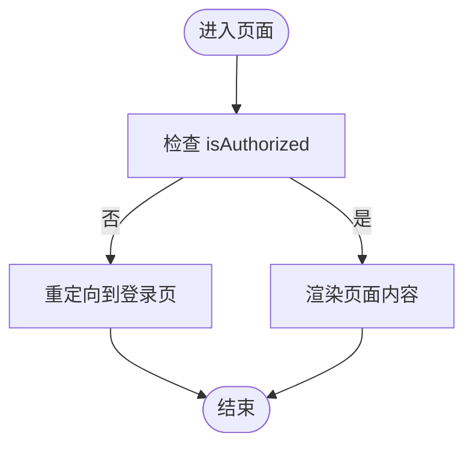
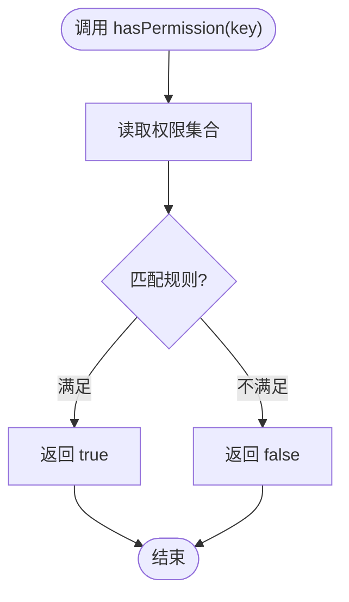
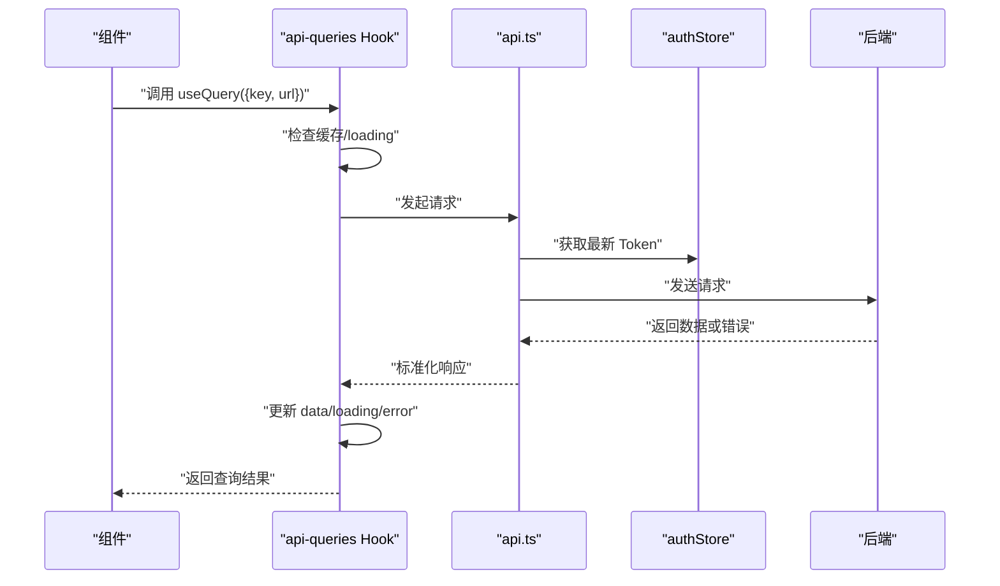
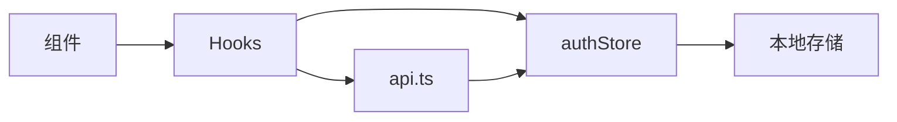

# 状态管理

<cite>
**本文引用的文件**   
- [authStore.ts](file://web/src/stores/authStore.ts)
- [useAuth.ts](file://web/src/hooks/useAuth.ts)
- [usePermission.ts](file://web/src/hooks/usePermission.ts)
- [api.ts](file://web/src/lib/api.ts)
- [api-queries.ts](file://web/src/hooks/api-queries.ts)
- [main.tsx](file://web/src/main.tsx)
- [App.tsx](file://web/src/App.tsx)
- [header.tsx](file://web/src/components/layout/header.tsx)
- [require-permission.tsx](file://web/src/components/layout/require-permission.tsx)
- [login/index.tsx](file://web/src/pages/login/index.tsx)
- [dashboard/index.tsx](file://web/src/pages/dashboard/index.tsx)
</cite>

## 目录
1. [简介](#简介)
2. [项目结构](#项目结构)
3. [核心组件](#核心组件)
4. [架构总览](#架构总览)
5. [详细组件分析](#详细组件分析)
6. [依赖关系分析](#依赖关系分析)
7. [性能考量](#性能考量)
8. [故障排查指南](#故障排查指南)
9. [结论](#结论)
10. [附录](#附录)

## 简介
本指南聚焦 FY200 前端的状态管理，围绕基于 Zustand 的 store 模式与自定义 Hooks 展开。重点包括：
- authStore 的设计与使用（认证、权限、会话生命周期）
- useAuth 与 usePermission 的业务封装（鉴权、路由守卫、UI 控制）
- API 客户端的状态策略（请求状态、错误处理、数据缓存）
- 全局状态与局部状态的分层管理原则与实践
- 状态同步、异步操作处理与性能优化最佳实践

## 项目结构
FY200 前端采用“按功能域 + 分层”组织方式：
- stores：全局状态（Zustand store）
- hooks：业务 Hook（认证、权限、API 查询等）
- lib：基础设施（HTTP 客户端、常量、工具）
- components：可复用 UI 与布局（含权限守卫）
- pages：页面级实现（登录、看板等）

图表来源 
- [main.tsx](file://web/src/main.tsx)
- [App.tsx](file://web/src/App.tsx)
- [authStore.ts](file://web/src/stores/authStore.ts)
- [useAuth.ts](file://web/src/hooks/useAuth.ts)
- [usePermission.ts](file://web/src/hooks/usePermission.ts)
- [api-queries.ts](file://web/src/hooks/api-queries.ts)
- [api.ts](file://web/src/lib/api.ts)
- [header.tsx](file://web/src/components/layout/header.tsx)
- [require-permission.tsx](file://web/src/components/layout/require-permission.tsx)
- [login/index.tsx](file://web/src/pages/login/index.tsx)
- [dashboard/index.tsx](file://web/src/pages/dashboard/index.tsx)

章节来源
- [main.tsx](file://web/src/main.tsx)
- [App.tsx](file://web/src/App.tsx)

## 核心组件
- authStore（Zustand Store）
  - 职责：维护用户身份、角色/权限集合、Token 生命周期、登录态持久化、登出清理
  - 关键能力：登录/登出、刷新 Token、权限判定、状态订阅与选择性更新
- useAuth（认证 Hook）
  - 职责：暴露当前用户信息、登录态、登录/登出动作；提供受保护路由判断
  - 设计：薄封装 store，避免重复逻辑，统一错误提示
- usePermission（权限 Hook）
  - 职责：基于角色/权限集合进行细粒度授权判断；支持组合条件
  - 设计：纯函数式校验，便于在组件与路由守卫中复用
- API 客户端（lib/api.ts）
  - 职责：统一 HTTP 请求、拦截器（鉴权头、错误码）、重试与超时、错误归一化
- API 查询 Hook（hooks/api-queries.ts）
  - 职责：封装常用 CRUD 查询，管理加载/错误/数据缓存，减少样板代码

章节来源
- [authStore.ts](file://web/src/stores/authStore.ts)
- [useAuth.ts](file://web/src/hooks/useAuth.ts)
- [usePermission.ts](file://web/src/hooks/usePermission.ts)
- [api.ts](file://web/src/lib/api.ts)
- [api-queries.ts](file://web/src/hooks/api-queries.ts)

## 架构总览
整体采用“Store + Hooks + 组件”的分层架构：
- Store 层：Zustand 单例状态，跨组件共享
- Hook 层：将 Store 与业务逻辑解耦，提供声明式 API
- 组件层：仅消费 Hook 返回值，保持 UI 纯净
- 基础设施：HTTP 客户端负责网络与错误处理，Hook 层负责数据状态

图表来源 
- [login/index.tsx](file://web/src/pages/login/index.tsx)
- [useAuth.ts](file://web/src/hooks/useAuth.ts)
- [authStore.ts](file://web/src/stores/authStore.ts)
- [api.ts](file://web/src/lib/api.ts)

## 详细组件分析

### authStore（Zustand 认证状态）
- 状态字段建议
  - 用户信息：id、姓名、邮箱、头像等
  - 权限集合：角色列表、资源权限键
  - Token：access、refresh 及过期时间
  - 元数据：是否已初始化、是否加载中
- 关键方法
  - 登录：校验参数、调用 API、落盘、设置默认权限
  - 登出：清除本地存储、重置状态
  - 刷新 Token：无感续期，失败回退到登出
  - 权限判定：根据角色/权限键快速判断
- 订阅与选择器
  - 通过选择器订阅最小状态切片，避免不必要重渲染
  - 使用持久化中间件保证刷新后登录态不丢失

图表来源 
- [authStore.ts](file://web/src/stores/authStore.ts)

章节来源
- [authStore.ts](file://web/src/stores/authStore.ts)

### useAuth（认证 Hook）
- 职责
  - 暴露 isAuthorized、currentUser、actions（login/logout/refresh）
  - 统一错误提示与加载态
  - 为路由守卫提供便捷判断
- 设计要点
  - 直接订阅 authStore 的最小切片
  - 对异常进行捕获与降级（如网络错误、Token 失效）
  - 与路由集成时，优先检查 isAuthorized，再决定跳转或重定向

图表来源 
- [useAuth.ts](file://web/src/hooks/useAuth.ts)
- [header.tsx](file://web/src/components/layout/header.tsx)

章节来源
- [useAuth.ts](file://web/src/hooks/useAuth.ts)
- [header.tsx](file://web/src/components/layout/header.tsx)

### usePermission（权限 Hook）
- 职责
  - 基于角色与权限键进行细粒度判断
  - 支持组合条件（且/或/非）
  - 为 UI 元素显示/隐藏提供依据
- 设计要点
  - 纯函数式校验，避免副作用
  - 与 require-permission 组件配合，实现声明式权限控制
  - 与路由守卫结合，实现页面级权限

图表来源 
- [usePermission.ts](file://web/src/hooks/usePermission.ts)
- [require-permission.tsx](file://web/src/components/layout/require-permission.tsx)

章节来源
- [usePermission.ts](file://web/src/hooks/usePermission.ts)
- [require-permission.tsx](file://web/src/components/layout/require-permission.tsx)

### API 客户端与查询 Hook
- lib/api.ts
  - 统一请求配置（基础 URL、超时、重试）
  - 请求拦截：注入 Authorization、租户/范围头
  - 响应拦截：统一错误码映射、Token 失效处理、消息提示
- hooks/api-queries.ts
  - 封装 get/post/put/delete 的通用查询 Hook
  - 管理 loading/error/data 三态
  - 可选缓存策略（内存/URL 维度）

图表来源 
- [api-queries.ts](file://web/src/hooks/api-queries.ts)
- [api.ts](file://web/src/lib/api.ts)
- [authStore.ts](file://web/src/stores/authStore.ts)

章节来源
- [api.ts](file://web/src/lib/api.ts)
- [api-queries.ts](file://web/src/hooks/api-queries.ts)

### 页面与组件中的使用示例
- 登录页
  - 使用 useAuth.login 提交表单，成功后跳转到首页
- 仪表盘
  - 使用 usePermission 控制菜单项与按钮可见性
- 头部导航
  - 根据 isAuthorized 展示用户信息与退出按钮

章节来源
- [login/index.tsx](file://web/src/pages/login/index.tsx)
- [dashboard/index.tsx](file://web/src/pages/dashboard/index.tsx)
- [header.tsx](file://web/src/components/layout/header.tsx)

## 依赖关系分析
- 组件依赖 Hook，Hook 依赖 Store 与 API 客户端
- Store 依赖持久化与 Token 管理
- API 客户端依赖全局配置与错误处理策略

图表来源 
- [App.tsx](file://web/src/App.tsx)
- [useAuth.ts](file://web/src/hooks/useAuth.ts)
- [usePermission.ts](file://web/src/hooks/usePermission.ts)
- [authStore.ts](file://web/src/stores/authStore.ts)
- [api.ts](file://web/src/lib/api.ts)

章节来源
- [App.tsx](file://web/src/App.tsx)
- [useAuth.ts](file://web/src/hooks/useAuth.ts)
- [usePermission.ts](file://web/src/hooks/usePermission.ts)
- [authStore.ts](file://web/src/stores/authStore.ts)
- [api.ts](file://web/src/lib/api.ts)

## 性能考量
- 选择器订阅
  - 使用 Zustand 选择器只订阅必要字段，降低重渲染
- 状态分片
  - 将大对象拆分为小切片，按需更新
- 缓存策略
  - 对读多写少的数据启用短期缓存，合理设置失效时间
- 防抖与节流
  - 搜索、滚动等高频事件需节流；表单提交防抖
- 懒加载
  - 路由与重型组件按需加载，减少首屏体积
- 错误边界
  - 对可能抛错的模块包裹错误边界，提升稳定性

[本节为通用指导，不直接分析具体文件]

## 故障排查指南
- 常见症状
  - 登录后仍被重定向到登录页：检查 Token 持久化与 isAuthorized 逻辑
  - 权限按钮不显示：确认权限键与后端返回一致，检查 usePermission 规则
  - 接口 401/403：查看拦截器是否正确注入 Token，以及权限判定逻辑
  - 页面闪烁或卡顿：检查是否订阅了过多状态，是否缺少选择器
- 定位步骤
  - 打开浏览器控制台，观察网络请求与错误日志
  - 在 Hook 中打印关键状态变化，确认数据流
  - 临时禁用缓存，验证是否为缓存导致的不一致
- 修复建议
  - 统一错误码映射与提示
  - 增加重试与退避策略
  - 完善单元测试与集成测试覆盖

章节来源
- [api.ts](file://web/src/lib/api.ts)
- [useAuth.ts](file://web/src/hooks/useAuth.ts)
- [usePermission.ts](file://web/src/hooks/usePermission.ts)

## 结论
FY200 前端状态管理以 Zustand 为核心，结合自定义 Hook 实现清晰的职责分离与高内聚。通过统一的 API 客户端与查询 Hook，实现了稳定的请求状态管理与错误处理。遵循全局/局部状态分层、选择器订阅与缓存策略，可在保证可维护性的同时获得良好性能。建议在后续迭代中持续完善权限模型、扩展缓存策略与监控埋点。

[本节为总结性内容，不直接分析具体文件]

## 附录
- 术语表
  - 全局状态：跨组件共享的状态（如用户信息、权限）
  - 局部状态：组件内部状态（如表单值、弹窗显隐）
  - 选择器：Zustand 中用于订阅最小状态切片的机制
  - 拦截器：在请求/响应前后执行的钩子，用于注入头、错误处理等
- 最佳实践清单
  - 明确状态所有权，避免重复状态
  - 使用选择器订阅最小切片
  - 对异步操作集中管理 loading/error/data
  - 统一错误处理与用户提示
  - 对敏感信息进行脱敏与最小化传输

[本节为补充说明，不直接分析具体文件]