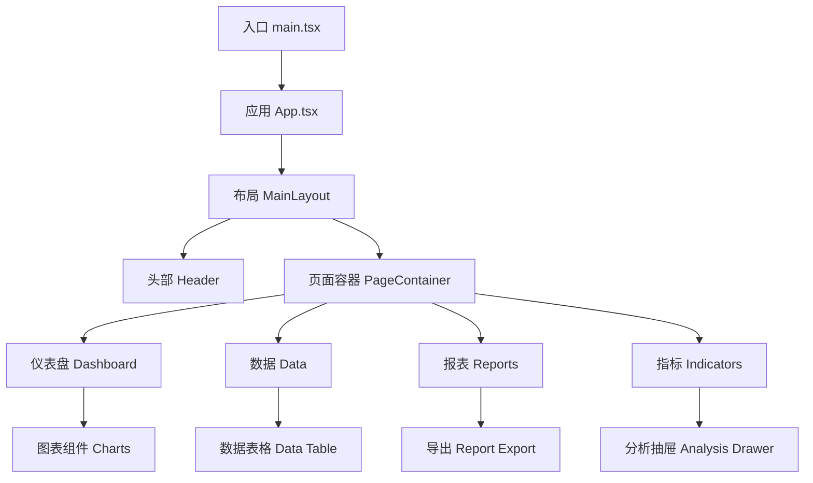
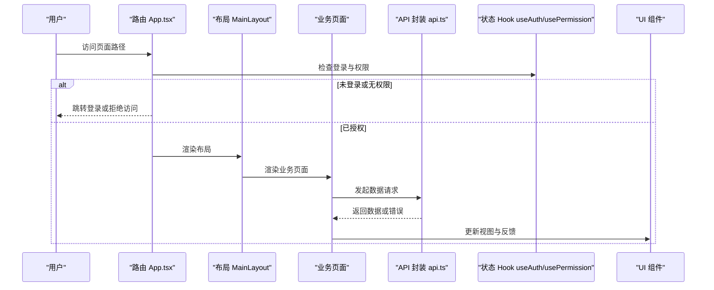
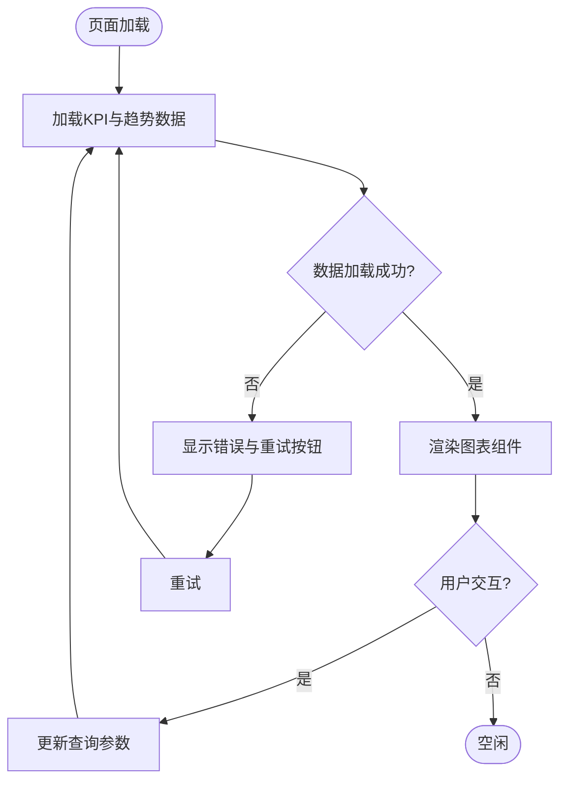
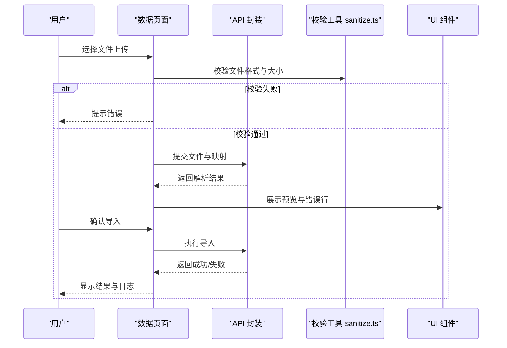
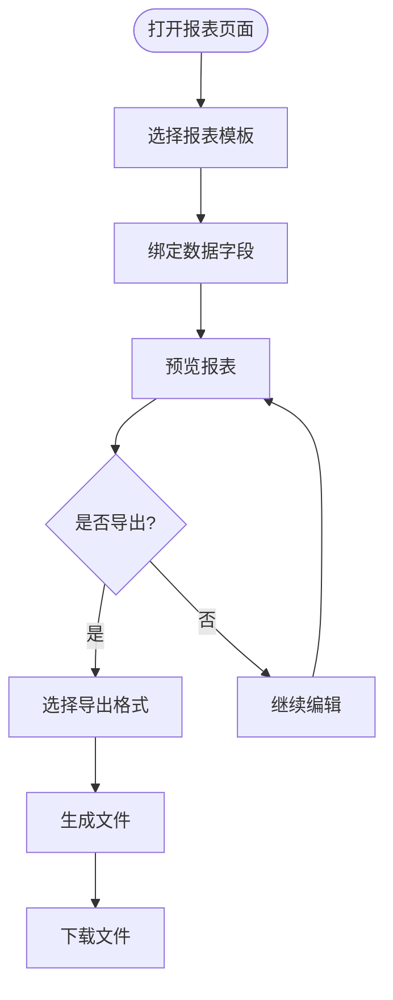
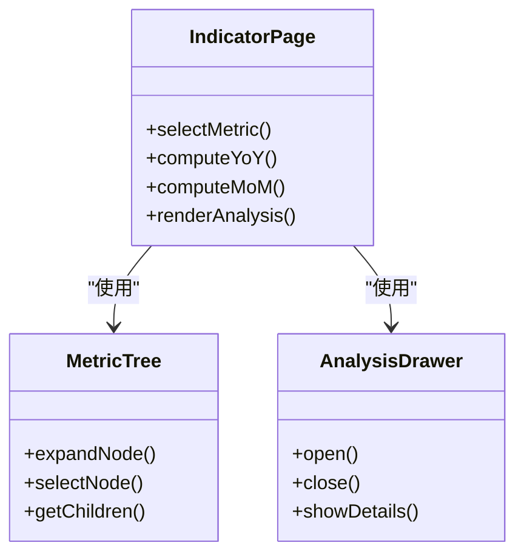
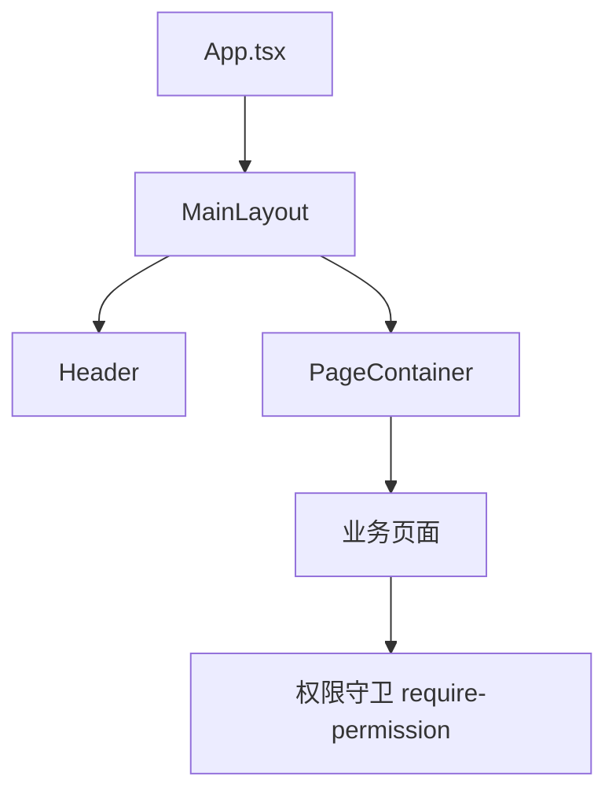
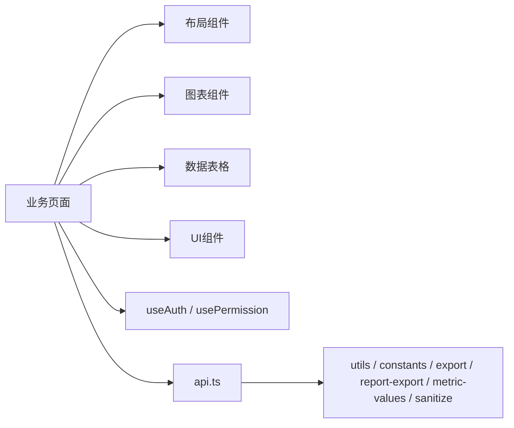

# 页面开发

<cite>
**本文引用的文件**   
- [web/src/App.tsx](file://web/src/App.tsx)
- [web/src/main.tsx](file://web/src/main.tsx)
- [web/src/pages/dashboard/index.tsx](file://web/src/pages/dashboard/index.tsx)
- [web/src/pages/data/index.tsx](file://web/src/pages/data/index.tsx)
- [web/src/pages/reports/index.tsx](file://web/src/pages/reports/index.tsx)
- [web/src/pages/indicators/index.tsx](file://web/src/pages/indicators/index.tsx)
- [web/src/components/layout/main-layout.tsx](file://web/src/components/layout/main-layout.tsx)
- [web/src/components/layout/header.tsx](file://web/src/components/layout/header.tsx)
- [web/src/components/layout/page-container.tsx](file://web/src/components/layout/page-container.tsx)
- [web/src/components/layout/require-permission.tsx](file://web/src/components/layout/require-permission.tsx)
- [web/src/hooks/useAuth.ts](file://web/src/hooks/useAuth.ts)
- [web/src/hooks/usePermission.ts](file://web/src/hooks/usePermission.ts)
- [web/src/stores/authStore.ts](file://web/src/stores/authStore.ts)
- [web/src/lib/api.ts](file://web/src/lib/api.ts)
- [web/src/lib/constants.ts](file://web/src/lib/constants.ts)
- [web/src/lib/export.ts](file://web/src/lib/export.ts)
- [web/src/lib/report-export.ts](file://web/src/lib/report-export.ts)
- [web/src/lib/metric-values.ts](file://web/src/lib/metric-values.ts)
- [web/src/lib/sanitize.ts](file://web/src/lib/sanitize.ts)
- [web/src/lib/utils.ts](file://web/src/lib/utils.ts)
- [web/src/components/charts/kpi-card.tsx](file://web/src/components/charts/kpi-card.tsx)
- [web/src/components/charts/kpi-sparkline.tsx](file://web/src/components/charts/kpi-sparkline.tsx)
- [web/src/components/charts/mini-bar-chart.tsx](file://web/src/components/charts/mini-bar-chart.tsx)
- [web/src/components/charts/trend-chart.tsx](file://web/src/components/charts/trend-chart.tsx)
- [web/src/components/data-table/pro-data-table.tsx](file://web/src/components/data-table/pro-data-table.tsx)
- [web/src/components/data-table/pagination.tsx](file://web/src/components/data-table/pagination.tsx)
- [web/src/components/ui/button.tsx](file://web/src/components/ui/button.tsx)
- [web/src/components/ui/dialog.tsx](file://web/src/components/ui/dialog.tsx)
- [web/src/components/ui/card.tsx](file://web/src/components/ui/card.tsx)
- [web/src/components/ui/skeleton.tsx](file://web/src/components/ui/skeleton.tsx)
- [web/src/components/ui/status-indicator.tsx](file://web/src/components/ui/status-indicator.tsx)
- [web/src/components/dimension/aggregation-map-panel.tsx](file://web/src/components/dimension/aggregation-map-panel.tsx)
- [web/src/components/dimension/company-panel.tsx](file://web/src/components/dimension/company-panel.tsx)
- [web/src/components/subject-tree/metric-tree.tsx](file://web/src/components/subject-tree/metric-tree.tsx)
- [web/src/components/subject-tree/subject-tree-panel.tsx](file://web/src/components/subject-tree/subject-tree-panel.tsx)
- [web/src/components/indicators/analysis-drawer.tsx](file://web/src/components/indicators/analysis-drawer.tsx)
- [web/src/mock/data.ts](file://web/src/mock/data.ts)
- [web/vite.config.ts](file://web/vite.config.ts)
- [web/package.json](file://web/package.json)
</cite>

## 目录
1. [简介](#简介)
2. [项目结构](#项目结构)
3. [核心组件](#核心组件)
4. [架构总览](#架构总览)
5. [详细组件分析](#详细组件分析)
6. [依赖关系分析](#依赖关系分析)
7. [性能考虑](#性能考虑)
8. [故障排查指南](#故障排查指南)
9. [结论](#结论)
10. [附录](#附录)

## 简介
本指南面向FY200前端页面开发，聚焦于Dashboard、Data、Reports、Indicators等业务页面的实现模式与最佳实践。内容涵盖：
- 页面组件组织与布局系统（Header、MainLayout等）
- 路由配置与导航逻辑，含权限控制的路由守卫
- 页面状态管理（表单处理、数据加载、错误处理、用户反馈）
- 页面性能优化（代码分割、懒加载、资源优化）
- 页面测试策略与调试方法

本项目为浙江壹品慧财年经营数据分析平台，定位“Excel进、看板/报表出”的内部管理口径财务数据平台，单位统一为万元/人民币。

## 项目结构
前端采用Vite + React + TypeScript构建，按功能域划分目录：
- pages：业务页面（dashboard、data、reports、indicators等）
- components：可复用组件（charts、data-table、layout、ui、dimension、subject-tree、indicators等）
- hooks：自定义Hook（useAuth、usePermission等）
- stores：全局状态（authStore）
- lib：工具库（api、constants、export、report-export、metric-values、sanitize、utils等）
- mock：本地模拟数据
- public：静态资源

图示来源
- [web/src/main.tsx:1-50](file://web/src/main.tsx#L1-L50)
- [web/src/App.tsx:1-120](file://web/src/App.tsx#L1-L120)
- [web/src/components/layout/main-layout.tsx:1-120](file://web/src/components/layout/main-layout.tsx#L1-L120)
- [web/src/components/layout/header.tsx:1-120](file://web/src/components/layout/header.tsx#L1-L120)
- [web/src/components/layout/page-container.tsx:1-120](file://web/src/components/layout/page-container.tsx#L1-L120)

章节来源
- [web/src/main.tsx:1-50](file://web/src/main.tsx#L1-L50)
- [web/src/App.tsx:1-120](file://web/src/App.tsx#L1-L120)
- [web/package.json:1-60](file://web/package.json#L1-L60)

## 核心组件
- 布局系统
  - MainLayout：整体布局容器，承载Header与页面区域
  - Header：顶部导航、用户信息、菜单切换
  - PageContainer：页面级容器，提供统一的边距、标题、操作区
- 图表与可视化
  - KPI卡片、迷你折线、迷你柱状图、趋势图
- 数据表格
  - ProDataTable：分页、筛选、排序、批量操作
  - Pagination：分页控件
- 维度与主题树
  - AggregationMapPanel、CompanyPanel：维度聚合面板
  - MetricTree、SubjectTreePanel：指标与科目树
- 指标分析
  - AnalysisDrawer：侧边分析抽屉

章节来源
- [web/src/components/layout/main-layout.tsx:1-120](file://web/src/components/layout/main-layout.tsx#L1-L120)
- [web/src/components/layout/header.tsx:1-120](file://web/src/components/layout/header.tsx#L1-L120)
- [web/src/components/layout/page-container.tsx:1-120](file://web/src/components/layout/page-container.tsx#L1-L120)
- [web/src/components/charts/kpi-card.tsx:1-120](file://web/src/components/charts/kpi-card.tsx#L1-L120)
- [web/src/components/charts/kpi-sparkline.tsx:1-120](file://web/src/components/charts/kpi-sparkline.tsx#L1-L120)
- [web/src/components/charts/mini-bar-chart.tsx:1-120](file://web/src/components/charts/mini-bar-chart.tsx#L1-L120)
- [web/src/components/charts/trend-chart.tsx:1-120](file://web/src/components/charts/trend-chart.tsx#L1-L120)
- [web/src/components/data-table/pro-data-table.tsx:1-200](file://web/src/components/data-table/pro-data-table.tsx#L1-L200)
- [web/src/components/data-table/pagination.tsx:1-120](file://web/src/components/data-table/pagination.tsx#L1-L120)
- [web/src/components/dimension/aggregation-map-panel.tsx:1-120](file://web/src/components/dimension/aggregation-map-panel.tsx#L1-L120)
- [web/src/components/dimension/company-panel.tsx:1-120](file://web/src/components/dimension/company-panel.tsx#L1-L120)
- [web/src/components/subject-tree/metric-tree.tsx:1-120](file://web/src/components/subject-tree/metric-tree.tsx#L1-L120)
- [web/src/components/subject-tree/subject-tree-panel.tsx:1-120](file://web/src/components/subject-tree/subject-tree-panel.tsx#L1-L120)
- [web/src/components/indicators/analysis-drawer.tsx:1-120](file://web/src/components/indicators/analysis-drawer.tsx#L1-L120)

## 架构总览
前端以React为核心，通过Vite进行模块打包与按需加载；页面通过路由进入，使用布局组件包裹业务页面；数据请求通过lib/api封装，结合自定义Hook进行状态管理与副作用处理；权限控制通过路由守卫与组件级权限校验双重保障。

图示来源
- [web/src/App.tsx:1-120](file://web/src/App.tsx#L1-L120)
- [web/src/components/layout/main-layout.tsx:1-120](file://web/src/components/layout/main-layout.tsx#L1-L120)
- [web/src/lib/api.ts:1-120](file://web/src/lib/api.ts#L1-L120)
- [web/src/hooks/useAuth.ts:1-120](file://web/src/hooks/useAuth.ts#L1-L120)
- [web/src/hooks/usePermission.ts:1-120](file://web/src/hooks/usePermission.ts#L1-L120)

## 详细组件分析

### 仪表盘（Dashboard）页面
- 职责：展示关键KPI、趋势与聚合图表
- 数据流：页面初始化触发数据加载，图表组件消费数据并渲染
- 交互：时间范围选择、维度切换、刷新
- 错误处理：网络异常与数据格式校验失败时显示骨架屏与提示

图示来源
- [web/src/pages/dashboard/index.tsx:1-200](file://web/src/pages/dashboard/index.tsx#L1-L200)
- [web/src/components/charts/kpi-card.tsx:1-120](file://web/src/components/charts/kpi-card.tsx#L1-L120)
- [web/src/components/charts/trend-chart.tsx:1-120](file://web/src/components/charts/trend-chart.tsx#L1-L120)
- [web/src/lib/api.ts:1-120](file://web/src/lib/api.ts#L1-L120)

章节来源
- [web/src/pages/dashboard/index.tsx:1-200](file://web/src/pages/dashboard/index.tsx#L1-L200)
- [web/src/components/charts/kpi-card.tsx:1-120](file://web/src/components/charts/kpi-card.tsx#L1-L120)
- [web/src/components/charts/trend-chart.tsx:1-120](file://web/src/components/charts/trend-chart.tsx#L1-L120)

### 数据（Data）页面
- 职责：数据导入、公式维护、历史版本查看
- 数据流：上传Excel→解析→校验→入库；公式规则编辑与验证
- 交互：文件拖拽、预览、批量操作、版本回滚
- 错误处理：文件格式校验失败、字段映射错误、公式语法错误

图示来源
- [web/src/pages/data/index.tsx:1-200](file://web/src/pages/data/index.tsx#L1-L200)
- [web/src/lib/sanitize.ts:1-120](file://web/src/lib/sanitize.ts#L1-L120)
- [web/src/lib/api.ts:1-120](file://web/src/lib/api.ts#L1-L120)

章节来源
- [web/src/pages/data/index.tsx:1-200](file://web/src/pages/data/index.tsx#L1-L200)
- [web/src/lib/sanitize.ts:1-120](file://web/src/lib/sanitize.ts#L1-L120)

### 报表（Reports）页面
- 职责：报表模板编辑、生成与导出
- 数据流：选择模板→填充数据→预览→导出PDF/Excel
- 交互：模板选择、字段绑定、条件过滤、导出格式选择
- 错误处理：模板缺失、数据为空、导出失败

图示来源
- [web/src/pages/reports/index.tsx:1-200](file://web/src/pages/reports/index.tsx#L1-L200)
- [web/src/lib/report-export.ts:1-120](file://web/src/lib/report-export.ts#L1-L120)
- [web/src/lib/export.ts:1-120](file://web/src/lib/export.ts#L1-L120)

章节来源
- [web/src/pages/reports/index.tsx:1-200](file://web/src/pages/reports/index.tsx#L1-L200)
- [web/src/lib/report-export.ts:1-120](file://web/src/lib/report-export.ts#L1-L120)
- [web/src/lib/export.ts:1-120](file://web/src/lib/export.ts#L1-L120)

### 指标（Indicators）页面
- 职责：指标定义、计算、分析与对比
- 数据流：指标树选择→计算同比/环比→可视化分析
- 交互：指标树展开、计算规则配置、分析抽屉
- 错误处理：指标不存在、计算规则非法、数据缺失

图示来源
- [web/src/pages/indicators/index.tsx:1-200](file://web/src/pages/indicators/index.tsx#L1-L200)
- [web/src/components/subject-tree/metric-tree.tsx:1-120](file://web/src/components/subject-tree/metric-tree.tsx#L1-L120)
- [web/src/components/indicators/analysis-drawer.tsx:1-120](file://web/src/components/indicators/analysis-drawer.tsx#L1-L120)

章节来源
- [web/src/pages/indicators/index.tsx:1-200](file://web/src/pages/indicators/index.tsx#L1-L200)
- [web/src/components/subject-tree/metric-tree.tsx:1-120](file://web/src/components/subject-tree/metric-tree.tsx#L1-L120)
- [web/src/components/indicators/analysis-drawer.tsx:1-120](file://web/src/components/indicators/analysis-drawer.tsx#L1-L120)

### 布局系统与导航
- MainLayout：统一布局容器，包含Header与主内容区
- Header：导航菜单、用户信息、快捷操作
- PageContainer：页面级容器，提供标题、操作区、消息提示
- 路由守卫：基于usePermission的权限校验，未授权时重定向或拒绝

图示来源
- [web/src/App.tsx:1-120](file://web/src/App.tsx#L1-L120)
- [web/src/components/layout/main-layout.tsx:1-120](file://web/src/components/layout/main-layout.tsx#L1-L120)
- [web/src/components/layout/header.tsx:1-120](file://web/src/components/layout/header.tsx#L1-L120)
- [web/src/components/layout/page-container.tsx:1-120](file://web/src/components/layout/page-container.tsx#L1-L120)
- [web/src/components/layout/require-permission.tsx:1-120](file://web/src/components/layout/require-permission.tsx#L1-L120)

章节来源
- [web/src/components/layout/main-layout.tsx:1-120](file://web/src/components/layout/main-layout.tsx#L1-L120)
- [web/src/components/layout/header.tsx:1-120](file://web/src/components/layout/header.tsx#L1-L120)
- [web/src/components/layout/page-container.tsx:1-120](file://web/src/components/layout/page-container.tsx#L1-L120)
- [web/src/components/layout/require-permission.tsx:1-120](file://web/src/components/layout/require-permission.tsx#L1-L120)

## 依赖关系分析
- 页面与组件：业务页面依赖图表、表格、布局与UI组件
- 状态与Hook：useAuth与usePermission提供认证与权限能力
- API封装：统一请求、错误处理、拦截器
- 工具库：常量、导出、指标值计算、脱敏、通用工具

图示来源
- [web/src/pages/dashboard/index.tsx:1-200](file://web/src/pages/dashboard/index.tsx#L1-L200)
- [web/src/pages/data/index.tsx:1-200](file://web/src/pages/data/index.tsx#L1-L200)
- [web/src/pages/reports/index.tsx:1-200](file://web/src/pages/reports/index.tsx#L1-L200)
- [web/src/pages/indicators/index.tsx:1-200](file://web/src/pages/indicators/index.tsx#L1-L200)
- [web/src/lib/api.ts:1-120](file://web/src/lib/api.ts#L1-L120)
- [web/src/lib/constants.ts:1-120](file://web/src/lib/constants.ts#L1-L120)
- [web/src/lib/export.ts:1-120](file://web/src/lib/export.ts#L1-L120)
- [web/src/lib/report-export.ts:1-120](file://web/src/lib/report-export.ts#L1-L120)
- [web/src/lib/metric-values.ts:1-120](file://web/src/lib/metric-values.ts#L1-L120)
- [web/src/lib/sanitize.ts:1-120](file://web/src/lib/sanitize.ts#L1-L120)
- [web/src/lib/utils.ts:1-120](file://web/src/lib/utils.ts#L1-L120)

章节来源
- [web/src/lib/api.ts:1-120](file://web/src/lib/api.ts#L1-L120)
- [web/src/hooks/useAuth.ts:1-120](file://web/src/hooks/useAuth.ts#L1-L120)
- [web/src/hooks/usePermission.ts:1-120](file://web/src/hooks/usePermission.ts#L1-L120)
- [web/src/stores/authStore.ts:1-120](file://web/src/stores/authStore.ts#L1-L120)

## 性能考虑
- 代码分割与懒加载
  - 使用动态导入将大组件与页面拆分，减少首屏体积
  - 对图表与复杂表格组件进行按需加载
- 数据加载优化
  - 请求去抖与节流，避免重复请求
  - 缓存常用数据（如指标树、字典），减少后端压力
- 渲染优化
  - 列表虚拟化，长列表只渲染可视区域
  - 使用骨架屏提升感知性能
- 资源优化
  - 图片与图标压缩与CDN加速
  - 字体与样式按需引入

[本节为通用指导，不直接分析具体文件]

## 故障排查指南
- 常见问题
  - 登录态丢失：检查JWT存储与刷新机制
  - 权限不足：核对角色与权限配置，确认路由守卫与组件级权限校验
  - 数据加载失败：检查API响应码与错误信息，查看网络请求与缓存
  - 导出失败：检查模板与数据完整性，确认导出库兼容性
- 调试方法
  - 使用浏览器开发者工具查看网络请求与响应
  - 在Hook与API层添加日志输出，定位问题链路
  - 使用Mock数据进行离线开发与测试

章节来源
- [web/src/hooks/useAuth.ts:1-120](file://web/src/hooks/useAuth.ts#L1-L120)
- [web/src/hooks/usePermission.ts:1-120](file://web/src/hooks/usePermission.ts#L1-L120)
- [web/src/lib/api.ts:1-120](file://web/src/lib/api.ts#L1-L120)
- [web/src/mock/data.ts:1-120](file://web/src/mock/data.ts#L1-L120)

## 结论
本指南系统化梳理了FY200前端页面开发的组织结构、路由与权限、状态管理、布局系统与性能优化策略。遵循本文档的实践，可显著提升页面开发效率与用户体验。建议在实际项目中结合团队规范与需求迭代持续优化。

[本节为总结性内容，不直接分析具体文件]

## 附录
- 开发环境配置
  - Node版本要求与包管理器
  - Vite环境变量与代理配置
- 测试策略
  - 单元测试：Hook、工具函数、组件片段
  - 集成测试：页面流程与API交互
  - 端到端测试：关键用户路径
- 调试技巧
  - 断点调试与日志分级
  - Mock数据与接口模拟

[本节为补充信息，不直接分析具体文件]