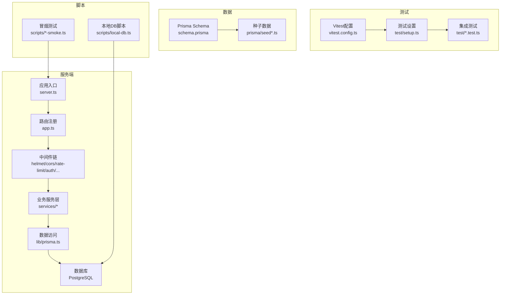
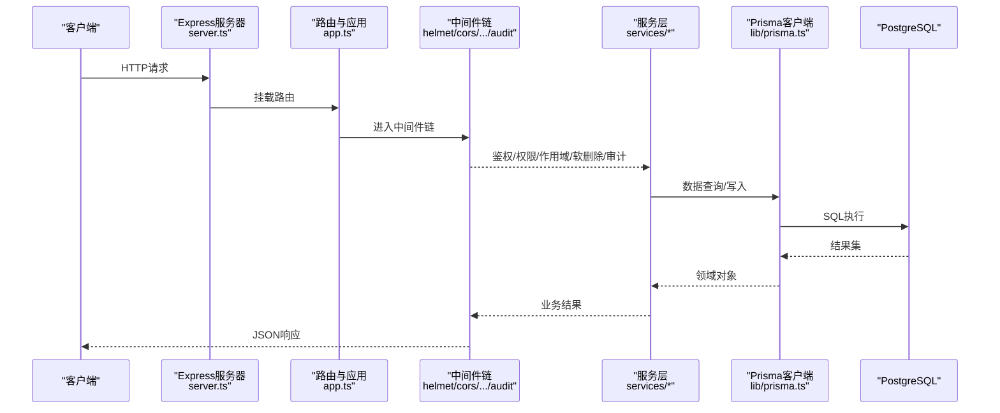
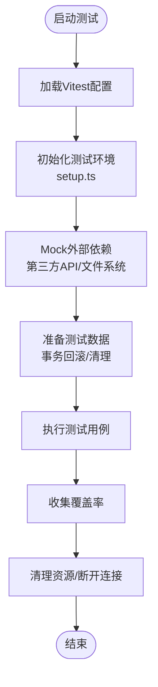
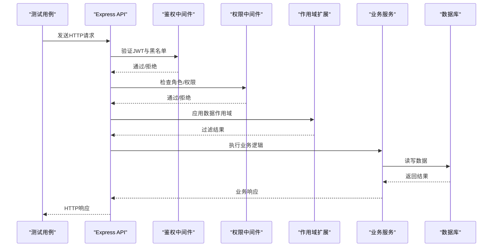
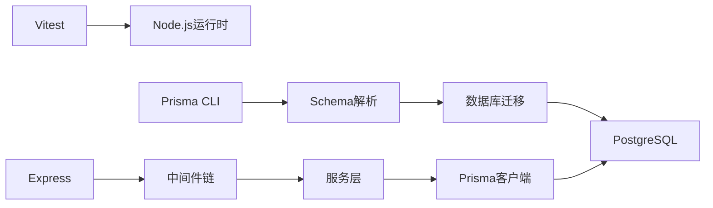

# API测试与调试

<cite>
**本文引用的文件**   
- [vitest.config.ts](file://server/vitest.config.ts)
- [package.json](file://server/package.json)
- [app.ts](file://server/src/app.ts)
- [server.ts](file://server/src/server.ts)
- [setup.ts](file://server/src/test/setup.ts)
- [integration.test.ts](file://server/src/test/integration.test.ts)
- [integration-crud.test.ts](file://server/src/test/integration-crud.test.ts)
- [ai-http.test.ts](file://server/src/test/ai-http.test.ts)
- [reports-http.test.ts](file://server/src/test/reports-http.test.ts)
- [schema.prisma](file://server/prisma/schema.prisma)
- [seed.ts](file://server/prisma/seed.ts)
- [seed-companies.ts](file://server/prisma/seed-companies.ts)
- [seed-domain.ts](file://server/prisma/seed-domain.ts)
- [subject-trees.ts](file://server/prisma/seed-data/subject-trees.ts)
- [env.ts](file://server/src/config/env.ts)
- [logger.ts](file://server/src/lib/logger.ts)
- [errors.ts](file://server/src/lib/errors.ts)
- [response.ts](file://server/src/lib/response.ts)
- [auth.ts](file://server/src/middleware/auth.ts)
- [permission.ts](file://server/src/middleware/permission.ts)
- [scope.ts](file://server/src/middleware/scope.ts)
- [soft-delete.ts](file://server/src/middleware/soft-delete.ts)
- [audit.ts](file://server/src/middleware/audit.ts)
- [rate-limit.ts](file://server/src/middleware/rate-limit.ts)
- [cors.ts](file://server/src/middleware/cors.ts)
- [helmet.ts](file://server/src/middleware/helmet.ts)
- [trace-id.ts](file://server/src/middleware/trace-id.ts)
- [async-handler.ts](file://server/src/lib/async-handler.ts)
- [jwt.ts](file://server/src/lib/jwt.ts)
- [prisma.ts](file://server/src/lib/prisma.ts)
- [local-db.ts](file://server/scripts/local-db.ts)
- [ai-smoke.ts](file://server/scripts/ai-smoke.ts)
- [ai-pipeline-smoke.ts](file://server/scripts/ai-pipeline-smoke.ts)
- [cors-check.ts](file://server/scripts/cors-check.ts)
</cite>

## 目录
1. [简介](#简介)
2. [项目结构](#项目结构)
3. [核心组件](#核心组件)
4. [架构总览](#架构总览)
5. [详细组件分析](#详细组件分析)
6. [依赖关系分析](#依赖关系分析)
7. [性能考量](#性能考量)
8. [故障排查指南](#故障排查指南)
9. [结论](#结论)
10. [附录](#附录)

## 简介
本指南面向FY200项目的API测试与调试，覆盖单元测试（Vitest）、集成测试、端到端测试、Postman集合设计与API文档自动化、Node.js调试器配置、日志级别控制、性能分析与CI流水线集成。项目采用Express + Prisma + PostgreSQL + JWT + DeepSeek SSE的架构，中间件执行链严格：helmet → cors → express.json → rate-limit → auth(JWT+黑名单) → permission(默认拒绝) → scope(Prisma extension) → softDelete → audit → Service → Prisma → PostgreSQL。计算类指标使用安全公式解析，AI双管道（polish/analyze）支持流式响应。

## 项目结构
后端服务位于 server 目录，测试代码集中在 server/src/test，数据库迁移与种子数据在 server/prisma，脚本工具在 server/scripts。前端位于 web 目录，但本文聚焦后端API测试与调试。

图表来源
- [server.ts:1-200](file://server/src/server.ts#L1-L200)
- [app.ts:1-200](file://server/src/app.ts#L1-L200)
- [vitest.config.ts:1-200](file://server/vitest.config.ts#L1-L200)
- [schema.prisma:1-200](file://server/prisma/schema.prisma#L1-L200)

章节来源
- [server.ts:1-200](file://server/src/server.ts#L1-L200)
- [app.ts:1-200](file://server/src/app.ts#L1-L200)
- [vitest.config.ts:1-200](file://server/vitest.config.ts#L1-L200)
- [schema.prisma:1-200](file://server/prisma/schema.prisma#L1-L200)

## 核心组件
- 测试框架与配置：Vitest用于单元与集成测试，配置文件集中管理运行环境与匹配规则。
- 测试环境搭建：通过测试设置文件初始化数据库连接、Mock外部依赖、准备测试数据。
- 中间件与鉴权：JWT鉴权、权限校验、作用域扩展、软删除、审计、限流、CORS与安全头。
- 数据模型与迁移：Prisma Schema定义数据模型，迁移与种子数据保证测试一致性。
- 日志与错误处理：结构化日志、统一错误响应、异步处理器避免未捕获异常。

章节来源
- [vitest.config.ts:1-200](file://server/vitest.config.ts#L1-L200)
- [setup.ts:1-200](file://server/src/test/setup.ts#L1-L200)
- [auth.ts:1-200](file://server/src/middleware/auth.ts#L1-L200)
- [permission.ts:1-200](file://server/src/middleware/permission.ts#L1-L200)
- [scope.ts:1-200](file://server/src/middleware/scope.ts#L1-L200)
- [soft-delete.ts:1-200](file://server/src/middleware/soft-delete.ts#L1-L200)
- [audit.ts:1-200](file://server/src/middleware/audit.ts#L1-L200)
- [rate-limit.ts:1-200](file://server/src/middleware/rate-limit.ts#L1-L200)
- [cors.ts:1-200](file://server/src/middleware/cors.ts#L1-L200)
- [helmet.ts:1-200](file://server/src/middleware/helmet.ts#L1-L200)
- [trace-id.ts:1-200](file://server/src/middleware/trace-id.ts#L1-L200)
- [errors.ts:1-200](file://server/src/lib/errors.ts#L1-L200)
- [response.ts:1-200](file://server/src/lib/response.ts#L1-L200)
- [async-handler.ts:1-200](file://server/src/lib/async-handler.ts#L1-L200)
- [logger.ts:1-200](file://server/src/lib/logger.ts#L1-L200)
- [schema.prisma:1-200](file://server/prisma/schema.prisma#L1-L200)
- [seed.ts:1-200](file://server/prisma/seed.ts#L1-L200)

## 架构总览
下图展示API请求从客户端到数据库的完整链路，以及测试如何注入Mock与测试数据。

图表来源
- [server.ts:1-200](file://server/src/server.ts#L1-L200)
- [app.ts:1-200](file://server/src/app.ts#L1-L200)
- [auth.ts:1-200](file://server/src/middleware/auth.ts#L1-L200)
- [permission.ts:1-200](file://server/src/middleware/permission.ts#L1-L200)
- [scope.ts:1-200](file://server/src/middleware/scope.ts#L1-L200)
- [soft-delete.ts:1-200](file://server/src/middleware/soft-delete.ts#L1-L200)
- [audit.ts:1-200](file://server/src/middleware/audit.ts#L1-L200)
- [prisma.ts:1-200](file://server/src/lib/prisma.ts#L1-L200)

## 详细组件分析

### Vitest配置与使用
- 配置文件集中管理测试环境、匹配规则、覆盖率与并行度。
- 测试设置文件负责数据库连接、全局Mock、钩子函数（beforeEach/afterAll）。
- 单元测试示例涵盖工具函数、JWT、密码、脱敏、指标值等。

图表来源
- [vitest.config.ts:1-200](file://server/vitest.config.ts#L1-L200)
- [setup.ts:1-200](file://server/src/test/setup.ts#L1-L200)

章节来源
- [vitest.config.ts:1-200](file://server/vitest.config.ts#L1-L200)
- [setup.ts:1-200](file://server/src/test/setup.ts#L1-L200)

### 单元测试策略与Mock数据
- 针对纯函数与工具模块进行隔离测试，如JWT生成与验证、密码哈希、脱敏、指标值计算、公式解析。
- Mock外部依赖（文件系统、网络请求、第三方API），确保测试稳定与快速。
- 使用事务或内存数据库模拟持久化行为，避免真实IO影响。

章节来源
- [jwt.ts:1-200](file://server/src/lib/jwt.ts#L1-L200)
- [password.ts:1-200](file://server/src/lib/password.ts#L1-200)
- [sanitize.ts:1-200](file://server/src/lib/sanitize.ts#L1-200)
- [metric-values.ts:1-200](file://server/src/lib/metric-values.ts#L1-200)
- [formula.ts:1-200](file://server/src/lib/formula.ts#L1-200)

### 异步测试与数据库测试环境
- 异步测试需正确处理Promise与超时，确保资源释放。
- 数据库测试环境通过Prisma迁移与种子数据构建一致状态。
- 每个测试用例前后进行数据清理，避免相互干扰。

章节来源
- [integration.test.ts:1-200](file://server/src/test/integration.test.ts#L1-200)
- [integration-crud.test.ts:1-200](file://server/src/test/integration-crud.test.ts#L1-200)
- [schema.prisma:1-200](file://server/prisma/schema.prisma#L1-200)
- [seed.ts:1-200](file://server/prisma/seed.ts#L1-200)

### 集成测试策略与端到端流程
- 集成测试覆盖认证、授权、CRUD、报表生成、AI接口等关键路径。
- 端到端流程模拟真实用户操作，包括登录、权限校验、数据导入导出、AI分析。
- 测试数据管理通过种子脚本与事务回滚保证可重复性。

图表来源
- [integration.test.ts:1-200](file://server/src/test/integration.test.ts#L1-200)
- [auth.ts:1-200](file://server/src/middleware/auth.ts#L1-200)
- [permission.ts:1-200](file://server/src/middleware/permission.ts#L1-200)
- [scope.ts:1-200](file://server/src/middleware/scope.ts#L1-200)

章节来源
- [integration.test.ts:1-200](file://server/src/test/integration.test.ts#L1-200)
- [integration-crud.test.ts:1-200](file://server/src/test/integration-crud.test.ts#L1-200)
- [ai-http.test.ts:1-200](file://server/src/test/ai-http.test.ts#L1-200)
- [reports-http.test.ts:1-200](file://server/src/test/reports-http.test.ts#L1-200)

### Postman集合设计与API文档自动生成
- 设计Postman集合组织API分组、环境变量、预请求脚本与断言。
- 结合OpenAPI/Swagger规范生成API文档，保持与代码同步。
- 使用环境变量区分开发、测试、生产环境，便于团队协作。

章节来源
- [package.json:1-200](file://server/package.json#L1-200)

### Node.js调试器配置与日志级别控制
- 使用Node.js内置调试器或IDE集成进行断点调试。
- 调整日志级别（debug/info/warn/error）以定位问题。
- 结合trace-id追踪请求链路，提升排错效率。

章节来源
- [logger.ts:1-200](file://server/src/lib/logger.ts#L1-200)
- [trace-id.ts:1-200](file://server/src/middleware/trace-id.ts#L1-200)

### 性能分析工具使用
- 使用Node.js性能分析器（--prof）与CPU快照定位瓶颈。
- 监控数据库查询性能，优化慢查询与索引。
- 压测工具（如k6、autocannon）模拟高并发场景。

章节来源
- [package.json:1-200](file://server/package.json#L1-200)

## 依赖关系分析
测试与运行时依赖通过package.json管理，包括Vitest、Prisma、Express、PostgreSQL驱动等。

图表来源
- [package.json:1-200](file://server/package.json#L1-200)
- [schema.prisma:1-200](file://server/prisma/schema.prisma#L1-200)

章节来源
- [package.json:1-200](file://server/package.json#L1-200)

## 性能考量
- 单元测试应快速执行，避免真实IO，使用Mock与内存数据库。
- 集成测试关注关键路径性能，监控数据库查询与外部API调用。
- 使用连接池与缓存减少重复开销，合理设置超时与重试策略。

[本节为通用指导，不直接分析具体文件]

## 故障排查指南
- 常见问题：数据库连接失败、权限不足、JWT过期、限流触发、CORS错误。
- 解决方案：检查环境变量、确认迁移状态、验证权限配置、调整限流阈值、配置CORS白名单。
- 调试技巧：启用详细日志、使用trace-id追踪、逐步缩小问题范围。

章节来源
- [errors.ts:1-200](file://server/src/lib/errors.ts#L1-200)
- [response.ts:1-200](file://server/src/lib/response.ts#L1-200)
- [auth.ts:1-200](file://server/src/middleware/auth.ts#L1-200)
- [rate-limit.ts:1-200](file://server/src/middleware/rate-limit.ts#L1-200)
- [cors.ts:1-200](file://server/src/middleware/cors.ts#L1-200)

## 结论
通过系统化的测试策略与调试方法，可显著提升FY200项目的API质量与稳定性。建议持续完善测试覆盖、优化性能、强化监控与告警，确保交付可靠的产品。

[本节为总结性内容，不直接分析具体文件]

## 附录
- 常用命令：运行测试、生成文档、启动本地数据库、执行冒烟测试。
- 最佳实践：命名规范、错误处理、日志记录、安全配置。
- 参考链接：官方文档、社区资源、内部Wiki。

[本节为补充信息，不直接分析具体文件]