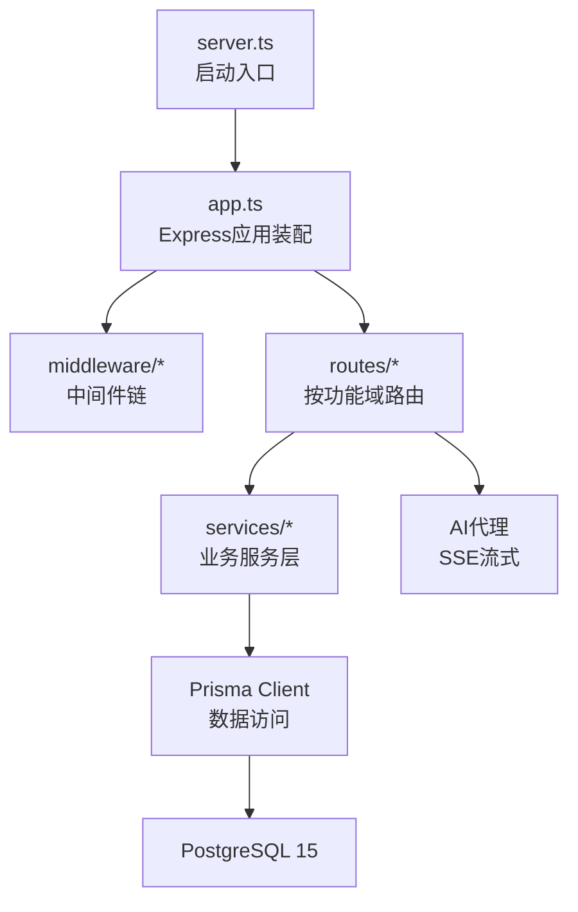
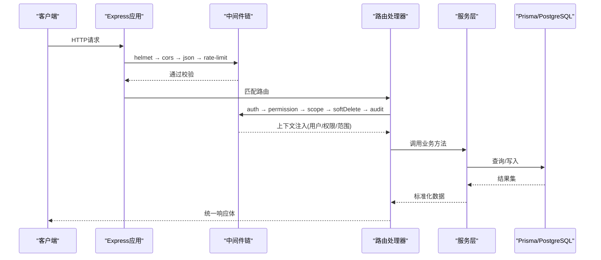
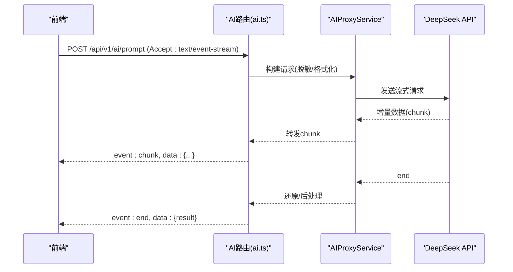
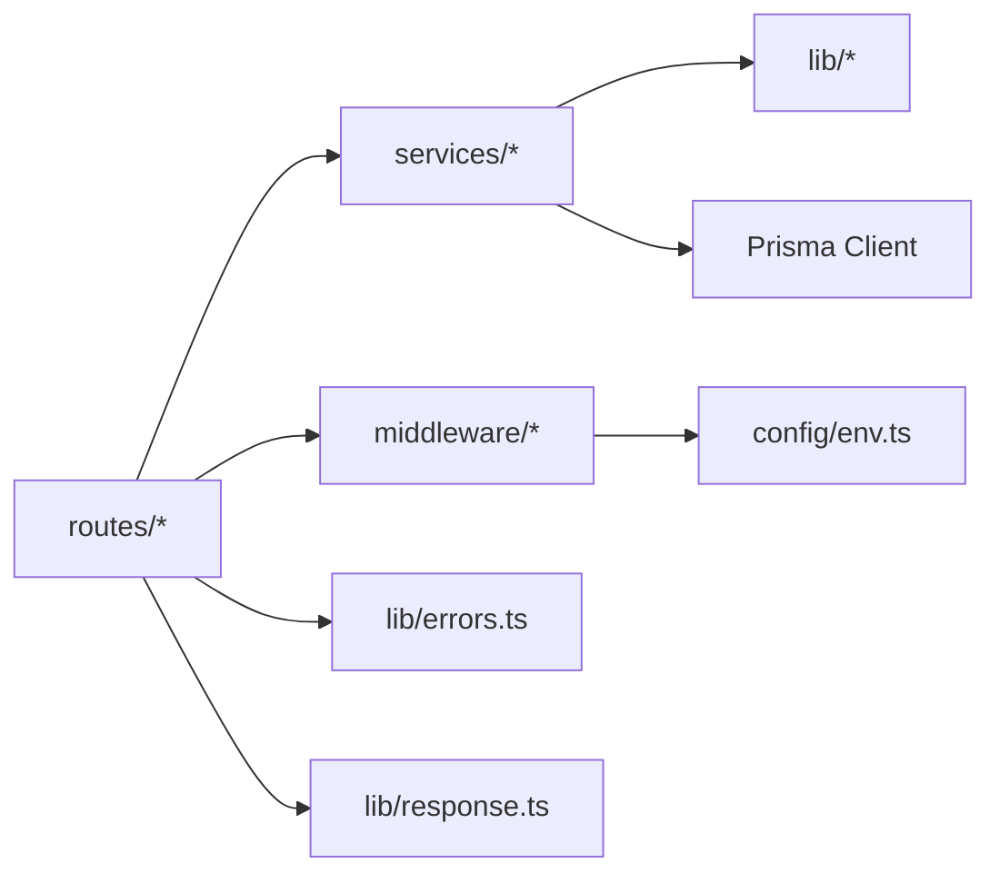

# API路由开发

<cite>
**本文引用的文件**   
- [server/src/app.ts](file://server/src/app.ts)
- [server/src/server.ts](file://server/src/server.ts)
- [server/src/routes/auth.ts](file://server/src/routes/auth.ts)
- [server/src/routes/data.ts](file://server/src/routes/data.ts)
- [server/src/routes/indicators.ts](file://server/src/routes/indicators.ts)
- [server/src/routes/admin.ts](file://server/src/routes/admin.ts)
- [server/src/routes/ai.ts](file://server/src/routes/ai.ts)
- [server/src/routes/dashboard.ts](file://server/src/routes/dashboard.ts)
- [server/src/routes/reports.ts](file://server/src/routes/reports.ts)
- [server/src/middleware/auth.ts](file://server/src/middleware/auth.ts)
- [server/src/middleware/permission.ts](file://server/src/middleware/permission.ts)
- [server/src/middleware/scope.ts](file://server/src/middleware/scope.ts)
- [server/src/middleware/error-handler.ts](file://server/src/middleware/error-handler.ts)
- [server/src/middleware/rate-limit.ts](file://server/src/middleware/rate-limit.ts)
- [server/src/middleware/cors.ts](file://server/src/middleware/cors.ts)
- [server/src/middleware/helmet.ts](file://server/src/middleware/helmet.ts)
- [server/src/middleware/audit.ts](file://server/src/middleware/audit.ts)
- [server/src/middleware/soft-delete.ts](file://server/src/middleware/soft-delete.ts)
- [server/src/middleware/trace-id.ts](file://server/src/middleware/trace-id.ts)
- [server/src/lib/response.ts](file://server/src/lib/response.ts)
- [server/src/lib/errors.ts](file://server/src/lib/errors.ts)
- [server/src/lib/jwt.ts](file://server/src/lib/jwt.ts)
- [server/src/lib/excel-import.ts](file://server/src/lib/excel-import.ts)
- [server/src/services/AuthService.ts](file://server/src/services/AuthService.ts)
- [server/src/services/DataService.ts](file://server/src/services/DataService.ts)
- [server/src/services/IndicatorsService.ts](file://server/src/services/IndicatorsService.ts)
- [server/src/services/AIProxyService.ts](file://server/src/services/AIProxyService.ts)
- [server/src/config/env.ts](file://server/src/config/env.ts)
</cite>

## 目录
1. [简介](#简介)
2. [项目结构](#项目结构)
3. [核心组件](#核心组件)
4. [架构总览](#架构总览)
5. [详细组件分析](#详细组件分析)
6. [依赖关系分析](#依赖关系分析)
7. [性能考虑](#性能考虑)
8. [故障排查指南](#故障排查指南)
9. [结论](#结论)
10. [附录](#附录)

## 简介
本指南面向FY200项目的API路由开发，目标是建立统一的RESTful规范、清晰的路由组织、严格的参数校验与错误处理、稳定的响应格式，以及针对文件上传下载与SSE流式响应的实现模式。同时提供API版本控制策略、向后兼容性建议、接口测试方法与调试技巧，帮助团队高效、安全地扩展系统能力。

## 项目结构
后端采用Express 4 + Prisma 5 + PostgreSQL 15，中间件执行链顺序为：helmet → cors → express.json → rate-limit → auth(JWT+黑名单) → permission(默认拒绝) → scope(Prisma extension) → softDelete → audit → Service → Prisma → PostgreSQL。路由按功能域划分在routes目录下，服务逻辑在services目录下，通用工具与类型在lib与types下。

**图示来源**
- [server/src/server.ts](file://server/src/server.ts)
- [server/src/app.ts](file://server/src/app.ts)

**章节来源**
- [server/src/server.ts](file://server/src/server.ts)
- [server/src/app.ts](file://server/src/app.ts)

## 核心组件
- 路由组织：按功能域拆分（auth、data、indicators、admin、dashboard、reports、ai），每个文件聚焦一个领域，便于权限与范围隔离。
- 中间件链：统一安全、鉴权、限流、审计、软删除、追踪ID等横切关注点。
- 服务层：封装业务逻辑，避免路由直接操作数据库或第三方API。
- 响应与错误：统一响应包装与错误类型，保证前端一致性。
- 文件与流：Excel导入导出、SSE流式AI响应。

**章节来源**
- [server/src/routes/auth.ts](file://server/src/routes/auth.ts)
- [server/src/routes/data.ts](file://server/src/routes/data.ts)
- [server/src/routes/indicators.ts](file://server/src/routes/indicators.ts)
- [server/src/middleware/auth.ts](file://server/src/middleware/auth.ts)
- [server/src/middleware/permission.ts](file://server/src/middleware/permission.ts)
- [server/src/middleware/scope.ts](file://server/src/middleware/scope.ts)
- [server/src/middleware/error-handler.ts](file://server/src/middleware/error-handler.ts)
- [server/src/lib/response.ts](file://server/src/lib/response.ts)
- [server/src/lib/errors.ts](file://server/src/lib/errors.ts)

## 架构总览
下图展示一次典型请求从客户端到数据库的调用路径，体现中间件与服务层的协作关系。

**图示来源**
- [server/src/app.ts](file://server/src/app.ts)
- [server/src/middleware/auth.ts](file://server/src/middleware/auth.ts)
- [server/src/middleware/permission.ts](file://server/src/middleware/permission.ts)
- [server/src/middleware/scope.ts](file://server/src/middleware/scope.ts)
- [server/src/middleware/audit.ts](file://server/src/middleware/audit.ts)
- [server/src/middleware/soft-delete.ts](file://server/src/middleware/soft-delete.ts)

## 详细组件分析

### RESTful API设计规范
- URL命名约定
  - 使用复数名词表示资源集合，如 /api/v1/auth、/api/v1/data、/api/v1/indicators。
  - 子资源使用层级表达关系，如 /api/v1/indicators/{id}/values。
  - 查询参数用于过滤、排序、分页，如 ?page=1&size=20&sort=-createdAt。
- HTTP方法使用
  - GET：读取资源列表或详情。
  - POST：创建资源或触发不可幂等操作。
  - PUT/PATCH：更新资源，PUT全量替换，PATCH部分更新。
  - DELETE：删除资源（结合软删除中间件）。
- 状态码标准
  - 2xx成功：200 OK、201 Created、204 No Content。
  - 4xx客户端错误：400 Bad Request、401 Unauthorized、403 Forbidden、404 Not Found、422 Unprocessable Entity。
  - 5xx服务端错误：500 Internal Server Error、503 Service Unavailable。
- 版本控制策略
  - 推荐URL前缀版本化：/api/v1、/api/v2。
  - 保持向后兼容：新增字段不破坏旧客户端；废弃字段标记弃用并保留至少两个大版本。
  - 变更日志与兼容性矩阵维护在文档中。

**章节来源**
- [server/src/routes/auth.ts](file://server/src/routes/auth.ts)
- [server/src/routes/data.ts](file://server/src/routes/data.ts)
- [server/src/routes/indicators.ts](file://server/src/routes/indicators.ts)

### 路由组织方式（按功能域）
- auth.ts：认证相关（登录、刷新、注销、令牌校验）。
- data.ts：数据模型CRUD、导入导出、公式规则管理。
- indicators.ts：指标定义、计算、同比环比、聚合。
- admin.ts：管理员操作（用户、角色、权限、审计）。
- dashboard.ts：看板聚合查询。
- reports.ts：报表生成与导出。
- ai.ts：AI代理（文本润色与分析）、SSE流式响应。

每个路由文件应：
- 仅负责HTTP契约与参数校验，调用对应Service完成业务。
- 使用统一响应包装器返回结构化数据。
- 抛出标准化的错误对象以便全局错误处理器捕获。

**章节来源**
- [server/src/routes/auth.ts](file://server/src/routes/auth.ts)
- [server/src/routes/data.ts](file://server/src/routes/data.ts)
- [server/src/routes/indicators.ts](file://server/src/routes/indicators.ts)
- [server/src/routes/admin.ts](file://server/src/routes/admin.ts)
- [server/src/routes/ai.ts](file://server/src/routes/ai.ts)
- [server/src/routes/dashboard.ts](file://server/src/routes/dashboard.ts)
- [server/src/routes/reports.ts](file://server/src/routes/reports.ts)

### 请求参数验证
- 输入校验原则
  - 所有外部输入必须校验：类型、必填、长度、范围、格式。
  - 使用schema定义集中校验规则，避免散落在路由中。
- 常见校验点
  - JWT载荷中的用户身份与权限。
  - 分页参数边界值与非法字符。
  - 文件上传MIME类型与大小限制。
  - 公式表达式白名单算子校验。
- 错误反馈
  - 422 Unprocessable Entity返回详细字段级错误信息。
  - 对敏感信息进行脱敏输出。

**章节来源**
- [server/src/middleware/auth.ts](file://server/src/middleware/auth.ts)
- [server/src/lib/errors.ts](file://server/src/lib/errors.ts)
- [server/src/lib/excel-import.ts](file://server/src/lib/excel-import.ts)

### 响应格式标准化
- 统一响应体结构
  - data：业务数据（对象或数组）。
  - meta：元信息（分页、时间戳、追踪ID）。
  - errors：错误列表（仅在失败时出现）。
- 空值与缺失字段
  - 明确null与undefined语义，避免歧义。
- 序列化与脱敏
  - 金额单位统一万元，日期ISO 8601。
  - 敏感字段自动脱敏（公司名映射、金额区间化）。

**章节来源**
- [server/src/lib/response.ts](file://server/src/lib/response.ts)

### 错误处理机制
- 中间件错误处理
  - 捕获未处理异常与Promise拒绝。
  - 记录结构化日志（包含traceId）。
  - 返回统一错误响应，隐藏内部堆栈。
- 自定义错误类型
  - 区分业务错误与系统错误，设置不同状态码。
  - 支持可重试与不可重试分类。
- 审计与追踪
  - 每次请求记录关键上下文（用户、IP、耗时、状态码）。

**章节来源**
- [server/src/middleware/error-handler.ts](file://server/src/middleware/error-handler.ts)
- [server/src/middleware/audit.ts](file://server/src/middleware/audit.ts)
- [server/src/middleware/trace-id.ts](file://server/src/middleware/trace-id.ts)

### 文件上传与下载接口
- 上传
  - 支持multipart/form-data，限制文件大小与类型。
  - Excel导入流程：解析→校验→转换→批量入库→回滚策略。
  - 异步任务：大文件处理返回任务ID，前端轮询进度。
- 下载
  - 流式响应，分块传输，避免内存峰值。
  - 文件名与编码处理，浏览器兼容。
- 安全
  - 白名单MIME类型、病毒扫描（可选）、访问权限控制。

**章节来源**
- [server/src/lib/excel-import.ts](file://server/src/lib/excel-import.ts)

### SSE流式响应（AI代理）
- 设计要点
  - 使用Server-Sent Events推送增量结果。
  - 事件类型：start、chunk、end、error。
  - 心跳保活与断线重连提示。
- 管道架构
  - polish：文本→脱敏→LLM→还原。
  - analyze：结构化→计算→脱敏→LLM→生成。
- 错误处理
  - 网络异常降级为静态缓存或友好提示。
  - 超时与取消请求支持。

**图示来源**
- [server/src/routes/ai.ts](file://server/src/routes/ai.ts)
- [server/src/services/AIProxyService.ts](file://server/src/services/AIProxyService.ts)

**章节来源**
- [server/src/routes/ai.ts](file://server/src/routes/ai.ts)
- [server/src/services/AIProxyService.ts](file://server/src/services/AIProxyService.ts)

### 鉴权与权限控制
- JWT鉴权
  - access token短期有效（15分钟），refresh token长期（7天）轮转。
  - 黑名单校验防止撤销令牌继续生效。
- 权限模型
  - 基于角色的访问控制（RBAC），默认拒绝策略。
  - 作用域（scope）通过Prisma extension注入，限制数据可见性。
- 审计与软删除
  - 审计中间件记录关键操作。
  - 软删除确保数据可恢复与历史追溯。

**章节来源**
- [server/src/middleware/auth.ts](file://server/src/middleware/auth.ts)
- [server/src/middleware/permission.ts](file://server/src/middleware/permission.ts)
- [server/src/middleware/scope.ts](file://server/src/middleware/scope.ts)
- [server/src/middleware/audit.ts](file://server/src/middleware/audit.ts)
- [server/src/middleware/soft-delete.ts](file://server/src/middleware/soft-delete.ts)
- [server/src/lib/jwt.ts](file://server/src/lib/jwt.ts)

### 指标计算与公式安全
- 公式解析
  - 白名单算子（+-*/()），禁止eval，防注入。
  - 变量替换与上下文注入（时间维度、公司维度）。
- 实时计算
  - 同比/环比由后端实时计算，不持久化，保证一致性。
- 聚合服务
  - 多粒度聚合（日/周/月/年），缓存热点数据。

**章节来源**
- [server/src/services/IndicatorsService.ts](file://server/src/services/IndicatorsService.ts)

### 数据服务与导入导出
- CRUD操作
  - 统一分页、排序、过滤接口。
  - 批量操作事务保障。
- Excel导入
  - 模板校验、字段映射、错误行定位。
  - 并发控制与回滚策略。
- 导出
  - 流式写入，避免OOM。
  - 压缩与分片下载。

**章节来源**
- [server/src/services/DataService.ts](file://server/src/services/DataService.ts)
- [server/src/lib/excel-import.ts](file://server/src/lib/excel-import.ts)

### 认证服务
- 登录流程
  - 用户名密码校验→签发JWT→记录审计。
- 令牌轮转
  - refresh token轮换与黑名单管理。
- 安全加固
  - 密码哈希、速率限制、登录失败锁定。

**章节来源**
- [server/src/services/AuthService.ts](file://server/src/services/AuthService.ts)
- [server/src/middleware/auth.ts](file://server/src/middleware/auth.ts)

## 依赖关系分析

**图示来源**
- [server/src/routes/auth.ts](file://server/src/routes/auth.ts)
- [server/src/services/AuthService.ts](file://server/src/services/AuthService.ts)
- [server/src/lib/response.ts](file://server/src/lib/response.ts)
- [server/src/lib/errors.ts](file://server/src/lib/errors.ts)
- [server/src/config/env.ts](file://server/src/config/env.ts)

**章节来源**
- [server/src/app.ts](file://server/src/app.ts)
- [server/src/server.ts](file://server/src/server.ts)

## 性能考虑
- 中间件优化
  - 最小化同步阻塞操作，优先异步。
  - 合理设置rate-limit阈值与窗口。
- 数据库查询
  - 使用Prisma select指定字段，避免N+1。
  - 索引优化与查询计划分析。
- 缓存策略
  - 热点指标与字典数据缓存（Redis可选）。
  - 短TTL与失效策略。
- 流式处理
  - SSE与文件下载使用流式传输，降低内存占用。
- 监控与观测
  - 关键指标埋点（QPS、延迟、错误率）。
  - 分布式追踪（traceId贯穿链路）。

[本节为通用指导，无需特定文件引用]

## 故障排查指南
- 常见问题定位
  - 检查traceId关联日志，快速定位请求链路。
  - 查看错误类型与状态码，区分客户端与服务端问题。
  - 核对权限与scope配置，确认数据可见性。
- 调试技巧
  - 使用本地环境变量覆盖敏感配置。
  - 启用详细日志级别（开发环境）。
  - 模拟失败场景（网络超时、数据库锁）。
- 恢复策略
  - 软删除数据恢复。
  - 令牌黑名单清理与刷新。
  - 导入任务重试与断点续传。

**章节来源**
- [server/src/middleware/error-handler.ts](file://server/src/middleware/error-handler.ts)
- [server/src/middleware/trace-id.ts](file://server/src/middleware/trace-id.ts)
- [server/src/middleware/audit.ts](file://server/src/middleware/audit.ts)

## 结论
通过统一的路由组织、严格的参数校验、标准化的响应与错误处理、安全的鉴权与权限控制、以及高效的文件与流式处理机制，FY200项目的API具备高内聚、低耦合、可扩展与可观测的特性。遵循本文档的规范与最佳实践，可显著提升开发效率与系统稳定性。

[本节为总结性内容，无需特定文件引用]

## 附录
- 接口测试方法
  - 单元测试：Mock依赖，验证服务层逻辑。
  - 集成测试：使用真实数据库与中间件，端到端验证。
  - 契约测试：前后端共享Schema，确保接口一致性。
- 调试清单
  - 环境变量正确性。
  - 中间件顺序与配置。
  - 数据库连接与迁移状态。
  - 第三方API密钥与限流。

[本节为通用指导，无需特定文件引用]