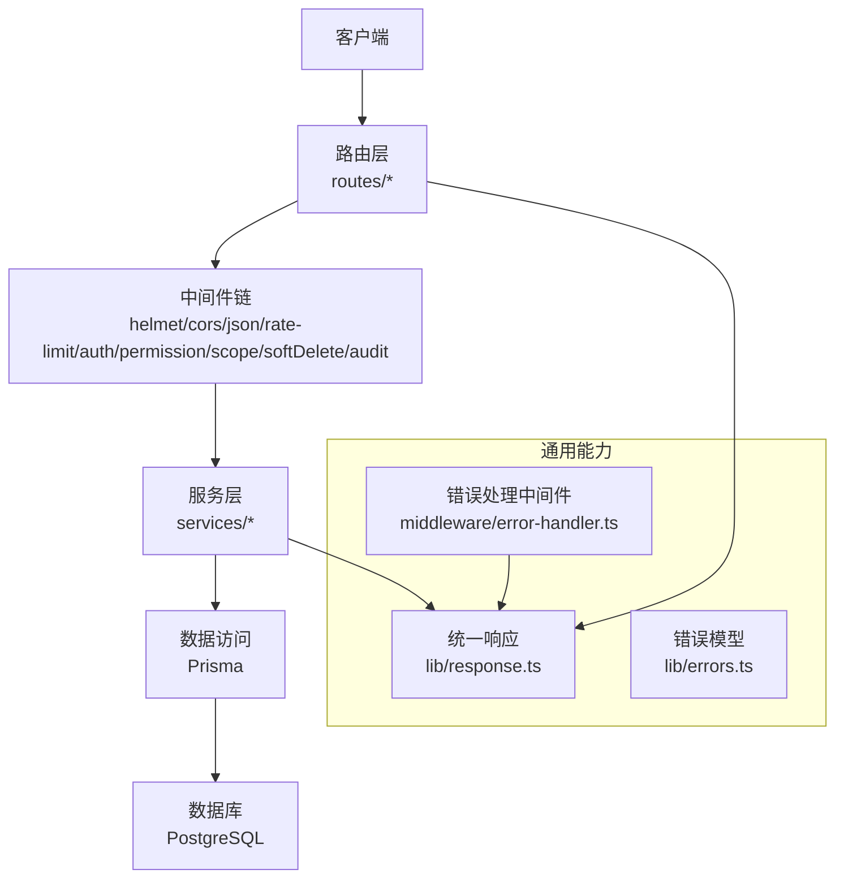
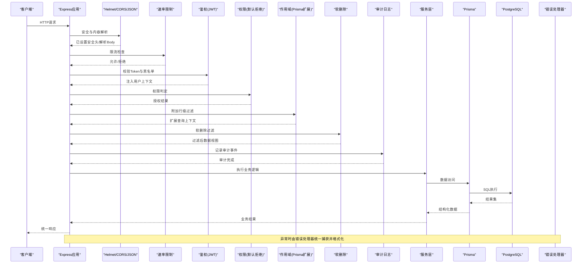
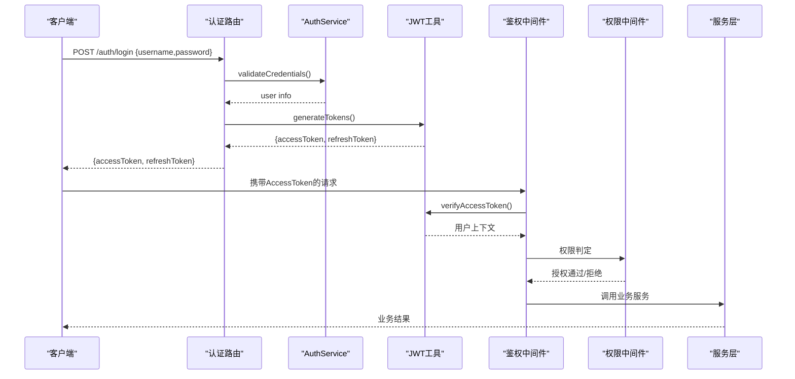
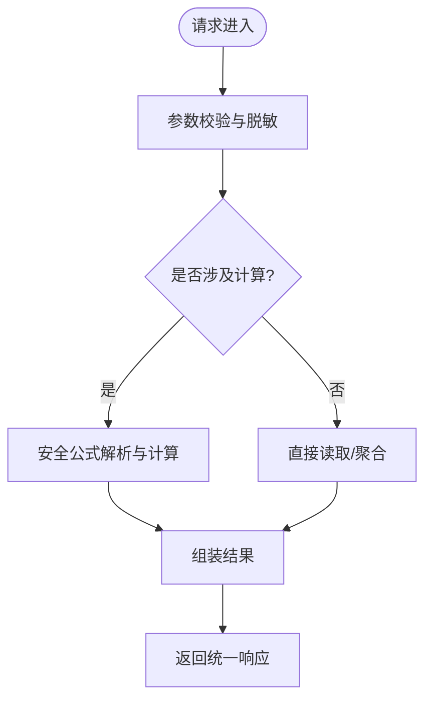
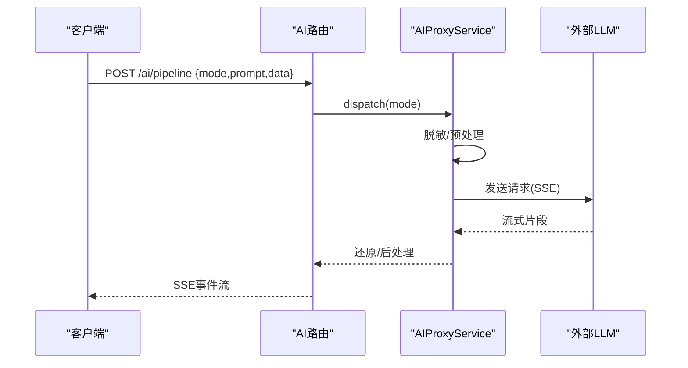
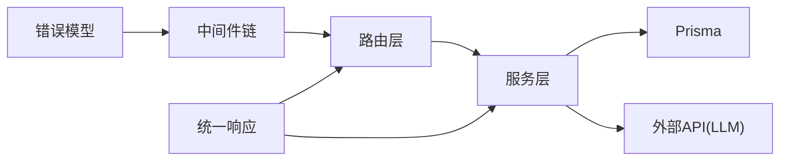

# RESTful API规范

<cite>
**本文引用的文件**   
- [server/src/app.ts](file://server/src/app.ts)
- [server/src/server.ts](file://server/src/server.ts)
- [server/src/middleware/cors.ts](file://server/src/middleware/cors.ts)
- [server/src/middleware/helmet.ts](file://server/src/middleware/helmet.ts)
- [server/src/middleware/rate-limit.ts](file://server/src/middleware/rate-limit.ts)
- [server/src/middleware/auth.ts](file://server/src/middleware/auth.ts)
- [server/src/middleware/permission.ts](file://server/src/middleware/permission.ts)
- [server/src/middleware/scope.ts](file://server/src/middleware/scope.ts)
- [server/src/middleware/soft-delete.ts](file://server/src/middleware/soft-delete.ts)
- [server/src/middleware/audit.ts](file://server/src/middleware/audit.ts)
- [server/src/middleware/error-handler.ts](file://server/src/middleware/error-handler.ts)
- [server/src/middleware/trace-id.ts](file://server/src/middleware/trace-id.ts)
- [server/src/lib/response.ts](file://server/src/lib/response.ts)
- [server/src/lib/errors.ts](file://server/src/lib/errors.ts)
- [server/src/routes/auth.ts](file://server/src/routes/auth.ts)
- [server/src/routes/admin.ts](file://server/src/routes/admin.ts)
- [server/src/routes/ai.ts](file://server/src/routes/ai.ts)
- [server/src/routes/dashboard.ts](file://server/src/routes/dashboard.ts)
- [server/src/routes/data.ts](file://server/src/routes/data.ts)
- [server/src/routes/indicators.ts](file://server/src/routes/indicators.ts)
- [server/src/routes/reports.ts](file://server/src/routes/reports.ts)
- [server/src/services/AuthService.ts](file://server/src/services/AuthService.ts)
- [server/src/services/AdminService.ts](file://server/src/services/AdminService.ts)
- [server/src/services/AIProxyService.ts](file://server/src/services/AIProxyService.ts)
- [server/src/services/DashboardService.ts](file://server/src/services/DashboardService.ts)
- [server/src/services/DataService.ts](file://server/src/services/DataService.ts)
- [server/src/services/IndicatorsService.ts](file://server/src/services/IndicatorsService.ts)
- [server/src/services/ReportService.ts](file://server/src/services/ReportService.ts)
</cite>

## 目录
1. [简介](#简介)
2. [项目结构](#项目结构)
3. [核心组件](#核心组件)
4. [架构总览](#架构总览)
5. [详细组件分析](#详细组件分析)
6. [依赖关系分析](#依赖关系分析)
7. [性能考量](#性能考量)
8. [故障排查指南](#故障排查指南)
9. [结论](#结论)
10. [附录](#附录)

## 简介
本规范面向FY200项目的RESTful API，统一约定URL命名、HTTP方法语义、状态码与错误响应格式、请求头规范、版本控制策略与向后兼容性。文档同时结合后端实现（Express + Prisma + PostgreSQL）给出可落地的最佳实践与示例路径，便于前后端协同开发与联调。

## 项目结构
后端采用分层架构：路由层负责URL与参数校验，中间件链提供安全、鉴权、限流、审计等横切能力，服务层封装业务逻辑，数据访问通过Prisma完成。统一的响应与错误处理由lib与middleware集中管理。

图表来源
- [server/src/app.ts](file://server/src/app.ts)
- [server/src/middleware/cors.ts](file://server/src/middleware/cors.ts)
- [server/src/middleware/helmet.ts](file://server/src/middleware/helmet.ts)
- [server/src/middleware/rate-limit.ts](file://server/src/middleware/rate-limit.ts)
- [server/src/middleware/auth.ts](file://server/src/middleware/auth.ts)
- [server/src/middleware/permission.ts](file://server/src/middleware/permission.ts)
- [server/src/middleware/scope.ts](file://server/src/middleware/scope.ts)
- [server/src/middleware/soft-delete.ts](file://server/src/middleware/soft-delete.ts)
- [server/src/middleware/audit.ts](file://server/src/middleware/audit.ts)
- [server/src/lib/response.ts](file://server/src/lib/response.ts)
- [server/src/lib/errors.ts](file://server/src/lib/errors.ts)
- [server/src/middleware/error-handler.ts](file://server/src/middleware/error-handler.ts)

章节来源
- [server/src/app.ts](file://server/src/app.ts)
- [server/src/server.ts](file://server/src/server.ts)

## 核心组件
- 路由层：按领域划分模块（认证、管理、AI、看板、数据、指标、报表），每个模块暴露一组REST端点。
- 中间件链：安全与横切能力集中编排，顺序固定，保证一致的安全与审计行为。
- 服务层：业务规则与计算逻辑（如同比/环比、公式解析、AI代理）。
- 数据访问：Prisma生成类型安全的查询，配合scope扩展实现行级权限。
- 统一响应与错误：标准化成功/失败结构与错误码映射，便于前端消费。

章节来源
- [server/src/routes/auth.ts](file://server/src/routes/auth.ts)
- [server/src/routes/admin.ts](file://server/src/routes/admin.ts)
- [server/src/routes/ai.ts](file://server/src/routes/ai.ts)
- [server/src/routes/dashboard.ts](file://server/src/routes/dashboard.ts)
- [server/src/routes/data.ts](file://server/src/routes/data.ts)
- [server/src/routes/indicators.ts](file://server/src/routes/indicators.ts)
- [server/src/routes/reports.ts](file://server/src/routes/reports.ts)
- [server/src/middleware/auth.ts](file://server/src/middleware/auth.ts)
- [server/src/middleware/permission.ts](file://server/src/middleware/permission.ts)
- [server/src/middleware/scope.ts](file://server/src/middleware/scope.ts)
- [server/src/lib/response.ts](file://server/src/lib/response.ts)
- [server/src/lib/errors.ts](file://server/src/lib/errors.ts)

## 架构总览
下图展示一次典型API请求从进入服务器到返回响应的完整链路，体现中间件顺序与职责边界。

图表来源
- [server/src/app.ts](file://server/src/app.ts)
- [server/src/middleware/cors.ts](file://server/src/middleware/cors.ts)
- [server/src/middleware/helmet.ts](file://server/src/middleware/helmet.ts)
- [server/src/middleware/rate-limit.ts](file://server/src/middleware/rate-limit.ts)
- [server/src/middleware/auth.ts](file://server/src/middleware/auth.ts)
- [server/src/middleware/permission.ts](file://server/src/middleware/permission.ts)
- [server/src/middleware/scope.ts](file://server/src/middleware/scope.ts)
- [server/src/middleware/soft-delete.ts](file://server/src/middleware/soft-delete.ts)
- [server/src/middleware/audit.ts](file://server/src/middleware/audit.ts)
- [server/src/middleware/error-handler.ts](file://server/src/middleware/error-handler.ts)

## 详细组件分析

### URL命名约定
- 使用复数名词作为资源名，例如：users、companies、reports、indicators、data。
- 层级关系用斜杠分隔，避免动词出现在路径中；操作语义由HTTP方法表达。
- 资源标识符使用小写短横线或数字ID，如 /api/v1/reports/:id。
- 查询参数用于筛选、排序、分页，保持路径简洁。

建议的URL模式
- GET /api/v1/{resources}：列表查询（支持分页、筛选、排序）
- GET /api/v1/{resources}/{id}：获取单条
- POST /api/v1/{resources}：创建
- PUT /api/v1/{resources}/{id}：全量更新
- PATCH /api/v1/{resources}/{id}：部分更新
- DELETE /api/v1/{resources}/{id}：删除（受软删除中间件影响）

章节来源
- [server/src/routes/auth.ts](file://server/src/routes/auth.ts)
- [server/src/routes/admin.ts](file://server/src/routes/admin.ts)
- [server/src/routes/ai.ts](file://server/src/routes/ai.ts)
- [server/src/routes/dashboard.ts](file://server/src/routes/dashboard.ts)
- [server/src/routes/data.ts](file://server/src/routes/data.ts)
- [server/src/routes/indicators.ts](file://server/src/routes/indicators.ts)
- [server/src/routes/reports.ts](file://server/src/routes/reports.ts)

### HTTP方法标准
- GET：幂等、只读，用于查询与检索。
- POST：非幂等，用于创建资源或触发不可幂等的操作（如导入、计算）。
- PUT：幂等，用于全量替换资源。
- PATCH：幂等，用于局部更新。
- DELETE：非幂等，用于删除（受软删除策略影响）。

注意事项
- 所有变更操作需经过权限与审计中间件。
- 批量操作建议使用POST集合接口，并在请求体中明确操作语义。

章节来源
- [server/src/middleware/audit.ts](file://server/src/middleware/audit.ts)
- [server/src/middleware/permission.ts](file://server/src/middleware/permission.ts)

### 状态码与自定义扩展
- 成功类：200 OK、201 Created、204 No Content。
- 客户端错误：400 Bad Request、401 Unauthorized、403 Forbidden、404 Not Found、409 Conflict、422 Unprocessable Entity。
- 服务端错误：500 Internal Server Error、502/503用于网关或外部依赖异常。
- 自定义扩展：在统一响应结构中携带code字段（字符串或数字），便于前端分类处理；具体错误码定义见错误模型。

章节来源
- [server/src/lib/errors.ts](file://server/src/lib/errors.ts)
- [server/src/middleware/error-handler.ts](file://server/src/middleware/error-handler.ts)

### 请求头规范
- Content-Type：application/json（默认），上传文件时使用multipart/form-data。
- Authorization：Bearer <token>，JWT access token有效期短（约15分钟），refresh token用于轮转。
- Accept-Language：zh-CN/en-US等，用于本地化响应（若启用）。
- X-Trace-Id：链路追踪ID，贯穿请求生命周期。
- X-Request-Id：请求唯一标识，便于日志关联。
- Cache-Control：对只读接口合理设置缓存策略。

章节来源
- [server/src/middleware/helmet.ts](file://server/src/middleware/helmet.ts)
- [server/src/middleware/cors.ts](file://server/src/middleware/cors.ts)
- [server/src/middleware/trace-id.ts](file://server/src/middleware/trace-id.ts)
- [server/src/middleware/auth.ts](file://server/src/middleware/auth.ts)

### 响应格式标准化
- 成功响应：包含data、message、timestamp、traceId等字段。
- 失败响应：包含error.code、error.message、error.details（可选）、traceId。
- 分页响应：统一分页元信息（page、pageSize、total、hasMore）。
- 列表与详情遵循相同的数据结构约定，便于前端复用。

章节来源
- [server/src/lib/response.ts](file://server/src/lib/response.ts)
- [server/src/middleware/error-handler.ts](file://server/src/middleware/error-handler.ts)

### API版本控制与向后兼容
- 版本前缀：/api/v1、/api/v2，随重大变更升级版本号。
- 弃用策略：旧版本保留至少两个大版本周期，并通过响应头X-API-Deprecation提示。
- 兼容性原则：新增字段为可选，不破坏现有消费者；删除字段需先标记废弃再移除。
- 灰度发布：通过特性开关与路由别名逐步迁移。

章节来源
- [server/src/app.ts](file://server/src/app.ts)
- [server/src/routes/auth.ts](file://server/src/routes/auth.ts)
- [server/src/routes/admin.ts](file://server/src/routes/admin.ts)
- [server/src/routes/ai.ts](file://server/src/routes/ai.ts)
- [server/src/routes/dashboard.ts](file://server/src/routes/dashboard.ts)
- [server/src/routes/data.ts](file://server/src/routes/data.ts)
- [server/src/routes/indicators.ts](file://server/src/routes/indicators.ts)
- [server/src/routes/reports.ts](file://server/src/routes/reports.ts)

### 认证与授权流程
- 认证：登录成功后返回access与refresh token，后续请求携带access token。
- 授权：基于角色的权限模型，默认拒绝，显式放行所需权限。
- 作用域：通过Prisma扩展注入租户/组织范围，确保行级隔离。
- 黑名单：支持令牌黑名单机制，快速撤销权限。

图表来源
- [server/src/routes/auth.ts](file://server/src/routes/auth.ts)
- [server/src/services/AuthService.ts](file://server/src/services/AuthService.ts)
- [server/src/middleware/auth.ts](file://server/src/middleware/auth.ts)
- [server/src/middleware/permission.ts](file://server/src/middleware/permission.ts)

章节来源
- [server/src/routes/auth.ts](file://server/src/routes/auth.ts)
- [server/src/services/AuthService.ts](file://server/src/services/AuthService.ts)
- [server/src/middleware/auth.ts](file://server/src/middleware/auth.ts)
- [server/src/middleware/permission.ts](file://server/src/middleware/permission.ts)

### 数据与指标接口
- 数据接口：支持导入、导出、公式维护、历史回溯。
- 指标接口：支持维度选择、时间粒度、同比/环比计算。
- 安全公式：白名单算子（+-*/()），禁止eval，保障计算安全。

图表来源
- [server/src/routes/data.ts](file://server/src/routes/data.ts)
- [server/src/routes/indicators.ts](file://server/src/routes/indicators.ts)
- [server/src/services/DataService.ts](file://server/src/services/DataService.ts)
- [server/src/services/IndicatorsService.ts](file://server/src/services/IndicatorsService.ts)

章节来源
- [server/src/routes/data.ts](file://server/src/routes/data.ts)
- [server/src/routes/indicators.ts](file://server/src/routes/indicators.ts)
- [server/src/services/DataService.ts](file://server/src/services/DataService.ts)
- [server/src/services/IndicatorsService.ts](file://server/src/services/IndicatorsService.ts)

### AI代理接口（SSE流式）
- 双管道：polish（文本→脱敏→LLM→还原）与analyze（结构化→计算→脱敏→LLM→生成）。
- 流式响应：SSE推送增量结果，提升交互体验。
- 脱敏规则：金额区间化、公司名动态映射，保障数据安全。

图表来源
- [server/src/routes/ai.ts](file://server/src/routes/ai.ts)
- [server/src/services/AIProxyService.ts](file://server/src/services/AIProxyService.ts)

章节来源
- [server/src/routes/ai.ts](file://server/src/routes/ai.ts)
- [server/src/services/AIProxyService.ts](file://server/src/services/AIProxyService.ts)

### 看板与报表接口
- 看板：聚合指标、趋势图、关键卡片数据。
- 报表：模板渲染、导出、版本管理与审批流。

章节来源
- [server/src/routes/dashboard.ts](file://server/src/routes/dashboard.ts)
- [server/src/routes/reports.ts](file://server/src/routes/reports.ts)
- [server/src/services/DashboardService.ts](file://server/src/services/DashboardService.ts)
- [server/src/services/ReportService.ts](file://server/src/services/ReportService.ts)

### 管理接口
- 用户与角色管理、系统配置、审计日志查看。
- 默认拒绝策略，需显式授予管理员权限。

章节来源
- [server/src/routes/admin.ts](file://server/src/routes/admin.ts)
- [server/src/services/AdminService.ts](file://server/src/services/AdminService.ts)
- [server/src/middleware/permission.ts](file://server/src/middleware/permission.ts)

## 依赖关系分析
- 路由依赖服务，服务依赖Prisma与外部API（如DeepSeek）。
- 中间件链强耦合于Express生命周期，顺序严格。
- 统一响应与错误处理贯穿各层，降低重复代码。

图表来源
- [server/src/app.ts](file://server/src/app.ts)
- [server/src/routes/auth.ts](file://server/src/routes/auth.ts)
- [server/src/routes/admin.ts](file://server/src/routes/admin.ts)
- [server/src/routes/ai.ts](file://server/src/routes/ai.ts)
- [server/src/routes/dashboard.ts](file://server/src/routes/dashboard.ts)
- [server/src/routes/data.ts](file://server/src/routes/data.ts)
- [server/src/routes/indicators.ts](file://server/src/routes/indicators.ts)
- [server/src/routes/reports.ts](file://server/src/routes/reports.ts)
- [server/src/services/AuthService.ts](file://server/src/services/AuthService.ts)
- [server/src/services/AdminService.ts](file://server/src/services/AdminService.ts)
- [server/src/services/AIProxyService.ts](file://server/src/services/AIProxyService.ts)
- [server/src/services/DashboardService.ts](file://server/src/services/DashboardService.ts)
- [server/src/services/DataService.ts](file://server/src/services/DataService.ts)
- [server/src/services/IndicatorsService.ts](file://server/src/services/IndicatorsService.ts)
- [server/src/services/ReportService.ts](file://server/src/services/ReportService.ts)
- [server/src/lib/response.ts](file://server/src/lib/response.ts)
- [server/src/lib/errors.ts](file://server/src/lib/errors.ts)

章节来源
- [server/src/app.ts](file://server/src/app.ts)
- [server/src/lib/response.ts](file://server/src/lib/response.ts)
- [server/src/lib/errors.ts](file://server/src/lib/errors.ts)

## 性能考量
- 连接池与索引：Prisma连接池大小与数据库索引优化直接影响查询性能。
- 缓存策略：对热点只读数据使用Redis或内存缓存，合理设置TTL。
- 异步与流式：AI接口使用SSE流式输出，减少首字节延迟。
- 限流与降级：全局与接口级限流，外部依赖超时与熔断保护。
- 计算优化：同比/环比在后端实时计算，避免冗余存储。

[本节为通用指导，无需特定文件引用]

## 故障排查指南
- 错误定位：通过traceId与requestId关联日志，快速定位问题链路。
- 常见错误：
  - 401/403：检查Authorization与权限配置。
  - 400/422：检查请求体结构与校验规则。
  - 429：检查限流策略与配额。
  - 5xx：检查外部依赖与健康检查。
- 调试建议：开启详细日志，关注中间件执行顺序与异常堆栈。

章节来源
- [server/src/middleware/error-handler.ts](file://server/src/middleware/error-handler.ts)
- [server/src/middleware/trace-id.ts](file://server/src/middleware/trace-id.ts)
- [server/src/middleware/rate-limit.ts](file://server/src/middleware/rate-limit.ts)
- [server/src/lib/errors.ts](file://server/src/lib/errors.ts)

## 结论
本规范明确了FY200项目RESTful API的设计原则与实现细节，涵盖URL命名、HTTP方法、状态码、请求头、响应格式、版本控制与兼容性策略。通过统一的中间件链与服务层解耦，保障了安全性、可维护性与可扩展性。建议前后端严格遵循本规范进行开发、测试与上线。

[本节为总结性内容，无需特定文件引用]

## 附录
- 最佳实践清单：
  - 始终使用统一响应与错误结构。
  - 所有变更操作必须经过权限与审计。
  - 对外部依赖增加超时与重试策略。
  - 接口文档与契约测试同步更新。
  - 版本升级遵循弃用与灰度策略。

[本节为补充说明，无需特定文件引用]