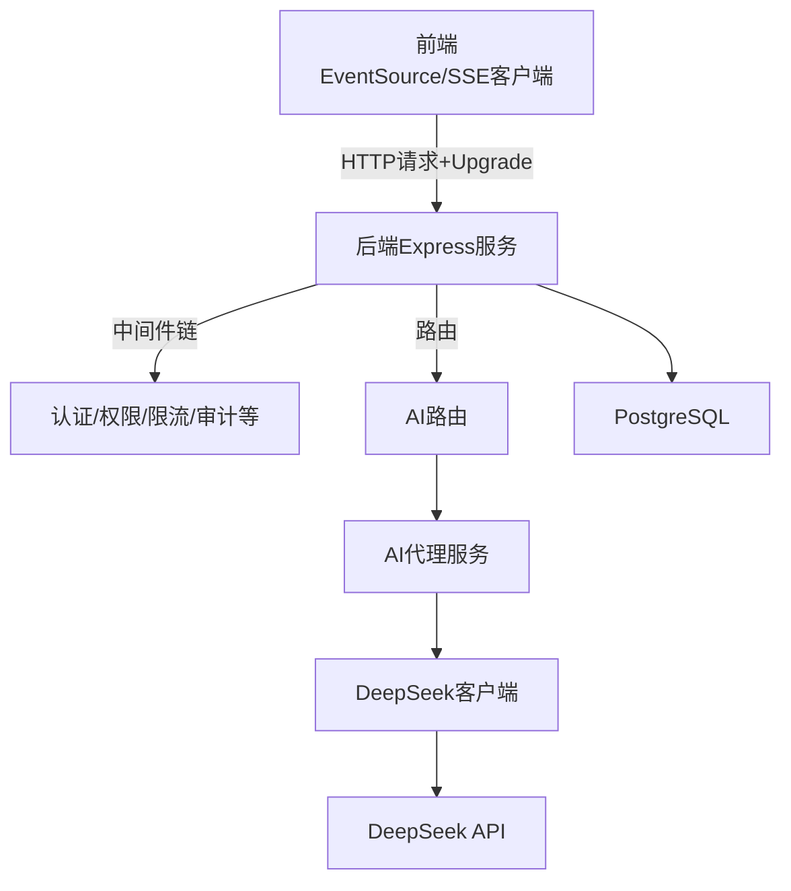
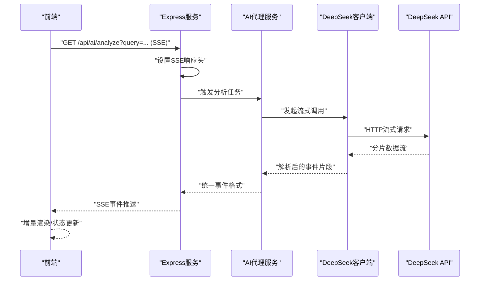
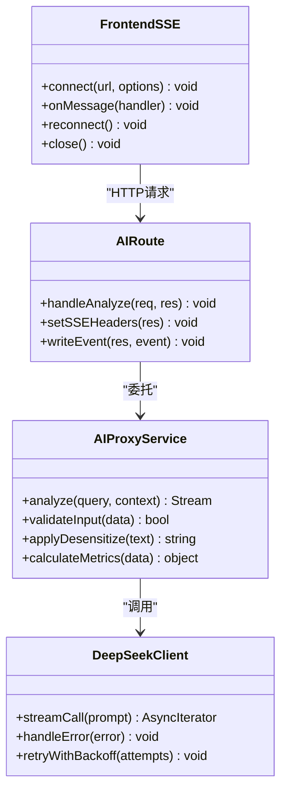

# SSE流式响应

<cite>
**本文引用的文件**   
- [server.ts](file://server/server.ts)
- [app.ts](file://server/src/app.ts)
- [ai.ts](file://server/src/routes/ai.ts)
- [AIProxyService.ts](file://server/src/services/AIProxyService.ts)
- [deepseek.ts](file://server/src/lib/deepseek.ts)
- [ai-stream.ts](file://web/src/lib/ai-stream.ts)
- [cors.ts](file://server/src/middleware/cors.ts)
- [error-handler.ts](file://server/src/middleware/error-handler.ts)
- [logger.ts](file://server/src/lib/logger.ts)
- [env.ts](file://server/src/config/env.ts)
</cite>

## 目录
1. [简介](#简介)
2. [项目结构](#项目结构)
3. [核心组件](#核心组件)
4. [架构总览](#架构总览)
5. [详细组件分析](#详细组件分析)
6. [依赖关系分析](#依赖关系分析)
7. [性能考虑](#性能考虑)
8. [故障排查指南](#故障排查指南)
9. [结论](#结论)
10. [附录](#附录)

## 简介
本文件面向FY200项目的SSE（Server-Sent Events）流式响应实现，聚焦AI分析功能的端到端流式处理：前端建立连接、后端流式响应、实时数据推送与连接管理。文档涵盖SSE协议基础与浏览器兼容性、DeepSeek API的流式调用处理、数据缓冲与错误重试机制、事件格式定义与消息序列化/反序列化、连接生命周期、心跳检测与断线重连策略，以及性能优化与故障排查方法。

## 项目结构
本项目采用前后端分离架构：
- 后端：Express + Prisma + PostgreSQL，提供REST接口并通过SSE向客户端推送AI分析结果。
- 前端：React应用，使用原生EventSource或自定义SSE客户端进行流式接收与渲染。

图表来源
- [server.ts:1-200](file://server/server.ts#L1-L200)
- [app.ts:1-200](file://server/src/app.ts#L1-L200)
- [ai.ts:1-200](file://server/src/routes/ai.ts#L1-L200)
- [AIProxyService.ts:1-200](file://server/src/services/AIProxyService.ts#L1-L200)
- [deepseek.ts:1-200](file://server/src/lib/deepseek.ts#L1-L200)

章节来源
- [server.ts:1-200](file://server/server.ts#L1-L200)
- [app.ts:1-200](file://server/src/app.ts#L1-L200)

## 核心组件
- Express服务与中间件链：负责请求接入、鉴权、限流、CORS、错误处理与日志记录。
- AI路由：暴露用于触发AI分析的接口，支持SSE流式返回。
- AI代理服务：编排AI分析流程，包括输入校验、脱敏/还原、计算指标、调用DeepSeek并聚合流式片段。
- DeepSeek客户端：封装对DeepSeek API的流式调用，处理分块读取、缓冲与异常重试。
- 前端SSE客户端：维护连接、解析事件、增量渲染、心跳检测与断线重连。

章节来源
- [ai.ts:1-200](file://server/src/routes/ai.ts#L1-L200)
- [AIProxyService.ts:1-200](file://server/src/services/AIProxyService.ts#L1-L200)
- [deepseek.ts:1-200](file://server/src/lib/deepseek.ts#L1-L200)
- [ai-stream.ts:1-200](file://web/src/lib/ai-stream.ts#L1-L200)

## 架构总览
SSE流式响应的整体流程如下：
- 前端通过EventSource发起SSE请求，携带必要的认证与上下文参数。
- 后端Express在路由层识别SSE请求，设置响应头并进入流式处理。
- AI代理服务根据业务逻辑生成提示词，调用DeepSeek客户端获取流式分片。
- 后端将分片按SSE事件格式序列化并逐条推送给前端。
- 前端解析事件，增量更新UI，并在连接异常时执行重连策略。

图表来源
- [ai.ts:1-200](file://server/src/routes/ai.ts#L1-L200)
- [AIProxyService.ts:1-200](file://server/src/services/AIProxy.ts#L1-L200)
- [deepseek.ts:1-200](file://server/src/lib/deepseek.ts#L1-L200)
- [ai-stream.ts:1-200](file://web/src/lib/ai-stream.ts#L1-L200)

## 详细组件分析

### SSE协议与浏览器兼容性
- SSE基于HTTP长连接，服务端以text/event-stream类型持续推送事件。
- 浏览器原生支持EventSource，适用于大多数现代浏览器；IE不支持，需降级方案（如轮询）。
- 建议：
  - 明确Content-Type为text/event-stream。
  - 避免在SSE响应中发送非标准字段，确保兼容。
  - 前端应监听open、message、error事件，并处理网络中断。

章节来源
- [cors.ts:1-200](file://server/src/middleware/cors.ts#L1-L200)
- [error-handler.ts:1-200](file://server/src/middleware/error-handler.ts#L1-L200)

### 后端流式响应与事件格式
- 路由层识别SSE请求后，设置响应头并初始化流式写入。
- 事件格式遵循SSE规范，包含event、data、id、retry等字段。
- 典型事件类型：
  - start：任务开始，包含任务ID与初始元数据。
  - chunk：增量内容片段，用于逐步渲染。
  - done：任务完成，包含最终摘要或统计信息。
  - error：错误事件，包含错误码与描述。
- 序列化策略：
  - 将结构化对象序列化为JSON字符串，作为data字段值。
  - 对敏感信息进行脱敏后再序列化。
  - 控制单条事件大小，避免过大导致阻塞。

章节来源
- [ai.ts:1-200](file://server/src/routes/ai.ts#L1-L200)
- [AIProxyService.ts:1-200](file://server/src/services/AIProxyService.ts#L1-L200)

### DeepSeek API集成与流式处理
- DeepSeek客户端封装HTTP流式请求，按分片读取响应体。
- 数据处理流程：
  - 解析分片为事件对象，合并多行文本。
  - 应用脱敏规则（金额区间化、公司名映射）。
  - 计算类指标由后端实时计算，不持久化。
- 错误重试机制：
  - 网络异常：指数退避重试，最多N次。
  - 业务错误：直接转发error事件，附带错误详情。
  - 超时处理：设置合理超时阈值，避免长时间挂起。

章节来源
- [deepseek.ts:1-200](file://server/src/lib/deepseek.ts#L1-L200)
- [AIProxyService.ts:1-200](file://server/src/services/AIProxyService.ts#L1-L200)

### 前端SSE客户端与连接管理
- 连接建立：
  - 使用EventSource或自定义SSE客户端发起请求。
  - 携带JWT令牌与必要查询参数。
- 事件处理：
  - 监听start、chunk、done、error事件。
  - 增量更新UI，避免全量刷新。
- 心跳检测：
  - 服务端定期发送keepalive事件。
  - 前端检测无心跳超过阈值则判定连接失效。
- 断线重连：
  - 自动重连策略：指数退避，最大重试次数限制。
  - 重连前清理状态，避免重复渲染。

章节来源
- [ai-stream.ts:1-200](file://web/src/lib/ai-stream.ts#L1-L200)

### 连接生命周期管理
- 生命周期阶段：
  - 初始化：创建连接，设置超时与重试参数。
  - 运行中：处理事件，更新状态，监控心跳。
  - 结束：收到done事件或主动关闭连接。
  - 错误：捕获异常，触发重连或降级。
- 资源释放：
  - 组件卸载时关闭连接，避免内存泄漏。
  - 清理定时器与事件监听器。

章节来源
- [ai-stream.ts:1-200](file://web/src/lib/ai-stream.ts#L1-L200)
- [error-handler.ts:1-200](file://server/src/middleware/error-handler.ts#L1-L200)

## 依赖关系分析

图表来源
- [AIProxyService.ts:1-200](file://server/src/services/AIProxyService.ts#L1-200)
- [deepseek.ts:1-200](file://server/src/lib/deepseek.ts#L1-200)
- [ai.ts:1-200](file://server/src/routes/ai.ts#L1-200)
- [ai-stream.ts:1-200](file://web/src/lib/ai-stream.ts#L1-200)

章节来源
- [AIProxyService.ts:1-200](file://server/src/services/AIProxyService.ts#L1-200)
- [deepseek.ts:1-200](file://server/src/lib/deepseek.ts#L1-200)
- [ai.ts:1-200](file://server/src/routes/ai.ts#L1-200)
- [ai-stream.ts:1-200](file://web/src/lib/ai-stream.ts#L1-200)

## 性能考虑
- 后端优化：
  - 使用流式传输，避免大对象内存占用。
  - 合理设置事件大小，减少网络开销。
  - 启用压缩（gzip/br）提升传输效率。
  - 数据库查询优化，避免N+1问题。
- 前端优化：
  - 增量渲染，避免频繁DOM操作。
  - 防抖/节流处理高频事件。
  - 虚拟滚动处理大量数据展示。
- 连接管理：
  - 限制并发连接数，防止服务器过载。
  - 合理设置超时与重试策略。
  - 监控连接健康状态，及时告警。

[本节为通用指导，无需特定文件来源]

## 故障排查指南
- 常见问题：
  - 连接失败：检查CORS配置、认证令牌有效性。
  - 事件丢失：确认事件序列化格式正确，避免换行符干扰。
  - 性能瓶颈：监控CPU/内存使用，优化数据处理逻辑。
  - 断线重连：验证心跳机制与重连策略配置。
- 调试技巧：
  - 启用详细日志，记录请求/响应与事件流。
  - 使用浏览器开发者工具查看Network面板。
  - 模拟网络异常测试重连逻辑。
- 监控指标：
  - 连接成功率、平均延迟、错误率。
  - 事件吞吐量、内存占用、GC频率。

章节来源
- [error-handler.ts:1-200](file://server/src/middleware/error-handler.ts#L1-200)
- [logger.ts:1-200](file://server/src/lib/logger.ts#L1-200)
- [env.ts:1-200](file://server/src/config/env.ts#L1-200)

## 结论
FY200项目的SSE流式响应实现了高效的AI分析结果推送，通过合理的架构设计与优化策略，确保了系统的稳定性与性能。前端与后端的紧密协作，结合DeepSeek API的流式能力，为用户提供了实时的数据分析体验。建议在后续迭代中继续优化错误处理、监控与可观测性，进一步提升用户体验。

[本节为总结性内容，无需特定文件来源]

## 附录
- SSE事件格式参考：
  - event: 事件类型
  - data: JSON字符串化的数据
  - id: 事件ID，用于断线重连
  - retry: 重连间隔（毫秒）
- 最佳实践：
  - 保持事件小而频繁，避免大对象阻塞。
  - 实现幂等的事件处理，支持重复消费。
  - 提供降级方案，如轮询或缓存最后结果。

[本节为补充信息，无需特定文件来源]