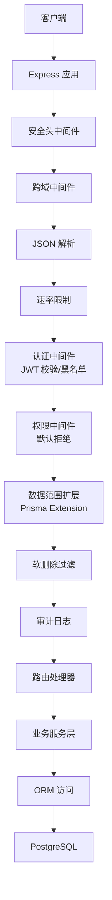
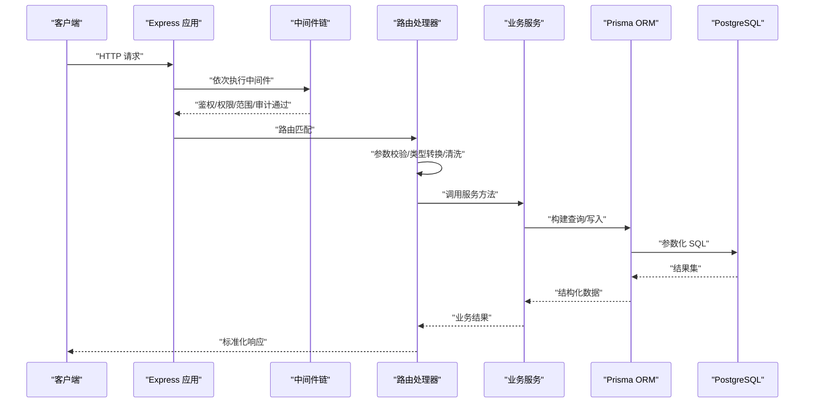
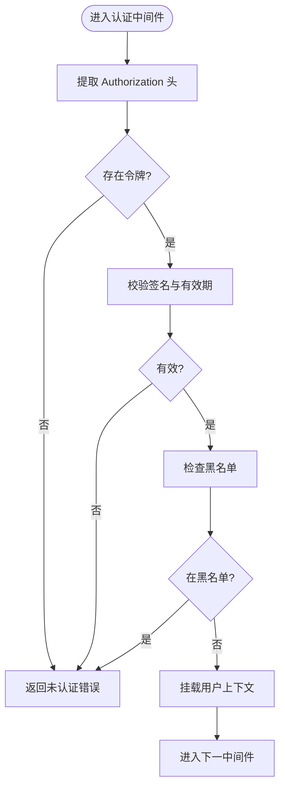
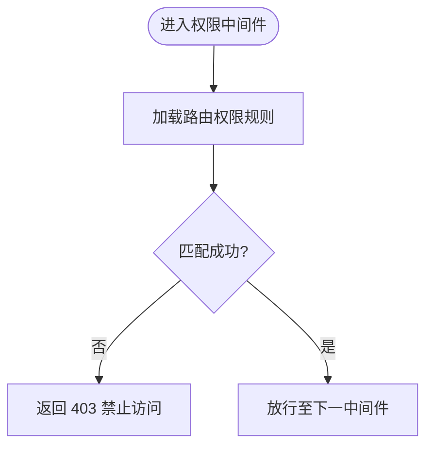
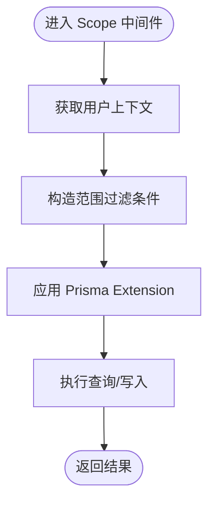
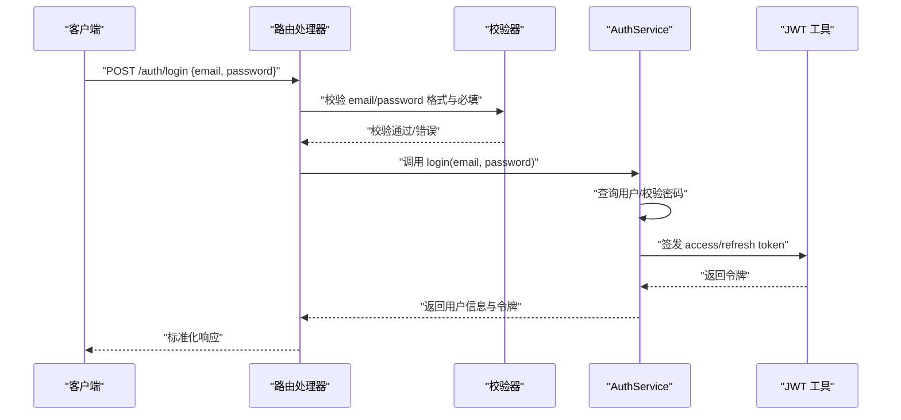
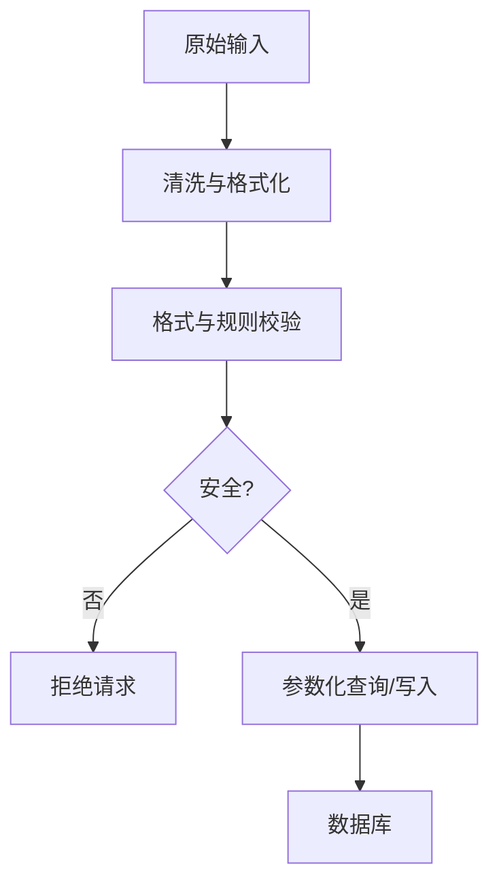
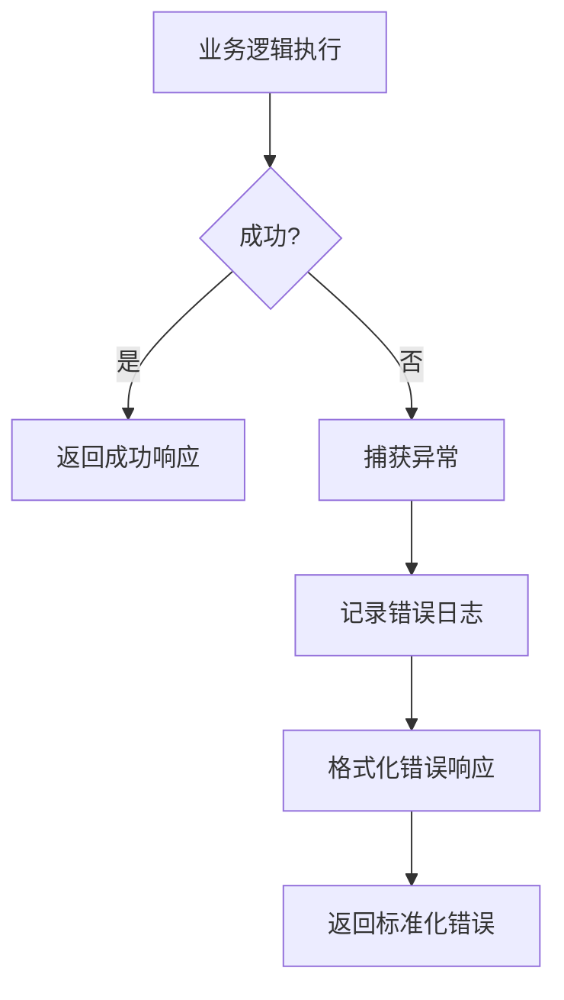
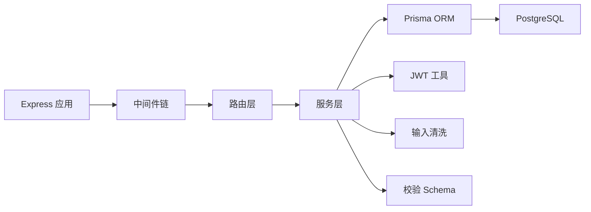

# 参数验证与处理

<cite>
**本文引用的文件**   
- [server/src/app.ts](file://server/src/app.ts)
- [server/src/server.ts](file://server/src/server.ts)
- [server/src/middleware/auth.ts](file://server/src/middleware/auth.ts)
- [server/src/middleware/permission.ts](file://server/src/middleware/permission.ts)
- [server/src/middleware/scope.ts](file://server/src/middleware/scope.ts)
- [server/src/middleware/error-handler.ts](file://server/src/middleware/error-handler.ts)
- [server/src/lib/jwt.ts](file://server/src/lib/jwt.ts)
- [server/src/lib/errors.ts](file://server/src/lib/errors.ts)
- [server/src/lib/response.ts](file://server/src/lib/response.ts)
- [server/src/lib/sanitize.ts](file://server/src/lib/sanitize.ts)
- [server/src/lib/schema.ts](file://server/src/lib/schema.ts)
- [server/src/routes/auth.ts](file://server/src/routes/auth.ts)
- [server/src/routes/admin.ts](file://server/src/routes/admin.ts)
- [server/src/routes/data.ts](file://server/src/routes/data.ts)
- [server/src/routes/reports.ts](file://server/src/routes/reports.ts)
- [server/src/services/AuthService.ts](file://server/src/services/AuthService.ts)
- [server/src/services/DataService.ts](file://server/src/services/DataService.ts)
- [server/src/services/AdminService.ts](file://server/src/services/AdminService.ts)
- [server/src/middleware/rate-limit.ts](file://server/src/middleware/rate-limit.ts)
- [server/src/middleware/cors.ts](file://server/src/middleware/cors.ts)
- [server/src/middleware/helmet.ts](file://server/src/middleware/helmet.ts)
- [server/src/middleware/audit.ts](file://server/src/middleware/audit.ts)
- [server/src/middleware/soft-delete.ts](file://server/src/middleware/soft-delete.ts)
- [server/src/middleware/trace-id.ts](file://server/src/middleware/trace-id.ts)
</cite>

## 目录
1. [简介](#简介)
2. [项目结构](#项目结构)
3. [核心组件](#核心组件)
4. [架构总览](#架构总览)
5. [详细组件分析](#详细组件分析)
6. [依赖关系分析](#依赖关系分析)
7. [性能考虑](#性能考虑)
8. [故障排查指南](#故障排查指南)
9. [结论](#结论)
10. [附录](#附录)

## 简介
本文件聚焦 FY200 项目的“请求参数验证与处理”机制，覆盖路径参数、查询参数、请求体参数的校验策略；数据类型转换、必填字段检查、格式校验（邮箱、手机号、日期等）与自定义校验器；输入数据清理与 SQL 注入防护；JWT 令牌校验、权限校验与数据范围控制；并给出最佳实践、性能优化技巧与常见问题解决方案。文档同时提供流程图与时序图，帮助读者快速理解从请求进入中间件链到服务层落库的完整链路。

## 项目结构
后端基于 Express 4 + Prisma 5 + PostgreSQL 15，采用中间件链式处理：helmet → cors → express.json → rate-limit → auth(JWT+黑名单) → permission(默认拒绝) → scope(Prisma extension) → softDelete → audit → Service → Prisma → PostgreSQL。参数校验贯穿路由层与服务层，结合通用工具模块完成类型转换、格式化与清洗。

图表来源
- [server/src/app.ts](file://server/src/app.ts)
- [server/src/server.ts](file://server/src/server.ts)
- [server/src/middleware/helmet.ts](file://server/src/middleware/helmet.ts)
- [server/src/middleware/cors.ts](file://server/src/middleware/cors.ts)
- [server/src/middleware/rate-limit.ts](file://server/src/middleware/rate-limit.ts)
- [server/src/middleware/auth.ts](file://server/src/middleware/auth.ts)
- [server/src/middleware/permission.ts](file://server/src/middleware/permission.ts)
- [server/src/middleware/scope.ts](file://server/src/middleware/scope.ts)
- [server/src/middleware/soft-delete.ts](file://server/src/middleware/soft-delete.ts)
- [server/src/middleware/audit.ts](file://server/src/middleware/audit.ts)

章节来源
- [server/src/app.ts](file://server/src/app.ts)
- [server/src/server.ts](file://server/src/server.ts)

## 核心组件
- 认证与授权
  - JWT 签发与校验、黑名单管理、过期时间策略（access 短效、refresh 长效轮转）。
  - 权限模型采用“默认拒绝”，在权限中间件中按角色/资源进行细粒度放行。
- 数据范围控制
  - 通过 Prisma Extension 注入当前用户上下文，自动附加组织/公司维度过滤条件。
- 参数校验与清洗
  - 统一使用 schema 定义与工具函数进行类型转换、必填检查、格式校验与输入清洗。
  - 针对 SQL 注入采用参数化查询与白名单算子，禁止 eval。
- 错误与响应
  - 统一错误处理中间件捕获异常，返回标准化响应体。
  - 响应封装确保一致性，便于前端消费。

章节来源
- [server/src/lib/jwt.ts](file://server/src/lib/jwt.ts)
- [server/src/middleware/auth.ts](file://server/src/middleware/auth.ts)
- [server/src/middleware/permission.ts](file://server/src/middleware/permission.ts)
- [server/src/middleware/scope.ts](file://server/src/middleware/scope.ts)
- [server/src/lib/sanitize.ts](file://server/src/lib/sanitize.ts)
- [server/src/lib/schema.ts](file://server/src/lib/schema.ts)
- [server/src/lib/errors.ts](file://server/src/lib/errors.ts)
- [server/src/lib/response.ts](file://server/src/lib/response.ts)

## 架构总览
下图展示一次典型 API 请求的参数验证与处理流程，涵盖中间件链、路由、服务层与数据库交互。

图表来源
- [server/src/app.ts](file://server/src/app.ts)
- [server/src/middleware/auth.ts](file://server/src/middleware/auth.ts)
- [server/src/middleware/permission.ts](file://server/src/middleware/permission.ts)
- [server/src/middleware/scope.ts](file://server/src/middleware/scope.ts)
- [server/src/middleware/audit.ts](file://server/src/middleware/audit.ts)
- [server/src/routes/auth.ts](file://server/src/routes/auth.ts)
- [server/src/routes/data.ts](file://server/src/routes/data.ts)
- [server/src/services/AuthService.ts](file://server/src/services/AuthService.ts)
- [server/src/services/DataService.ts](file://server/src/services/DataService.ts)

## 详细组件分析

### 认证与 JWT 校验
- 令牌生命周期
  - access token：短时效（约 15 分钟），用于接口鉴权。
  - refresh token：长时效（约 7 天），用于刷新 access token，支持轮转。
- 黑名单机制
  - 登出或强制下线时，将 token 加入黑名单，后续请求被拒绝。
- 校验流程
  - 从请求头提取令牌，校验签名、有效期与黑名单状态，失败则返回未认证错误。

图表来源
- [server/src/middleware/auth.ts](file://server/src/middleware/auth.ts)
- [server/src/lib/jwt.ts](file://server/src/lib/jwt.ts)

章节来源
- [server/src/middleware/auth.ts](file://server/src/middleware/auth.ts)
- [server/src/lib/jwt.ts](file://server/src/lib/jwt.ts)
- [server/src/services/AuthService.ts](file://server/src/services/AuthService.ts)

### 权限校验与默认拒绝
- 设计原则
  - 默认拒绝所有未显式放行的操作，最小权限原则。
- 实现方式
  - 权限中间件根据路由配置与用户角色/资源标识决定放行与否。
  - 未命中规则直接返回 403 禁止访问。

图表来源
- [server/src/middleware/permission.ts](file://server/src/middleware/permission.ts)

章节来源
- [server/src/middleware/permission.ts](file://server/src/middleware/permission.ts)

### 数据范围控制（Scope）
- 目标
  - 基于当前用户上下文自动附加组织/公司维度过滤条件，防止越权访问。
- 实现要点
  - 通过 Prisma Extension 注入查询钩子，在读取/写入时自动附加 where 条件。
  - 对列表查询、导出、统计等场景均生效。

图表来源
- [server/src/middleware/scope.ts](file://server/src/middleware/scope.ts)

章节来源
- [server/src/middleware/scope.ts](file://server/src/middleware/scope.ts)

### 参数校验与清洗（路径、查询、请求体）
- 校验策略
  - 路径参数：类型转换（如 id 转为数字）、必填检查、取值范围。
  - 查询参数：分页排序参数校验、枚举值白名单、日期区间合法性。
  - 请求体：必填字段、类型约束、格式校验（邮箱、手机号、日期）、长度限制。
- 工具与模式
  - 使用 schema 定义统一校验规则，集中维护。
  - 输入清洗去除多余空白、HTML 标签、危险字符，避免 XSS 与注入。
- 示例流程（以登录为例）

图表来源
- [server/src/routes/auth.ts](file://server/src/routes/auth.ts)
- [server/src/services/AuthService.ts](file://server/src/services/AuthService.ts)
- [server/src/lib/jwt.ts](file://server/src/lib/jwt.ts)

章节来源
- [server/src/lib/schema.ts](file://server/src/lib/schema.ts)
- [server/src/lib/sanitize.ts](file://server/src/lib/sanitize.ts)
- [server/src/routes/auth.ts](file://server/src/routes/auth.ts)
- [server/src/routes/data.ts](file://server/src/routes/data.ts)
- [server/src/routes/reports.ts](file://server/src/routes/reports.ts)

### 输入数据清理与 SQL 注入防护
- 输入清理
  - 去除首尾空白、转义或移除危险字符、限制长度与格式。
  - 对富文本内容做白名单过滤，避免 XSS。
- SQL 注入防护
  - 全部使用 Prisma 参数化查询，禁止拼接 SQL。
  - 公式计算使用白名单算子（+-*/()），禁止 eval 动态执行。

图表来源
- [server/src/lib/sanitize.ts](file://server/src/lib/sanitize.ts)
- [server/src/lib/schema.ts](file://server/src/lib/schema.ts)

章节来源
- [server/src/lib/sanitize.ts](file://server/src/lib/sanitize.ts)
- [server/src/lib/schema.ts](file://server/src/lib/schema.ts)

### 错误处理与标准化响应
- 错误处理
  - 全局错误中间件捕获异常，记录日志，返回统一错误码与消息。
  - 区分业务错误与系统错误，便于前端差异化处理。
- 响应封装
  - 统一响应结构，包含状态码、数据体、消息与追踪 ID。

图表来源
- [server/src/middleware/error-handler.ts](file://server/src/middleware/error-handler.ts)
- [server/src/lib/response.ts](file://server/src/lib/response.ts)
- [server/src/lib/errors.ts](file://server/src/lib/errors.ts)

章节来源
- [server/src/middleware/error-handler.ts](file://server/src/middleware/error-handler.ts)
- [server/src/lib/response.ts](file://server/src/lib/response.ts)
- [server/src/lib/errors.ts](file://server/src/lib/errors.ts)

### 审计与可观测性
- 审计日志
  - 记录关键操作的请求信息、用户上下文与结果摘要。
- 追踪 ID
  - 为每个请求分配唯一追踪 ID，贯穿中间件与服务层，便于问题定位。

章节来源
- [server/src/middleware/audit.ts](file://server/src/middleware/audit.ts)
- [server/src/middleware/trace-id.ts](file://server/src/middleware/trace-id.ts)

## 依赖关系分析
- 中间件耦合度
  - 中间件顺序严格，职责单一，低耦合高内聚。
- 外部依赖
  - Prisma ORM 负责数据库访问，保证参数化查询。
  - JWT 库负责令牌签发与校验。
  - 第三方 AI 服务（DeepSeek）通过独立管道处理，不干扰主业务流程。

图表来源
- [server/src/app.ts](file://server/src/app.ts)
- [server/src/middleware/auth.ts](file://server/src/middleware/auth.ts)
- [server/src/middleware/permission.ts](file://server/src/middleware/permission.ts)
- [server/src/middleware/scope.ts](file://server/src/middleware/scope.ts)
- [server/src/lib/jwt.ts](file://server/src/lib/jwt.ts)
- [server/src/lib/sanitize.ts](file://server/src/lib/sanitize.ts)
- [server/src/lib/schema.ts](file://server/src/lib/schema.ts)

章节来源
- [server/src/app.ts](file://server/src/app.ts)
- [server/src/middleware/auth.ts](file://server/src/middleware/auth.ts)
- [server/src/middleware/permission.ts](file://server/src/middleware/permission.ts)
- [server/src/middleware/scope.ts](file://server/src/middleware/scope.ts)
- [server/src/lib/jwt.ts](file://server/src/lib/jwt.ts)
- [server/src/lib/sanitize.ts](file://server/src/lib/sanitize.ts)
- [server/src/lib/schema.ts](file://server/src/lib/schema.ts)

## 性能考虑
- 参数校验前置
  - 在路由层尽早校验，减少无效请求进入服务层。
- 缓存策略
  - 对热点查询结果进行短期缓存，降低数据库压力。
- 分页与限流
  - 强制分页与排序参数限制，避免全表扫描。
  - 启用速率限制中间件，保护接口免受滥用。
- 异步与批处理
  - 批量导入与导出采用异步任务与分批处理，避免阻塞。

[本节为通用指导，无需特定文件引用]

## 故障排查指南
- 常见错误
  - 未认证：检查 Authorization 头与令牌有效性。
  - 权限不足：确认路由权限配置与用户角色。
  - 参数校验失败：查看请求体结构与格式是否符合 schema。
  - 数据范围越权：检查 Scope 扩展是否正确注入用户上下文。
- 调试建议
  - 开启追踪 ID，定位请求链路。
  - 查看审计日志与错误日志，获取上下文信息。
  - 使用测试用例复现问题，逐步缩小范围。

章节来源
- [server/src/middleware/error-handler.ts](file://server/src/middleware/error-handler.ts)
- [server/src/lib/errors.ts](file://server/src/lib/errors.ts)
- [server/src/middleware/audit.ts](file://server/src/middleware/audit.ts)
- [server/src/middleware/trace-id.ts](file://server/src/middleware/trace-id.ts)

## 结论
FY200 项目在参数验证与处理方面采用了分层、模块化与标准化的设计：中间件链保障安全与权限，路由与服务层专注业务逻辑与数据校验，工具模块提供统一的校验、清洗与响应能力。通过严格的输入校验、参数化查询与白名单算子，有效防范注入与 XSS 风险；通过默认拒绝的权限模型与数据范围控制，确保数据安全与合规。建议在新增接口时遵循现有模式，完善 schema 定义与测试用例，持续提升系统的健壮性与可维护性。

## 附录
- 最佳实践
  - 所有输入必须经过 schema 校验与清洗。
  - 使用参数化查询，禁止字符串拼接 SQL。
  - 权限模型默认拒绝，显式放行必要操作。
  - 统一错误与响应格式，便于前端处理。
- 性能优化技巧
  - 合理索引与分页，避免大表全量扫描。
  - 热点数据缓存与异步任务处理。
  - 监控与告警，及时发现性能瓶颈。
- 常见问题解决方案
  - 令牌失效：引导用户刷新或重新登录。
  - 权限不足：检查路由权限配置与用户角色。
  - 参数校验失败：提供清晰的错误提示与修复建议。

[本节为通用指导，无需特定文件引用]