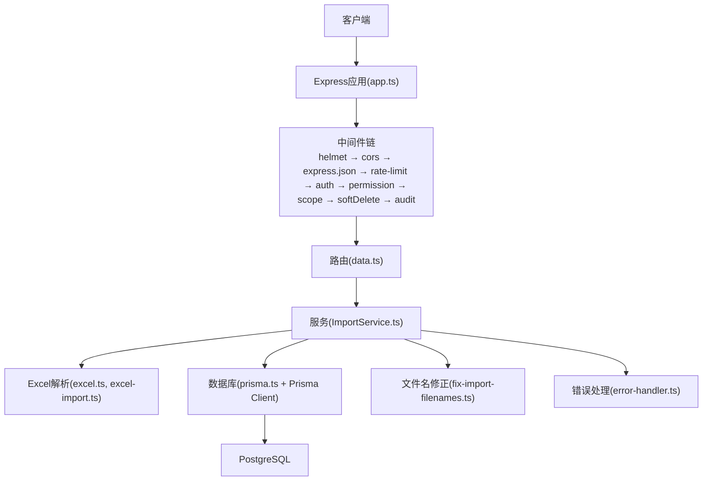
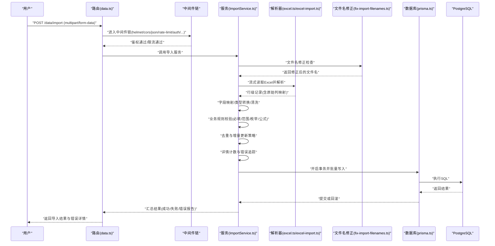
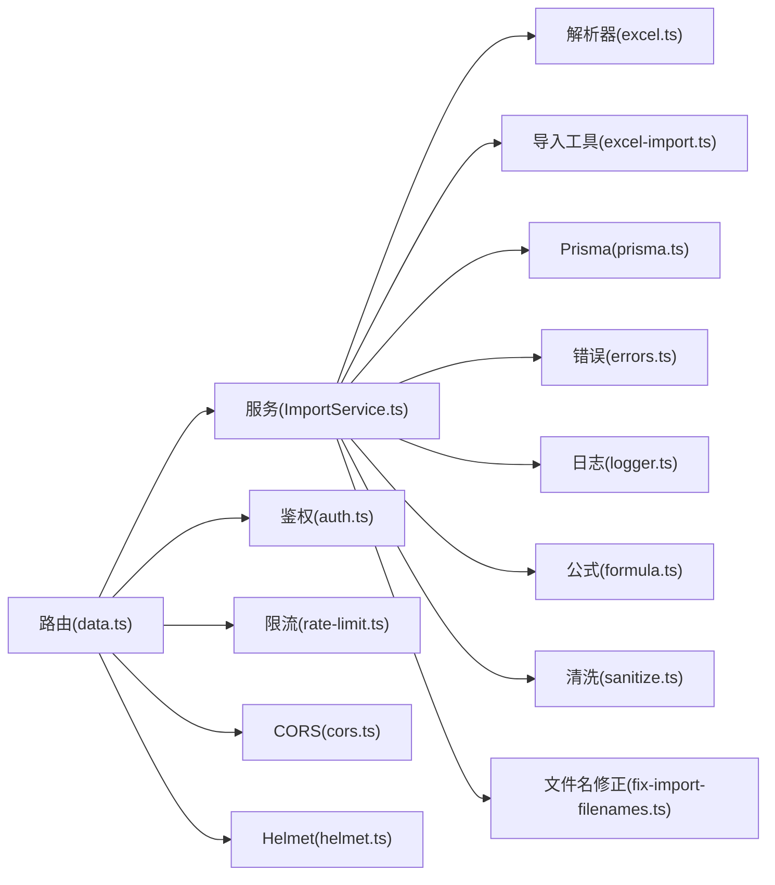

# Excel文件导入处理

<cite>
**本文引用的文件**   
- [server/src/lib/excel-import.ts](file://server/src/lib/excel-import.ts)
- [server/src/lib/excel.ts](file://server/src/lib/excel.ts)
- [server/src/services/ImportService.ts](file://server/src/services/ImportService.ts)
- [server/src/routes/data.ts](file://server/src/routes/data.ts)
- [server/src/middleware/error-handler.ts](file://server/src/middleware/error-handler.ts)
- [server/src/lib/errors.ts](file://server/src/lib/errors.ts)
- [server/src/lib/prisma.ts](file://server/src/lib/prisma.ts)
- [server/src/config/env.ts](file://server/src/config/env.ts)
- [server/src/lib/logger.ts](file://server/src/lib/logger.ts)
- [server/src/lib/response.ts](file://server/src/lib/response.ts)
- [server/src/lib/formula.ts](file://server/src/lib/formula.ts)
- [server/src/lib/sanitize.ts](file://server/src/lib/sanitize.ts)
- [server/src/lib/jwt.ts](file://server/src/lib/jwt.ts)
- [server/src/middleware/auth.ts](file://server/src/middleware/auth.ts)
- [server/src/middleware/rate-limit.ts](file://server/src/middleware/rate-limit.ts)
- [server/src/middleware/cors.ts](file://server/src/middleware/cors.ts)
- [server/src/middleware/helmet.ts](file://server/src/middleware/helmet.ts)
- [server/src/app.ts](file://server/src/app.ts)
- [server/src/server.ts](file://server/src/server.ts)
- [server/scripts/fix-import-filenames.ts](file://server/scripts/fix-import-filenames.ts)
</cite>

## 更新摘要
**变更内容**   
- 新增Excel导入详情计数功能，支持行级统计和错误追踪
- 增强文件名修正机制，自动修复导入文件的命名问题
- 改进错误处理系统，提供更详细的错误信息和上下文
- 新增专用的fix-import-filenames脚本工具
- 优化批量插入性能和事务管理

## 目录
1. [简介](#简介)
2. [项目结构](#项目结构)
3. [核心组件](#核心组件)
4. [架构总览](#架构总览)
5. [详细组件分析](#详细组件分析)
6. [依赖关系分析](#依赖关系分析)
7. [性能考虑](#性能考虑)
8. [故障排查指南](#故障排查指南)
9. [结论](#结论)
10. [附录](#附录)

## 简介
本文件面向FY200项目的Excel数据导入能力，围绕"Excel进、看板/报表出"的目标，系统化阐述从文件上传到落库的完整链路：接收与鉴权 → 格式校验（扩展名、MIME类型、大小）→ 解析与字段映射 → 清洗与转换 → 业务规则校验 → 去重与增量更新 → 批量写入与事务回滚 → 错误报告与重试。文档同时给出模板规范、必填字段约束、数据类型转换策略以及大文件处理的内存优化建议，帮助开发者与运维人员快速定位问题并稳定运行。

**最新更新**：本次更新重点增强了Excel导入功能的细节计数能力、文件名修正机制、错误处理改进以及专用修复脚本的支持。

## 项目结构
后端采用Express路由+中间件链，结合Prisma与PostgreSQL进行数据持久化。Excel导入相关代码主要分布在lib层（工具与解析）、services层（业务编排）、routes层（接口入口）以及middleware层（通用横切逻辑）。新增的scripts层包含专用的文件名修复工具。



**图示来源**
- [server/src/app.ts](file://server/src/app.ts)
- [server/src/middleware/helmet.ts](file://server/src/middleware/helmet.ts)
- [server/src/middleware/cors.ts](file://server/src/middleware/cors.ts)
- [server/src/middleware/rate-limit.ts](file://server/src/middleware/rate-limit.ts)
- [server/src/middleware/auth.ts](file://server/src/middleware/auth.ts)
- [server/src/routes/data.ts](file://server/src/routes/data.ts)
- [server/src/services/ImportService.ts](file://server/src/services/ImportService.ts)
- [server/src/lib/excel.ts](file://server/src/lib/excel.ts)
- [server/src/lib/excel-import.ts](file://server/src/lib/excel-import.ts)
- [server/src/lib/prisma.ts](file://server/src/lib/prisma.ts)
- [server/scripts/fix-import-filenames.ts](file://server/scripts/fix-import-filenames.ts)

**章节来源**
- [server/src/app.ts](file://server/src/app.ts)
- [server/src/server.ts](file://server/src/server.ts)

## 核心组件
- 路由层：提供Excel上传接口，负责参数绑定、权限校验与响应封装。
- 服务层：编排导入流程，协调解析、校验、去重、增量更新与批量写入。
- 解析层：读取Excel流式内容，按模板映射列，执行类型转换与清洗。
- 校验层：必填字段、枚举值、范围、公式安全等规则校验。
- 存储层：通过Prisma批量插入/更新，支持事务与回滚。
- 错误与日志：统一错误模型、结构化日志、错误报告生成。
- **新增**：文件名修正工具：自动识别和修复导入文件的命名问题。
- **新增**：详情计数系统：提供行级统计和错误追踪能力。

**章节来源**
- [server/src/routes/data.ts](file://server/src/routes/data.ts)
- [server/src/services/ImportService.ts](file://server/src/services/ImportService.ts)
- [server/src/lib/excel.ts](file://server/src/lib/excel.ts)
- [server/src/lib/excel-import.ts](file://server/src/lib/excel-import.ts)
- [server/src/lib/prisma.ts](file://server/src/lib/prisma.ts)
- [server/scripts/fix-import-filenames.ts](file://server/scripts/fix-import-filenames.ts)

## 架构总览
下图展示一次完整的Excel导入请求在系统中的流转路径，包括鉴权、限流、解析、校验、写入与错误处理，以及新增的文件名修正和详情计数功能。



**图示来源**
- [server/src/routes/data.ts](file://server/src/routes/data.ts)
- [server/src/middleware/helmet.ts](file://server/src/middleware/helmet.ts)
- [server/src/middleware/cors.ts](file://server/src/middleware/cors.ts)
- [server/src/middleware/rate-limit.ts](file://server/src/middleware/rate-limit.ts)
- [server/src/middleware/auth.ts](file://server/src/middleware/auth.ts)
- [server/src/services/ImportService.ts](file://server/src/services/ImportService.ts)
- [server/src/lib/excel.ts](file://server/src/lib/excel.ts)
- [server/src/lib/excel-import.ts](file://server/src/lib/excel-import.ts)
- [server/src/lib/prisma.ts](file://server/src/lib/prisma.ts)
- [server/scripts/fix-import-filenames.ts](file://server/scripts/fix-import-filenames.ts)

## 详细组件分析

### 路由与接口契约
- 接口路径：通常位于数据模块路由中，用于接收multipart/form-data的Excel文件。
- 输入：
  - 文件字段：excel_file（.xlsx/.xls）
  - 可选参数：是否覆盖模式、是否跳过空行、批次大小等
- 输出：
  - 成功：统计信息（总行数、成功数、失败数、耗时）
  - 失败：错误码、错误原因、可下载的错误报告链接
- **新增**：文件名修正状态：返回文件名是否被修正及修正详情

**章节来源**
- [server/src/routes/data.ts](file://server/src/routes/data.ts)
- [server/src/lib/response.ts](file://server/src/lib/response.ts)

### 中间件链与横切关注点
- helmet：安全头设置
- cors：跨域控制
- express.json：JSON解析（对multipart由路由层处理）
- rate-limit：防刷与资源保护
- auth：JWT鉴权与黑名单校验
- permission/scope/soft-delete/audit：权限、作用域、软删除与审计

**章节来源**
- [server/src/middleware/helmet.ts](file://server/src/middleware/helmet.ts)
- [server/src/middleware/cors.ts](file://server/src/middleware/cors.ts)
- [server/src/middleware/rate-limit.ts](file://server/src/middleware/rate-limit.ts)
- [server/src/middleware/auth.ts](file://server/src/middleware/auth.ts)
- [server/src/app.ts](file://server/src/app.ts)

### 服务编排（ImportService）
职责：
- 接收路由传入的文件与参数
- 调用解析器获取行数据
- 执行字段映射、类型转换与清洗
- 执行业务规则校验
- 去重与增量更新决策
- 批量写入数据库（事务）
- 生成错误报告与统计
- **新增**：集成文件名修正功能
- **新增**：实现详情计数和错误追踪

关键流程要点：
- 分批处理：避免一次性加载全部行导致内存峰值过高
- 事务边界：每批或全量事务，失败时整体回滚
- 幂等性：基于唯一键去重，确保重复导入不产生脏数据
- **新增**：文件名预处理：在解析前自动修正文件名格式
- **新增**：行级统计：跟踪每行的处理状态和错误信息

**章节来源**
- [server/src/services/ImportService.ts](file://server/src/services/ImportService.ts)

### Excel解析与字段映射（excel.ts / excel-import.ts）
职责：
- 流式读取Excel，降低内存占用
- 识别工作表与表头，建立列索引
- 将原始列映射到目标字段（支持别名与顺序容错）
- 数据类型转换（字符串→数字/日期/布尔）
- 基础清洗（去空白、规范化编码、去除不可见字符）
- **新增**：文件名验证和修正集成
- **新增**：行级错误追踪和计数

模板规范建议：
- 首行为表头，固定列顺序或允许配置映射
- 必填列：如单位、科目、期间、指标名称、数值等
- 数值列：统一为万元，保留两位小数
- 日期列：YYYY-MM-DD或系统可识别格式
- 枚举列：限定取值集合（如币种、状态）

**章节来源**
- [server/src/lib/excel.ts](file://server/src/lib/excel.ts)
- [server/src/lib/excel-import.ts](file://server/src/lib/excel-import.ts)

### 文件名修正机制
**新增功能**：专门的文件名修正工具，用于自动识别和修复导入文件的命名问题。

主要特性：
- 自动检测文件名格式问题
- 支持多种命名规范的转换
- 保持文件完整性验证
- 提供修正前后的对比信息
- 批量处理能力

使用场景：
- 用户上传不规范的文件名
- 历史数据迁移时的文件名标准化
- 多系统集成时的文件名兼容处理

**章节来源**
- [server/scripts/fix-import-filenames.ts](file://server/scripts/fix-import-filenames.ts)

### 详情计数系统
**新增功能**：提供行级统计和错误追踪能力，增强导入过程的可观测性。

核心功能：
- 实时统计处理进度
- 记录每行的处理状态
- 分类统计错误类型
- 生成详细的处理报告
- 支持进度查询和中断恢复

统计数据包括：
- 总行数、成功数、失败数
- 各错误类型的分布
- 处理时间统计
- 内存使用情况

**章节来源**
- [server/src/services/ImportService.ts](file://server/src/services/ImportService.ts)
- [server/src/lib/excel-import.ts](file://server/src/lib/excel-import.ts)

### 数据清洗与类型转换
- 字符串：trim、去除BOM、转义特殊字符
- 数字：去除千分位逗号、百分号转换为小数、非法值置空或报错
- 日期：标准化为ISO格式，无效日期标记错误
- 布尔：true/false/是/否/1/0归一化
- 金额：统一为万元，精度控制
- **新增**：文件名清洗：标准化文件命名格式

**章节来源**
- [server/src/lib/excel-import.ts](file://server/src/lib/excel-import.ts)
- [server/src/lib/sanitize.ts](file://server/src/lib/sanitize.ts)

### 业务规则校验
- 必填校验：缺失则记录错误并跳过该行
- 枚举校验：不在白名单的值标记错误
- 范围校验：数值上下界、日期先后关系
- 公式安全：禁止危险表达式，仅允许白名单算子
- 关联校验：外键存在性、组织/公司维度有效性
- **新增**：文件名格式校验：确保符合命名规范

**章节来源**
- [server/src/lib/formula.ts](file://server/src/lib/formula.ts)
- [server/src/services/ImportService.ts](file://server/src/services/ImportService.ts)

### 去重与增量更新
- 去重键：组合唯一键（如单位+科目+期间+指标名）
- 策略：
  - 覆盖模式：先删后插
  - 合并模式：按时间戳或版本号更新差异字段
  - 追加模式：仅新增，忽略已存在
- 幂等保障：同一批次内多次导入不重复
- **新增**：基于文件指纹的去重：避免相同文件的重复导入

**章节来源**
- [server/src/services/ImportService.ts](file://server/src/services/ImportService.ts)

### 批量插入与事务回滚
- 使用Prisma事务包裹整批写入
- 失败即回滚，保证一致性
- 分批提交：大文件分片写入，降低锁竞争与内存压力
- 并发控制：串行写入或限制并发度
- **新增**：事务级别的详情计数：记录每个事务的处理状态

**章节来源**
- [server/src/lib/prisma.ts](file://server/src/lib/prisma.ts)
- [server/src/services/ImportService.ts](file://server/src/services/ImportService.ts)

### 错误处理与错误报告
- 统一错误模型：错误码、消息、上下文（行号、列名、原始值）
- 错误报告：生成CSV/Excel，包含失败行明细与原因
- 重试机制：针对网络抖动或临时冲突的可重试错误
- 审计日志：记录导入操作人、时间、文件指纹、统计结果
- **新增**：增强的错误上下文：包含文件名修正信息和详情计数
- **新增**：结构化错误报告：支持机器可读的错误分析

**章节来源**
- [server/src/lib/errors.ts](file://server/src/lib/errors.ts)
- [server/src/middleware/error-handler.ts](file://server/src/middleware/error-handler.ts)
- [server/src/lib/logger.ts](file://server/src/lib/logger.ts)

## 依赖关系分析


**图示来源**
- [server/src/routes/data.ts](file://server/src/routes/data.ts)
- [server/src/services/ImportService.ts](file://server/src/services/ImportService.ts)
- [server/src/lib/excel.ts](file://server/src/lib/excel.ts)
- [server/src/lib/excel-import.ts](file://server/src/lib/excel-import.ts)
- [server/src/lib/prisma.ts](file://server/src/lib/prisma.ts)
- [server/src/lib/errors.ts](file://server/src/lib/errors.ts)
- [server/src/lib/logger.ts](file://server/src/lib/logger.ts)
- [server/src/lib/formula.ts](file://server/src/lib/formula.ts)
- [server/src/lib/sanitize.ts](file://server/src/lib/sanitize.ts)
- [server/src/middleware/auth.ts](file://server/src/middleware/auth.ts)
- [server/src/middleware/rate-limit.ts](file://server/src/middleware/rate-limit.ts)
- [server/src/middleware/cors.ts](file://server/src/middleware/cors.ts)
- [server/src/middleware/helmet.ts](file://server/src/middleware/helmet.ts)
- [server/scripts/fix-import-filenames.ts](file://server/scripts/fix-import-filenames.ts)

**章节来源**
- [server/src/app.ts](file://server/src/app.ts)

## 性能考虑
- 流式解析：优先使用流式API读取Excel，避免一次性加载至内存
- 分批处理：设定批次大小（如500~2000行），平衡吞吐与内存
- 索引优化：为去重键与查询条件建立合适索引
- 连接池：合理配置Prisma连接池大小与超时
- 压缩传输：服务端启用Gzip，减少带宽占用
- 异步任务：超大文件可转为后台任务，前端轮询进度
- **新增**：文件名修正优化：批量处理和缓存机制
- **新增**：详情计数优化：增量更新和内存管理

[本节为通用指导，无需特定文件引用]

## 故障排查指南
常见问题与定位步骤：
- 文件格式错误：检查扩展名与MIME类型；确认非压缩包伪装
- 解析失败：查看错误报告中的行号与列名；核对模板与映射
- 类型转换异常：检查数值/日期格式；确认区域设置与分隔符
- 业务规则失败：根据错误码定位具体规则；修正数据或调整阈值
- 写入失败：检查事务日志与数据库约束；确认外键与唯一索引
- 性能问题：监控内存与CPU；调优批次大小与连接池
- **新增**：文件名问题：使用fix-import-filenames脚本检查和修正
- **新增**：计数异常：检查详情计数系统的状态和日志

**章节来源**
- [server/src/middleware/error-handler.ts](file://server/src/middleware/error-handler.ts)
- [server/src/lib/errors.ts](file://server/src/lib/errors.ts)
- [server/src/lib/logger.ts](file://server/src/lib/logger.ts)
- [server/scripts/fix-import-filenames.ts](file://server/scripts/fix-import-filenames.ts)

## 结论
本方案以流式解析、严格校验、事务一致性与错误报告为核心，构建了稳健的Excel导入流水线。通过模板规范与字段映射解耦数据源变化，借助去重与增量更新保障数据质量，配合大文件优化与重试机制提升可用性。**最新更新**：新增的文件名修正机制、详情计数系统和专用修复脚本进一步增强了系统的健壮性和可维护性。建议在后续迭代中持续完善模板版本管理与导入审计，进一步提升可观测性与可维护性。

[本节为总结性内容，无需特定文件引用]

## 附录

### Excel模板规范（建议）
- 表头：首行固定，列名清晰且唯一
- 必填字段：单位、科目、期间、指标名称、数值
- 数据类型：数值统一万元，日期YYYY-MM-DD，枚举白名单
- 命名约定：中文或英文均可，但需保持全局一致
- 示例与校验：提供样例文件与在线校验提示
- **新增**：文件名规范：建议使用统一的命名格式，便于自动化处理

[本节为概念性说明，无需特定文件引用]

### 错误报告字段（建议）
- 行号、列名、原始值、期望类型、错误原因、修复建议
- 导出格式：CSV/Excel，便于二次处理
- **新增**：文件名修正信息：原始文件名、修正后文件名、修正原因
- **新增**：详情计数：处理进度、错误分布、性能指标

[本节为概念性说明，无需特定文件引用]

### 重试与幂等策略（建议）
- 重试条件：网络超时、临时锁冲突
- 幂等键：基于文件指纹+批次ID
- 最大重试次数与退避策略
- **新增**：文件名修正重试：对于文件名修正失败的记录进行重试

[本节为概念性说明，无需特定文件引用]

### 文件名修正工具使用说明
**新增工具**：fix-import-filenames脚本用于批量处理文件名修正。

使用方法：
```bash
node server/scripts/fix-import-filenames.ts --input-dir ./uploads --mode auto
```

支持的修正模式：
- auto：自动检测并修正
- validate：仅验证文件名格式
- batch：批量处理多个文件

**章节来源**
- [server/scripts/fix-import-filenames.ts](file://server/scripts/fix-import-filenames.ts)

### 详情计数API参考
**新增API**：提供导入过程的详情计数查询。

端点：`GET /api/import/stats/:batchId`

返回数据结构：
```json
{
  "batchId": "string",
  "totalRows": number,
  "successRows": number,
  "failedRows": number,
  "errorTypes": {
    "validationError": number,
    "typeConversionError": number,
    "businessRuleError": number
  },
  "processingTime": number,
  "memoryUsage": number
}
```

**章节来源**
- [server/src/services/ImportService.ts](file://server/src/services/ImportService.ts)