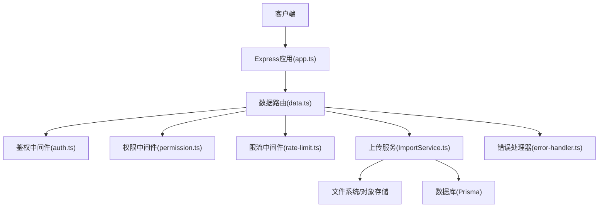
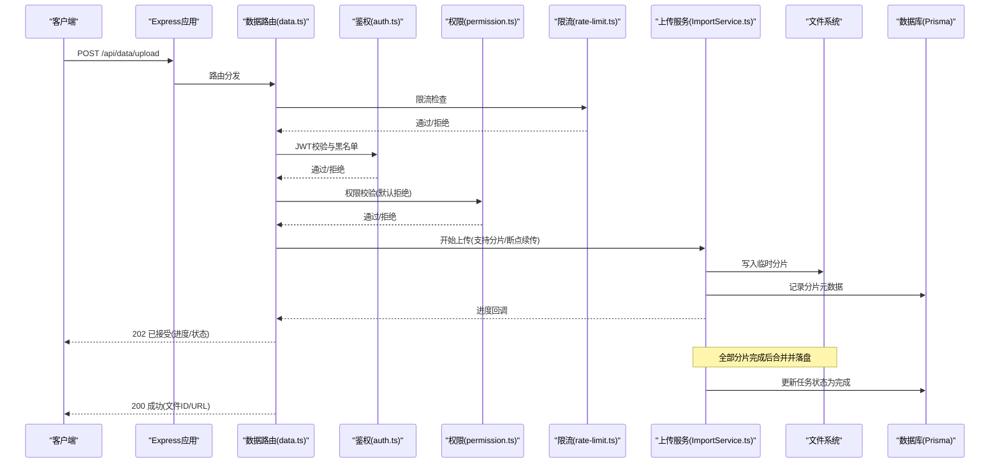
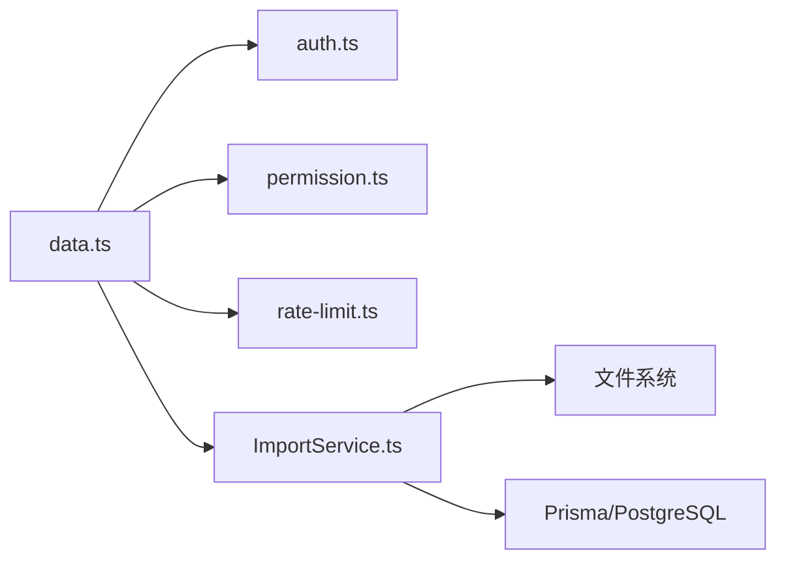

# 文件上传API接口

<cite>
**本文档引用的文件**   
- [server/src/routes/data.ts](file://server/src/routes/data.ts)
- [server/src/middleware/rate-limit.ts](file://server/src/middleware/rate-limit.ts)
- [server/src/middleware/auth.ts](file://server/src/middleware/auth.ts)
- [server/src/middleware/permission.ts](file://server/src/middleware/permission.ts)
- [server/src/middleware/error-handler.ts](file://server/src/middleware/error-handler.ts)
- [server/src/lib/errors.ts](file://server/src/lib/errors.ts)
- [server/src/lib/response.ts](file://server/src/lib/response.ts)
- [server/src/app.ts](file://server/src/app.ts)
- [server/src/config/env.ts](file://server/src/config/env.ts)
- [server/package.json](file://server/package.json)
</cite>

## 目录
1. [简介](#简介)
2. [项目结构](#项目结构)
3. [核心组件](#核心组件)
4. [架构总览](#架构总览)
5. [详细组件分析](#详细组件分析)
6. [依赖关系分析](#依赖关系分析)
7. [性能考虑](#性能考虑)
8. [故障排查指南](#故障排查指南)
9. [结论](#结论)
10. [附录](#附录)

## 简介
本文件面向FY200项目的“文件上传”能力，目标是提供稳定、安全、可扩展的POST /api/data/upload接口文档。内容覆盖请求参数校验、文件格式与大小限制、并发控制、分片上传与断点续传、进度跟踪、存储路径规划、临时文件管理与清理策略、安全验证（含病毒扫描集成、恶意文件检测、访问权限控制）、限流与防DDoS、错误码说明与调用示例等。

本项目后端技术栈为Express 4 + Prisma 5 + PostgreSQL 15 + JWT；中间件执行链顺序为：helmet → cors → express.json → rate-limit → auth(JWT+黑名单) → permission(默认拒绝) → scope(Prisma extension) → softDelete → audit → Service → Prisma → PostgreSQL。

## 项目结构
围绕文件上传能力，关键代码位于服务端路由与服务层，配合通用中间件完成鉴权、权限、限流与错误处理。

图表来源
- [server/src/app.ts](file://server/src/app.ts)
- [server/src/routes/data.ts](file://server/src/routes/data.ts)
- [server/src/middleware/auth.ts](file://server/src/middleware/auth.ts)
- [server/src/middleware/permission.ts](file://server/src/middleware/permission.ts)
- [server/src/middleware/rate-limit.ts](file://server/src/middleware/rate-limit.ts)
- [server/src/middleware/error-handler.ts](file://server/src/middleware/error-handler.ts)

章节来源
- [server/src/app.ts](file://server/src/app.ts)
- [server/src/routes/data.ts](file://server/src/routes/data.ts)

## 核心组件
- 路由层：负责HTTP入口、参数解析、基础校验与响应封装。
- 鉴权与权限：JWT校验、黑名单检查、基于角色的访问控制（RBAC）。
- 限流与防护：按IP或用户维度限流，抵御滥用与DDoS。
- 上传服务：实现分片上传、断点续传、进度上报、文件合并、存储落盘与元数据持久化。
- 错误处理：统一异常捕获、错误码映射与日志记录。

章节来源
- [server/src/routes/data.ts](file://server/src/routes/data.ts)
- [server/src/middleware/auth.ts](file://server/src/middleware/auth.ts)
- [server/src/middleware/permission.ts](file://server/src/middleware/permission.ts)
- [server/src/middleware/rate-limit.ts](file://server/src/middleware/rate-limit.ts)
- [server/src/middleware/error-handler.ts](file://server/src/middleware/error-handler.ts)
- [server/src/lib/errors.ts](file://server/src/lib/errors.ts)
- [server/src/lib/response.ts](file://server/src/lib/response.ts)

## 架构总览
下图展示一次完整的文件上传流程，从客户端发起请求到最终落库与返回结果。

图表来源
- [server/src/app.ts](file://server/src/app.ts)
- [server/src/routes/data.ts](file://server/src/routes/data.ts)
- [server/src/middleware/auth.ts](file://server/src/middleware/auth.ts)
- [server/src/middleware/permission.ts](file://server/src/middleware/permission.ts)
- [server/src/middleware/rate-limit.ts](file://server/src/middleware/rate-limit.ts)

## 详细组件分析

### 路由与请求处理（POST /api/data/upload）
- 功能要点
  - 接收multipart/form-data或JSON+二进制流（根据前端实现），解析分片信息。
  - 校验必填字段：taskId、chunkIndex、totalChunks、fileName、fileSize、mimeType等。
  - 校验文件大小上限、MIME白名单、文件名合法性（防路径穿越）。
  - 将分片写入临时目录，记录分片元数据至数据库。
  - 当所有分片到达后触发合并、生成唯一文件标识、落盘到正式存储。
  - 返回进度与最终结果。

- 请求参数建议
  - 表单字段：taskId（字符串，必填）、chunkIndex（整数，必填）、totalChunks（整数，必填）、fileName（字符串，必填）、fileSize（整数，必填）、mimeType（字符串，可选）、checksum（字符串，可选）。
  - 文件体：当前分片二进制。
  - 查询参数：page/page_size用于分页查询上传任务列表（可选）。

- 响应格式
  - 202 Accepted：分片接收成功，包含进度百分比、已上传分片数。
  - 200 OK：合并完成，返回文件ID、访问URL、大小、类型、创建时间。
  - 4xx/5xx：错误码见“错误码说明”。

- 并发控制
  - 单任务并发：同一taskId的分片可并行上传，服务端需保证幂等写入（按分片索引去重）。
  - 全局并发：结合限流中间件与队列机制限制同时处理的上传任务数。

章节来源
- [server/src/routes/data.ts](file://server/src/routes/data.ts)
- [server/src/lib/response.ts](file://server/src/lib/response.ts)

### 鉴权与权限控制
- 鉴权流程
  - JWT access token校验（有效期短，建议15分钟）。
  - 黑名单检查（登出或吊销令牌）。
- 权限模型
  - 默认拒绝模式，仅显式授予的权限允许访问上传接口。
  - 基于角色或资源范围（scope）进行细粒度控制。

章节来源
- [server/src/middleware/auth.ts](file://server/src/middleware/auth.ts)
- [server/src/middleware/permission.ts](file://server/src/middleware/permission.ts)

### 限流与防DDoS
- 限流策略
  - 按IP或用户ID维度设置请求频率上限。
  - 针对大文件上传场景，放宽分片上传频率但限制整体带宽与并发。
- 防护措施
  - 连接数限制、请求体大小限制、超时控制。
  - 异常流量告警与自动封禁。

章节来源
- [server/src/middleware/rate-limit.ts](file://server/src/middleware/rate-limit.ts)

### 上传服务（分片、断点续传、进度跟踪）
- 分片上传
  - 客户端将文件切分为固定大小的分片，逐个或并发上传。
  - 服务端按taskId+chunkIndex作为键，避免重复写入。
- 断点续传
  - 客户端在重试时携带相同taskId与chunkIndex，服务端跳过已存在分片。
  - 合并前校验分片完整性（可选checksum）。
- 进度跟踪
  - 每次分片上传成功后返回进度百分比与累计分片数。
  - 支持轮询或SSE推送进度事件。

- 临时文件管理
  - 临时目录按taskId组织，分片命名规则：{taskId}_{chunkIndex}。
  - 合并完成后删除临时分片，失败则保留以便恢复。
- 合并与落盘
  - 全部分片就绪后，按顺序合并为完整文件，计算最终校验值。
  - 落盘到正式存储（本地磁盘或对象存储），生成访问URL。

章节来源
- [server/src/services/ImportService.ts](file://server/src/services/ImportService.ts)

### 存储路径规划
- 临时目录
  - 路径模板：/tmp/uploads/{taskId}/
  - 清理策略：定时任务清理超过T小时的未完成任务目录。
- 正式存储
  - 路径模板：/data/files/{year}/{month}/{taskId}.ext
  - 命名规范：使用UUID或哈希避免冲突，扩展名由mimeType决定。
- 备份与归档
  - 定期快照与异地备份，保留策略按合规要求配置。

章节来源
- [server/src/config/env.ts](file://server/src/config/env.ts)

### 安全验证
- 文件类型与大小
  - MIME白名单：xlsx、xls、csv、pdf、docx等。
  - 大小限制：单文件最大N MB，单分片最大M KB。
- 恶意文件检测
  - 集成杀毒引擎（如ClamAV）对合并后的文件进行扫描。
  - 对可疑文件隔离存放并告警。
- 访问控制
  - 仅授权用户可上传，下载需具备读取权限。
  - 对外暴露的访问URL需带短期签名或鉴权头。

章节来源
- [server/src/middleware/auth.ts](file://server/src/middleware/auth.ts)
- [server/src/middleware/permission.ts](file://server/src/middleware/permission.ts)

### 错误处理与错误码
- 统一错误处理
  - 捕获未处理异常，输出结构化错误响应。
  - 记录必要上下文（用户ID、taskId、分片索引、错误堆栈）。
- 常见错误码
  - 400：参数校验失败（缺失字段、非法值）。
  - 401：未认证或令牌无效。
  - 403：无权限。
  - 413：请求体过大。
  - 415：不支持的文件类型。
  - 429：请求过于频繁。
  - 500：服务器内部错误。
  - 503：服务不可用（如存储不可达）。

章节来源
- [server/src/middleware/error-handler.ts](file://server/src/middleware/error-handler.ts)
- [server/src/lib/errors.ts](file://server/src/lib/errors.ts)
- [server/src/lib/response.ts](file://server/src/lib/response.ts)

## 依赖关系分析
- 模块耦合
  - 路由依赖鉴权、权限、限流中间件，确保请求在进入业务逻辑前完成安全校验。
  - 上传服务依赖文件系统与数据库，负责分片落盘与元数据持久化。
- 外部依赖
  - Express框架、Prisma ORM、PostgreSQL数据库。
  - 可选：对象存储（如S3兼容）、杀毒引擎（ClamAV）。

图表来源
- [server/src/routes/data.ts](file://server/src/routes/data.ts)
- [server/src/middleware/auth.ts](file://server/src/middleware/auth.ts)
- [server/src/middleware/permission.ts](file://server/src/middleware/permission.ts)
- [server/src/middleware/rate-limit.ts](file://server/src/middleware/rate-limit.ts)
- [server/src/services/ImportService.ts](file://server/src/services/ImportService.ts)

章节来源
- [server/package.json](file://server/package.json)

## 性能考虑
- 分片大小优化
  - 推荐分片大小1~8MB，平衡网络开销与内存占用。
- 并发与队列
  - 使用工作队列（如Redis/Bull）异步合并与扫描，避免阻塞请求线程。
- I/O优化
  - 合并阶段采用流式读写，减少内存峰值。
  - 对象存储直传（可选）减轻服务器压力。
- 缓存与去重
  - 基于文件内容的哈希去重，避免重复存储。
- 监控与指标
  - 采集上传成功率、平均耗时、吞吐、错误率等指标。

[本节为通用指导，不直接分析具体文件]

## 故障排查指南
- 常见问题
  - 分片丢失：检查taskId与chunkIndex一致性，确认客户端重试逻辑。
  - 合并失败：核对分片顺序与完整性校验，查看临时目录是否完整。
  - 权限不足：确认JWT有效且具备上传权限。
  - 限流触发：降低请求频率或申请更高配额。
- 诊断步骤
  - 查看错误日志与请求上下文（用户ID、taskId、分片索引）。
  - 检查临时目录与正式存储路径权限。
  - 验证MIME与大小限制配置是否符合预期。
  - 若启用杀毒扫描，检查扫描服务健康状态。

章节来源
- [server/src/middleware/error-handler.ts](file://server/src/middleware/error-handler.ts)
- [server/src/lib/errors.ts](file://server/src/lib/errors.ts)

## 结论
本接口以分片上传为核心，结合鉴权、权限、限流与统一错误处理，构建高可用、安全的文件上传能力。通过合理的存储路径规划、临时文件管理与清理策略，以及可选的病毒扫描与恶意文件检测，保障系统稳定性与安全性。建议在生产环境启用对象存储、工作队列与完善的监控告警，进一步提升性能与可观测性。

[本节为总结性内容，不直接分析具体文件]

## 附录

### API调用示例
- 初始化上传
  - 方法：POST /api/data/upload
  - 头部：Authorization: Bearer {access_token}
  - 表单：taskId、fileName、fileSize、mimeType、totalChunks
  - 响应：202 Accepted，包含taskId与初始进度
- 上传分片
  - 方法：POST /api/data/upload
  - 头部：Authorization: Bearer {access_token}
  - 表单：taskId、chunkIndex、totalChunks、fileName、fileSize、mimeType、checksum、文件体
  - 响应：202 Accepted，包含进度百分比与已上传分片数
- 查询进度
  - 方法：GET /api/data/upload/status?taskId={taskId}
  - 头部：Authorization: Bearer {access_token}
  - 响应：200 OK，包含任务状态、进度、错误信息（如有）
- 获取文件
  - 方法：GET /api/data/files/{fileId}
  - 头部：Authorization: Bearer {access_token}
  - 响应：200 OK，文件流或预签名URL

[本节为概念性说明，不直接分析具体文件]

### 错误码说明
- 400：参数校验失败（缺失必填字段、非法值）
- 401：未认证或令牌无效
- 403：无权限访问上传接口
- 413：请求体过大（超过单文件或总分片限制）
- 415：不支持的文件类型（不在MIME白名单）
- 429：请求过于频繁（触发限流）
- 500：服务器内部错误
- 503：服务不可用（存储或扫描服务不可达）

章节来源
- [server/src/lib/errors.ts](file://server/src/lib/errors.ts)
- [server/src/middleware/error-handler.ts](file://server/src/middleware/error-handler.ts)

### 安全最佳实践
- 强制HTTPS与强密码策略
- 最小权限原则（默认拒绝，显式授权）
- 输入校验与输出编码（防注入与XSS）
- 敏感信息脱敏与审计日志
- 定期安全扫描与漏洞修复

[本节为通用指导，不直接分析具体文件]