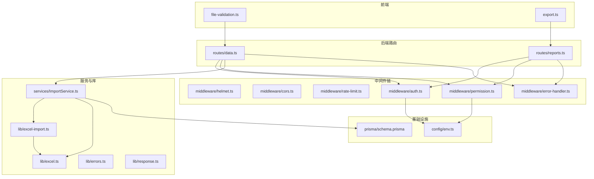
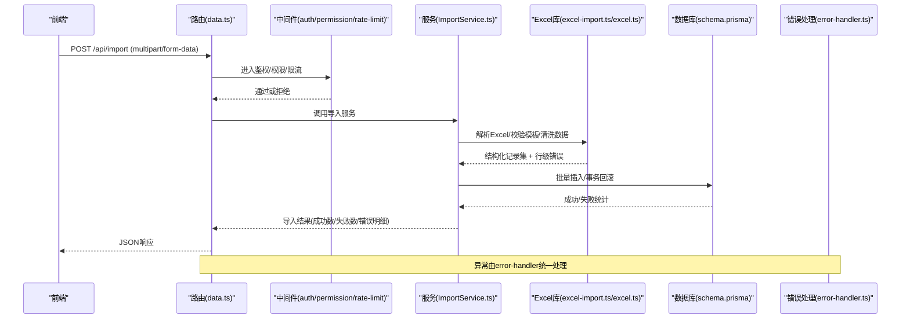
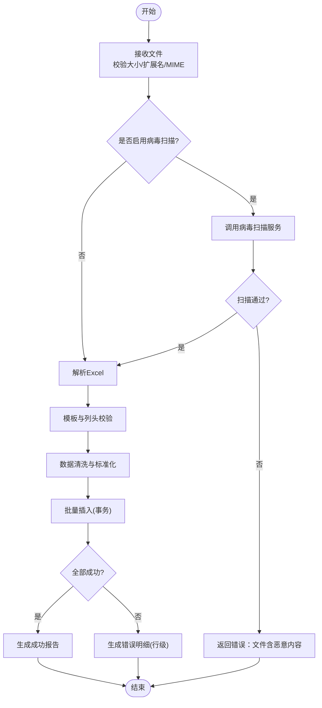
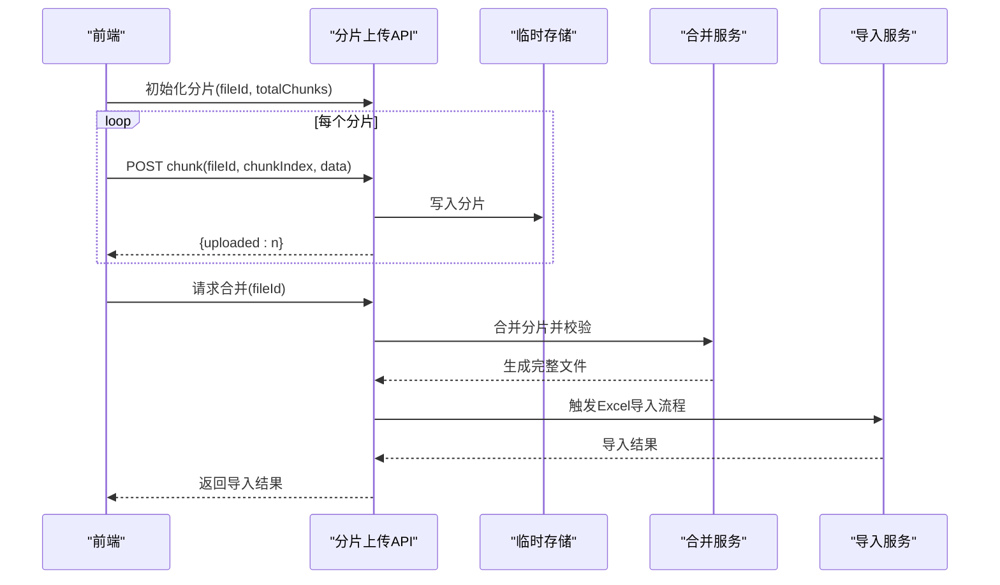
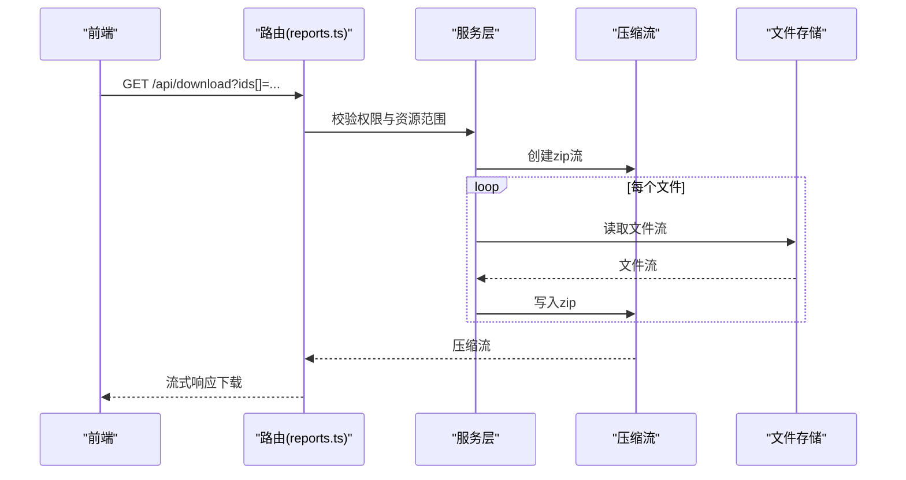
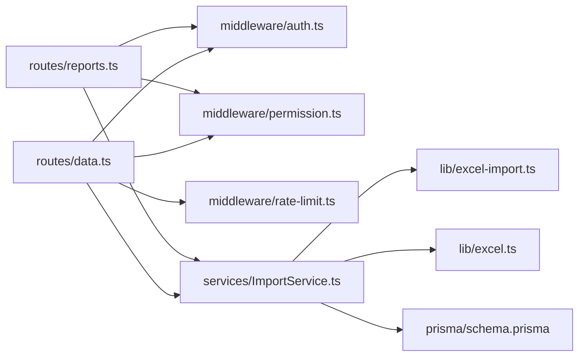

# 文件上传下载接口

<cite>
**本文引用的文件**   
- [server/src/app.ts](file://server/src/app.ts)
- [server/src/server.ts](file://server/src/server.ts)
- [server/src/middleware/auth.ts](file://server/src/middleware/auth.ts)
- [server/src/middleware/permission.ts](file://server/src/middleware/permission.ts)
- [server/src/middleware/rate-limit.ts](file://server/src/middleware/rate-limit.ts)
- [server/src/middleware/helmet.ts](file://server/src/middleware/helmet.ts)
- [server/src/middleware/cors.ts](file://server/src/middleware/cors.ts)
- [server/src/middleware/error-handler.ts](file://server/src/middleware/error-handler.ts)
- [server/src/lib/excel-import.ts](file://server/src/lib/excel-import.ts)
- [server/src/lib/excel.ts](file://server/src/lib/excel.ts)
- [server/src/lib/errors.ts](file://server/src/lib/errors.ts)
- [server/src/lib/response.ts](file://server/src/lib/response.ts)
- [server/src/services/ImportService.ts](file://server/src/services/ImportService.ts)
- [server/src/routes/data.ts](file://server/src/routes/data.ts)
- [server/src/routes/reports.ts](file://server/src/routes/reports.ts)
- [server/src/config/env.ts](file://server/src/config/env.ts)
- [server/prisma/schema.prisma](file://server/prisma/schema.prisma)
- [web/src/lib/file-validation.ts](file://web/src/lib/file-validation.ts)
- [web/src/lib/export.ts](file://web/src/lib/export.ts)
</cite>

## 目录
1. [简介](#简介)
2. [项目结构](#项目结构)
3. [核心组件](#核心组件)
4. [架构总览](#架构总览)
5. [详细组件分析](#详细组件分析)
6. [依赖关系分析](#依赖关系分析)
7. [性能考虑](#性能考虑)
8. [故障排查指南](#故障排查指南)
9. [结论](#结论)
10. [附录](#附录)

## 简介
本文件面向FY200项目的“Excel导入”与“文件下载”能力，提供从前端到后端的端到端说明。重点覆盖：
- Excel导入流程：文件上传 → 格式验证 → 数据清洗 → 批量插入 → 错误报告
- 文件大小限制、MIME类型检查、病毒扫描集成方案
- 分片上传、断点续传与进度跟踪的实现建议
- 文件下载：大文件流式传输、压缩打包与多文件下载
- 存储策略（本地文件系统、云存储）与访问控制机制
- 安全与性能优化要点

本项目为浙江壹品慧财年经营数据分析平台，定位“Excel进、看板/报表出”，单位统一为万元/人民币。后端技术栈为Express 4 + Prisma 5 + PostgreSQL 15 + JWT（access 15min + refresh 7day轮转）。中间件执行链顺序：helmet → cors → express.json → rate-limit → auth(JWT+黑名单) → permission(默认拒绝) → scope(Prisma extension) → softDelete → audit → Service → Prisma → PostgreSQL。

## 项目结构
围绕文件上传下载的代码主要分布在以下位置：
- 路由层：data.ts、reports.ts
- 服务层：ImportService.ts
- Excel处理库：excel-import.ts、excel.ts
- 通用中间件：auth.ts、permission.ts、rate-limit.ts、helmet.ts、cors.ts、error-handler.ts
- 配置与环境：env.ts
- 数据库模型：schema.prisma
- 前端校验与导出：file-validation.ts、export.ts

图表来源 
- [server/src/routes/data.ts](file://server/src/routes/data.ts)
- [server/src/routes/reports.ts](file://server/src/routes/reports.ts)
- [server/src/middleware/auth.ts](file://server/src/middleware/auth.ts)
- [server/src/middleware/permission.ts](file://server/src/middleware/permission.ts)
- [server/src/middleware/rate-limit.ts](file://server/src/middleware/rate-limit.ts)
- [server/src/middleware/helmet.ts](file://server/src/middleware/helmet.ts)
- [server/src/middleware/cors.ts](file://server/src/middleware/cors.ts)
- [server/src/middleware/error-handler.ts](file://server/src/middleware/error-handler.ts)
- [server/src/services/ImportService.ts](file://server/src/services/ImportService.ts)
- [server/src/lib/excel-import.ts](file://server/src/lib/excel-import.ts)
- [server/src/lib/excel.ts](file://server/src/lib/excel.ts)
- [server/src/lib/errors.ts](file://server/src/lib/errors.ts)
- [server/src/lib/response.ts](file://server/src/lib/response.ts)
- [server/prisma/schema.prisma](file://server/prisma/schema.prisma)
- [server/src/config/env.ts](file://server/src/config/env.ts)
- [web/src/lib/file-validation.ts](file://web/src/lib/file-validation.ts)
- [web/src/lib/export.ts](file://web/src/lib/export.ts)

章节来源
- [server/src/app.ts](file://server/src/app.ts)
- [server/src/server.ts](file://server/src/server.ts)

## 核心组件
- 路由层
  - data.ts：负责文件上传入口、参数校验、调用ImportService并返回结果
  - reports.ts：负责文件下载入口、流式响应、打包与权限控制
- 服务层
  - ImportService.ts：编排导入流程（解析、清洗、校验、批量写入、错误汇总）
- Excel处理库
  - excel-import.ts：Excel模板匹配、列映射、字段校验、行级错误收集
  - excel.ts：通用Excel读写工具（工作表遍历、单元格类型转换等）
- 中间件
  - auth.ts：JWT鉴权与黑名单校验
  - permission.ts：基于角色的细粒度权限控制（默认拒绝）
  - rate-limit.ts：请求速率限制
  - helmet.ts/cors.ts：安全头与跨域
  - error-handler.ts：统一异常捕获与错误响应
- 配置与环境
  - env.ts：读取环境变量（如最大文件大小、存储路径、云存储配置等）
- 数据库
  - schema.prisma：定义指标、公式规则、审计日志等实体，支撑导入数据的持久化

章节来源
- [server/src/routes/data.ts](file://server/src/routes/data.ts)
- [server/src/routes/reports.ts](file://server/src/routes/reports.ts)
- [server/src/services/ImportService.ts](file://server/src/services/ImportService.ts)
- [server/src/lib/excel-import.ts](file://server/src/lib/excel-import.ts)
- [server/src/lib/excel.ts](file://server/src/lib/excel.ts)
- [server/src/middleware/auth.ts](file://server/src/middleware/auth.ts)
- [server/src/middleware/permission.ts](file://server/src/middleware/permission.ts)
- [server/src/middleware/rate-limit.ts](file://server/src/middleware/rate-limit.ts)
- [server/src/middleware/helmet.ts](file://server/src/middleware/helmet.ts)
- [server/src/middleware/cors.ts](file://server/src/middleware/cors.ts)
- [server/src/middleware/error-handler.ts](file://server/src/middleware/error-handler.ts)
- [server/src/config/env.ts](file://server/src/config/env.ts)
- [server/prisma/schema.prisma](file://server/prisma/schema.prisma)

## 架构总览
下图展示一次Excel导入的完整调用链与关键组件交互。

图表来源 
- [server/src/routes/data.ts](file://server/src/routes/data.ts)
- [server/src/middleware/auth.ts](file://server/src/middleware/auth.ts)
- [server/src/middleware/permission.ts](file://server/src/middleware/permission.ts)
- [server/src/middleware/rate-limit.ts](file://server/src/middleware/rate-limit.ts)
- [server/src/services/ImportService.ts](file://server/src/services/ImportService.ts)
- [server/src/lib/excel-import.ts](file://server/src/lib/excel-import.ts)
- [server/src/lib/excel.ts](file://server/src/lib/excel.ts)
- [server/prisma/schema.prisma](file://server/prisma/schema.prisma)
- [server/src/middleware/error-handler.ts](file://server/src/middleware/error-handler.ts)

## 详细组件分析

### Excel导入流程（上传→验证→清洗→批量插入→错误报告）
- 文件上传
  - 使用multipart/form-data接收文件，服务端先进行基础校验（大小、扩展名、MIME类型）
  - 可选：接入病毒扫描（例如ClamAV），在扫描完成前挂起后续处理
- 格式验证
  - excel-import.ts根据模板校验工作表名称、列头、必填项、数据类型
  - 对数值型字段进行单位换算（统一为万元）、日期格式标准化、枚举值归一化
- 数据清洗
  - 去重、空值填充、非法字符清理、敏感信息脱敏（金额区间化、公司名动态映射）
  - 计算类指标不直接落库，由后端实时计算（同比/环比）
- 批量插入
  - 使用Prisma的事务批量写入，按批次提交，失败回滚并记录错误明细
- 错误报告
  - 返回成功/失败计数及行级错误列表（行号、列名、错误原因），便于前端高亮展示

图表来源 
- [server/src/lib/excel-import.ts](file://server/src/lib/excel-import.ts)
- [server/src/lib/excel.ts](file://server/src/lib/excel.ts)
- [server/src/services/ImportService.ts](file://server/src/services/ImportService.ts)

章节来源
- [server/src/lib/excel-import.ts](file://server/src/lib/excel-import.ts)
- [server/src/lib/excel.ts](file://server/src/lib/excel.ts)
- [server/src/services/ImportService.ts](file://server/src/services/ImportService.ts)

### 文件大小限制、MIME类型检查与病毒扫描集成
- 文件大小限制
  - 通过环境变量配置最大上传大小，并在路由层拦截过大请求
- MIME类型检查
  - 仅允许xlsx/xls/csv等受信任类型，结合扩展名与Content-Type双重校验
- 病毒扫描集成
  - 在解析前异步调用外部扫描服务；支持回调或轮询状态
  - 扫描失败或超时则拒绝导入并提示重试

章节来源
- [server/src/config/env.ts](file://server/src/config/env.ts)
- [server/src/routes/data.ts](file://server/src/routes/data.ts)

### 分片上传、断点续传与进度跟踪（实现方案）
- 分片上传
  - 前端将文件切分为固定大小的块，逐块POST至服务器，携带chunkIndex、totalChunks、fileId
  - 服务端按fileId聚合分片，落盘临时目录，支持并发写入
- 断点续传
  - 查询已存在分片集合，跳过重复上传；合并时校验MD5/CRC确保完整性
- 进度跟踪
  - 服务端维护fileId对应的进度状态（已上传分片数/总大小/合并状态）
  - 前端定时GET进度接口，渲染进度条
- 合并与校验
  - 所有分片到达后触发合并，生成最终文件，再进行Excel解析与导入流程

[此图为概念性流程图，未直接映射具体源码文件]

### 文件下载接口（大文件流式传输、压缩打包、多文件下载）
- 大文件流式传输
  - 使用Readable Stream边读边写，避免内存峰值过高
  - 设置合适的Content-Type与Content-Disposition，支持Range断点续传
- 压缩打包
  - 多文件下载时，服务端动态创建zip流，边生成边输出，降低磁盘占用
- 权限控制
  - 下载前校验用户角色与资源范围（scope），默认拒绝无权限访问

图表来源 
- [server/src/routes/reports.ts](file://server/src/routes/reports.ts)

章节来源
- [server/src/routes/reports.ts](file://server/src/routes/reports.ts)

### 文件存储策略与访问控制
- 存储策略
  - 本地文件系统：适用于小规模与内网环境，注意磁盘配额与备份策略
  - 云存储：对象存储（如OSS/S3）配合CDN加速，适合大规模与跨区域访问
- 访问控制
  - 鉴权：JWT access token短期有效，refresh token定期轮换
  - 授权：permission中间件默认拒绝，需显式授予操作权限
  - 范围：scope扩展限制数据可见范围（如公司/部门维度）

章节来源
- [server/src/middleware/auth.ts](file://server/src/middleware/auth.ts)
- [server/src/middleware/permission.ts](file://server/src/middleware/permission.ts)
- [server/src/config/env.ts](file://server/src/config/env.ts)

### 安全考虑
- 输入校验与白名单：严格校验MIME类型、扩展名、字段类型与取值范围
- 脱敏与隐私：金额区间化、公司名动态映射，避免泄露敏感信息
- 安全头与跨域：helmet加固响应头，cors限定可信域名
- 速率限制：防止滥用与暴力破解
- 审计与追踪：audit中间件记录关键操作，trace-id贯穿请求链路

章节来源
- [server/src/middleware/helmet.ts](file://server/src/middleware/helmet.ts)
- [server/src/middleware/cors.ts](file://server/src/middleware/cors.ts)
- [server/src/middleware/rate-limit.ts](file://server/src/middleware/rate-limit.ts)
- [server/src/middleware/auth.ts](file://server/src/middleware/auth.ts)
- [server/src/middleware/permission.ts](file://server/src/middleware/permission.ts)

### 性能优化技巧
- 流式处理：上传/下载均使用Stream，减少内存占用
- 批量写入：导入时使用事务分批提交，降低锁竞争
- 缓存热点：模板元数据、字典表可缓存提升解析速度
- 异步任务：大文件解析与病毒扫描采用队列异步执行，避免阻塞主线程
- 连接池与索引：合理配置Prisma连接池，针对高频查询建立索引

章节来源
- [server/src/services/ImportService.ts](file://server/src/services/ImportService.ts)
- [server/src/lib/excel-import.ts](file://server/src/lib/excel-import.ts)
- [server/src/lib/excel.ts](file://server/src/lib/excel.ts)

## 依赖关系分析
- 路由依赖中间件与服务层
- 服务层依赖Excel处理库与数据库模型
- 中间件之间按固定顺序执行，形成统一的请求处理管线

图表来源 
- [server/src/routes/data.ts](file://server/src/routes/data.ts)
- [server/src/routes/reports.ts](file://server/src/routes/reports.ts)
- [server/src/middleware/auth.ts](file://server/src/middleware/auth.ts)
- [server/src/middleware/permission.ts](file://server/src/middleware/permission.ts)
- [server/src/middleware/rate-limit.ts](file://server/src/middleware/rate-limit.ts)
- [server/src/services/ImportService.ts](file://server/src/services/ImportService.ts)
- [server/src/lib/excel-import.ts](file://server/src/lib/excel-import.ts)
- [server/src/lib/excel.ts](file://server/src/lib/excel.ts)
- [server/prisma/schema.prisma](file://server/prisma/schema.prisma)

章节来源
- [server/src/routes/data.ts](file://server/src/routes/data.ts)
- [server/src/routes/reports.ts](file://server/src/routes/reports.ts)
- [server/src/services/ImportService.ts](file://server/src/services/ImportService.ts)

## 性能考虑
- 上传阶段
  - 限制单次文件大小，避免OOM
  - 分片并发上传，合理设置并发度与重试策略
- 解析阶段
  - 流式读取Excel，避免一次性加载全量数据
  - 预编译模板与列映射，减少重复计算
- 写入阶段
  - 使用事务与批量插入，降低IO次数
  - 失败快速回滚，避免脏数据
- 下载阶段
  - 流式压缩输出，避免中间文件落盘
  - 支持Range请求，提升用户体验

[本节为通用指导，无需特定文件引用]

## 故障排查指南
- 常见错误
  - 文件格式不支持：检查扩展名与MIME类型
  - 模板不匹配：核对工作表名称与列头
  - 数据校验失败：查看行级错误明细，修正数据后重试
  - 权限不足：确认用户角色与资源范围
- 诊断步骤
  - 查看error-handler输出的错误码与消息
  - 检查rate-limit是否触发限流
  - 确认JWT是否过期或被拉黑
  - 查看导入服务的日志与事务回滚信息

章节来源
- [server/src/middleware/error-handler.ts](file://server/src/middleware/error-handler.ts)
- [server/src/middleware/rate-limit.ts](file://server/src/middleware/rate-limit.ts)
- [server/src/middleware/auth.ts](file://server/src/middleware/auth.ts)
- [server/src/services/ImportService.ts](file://server/src/services/ImportService.ts)

## 结论
本文件上传下载接口围绕“Excel进、看板/报表出”的核心目标，构建了从前端校验到后端解析、清洗、批量写入与错误报告的完整链路。通过严格的鉴权与权限控制、安全的中间件链、流式处理与批量写入，兼顾了安全性与性能。未来可进一步引入异步任务队列、更完善的病毒扫描与云存储集成，以支撑更大规模的数据导入与下载场景。

## 附录
- 前端文件校验与导出参考
  - file-validation.ts：客户端侧的文件类型、大小与格式校验
  - export.ts：前端导出逻辑与下载行为

章节来源
- [web/src/lib/file-validation.ts](file://web/src/lib/file-validation.ts)
- [web/src/lib/export.ts](file://web/src/lib/export.ts)