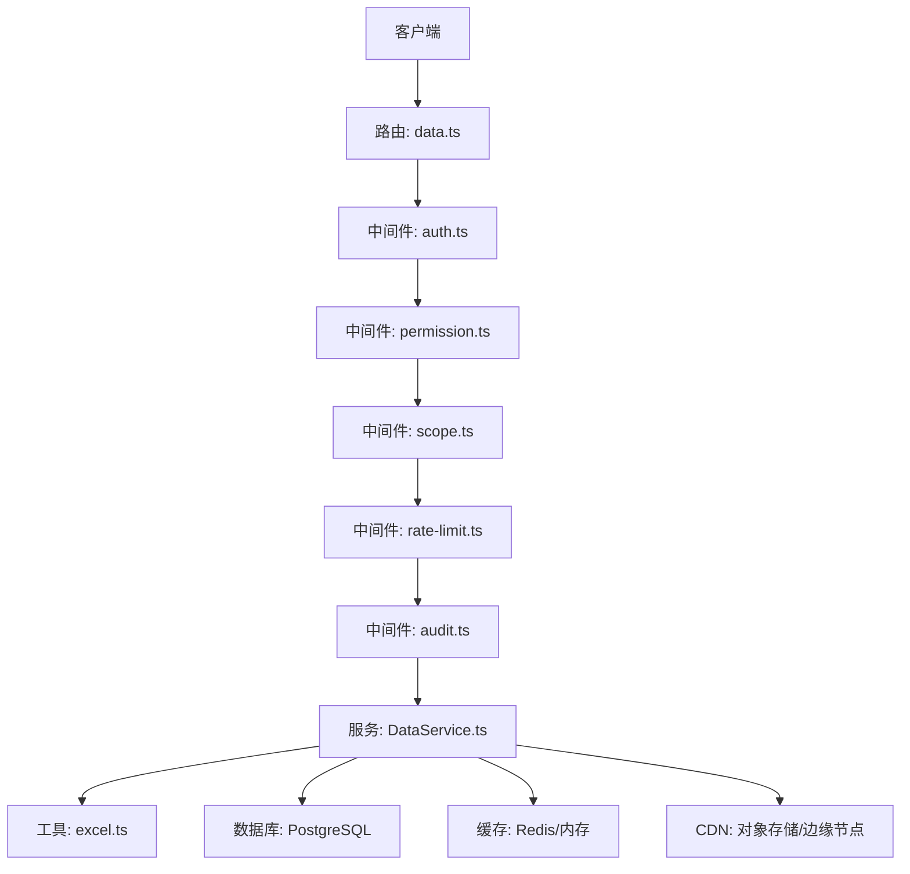
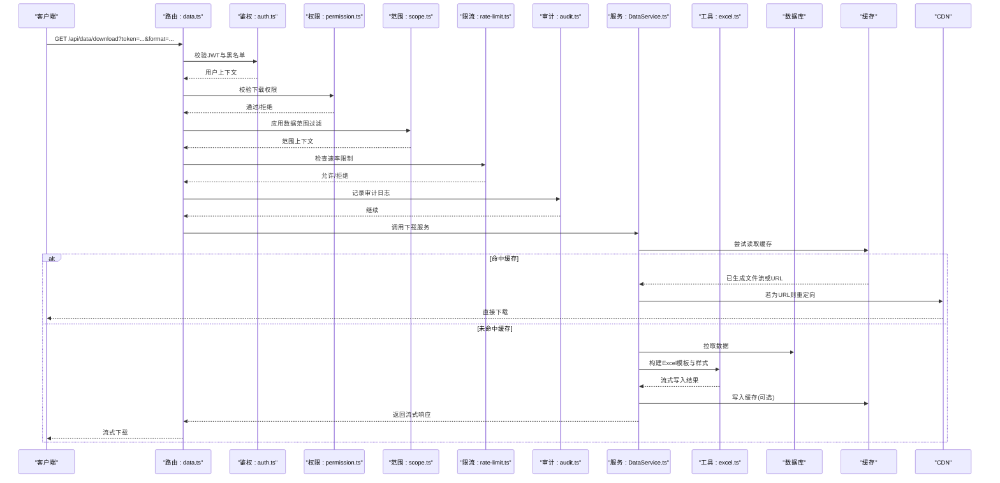
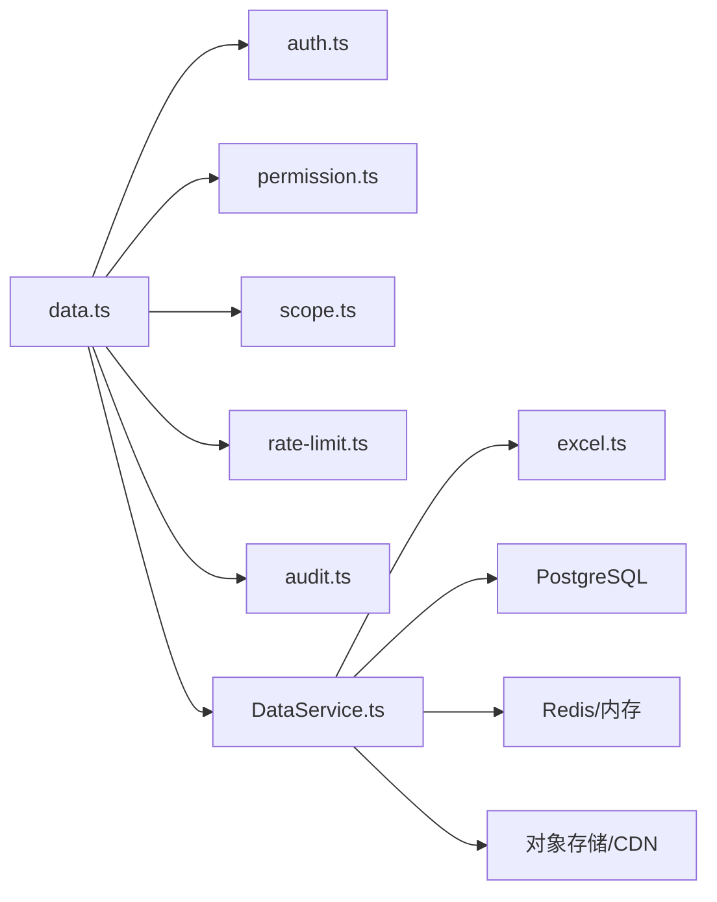

# 文件下载API接口

<cite>
**本文档引用的文件**   
- [server/src/routes/data.ts](file://server/src/routes/data.ts)
- [server/src/services/DataService.ts](file://server/src/services/DataService.ts)
- [server/src/lib/excel.ts](file://server/src/lib/excel.ts)
- [server/src/middleware/auth.ts](file://server/src/middleware/auth.ts)
- [server/src/middleware/permission.ts](file://server/src/middleware/permission.ts)
- [server/src/middleware/scope.ts](file://server/src/middleware/scope.ts)
- [server/src/middleware/rate-limit.ts](file://server/src/middleware/rate-limit.ts)
- [server/src/middleware/audit.ts](file://server/src/middleware/audit.ts)
- [server/src/config/env.ts](file://server/src/config/env.ts)
- [server/src/lib/errors.ts](file://server/src/lib/errors.ts)
- [server/src/lib/response.ts](file://server/src/lib/response.ts)
- [web/src/lib/export.ts](file://web/src/lib/export.ts)
- [web/src/lib/api.ts](file://web/src/lib/api.ts)
</cite>

## 目录
1. [简介](#简介)
2. [项目结构](#项目结构)
3. [核心组件](#核心组件)
4. [架构总览](#架构总览)
5. [详细组件分析](#详细组件分析)
6. [依赖关系分析](#依赖关系分析)
7. [性能考虑](#性能考虑)
8. [故障排查指南](#故障排查指南)
9. [结论](#结论)
10. [附录](#附录)

## 简介
本文件为FY200项目的“文件下载API接口”技术文档，聚焦GET /api/data/download接口的实现与优化。内容涵盖：
- 文件查找、权限验证、格式转换、流式传输
- 大文件下载优化：分块传输、压缩打包、断点续传支持
- 文件缓存机制、CDN集成与带宽控制
- 导出功能：Excel模板生成、动态数据填充、样式定制
- 下载链接生成、有效期控制与访问审计
- 错误处理、超时处理与资源清理策略

本项目为浙江壹品慧财年经营数据分析平台，定位“Excel进、看板/报表出”的内部管理口径财务数据平台，单位统一为万元/人民币。后端技术栈：Express 4 + Prisma 5 + PostgreSQL 15 + JWT（access 15min + refresh 7day 轮转）+ DeepSeek API（SSE 流式）。中间件执行链顺序：helmet → cors → express.json → rate-limit → auth(JWT+黑名单) → permission(默认拒绝) → scope(Prisma extension) → softDelete → audit → Service → Prisma → PostgreSQL。

## 项目结构
围绕文件下载能力，后端主要涉及路由、服务层、工具库与中间件；前端提供导出与下载辅助逻辑。关键路径如下：
- 路由层：定义 /api/data/download 的HTTP入口
- 服务层：负责业务校验、数据聚合、模板渲染与流式输出
- 工具库：Excel生成、响应封装、错误定义等
- 中间件：鉴权、权限、范围、限流、审计等
- 前端：导出模板、请求封装、下载行为

图表来源
- [server/src/routes/data.ts](file://server/src/routes/data.ts)
- [server/src/middleware/auth.ts](file://server/src/middleware/auth.ts)
- [server/src/middleware/permission.ts](file://server/src/middleware/permission.ts)
- [server/src/middleware/scope.ts](file://server/src/middleware/scope.ts)
- [server/src/middleware/rate-limit.ts](file://server/src/middleware/rate-limit.ts)
- [server/src/middleware/audit.ts](file://server/src/middleware/audit.ts)
- [server/src/services/DataService.ts](file://server/src/services/DataService.ts)
- [server/src/lib/excel.ts](file://server/src/lib/excel.ts)

章节来源
- [server/src/routes/data.ts](file://server/src/routes/data.ts)
- [server/src/services/DataService.ts](file://server/src/services/DataService.ts)
- [server/src/lib/excel.ts](file://server/src/lib/excel.ts)
- [server/src/middleware/auth.ts](file://server/src/middleware/auth.ts)
- [server/src/middleware/permission.ts](file://server/src/middleware/permission.ts)
- [server/src/middleware/scope.ts](file://server/src/middleware/scope.ts)
- [server/src/middleware/rate-limit.ts](file://server/src/middleware/rate-limit.ts)
- [server/src/middleware/audit.ts](file://server/src/middleware/audit.ts)

## 核心组件
- 路由层：解析查询参数、校验输入、调用服务并返回流式响应
- 服务层：权限与范围校验、数据聚合、模板选择、Excel构建、流式输出
- 工具库：Excel模板与样式、单元格格式化、流式写入
- 中间件：鉴权、权限、范围、限流、审计、错误处理
- 配置与环境：下载开关、缓存策略、CDN域名、速率限制、超时阈值

章节来源
- [server/src/routes/data.ts](file://server/src/routes/data.ts)
- [server/src/services/DataService.ts](file://server/src/services/DataService.ts)
- [server/src/lib/excel.ts](file://server/src/lib/excel.ts)
- [server/src/middleware/auth.ts](file://server/src/middleware/auth.ts)
- [server/src/middleware/permission.ts](file://server/src/middleware/permission.ts)
- [server/src/middleware/scope.ts](file://server/src/middleware/scope.ts)
- [server/src/middleware/rate-limit.ts](file://server/src/middleware/rate-limit.ts)
- [server/src/middleware/audit.ts](file://server/src/middleware/audit.ts)
- [server/src/config/env.ts](file://server/src/config/env.ts)

## 架构总览
下图展示从客户端发起下载请求到服务端流式输出的完整链路，包括鉴权、权限、范围、限流、审计、服务处理、Excel构建与响应发送。

图表来源
- [server/src/routes/data.ts](file://server/src/routes/data.ts)
- [server/src/middleware/auth.ts](file://server/src/middleware/auth.ts)
- [server/src/middleware/permission.ts](file://server/src/middleware/permission.ts)
- [server/src/middleware/scope.ts](file://server/src/middleware/scope.ts)
- [server/src/middleware/rate-limit.ts](file://server/src/middleware/rate-limit.ts)
- [server/src/middleware/audit.ts](file://server/src/middleware/audit.ts)
- [server/src/services/DataService.ts](file://server/src/services/DataService.ts)
- [server/src/lib/excel.ts](file://server/src/lib/excel.ts)

## 详细组件分析

### 路由层：GET /api/data/download
- 职责
  - 解析查询参数：token、format、templateId、range、filters、compress、chunkSize、resumeToken等
  - 校验必填项与枚举值
  - 将请求转发至服务层并设置合适的响应头（Content-Type、Content-Disposition、Cache-Control、ETag、Accept-Ranges等）
- 关键点
  - 支持多种格式：xlsx/csv/pdf（根据需求扩展）
  - 支持压缩：zip/gzip（对多文件打包）
  - 支持断点续传：基于Range头与ETag
  - 流式响应：避免一次性加载大文件到内存

章节来源
- [server/src/routes/data.ts](file://server/src/routes/data.ts)

### 服务层：DataService.download
- 职责
  - 权限与范围校验：结合用户角色与scope扩展进行数据可见性过滤
  - 模板选择：根据templateId或format选择模板与样式
  - 数据聚合：按维度与指标计算同比/环比（安全公式解析）
  - 构建Excel：使用excel.ts生成工作表、样式、合并单元格、条件格式
  - 流式输出：边生成边写入响应流，降低内存占用
  - 缓存策略：优先读缓存，未命中则生成后写回缓存
  - CDN集成：生成预签名URL并重定向或直接返回URL
- 关键点
  - 分块传输：按chunkSize切分写入，配合Range头实现断点续传
  - 压缩打包：当包含多个文件或超大单文件时启用zip/gzip
  - 资源清理：确保流关闭、临时文件删除、锁释放

章节来源
- [server/src/services/DataService.ts](file://server/src/services/DataService.ts)

### 工具库：excel.ts
- 职责
  - Excel模板渲染：支持固定模板与动态字段映射
  - 样式定制：字体、颜色、边框、对齐、列宽、冻结窗格
  - 单元格格式化：金额单位万元、日期、百分比、千分位
  - 流式写入：使用流式API逐步写入工作簿，避免内存峰值
- 关键点
  - 白名单算子：仅允许安全数学表达式，禁止eval
  - 脱敏规则：绝对金额→区间，公司名→动态映射
  - 可扩展：新增模板与样式只需注册配置

章节来源
- [server/src/lib/excel.ts](file://server/src/lib/excel.ts)

### 中间件链：auth → permission → scope → rate-limit → audit
- 鉴权(auth.ts)
  - 校验JWT有效性、黑名单、过期时间
  - 注入用户上下文到请求对象
- 权限(permission.ts)
  - 默认拒绝模式，显式授权下载操作
  - 支持细粒度资源级权限（如templateId）
- 范围(scope.ts)
  - 基于Prisma扩展注入数据范围过滤条件
  - 防止越权访问其他组织/部门数据
- 限流(rate-limit.ts)
  - 按IP/用户维度限制下载频率
  - 支持滑动窗口与令牌桶算法
- 审计(audit.ts)
  - 记录下载请求、用户、资源、耗时、状态码
  - 支持异步落库与采样上报

章节来源
- [server/src/middleware/auth.ts](file://server/src/middleware/auth.ts)
- [server/src/middleware/permission.ts](file://server/src/middleware/permission.ts)
- [server/src/middleware/scope.ts](file://server/src/middleware/scope.ts)
- [server/src/middleware/rate-limit.ts](file://server/src/middleware/rate-limit.ts)
- [server/src/middleware/audit.ts](file://server/src/middleware/audit.ts)

### 前端导出：export.ts 与 api.ts
- 职责
  - 构造下载请求URL与参数
  - 处理流式响应与进度显示
  - 支持断点续传与重试
  - 封装通用API调用与错误处理
- 关键点
  - 使用Fetch或XMLHttpRequest处理二进制流
  - 支持Blob下载与文件名提取
  - 错误提示与降级策略（如不支持流式时回退到普通下载）

章节来源
- [web/src/lib/export.ts](file://web/src/lib/export.ts)
- [web/src/lib/api.ts](file://web/src/lib/api.ts)

## 依赖关系分析
- 路由依赖中间件链与服务层
- 服务层依赖工具库、数据库、缓存、CDN
- 中间件之间按顺序耦合，形成强约束的执行链
- 前端依赖后端API契约与错误码规范

图表来源
- [server/src/routes/data.ts](file://server/src/routes/data.ts)
- [server/src/middleware/auth.ts](file://server/src/middleware/auth.ts)
- [server/src/middleware/permission.ts](file://server/src/middleware/permission.ts)
- [server/src/middleware/scope.ts](file://server/src/middleware/scope.ts)
- [server/src/middleware/rate-limit.ts](file://server/src/middleware/rate-limit.ts)
- [server/src/middleware/audit.ts](file://server/src/middleware/audit.ts)
- [server/src/services/DataService.ts](file://server/src/services/DataService.ts)
- [server/src/lib/excel.ts](file://server/src/lib/excel.ts)

章节来源
- [server/src/routes/data.ts](file://server/src/routes/data.ts)
- [server/src/services/DataService.ts](file://server/src/services/DataService.ts)
- [server/src/lib/excel.ts](file://server/src/lib/excel.ts)

## 性能考虑
- 分块传输
  - 基于Range头实现字节范围请求，服务端按chunkSize分段返回
  - 客户端支持断点续传，提升网络不稳定场景下的可靠性
- 压缩打包
  - 对多文件导出使用zip压缩，减少带宽占用
  - 对超大单文件启用gzip，权衡CPU与带宽
- 缓存机制
  - 首次生成后写入缓存（内存/Redis），后续请求直接命中
  - 缓存键包含用户、模板、过滤条件、时间范围等维度
  - 支持TTL与失效策略（如数据变更时主动失效）
- CDN集成
  - 生成预签名URL，客户端直接从CDN下载
  - 利用CDN边缘缓存加速全球访问
- 带宽控制
  - 服务端限流与客户端限速结合
  - 支持并发连接数限制，避免单个用户占满带宽

[本节为通用性能指导，不直接分析具体文件]

## 故障排查指南
- 常见错误
  - 401 未授权：JWT无效或已过期，检查token刷新流程
  - 403 无权限：缺少下载权限或模板ID无权访问
  - 404 文件不存在：模板或数据源缺失，检查配置与数据完整性
  - 429 限流触发：短时间内频繁下载，等待冷却或申请更高配额
  - 500 服务器错误：查看审计日志与错误堆栈
- 调试建议
  - 开启详细日志，记录请求参数、用户上下文、耗时
  - 使用curl或浏览器开发者工具检查响应头与流式数据
  - 检查缓存命中率与CDN状态码
- 资源清理
  - 确保流关闭、临时文件删除、锁释放
  - 监控内存与文件句柄使用，避免泄漏

章节来源
- [server/src/lib/errors.ts](file://server/src/lib/errors.ts)
- [server/src/lib/response.ts](file://server/src/lib/response.ts)
- [server/src/middleware/audit.ts](file://server/src/middleware/audit.ts)

## 结论
GET /api/data/download接口通过严谨的中间件链保障安全与合规，结合服务层的灵活模板与流式输出实现高效的大文件下载。通过分块传输、压缩打包、缓存与CDN集成，显著提升用户体验与系统性能。完善的错误处理、审计与资源清理策略确保系统的稳定性与可维护性。

[本节为总结性内容，不直接分析具体文件]

## 附录
- 下载链接生成
  - 支持短期有效链接（如15分钟），防止链接泄露滥用
  - 链接包含签名与过期时间，服务端验证后放行
- 访问审计
  - 记录下载者、时间、资源、大小、耗时、状态
  - 支持导出审计报表用于合规审查
- 最佳实践
  - 合理设置chunkSize与超时阈值
  - 使用CDN缓存静态模板与常用导出
  - 定期清理过期缓存与临时文件

[本节为补充信息，不直接分析具体文件]