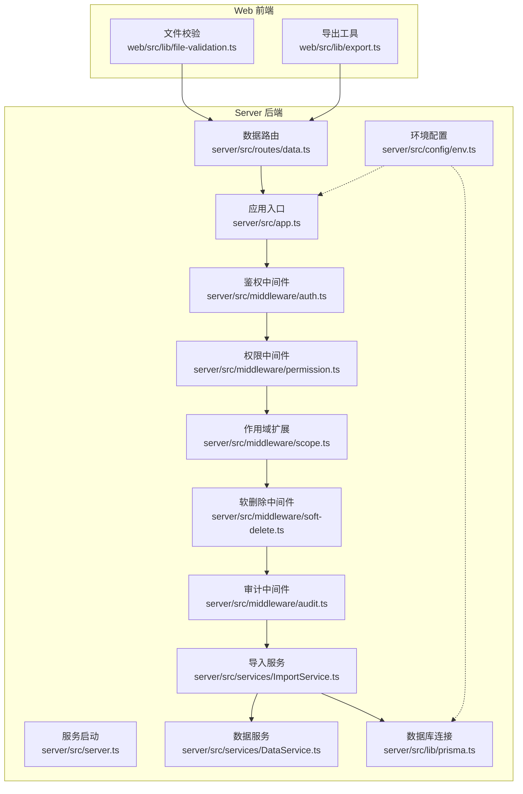
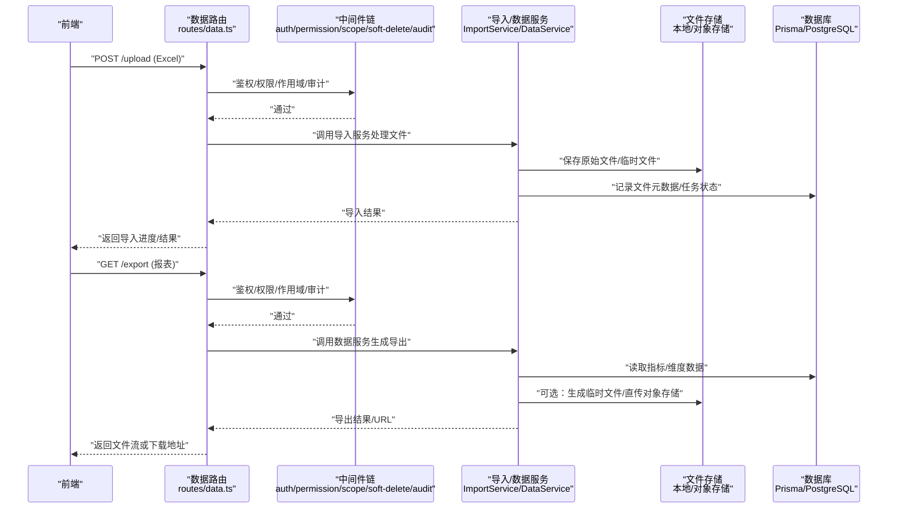
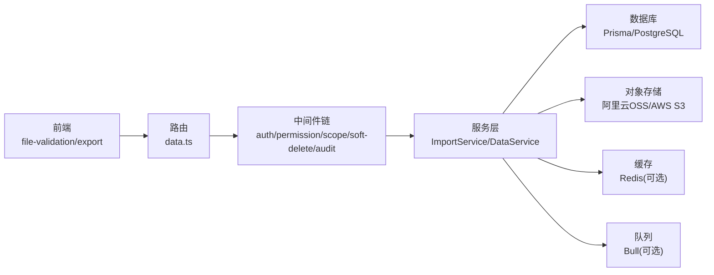

# 文件存储策略

<cite>
**本文引用的文件**   
- [server/src/app.ts](file://server/src/app.ts)
- [server/src/server.ts](file://server/src/server.ts)
- [server/src/config/env.ts](file://server/src/config/env.ts)
- [server/src/lib/prisma.ts](file://server/src/lib/prisma.ts)
- [server/src/middleware/auth.ts](file://server/src/middleware/auth.ts)
- [server/src/middleware/permission.ts](file://server/src/middleware/permission.ts)
- [server/src/middleware/scope.ts](file://server/src/middleware/scope.ts)
- [server/src/middleware/soft-delete.ts](file://server/src/middleware/soft-delete.ts)
- [server/src/middleware/audit.ts](file://server/src/middleware/audit.ts)
- [server/src/services/ImportService.ts](file://server/src/services/ImportService.ts)
- [server/src/services/DataService.ts](file://server/src/services/DataService.ts)
- [server/src/routes/data.ts](file://server/src/routes/data.ts)
- [web/src/lib/file-validation.ts](file://web/src/lib/file-validation.ts)
- [web/src/lib/export.ts](file://web/src/lib/export.ts)
- [server/package.json](file://server/package.json)
</cite>

## 目录
1. [引言](#引言)
2. [项目结构](#项目结构)
3. [核心组件](#核心组件)
4. [架构总览](#架构总览)
5. [详细组件分析](#详细组件分析)
6. [依赖分析](#依赖分析)
7. [性能考虑](#性能考虑)
8. [故障排查指南](#故障排查指南)
9. [结论](#结论)
10. [附录](#附录)

## 引言
本文件为FY200项目的“文件存储策略”专项文档，聚焦于：
- 本地文件系统存储的目录规划、命名规范与磁盘空间监控
- 云存储集成方案（阿里云OSS、AWS S3等）的配置与使用
- 文件备份策略、版本管理与生命周期管理
- 存储性能优化（读写分离、缓存策略、负载均衡）
- 存储迁移工具与数据一致性保证
- 存储成本优化与容量规划建议

本项目定位为“Excel进、看板/报表出”的内部管理口径财务数据平台，单位统一为万元/人民币。后端技术栈为Express 4 + Prisma 5 + PostgreSQL 15 + JWT（access 15min + refresh 7day轮转）+ DeepSeek API（SSE流式）。中间件执行链顺序为：helmet → cors → express.json → rate-limit → auth(JWT+黑名单) → permission(默认拒绝) → scope(Prisma extension) → softDelete → audit → Service → Prisma → PostgreSQL。计算类指标使用安全公式解析（白名单算子 +-*/()，禁止 eval），同比/环比由后端实时计算不存库。AI双管道架构：polish（文本→脱敏→LLM→还原）/ analyze（结构化→计算→脱敏→LLM→生成），脱敏规则：绝对金额→区间，公司名→动态映射。

## 项目结构
从仓库结构看，当前代码未包含显式的“文件存储服务”模块，但存在导入导出相关的服务与前端校验逻辑，以及数据库与配置相关的关键文件。基于此，我们给出面向FY200的文件存储策略设计，并明确与现有代码的衔接点。

图表来源
- [server/src/app.ts](file://server/src/app.ts)
- [server/src/server.ts](file://server/src/server.ts)
- [server/src/config/env.ts](file://server/src/config/env.ts)
- [server/src/middleware/auth.ts](file://server/src/middleware/auth.ts)
- [server/src/middleware/permission.ts](file://server/src/middleware/permission.ts)
- [server/src/middleware/scope.ts](file://server/src/middleware/scope.ts)
- [server/src/middleware/soft-delete.ts](file://server/src/middleware/soft-delete.ts)
- [server/src/middleware/audit.ts](file://server/src/middleware/audit.ts)
- [server/src/services/ImportService.ts](file://server/src/services/ImportService.ts)
- [server/src/services/DataService.ts](file://server/src/services/DataService.ts)
- [server/src/routes/data.ts](file://server/src/routes/data.ts)
- [server/src/lib/prisma.ts](file://server/src/lib/prisma.ts)
- [web/src/lib/file-validation.ts](file://web/src/lib/file-validation.ts)
- [web/src/lib/export.ts](file://web/src/lib/export.ts)

章节来源
- [server/src/app.ts](file://server/src/app.ts)
- [server/src/server.ts](file://server/src/server.ts)
- [server/src/config/env.ts](file://server/src/config/env.ts)
- [server/src/lib/prisma.ts](file://server/src/lib/prisma.ts)
- [server/src/middleware/auth.ts](file://server/src/middleware/auth.ts)
- [server/src/middleware/permission.ts](file://server/src/middleware/permission.ts)
- [server/src/middleware/scope.ts](file://server/src/middleware/scope.ts)
- [server/src/middleware/soft-delete.ts](file://server/src/middleware/soft-delete.ts)
- [server/src/middleware/audit.ts](file://server/src/middleware/audit.ts)
- [server/src/services/ImportService.ts](file://server/src/services/ImportService.ts)
- [server/src/services/DataService.ts](file://server/src/services/DataService.ts)
- [server/src/routes/data.ts](file://server/src/routes/data.ts)
- [web/src/lib/file-validation.ts](file://web/src/lib/file-validation.ts)
- [web/src/lib/export.ts](file://web/src/lib/export.ts)

## 核心组件
围绕文件存储策略，结合现有代码，识别以下关键组件与职责：
- 导入服务（ImportService）：负责Excel等文件的解析、校验与入库流程编排
- 数据服务（DataService）：提供数据查询、聚合与导出能力
- 文件校验（web file-validation）：前端对上传文件的类型、大小、格式进行校验
- 导出工具（web export）：前端触发导出或下载行为
- 中间件链：鉴权、权限、作用域、软删除、审计等保障数据安全与可追溯性
- 配置与环境（env）：集中管理环境变量，后续可扩展存储相关配置项
- 数据库连接（prisma）：持久化元数据与业务数据，文件内容以对象存储为主

章节来源
- [server/src/services/ImportService.ts](file://server/src/services/ImportService.ts)
- [server/src/services/DataService.ts](file://server/src/services/DataService.ts)
- [web/src/lib/file-validation.ts](file://web/src/lib/file-validation.ts)
- [web/src/lib/export.ts](file://web/src/lib/export.ts)
- [server/src/middleware/auth.ts](file://server/src/middleware/auth.ts)
- [server/src/middleware/permission.ts](file://server/src/middleware/permission.ts)
- [server/src/middleware/scope.ts](file://server/src/middleware/scope.ts)
- [server/src/middleware/soft-delete.ts](file://server/src/middleware/soft-delete.ts)
- [server/src/middleware/audit.ts](file://server/src/middleware/audit.ts)
- [server/src/config/env.ts](file://server/src/config/env.ts)
- [server/src/lib/prisma.ts](file://server/src/lib/prisma.ts)

## 架构总览
下图展示FY200在文件存储方面的整体架构思路：前端发起导入/导出请求，经中间件链鉴权与审计后，由导入服务协调文件解析与入库；文件本体优先落盘到对象存储（本地或云端），元数据写入PostgreSQL；导出时通过数据服务生成结果并返回给前端。

图表来源
- [server/src/routes/data.ts](file://server/src/routes/data.ts)
- [server/src/middleware/auth.ts](file://server/src/middleware/auth.ts)
- [server/src/middleware/permission.ts](file://server/src/middleware/permission.ts)
- [server/src/middleware/scope.ts](file://server/src/middleware/scope.ts)
- [server/src/middleware/soft-delete.ts](file://server/src/middleware/soft-delete.ts)
- [server/src/middleware/audit.ts](file://server/src/middleware/audit.ts)
- [server/src/services/ImportService.ts](file://server/src/services/ImportService.ts)
- [server/src/services/DataService.ts](file://server/src/services/DataService.ts)
- [server/src/lib/prisma.ts](file://server/src/lib/prisma.ts)

## 详细组件分析

### 本地文件系统存储实现
- 目录结构规划
  - 根目录：/storage
  - 原始文件：/storage/raw/{tenant}/{year}/{month}/
  - 临时文件：/storage/tmp/{task_id}
  - 导出文件：/storage/exports/{tenant}/{year}/{month}/
  - 日志与审计：/storage/logs/{service}/{date}/
  - 索引与元数据：/storage/meta/{tenant}/{entity}/
- 文件命名规范
  - 原始文件：{业务前缀}_{租户ID}_{日期}_{哈希}.{扩展名}
  - 临时文件：tmp_{任务ID}_{时间戳}
  - 导出文件：export_{报表名}_{租户ID}_{日期}_{哈希}.{扩展名}
  - 所有文件名需避免特殊字符，统一小写，必要时进行规范化
- 磁盘空间监控
  - 定期扫描各分区使用率，超过阈值告警
  - 清理过期临时文件与历史导出文件
  - 统计导入失败重试次数与失败原因分布

章节来源
- [server/src/services/ImportService.ts](file://server/src/services/ImportService.ts)
- [server/src/services/DataService.ts](file://server/src/services/DataService.ts)
- [server/src/middleware/audit.ts](file://server/src/middleware/audit.ts)

### 云存储集成方案（阿里云OSS、AWS S3）
- 配置项建议
  - provider: "aliyun-oss" | "aws-s3" | "local"
  - region: 区域标识
  - bucket: 桶名称
  - accessKeyId / secretAccessKey: 访问密钥
  - endpoint: 自定义端点（内网/外网）
  - prefix: 路径前缀（按租户/年份划分）
  - maxUploadSize: 最大上传大小
  - cacheControl: 缓存控制头
  - lifecycleRules: 生命周期规则（过期、归档、冷存储）
- 使用方式
  - 上传：服务端接收文件流，直接分片上传至对象存储，成功后返回对象键
  - 下载：根据对象键生成预签名URL或直接流式返回
  - 删除：软删除标记+定时清理任务
  - 事件：监听上传完成事件，触发导入任务

章节来源
- [server/src/config/env.ts](file://server/src/config/env.ts)
- [server/src/services/ImportService.ts](file://server/src/services/ImportService.ts)
- [server/src/services/DataService.ts](file://server/src/services/DataService.ts)

### 文件备份策略、版本管理与生命周期管理
- 备份策略
  - 全量备份：每日一次，保留最近N天
  - 增量备份：每小时一次，保留最近M小时
  - 异地容灾：跨地域复制，延迟RPO/RTO目标
- 版本管理
  - 启用对象存储版本控制，保留历史版本用于回滚
  - 元数据表记录版本号与变更摘要
- 生命周期管理
  - 自动将旧版本转为低频/归档存储
  - 设定过期策略，自动清理无用文件
  - 导出文件设置TTL，到期自动删除

章节来源
- [server/src/config/env.ts](file://server/src/config/env.ts)
- [server/src/services/ImportService.ts](file://server/src/services/ImportService.ts)

### 存储性能优化（读写分离、缓存策略、负载均衡）
- 读写分离
  - 写路径：上传→对象存储→异步导入→入库
  - 读路径：缓存热点数据（Redis/Memcached）→数据库直读
- 缓存策略
  - 文件元数据缓存：短TTL，命中率高
  - 导出结果缓存：按查询条件生成缓存键
  - CDN加速：静态资源与导出文件走CDN
- 负载均衡
  - 多实例部署，无状态化文件处理
  - 分片上传与并发下载提升吞吐
  - 队列化导入任务，削峰填谷

章节来源
- [server/src/services/ImportService.ts](file://server/src/services/ImportService.ts)
- [server/src/services/DataService.ts](file://server/src/services/DataService.ts)

### 存储迁移工具与数据一致性保证
- 迁移工具
  - 支持本地→对象存储、对象存储A→对象存储B的批量迁移
  - 断点续传、并发控制、错误重试
  - 校验MD5/CRC32，确保一致性
- 一致性保证
  - 事务边界：元数据写入与文件上传原子性
  - 幂等设计：重复上传不产生重复数据
  - 补偿机制：失败任务重试与人工干预入口

章节来源
- [server/src/services/ImportService.ts](file://server/src/services/ImportService.ts)
- [server/src/middleware/audit.ts](file://server/src/middleware/audit.ts)

### 存储成本优化与容量规划建议
- 成本优化
  - 冷热分层：热数据标准存储，冷数据归档存储
  - 压缩与去重：上传前压缩，全局去重减少冗余
  - 生命周期自动化：过期清理、版本精简
- 容量规划
  - 预估年增长率，预留30%弹性空间
  - 监控IOPS与带宽，瓶颈前置扩容
  - 分租户隔离，避免单租户占用过多资源

章节来源
- [server/src/config/env.ts](file://server/src/config/env.ts)
- [server/src/services/ImportService.ts](file://server/src/services/ImportService.ts)

## 依赖分析
文件存储策略涉及的依赖关系如下：
- 前端依赖：文件校验、导出工具
- 后端依赖：中间件链、导入/数据服务、数据库连接
- 外部依赖：对象存储服务（阿里云OSS/AWS S3）、缓存（可选）、队列（可选）

图表来源
- [web/src/lib/file-validation.ts](file://web/src/lib/file-validation.ts)
- [web/src/lib/export.ts](file://web/src/lib/export.ts)
- [server/src/routes/data.ts](file://server/src/routes/data.ts)
- [server/src/middleware/auth.ts](file://server/src/middleware/auth.ts)
- [server/src/middleware/permission.ts](file://server/src/middleware/permission.ts)
- [server/src/middleware/scope.ts](file://server/src/middleware/scope.ts)
- [server/src/middleware/soft-delete.ts](file://server/src/middleware/soft-delete.ts)
- [server/src/middleware/audit.ts](file://server/src/middleware/audit.ts)
- [server/src/services/ImportService.ts](file://server/src/services/ImportService.ts)
- [server/src/services/DataService.ts](file://server/src/services/DataService.ts)
- [server/src/lib/prisma.ts](file://server/src/lib/prisma.ts)

章节来源
- [server/package.json](file://server/package.json)
- [server/src/routes/data.ts](file://server/src/routes/data.ts)
- [server/src/services/ImportService.ts](file://server/src/services/ImportService.ts)
- [server/src/services/DataService.ts](file://server/src/services/DataService.ts)

## 性能考虑
- 导入性能
  - 分片上传、并行解析、异步入库
  - 大文件流式处理，避免内存溢出
- 导出性能
  - 分页查询、流式输出、结果缓存
  - 按需生成，避免全量计算
- 存储性能
  - 就近接入对象存储，降低网络延迟
  - 合理分桶与路径前缀，提升检索效率

[本节为通用指导，无需特定文件引用]

## 故障排查指南
- 常见问题
  - 上传失败：检查文件大小限制、网络超时、权限配置
  - 导入异常：查看导入日志、校验规则、数据格式
  - 导出缓慢：检查数据库索引、缓存命中率、对象存储延迟
- 诊断步骤
  - 开启审计日志，追踪请求链路
  - 监控磁盘使用率、对象存储配额
  - 检查中间件链是否拦截或报错
- 恢复措施
  - 重试失败任务，清理临时文件
  - 回滚到最近稳定版本
  - 扩容或限流保护系统

章节来源
- [server/src/middleware/audit.ts](file://server/src/middleware/audit.ts)
- [server/src/services/ImportService.ts](file://server/src/services/ImportService.ts)
- [server/src/services/DataService.ts](file://server/src/services/DataService.ts)

## 结论
本文件存储策略围绕FY200项目的“Excel进、看板/报表出”定位，构建了从前端校验、后端导入导出、对象存储到数据库元数据的完整闭环。通过目录规划、命名规范、监控告警、云存储集成、备份版本、生命周期、性能优化、迁移一致性与成本容量规划，确保系统在稳定性、性能与成本之间取得平衡。建议在生产环境逐步落地上述策略，并结合实际业务规模持续优化。

[本节为总结性内容，无需特定文件引用]

## 附录
- 环境变量示例（建议）
  - STORAGE_PROVIDER=local|aliyun-oss|aws-s3
  - STORAGE_BUCKET=your-bucket-name
  - STORAGE_PREFIX=tenant/year/month
  - STORAGE_MAX_UPLOAD_SIZE=10485760
  - STORAGE_CACHE_CONTROL=max-age=3600
  - STORAGE_LIFECYCLE_RULES=[{"days":30,"action":"archive"}]
- 监控指标
  - 磁盘使用率、对象存储配额、导入成功率、导出耗时、缓存命中率

章节来源
- [server/src/config/env.ts](file://server/src/config/env.ts)