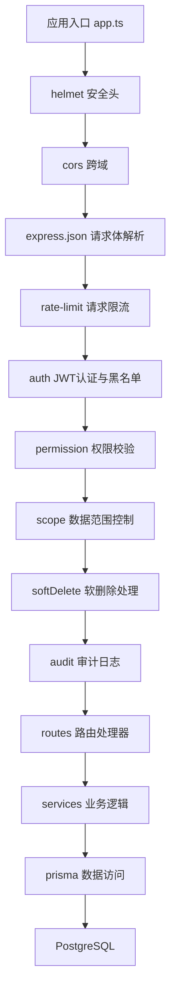
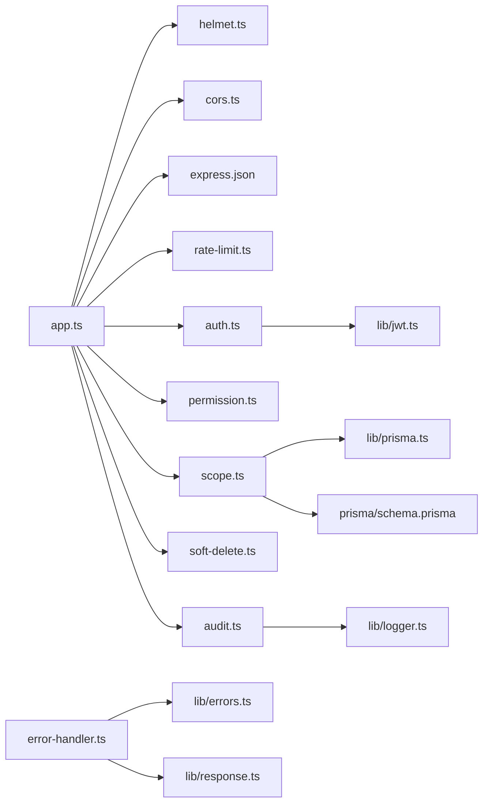

# 中间件执行链设计

<cite>
**本文引用的文件**   
- [app.ts](file://server/src/app.ts)
- [helmet.ts](file://server/src/middleware/helmet.ts)
- [cors.ts](file://server/src/middleware/cors.ts)
- [rate-limit.ts](file://server/src/middleware/rate-limit.ts)
- [auth.ts](file://server/src/middleware/auth.ts)
- [permission.ts](file://server/src/middleware/permission.ts)
- [scope.ts](file://server/src/middleware/scope.ts)
- [soft-delete.ts](file://server/src/middleware/soft-delete.ts)
- [audit.ts](file://server/src/middleware/audit.ts)
- [error-handler.ts](file://server/src/middleware/error-handler.ts)
- [trace-id.ts](file://server/src/middleware/trace-id.ts)
- [env.ts](file://server/src/config/env.ts)
- [jwt.ts](file://server/src/lib/jwt.ts)
- [logger.ts](file://server/src/lib/logger.ts)
- [errors.ts](file://server/src/lib/errors.ts)
- [response.ts](file://server/src/lib/response.ts)
- [async-handler.ts](file://server/src/lib/async-handler.ts)
- [prisma.ts](file://server/src/lib/prisma.ts)
- [schema.prisma](file://server/prisma/schema.prisma)
</cite>

## 目录
1. [简介](#简介)
2. [项目结构](#项目结构)
3. [核心组件](#核心组件)
4. [架构总览](#架构总览)
5. [详细组件分析](#详细组件分析)
6. [依赖关系分析](#依赖关系分析)
7. [性能考量](#性能考量)
8. [故障排查指南](#故障排查指南)
9. [结论](#结论)
10. [附录](#附录)

## 简介
本文件面向FY200项目的后端中间件执行链，系统化阐述从请求进入Express到业务Service的完整链路：安全头设置 → 跨域配置 → 请求体解析 → 请求限流 → JWT认证与黑名单检查 → 权限验证 → 数据范围控制 → 软删除处理 → 审计日志记录 → Service层。文档覆盖每个中间件的职责、配置项、错误处理机制与扩展点，并提供调试技巧、性能优化建议与常见问题解决方案，帮助开发者快速定位问题并安全地扩展能力。

## 项目结构
本项目采用分层组织方式：
- 应用入口与中间件装配在 server/src/app.ts
- 通用中间件位于 server/src/middleware
- 业务服务位于 server/src/services
- 数据库模型与迁移位于 server/prisma
- 配置与环境变量位于 server/src/config/env.ts
- 公共库（JWT、日志、错误、响应封装等）位于 server/src/lib



图表来源
- [app.ts](file://server/src/app.ts)
- [helmet.ts](file://server/src/middleware/helmet.ts)
- [cors.ts](file://server/src/middleware/cors.ts)
- [rate-limit.ts](file://server/src/middleware/rate-limit.ts)
- [auth.ts](file://server/src/middleware/auth.ts)
- [permission.ts](file://server/src/middleware/permission.ts)
- [scope.ts](file://server/src/middleware/scope.ts)
- [soft-delete.ts](file://server/src/middleware/soft-delete.ts)
- [audit.ts](file://server/src/middleware/audit.ts)
- [prisma.ts](file://server/src/lib/prisma.ts)
- [schema.prisma](file://server/prisma/schema.prisma)

章节来源
- [app.ts](file://server/src/app.ts)
- [env.ts](file://server/src/config/env.ts)

## 核心组件
- helmet 安全头：统一注入HTTP安全响应头，降低常见Web攻击面。
- cors 跨域：按环境白名单放行跨域请求，支持凭证与预检。
- express.json：解析JSON请求体，配合限流与鉴权前置。
- rate-limit 请求限流：基于IP或用户维度的速率限制，防止滥用。
- auth JWT认证与黑名单：校验access token有效性，检查黑名单与过期策略。
- permission 权限验证：默认拒绝模式，按资源与动作授权。
- scope 数据范围控制：通过Prisma扩展注入租户/组织维度过滤。
- softDelete 软删除处理：查询自动追加未删除条件，写入标记删除状态。
- audit 审计日志：记录关键操作上下文与结果，便于追溯。
- error-handler 全局错误处理：统一错误码、消息与日志输出。
- trace-id 链路追踪：为每次请求生成唯一ID贯穿全链路。

章节来源
- [helmet.ts](file://server/src/middleware/helmet.ts)
- [cors.ts](file://server/src/middleware/cors.ts)
- [rate-limit.ts](file://server/src/middleware/rate-limit.ts)
- [auth.ts](file://server/src/middleware/auth.ts)
- [permission.ts](file://server/src/middleware/permission.ts)
- [scope.ts](file://server/src/middleware/scope.ts)
- [soft-delete.ts](file://server/src/middleware/soft-delete.ts)
- [audit.ts](file://server/src/middleware/audit.ts)
- [error-handler.ts](file://server/src/middleware/error-handler.ts)
- [trace-id.ts](file://server/src/middleware/trace-id.ts)

## 架构总览
下图展示一次典型API请求在Express中的调用顺序与数据流向，强调中间件之间的协作与职责边界。

```mermaid
sequenceDiagram
participant Client as "客户端"
participant App as "Express应用"
participant Helmet as "helmet"
participant CORS as "cors"
JSON as "express.json"
RL as "rate-limit"
Auth as "auth(JWT+黑名单)"
Perm as "permission"
Scope as "scope(Prisma扩展)"
SD as "softDelete"
Audit as "audit"
Route as "路由处理器"
Svc as "Service层"
Prisma as "Prisma"
DB as "PostgreSQL"
Client->>App : HTTP请求
App->>Helmet : 设置安全头
Helmet-->>App : 继续
App->>CORS : 跨域校验
CORS-->>App : 继续
App->>JSON : 解析请求体
JSON-->>App : req.body可用
App->>RL : 限流检查
RL-->>App : 继续或拒绝
App->>Auth : 校验Token与黑名单
Auth-->>App : 挂载用户上下文
App->>Perm : 权限判定
Perm-->>App : 允许或拒绝
App->>Scope : 注入数据范围过滤
Scope-->>App : 扩展Prisma实例
App->>SD : 软删除条件注入
SD-->>App : 查询/写入修正
App->>Audit : 记录审计事件
Audit-->>App : 异步落盘
App->>Route : 路由处理
Route->>Svc : 业务逻辑
Svc->>Prisma : 数据访问
Prisma->>DB : SQL执行
DB-->>Prisma : 结果集
Prisma-->>Svc : 结构化数据
Svc-->>Route : 业务结果
Route-->>Client : HTTP响应
```

图表来源
- [app.ts](file://server/src/app.ts)
- [auth.ts](file://server/src/middleware/auth.ts)
- [permission.ts](file://server/src/middleware/permission.ts)
- [scope.ts](file://server/src/middleware/scope.ts)
- [soft-delete.ts](file://server/src/middleware/soft-delete.ts)
- [audit.ts](file://server/src/middleware/audit.ts)
- [prisma.ts](file://server/src/lib/prisma.ts)
- [schema.prisma](file://server/prisma/schema.prisma)

## 详细组件分析

### helmet 安全头设置
- 职责：注入安全相关的HTTP响应头，如X-Content-Type-Options、Strict-Transport-Security等。
- 配置要点：根据运行环境启用/禁用特定头部；避免在生产关闭任何安全头。
- 错误处理：通常不抛出异常；若配置非法，应在启动阶段失败。
- 扩展方法：可按需添加自定义响应头（如X-Request-ID）。

章节来源
- [helmet.ts](file://server/src/middleware/helmet.ts)

### cors 跨域配置
- 职责：依据前端域名与端口白名单放行跨域请求，支持凭证与预检。
- 配置要点：环境变量驱动白名单；严格限制Origin与Methods；生产环境禁用通配符。
- 错误处理：非法Origin直接拒绝；预检失败返回明确错误码。
- 扩展方法：动态白名单加载、按路径差异化策略。

章节来源
- [cors.ts](file://server/src/middleware/cors.ts)
- [env.ts](file://server/src/config/env.ts)

### express.json 请求体解析
- 职责：将JSON请求体解析为req.body，供后续中间件与路由使用。
- 配置要点：限制最大体积，避免大Payload攻击；开启类型校验。
- 错误处理：解析失败返回400；结合错误处理器统一格式。
- 扩展方法：可接入自定义反序列化器或字段清洗。

章节来源
- [app.ts](file://server/src/app.ts)

### rate-limit 请求限流
- 职责：对同一IP或用户进行请求频率限制，保护后端资源。
- 配置要点：窗口大小、最大请求数、键策略（IP/用户ID）、存储后端（内存/Redis）。
- 错误处理：超过阈值返回429；附带重试After-Retry头。
- 扩展方法：按路由粒度限流、动态阈值调整。

章节来源
- [rate-limit.ts](file://server/src/middleware/rate-limit.ts)
- [env.ts](file://server/src/config/env.ts)

### auth JWT认证与黑名单检查
- 职责：校验access token签名与有效期，检查黑名单，挂载用户上下文至req.user。
- 配置要点：JWT密钥、算法、过期时间；黑名单存储（内存/缓存/数据库）。
- 错误处理：无效token返回401；黑名单命中返回403；异常统一捕获。
- 扩展方法：刷新令牌轮转、多租户子域鉴权、设备指纹绑定。

章节来源
- [auth.ts](file://server/src/middleware/auth.ts)
- [jwt.ts](file://server/src/lib/jwt.ts)
- [env.ts](file://server/src/config/env.ts)

### permission 权限验证
- 职责：基于“资源-动作”模型进行授权，默认拒绝模式确保最小权限。
- 配置要点：角色/权限映射、资源白名单、接口级开关。
- 错误处理：无权限返回403；记录审计事件。
- 扩展方法：动态策略引擎、RBAC/ABAC混合。

章节来源
- [permission.ts](file://server/src/middleware/permission.ts)

### scope 数据范围控制
- 职责：通过Prisma扩展注入租户/组织维度过滤，保证数据隔离。
- 配置要点：从req.user提取scope标识；扩展查询/写入钩子。
- 错误处理：缺失scope时拒绝；记录审计事件。
- 扩展方法：多租户隔离、行级安全策略、跨域聚合视图。

章节来源
- [scope.ts](file://server/src/middleware/scope.ts)
- [prisma.ts](file://server/src/lib/prisma.ts)
- [schema.prisma](file://server/prisma/schema.prisma)

### softDelete 软删除处理
- 职责：查询自动追加未删除条件；写入时标记删除状态而非物理删除。
- 配置要点：字段名约定（如deletedAt）；是否允许管理员绕过。
- 错误处理：非法操作返回400；审计记录删除行为。
- 扩展方法：批量恢复、定时清理任务、审计回溯。

章节来源
- [soft-delete.ts](file://server/src/middleware/soft-delete.ts)

### audit 审计日志记录
- 职责：记录关键操作的上下文（用户、资源、动作、结果、耗时），用于合规与排障。
- 配置要点：敏感字段脱敏、异步写入、采样策略。
- 错误处理：写入失败降级为本地缓冲；不影响主流程。
- 扩展方法：外部审计系统对接、告警规则。

章节来源
- [audit.ts](file://server/src/middleware/audit.ts)
- [logger.ts](file://server/src/lib/logger.ts)

### error-handler 全局错误处理
- 职责：统一捕获异常，格式化响应，输出结构化日志。
- 配置要点：开发/生产不同输出；敏感信息屏蔽。
- 错误处理：区分业务错误与系统错误；返回标准错误体。
- 扩展方法：指标上报、Sentry集成。

章节来源
- [error-handler.ts](file://server/src/middleware/error-handler.ts)
- [errors.ts](file://server/src/lib/errors.ts)
- [response.ts](file://server/src/lib/response.ts)

### trace-id 链路追踪
- 职责：为每次请求生成唯一ID，贯穿中间件与日志，便于端到端追踪。
- 配置要点：ID生成策略（UUID/TraceID）；是否复用上游ID。
- 错误处理：生成失败回退默认值。
- 扩展方法：与APM系统集成、分布式追踪。

章节来源
- [trace-id.ts](file://server/src/middleware/trace-id.ts)

## 依赖关系分析
中间件之间以低耦合、高内聚为原则，通过req/res对象传递上下文，避免强引用。关键依赖如下：
- auth依赖jwt库与环境配置
- scope依赖prisma扩展与schema定义
- audit依赖logger与异步写入
- error-handler依赖errors与response标准化



图表来源
- [app.ts](file://server/src/app.ts)
- [auth.ts](file://server/src/middleware/auth.ts)
- [jwt.ts](file://server/src/lib/jwt.ts)
- [scope.ts](file://server/src/middleware/scope.ts)
- [prisma.ts](file://server/src/lib/prisma.ts)
- [schema.prisma](file://server/prisma/schema.prisma)
- [audit.ts](file://server/src/middleware/audit.ts)
- [logger.ts](file://server/src/lib/logger.ts)
- [error-handler.ts](file://server/src/middleware/error-handler.ts)
- [errors.ts](file://server/src/lib/errors.ts)
- [response.ts](file://server/src/lib/response.ts)

章节来源
- [app.ts](file://server/src/app.ts)

## 性能考量
- 中间件顺序优化：将轻量级中间件（helmet、cors、json）置于前段，减少后续开销。
- 限流策略：优先基于IP的快速判断，再对用户维度精细限流，降低计算成本。
- 异步审计：审计写入采用异步队列，避免阻塞主请求路径。
- 缓存热点：黑名单与权限策略可引入缓存层（内存/Redis）提升命中率。
- 数据库连接：合理配置Prisma连接池大小，避免连接耗尽。
- 响应压缩：在生产启用gzip/brotli压缩，减少带宽占用。
- 监控指标：暴露QPS、延迟分位、错误率等指标，辅助容量规划。

[本节为通用指导，无需代码来源]

## 故障排查指南
- 跨域失败：检查cors白名单与Origin匹配；确认预检请求是否被正确放行。
- 401未认证：核对JWT签名、算法、过期时间；检查黑名单是否误命中。
- 403无权限：确认permission策略与角色映射；检查默认拒绝模式是否生效。
- 数据范围异常：核查scope注入是否正确；确认Prisma扩展是否生效。
- 软删除异常：检查deletedAt字段约定；确认查询是否自动追加条件。
- 审计缺失：查看异步队列是否堆积；确认日志写入权限与磁盘空间。
- 限流触发：检查限流键策略与阈值；必要时扩容或调整窗口。
- 错误统一：确认error-handler是否捕获所有未处理异常；检查响应格式。

章节来源
- [cors.ts](file://server/src/middleware/cors.ts)
- [auth.ts](file://server/src/middleware/auth.ts)
- [permission.ts](file://server/src/middleware/permission.ts)
- [scope.ts](file://server/src/middleware/scope.ts)
- [soft-delete.ts](file://server/src/middleware/soft-delete.ts)
- [audit.ts](file://server/src/middleware/audit.ts)
- [rate-limit.ts](file://server/src/middleware/rate-limit.ts)
- [error-handler.ts](file://server/src/middleware/error-handler.ts)

## 结论
FY200项目的中间件执行链以清晰的分层与严格的顺序保障安全性、可观测性与可扩展性。通过默认拒绝的权限模型、数据范围控制与软删除策略，系统在合规与数据安全方面具备坚实基础。结合限流、审计与错误处理，形成完整的防护与运维闭环。建议在迭代中持续优化限流与缓存策略，完善审计与监控，确保在高并发场景下的稳定表现。

[本节为总结性内容，无需代码来源]

## 附录
- 调试技巧
  - 启用trace-id并在各中间件打印，便于端到端追踪。
  - 在开发环境开启详细日志，生产环境仅保留必要信息。
  - 使用压测工具模拟限流与高并发，观察瓶颈。
- 常见问题
  - 跨域预检失败：检查CORS方法与头配置。
  - JWT刷新失败：确认refresh token轮转逻辑与黑名单同步。
  - 权限变更未生效：检查策略缓存失效机制。
  - 软删除导致统计偏差：确认查询是否忽略已删除记录。
- 最佳实践
  - 所有中间件保持幂等与短小精悍。
  - 错误信息对外脱敏，内部记录完整上下文。
  - 配置与环境分离，敏感信息通过环境变量注入。

[本节为通用指导，无需代码来源]