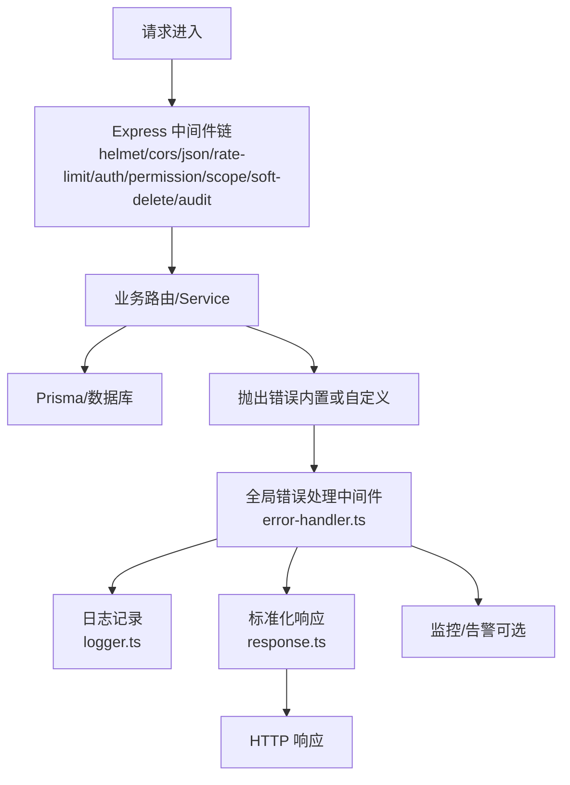
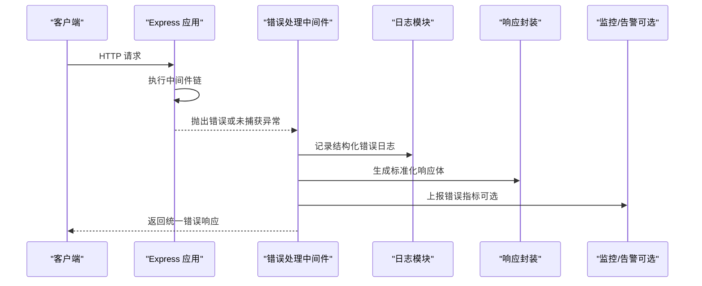
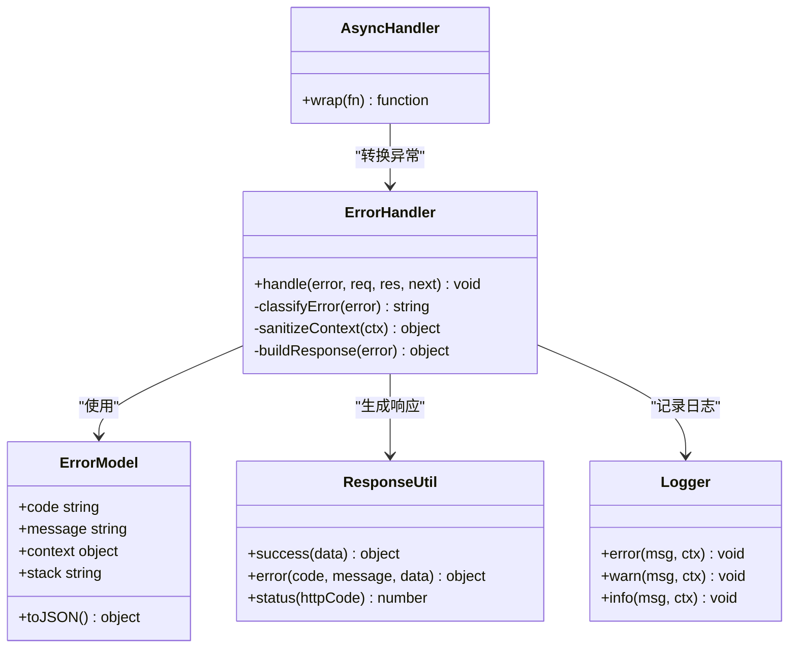

# 全局错误处理中间件

<cite>
**本文引用的文件**   
- [error-handler.ts](file://server/src/middleware/error-handler.ts)
- [errors.ts](file://server/src/lib/errors.ts)
- [response.ts](file://server/src/lib/response.ts)
- [logger.ts](file://server/src/lib/logger.ts)
- [app.ts](file://server/src/app.ts)
- [async-handler.ts](file://server/src/lib/async-handler.ts)
- [env.ts](file://server/src/config/env.ts)
</cite>

## 目录
1. [简介](#简介)
2. [项目结构](#项目结构)
3. [核心组件](#核心组件)
4. [架构总览](#架构总览)
5. [详细组件分析](#详细组件分析)
6. [依赖关系分析](#依赖关系分析)
7. [性能考量](#性能考量)
8. [故障排查指南](#故障排查指南)
9. [结论](#结论)
10. [附录](#附录)

## 简介
本文件面向FY200项目的后端错误处理体系，聚焦“全局错误处理中间件”的设计与实现。内容涵盖：
- 错误分类与标准化响应格式
- 错误码管理与约定
- 自定义错误类型、堆栈处理与敏感信息过滤
- 错误监控集成、告警通知与性能分析
- 最佳实践、调试技巧与常见错误模式解决方案

该项目采用Express 4 + Prisma 5 + PostgreSQL 15技术栈，中间件执行链顺序为：helmet → cors → express.json → rate-limit → auth(JWT+黑名单) → permission(默认拒绝) → scope(Prisma extension) → softDelete → audit → Service → Prisma → PostgreSQL。全局错误处理位于该链路之后，统一捕获并规范化所有异常。

## 项目结构
与错误处理相关的核心文件分布如下：
- 中间件层：server/src/middleware/error-handler.ts
- 错误模型与工具：server/src/lib/errors.ts
- 响应封装：server/src/lib/response.ts
- 日志记录：server/src/lib/logger.ts
- 应用装配：server/src/app.ts
- 异步路由处理器：server/src/lib/async-handler.ts
- 环境变量配置：server/src/config/env.ts

图表来源 
- [app.ts](file://server/src/app.ts)
- [error-handler.ts](file://server/src/middleware/error-handler.ts)
- [logger.ts](file://server/src/lib/logger.ts)
- [response.ts](file://server/src/lib/response.ts)

章节来源
- [app.ts](file://server/src/app.ts)
- [error-handler.ts](file://server/src/middleware/error-handler.ts)

## 核心组件
- 全局错误处理中间件：统一捕获未处理异常、格式化错误、输出结构化日志、返回标准响应体。
- 错误模型与工具：定义错误分类、错误码、错误构造器与消息脱敏。
- 响应封装：提供统一的JSON响应结构与状态码映射。
- 日志记录：结构化输出错误上下文、请求ID、堆栈摘要等。
- 异步处理器：将异步路由中的Promise拒绝转换为Express错误，避免遗漏。
- 环境变量：控制是否输出堆栈、是否开启监控上报等开关。

章节来源
- [error-handler.ts](file://server/src/middleware/error-handler.ts)
- [errors.ts](file://server/src/lib/errors.ts)
- [response.ts](file://server/src/lib/response.ts)
- [logger.ts](file://server/src/lib/logger.ts)
- [async-handler.ts](file://server/src/lib/async-handler.ts)
- [env.ts](file://server/src/config/env.ts)

## 架构总览
下图展示了从请求进入到错误处理的完整流程，以及关键组件的交互关系。

图表来源 
- [app.ts](file://server/src/app.ts)
- [error-handler.ts](file://server/src/middleware/error-handler.ts)
- [logger.ts](file://server/src/lib/logger.ts)
- [response.ts](file://server/src/lib/response.ts)

## 详细组件分析

### 全局错误处理中间件（error-handler.ts）
职责与行为：
- 捕获所有未处理异常与同步/异步错误
- 提取请求上下文（如trace-id、用户信息、路径、方法）
- 根据错误类型选择HTTP状态码与错误码
- 对敏感字段进行脱敏（密码、令牌、密钥等）
- 输出结构化日志（包含堆栈摘要与必要上下文）
- 返回标准化的JSON响应体

关键点：
- 使用环境变量控制是否输出完整堆栈（生产环境建议关闭）
- 区分可预期业务错误与系统级异常
- 保证在任意中间件之后都能正确捕获错误

章节来源
- [error-handler.ts](file://server/src/middleware/error-handler.ts)

### 错误模型与工具（errors.ts）
设计要点：
- 定义错误分类：参数校验失败、权限不足、资源不存在、业务规则冲突、第三方调用失败、系统内部错误等
- 定义错误码规范：按模块/场景划分，前缀+编号，便于统计与告警
- 提供错误构造器：支持设置消息、代码、上下文、堆栈标记
- 敏感信息过滤：自动剔除或掩码化敏感字段
- 兼容Node内置Error与自定义错误类型

章节来源
- [errors.ts](file://server/src/lib/errors.ts)

### 响应封装（response.ts）
目标：
- 统一成功与失败的响应结构
- 明确HTTP状态码与业务错误码的关系
- 提供便捷方法封装数据、分页、错误等常用响应

章节来源
- [response.ts](file://server/src/lib/response.ts)

### 日志记录（logger.ts）
能力：
- 结构化日志输出（JSON格式）
- 支持分级（info/warn/error）
- 注入请求上下文（trace-id、用户、路径、耗时）
- 敏感信息过滤（避免泄露密码、令牌等）

章节来源
- [logger.ts](file://server/src/lib/logger.ts)

### 异步处理器（async-handler.ts）
作用：
- 将路由处理函数中的Promise拒绝转换为Express错误
- 避免遗漏未捕获的异步异常
- 与全局错误处理中间件配合，确保一致性

章节来源
- [async-handler.ts](file://server/src/lib/async-handler.ts)

### 环境变量（env.ts）
相关开关：
- 是否输出完整堆栈（开发/测试可开启，生产关闭）
- 是否启用监控上报
- 日志级别与输出目标
- 敏感字段过滤策略

章节来源
- [env.ts](file://server/src/config/env.ts)

## 依赖关系分析
错误处理子系统的关键依赖如下：

图表来源 
- [error-handler.ts](file://server/src/middleware/error-handler.ts)
- [errors.ts](file://server/src/lib/errors.ts)
- [response.ts](file://server/src/lib/response.ts)
- [logger.ts](file://server/src/lib/logger.ts)
- [async-handler.ts](file://server/src/lib/async-handler.ts)

章节来源
- [error-handler.ts](file://server/src/middleware/error-handler.ts)
- [errors.ts](file://server/src/lib/errors.ts)
- [response.ts](file://server/src/lib/response.ts)
- [logger.ts](file://server/src/lib/logger.ts)
- [async-handler.ts](file://server/src/lib/async-handler.ts)

## 性能考量
- 日志写入应异步且批量，避免阻塞主线程
- 堆栈仅在必要时生成与输出，生产环境建议仅保留摘要
- 错误上报需限流与采样，防止雪崩
- 敏感信息过滤应在最小范围内执行，减少额外开销
- 使用连接池与超时控制降低外部依赖导致的慢错误

[本节为通用指导，不直接分析具体文件]

## 故障排查指南
常见问题与解决思路：
- 未捕获的异步异常：确保路由使用异步处理器包装
- 敏感信息泄露：检查日志与响应中是否包含密码、令牌、密钥等
- 错误码不一致：核对错误分类与响应封装的状态码映射
- 堆栈过长影响性能：在生产环境关闭完整堆栈输出
- 监控缺失：确认错误上报已启用且指标聚合正常

章节来源
- [error-handler.ts](file://server/src/middleware/error-handler.ts)
- [logger.ts](file://server/src/lib/logger.ts)
- [response.ts](file://server/src/lib/response.ts)
- [async-handler.ts](file://server/src/lib/async-handler.ts)

## 结论
FY200的全局错误处理中间件通过统一的错误分类、标准化响应、结构化日志与可选监控上报，构建了稳定可靠的错误治理体系。结合环境变量与最佳实践，可在不同环境下平衡可观测性与性能。建议在后续迭代中持续完善错误码字典、监控指标与告警策略，提升问题定位效率与系统稳定性。

[本节为总结性内容，不直接分析具体文件]

## 附录

### 错误分类与错误码管理建议
- 分类维度：输入校验、权限控制、业务规则、外部依赖、系统异常
- 编码规则：模块前缀_场景_序号（例如：AUTH_001、DATA_002）
- 文档化：维护错误码字典，包含含义、触发条件、修复建议

[本节为概念性说明，不直接分析具体文件]

### 敏感信息过滤清单
- 密码、口令、私钥、访问令牌、刷新令牌
- 身份证号、手机号、邮箱（可按策略脱敏）
- 公司名、合同号等敏感业务标识（按策略映射或区间化）

[本节为概念性说明，不直接分析具体文件]

### 监控与告警集成要点
- 指标：错误率、P95/P99延迟、错误分布（按模块/错误码）
- 告警：阈值触发、重复抑制、升级策略
- 追踪：关联trace-id，串联请求链路

[本节为概念性说明，不直接分析具体文件]

### 调试技巧
- 本地开启详细日志与堆栈输出
- 使用trace-id定位跨服务请求
- 模拟典型错误场景复现问题
- 逐步缩小范围，隔离第三方依赖

[本节为概念性说明，不直接分析具体文件]

### 常见错误模式与解决方案
- 未捕获Promise拒绝：使用异步处理器包装路由
- 数据库连接失败：重试与熔断、降级策略
- 第三方API超时：超时控制与缓存回退
- 权限误判：审计日志与权限矩阵校验

[本节为概念性说明，不直接分析具体文件]