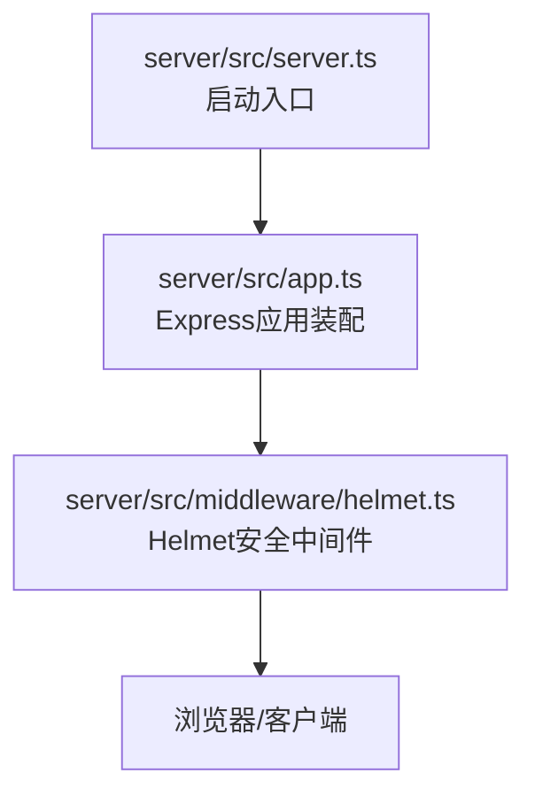
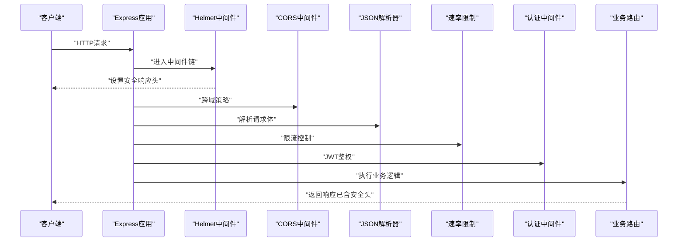
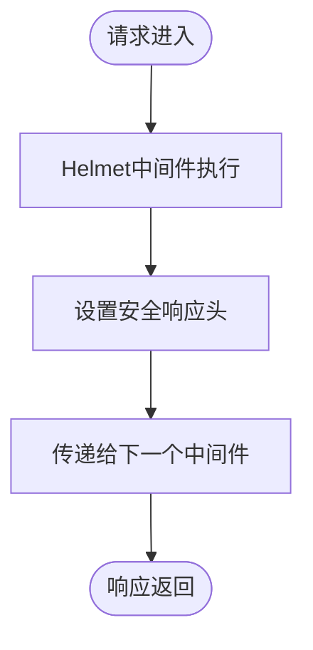
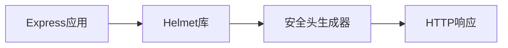

# 安全中间件（Helmet）

<cite>
**本文引用的文件**   
- [server/src/middleware/helmet.ts](file://server/src/middleware/helmet.ts)
- [server/src/app.ts](file://server/src/app.ts)
- [server/src/server.ts](file://server/src/server.ts)
- [server/package.json](file://server/package.json)
</cite>

## 目录
1. [简介](#简介)
2. [项目结构](#项目结构)
3. [核心组件](#核心组件)
4. [架构总览](#架构总览)
5. [详细组件分析](#详细组件分析)
6. [依赖分析](#依赖分析)
7. [性能考虑](#性能考虑)
8. [故障排查指南](#故障排查指南)
9. [结论](#结论)
10. [附录](#附录)

## 简介
本文件面向FY200项目的HTTP安全中间件（Helmet），系统性说明其职责、配置策略与最佳实践。重点覆盖以下方面：
- HTTP安全头的设置策略，包括X-Content-Type-Options、X-Frame-Options、Strict-Transport-Security等关键安全头
- 通过Helmet防御常见Web攻击（XSS、点击劫持、MIME类型嗅探等）
- 自定义安全头配置、CSP策略设置方法
- 性能优化建议与安全最佳实践
- 常见安全漏洞防护示例与排错指引

本项目后端技术栈为Express 4 + Prisma 5 + PostgreSQL 15 + JWT + DeepSeek API（SSE流式）。中间件执行链顺序为：helmet → cors → express.json → rate-limit → auth(JWT+黑名单) → permission(默认拒绝) → scope(Prisma extension) → softDelete → audit → Service → Prisma → PostgreSQL。

## 项目结构
在server/src目录下，Helmet作为独立中间件模块存在，并在应用初始化时按既定顺序挂载到Express实例上。该设计确保所有请求在进入业务逻辑前均被安全头处理。

**图示来源**
- [server/src/server.ts](file://server/src/server.ts)
- [server/src/app.ts](file://server/src/app.ts)
- [server/src/middleware/helmet.ts](file://server/src/middleware/helmet.ts)

**章节来源**
- [server/src/app.ts](file://server/src/app.ts)
- [server/src/server.ts](file://server/src/server.ts)

## 核心组件
- Helmet中间件：负责向响应中注入HTTP安全头，降低常见Web安全风险
- 应用装配层：统一注册中间件顺序，保证安全头优先于其他处理逻辑
- 包管理：声明对Helmet的依赖版本，便于审计与升级

**章节来源**
- [server/src/middleware/helmet.ts](file://server/src/middleware/helmet.ts)
- [server/src/app.ts](file://server/src/app.ts)
- [server/package.json](file://server/package.json)

## 架构总览
下图展示了Helmet在Express中间件链中的位置与作用范围。所有HTTP请求在进入业务路由之前，都会先经过Helmet处理，从而确保响应包含必要的安全头。

**图示来源**
- [server/src/app.ts](file://server/src/app.ts)
- [server/src/middleware/helmet.ts](file://server/src/middleware/helmet.ts)

## 详细组件分析

### Helmet中间件实现与配置
- 职责：为每个响应添加HTTP安全头，如X-Content-Type-Options、X-Frame-Options、Strict-Transport-Security等
- 可配置项：启用/禁用特定安全头、自定义CSP策略、是否允许内联脚本、是否限制资源加载来源等
- 集成方式：在Express应用初始化阶段以中间件形式注册，确保全局生效

**图示来源**
- [server/src/middleware/helmet.ts](file://server/src/middleware/helmet.ts)

**章节来源**
- [server/src/middleware/helmet.ts](file://server/src/middleware/helmet.ts)

### CSP（内容安全策略）配置要点
- 目的：防止XSS攻击，限制页面可加载的资源来源
- 关键指令：default-src、script-src、style-src、img-src、connect-src等
- 最佳实践：
  - 避免使用unsafe-inline和unsafe-eval
  - 明确指定允许的域名和协议
  - 为动态生成的内容使用nonce或哈希校验
  - 定期审查并收紧策略

### 自定义安全头扩展
- 支持添加任意HTTP响应头，用于满足合规或业务需求
- 可通过中间件链后续环节追加或修改头部
- 注意避免重复设置或冲突的头字段

### 与CORS、HSTS的协同
- CORS：控制跨域访问权限，与Helmet各自负责不同维度安全
- HSTS：强制HTTPS传输，需配合正确证书与子域名配置
- 建议在生产环境启用HSTS，并设置合理的max-age和includeSubDomains

**章节来源**
- [server/src/app.ts](file://server/src/app.ts)
- [server/src/middleware/helmet.ts](file://server/src/middleware/helmet.ts)

## 依赖分析
Helmet作为第三方库被引入到项目中，其版本管理与更新直接影响安全能力。建议在package.json中锁定具体版本，并定期评估升级影响。

**图示来源**
- [server/package.json](file://server/package.json)
- [server/src/app.ts](file://server/src/app.ts)

**章节来源**
- [server/package.json](file://server/package.json)
- [server/src/app.ts](file://server/src/app.ts)

## 性能考虑
- Helmet本身开销极小，主要成本在于设置响应头
- 避免过度复杂的CSP策略，减少浏览器解析负担
- 在生产环境启用Gzip/Brotli压缩，但需注意不要压缩敏感信息
- 合理使用缓存策略，避免重复计算安全头

## 故障排查指南
常见问题及解决方案：
- 安全头未生效：检查中间件注册顺序，确保Helmet位于最前面
- CSP阻止资源加载：检查CSP策略是否过于严格，临时放宽后逐步收紧
- HSTS导致无法访问：确认HTTPS配置正确，必要时移除预加载列表
- 移动端兼容性问题：测试不同浏览器的安全头支持情况

调试技巧：
- 使用浏览器开发者工具查看响应头
- 启用详细日志记录中间件执行过程
- 使用在线工具验证CSP策略有效性

**章节来源**
- [server/src/middleware/helmet.ts](file://server/src/middleware/helmet.ts)
- [server/src/app.ts](file://server/src/app.ts)

## 结论
Helmet是构建安全Web应用的基础组件，通过合理配置HTTP安全头可有效防御多种常见攻击。在FY200项目中，Helmet作为第一道防线，与其他安全机制协同工作，共同保障系统安全。建议定期审查安全配置，及时应对新出现的威胁。

## 附录

### 关键安全头说明
- X-Content-Type-Options：防止MIME类型嗅探
- X-Frame-Options：防止点击劫持攻击
- Strict-Transport-Security：强制HTTPS连接
- Content-Security-Policy：定义资源加载策略
- X-XSS-Protection：启用浏览器XSS过滤器
- Referrer-Policy：控制Referer头信息泄露

### 安全最佳实践清单
- 始终启用基础安全头
- 实施严格的CSP策略
- 定期更新依赖库版本
- 进行安全扫描和渗透测试
- 建立安全事件响应流程

### 常见攻击防护示例
- XSS防护：通过CSP限制脚本执行，对用户输入进行转义
- CSRF防护：使用SameSite Cookie和请求令牌
- 点击劫持：设置X-Frame-Options为DENY或SAMEORIGIN
- MIME嗅探：设置X-Content-Type-Options为nosniff