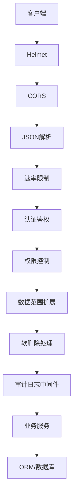
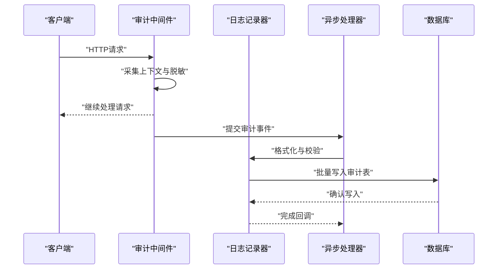
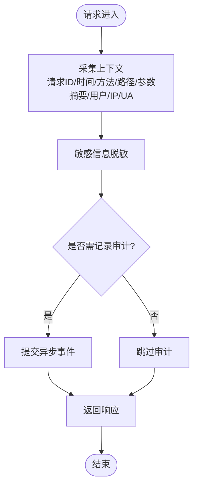
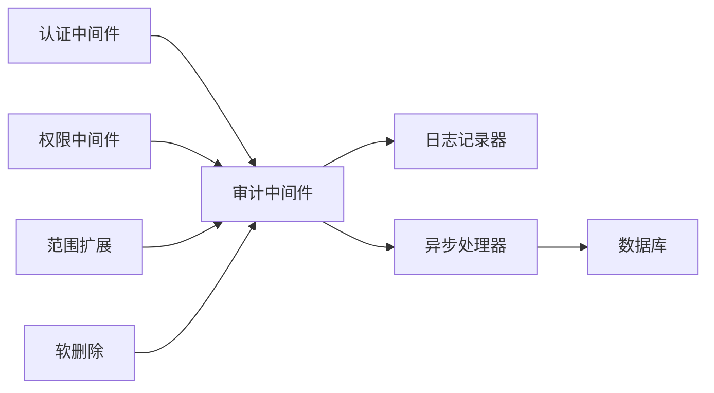

# 审计日志中间件

<cite>
**本文引用的文件**   
- [server/src/middleware/audit.ts](file://server/src/middleware/audit.ts)
- [server/src/lib/logger.ts](file://server/src/lib/logger.ts)
- [server/src/lib/async-handler.ts](file://server/src/lib/async-handler.ts)
- [server/src/app.ts](file://server/src/app.ts)
- [server/prisma/schema.prisma](file://server/prisma/schema.prisma)
- [server/prisma/init-audit.sql](file://server/prisma/init-audit.sql)
- [server/src/lib/desensitize.test.ts](file://server/src/lib/desensitize.test.ts)
- [server/src/lib/sanitize.ts](file://server/src/lib/sanitize.ts)
- [server/src/middleware/auth.ts](file://server/src/middleware/auth.ts)
- [server/src/middleware/permission.ts](file://server/src/middleware/permission.ts)
- [server/src/middleware/scope.ts](file://server/src/middleware/scope.ts)
- [server/src/middleware/soft-delete.ts](file://server/src/middleware/soft-delete.ts)
- [server/src/middleware/rate-limit.ts](file://server/src/middleware/rate-limit.ts)
- [server/src/middleware/cors.ts](file://server/src/middleware/cors.ts)
- [server/src/middleware/helmet.ts](file://server/src/middleware/helmet.ts)
- [server/src/middleware/trace-id.ts](file://server/src/middleware/trace-id.ts)
</cite>

## 目录
1. [简介](#简介)
2. [项目结构](#项目结构)
3. [核心组件](#核心组件)
4. [架构总览](#架构总览)
5. [详细组件分析](#详细组件分析)
6. [依赖关系分析](#依赖关系分析)
7. [性能考量](#性能考量)
8. [故障排查指南](#故障排查指南)
9. [结论](#结论)
10. [附录](#附录)

## 简介
本文件面向FY200项目的审计日志中间件，系统性阐述操作审计记录机制、用户行为追踪、敏感操作记录与变更历史保存策略。文档覆盖异步日志写入、批量处理与存储策略，以及审计数据查询、报表生成与合规性要求。同时提供日志脱敏策略、性能优化建议与故障排查指南，帮助开发者与运维人员快速理解并正确使用该中间件。

## 项目结构
FY200后端采用Express 4 + Prisma 5 + PostgreSQL 15，中间件执行链顺序为：helmet → cors → express.json → rate-limit → auth(JWT+黑名单) → permission(默认拒绝) → scope(Prisma extension) → softDelete → audit → Service → Prisma → PostgreSQL。审计日志中间件位于中间件层，负责在请求生命周期内采集关键上下文信息，并以异步方式持久化到数据库或消息队列（由实现决定）。

图表来源
- [server/src/app.ts](file://server/src/app.ts)
- [server/src/middleware/helmet.ts](file://server/src/middleware/helmet.ts)
- [server/src/middleware/cors.ts](file://server/src/middleware/cors.ts)
- [server/src/middleware/rate-limit.ts](file://server/src/middleware/rate-limit.ts)
- [server/src/middleware/auth.ts](file://server/src/middleware/auth.ts)
- [server/src/middleware/permission.ts](file://server/src/middleware/permission.ts)
- [server/src/middleware/scope.ts](file://server/src/middleware/scope.ts)
- [server/src/middleware/soft-delete.ts](file://server/src/middleware/soft-delete.ts)
- [server/src/middleware/audit.ts](file://server/src/middleware/audit.ts)

章节来源
- [server/src/app.ts](file://server/src/app.ts)
- [server/src/middleware/audit.ts](file://server/src/middleware/audit.ts)

## 核心组件
- 审计日志中间件：捕获请求上下文、用户身份、操作类型、资源标识、结果状态等，进行必要脱敏后异步落库。
- 日志记录器：统一日志格式、级别与输出目标，支持结构化字段与采样策略。
- 异步处理器：基于事件循环或任务队列的异步写入，避免阻塞主请求链路。
- 存储模型：审计表结构与迁移脚本，确保可追溯性与合规留存。

章节来源
- [server/src/middleware/audit.ts](file://server/src/middleware/audit.ts)
- [server/src/lib/logger.ts](file://server/src/lib/logger.ts)
- [server/src/lib/async-handler.ts](file://server/src/lib/async-handler.ts)
- [server/prisma/schema.prisma](file://server/prisma/schema.prisma)
- [server/prisma/init-audit.sql](file://server/prisma/init-audit.sql)

## 架构总览
审计中间件在请求进入业务逻辑前收集上下文，并在响应完成后触发异步写入。关键流程包括：
- 上下文采集：请求ID、时间戳、方法、路径、参数摘要、用户信息、IP、UA等。
- 敏感信息脱敏：金额区间化、公司名映射、令牌掩码等。
- 异步写入：通过任务队列或后台协程写入审计表，失败时重试与降级。
- 查询与报表：提供按时间、用户、操作类型、资源维度查询接口，支持导出与聚合统计。

图表来源
- [server/src/middleware/audit.ts](file://server/src/middleware/audit.ts)
- [server/src/lib/logger.ts](file://server/src/lib/logger.ts)
- [server/src/lib/async-handler.ts](file://server/src/lib/async-handler.ts)
- [server/prisma/schema.prisma](file://server/prisma/schema.prisma)

## 详细组件分析

### 审计中间件（audit.ts）
职责与行为：
- 在请求进入时注入跟踪ID与时间戳，记录请求元数据。
- 对敏感字段进行脱敏（金额→区间、公司名→动态映射、令牌→掩码）。
- 在响应结束后根据操作类型决定是否记录审计事件（如创建、更新、删除、导入、导出、配置变更等）。
- 将审计事件推送到异步处理器，避免阻塞主链路。
- 对异常与错误路径进行兜底记录，保证可观测性。

图表来源
- [server/src/middleware/audit.ts](file://server/src/middleware/audit.ts)

章节来源
- [server/src/middleware/audit.ts](file://server/src/middleware/audit.ts)

### 日志记录器（logger.ts）
职责与行为：
- 统一日志格式与级别，支持结构化字段（traceId、userId、action、resource、status等）。
- 提供采样与限流策略，防止高并发下日志风暴。
- 支持多目标输出（控制台、文件、外部系统），便于集中式日志平台接入。

章节来源
- [server/src/lib/logger.ts](file://server/src/lib/logger.ts)

### 异步处理器（async-handler.ts）
职责与行为：
- 基于事件循环或任务队列实现非阻塞写入。
- 支持批量合并与批大小阈值，减少数据库写入次数。
- 失败重试与退避策略，保障可靠性；失败时降级到本地缓冲或丢弃（可配置）。

章节来源
- [server/src/lib/async-handler.ts](file://server/src/lib/async-handler.ts)

### 存储模型与迁移（schema.prisma / init-audit.sql）
- 审计表包含：traceId、userId、action、resourceType、resourceId、diffSummary、status、ip、userAgent、createdAt等字段。
- 索引设计：按时间、用户、操作类型、资源类型建立复合索引，提升查询效率。
- 保留策略：按时间分表或归档，满足合规留存周期。

章节来源
- [server/prisma/schema.prisma](file://server/prisma/schema.prisma)
- [server/prisma/init-audit.sql](file://server/prisma/init-audit.sql)

### 脱敏与清洗（desensitize.test.ts / sanitize.ts）
- 金额脱敏：绝对值转换为区间（如“100~200万元”）。
- 公司名脱敏：动态映射为匿名标识，避免泄露真实主体。
- 令牌与密钥：掩码处理，仅保留前后缀用于定位。
- 输入清洗：过滤危险字符与SQL注入风险。

章节来源
- [server/src/lib/desensitize.test.ts](file://server/src/lib/desensitize.test.ts)
- [server/src/lib/sanitize.ts](file://server/src/lib/sanitize.ts)

## 依赖关系分析
审计中间件依赖认证、权限、范围扩展等前置中间件以获取用户身份与操作上下文；依赖日志记录器与异步处理器完成可靠写入；依赖数据库模型进行持久化。

图表来源
- [server/src/middleware/auth.ts](file://server/src/middleware/auth.ts)
- [server/src/middleware/permission.ts](file://server/src/middleware/permission.ts)
- [server/src/middleware/scope.ts](file://server/src/middleware/scope.ts)
- [server/src/middleware/soft-delete.ts](file://server/src/middleware/soft-delete.ts)
- [server/src/middleware/audit.ts](file://server/src/middleware/audit.ts)
- [server/src/lib/logger.ts](file://server/src/lib/logger.ts)
- [server/src/lib/async-handler.ts](file://server/src/lib/async-handler.ts)

章节来源
- [server/src/middleware/audit.ts](file://server/src/middleware/audit.ts)
- [server/src/lib/logger.ts](file://server/src/lib/logger.ts)
- [server/src/lib/async-handler.ts](file://server/src/lib/async-handler.ts)

## 性能考量
- 异步写入：审计事件不阻塞主请求链路，降低延迟。
- 批量合并：设置批大小与超时阈值，减少数据库写入次数。
- 采样与限流：在高负载场景下启用采样，避免日志风暴。
- 索引优化：针对高频查询维度建立复合索引，提升检索性能。
- 存储分层：热数据内存缓存，冷数据归档至低成本存储。

[本节为通用指导，无需特定文件引用]

## 故障排查指南
常见问题与处理：
- 审计缺失：检查中间件顺序与注册位置，确认异步处理器未崩溃或队列堆积。
- 写入失败：查看日志记录器错误输出，检查数据库连接与事务状态，必要时启用重试与降级。
- 脱敏异常：核对脱敏规则与输入格式，确保金额与公司名映射正确。
- 性能问题：监控异步队列长度与批大小，调整采样率与限流策略。

章节来源
- [server/src/lib/logger.ts](file://server/src/lib/logger.ts)
- [server/src/lib/async-handler.ts](file://server/src/lib/async-handler.ts)
- [server/src/lib/desensitize.test.ts](file://server/src/lib/desensitize.test.ts)

## 结论
FY200审计日志中间件通过标准化上下文采集、严格脱敏与异步写入，实现了高效、可靠的审计记录机制。结合合理的存储模型与查询索引，可满足合规留存与审计查询需求。建议在部署中关注异步队列健康、脱敏规则一致性与性能指标，持续优化以提升系统稳定性与可观测性。

[本节为总结，无需特定文件引用]

## 附录
- 审计数据查询建议：按时间范围、用户、操作类型、资源类型组合筛选，支持分页与导出。
- 报表生成建议：聚合统计操作频次、成功率、失败原因分布，生成趋势图与异常告警。
- 合规性要求：保留周期不少于规定时长，敏感信息必须脱敏，访问审计需可追溯。

[本节为补充说明，无需特定文件引用]