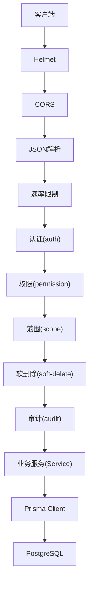
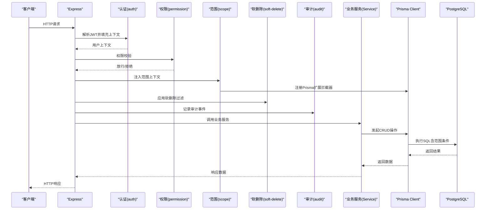
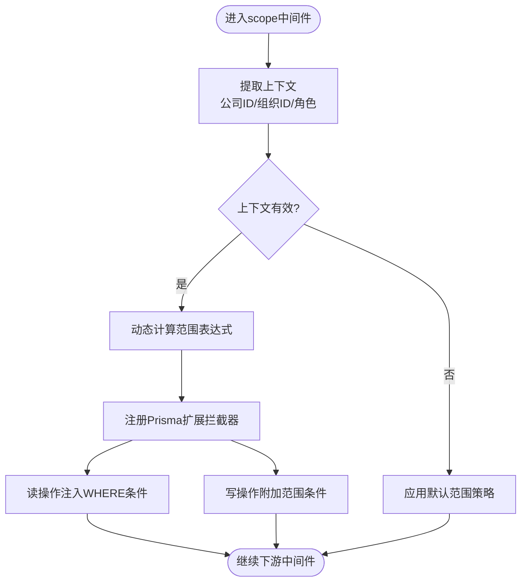
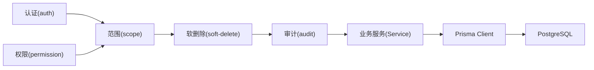

# 数据范围控制中间件

<cite>
**本文档引用的文件**   
- [scope.ts](file://server/src/middleware/scope.ts)
- [scope.test.ts](file://server/src/middleware/scope.test.ts)
- [auth.ts](file://server/src/middleware/auth.ts)
- [permission.ts](file://server/src/middleware/permission.ts)
- [soft-delete.ts](file://server/src/middleware/soft-delete.ts)
- [audit.ts](file://server/src/middleware/audit.ts)
- [app.ts](file://server/src/app.ts)
- [schema.prisma](file://server/prisma/schema.prisma)
- [20260724120000_remove_business_unit_org_scope/migration.sql](file://server/prisma/migrations/20260724120000_remove_business_unit_org_scope/migration.sql)
- [env.ts](file://server/src/config/env.ts)
- [prisma.ts](file://server/src/lib/prisma.ts)
</cite>

## 目录
1. [简介](#简介)
2. [项目结构](#项目结构)
3. [核心组件](#核心组件)
4. [架构总览](#架构总览)
5. [详细组件分析](#详细组件分析)
6. [依赖关系分析](#依赖关系分析)
7. [性能考量](#性能考量)
8. [故障排查指南](#故障排查指南)
9. [结论](#结论)
10. [附录](#附录)

## 简介
本文件面向FY200项目的“数据范围控制中间件”，围绕基于Prisma Extension的数据隔离机制，系统阐述公司维度、组织层级与数据可见性控制策略。文档覆盖自动添加查询条件、批量操作的范围过滤、性能优化策略、范围规则配置与动态计算、调试工具使用，以及数据隔离最佳实践与常见场景实现示例。该中间件位于Express中间件链中，在权限校验之后、软删除与审计之前执行，确保所有数据库访问均受统一范围约束。

## 项目结构
后端采用Express + Prisma + PostgreSQL架构。中间件执行顺序为：helmet → cors → express.json → rate-limit → auth(JWT+黑名单) → permission(默认拒绝) → scope(Prisma extension) → softDelete → audit → Service → Prisma → PostgreSQL。scope中间件通过Prisma扩展注入查询拦截器，将当前请求上下文中的公司ID、组织ID等范围信息自动注入到所有CRUD操作中，保证数据隔离的一致性。

图表来源
- [app.ts](file://server/src/app.ts)
- [auth.ts](file://server/src/middleware/auth.ts)
- [permission.ts](file://server/src/middleware/permission.ts)
- [scope.ts](file://server/src/middleware/scope.ts)
- [soft-delete.ts](file://server/src/middleware/soft-delete.ts)
- [audit.ts](file://server/src/middleware/audit.ts)

章节来源
- [app.ts](file://server/src/app.ts)
- [auth.ts](file://server/src/middleware/auth.ts)
- [permission.ts](file://server/src/middleware/permission.ts)
- [scope.ts](file://server/src/middleware/scope.ts)
- [soft-delete.ts](file://server/src/middleware/soft-delete.ts)
- [audit.ts](file://server/src/middleware/audit.ts)

## 核心组件
- 范围中间件（scope）：基于Prisma扩展，将请求上下文中的范围参数（如公司ID、组织ID）注入到查询条件中，支持读、写、批量操作的统一过滤。
- 认证中间件（auth）：解析JWT并填充用户上下文，为范围计算提供主体身份。
- 权限中间件（permission）：默认拒绝，按路由或资源粒度放行，决定后续是否允许进入范围控制阶段。
- 软删除中间件（soft-delete）：在范围之后应用逻辑删除过滤，避免越权读取已删除数据。
- 审计中间件（audit）：记录关键操作日志，便于追踪范围边界与异常访问。

章节来源
- [scope.ts](file://server/src/middleware/scope.ts)
- [auth.ts](file://server/src/middleware/auth.ts)
- [permission.ts](file://server/src/middleware/permission.ts)
- [soft-delete.ts](file://server/src/middleware/soft-delete.ts)
- [audit.ts](file://server/src/middleware/audit.ts)

## 架构总览
下图展示了从HTTP请求到数据库访问的完整链路，重点标注了scope中间件如何与Prisma扩展协作，自动注入范围条件。

图表来源
- [app.ts](file://server/src/app.ts)
- [auth.ts](file://server/src/middleware/auth.ts)
- [permission.ts](file://server/src/middleware/permission.ts)
- [scope.ts](file://server/src/middleware/scope.ts)
- [soft-delete.ts](file://server/src/middleware/soft-delete.ts)
- [audit.ts](file://server/src/middleware/audit.ts)

## 详细组件分析

### 范围中间件（scope）
- 作用：在请求上下文中提取公司ID、组织ID等范围标识，并通过Prisma扩展在所有查询中自动附加WHERE条件，确保数据隔离。
- 能力：
  - 自动添加查询条件：对findMany、findFirst、count、aggregate等读操作注入范围过滤。
  - 批量操作范围过滤：对createMany、updateMany、deleteMany等操作强制附加范围条件，防止批量越权。
  - 动态计算：根据用户角色、租户配置、组织树关系动态生成范围表达式。
  - 调试工具：提供开关以打印最终SQL与注入的条件，便于定位问题。
- 配置项：
  - 默认范围：当上下文缺失时回退的策略（如拒绝访问或仅只读）。
  - 白名单模型：可跳过范围控制的实体（谨慎使用）。
  - 组织层级映射：公司→组织→部门的层级关系与继承规则。
- 性能优化：
  - 条件合并：将多个范围条件合并为单一WHERE子句，减少冗余。
  - 索引建议：针对company_id、org_id等字段建立索引，提升过滤效率。
  - 延迟计算：仅在需要时计算复杂范围表达式，避免无谓开销。

图表来源
- [scope.ts](file://server/src/middleware/scope.ts)

章节来源
- [scope.ts](file://server/src/middleware/scope.ts)
- [scope.test.ts](file://server/src/middleware/scope.test.ts)

### 认证中间件（auth）
- 作用：解析JWT，校验签名与过期时间，填充用户上下文（如userId、companyId、roles），供后续权限与范围计算使用。
- 关键点：
  - Access Token短时效（15分钟）、Refresh Token长时效（7天）轮转。
  - 黑名单检查：支持吊销令牌快速失效。
  - 上下文标准化：统一用户信息格式，便于scope中间件消费。

章节来源
- [auth.ts](file://server/src/middleware/auth.ts)

### 权限中间件（permission）
- 作用：默认拒绝访问，按路由或资源粒度放行，决定后续是否进入范围控制阶段。
- 关键点：
  - 最小权限原则：未显式放行的路径一律拒绝。
  - 资源级控制：结合RBAC/ABAC策略，决定用户可访问的数据域。

章节来源
- [permission.ts](file://server/src/middleware/permission.ts)

### 软删除中间件（soft-delete）
- 作用：在范围之后应用逻辑删除过滤，避免越权读取已删除数据。
- 关键点：
  - 统一where条件追加deletedAt为空。
  - 与scope组合：先范围后软删除，确保即使越权也无法看到已删除数据。

章节来源
- [soft-delete.ts](file://server/src/middleware/soft-delete.ts)

### 审计中间件（audit）
- 作用：记录关键操作日志，包括请求路径、用户、范围上下文、操作类型与结果。
- 关键点：
  - 敏感信息脱敏：金额区间化、公司名动态映射。
  - 异步写入：避免阻塞主流程。

章节来源
- [audit.ts](file://server/src/middleware/audit.ts)

### Prisma扩展与数据模型
- Prisma扩展：在Prisma Client上注册中间件，拦截所有查询并在运行时注入范围条件。
- 数据模型：
  - 公司维度：每个实体通常包含company_id作为租户隔离键。
  - 组织层级：支持org_id及层级关系，用于更细粒度的数据可见性控制。
  - 迁移变更：移除business_unit与org_scope相关字段，简化范围计算。

章节来源
- [schema.prisma](file://server/prisma/schema.prisma)
- [20260724120000_remove_business_unit_org_scope/migration.sql](file://server/prisma/migrations/20260724120000_remove_business_unit_org_scope/migration.sql)

## 依赖关系分析
- 中间件耦合：
  - scope依赖auth提供的用户上下文。
  - soft-delete在scope之后执行，确保范围优先于软删除。
  - audit在soft-delete之后记录，包含最终生效的范围结果。
- 外部依赖：
  - Prisma Client：通过扩展注入拦截器。
  - PostgreSQL：依赖索引与查询计划优化范围过滤性能。

图表来源
- [app.ts](file://server/src/app.ts)
- [auth.ts](file://server/src/middleware/auth.ts)
- [permission.ts](file://server/src/middleware/permission.ts)
- [scope.ts](file://server/src/middleware/scope.ts)
- [soft-delete.ts](file://server/src/middleware/soft-delete.ts)
- [audit.ts](file://server/src/middleware/audit.ts)

章节来源
- [app.ts](file://server/src/app.ts)
- [scope.ts](file://server/src/middleware/scope.ts)

## 性能考量
- 条件合并：将多段范围表达式合并为单一WHERE子句，减少SQL复杂度。
- 索引策略：为company_id、org_id等高频过滤字段建立B-Tree索引。
- 延迟计算：仅在必要时计算复杂范围表达式，避免无谓开销。
- 连接池：合理配置Prisma连接池大小，避免高并发下的连接竞争。
- 监控与诊断：启用SQL日志与慢查询分析，定位热点查询。

[本节为通用指导，不直接分析具体文件]

## 故障排查指南
- 常见问题：
  - 范围条件未生效：检查上下文是否缺失、默认范围策略是否正确。
  - 批量操作越权：确认createMany/updateMany/deleteMany是否被拦截并附加范围条件。
  - 性能退化：查看SQL日志，确认是否缺少索引或条件未合并。
- 调试工具：
  - 开启Prisma扩展日志，打印注入的WHERE条件。
  - 使用审计日志追踪范围上下文与操作结果。
  - 单元测试覆盖典型场景，验证范围计算正确性。

章节来源
- [scope.test.ts](file://server/src/middleware/scope.test.ts)
- [audit.ts](file://server/src/middleware/audit.ts)

## 结论
数据范围控制中间件通过Prisma扩展实现了统一、安全、高效的数据隔离机制。其核心价值在于：
- 自动化：无需在每个Service中手动拼接范围条件。
- 一致性：所有CRUD操作均受同一范围策略约束。
- 可扩展：支持动态计算与灵活配置，适应多租户与组织层级变化。
- 可观测：结合审计与调试工具，便于问题定位与性能优化。

[本节为总结，不直接分析具体文件]

## 附录

### 范围规则配置清单
- 默认范围策略：当上下文缺失时的行为（拒绝/只读/最小集）。
- 白名单模型：可跳过范围控制的实体列表（谨慎使用）。
- 组织层级映射：公司→组织→部门的继承规则与可见性矩阵。
- 调试开关：启用SQL日志与条件打印。

章节来源
- [env.ts](file://server/src/config/env.ts)
- [scope.ts](file://server/src/middleware/scope.ts)

### 常见场景实现示例
- 公司维度隔离：所有查询强制附加company_id = 当前公司。
- 组织层级可见性：用户可访问本部门及其下级部门数据。
- 批量导入范围过滤：createMany时自动附加范围条件，防止跨公司导入。
- 只读报表范围：报表查询仅返回用户有权访问的数据子集。

章节来源
- [scope.ts](file://server/src/middleware/scope.ts)
- [schema.prisma](file://server/prisma/schema.prisma)

### 最佳实践
- 始终在权限之后、软删除之前执行范围控制。
- 为高频过滤字段建立索引，避免全表扫描。
- 使用单元测试覆盖范围计算边界条件。
- 定期审查白名单模型，最小化特权范围。
- 结合审计日志与监控告警，及时发现异常访问。

[本节为通用指导，不直接分析具体文件]