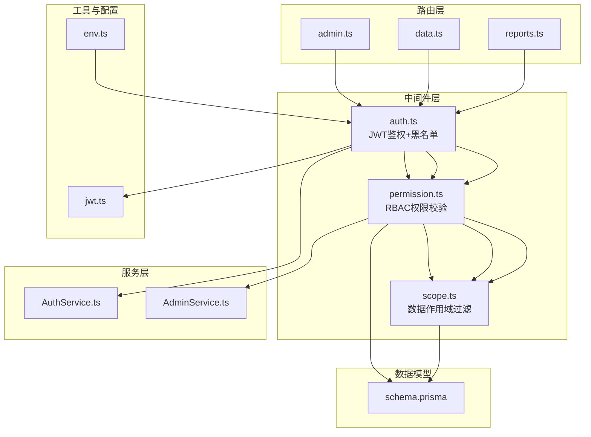
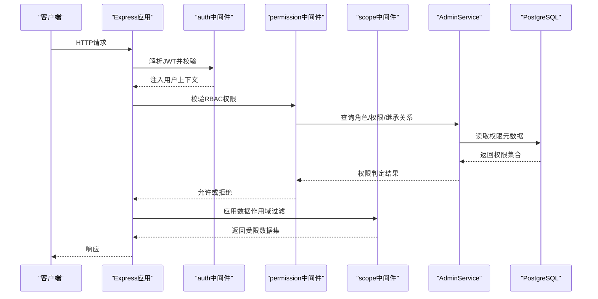
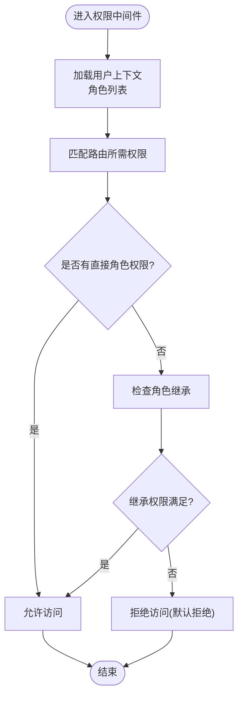
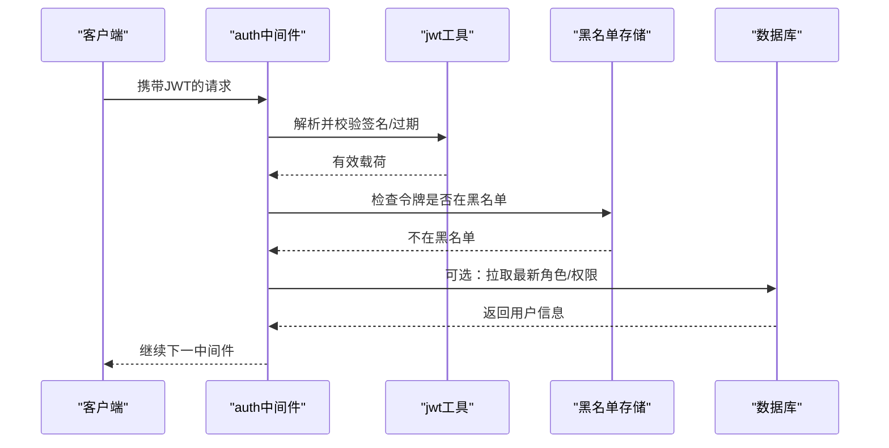
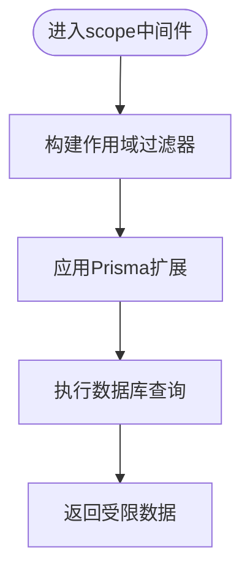
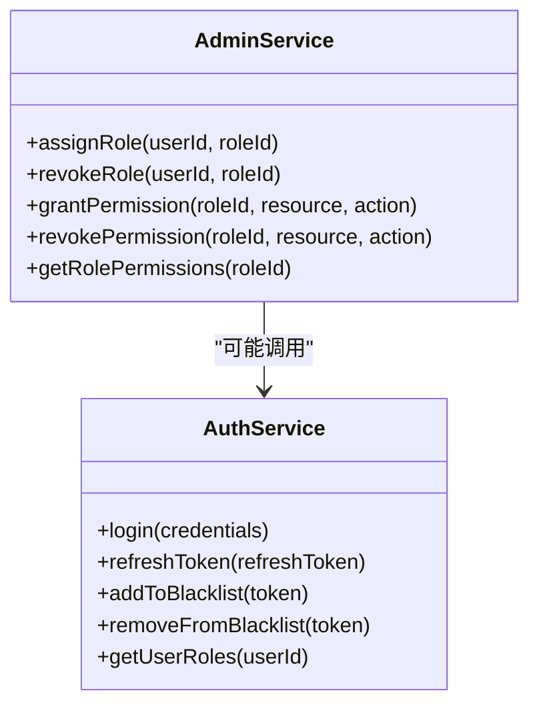
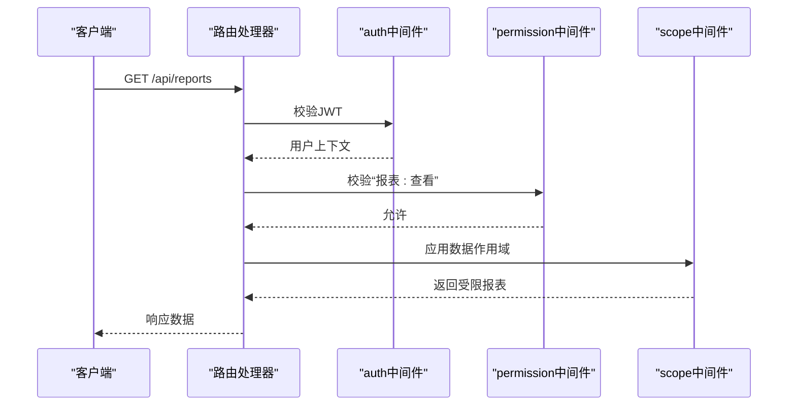
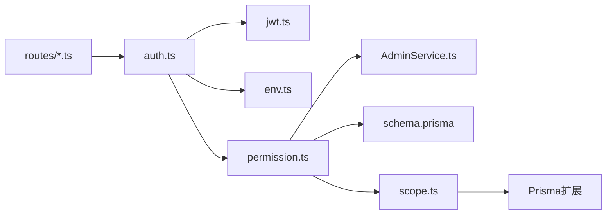

# 权限控制中间件

<cite>
**本文引用的文件**   
- [server/src/middleware/permission.ts](file://server/src/middleware/permission.ts)
- [server/src/middleware/auth.ts](file://server/src/middleware/auth.ts)
- [server/src/middleware/scope.ts](file://server/src/middleware/scope.ts)
- [server/src/routes/admin.ts](file://server/src/routes/admin.ts)
- [server/src/routes/data.ts](file://server/src/routes/data.ts)
- [server/src/routes/reports.ts](file://server/src/routes/reports.ts)
- [server/src/services/AdminService.ts](file://server/src/services/AdminService.ts)
- [server/src/services/AuthService.ts](file://server/src/services/AuthService.ts)
- [server/src/lib/jwt.ts](file://server/src/lib/jwt.ts)
- [server/src/config/env.ts](file://server/src/config/env.ts)
- [server/prisma/schema.prisma](file://server/prisma/schema.prisma)
- [server/src/middleware/permission.test.ts](file://server/src/middleware/permission.test.ts)
- [server/src/middleware/auth.test.ts](file://server/src/middleware/auth.test.ts)
- [server/src/middleware/scope.test.ts](file://server/src/middleware/scope.test.ts)
</cite>

## 目录
1. [简介](#简介)
2. [项目结构](#项目结构)
3. [核心组件](#核心组件)
4. [架构总览](#架构总览)
5. [详细组件分析](#详细组件分析)
6. [依赖关系分析](#依赖关系分析)
7. [性能考虑](#性能考虑)
8. [故障排查指南](#故障排查指南)
9. [结论](#结论)
10. [附录](#附录)

## 简介
本文件面向FY200项目的RBAC（基于角色的访问控制）权限控制中间件，系统性阐述角色定义、权限分配与继承关系，默认拒绝的安全策略、细粒度权限控制与动态权限验证机制。文档同时覆盖权限元数据设计、缓存策略与性能优化建议，并提供权限设计模式、测试方法与常见问题解决方案，帮助开发者快速理解并正确扩展权限体系。

## 项目结构
权限相关代码主要位于后端中间件层与服务层：
- 中间件层：鉴权(auth)、权限校验(permission)、作用域过滤(scope)等
- 路由层：各业务路由通过中间件链挂载权限保护
- 服务层：管理员与认证服务提供角色与权限的查询与更新能力
- 配置与工具：JWT工具与环境变量管理
- 数据模型：Prisma schema中角色、权限、用户-角色、资源-权限等实体定义

图表来源
- [server/src/middleware/auth.ts](file://server/src/middleware/auth.ts)
- [server/src/middleware/permission.ts](file://server/src/middleware/permission.ts)
- [server/src/middleware/scope.ts](file://server/src/middleware/scope.ts)
- [server/src/routes/admin.ts](file://server/src/routes/admin.ts)
- [server/src/routes/data.ts](file://server/src/routes/data.ts)
- [server/src/routes/reports.ts](file://server/src/routes/reports.ts)
- [server/src/services/AdminService.ts](file://server/src/services/AdminService.ts)
- [server/src/services/AuthService.ts](file://server/src/services/AuthService.ts)
- [server/src/lib/jwt.ts](file://server/src/lib/jwt.ts)
- [server/src/config/env.ts](file://server/src/config/env.ts)
- [server/prisma/schema.prisma](file://server/prisma/schema.prisma)

章节来源
- [server/src/middleware/permission.ts](file://server/src/middleware/permission.ts)
- [server/src/middleware/auth.ts](file://server/src/middleware/auth.ts)
- [server/src/middleware/scope.ts](file://server/src/middleware/scope.ts)
- [server/src/routes/admin.ts](file://server/src/routes/admin.ts)
- [server/src/routes/data.ts](file://server/src/routes/data.ts)
- [server/src/routes/reports.ts](file://server/src/routes/reports.ts)
- [server/src/services/AdminService.ts](file://server/src/services/AdminService.ts)
- [server/src/services/AuthService.ts](file://server/src/services/AuthService.ts)
- [server/src/lib/jwt.ts](file://server/src/lib/jwt.ts)
- [server/src/config/env.ts](file://server/src/config/env.ts)
- [server/prisma/schema.prisma](file://server/prisma/schema.prisma)

## 核心组件
- 鉴权中间件(auth)：负责JWT解析、令牌有效性检查、黑名单校验，并将用户上下文注入请求对象
- 权限中间件(permission)：实现RBAC校验，支持角色继承、资源-操作级权限判定、默认拒绝策略
- 作用域中间件(scope)：基于Prisma扩展对查询结果进行行级数据范围过滤
- 管理员服务(AdminService)：提供角色、权限、用户-角色关系的增删改查
- 认证服务(AuthService)：登录、令牌签发与刷新、黑名单管理
- JWT工具(jwt)：令牌生成、校验、过期处理
- 环境变量(env)：读取安全相关配置（如令牌密钥、过期时间、黑名单存储等）
- Prisma模型(schema)：定义角色、权限、用户-角色、资源-权限等实体及关系

章节来源
- [server/src/middleware/auth.ts](file://server/src/middleware/auth.ts)
- [server/src/middleware/permission.ts](file://server/src/middleware/permission.ts)
- [server/src/middleware/scope.ts](file://server/src/middleware/scope.ts)
- [server/src/services/AdminService.ts](file://server/src/services/AdminService.ts)
- [server/src/services/AuthService.ts](file://server/src/services/AuthService.ts)
- [server/src/lib/jwt.ts](file://server/src/lib/jwt.ts)
- [server/src/config/env.ts](file://server/src/config/env.ts)
- [server/prisma/schema.prisma](file://server/prisma/schema.prisma)

## 架构总览
权限控制中间件在Express请求链路中的位置如下：
- helmet → cors → express.json → rate-limit → auth(JWT+黑名单) → permission(默认拒绝) → scope(Prisma extension) → softDelete → audit → Service → Prisma → PostgreSQL

图表来源
- [server/src/middleware/auth.ts](file://server/src/middleware/auth.ts)
- [server/src/middleware/permission.ts](file://server/src/middleware/permission.ts)
- [server/src/middleware/scope.ts](file://server/src/middleware/scope.ts)
- [server/src/services/AdminService.ts](file://server/src/services/AdminService.ts)
- [server/prisma/schema.prisma](file://server/prisma/schema.prisma)

## 详细组件分析

### RBAC权限模型与中间件(permission)
- 角色定义：通过Prisma模型定义角色实体，支持层级化或扁平化角色结构
- 权限分配：资源-操作维度定义权限（如“报表:查看”、“数据:编辑”），用户通过角色间接获得权限
- 继承关系：父角色可继承子角色权限，中间件在判定时递归合并权限集合
- 默认拒绝：未显式允许的访问一律拒绝，确保最小权限原则
- 细粒度控制：支持按资源ID、组织范围、时间窗口等条件进行动态授权
- 动态验证：每次请求根据当前用户角色与请求上下文实时计算是否允许

图表来源
- [server/src/middleware/permission.ts](file://server/src/middleware/permission.ts)
- [server/prisma/schema.prisma](file://server/prisma/schema.prisma)

章节来源
- [server/src/middleware/permission.ts](file://server/src/middleware/permission.ts)
- [server/prisma/schema.prisma](file://server/prisma/schema.prisma)

### 鉴权中间件(auth)
- JWT解析与校验：从请求头提取令牌，校验签名与过期时间
- 黑名单管理：支持将失效或撤销的令牌加入黑名单，拦截后续请求
- 用户上下文注入：将用户标识、角色、租户等信息附加到请求对象供后续中间件使用
- 错误处理：令牌无效或缺失时返回统一错误码

图表来源
- [server/src/middleware/auth.ts](file://server/src/middleware/auth.ts)
- [server/src/lib/jwt.ts](file://server/src/lib/jwt.ts)
- [server/src/config/env.ts](file://server/src/config/env.ts)

章节来源
- [server/src/middleware/auth.ts](file://server/src/middleware/auth.ts)
- [server/src/lib/jwt.ts](file://server/src/lib/jwt.ts)
- [server/src/config/env.ts](file://server/src/config/env.ts)

### 作用域中间件(scope)
- Prisma扩展：通过Prisma中间件对查询语句注入WHERE条件，限制数据可见范围
- 行级过滤：基于用户所属组织、公司、项目等维度过滤查询结果
- 组合策略：与权限中间件配合，先判权再限数，确保数据安全

图表来源
- [server/src/middleware/scope.ts](file://server/src/middleware/scope.ts)
- [server/prisma/schema.prisma](file://server/prisma/schema.prisma)

章节来源
- [server/src/middleware/scope.ts](file://server/src/middleware/scope.ts)
- [server/prisma/schema.prisma](file://server/prisma/schema.prisma)

### 管理员服务(AdminService)与认证服务(AuthService)
- AdminService：提供角色、权限、用户-角色关系的CRUD接口，支持批量导入与导出权限元数据
- AuthService：处理登录、令牌签发与刷新、黑名单管理，支持多端会话控制

图表来源
- [server/src/services/AdminService.ts](file://server/src/services/AdminService.ts)
- [server/src/services/AuthService.ts](file://server/src/services/AuthService.ts)

章节来源
- [server/src/services/AdminService.ts](file://server/src/services/AdminService.ts)
- [server/src/services/AuthService.ts](file://server/src/services/AuthService.ts)

### 路由层权限挂载示例
- admin.ts：管理员路由通常要求高权限角色（如“系统管理员”）
- data.ts：数据操作路由需具备“数据:编辑/删除”等权限
- reports.ts：报表路由需具备“报表:查看/导出”等权限

图表来源
- [server/src/routes/reports.ts](file://server/src/routes/reports.ts)
- [server/src/middleware/auth.ts](file://server/src/middleware/auth.ts)
- [server/src/middleware/permission.ts](file://server/src/middleware/permission.ts)
- [server/src/middleware/scope.ts](file://server/src/middleware/scope.ts)

章节来源
- [server/src/routes/admin.ts](file://server/src/routes/admin.ts)
- [server/src/routes/data.ts](file://server/src/routes/data.ts)
- [server/src/routes/reports.ts](file://server/src/routes/reports.ts)

## 依赖关系分析
- 中间件耦合度：auth依赖jwt与env；permission依赖AdminService与Prisma模型；scope依赖Prisma扩展
- 外部依赖：PostgreSQL存储权限元数据；可选Redis用于黑名单与权限缓存
- 循环依赖：应避免AdminService与AuthService之间的循环调用，通过事件或消息队列解耦

图表来源
- [server/src/middleware/auth.ts](file://server/src/middleware/auth.ts)
- [server/src/middleware/permission.ts](file://server/src/middleware/permission.ts)
- [server/src/middleware/scope.ts](file://server/src/middleware/scope.ts)
- [server/src/lib/jwt.ts](file://server/src/lib/jwt.ts)
- [server/src/config/env.ts](file://server/src/config/env.ts)
- [server/prisma/schema.prisma](file://server/prisma/schema.prisma)

章节来源
- [server/src/middleware/auth.ts](file://server/src/middleware/auth.ts)
- [server/src/middleware/permission.ts](file://server/src/middleware/permission.ts)
- [server/src/middleware/scope.ts](file://server/src/middleware/scope.ts)
- [server/src/lib/jwt.ts](file://server/src/lib/jwt.ts)
- [server/src/config/env.ts](file://server/src/config/env.ts)
- [server/prisma/schema.prisma](file://server/prisma/schema.prisma)

## 性能考虑
- 权限缓存：将用户角色与权限集合缓存至内存或Redis，设置合理TTL，减少数据库查询
- 懒加载：仅在首次访问或权限变更时加载权限元数据，避免启动时全量加载
- 批量查询：AdminService在获取用户权限时使用批量JOIN或聚合查询，降低往返次数
- 作用域优化：scope中间件构建的WHERE条件应利用数据库索引，避免全表扫描
- 令牌刷新：采用短生命周期access token与长生命周期refresh token，减少频繁鉴权开销

[本节为通用性能建议，不直接分析具体文件]

## 故障排查指南
- 常见错误
  - 401未授权：检查JWT是否有效、是否被加入黑名单
  - 403禁止访问：确认用户角色是否具备所需权限，检查角色继承是否正确
  - 数据为空：检查scope中间件的作用域过滤条件是否过于严格
- 调试方法
  - 启用日志：记录权限判定过程与失败原因
  - 单元测试：参考现有测试用例验证权限逻辑
  - 集成测试：模拟真实请求链路，验证中间件顺序与数据流

章节来源
- [server/src/middleware/permission.test.ts](file://server/src/middleware/permission.test.ts)
- [server/src/middleware/auth.test.ts](file://server/src/middleware/auth.test.ts)
- [server/src/middleware/scope.test.ts](file://server/src/middleware/scope.test.ts)

## 结论
FY200项目的RBAC权限控制中间件以默认拒绝为核心策略，结合角色继承与细粒度权限控制，实现了安全可靠的访问控制体系。通过auth、permission、scope三层中间件协作，既保证了功能层面的权限校验，又确保了数据层面的作用域隔离。建议在后续迭代中持续优化权限缓存与查询性能，完善测试覆盖与监控告警，提升系统的可维护性与稳定性。

[本节为总结性内容，不直接分析具体文件]

## 附录
- 权限元数据设计建议
  - 资源命名规范：模块:操作（如“报表:查看”）
  - 角色分层：基础角色、部门角色、全局角色
  - 权限继承：父子角色关系清晰，避免过度嵌套
- 测试方法
  - 单元测试：覆盖权限判定分支、继承路径、边界条件
  - 集成测试：模拟完整请求链路，验证中间件顺序与数据流
  - 性能测试：压测权限查询与缓存命中效果
- 最佳实践
  - 最小权限原则：仅授予必要权限
  - 定期审计：审查角色与权限分配，清理冗余权限
  - 灰度发布：权限变更先在小范围验证，再逐步推广

[本节为概念性内容，不直接分析具体文件]