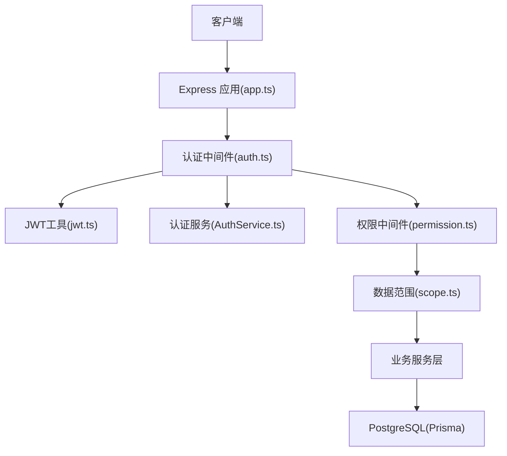
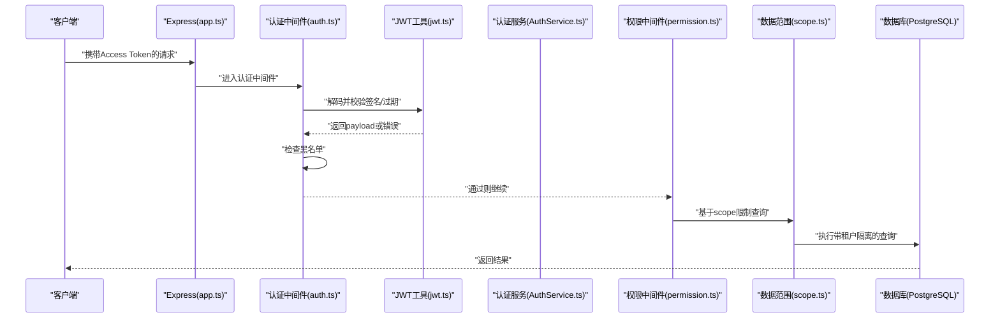
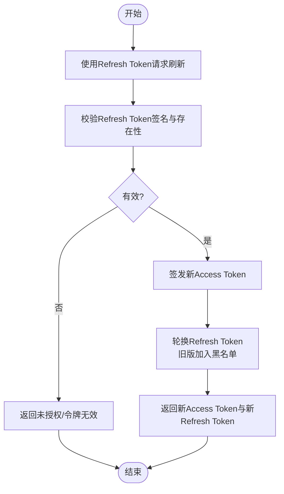
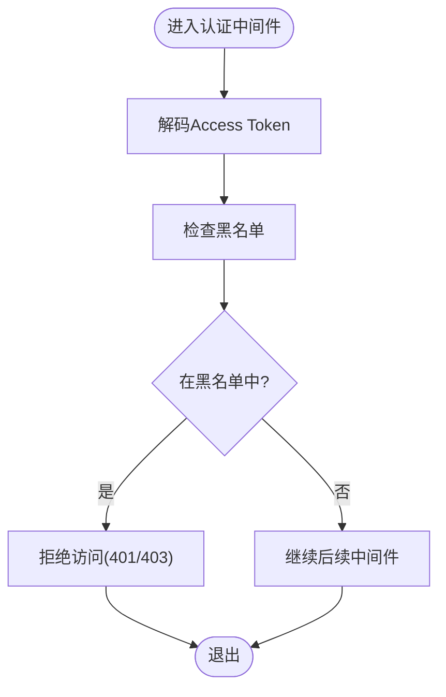
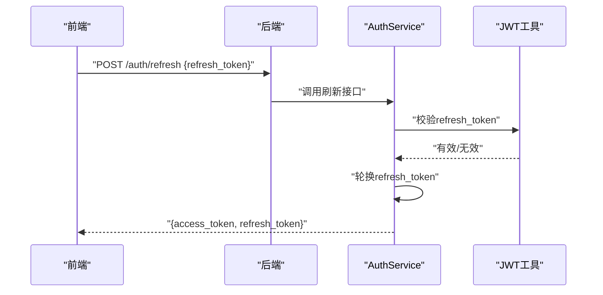
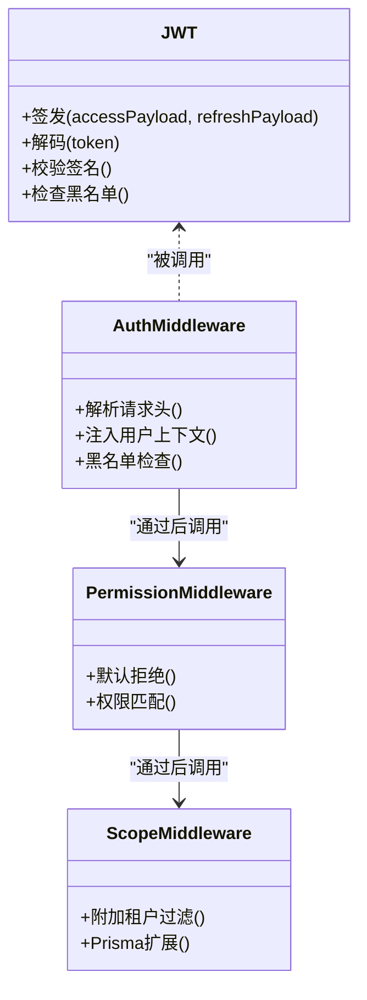
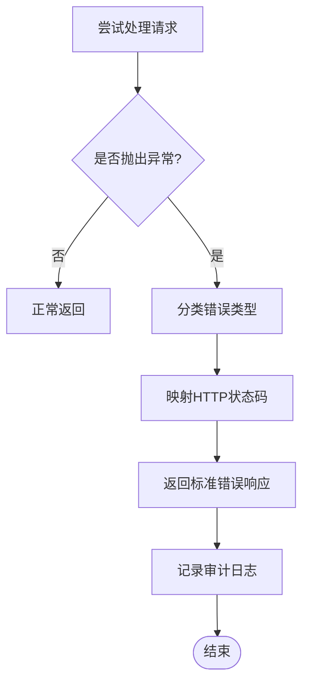
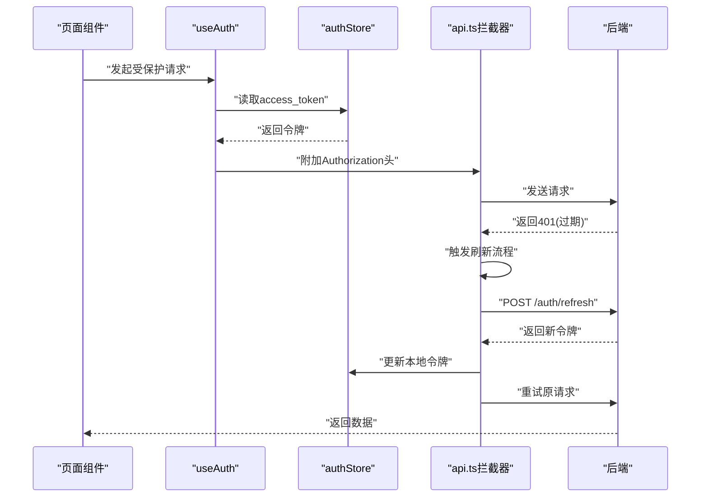
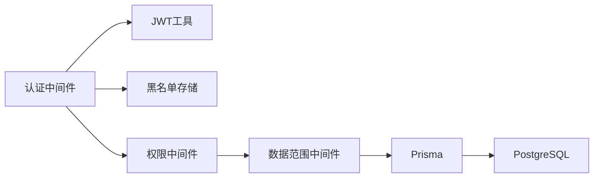

# 认证中间件（JWT）

<cite>
**本文引用的文件**   
- [server/src/middleware/auth.ts](file://server/src/middleware/auth.ts)
- [server/src/lib/jwt.ts](file://server/src/lib/jwt.ts)
- [server/src/services/AuthService.ts](file://server/src/services/AuthService.ts)
- [server/src/routes/auth.ts](file://server/src/routes/auth.ts)
- [server/src/config/env.ts](file://server/src/config/env.ts)
- [server/src/middleware/permission.ts](file://server/src/middleware/permission.ts)
- [server/src/middleware/scope.ts](file://server/src/middleware/scope.ts)
- [server/src/middleware/error-handler.ts](file://server/src/middleware/error-handler.ts)
- [server/src/lib/errors.ts](file://server/src/lib/errors.ts)
- [server/src/app.ts](file://server/src/app.ts)
- [web/src/stores/authStore.ts](file://web/src/stores/authStore.ts)
- [web/src/hooks/useAuth.ts](file://web/src/hooks/useAuth.ts)
- [web/src/lib/api.ts](file://web/src/lib/api.ts)
</cite>

## 目录
1. [简介](#简介)
2. [项目结构](#项目结构)
3. [核心组件](#核心组件)
4. [架构总览](#架构总览)
5. [详细组件分析](#详细组件分析)
6. [依赖关系分析](#依赖关系分析)
7. [性能考量](#性能考量)
8. [故障排查指南](#故障排查指南)
9. [结论](#结论)
10. [附录](#附录)

## 简介
本文件面向FY200项目的JWT认证中间件，系统性说明双令牌机制（access token 15分钟、refresh token 7天）的生成、验证与轮转策略；阐述JWT黑名单机制、Token刷新流程与异常处理逻辑；并覆盖多租户支持、权限声明扩展与安全最佳实践。同时提供客户端集成示例、错误码说明与故障排查指南，帮助前后端开发者快速落地与排障。

## 项目结构
后端采用Express中间件链：helmet → cors → express.json → rate-limit → auth(JWT+黑名单) → permission(默认拒绝) → scope(Prisma extension) → softDelete → audit → Service → Prisma → PostgreSQL。JWT相关能力集中在lib/jwt.ts与middleware/auth.ts，认证服务在services/AuthService.ts，路由入口在routes/auth.ts，环境变量配置在config/env.ts。前端通过authStore、useAuth与api.ts完成令牌存储、自动刷新与拦截器封装。

**图示来源**
- [server/src/app.ts](file://server/src/app.ts)
- [server/src/middleware/auth.ts](file://server/src/middleware/auth.ts)
- [server/src/lib/jwt.ts](file://server/src/lib/jwt.ts)
- [server/src/services/AuthService.ts](file://server/src/services/AuthService.ts)
- [server/src/middleware/permission.ts](file://server/src/middleware/permission.ts)
- [server/src/middleware/scope.ts](file://server/src/middleware/scope.ts)

**章节来源**
- [server/src/app.ts](file://server/src/app.ts)
- [server/src/middleware/auth.ts](file://server/src/middleware/auth.ts)
- [server/src/lib/jwt.ts](file://server/src/lib/jwt.ts)
- [server/src/services/AuthService.ts](file://server/src/services/AuthService.ts)
- [server/src/middleware/permission.ts](file://server/src/middleware/permission.ts)
- [server/src/middleware/scope.ts](file://server/src/middleware/scope.ts)

## 核心组件
- JWT工具库（lib/jwt.ts）
  - 负责access token与refresh token的签发、解码、校验、黑名单判断与轮转辅助方法。
  - access token有效期短（15分钟），refresh token有效期长（7天）。
  - 支持将用户标识、租户信息、权限声明等写入payload。
- 认证中间件（middleware/auth.ts）
  - 从请求头提取令牌，调用JWT工具进行签名与过期校验。
  - 维护或查询黑名单集合，拦截已吊销的token。
  - 将解析后的用户上下文注入到req对象，供后续中间件使用。
- 认证服务（services/AuthService.ts）
  - 登录成功后签发双令牌，管理refresh token的持久化与轮转。
  - 提供注销与吊销接口，将token加入黑名单。
- 认证路由（routes/auth.ts）
  - 暴露登录、刷新、登出等API，协调AuthService与响应格式。
- 环境变量（config/env.ts）
  - 集中管理JWT密钥、过期时间、黑名单存储类型等敏感配置。

**章节来源**
- [server/src/lib/jwt.ts](file://server/src/lib/jwt.ts)
- [server/src/middleware/auth.ts](file://server/src/middleware/auth.ts)
- [server/src/services/AuthService.ts](file://server/src/services/AuthService.ts)
- [server/src/routes/auth.ts](file://server/src/routes/auth.ts)
- [server/src/config/env.ts](file://server/src/config/env.ts)

## 架构总览
下图展示一次受保护API调用的完整认证流程，包括令牌校验、黑名单检查、权限判定与数据范围控制。

**图示来源**
- [server/src/app.ts](file://server/src/app.ts)
- [server/src/middleware/auth.ts](file://server/src/middleware/auth.ts)
- [server/src/lib/jwt.ts](file://server/src/lib/jwt.ts)
- [server/src/services/AuthService.ts](file://server/src/services/AuthService.ts)
- [server/src/middleware/permission.ts](file://server/src/middleware/permission.ts)
- [server/src/middleware/scope.ts](file://server/src/middleware/scope.ts)

## 详细组件分析

### 双令牌机制与轮转策略
- Access Token（短期）
  - 有效期：15分钟。
  - 用途：访问受保护资源，轻量且频繁校验。
  - 内容：用户ID、租户ID、角色/权限声明、签发时间等。
- Refresh Token（长期）
  - 有效期：7天。
  - 用途：换取新的Access Token，避免频繁登录。
  - 存储：服务端持久化（如Redis/DB），用于吊销与轮转。
- 轮转策略
  - 每次使用Refresh Token换取新Access Token时，同步轮换Refresh Token（旧版失效，新版下发）。
  - 支持强制下线：服务端将旧Refresh Token加入黑名单，客户端再次刷新失败后引导重新登录。

**图示来源**
- [server/src/lib/jwt.ts](file://server/src/lib/jwt.ts)
- [server/src/services/AuthService.ts](file://server/src/services/AuthService.ts)
- [server/src/middleware/auth.ts](file://server/src/middleware/auth.ts)

**章节来源**
- [server/src/lib/jwt.ts](file://server/src/lib/jwt.ts)
- [server/src/services/AuthService.ts](file://server/src/services/AuthService.ts)
- [server/src/middleware/auth.ts](file://server/src/middleware/auth.ts)

### JWT黑名单机制
- 目的：支持主动吊销、强制下线、安全事件响应。
- 实现要点：
  - 黑名单存储：建议使用内存缓存（开发）或Redis（生产），按token jti或指纹键值存储。
  - 校验时机：认证中间件在解码成功后立即检查黑名单。
  - 清理策略：结合过期时间与定期清理任务，避免无限增长。
- 操作：
  - 登录成功：不加入黑名单。
  - 登出/吊销：将当前token或其指纹加入黑名单。
  - 刷新：轮换时将旧Refresh Token加入黑名单。

**图示来源**
- [server/src/middleware/auth.ts](file://server/src/middleware/auth.ts)
- [server/src/lib/jwt.ts](file://server/src/lib/jwt.ts)

**章节来源**
- [server/src/middleware/auth.ts](file://server/src/middleware/auth.ts)
- [server/src/lib/jwt.ts](file://server/src/lib/jwt.ts)

### Token刷新流程
- 触发条件：Access Token即将过期或已过期。
- 流程：
  - 客户端携带有效的Refresh Token发起刷新请求。
  - 服务端校验Refresh Token有效性（签名、过期、是否存在）。
  - 签发新的Access Token，并轮换Refresh Token（旧版失效）。
  - 返回新令牌对，客户端更新本地存储。
- 失败处理：
  - Refresh Token无效/过期：返回未授权，引导重新登录。
  - 服务端异常：统一错误响应，记录日志。

**图示来源**
- [server/src/routes/auth.ts](file://server/src/routes/auth.ts)
- [server/src/services/AuthService.ts](file://server/src/services/AuthService.ts)
- [server/src/lib/jwt.ts](file://server/src/lib/jwt.ts)

**章节来源**
- [server/src/routes/auth.ts](file://server/src/routes/auth.ts)
- [server/src/services/AuthService.ts](file://server/src/services/AuthService.ts)
- [server/src/lib/jwt.ts](file://server/src/lib/jwt.ts)

### 多租户支持与权限声明扩展
- 多租户：
  - JWT payload中包含tenant_id，认证中间件将其注入到请求上下文。
  - 数据范围中间件（scope.ts）基于Prisma扩展自动附加租户过滤条件。
- 权限声明：
  - 在JWT中声明角色与资源权限（如role、scopes、permissions）。
  - 权限中间件（permission.ts）默认拒绝，需显式放行特定权限。
- 扩展建议：
  - 新增权限字段时，确保向后兼容与灰度发布。
  - 权限变更应触发必要的令牌刷新或会话重建。

**图示来源**
- [server/src/lib/jwt.ts](file://server/src/lib/jwt.ts)
- [server/src/middleware/auth.ts](file://server/src/middleware/auth.ts)
- [server/src/middleware/permission.ts](file://server/src/middleware/permission.ts)
- [server/src/middleware/scope.ts](file://server/src/middleware/scope.ts)

**章节来源**
- [server/src/lib/jwt.ts](file://server/src/lib/jwt.ts)
- [server/src/middleware/auth.ts](file://server/src/middleware/auth.ts)
- [server/src/middleware/permission.ts](file://server/src/middleware/permission.ts)
- [server/src/middleware/scope.ts](file://server/src/middleware/scope.ts)

### 异常处理与错误码
- 统一错误处理：
  - 中间件捕获异常，返回标准JSON格式。
  - 区分未授权（401）、禁止访问（403）、参数错误（400）、服务器错误（500）。
- 常见错误码：
  - 401：令牌缺失、签名无效、已过期、黑名单命中。
  - 403：权限不足。
  - 400：请求体校验失败。
  - 500：内部服务异常。
- 日志与可观测性：
  - 关键路径记录审计日志（traceId、用户ID、操作类型）。
  - 错误堆栈仅内部可见，对外返回友好消息。

**图示来源**
- [server/src/middleware/error-handler.ts](file://server/src/middleware/error-handler.ts)
- [server/src/lib/errors.ts](file://server/src/lib/errors.ts)

**章节来源**
- [server/src/middleware/error-handler.ts](file://server/src/middleware/error-handler.ts)
- [server/src/lib/errors.ts](file://server/src/lib/errors.ts)

### 客户端集成示例（前端）
- 存储策略：
  - 使用authStore管理access_token与refresh_token。
  - 建议将refresh_token置于httpOnly Cookie或安全存储。
- 自动刷新：
  - useAuth钩子监听令牌过期，自动调用刷新接口。
  - api.ts拦截器统一附加Authorization头，处理401重试。
- 最佳实践：
  - 避免明文存储敏感信息。
  - 刷新失败时清空本地状态并跳转登录页。

**图示来源**
- [web/src/stores/authStore.ts](file://web/src/stores/authStore.ts)
- [web/src/hooks/useAuth.ts](file://web/src/hooks/useAuth.ts)
- [web/src/lib/api.ts](file://web/src/lib/api.ts)

**章节来源**
- [web/src/stores/authStore.ts](file://web/src/stores/authStore.ts)
- [web/src/hooks/useAuth.ts](file://web/src/hooks/useAuth.ts)
- [web/src/lib/api.ts](file://web/src/lib/api.ts)

## 依赖关系分析
- 模块耦合：
  - 认证中间件依赖JWT工具与黑名单存储。
  - 权限与数据范围中间件依赖用户上下文（由认证中间件注入）。
  - 认证服务依赖数据库与缓存（用于refresh token持久化）。
- 外部依赖：
  - JWT库（jsonwebtoken或类似）。
  - 缓存（Redis/内存）用于黑名单与session。
  - 加密算法（HS256/RS256）保障签名安全。

**图示来源**
- [server/src/middleware/auth.ts](file://server/src/middleware/auth.ts)
- [server/src/lib/jwt.ts](file://server/src/lib/jwt.ts)
- [server/src/middleware/permission.ts](file://server/src/middleware/permission.ts)
- [server/src/middleware/scope.ts](file://server/src/middleware/scope.ts)

**章节来源**
- [server/src/middleware/auth.ts](file://server/src/middleware/auth.ts)
- [server/src/lib/jwt.ts](file://server/src/lib/jwt.ts)
- [server/src/middleware/permission.ts](file://server/src/middleware/permission.ts)
- [server/src/middleware/scope.ts](file://server/src/middleware/scope.ts)

## 性能考量
- 令牌校验开销：
  - Access Token校验为O(1)，建议启用签名缓存。
  - 黑名单查询应避免全表扫描，使用哈希索引。
- 刷新频率控制：
  - 限制单位时间内刷新次数，防止滥用。
- 内存与缓存：
  - 生产环境推荐使用Redis作为黑名单与refresh token存储。
  - 合理设置TTL与淘汰策略。

[本节为通用指导，无需具体文件引用]

## 故障排查指南
- 常见问题：
  - 401未授权：检查Authorization头格式、令牌是否过期、是否在黑名单。
  - 403禁止访问：确认权限声明是否包含所需权限。
  - 刷新失败：检查refresh token是否有效、是否已被轮换或吊销。
- 调试步骤：
  - 查看服务端日志（traceId关联）。
  - 检查黑名单存储中是否存在对应token。
  - 验证JWT签名密钥配置是否正确。
- 恢复措施：
  - 清除本地令牌并重新登录。
  - 服务端清理过期黑名单条目。

**章节来源**
- [server/src/middleware/error-handler.ts](file://server/src/middleware/error-handler.ts)
- [server/src/lib/errors.ts](file://server/src/lib/errors.ts)

## 结论
FY200项目的JWT认证中间件通过双令牌机制实现了高安全性与良好用户体验。结合黑名单机制、权限声明与多租户支持，满足企业级应用场景。建议在生产环境中强化缓存与监控，持续优化性能与可观测性。

[本节为总结性内容，无需具体文件引用]

## 附录
- 环境变量清单：
  - JWT_SECRET：签名密钥。
  - ACCESS_TOKEN_EXPIRES_IN：access token过期时间（分钟）。
  - REFRESH_TOKEN_EXPIRES_IN：refresh token过期时间（天）。
  - BLACKLIST_STORE_TYPE：黑名单存储类型（memory/redis）。
- 参考实现路径：
  - 认证路由：[server/src/routes/auth.ts](file://server/src/routes/auth.ts)
  - 认证服务：[server/src/services/AuthService.ts](file://server/src/services/AuthService.ts)
  - JWT工具：[server/src/lib/jwt.ts](file://server/src/lib/jwt.ts)
  - 认证中间件：[server/src/middleware/auth.ts](file://server/src/middleware/auth.ts)
  - 权限中间件：[server/src/middleware/permission.ts](file://server/src/middleware/permission.ts)
  - 数据范围中间件：[server/src/middleware/scope.ts](file://server/src/middleware/scope.ts)
  - 错误处理：[server/src/middleware/error-handler.ts](file://server/src/middleware/error-handler.ts)
  - 前端存储：[web/src/stores/authStore.ts](file://web/src/stores/authStore.ts)
  - 前端钩子：[web/src/hooks/useAuth.ts](file://web/src/hooks/useAuth.ts)
  - 前端API拦截器：[web/src/lib/api.ts](file://web/src/lib/api.ts)

**章节来源**
- [server/src/config/env.ts](file://server/src/config/env.ts)
- [server/src/routes/auth.ts](file://server/src/routes/auth.ts)
- [server/src/services/AuthService.ts](file://server/src/services/AuthService.ts)
- [server/src/lib/jwt.ts](file://server/src/lib/jwt.ts)
- [server/src/middleware/auth.ts](file://server/src/middleware/auth.ts)
- [server/src/middleware/permission.ts](file://server/src/middleware/permission.ts)
- [server/src/middleware/scope.ts](file://server/src/middleware/scope.ts)
- [server/src/middleware/error-handler.ts](file://server/src/middleware/error-handler.ts)
- [web/src/stores/authStore.ts](file://web/src/stores/authStore.ts)
- [web/src/hooks/useAuth.ts](file://web/src/hooks/useAuth.ts)
- [web/src/lib/api.ts](file://web/src/lib/api.ts)