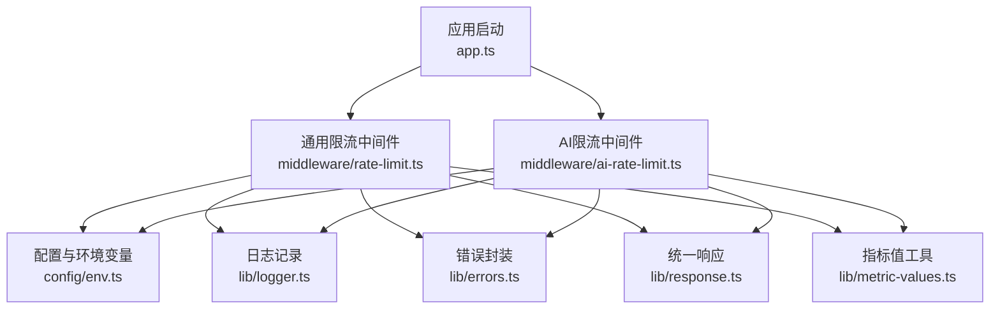
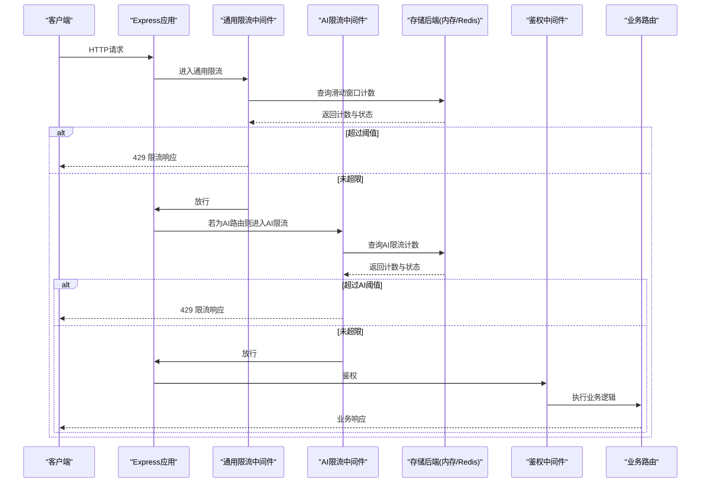
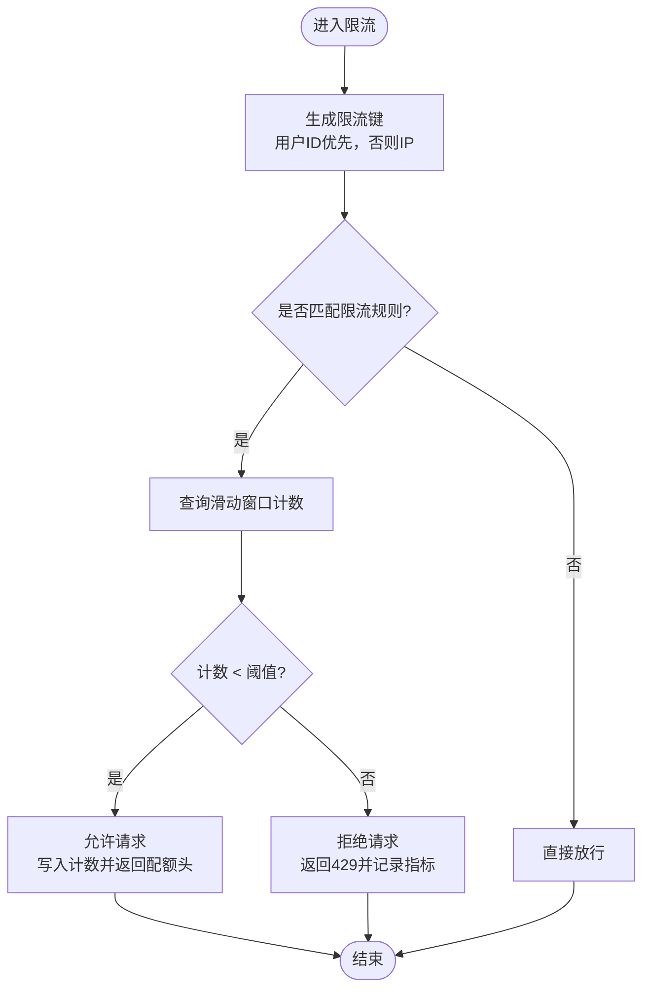
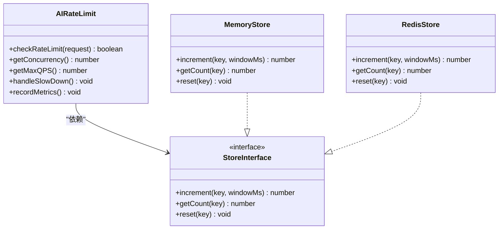
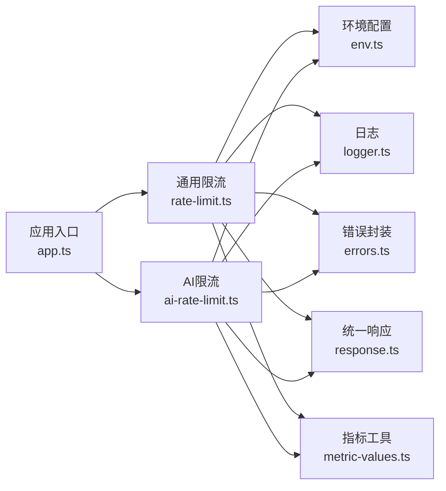

# 请求限流中间件

<cite>
**本文引用的文件**   
- [rate-limit.ts](file://server/src/middleware/rate-limit.ts)
- [ai-rate-limit.ts](file://server/src/middleware/ai-rate-limit.ts)
- [app.ts](file://server/src/app.ts)
- [env.ts](file://server/src/config/env.ts)
- [logger.ts](file://server/src/lib/logger.ts)
- [errors.ts](file://server/src/lib/errors.ts)
- [response.ts](file://server/src/lib/response.ts)
- [metric-values.ts](file://server/src/lib/metric-values.ts)
</cite>

## 目录
1. [简介](#简介)
2. [项目结构](#项目结构)
3. [核心组件](#核心组件)
4. [架构总览](#架构总览)
5. [详细组件分析](#详细组件分析)
6. [依赖分析](#依赖分析)
7. [性能考量](#性能考量)
8. [故障排查指南](#故障排查指南)
9. [结论](#结论)
10. [附录](#附录)

## 简介
本文件面向FY200项目的“请求限流中间件”，聚焦以下目标：
- 基于IP与用户ID的限流策略实现，支持滑动窗口算法、内存存储与Redis持久化选项。
- 不同API端点的差异化限流配置，突发流量处理与降级策略。
- 限流统计监控、动态调整配置与性能影响分析。
- 限流规则设计最佳实践与常见问题排查指南。

本项目后端技术栈为Express 4 + Prisma 5 + PostgreSQL 15 + JWT + DeepSeek API（SSE 流式）。中间件执行链顺序为：helmet → cors → express.json → rate-limit → auth(JWT+黑名单) → permission(默认拒绝) → scope(Prisma extension) → softDelete → audit → Service → Prisma → PostgreSQL。

## 项目结构
限流相关代码主要位于 server/src/middleware 目录，包含通用限流与AI专用限流两个中间件；应用入口在 app.ts 中注册限流中间件；配置项通过 env.ts 注入；日志、错误与指标等能力由 lib 下的模块提供。

图表来源
- [app.ts](file://server/src/app.ts)
- [rate-limit.ts](file://server/src/middleware/rate-limit.ts)
- [ai-rate-limit.ts](file://server/src/middleware/ai-rate-limit.ts)
- [env.ts](file://server/src/config/env.ts)
- [logger.ts](file://server/src/lib/logger.ts)
- [errors.ts](file://server/src/lib/errors.ts)
- [response.ts](file://server/src/lib/response.ts)
- [metric-values.ts](file://server/src/lib/metric-values.ts)

章节来源
- [app.ts](file://server/src/app.ts)
- [rate-limit.ts](file://server/src/middleware/rate-limit.ts)
- [ai-rate-limit.ts](file://server/src/middleware/ai-rate-limit.ts)
- [env.ts](file://server/src/config/env.ts)

## 核心组件
- 通用限流中间件：对全部或指定路由按IP与用户ID维度进行限流，支持滑动窗口计数、内存与Redis两种存储后端。
- AI限流中间件：针对AI代理接口（如DeepSeek SSE）做更严格的速率控制与并发限制，避免外部LLM调用风暴。
- 配置与环境：通过环境变量集中管理限流阈值、窗口大小、存储后端选择、是否启用Redis等。
- 监控与可观测性：记录限流命中、拒绝、延迟等指标，便于告警与容量规划。

章节来源
- [rate-limit.ts](file://server/src/middleware/rate-limit.ts)
- [ai-rate-limit.ts](file://server/src/middleware/ai-rate-limit.ts)
- [env.ts](file://server/src/config/env.ts)
- [metric-values.ts](file://server/src/lib/metric-values.ts)

## 架构总览
下图展示了限流中间件在Express请求链路中的位置与交互关系，以及可选的Redis后端。

图表来源
- [app.ts](file://server/src/app.ts)
- [rate-limit.ts](file://server/src/middleware/rate-limit.ts)
- [ai-rate-limit.ts](file://server/src/middleware/ai-rate-limit.ts)

## 详细组件分析

### 通用限流中间件（基于IP与用户ID）
- 限流键生成：优先使用用户ID（已认证），否则回退到IP地址；可按路径前缀或具体路由区分。
- 滑动窗口算法：维护时间窗口内的请求计数，窗口滚动更新，避免固定窗口边界抖动问题。
- 存储后端：
  - 内存模式：进程内Map存储，适合单机部署与低延迟场景。
  - Redis模式：分布式共享计数，适合多实例部署与高可用场景。
- 差异化配置：支持按路由分组设置不同的QPS、窗口大小、突发允许量等。
- 响应行为：超限返回429并附带重试建议；未超限正常放行并在响应头携带剩余配额信息。
- 监控指标：记录限流命中率、拒绝率、平均延迟、峰值QPS等。

图表来源
- [rate-limit.ts](file://server/src/middleware/rate-limit.ts)

章节来源
- [rate-limit.ts](file://server/src/middleware/rate-limit.ts)

### AI限流中间件（AI代理与SSE流式）
- 适用场景：DeepSeek API调用、SSE长连接、结构化分析与文本润色管道。
- 限流策略：
  - 更严格的QPS与并发上限，防止外部LLM服务过载。
  - 支持按用户或租户隔离，避免单用户独占资源。
  - 突发流量采用令牌桶或漏桶平滑，结合排队与快速失败。
- 降级策略：当上游不可用或限流频繁时，返回友好提示与重试间隔，必要时切换只读或缓存模式。
- 监控与告警：记录SSE连接数、流式字节吞吐、超时与错误码分布。

图表来源
- [ai-rate-limit.ts](file://server/src/middleware/ai-rate-limit.ts)

章节来源
- [ai-rate-limit.ts](file://server/src/middleware/ai-rate-limit.ts)

### 配置与环境变量
- 关键配置项：
  - 存储后端选择：内存或Redis。
  - 窗口大小与步长：决定滑动窗口的粒度与精度。
  - 各路由组限流阈值：QPS、并发、突发允许量。
  - 是否启用Redis、连接参数与键前缀。
  - 监控开关与指标输出格式。
- 动态调整：支持热更新配置（如通过配置中心或环境变量重载），无需重启服务。

章节来源
- [env.ts](file://server/src/config/env.ts)

### 监控与指标
- 指标类型：
  - 限流命中率、拒绝率、平均延迟、P95/P99延迟。
  - 各路由组QPS、并发峰值、Redis命中率与延迟。
- 指标采集：在中间件内部记录，并通过统一指标模块聚合上报。
- 可视化与告警：对接监控系统（如Prometheus/Grafana），设置阈值告警。

章节来源
- [metric-values.ts](file://server/src/lib/metric-values.ts)

## 依赖分析
- 中间件耦合度：
  - 通用限流与AI限流均依赖存储抽象层，便于替换后端。
  - 与日志、错误、响应模块解耦，保证职责单一。
- 外部依赖：
  - Redis作为可选分布式存储，需考虑连接池与网络延迟。
  - 日志与指标模块用于可观测性。
- 潜在循环依赖：无直接循环导入，中间件按顺序挂载。

图表来源
- [rate-limit.ts](file://server/src/middleware/rate-limit.ts)
- [ai-rate-limit.ts](file://server/src/middleware/ai-rate-limit.ts)
- [env.ts](file://server/src/config/env.ts)
- [logger.ts](file://server/src/lib/logger.ts)
- [errors.ts](file://server/src/lib/errors.ts)
- [response.ts](file://server/src/lib/response.ts)
- [metric-values.ts](file://server/src/lib/metric-values.ts)
- [app.ts](file://server/src/app.ts)

章节来源
- [app.ts](file://server/src/app.ts)
- [rate-limit.ts](file://server/src/middleware/rate-limit.ts)
- [ai-rate-limit.ts](file://server/src/middleware/ai-rate-limit.ts)
- [env.ts](file://server/src/config/env.ts)

## 性能考量
- 滑动窗口复杂度：每次请求O(1)计数更新，窗口清理按需进行，避免全量扫描。
- 内存模式：极低延迟，但受进程内存限制，不适合大规模多实例。
- Redis模式：分布式一致性更好，但存在网络开销；建议开启连接池与本地缓存热点键。
- 突发流量：通过突发允许量与平滑算法降低瞬时峰值冲击。
- 降级策略：Redis不可用时自动回退内存模式或快速失败，保障核心功能可用。
- 指标采样：高频指标采用采样与批处理，减少写入压力。

[本节为通用性能指导，不直接分析具体文件]

## 故障排查指南
- 常见现象：
  - 大量429响应：检查限流阈值是否过低、窗口大小是否合理、是否存在热点IP或用户。
  - Redis连接失败：检查网络连通性、凭据与连接池配置，确认是否触发降级。
  - 指标缺失：确认监控开关与上报通道是否正常。
- 排查步骤：
  - 查看限流命中日志与错误码分布。
  - 检查各路由组的阈值与当前计数。
  - 验证Redis健康状态与延迟。
  - 评估突发流量来源与异常请求模式。
- 修复建议：
  - 动态调高阈值或扩大窗口，观察效果。
  - 对热点IP实施白名单或单独限速策略。
  - 优化Redis连接与缓存策略，必要时引入本地缓存。

章节来源
- [logger.ts](file://server/src/lib/logger.ts)
- [errors.ts](file://server/src/lib/errors.ts)
- [response.ts](file://server/src/lib/response.ts)
- [metric-values.ts](file://server/src/lib/metric-values.ts)

## 结论
本限流中间件以滑动窗口为核心，结合内存与Redis双后端，满足单机与分布式场景下的精细化限流需求。通过差异化配置与AI专用限流，有效保护后端与外部LLM服务。完善的监控与降级策略确保系统在突发流量与异常情况下保持稳定。建议在生产环境中结合业务特征持续优化阈值与窗口参数，并建立完善的告警与演练机制。

[本节为总结性内容，不直接分析具体文件]

## 附录
- 限流规则设计最佳实践：
  - 按路由分组设置阈值，敏感接口更严格。
  - 用户维度优先于IP维度，避免共享IP误伤。
  - 滑动窗口粒度适中，平衡精度与开销。
  - 突发允许量不宜过大，防止雪崩。
  - 定期复盘指标，动态调整阈值。
- 常见问题FAQ：
  - Q：如何判断是限流导致的问题？A：查看429比例与限流命中日志。
  - Q：Redis不可用会怎样？A：自动降级至内存模式或快速失败。
  - Q：如何扩容？A：启用Redis并增加实例，保持键空间隔离。

[本节为补充说明，不直接分析具体文件]