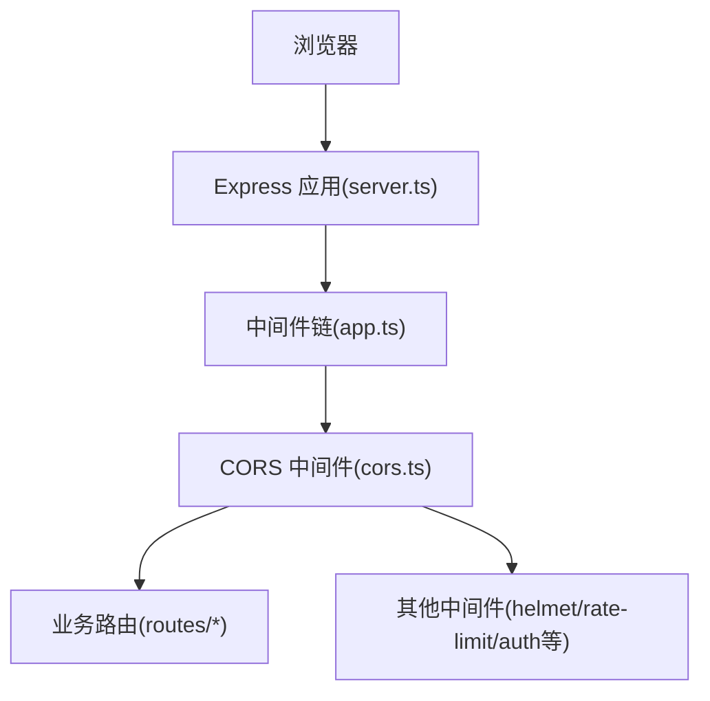
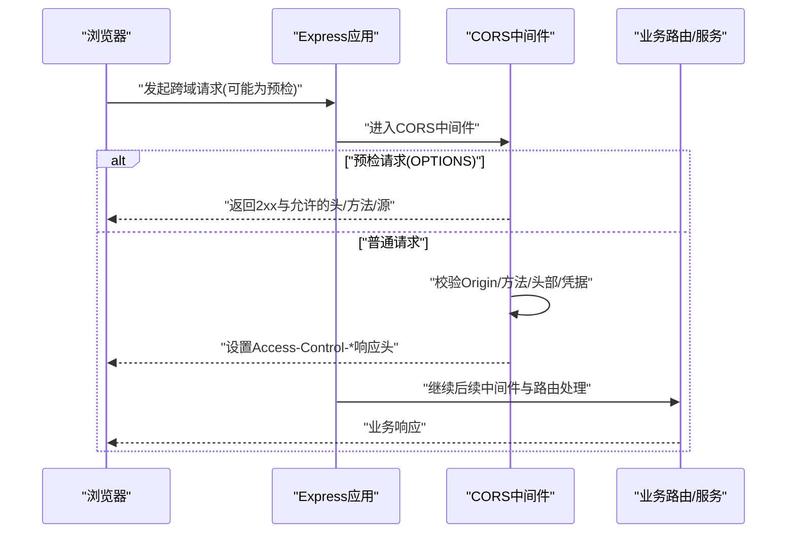
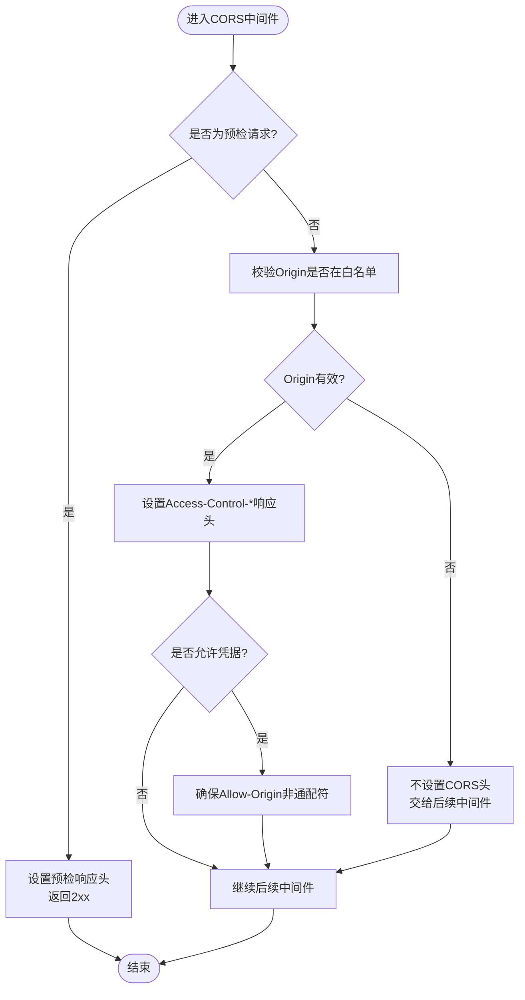
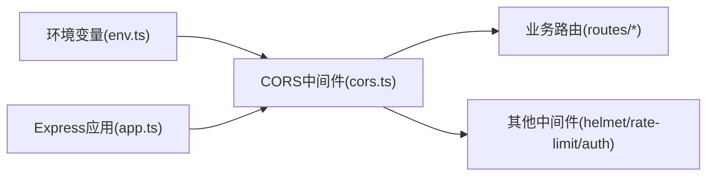

# 跨域配置中间件（CORS）

<cite>
**本文引用的文件**   
- [server/src/middleware/cors.ts](file://server/src/middleware/cors.ts)
- [server/src/app.ts](file://server/src/app.ts)
- [server/src/server.ts](file://server/src/server.ts)
- [server/src/config/env.ts](file://server/src/config/env.ts)
- [server/scripts/cors-check.ts](file://server/scripts/cors-check.ts)
</cite>

## 目录
1. [简介](#简介)
2. [项目结构](#项目结构)
3. [核心组件](#核心组件)
4. [架构总览](#架构总览)
5. [详细组件分析](#详细组件分析)
6. [依赖关系分析](#依赖关系分析)
7. [性能考虑](#性能考虑)
8. [故障排查指南](#故障排查指南)
9. [结论](#结论)
10. [附录](#附录)

## 简介
本文件面向FY200项目的CORS跨域配置中间件，系统性说明跨域请求的处理机制、开发/生产环境策略差异、预检请求处理流程与错误处理。文档同时给出前端集成要点、安全注意事项、性能优化建议以及常见问题的定位方法，帮助开发者快速理解并正确配置跨域策略。

## 项目结构
CORS相关代码位于后端Express应用的中间件层，并在应用初始化时按固定顺序挂载。关键位置如下：
- 中间件实现：server/src/middleware/cors.ts
- 应用装配：server/src/app.ts（注册中间件与路由）
- 服务启动：server/src/server.ts（监听端口与环境加载）
- 环境变量：server/src/config/env.ts（读取CORS相关配置）
- 调试脚本：server/scripts/cors-check.ts（用于验证CORS行为）

图表来源
- [server/src/server.ts](file://server/src/server.ts)
- [server/src/app.ts](file://server/src/app.ts)
- [server/src/middleware/cors.ts](file://server/src/middleware/cors.ts)

章节来源
- [server/src/middleware/cors.ts](file://server/src/middleware/cors.ts)
- [server/src/app.ts](file://server/src/app.ts)
- [server/src/server.ts](file://server/src/server.ts)
- [server/src/config/env.ts](file://server/src/config/env.ts)
- [server/scripts/cors-check.ts](file://server/scripts/cors-check.ts)

## 核心组件
- CORS中间件：负责解析请求的Origin、方法与头部，依据配置动态设置响应头，决定是否放行或拒绝跨域请求。
- 环境变量：通过env模块暴露CORS白名单、允许的方法与头部、是否允许凭据等开关。
- 应用装配：在Express中按顺序挂载CORS中间件，确保其早于鉴权与限流等逻辑执行。
- 调试脚本：提供本地CORS校验能力，便于开发与联调阶段快速定位问题。

章节来源
- [server/src/middleware/cors.ts](file://server/src/middleware/cors.ts)
- [server/src/config/env.ts](file://server/src/config/env.ts)
- [server/src/app.ts](file://server/src/app.ts)
- [server/scripts/cors-check.ts](file://server/scripts/cors-check.ts)

## 架构总览
CORS中间件处于Express中间件链的前端，优先于认证、权限与速率限制等逻辑。其职责是：
- 识别并处理预检请求（OPTIONS），直接返回允许的响应头后结束。
- 对非预检请求，根据Origin与方法判断是否允许跨域，并设置相应响应头。
- 与后续中间件协作，确保跨域策略不干扰业务鉴权与安全控制。

图表来源
- [server/src/middleware/cors.ts](file://server/src/middleware/cors.ts)
- [server/src/app.ts](file://server/src/app.ts)

## 详细组件分析

### CORS中间件实现与行为
- 预检请求处理
  - 当请求方法为OPTIONS且包含跨域上下文时，中间件会直接设置允许的来源、方法与头部，并返回成功状态码，不再进入后续中间件。
- 普通请求处理
  - 校验请求Origin是否在允许列表中；若允许，则设置Access-Control-Allow-Origin、Access-Control-Allow-Methods、Access-Control-Allow-Headers等响应头。
  - 当允许携带凭据时，设置Access-Control-Allow-Credentials为true，并确保Allow-Origin不为通配符。
- 错误与边界
  - 未匹配到允许来源或方法时，跳过CORS头设置，交由后续中间件处理（通常会被鉴权或错误处理器拦截）。
  - 对非法或不安全的组合进行防御性检查，避免误放行。

图表来源
- [server/src/middleware/cors.ts](file://server/src/middleware/cors.ts)

章节来源
- [server/src/middleware/cors.ts](file://server/src/middleware/cors.ts)

### 环境变量与配置项
- 允许的来源列表：用于限定可跨域的域名集合，支持开发环境与生产环境的差异化配置。
- 允许的方法与头部：定义跨域请求允许使用的HTTP方法与自定义头部。
- 凭据开关：控制是否允许携带Cookie、Authorization等凭据。
- 日志与调试：可选输出CORS决策过程，便于问题定位。

章节来源
- [server/src/config/env.ts](file://server/src/config/env.ts)
- [server/src/middleware/cors.ts](file://server/src/middleware/cors.ts)

### 应用装配与执行顺序
- 中间件顺序：helmet → cors → express.json → rate-limit → auth → permission → scope → soft-delete → audit → Service → Prisma → PostgreSQL。
- CORS必须尽早挂载，以确保所有跨域请求在进入鉴权之前得到正确的响应头处理。
- 路由注册在CORS之后，保证业务接口受CORS策略保护。

章节来源
- [server/src/app.ts](file://server/src/app.ts)
- [server/src/server.ts](file://server/src/server.ts)

### 调试脚本与测试用例
- 本地CORS校验脚本：用于模拟浏览器跨域请求，验证不同场景下的响应头与状态码。
- 典型用例：
  - 预检请求（OPTIONS）应返回允许的头与方法。
  - 带凭据的请求需确保Allow-Origin非通配符。
  - 不在白名单的Origin应被拒绝（不设置CORS头）。

章节来源
- [server/scripts/cors-check.ts](file://server/scripts/cors-check.ts)

## 依赖关系分析
- 中间件依赖：CORS中间件依赖环境变量模块获取配置，不直接依赖数据库或外部服务。
- 应用依赖：Express应用按顺序挂载中间件，CORS与Helmet、RateLimit、Auth等共同构成安全与访问控制链。
- 外部依赖：浏览器同源策略与HTTP协议规范驱动CORS行为。

图表来源
- [server/src/config/env.ts](file://server/src/config/env.ts)
- [server/src/middleware/cors.ts](file://server/src/middleware/cors.ts)
- [server/src/app.ts](file://server/src/app.ts)

章节来源
- [server/src/config/env.ts](file://server/src/config/env.ts)
- [server/src/middleware/cors.ts](file://server/src/middleware/cors.ts)
- [server/src/app.ts](file://server/src/app.ts)

## 性能考虑
- 最小化计算：CORS决策基于白名单与简单规则，时间复杂度接近O(1)，开销极低。
- 减少重复：预检请求由服务端直接响应，避免不必要的业务链路调用。
- 缓存策略：如需扩展复杂规则，可在内存中缓存白名单与规则映射，避免频繁I/O。
- 日志控制：生产环境建议关闭详细CORS日志，降低IO压力。

[本节为通用指导，无需引用具体文件]

## 故障排查指南
- 常见问题
  - Access-Control-Allow-Origin缺失：检查Origin是否在白名单内，且中间件已正确挂载。
  - 预检失败：确认请求方法、头部与凭据配置与后端一致。
  - 凭据报错：当Allow-Credentials为true时，Allow-Origin不能为*，需显式指定来源。
  - 自定义头部无效：确保客户端发送的自定义头部在服务端Allow-Headers中声明。
- 调试步骤
  - 使用cors-check脚本模拟请求，观察响应头与状态码。
  - 开启CORS调试日志，查看决策路径与拒绝原因。
  - 对比开发/生产环境的环境变量差异，确认白名单与开关配置。
- 常见错误定位
  - 浏览器控制台报“跨域”错误：优先检查预检响应与Allow-Headers。
  - Cookie未携带：确认Allow-Credentials与Allow-Origin配置一致，且前端设置了withCredentials。

章节来源
- [server/scripts/cors-check.ts](file://server/scripts/cors-check.ts)
- [server/src/middleware/cors.ts](file://server/src/middleware/cors.ts)
- [server/src/config/env.ts](file://server/src/config/env.ts)

## 结论
CORS中间件在FY200项目中承担跨域策略的核心职责，通过严格的来源白名单、方法与头部控制、凭据开关，保障前后端分离架构的安全与稳定。合理的环境变量配置、清晰的中间件顺序与完善的调试手段，是避免跨域问题的关键。建议在开发环境放宽策略以提升效率，在生产环境严格收敛白名单与功能开关，结合监控与日志持续优化。

[本节为总结性内容，无需引用具体文件]

## 附录

### 前端集成示例（要点）
- 设置请求头：确保携带必要的自定义头部，并在服务端Allow-Headers中声明。
- 携带凭据：前端启用withCredentials，后端Allow-Credentials为true且Allow-Origin非通配符。
- 预检兼容：框架默认会发送预检请求，确保后端正确处理OPTIONS。

[本节为概念性指导，无需引用具体文件]

### 安全考虑
- 白名单最小化：仅放行必要域名，避免使用通配符。
- 方法受限：只允许业务所需HTTP方法。
- 头部白名单：仅开放必要自定义头部，防止信息泄露。
- 凭据谨慎：仅在必要时开启凭据，并确保来源精确匹配。

[本节为概念性指导，无需引用具体文件]

### 性能优化建议
- 预检缓存：对高频预检请求可引入短期缓存，减少重复决策。
- 日志分级：生产环境降低CORS日志级别，避免过多IO。
- 规则简化：保持CORS规则简洁，避免复杂计算影响响应延迟。

[本节为概念性指导，无需引用具体文件]