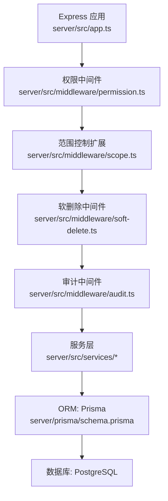
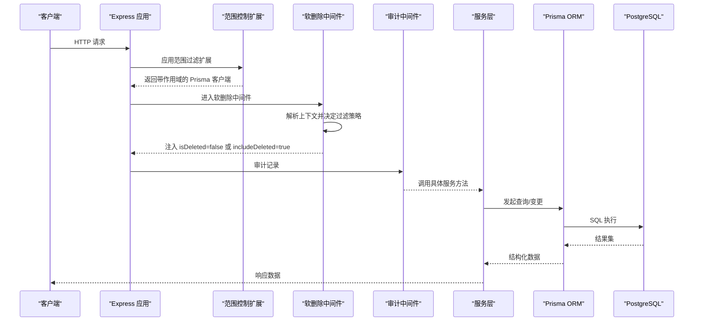
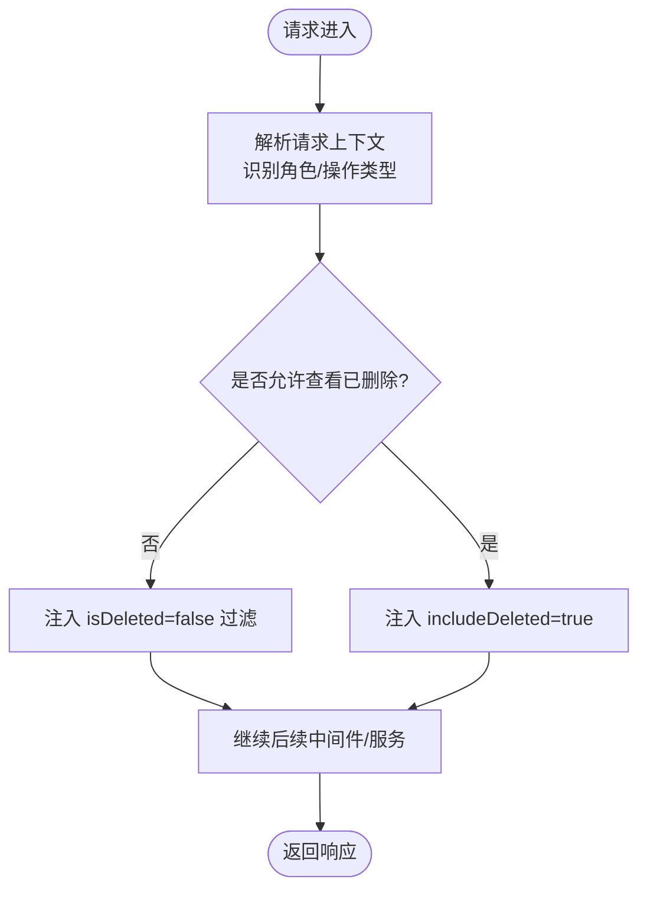
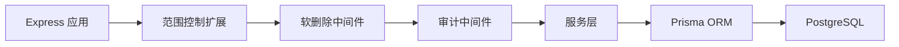

# 软删除中间件

<cite>
**本文引用的文件**   
- [soft-delete.ts](file://server/src/middleware/soft-delete.ts)
- [soft-delete.test.ts](file://server/src/middleware/soft-delete.test.ts)
- [scope.ts](file://server/src/middleware/scope.ts)
- [schema.prisma](file://server/prisma/schema.prisma)
- [app.ts](file://server/src/app.ts)
- [middleware/audit.ts](file://server/src/middleware/audit.ts)
</cite>

## 目录
1. [简介](#简介)
2. [项目结构](#项目结构)
3. [核心组件](#核心组件)
4. [架构总览](#架构总览)
5. [详细组件分析](#详细组件分析)
6. [依赖关系分析](#依赖关系分析)
7. [性能考量](#性能考量)
8. [故障排查指南](#故障排查指南)
9. [结论](#结论)
10. [附录](#附录)

## 简介
本文件面向FY200项目的软删除中间件，系统性阐述其实现原理与工程实践。内容涵盖：
- 逻辑删除标记、查询自动过滤与级联删除处理
- 删除恢复功能、数据一致性保证与性能影响分析
- 软删除字段设计、索引优化与迁移策略
- 最佳实践、数据清理策略与故障恢复方案

本项目后端技术栈为 Express 4 + Prisma 5 + PostgreSQL 15，中间件执行链顺序为：helmet → cors → express.json → rate-limit → auth(JWT+黑名单) → permission(默认拒绝) → scope(Prisma extension) → softDelete → audit → Service → Prisma → PostgreSQL。软删除中间件位于该链路中，负责在请求上下文中注入“已删除”过滤条件，确保业务层对“已删除”数据的透明屏蔽与受控恢复。

## 项目结构
软删除相关代码主要位于 server/src/middleware 目录，配合 Prisma 模型定义与测试用例共同构成完整能力。

图表来源
- [app.ts](file://server/src/app.ts)
- [scope.ts](file://server/src/middleware/scope.ts)
- [soft-delete.ts](file://server/src/middleware/soft-delete.ts)
- [audit.ts](file://server/src/middleware/audit.ts)
- [schema.prisma](file://server/prisma/schema.prisma)

章节来源
- [app.ts](file://server/src/app.ts)
- [soft-delete.ts](file://server/src/middleware/soft-delete.ts)
- [soft-delete.test.ts](file://server/src/middleware/soft-delete.test.ts)
- [schema.prisma](file://server/prisma/schema.prisma)

## 核心组件
- 软删除中间件：在请求生命周期内注入 Prisma 查询过滤条件，统一屏蔽 isDeleted=true 的记录；支持显式包含已删除记录的查询模式（如管理后台）。
- 软删除测试：覆盖常见场景（默认过滤、显式包含、恢复操作、批量删除）以确保行为稳定。
- 范围控制扩展：与软删除协作，确保租户/组织维度下的数据隔离与过滤叠加。
- Prisma 模型：通过 isDeleted 字段与可选的 deletedAt 时间戳记录删除状态，便于审计与恢复。

章节来源
- [soft-delete.ts](file://server/src/middleware/soft-delete.ts)
- [soft-delete.test.ts](file://server/src/middleware/soft-delete.test.ts)
- [scope.ts](file://server/src/middleware/scope.ts)
- [schema.prisma](file://server/prisma/schema.prisma)

## 架构总览
下图展示软删除在中间件链中的位置及其与 Prisma 扩展的协作方式。

图表来源
- [app.ts](file://server/src/app.ts)
- [scope.ts](file://server/src/middleware/scope.ts)
- [soft-delete.ts](file://server/src/middleware/soft-delete.ts)
- [audit.ts](file://server/src/middleware/audit.ts)

## 详细组件分析

### 软删除中间件实现原理
- 逻辑删除标记：在数据模型中引入 isDeleted 布尔字段，必要时配合 deletedAt 时间戳用于审计与恢复窗口控制。
- 查询自动过滤：中间件在请求进入时，向 Prisma 客户端注入 where 条件，默认屏蔽 isDeleted=true 的记录。
- 显式包含已删除：对于管理后台或审计场景，可通过上下文标志位（如 includeDeleted）允许查询包含已删除数据。
- 级联删除处理：当父记录被软删除时，子记录可选择性继承 isDeleted 标记，避免孤儿数据；恢复时需按层级同步恢复。
- 恢复功能：提供恢复接口将 isDeleted 重置为 false，并可选回填 deletedAt 到 restoredAt 等字段以记录恢复轨迹。

图表来源
- [soft-delete.ts](file://server/src/middleware/soft-delete.ts)

章节来源
- [soft-delete.ts](file://server/src/middleware/soft-delete.ts)
- [soft-delete.test.ts](file://server/src/middleware/soft-delete.test.ts)

### 软删除字段设计与索引优化
- 字段设计建议：
  - isDeleted: boolean，默认 false，作为主过滤条件。
  - deletedAt: timestamp，记录删除时间，便于审计与保留策略。
  - restoredAt: timestamp（可选），记录恢复时间，便于追踪。
- 索引优化建议：
  - 为 isDeleted 建立独立索引，加速默认过滤查询。
  - 若频繁按 deletedAt 排序或范围查询，可建立复合索引 (isDeleted, deletedAt)。
  - 针对多租户/组织维度，建立 (tenantId/orgId, isDeleted) 复合索引以提升隔离查询性能。
- 迁移策略：
  - 新增 isDeleted 与 deletedAt 字段，设置默认值与约束。
  - 对历史数据进行一次性扫描，标记已归档/废弃的数据为 isDeleted=true。
  - 逐步替换硬删除逻辑为软删除，并在关键路径增加回滚脚本。

章节来源
- [schema.prisma](file://server/prisma/schema.prisma)

### 删除恢复与数据一致性
- 恢复流程：
  - 校验恢复权限与目标记录存在性。
  - 更新 isDeleted=false，并记录 restoredAt。
  - 若启用级联软删除，需递归恢复子记录并保持层级一致。
- 一致性保障：
  - 使用事务包裹恢复操作，确保父子记录状态一致。
  - 对并发恢复进行幂等控制，避免重复恢复导致状态错乱。
  - 审计日志记录恢复前后快照，便于回溯。

章节来源
- [soft-delete.ts](file://server/src/middleware/soft-delete.ts)
- [soft-delete.test.ts](file://server/src/middleware/soft-delete.test.ts)

### 与范围控制的协作
- 范围控制扩展（scope）负责租户/组织维度的数据隔离，软删除在其之后执行，确保先按范围过滤，再按删除状态过滤。
- 两者组合形成双重过滤：scope.isDeleted=false && scope.tenantId=...，提升查询精确性与安全性。

章节来源
- [scope.ts](file://server/src/middleware/scope.ts)
- [soft-delete.ts](file://server/src/middleware/soft-delete.ts)

### 测试覆盖与边界场景
- 默认过滤：未指定 includeDeleted 时，查询应排除 isDeleted=true 的记录。
- 显式包含：指定 includeDeleted=true 时，查询应包含已删除记录。
- 恢复操作：恢复后记录应可见于默认查询。
- 批量删除：批量软删除应保持事务一致性，失败时全部回滚。

章节来源
- [soft-delete.test.ts](file://server/src/middleware/soft-delete.test.ts)

## 依赖关系分析
软删除中间件依赖 Express 上下文、Prisma 客户端扩展以及审计中间件。其与范围控制扩展协同工作，确保数据隔离与删除状态过滤的正确顺序。

图表来源
- [app.ts](file://server/src/app.ts)
- [scope.ts](file://server/src/middleware/scope.ts)
- [soft-delete.ts](file://server/src/middleware/soft-delete.ts)
- [audit.ts](file://server/src/middleware/audit.ts)

章节来源
- [app.ts](file://server/src/app.ts)
- [scope.ts](file://server/src/middleware/scope.ts)
- [soft-delete.ts](file://server/src/middleware/soft-delete.ts)
- [audit.ts](file://server/src/middleware/audit.ts)

## 性能考量
- 查询开销：isDeleted 过滤会增加 where 条件，但通过合理索引可将开销控制在毫秒级。
- 写入放大：软删除仅更新 isDeleted 与 deletedAt，相比硬删除减少外键约束检查与级联删除成本。
- 缓存策略：对高频查询结果可结合 Redis 缓存，注意失效策略与软删除/恢复事件触发。
- 批处理：批量软删除建议使用事务与分批提交，避免长事务锁表。
- 监控指标：关注慢查询、索引命中率、恢复成功率与审计日志量。

[本节为通用指导，不直接分析具体文件]

## 故障排查指南
- 常见问题：
  - 查询未过滤已删除记录：检查中间件是否生效、上下文标志位是否正确传递。
  - 恢复后仍不可见：确认事务是否提交、索引是否重建、缓存是否过期。
  - 级联恢复不一致：检查恢复逻辑是否递归处理子记录，是否存在循环依赖。
- 诊断步骤：
  - 开启审计日志，定位请求上下文与 Prisma 查询语句。
  - 验证 isDeleted 字段与索引状态，必要时重建索引。
  - 使用测试用例复现问题，逐步缩小范围。

章节来源
- [soft-delete.test.ts](file://server/src/middleware/soft-delete.test.ts)
- [audit.ts](file://server/src/middleware/audit.ts)

## 结论
软删除中间件通过统一的过滤机制与上下文控制，实现了透明、安全、可恢复的逻辑删除能力。结合合理的字段设计、索引优化与迁移策略，可在保证数据一致性的同时提升系统性能与可维护性。建议在生产环境中持续监控关键指标，并定期评估清理策略与恢复演练效果。

[本节为总结性内容，不直接分析具体文件]

## 附录
- 最佳实践：
  - 所有写操作优先使用软删除，避免硬删除带来的数据丢失风险。
  - 对敏感数据增加审计日志与访问控制，防止越权查看已删除数据。
  - 定期清理长期未恢复的已删除数据，降低存储压力。
- 数据清理策略：
  - 基于 deletedAt 设定保留周期，超过周期的数据归档至冷存储。
  - 清理任务采用异步队列，避免阻塞在线服务。
- 故障恢复方案：
  - 建立快照与增量备份，支持按时间点恢复。
  - 恢复演练定期执行，确保流程可操作且数据一致。

[本节为通用指导，不直接分析具体文件]