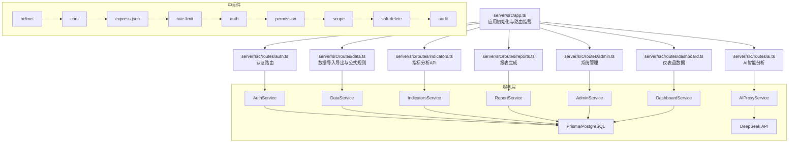
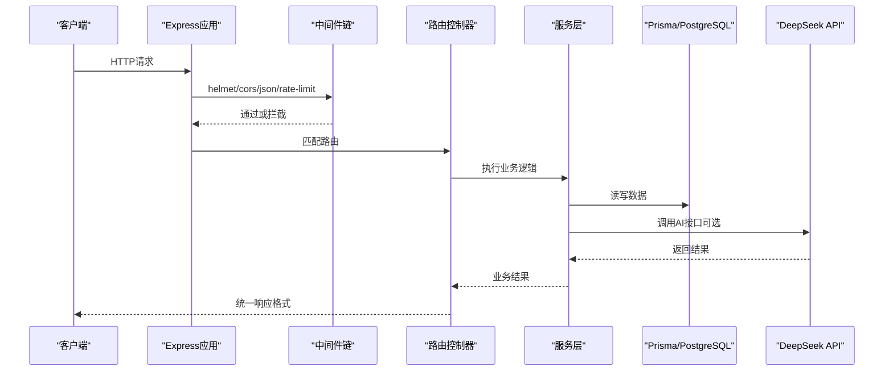
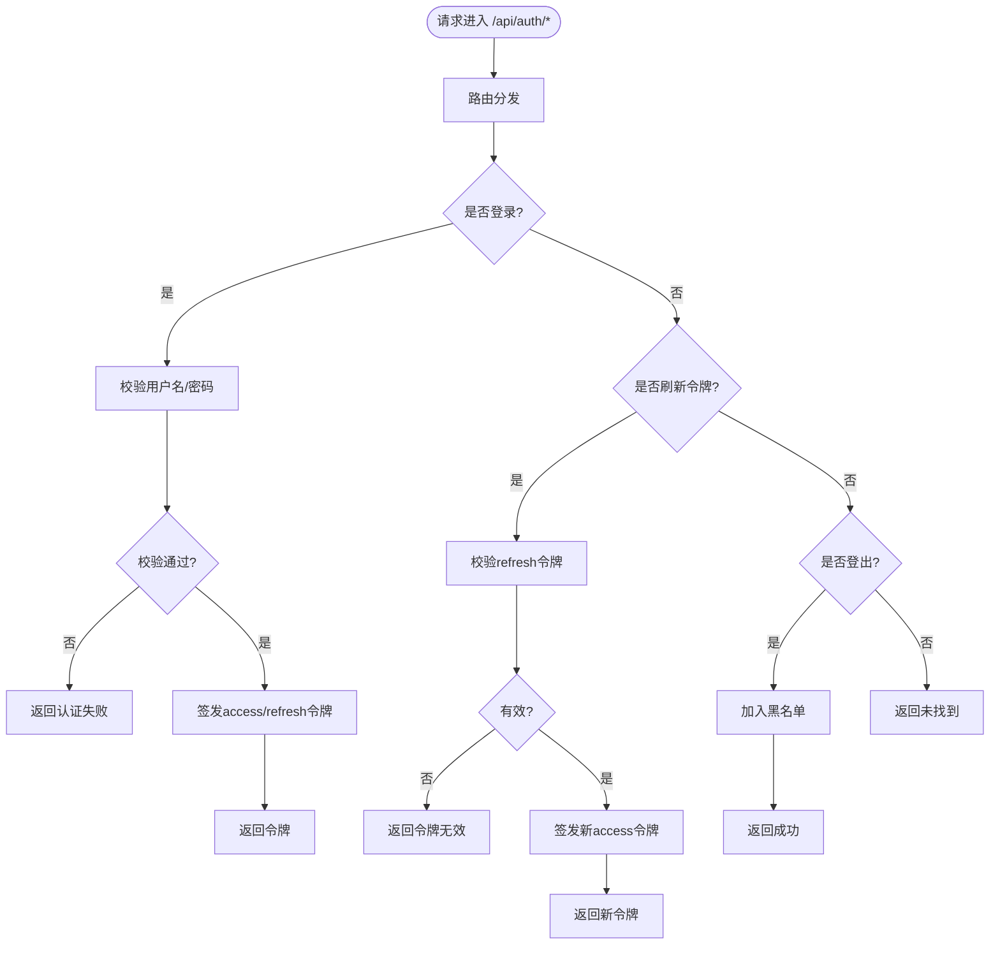
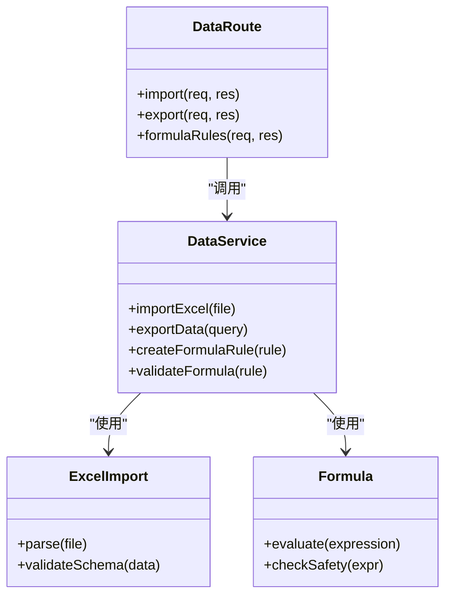
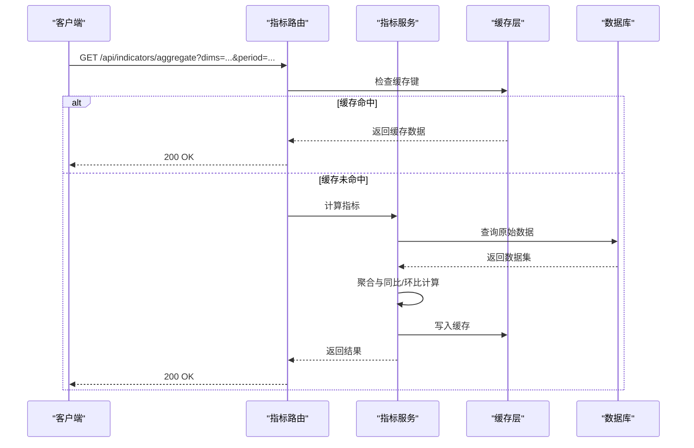
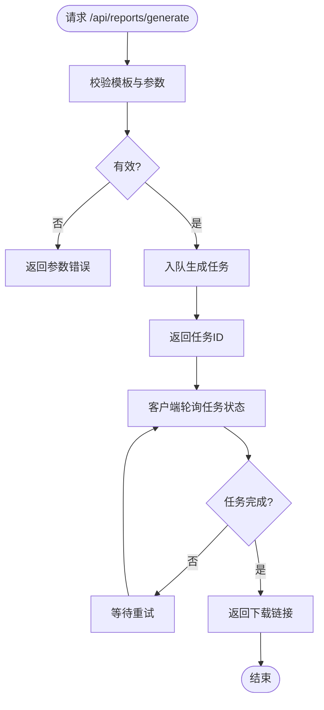
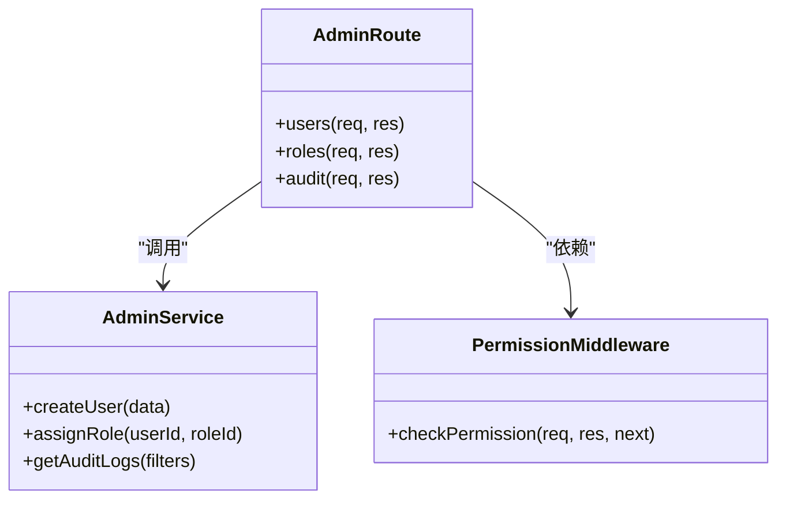
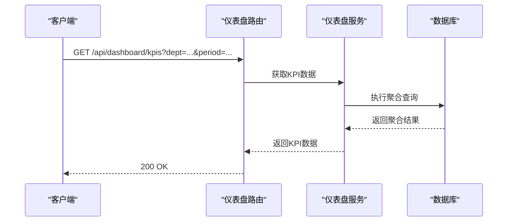
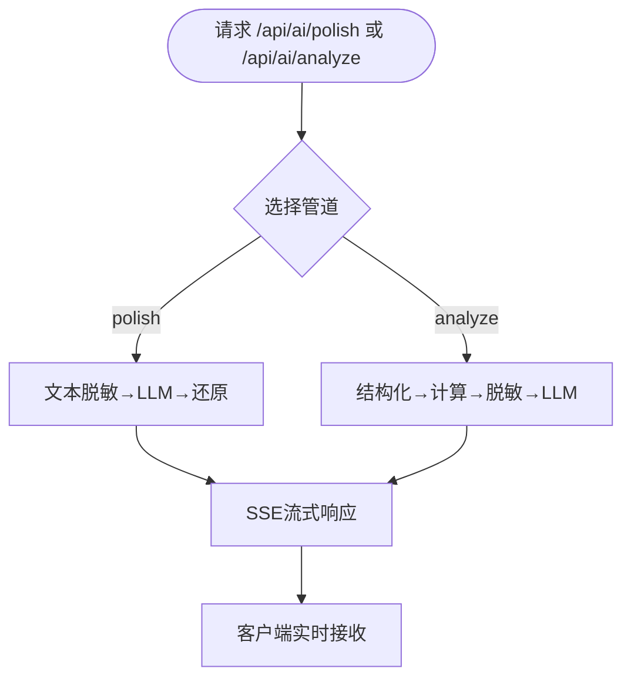
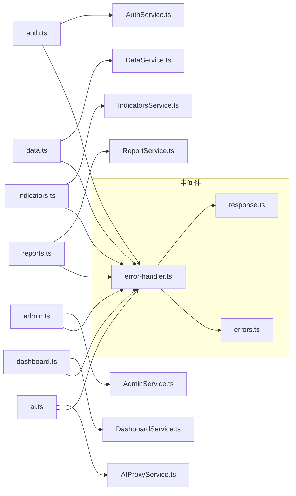

# 路由文件结构与组织

<cite>
**本文引用的文件**   
- [server/src/app.ts](file://server/src/app.ts)
- [server/src/server.ts](file://server/src/server.ts)
- [server/src/routes/auth.ts](file://server/src/routes/auth.ts)
- [server/src/routes/data.ts](file://server/src/routes/data.ts)
- [server/src/routes/indicators.ts](file://server/src/routes/indicators.ts)
- [server/src/routes/reports.ts](file://server/src/routes/reports.ts)
- [server/src/routes/admin.ts](file://server/src/routes/admin.ts)
- [server/src/routes/dashboard.ts](file://server/src/routes/dashboard.ts)
- [server/src/routes/ai.ts](file://server/src/routes/ai.ts)
- [server/src/middleware/error-handler.ts](file://server/src/middleware/error-handler.ts)
- [server/src/lib/errors.ts](file://server/src/lib/errors.ts)
- [server/src/lib/response.ts](file://server/src/lib/response.ts)
- [server/src/services/AuthService.ts](file://server/src/services/AuthService.ts)
- [server/src/services/DataService.ts](file://server/src/services/DataService.ts)
- [server/src/services/IndicatorsService.ts](file://server/src/services/IndicatorsService.ts)
- [server/src/services/ReportService.ts](file://server/src/services/ReportService.ts)
- [server/src/services/AdminService.ts](file://server/src/services/AdminService.ts)
- [server/src/services/DashboardService.ts](file://server/src/services/DashboardService.ts)
- [server/src/services/AIProxyService.ts](file://server/src/services/AIProxyService.ts)
</cite>

## 目录
1. [简介](#简介)
2. [项目结构](#项目结构)
3. [核心组件](#核心组件)
4. [架构总览](#架构总览)
5. [详细组件分析](#详细组件分析)
6. [依赖关系分析](#依赖关系分析)
7. [性能考量](#性能考量)
8. [故障排查指南](#故障排查指南)
9. [结论](#结论)

## 简介
本文件面向FY200项目的后端路由层，系统化阐述按功能域划分的路由文件组织策略与实现细节。项目采用Express 4作为HTTP框架，Prisma 5访问PostgreSQL 15，JWT进行鉴权（access 15分钟、refresh 7天轮转），并集成DeepSeek API提供AI智能分析能力。中间件执行链顺序为：helmet → cors → express.json → rate-limit → auth(JWT+黑名单) → permission(默认拒绝) → scope(Prisma extension) → softDelete → audit → Service → Prisma → PostgreSQL。计算类指标使用安全公式解析（白名单算子 +-*/()，禁止 eval），同比/环比由后端实时计算不存库。AI双管道架构：polish（文本→脱敏→LLM→还原）/ analyze（结构化→计算→脱敏→LLM→生成）。

## 项目结构
后端路由位于 server/src/routes 下，每个功能域一个路由文件，统一通过应用入口注册到Express实例。服务层位于 server/src/services，通用工具与错误处理位于 server/src/lib 与 server/src/middleware。

图表来源
- [server/src/app.ts](file://server/src/app.ts)
- [server/src/routes/auth.ts](file://server/src/routes/auth.ts)
- [server/src/routes/data.ts](file://server/src/routes/data.ts)
- [server/src/routes/indicators.ts](file://server/src/routes/indicators.ts)
- [server/src/routes/reports.ts](file://server/src/routes/reports.ts)
- [server/src/routes/admin.ts](file://server/src/routes/admin.ts)
- [server/src/routes/dashboard.ts](file://server/src/routes/dashboard.ts)
- [server/src/routes/ai.ts](file://server/src/routes/ai.ts)

章节来源
- [server/src/app.ts](file://server/src/app.ts)
- [server/src/server.ts](file://server/src/server.ts)

## 核心组件
- 路由文件职责边界
  - auth.ts：用户认证相关接口（登录、登出、令牌刷新），负责校验凭证、签发JWT、维护黑名单与过期策略。
  - data.ts：数据导入导出与公式规则管理，包含Excel导入、模板下载、公式规则CRUD与校验。
  - indicators.ts：指标分析API，提供维度聚合、同比/环比计算、安全公式解析与结果返回。
  - reports.ts：报表生成，支持模板渲染、批量导出与异步任务状态查询。
  - admin.ts：系统管理功能，涵盖用户、角色、权限、审计日志等管理操作。
  - dashboard.ts：仪表盘数据聚合，提供KPI汇总、趋势与分布数据。
  - ai.ts：AI智能分析接口，封装polish与analyze双管道，调用DeepSeek API并流式返回。

- 命名规范与组织结构
  - 路由文件以功能域命名，小写英文复数形式（如 auth.ts、data.ts）。
  - 路由前缀遵循REST风格，资源型接口使用名词复数，动作型接口使用动词短语。
  - 请求体与响应体使用统一的响应包装器，错误码与消息标准化。
  - 每个路由文件仅定义HTTP端点与参数校验，业务逻辑下沉至对应Service层。

- 路由注册机制
  - 应用入口统一加载各路由模块，挂载到Express实例，集中配置中间件链。
  - 路由模块内部通过Router实例组织分组，便于权限控制与版本化管理。

- 模块依赖管理
  - 路由层依赖Service层，Service层依赖Prisma客户端与外部API（如DeepSeek）。
  - 中间件按固定顺序注入，确保鉴权、限流、审计等横切关注点一致生效。

- 错误处理模式
  - 全局错误处理器捕获未处理异常，统一返回标准错误结构。
  - 业务异常通过自定义错误类型抛出，携带错误码与可诊断信息。
  - 输入校验失败返回明确的字段级错误提示。

章节来源
- [server/src/routes/auth.ts](file://server/src/routes/auth.ts)
- [server/src/routes/data.ts](file://server/src/routes/data.ts)
- [server/src/routes/indicators.ts](file://server/src/routes/indicators.ts)
- [server/src/routes/reports.ts](file://server/src/routes/reports.ts)
- [server/src/routes/admin.ts](file://server/src/routes/admin.ts)
- [server/src/routes/dashboard.ts](file://server/src/routes/dashboard.ts)
- [server/src/routes/ai.ts](file://server/src/routes/ai.ts)
- [server/src/lib/response.ts](file://server/src/lib/response.ts)
- [server/src/lib/errors.ts](file://server/src/lib/errors.ts)
- [server/src/middleware/error-handler.ts](file://server/src/middleware/error-handler.ts)

## 架构总览
下图展示从HTTP请求到数据库/外部API的完整调用链路，体现中间件链与服务层解耦。

图表来源
- [server/src/app.ts](file://server/src/app.ts)
- [server/src/middleware/error-handler.ts](file://server/src/middleware/error-handler.ts)
- [server/src/lib/response.ts](file://server/src/lib/response.ts)
- [server/src/services/AIProxyService.ts](file://server/src/services/AIProxyService.ts)

## 详细组件分析

### 认证路由（auth.ts）
- 职责边界
  - 登录：验证用户名/密码，签发access与refresh令牌，记录登录事件。
  - 登出：将token加入黑名单，使旧令牌失效。
  - 刷新令牌：校验refresh令牌有效性，签发新access令牌。
- 代码组织结构
  - 路由分组：/api/auth/login、/api/auth/logout、/api/auth/refresh。
  - 参数校验：请求体验证器前置，确保必填字段与格式正确。
  - 错误处理：统一抛出业务异常，由全局错误处理器格式化。
- 依赖关系
  - 依赖AuthService进行凭证校验与令牌管理。
  - 依赖中间件auth进行后续请求的JWT校验。

图表来源
- [server/src/routes/auth.ts](file://server/src/routes/auth.ts)
- [server/src/services/AuthService.ts](file://server/src/services/AuthService.ts)

章节来源
- [server/src/routes/auth.ts](file://server/src/routes/auth.ts)
- [server/src/services/AuthService.ts](file://server/src/services/AuthService.ts)

### 数据路由（data.ts）
- 职责边界
  - 导入：接收Excel文件，解析数据并入库，支持模板校验与批量插入。
  - 导出：根据查询条件导出数据为Excel，支持分页与过滤。
  - 公式规则：CRUD公式规则，提供语法校验与依赖分析。
- 代码组织结构
  - 路由分组：/api/data/import、/api/data/export、/api/data/formula-rules。
  - 文件上传：使用multipart解析，限制文件大小与类型。
  - 错误处理：文件解析失败、数据校验失败时返回详细错误信息。
- 依赖关系
  - 依赖DataService处理导入导出逻辑与公式规则管理。
  - 依赖lib/excel-import与lib/formula进行数据处理与校验。

图表来源
- [server/src/routes/data.ts](file://server/src/routes/data.ts)
- [server/src/services/DataService.ts](file://server/src/services/DataService.ts)
- [server/src/lib/excel-import.ts](file://server/src/lib/excel-import.ts)
- [server/src/lib/formula.ts](file://server/src/lib/formula.ts)

章节来源
- [server/src/routes/data.ts](file://server/src/routes/data.ts)
- [server/src/services/DataService.ts](file://server/src/services/DataService.ts)

### 指标路由（indicators.ts）
- 职责边界
  - 指标计算：基于维度聚合、时间窗口计算同比/环比。
  - 公式解析：安全解析表达式，防止恶意代码执行。
  - 结果缓存：对热点指标进行短期缓存提升性能。
- 代码组织结构
  - 路由分组：/api/indicators/aggregate、/api/indicators/trend、/api/indicators/formula。
  - 参数校验：维度、时间范围、指标ID等必填字段校验。
  - 错误处理：非法表达式、维度不存在时返回明确错误。
- 依赖关系
  - 依赖IndicatorsService进行指标计算与缓存管理。
  - 依赖Prisma进行数据查询与聚合。

图表来源
- [server/src/routes/indicators.ts](file://server/src/routes/indicators.ts)
- [server/src/services/IndicatorsService.ts](file://server/src/services/IndicatorsService.ts)

章节来源
- [server/src/routes/indicators.ts](file://server/src/routes/indicators.ts)
- [server/src/services/IndicatorsService.ts](file://server/src/services/IndicatorsService.ts)

### 报表路由（reports.ts）
- 职责边界
  - 报表生成：基于模板渲染PDF/Excel，支持占位符替换与图表嵌入。
  - 任务管理：异步生成报表，提供任务状态查询与结果下载。
  - 模板管理：CRUD报表模板，支持版本控制与预览。
- 代码组织结构
  - 路由分组：/api/reports/generate、/api/reports/tasks、/api/reports/templates。
  - 异步处理：使用队列管理长时间运行的报表生成任务。
  - 错误处理：模板缺失、渲染失败时返回错误详情。
- 依赖关系
  - 依赖ReportService处理报表生成与模板管理。
  - 依赖外部渲染引擎（如Puppeteer或Excel库）。

图表来源
- [server/src/routes/reports.ts](file://server/src/routes/reports.ts)
- [server/src/services/ReportService.ts](file://server/src/services/ReportService.ts)

章节来源
- [server/src/routes/reports.ts](file://server/src/routes/reports.ts)
- [server/src/services/ReportService.ts](file://server/src/services/ReportService.ts)

### 管理路由（admin.ts）
- 职责边界
  - 用户管理：CRUD用户账号，分配角色与权限。
  - 权限控制：基于RBAC模型，细粒度控制资源访问。
  - 审计日志：记录关键操作，支持查询与导出。
- 代码组织结构
  - 路由分组：/api/admin/users、/api/admin/roles、/api/admin/audit。
  - 权限校验：所有管理接口需管理员权限。
  - 错误处理：权限不足、重复操作时返回明确错误。
- 依赖关系
  - 依赖AdminService进行用户、角色、权限管理。
  - 依赖中间件permission进行权限校验。

图表来源
- [server/src/routes/admin.ts](file://server/src/routes/admin.ts)
- [server/src/services/AdminService.ts](file://server/src/services/AdminService.ts)

章节来源
- [server/src/routes/admin.ts](file://server/src/routes/admin.ts)
- [server/src/services/AdminService.ts](file://server/src/services/AdminService.ts)

### 仪表盘路由（dashboard.ts）
- 职责边界
  - KPI汇总：聚合关键绩效指标，支持多维度筛选。
  - 趋势分析：提供时间序列数据，支持同比/环比可视化。
  - 分布统计：按部门、地区等维度统计数据分布。
- 代码组织结构
  - 路由分组：/api/dashboard/kpis、/api/dashboard/trends、/api/dashboard/distributions。
  - 数据聚合：使用Prisma聚合查询优化性能。
  - 错误处理：参数非法、数据不存在时返回空集或默认值。
- 依赖关系
  - 依赖DashboardService进行数据聚合与计算。
  - 依赖Prisma进行高效查询。

图表来源
- [server/src/routes/dashboard.ts](file://server/src/routes/dashboard.ts)
- [server/src/services/DashboardService.ts](file://server/src/services/DashboardService.ts)

章节来源
- [server/src/routes/dashboard.ts](file://server/src/routes/dashboard.ts)
- [server/src/services/DashboardService.ts](file://server/src/services/DashboardService.ts)

### AI路由（ai.ts）
- 职责边界
  - polish管道：文本输入→脱敏→LLM处理→还原输出。
  - analyze管道：结构化数据→计算→脱敏→LLM→生成分析报告。
  - 流式响应：使用SSE实时推送AI生成内容。
- 代码组织结构
  - 路由分组：/api/ai/polish、/api/ai/analyze。
  - 流式处理：使用Node.js流处理SSE响应。
  - 错误处理：网络超时、LLM错误时降级返回部分结果。
- 依赖关系
  - 依赖AIProxyService封装DeepSeek API调用。
  - 依赖lib/deepseek进行协议适配与重试机制。

图表来源
- [server/src/routes/ai.ts](file://server/src/routes/ai.ts)
- [server/src/services/AIProxyService.ts](file://server/src/services/AIProxyService.ts)

章节来源
- [server/src/routes/ai.ts](file://server/src/routes/ai.ts)
- [server/src/services/AIProxyService.ts](file://server/src/services/AIProxyService.ts)

## 依赖关系分析
路由层与服务层的依赖关系清晰，中间件提供横切关注点，错误处理统一化。

图表来源
- [server/src/routes/auth.ts](file://server/src/routes/auth.ts)
- [server/src/routes/data.ts](file://server/src/routes/data.ts)
- [server/src/routes/indicators.ts](file://server/src/routes/indicators.ts)
- [server/src/routes/reports.ts](file://server/src/routes/reports.ts)
- [server/src/routes/admin.ts](file://server/src/routes/admin.ts)
- [server/src/routes/dashboard.ts](file://server/src/routes/dashboard.ts)
- [server/src/routes/ai.ts](file://server/src/routes/ai.ts)
- [server/src/middleware/error-handler.ts](file://server/src/middleware/error-handler.ts)
- [server/src/lib/response.ts](file://server/src/lib/response.ts)
- [server/src/lib/errors.ts](file://server/src/lib/errors.ts)

章节来源
- [server/src/app.ts](file://server/src/app.ts)
- [server/src/middleware/error-handler.ts](file://server/src/middleware/error-handler.ts)
- [server/src/lib/response.ts](file://server/src/lib/response.ts)
- [server/src/lib/errors.ts](file://server/src/lib/errors.ts)

## 性能考量
- 查询优化：使用Prisma关联查询减少N+1问题，索引覆盖高频查询字段。
- 缓存策略：热点指标与仪表盘数据启用短期缓存，降低数据库压力。
- 异步处理：报表生成与AI调用采用异步任务，避免阻塞主线程。
- 流式响应：AI接口使用SSE流式传输，提升用户体验。
- 连接池：合理配置Prisma连接池大小，避免连接耗尽。

## 故障排查指南
- 常见错误
  - 认证失败：检查JWT签名、黑名单状态与过期时间。
  - 权限不足：确认用户角色与资源权限映射。
  - 数据导入失败：验证Excel格式与必填字段。
  - AI调用超时：检查网络连通性与API配额。
- 调试技巧
  - 启用详细日志，追踪请求链路。
  - 使用错误码快速定位问题模块。
  - 模拟请求测试边界条件。
- 恢复措施
  - 重启服务清理临时状态。
  - 回滚最近部署的版本。
  - 扩容数据库连接池。

章节来源
- [server/src/middleware/error-handler.ts](file://server/src/middleware/error-handler.ts)
- [server/src/lib/errors.ts](file://server/src/lib/errors.ts)
- [server/src/lib/response.ts](file://server/src/lib/response.ts)

## 结论
FY200项目的路由文件结构采用按功能域划分的模块化设计，职责清晰、耦合度低。通过统一的中间件链、服务层抽象与错误处理机制，实现了高内聚、低耦合的后端架构。未来可进一步优化缓存策略、引入消息队列处理异步任务，并增强监控与告警能力。