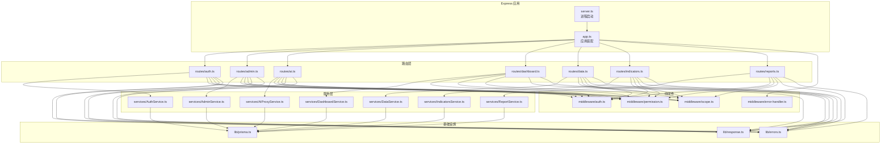
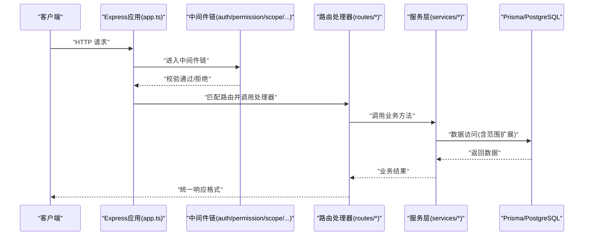
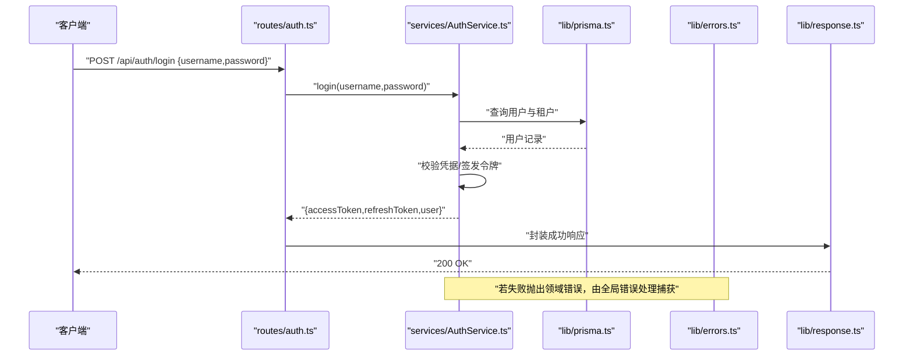
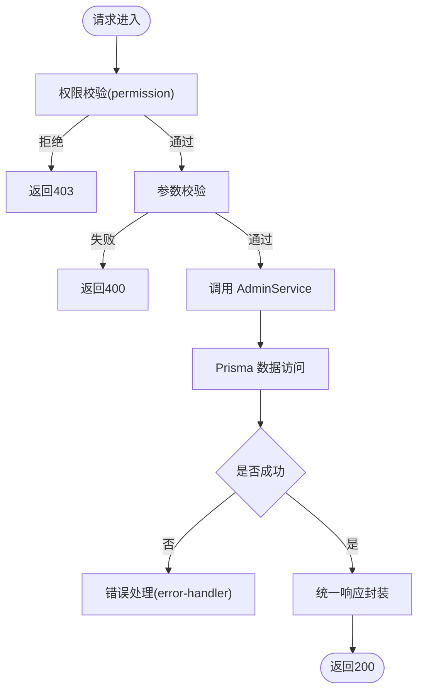
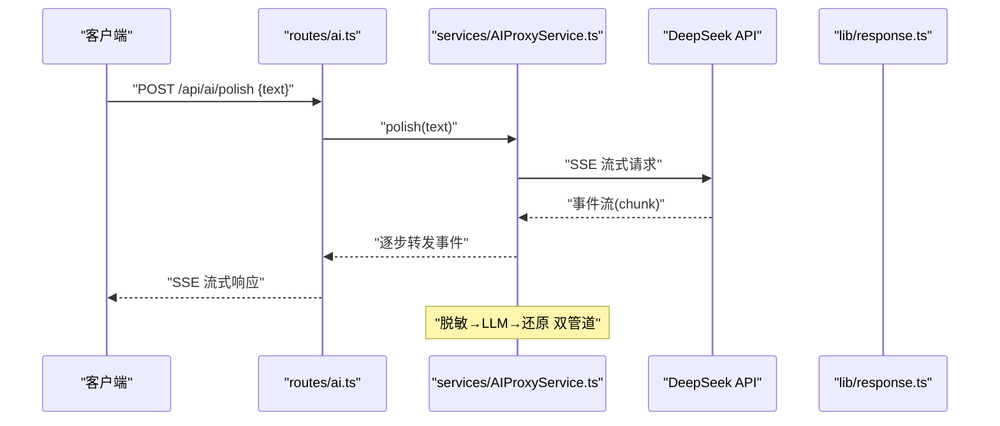
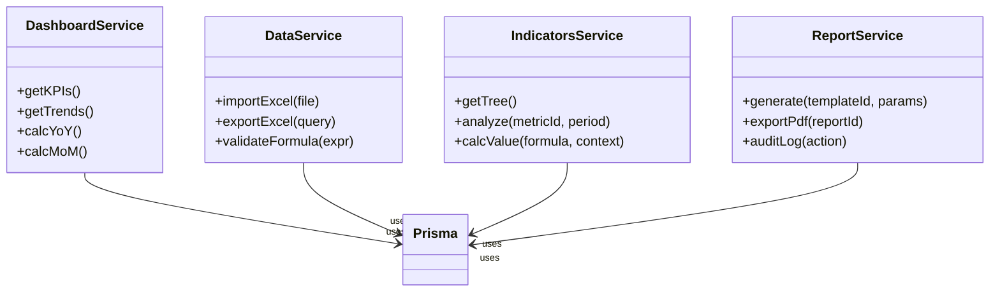
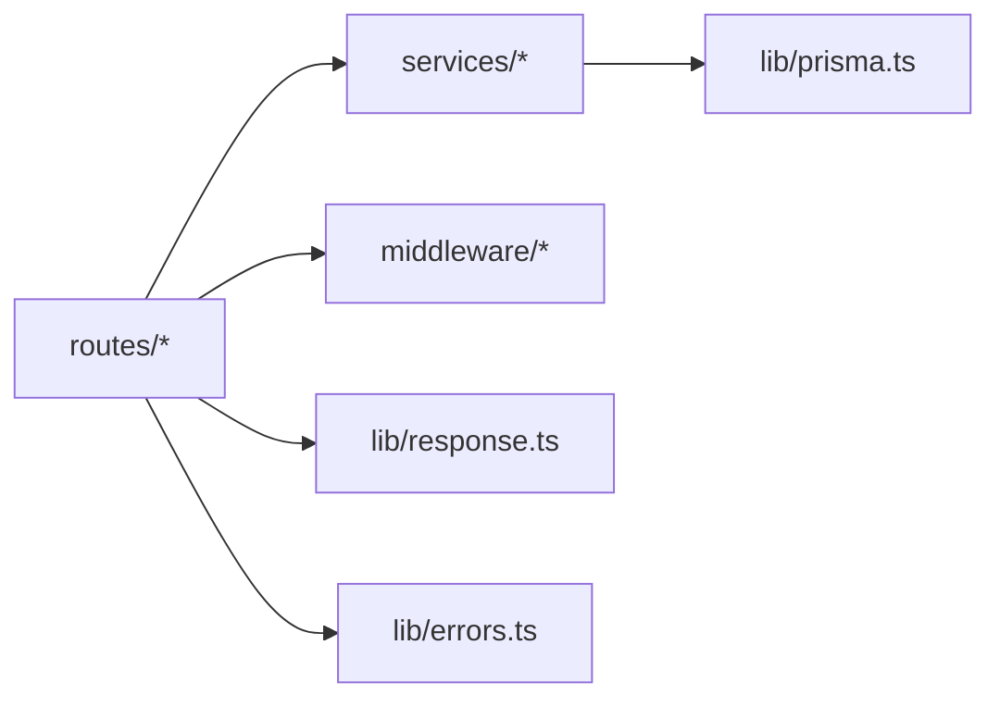

# 路由模块化设计原则

<cite>
**本文引用的文件**   
- [server.ts](file://server/server.ts)
- [app.ts](file://server/src/app.ts)
- [routes/auth.ts](file://server/src/routes/auth.ts)
- [routes/admin.ts](file://server/src/routes/admin.ts)
- [routes/ai.ts](file://server/src/routes/ai.ts)
- [routes/dashboard.ts](file://server/src/routes/dashboard.ts)
- [routes/data.ts](file://server/src/routes/data.ts)
- [routes/indicators.ts](file://server/src/routes/indicators.ts)
- [routes/reports.ts](file://server/src/routes/reports.ts)
- [services/AuthService.ts](file://server/src/services/AuthService.ts)
- [services/AdminService.ts](file://server/src/services/AdminService.ts)
- [services/AIProxyService.ts](file://server/src/services/AIProxyService.ts)
- [services/DashboardService.ts](file://server/src/services/DashboardService.ts)
- [services/DataService.ts](file://server/src/services/DataService.ts)
- [services/IndicatorsService.ts](file://server/src/services/IndicatorsService.ts)
- [services/ReportService.ts](file://server/src/services/ReportService.ts)
- [middleware/auth.ts](file://server/src/middleware/auth.ts)
- [middleware/permission.ts](file://server/src/middleware/permission.ts)
- [middleware/scope.ts](file://server/src/middleware/scope.ts)
- [middleware/error-handler.ts](file://server/src/middleware/error-handler.ts)
- [lib/response.ts](file://server/src/lib/response.ts)
- [lib/errors.ts](file://server/src/lib/errors.ts)
- [lib/prisma.ts](file://server/src/lib/prisma.ts)
</cite>

## 目录
1. [引言](#引言)
2. [项目结构](#项目结构)
3. [核心组件](#核心组件)
4. [架构总览](#架构总览)
5. [详细组件分析](#详细组件分析)
6. [依赖关系分析](#依赖关系分析)
7. [性能考量](#性能考量)
8. [故障排查指南](#故障排查指南)
9. [结论](#结论)
10. [附录](#附录)

## 引言
本指南围绕 FY200 项目的路由模块化设计展开，聚焦于“路由与服务层解耦、依赖注入与接口抽象、参数验证、响应格式化与错误处理”等关键主题。结合 Express + Prisma + PostgreSQL 的技术栈，以及中间件执行链（helmet → cors → express.json → rate-limit → auth → permission → scope → softDelete → audit → Service → Prisma → PostgreSQL），文档提供从架构到落地的系统化说明，帮助读者在保持高内聚、低耦合的前提下，构建可维护、可扩展且易于测试的后端服务。

## 项目结构
后端采用分层组织：
- routes：HTTP 路由定义与请求入口
- services：业务逻辑实现，面向领域模型与数据访问
- middleware：横切关注点（鉴权、权限、范围、审计、限流、错误处理）
- lib：通用工具（响应封装、错误类型、JWT、Prisma 客户端等）
- server/app.ts：应用装配与中间件注册
- server/server.ts：进程启动与端口监听

图表来源
- [app.ts:1-200](file://server/src/app.ts#L1-L200)
- [server.ts:1-100](file://server/server.ts#L1-L100)
- [routes/auth.ts:1-200](file://server/src/routes/auth.ts#L1-L200)
- [routes/admin.ts:1-200](file://server/src/routes/admin.ts#L1-L200)
- [routes/ai.ts:1-200](file://server/src/routes/ai.ts#L1-L200)
- [routes/dashboard.ts:1-200](file://server/src/routes/dashboard.ts#L1-L200)
- [routes/data.ts:1-200](file://server/src/routes/data.ts#L1-L200)
- [routes/indicators.ts:1-200](file://server/src/routes/indicators.ts#L1-L200)
- [routes/reports.ts:1-200](file://server/src/routes/reports.ts#L1-L200)
- [services/AuthService.ts:1-200](file://server/src/services/AuthService.ts#L1-L200)
- [services/AdminService.ts:1-200](file://server/src/services/AdminService.ts#L1-L200)
- [services/AIProxyService.ts:1-200](file://server/src/services/AIProxyService.ts#L1-L200)
- [services/DashboardService.ts:1-200](file://server/src/services/DashboardService.ts#L1-L200)
- [services/DataService.ts:1-200](file://server/src/services/DataService.ts#L1-L200)
- [services/IndicatorsService.ts:1-200](file://server/src/services/IndicatorsService.ts#L1-L200)
- [services/ReportService.ts:1-200](file://server/src/services/ReportService.ts#L1-L200)
- [middleware/auth.ts:1-200](file://server/src/middleware/auth.ts#L1-L200)
- [middleware/permission.ts:1-200](file://server/src/middleware/permission.ts#L1-L200)
- [middleware/scope.ts:1-200](file://server/src/middleware/scope.ts#L1-L200)
- [middleware/error-handler.ts:1-200](file://server/src/middleware/error-handler.ts#L1-L200)
- [lib/response.ts:1-200](file://server/src/lib/response.ts#L1-L200)
- [lib/errors.ts:1-200](file://server/src/lib/errors.ts#L1-L200)
- [lib/prisma.ts:1-200](file://server/src/lib/prisma.ts#L1-L200)

章节来源
- [app.ts:1-200](file://server/src/app.ts#L1-L200)
- [server.ts:1-100](file://server/server.ts#L1-L100)

## 核心组件
- 路由层职责
  - 解析 HTTP 请求（路径、方法、查询参数、路径参数、请求体、头部）
  - 调用对应服务方法，获取业务结果
  - 使用统一响应格式封装返回
  - 通过中间件完成鉴权、权限、范围、审计等横切逻辑
- 服务层职责
  - 实现领域业务逻辑（如认证、指标计算、报表生成、AI 代理）
  - 通过 Prisma 客户端访问数据库
  - 对异常进行领域化包装与转换
- 中间件职责
  - 安全与合规（helmet、cors、rate-limit）
  - 身份与授权（auth、permission、scope）
  - 审计与追踪（audit、trace-id）
  - 错误处理（error-handler）
- 基础设施
  - 统一响应封装（response.ts）
  - 错误类型与错误码（errors.ts）
  - Prisma 客户端（prisma.ts）

章节来源
- [routes/auth.ts:1-200](file://server/src/routes/auth.ts#L1-L200)
- [routes/admin.ts:1-200](file://server/src/routes/admin.ts#L1-L200)
- [routes/ai.ts:1-200](file://server/src/routes/ai.ts#L1-L200)
- [routes/dashboard.ts:1-200](file://server/src/routes/dashboard.ts#L1-L200)
- [routes/data.ts:1-200](file://server/src/routes/data.ts#L1-L200)
- [routes/indicators.ts:1-200](file://server/src/routes/indicators.ts#L1-L200)
- [routes/reports.ts:1-200](file://server/src/routes/reports.ts#L1-L200)
- [services/AuthService.ts:1-200](file://server/src/services/AuthService.ts#L1-L200)
- [services/AdminService.ts:1-200](file://server/src/services/AdminService.ts#L1-L200)
- [services/AIProxyService.ts:1-200](file://server/src/services/AIProxyService.ts#L1-L200)
- [services/DashboardService.ts:1-200](file://server/src/services/DashboardService.ts#L1-L200)
- [services/DataService.ts:1-200](file://server/src/services/DataService.ts#L1-L200)
- [services/IndicatorsService.ts:1-200](file://server/src/services/IndicatorsService.ts#L1-L200)
- [services/ReportService.ts:1-200](file://server/src/services/ReportService.ts#L1-L200)
- [middleware/auth.ts:1-200](file://server/src/middleware/auth.ts#L1-L200)
- [middleware/permission.ts:1-200](file://server/src/middleware/permission.ts#L1-L200)
- [middleware/scope.ts:1-200](file://server/src/middleware/scope.ts#L1-L200)
- [middleware/error-handler.ts:1-200](file://server/src/middleware/error-handler.ts#L1-L200)
- [lib/response.ts:1-200](file://server/src/lib/response.ts#L1-L200)
- [lib/errors.ts:1-200](file://server/src/lib/errors.ts#L1-L200)
- [lib/prisma.ts:1-200](file://server/src/lib/prisma.ts#L1-L200)

## 架构总览
下图展示了典型请求的生命周期，体现“路由→服务→数据访问”的解耦与中间件的横切能力。

图表来源
- [app.ts:1-200](file://server/src/app.ts#L1-L200)
- [middleware/auth.ts:1-200](file://server/src/middleware/auth.ts#L1-L200)
- [middleware/permission.ts:1-200](file://server/src/middleware/permission.ts#L1-L200)
- [middleware/scope.ts:1-200](file://server/src/middleware/scope.ts#L1-L200)
- [routes/auth.ts:1-200](file://server/src/routes/auth.ts#L1-L200)
- [services/AuthService.ts:1-200](file://server/src/services/AuthService.ts#L1-L200)
- [lib/prisma.ts:1-200](file://server/src/lib/prisma.ts#L1-L200)

## 详细组件分析

### 认证路由与服务（auth）
- 路由职责
  - 登录/登出、令牌刷新、用户信息获取
  - 参数校验（用户名、密码、刷新令牌等）
  - 调用 AuthService 完成认证流程
  - 使用统一响应封装成功/失败结果
- 服务职责
  - 校验凭据、签发 access/refresh 令牌、黑名单校验
  - 与 Prisma 交互获取用户与租户信息
- 中间件协作
  - auth：JWT 校验与黑名单检查
  - permission：默认拒绝，需显式放行
  - scope：基于 Prisma extension 的数据范围控制

图表来源
- [routes/auth.ts:1-200](file://server/src/routes/auth.ts#L1-L200)
- [services/AuthService.ts:1-200](file://server/src/services/AuthService.ts#L1-L200)
- [lib/prisma.ts:1-200](file://server/src/lib/prisma.ts#L1-L200)
- [lib/errors.ts:1-200](file://server/src/lib/errors.ts#L1-L200)
- [lib/response.ts:1-200](file://server/src/lib/response.ts#L1-L200)

章节来源
- [routes/auth.ts:1-200](file://server/src/routes/auth.ts#L1-L200)
- [services/AuthService.ts:1-200](file://server/src/services/AuthService.ts#L1-L200)

### 管理路由与服务（admin）
- 路由职责
  - 管理员操作（用户管理、配置管理等）
  - 严格权限控制（仅管理员）
  - 参数校验与分页过滤
- 服务职责
  - 聚合多表数据、事务性更新
  - 审计日志记录
- 中间件协作
  - permission：必须包含 admin 角色或特定权限
  - scope：按组织/公司维度隔离数据

图表来源
- [routes/admin.ts:1-200](file://server/src/routes/admin.ts#L1-L200)
- [services/AdminService.ts:1-200](file://server/src/services/AdminService.ts#L1-L200)
- [middleware/permission.ts:1-200](file://server/src/middleware/permission.ts#L1-L200)
- [middleware/error-handler.ts:1-200](file://server/src/middleware/error-handler.ts#L1-L200)
- [lib/response.ts:1-200](file://server/src/lib/response.ts#L1-L200)

章节来源
- [routes/admin.ts:1-200](file://server/src/routes/admin.ts#L1-L200)
- [services/AdminService.ts:1-200](file://server/src/services/AdminService.ts#L1-L200)

### AI 代理路由与服务（ai）
- 路由职责
  - 文本润色与结构化分析的双管道入口
  - SSE 流式响应支持
  - 输入脱敏与输出还原
- 服务职责
  - 调用 DeepSeek API，处理流式事件
  - 脱敏规则应用（金额区间化、公司名称映射）
- 中间件协作
  - rate-limit：限制 AI 调用频率
  - auth/permission：确保调用者具备相应权限

图表来源
- [routes/ai.ts:1-200](file://server/src/routes/ai.ts#L1-L200)
- [services/AIProxyService.ts:1-200](file://server/src/services/AIProxyService.ts#L1-L200)
- [lib/response.ts:1-200](file://server/src/lib/response.ts#L1-L200)

章节来源
- [routes/ai.ts:1-200](file://server/src/routes/ai.ts#L1-L200)
- [services/AIProxyService.ts:1-200](file://server/src/services/AIProxyService.ts#L1-L200)

### 仪表盘、数据、指标、报表路由与服务
- 仪表盘（dashboard）
  - 聚合 KPI、趋势图数据
  - 同比/环比实时计算（不存库）
- 数据（data）
  - Excel 导入导出、公式规则维护
  - 白名单算子解析，禁止 eval
- 指标（indicators）
  - 指标树、分析面板数据
  - 安全公式计算与缓存策略
- 报表（reports）
  - 报表模板、生成与导出
  - 审计与版本控制

图表来源
- [services/DashboardService.ts:1-200](file://server/src/services/DashboardService.ts#L1-L200)
- [services/DataService.ts:1-200](file://server/src/services/DataService.ts#L1-L200)
- [services/IndicatorsService.ts:1-200](file://server/src/services/IndicatorsService.ts#L1-L200)
- [services/ReportService.ts:1-200](file://server/src/services/ReportService.ts#L1-L200)
- [lib/prisma.ts:1-200](file://server/src/lib/prisma.ts#L1-L200)

章节来源
- [routes/dashboard.ts:1-200](file://server/src/routes/dashboard.ts#L1-L200)
- [routes/data.ts:1-200](file://server/src/routes/data.ts#L1-L200)
- [routes/indicators.ts:1-200](file://server/src/routes/indicators.ts#L1-L200)
- [routes/reports.ts:1-200](file://server/src/routes/reports.ts#L1-L200)
- [services/DashboardService.ts:1-200](file://server/src/services/DashboardService.ts#L1-L200)
- [services/DataService.ts:1-200](file://server/src/services/DataService.ts#L1-L200)
- [services/IndicatorsService.ts:1-200](file://server/src/services/IndicatorsService.ts#L1-L200)
- [services/ReportService.ts:1-200](file://server/src/services/ReportService.ts#L1-L200)

## 依赖关系分析
- 路由与服务解耦
  - 路由仅负责协议适配与参数校验，不承载业务逻辑
  - 服务暴露清晰的领域接口，便于替换实现与单元测试
- 中间件与路由松耦合
  - 通过装饰器或组合方式按需挂载中间件
  - 权限默认拒绝，显式放行，最小权限原则
- 数据访问抽象
  - 所有服务通过 Prisma 客户端访问数据库
  - scope 中间件通过 Prisma extension 注入数据范围条件

图表来源
- [routes/auth.ts:1-200](file://server/src/routes/auth.ts#L1-L200)
- [routes/admin.ts:1-200](file://server/src/routes/admin.ts#L1-L200)
- [routes/ai.ts:1-200](file://server/src/routes/ai.ts#L1-L200)
- [routes/dashboard.ts:1-200](file://server/src/routes/dashboard.ts#L1-L200)
- [routes/data.ts:1-200](file://server/src/routes/data.ts#L1-L200)
- [routes/indicators.ts:1-200](file://server/src/routes/indicators.ts#L1-L200)
- [routes/reports.ts:1-200](file://server/src/routes/reports.ts#L1-L200)
- [services/AuthService.ts:1-200](file://server/src/services/AuthService.ts#L1-L200)
- [services/AdminService.ts:1-200](file://server/src/services/AdminService.ts#L1-L200)
- [services/AIProxyService.ts:1-200](file://server/src/services/AIProxyService.ts#L1-L200)
- [services/DashboardService.ts:1-200](file://server/src/services/DashboardService.ts#L1-L200)
- [services/DataService.ts:1-200](file://server/src/services/DataService.ts#L1-L200)
- [services/IndicatorsService.ts:1-200](file://server/src/services/IndicatorsService.ts#L1-L200)
- [services/ReportService.ts:1-200](file://server/src/services/ReportService.ts#L1-L200)
- [middleware/auth.ts:1-200](file://server/src/middleware/auth.ts#L1-L200)
- [middleware/permission.ts:1-200](file://server/src/middleware/permission.ts#L1-L200)
- [middleware/scope.ts:1-200](file://server/src/middleware/scope.ts#L1-L200)
- [lib/response.ts:1-200](file://server/src/lib/response.ts#L1-L200)
- [lib/errors.ts:1-200](file://server/src/lib/errors.ts#L1-L200)
- [lib/prisma.ts:1-200](file://server/src/lib/prisma.ts#L1-L200)

章节来源
- [app.ts:1-200](file://server/src/app.ts#L1-L200)
- [middleware/auth.ts:1-200](file://server/src/middleware/auth.ts#L1-L200)
- [middleware/permission.ts:1-200](file://server/src/middleware/permission.ts#L1-L200)
- [middleware/scope.ts:1-200](file://server/src/middleware/scope.ts#L1-L200)

## 性能考量
- 计算类指标
  - 同比/环比实时计算，避免冗余存储
  - 公式解析使用白名单算子，避免 eval 带来的开销与风险
- AI 流式响应
  - SSE 降低首字节延迟，提升用户体验
  - 合理设置 rate-limit，防止滥用
- 数据库访问
  - 使用 Prisma extension 注入 scope，减少重复条件拼接
  - 批量操作与事务优化，减少往返次数

[本节为通用指导，不直接分析具体文件]

## 故障排查指南
- 常见错误分类
  - 参数校验失败：返回 400，提示字段级错误
  - 鉴权失败：返回 401，提示未登录或令牌过期
  - 权限不足：返回 403，提示无权限
  - 业务异常：返回 500，附带错误码与消息
- 定位步骤
  - 查看 error-handler 中的错误堆栈与上下文
  - 检查 auth/permission/scope 中间件日志
  - 核对服务层抛出的领域错误类型
  - 确认 Prisma 查询与事务状态

章节来源
- [middleware/error-handler.ts:1-200](file://server/src/middleware/error-handler.ts#L1-L200)
- [lib/errors.ts:1-200](file://server/src/lib/errors.ts#L1-L200)

## 结论
FY200 的路由模块化设计以“路由薄、服务厚、中间件横切”为核心原则，实现了清晰的职责边界与良好的可测试性。通过统一的响应封装、错误类型与中间件链，系统在安全性、可维护性与性能之间取得平衡。建议在新功能开发中遵循本文规范，持续优化代码复用与测试覆盖。

[本节为总结性内容，不直接分析具体文件]

## 附录
- TypeScript 类型定义建议
  - 路由入参/出参使用独立的类型文件，与服务层 DTO 对齐
  - 错误类型集中管理，便于前端统一处理
- 接口规范化
  - RESTful 命名约定，资源名词复数形式
  - 分页、排序、过滤统一参数规范
- 模块间通信机制
  - 同步：函数调用（路由→服务）
  - 异步：事件总线或消息队列（未来扩展）
- 重构最佳实践
  - 将复杂业务逻辑下沉至服务层
  - 拆分大路由文件，按领域划分模块
  - 引入工厂模式管理服务实例，便于依赖注入与测试替身
- 测试覆盖方案
  - 单元测试：服务层纯函数与边界条件
  - 集成测试：路由→中间件→服务→Prisma 全链路
  - 端到端测试：关键业务流程冒烟测试

[本节为通用指导，不直接分析具体文件]