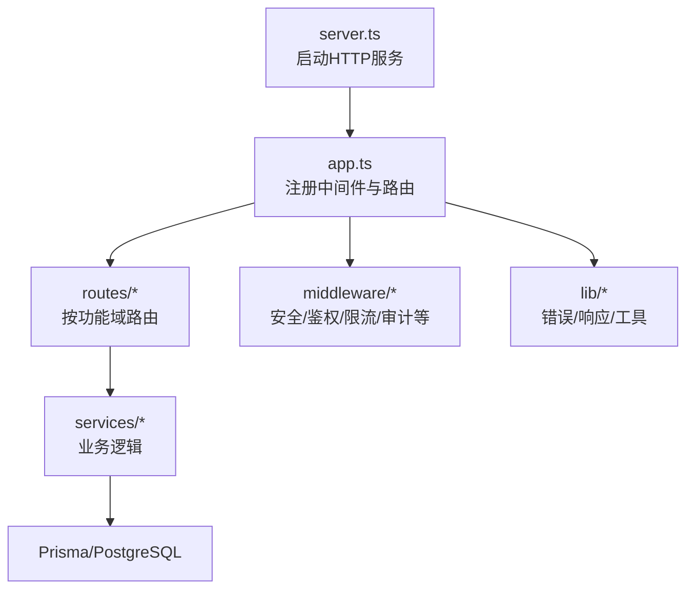
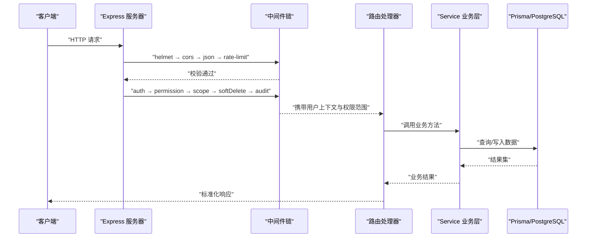
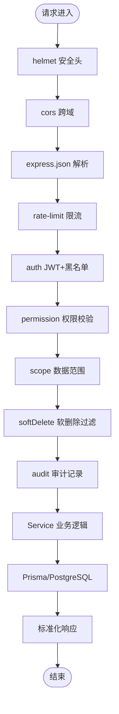
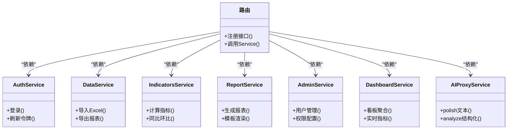
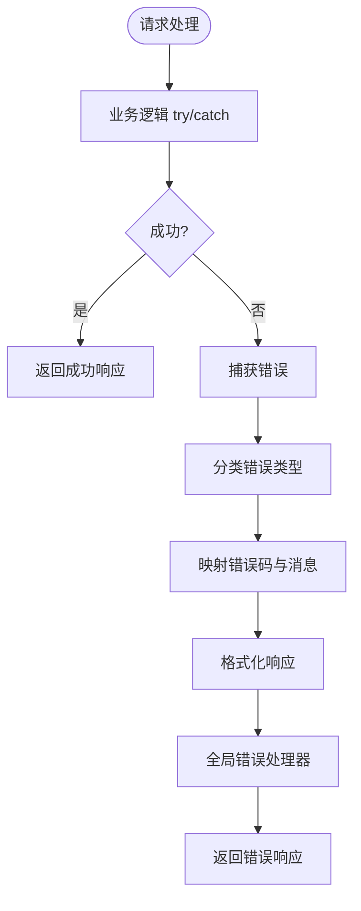
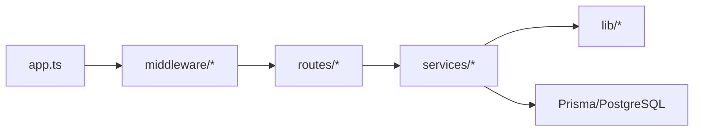

# 路由组织与架构

<cite>
**本文引用的文件**   
- [server/src/app.ts](file://server/src/app.ts)
- [server/src/server.ts](file://server/src/server.ts)
- [server/src/routes/auth.ts](file://server/src/routes/auth.ts)
- [server/src/routes/data.ts](file://server/src/routes/data.ts)
- [server/src/routes/indicators.ts](file://server/src/routes/indicators.ts)
- [server/src/routes/reports.ts](file://server/src/routes/reports.ts)
- [server/src/routes/admin.ts](file://server/src/routes/admin.ts)
- [server/src/routes/dashboard.ts](file://server/src/routes/dashboard.ts)
- [server/src/routes/ai.ts](file://server/src/routes/ai.ts)
- [server/src/middleware/helmet.ts](file://server/src/middleware/helmet.ts)
- [server/src/middleware/cors.ts](file://server/src/middleware/cors.ts)
- [server/src/middleware/rate-limit.ts](file://server/src/middleware/rate-limit.ts)
- [server/src/middleware/auth.ts](file://server/src/middleware/auth.ts)
- [server/src/middleware/permission.ts](file://server/src/middleware/permission.ts)
- [server/src/middleware/scope.ts](file://server/src/middleware/scope.ts)
- [server/src/middleware/soft-delete.ts](file://server/src/middleware/soft-delete.ts)
- [server/src/middleware/audit.ts](file://server/src/middleware/audit.ts)
- [server/src/middleware/error-handler.ts](file://server/src/middleware/error-handler.ts)
- [server/src/lib/errors.ts](file://server/src/lib/errors.ts)
- [server/src/lib/response.ts](file://server/src/lib/response.ts)
- [server/src/services/AuthService.ts](file://server/src/services/AuthService.ts)
- [server/src/services/DataService.ts](file://server/src/services/DataService.ts)
- [server/src/services/IndicatorsService.ts](file://server/src/services/IndicatorsService.ts)
- [server/src/services/ReportService.ts](file://server/src/services/ReportService.ts)
- [server/src/services/AdminService.ts](file://server/src/services/AdminService.ts)
- [server/src/services/DashboardService.ts](file://server/src/services/DashboardService.ts)
- [server/src/services/AIProxyService.ts](file://server/src/services/AIProxyService.ts)
- [server/src/test/integration.test.ts](file://server/src/test/integration.test.ts)
- [server/src/test/setup.ts](file://server/src/test/setup.ts)
</cite>

## 目录
1. [简介](#简介)
2. [项目结构](#项目结构)
3. [核心组件](#核心组件)
4. [架构总览](#架构总览)
5. [详细组件分析](#详细组件分析)
6. [依赖关系分析](#依赖关系分析)
7. [性能考量](#性能考量)
8. [故障排查指南](#故障排查指南)
9. [结论](#结论)
10. [附录](#附录)

## 简介
本指南面向FY200项目的后端路由组织与中间件执行链，目标是帮助开发者快速理解并扩展按功能域划分的路由模块（认证、数据管理、指标分析、报表生成、系统管理、仪表盘、AI功能），掌握中间件的顺序与职责边界、依赖注入模式与错误处理机制，并提供可操作的测试方法与调试技巧。

## 项目结构
后端采用Express 4，入口为应用初始化与HTTP服务启动；路由按功能域拆分至routes目录；通用能力以middleware形式串联；业务逻辑下沉到services；统一错误与响应封装在lib中。

**图表来源**
- [server/src/server.ts](file://server/src/server.ts)
- [server/src/app.ts](file://server/src/app.ts)

**章节来源**
- [server/src/server.ts](file://server/src/server.ts)
- [server/src/app.ts](file://server/src/app.ts)

## 核心组件
- 路由模块化：auth.ts、data.ts、indicators.ts、reports.ts、admin.ts、dashboard.ts、ai.ts，分别对应认证、数据管理、指标分析、报表生成、系统管理、仪表盘、AI功能。
- 中间件链：helmet → cors → express.json → rate-limit → auth → permission → scope → softDelete → audit → Service → Prisma → PostgreSQL。
- 依赖注入：路由层仅持有对Service的引用，Service通过构造函数或工厂注入，便于测试替换与解耦。
- 错误处理：统一异常类型与错误码，全局错误处理器捕获并返回标准化响应。

**章节来源**
- [server/src/app.ts](file://server/src/app.ts)
- [server/src/middleware/helmet.ts](file://server/src/middleware/helmet.ts)
- [server/src/middleware/cors.ts](file://server/src/middleware/cors.ts)
- [server/src/middleware/rate-limit.ts](file://server/src/middleware/rate-limit.ts)
- [server/src/middleware/auth.ts](file://server/src/middleware/auth.ts)
- [server/src/middleware/permission.ts](file://server/src/middleware/permission.ts)
- [server/src/middleware/scope.ts](file://server/src/middleware/scope.ts)
- [server/src/middleware/soft-delete.ts](file://server/src/middleware/soft-delete.ts)
- [server/src/middleware/audit.ts](file://server/src/middleware/audit.ts)
- [server/src/lib/errors.ts](file://server/src/lib/errors.ts)
- [server/src/lib/response.ts](file://server/src/lib/response.ts)

## 架构总览
下图展示了请求从进入服务器到返回响应的完整路径，以及各中间件与服务的协作关系。

**图表来源**
- [server/src/app.ts](file://server/src/app.ts)
- [server/src/middleware/auth.ts](file://server/src/middleware/auth.ts)
- [server/src/middleware/permission.ts](file://server/src/middleware/permission.ts)
- [server/src/middleware/scope.ts](file://server/src/middleware/scope.ts)
- [server/src/middleware/soft-delete.ts](file://server/src/middleware/soft-delete.ts)
- [server/src/middleware/audit.ts](file://server/src/middleware/audit.ts)
- [server/src/lib/response.ts](file://server/src/lib/response.ts)

## 详细组件分析

### 路由模块化设计原则
- 单一职责：每个路由文件只暴露一个功能域的接口集合，避免跨域耦合。
- 最小化路由逻辑：路由仅做参数校验与转发，复杂计算与数据访问下沉到Service。
- 可组合性：中间件按固定顺序挂载，路由按需复用（如认证、权限、范围）。
- 可测试性：路由不直接依赖数据库，便于使用Mock Service进行单元测试。

**章节来源**
- [server/src/routes/auth.ts](file://server/src/routes/auth.ts)
- [server/src/routes/data.ts](file://server/src/routes/data.ts)
- [server/src/routes/indicators.ts](file://server/src/routes/indicators.ts)
- [server/src/routes/reports.ts](file://server/src/routes/reports.ts)
- [server/src/routes/admin.ts](file://server/src/routes/admin.ts)
- [server/src/routes/dashboard.ts](file://server/src/routes/dashboard.ts)
- [server/src/routes/ai.ts](file://server/src/routes/ai.ts)

### 中间件执行链详解
- helmet：设置安全相关响应头，降低常见Web攻击面。
- cors：配置跨域策略，允许前端域名与凭证。
- express.json：解析JSON请求体，限制大小与类型。
- rate-limit：基于IP或用户维度的限流，保护API不被滥用。
- auth：JWT校验与黑名单检查，注入用户上下文。
- permission：默认拒绝，显式授权后才放行，细粒度控制。
- scope：通过Prisma extension注入数据范围（公司/部门/个人）。
- softDelete：自动过滤已删除记录，保证查询一致性。
- audit：记录关键操作审计日志，支持追踪与合规。
- Service：业务逻辑实现，聚合多数据源与计算。
- Prisma/PostgreSQL：持久化存储与事务。

**图表来源**
- [server/src/middleware/helmet.ts](file://server/src/middleware/helmet.ts)
- [server/src/middleware/cors.ts](file://server/src/middleware/cors.ts)
- [server/src/middleware/rate-limit.ts](file://server/src/middleware/rate-limit.ts)
- [server/src/middleware/auth.ts](file://server/src/middleware/auth.ts)
- [server/src/middleware/permission.ts](file://server/src/middleware/permission.ts)
- [server/src/middleware/scope.ts](file://server/src/middleware/scope.ts)
- [server/src/middleware/soft-delete.ts](file://server/src/middleware/soft-delete.ts)
- [server/src/middleware/audit.ts](file://server/src/middleware/audit.ts)

**章节来源**
- [server/src/app.ts](file://server/src/app.ts)
- [server/src/middleware/helmet.ts](file://server/src/middleware/helmet.ts)
- [server/src/middleware/cors.ts](file://server/src/middleware/cors.ts)
- [server/src/middleware/rate-limit.ts](file://server/src/middleware/rate-limit.ts)
- [server/src/middleware/auth.ts](file://server/src/middleware/auth.ts)
- [server/src/middleware/permission.ts](file://server/src/middleware/permission.ts)
- [server/src/middleware/scope.ts](file://server/src/middleware/scope.ts)
- [server/src/middleware/soft-delete.ts](file://server/src/middleware/soft-delete.ts)
- [server/src/middleware/audit.ts](file://server/src/middleware/audit.ts)

### 依赖注入模式
- 路由层仅依赖Service实例，不直接访问数据库或外部服务。
- Service通过构造函数注入，便于在测试中替换为Mock实现。
- 统一的错误与响应封装在lib中，Service抛出结构化错误，路由层统一处理。

**图表来源**
- [server/src/routes/auth.ts](file://server/src/routes/auth.ts)
- [server/src/routes/data.ts](file://server/src/routes/data.ts)
- [server/src/routes/indicators.ts](file://server/src/routes/indicators.ts)
- [server/src/routes/reports.ts](file://server/src/routes/reports.ts)
- [server/src/routes/admin.ts](file://server/src/routes/admin.ts)
- [server/src/routes/dashboard.ts](file://server/src/routes/dashboard.ts)
- [server/src/routes/ai.ts](file://server/src/routes/ai.ts)
- [server/src/services/AuthService.ts](file://server/src/services/AuthService.ts)
- [server/src/services/DataService.ts](file://server/src/services/DataService.ts)
- [server/src/services/IndicatorsService.ts](file://server/src/services/IndicatorsService.ts)
- [server/src/services/ReportService.ts](file://server/src/services/ReportService.ts)
- [server/src/services/AdminService.ts](file://server/src/services/AdminService.ts)
- [server/src/services/DashboardService.ts](file://server/src/services/DashboardService.ts)
- [server/src/services/AIProxyService.ts](file://server/src/services/AIProxyService.ts)

**章节来源**
- [server/src/services/AuthService.ts](file://server/src/services/AuthService.ts)
- [server/src/services/DataService.ts](file://server/src/services/DataService.ts)
- [server/src/services/IndicatorsService.ts](file://server/src/services/IndicatorsService.ts)
- [server/src/services/ReportService.ts](file://server/src/services/ReportService.ts)
- [server/src/services/AdminService.ts](file://server/src/services/AdminService.ts)
- [server/src/services/DashboardService.ts](file://server/src/services/DashboardService.ts)
- [server/src/services/AIProxyService.ts](file://server/src/services/AIProxyService.ts)

### 错误处理机制
- 统一异常类型：定义业务错误与系统错误，包含错误码与消息。
- 全局错误处理器：捕获未处理异常，返回标准化响应，避免泄露内部细节。
- 异步错误包装：确保异步回调中的异常被正确捕获。

**图表来源**
- [server/src/lib/errors.ts](file://server/src/lib/errors.ts)
- [server/src/lib/response.ts](file://server/src/lib/response.ts)
- [server/src/middleware/error-handler.ts](file://server/src/middleware/error-handler.ts)

**章节来源**
- [server/src/lib/errors.ts](file://server/src/lib/errors.ts)
- [server/src/lib/response.ts](file://server/src/lib/response.ts)
- [server/src/middleware/error-handler.ts](file://server/src/middleware/error-handler.ts)

### 路由测试方法与调试技巧
- 集成测试：使用测试框架模拟HTTP请求，覆盖认证、权限、范围、软删除与审计流程。
- Mock Service：替换真实Service为Mock，验证路由逻辑与错误分支。
- 断言响应：检查状态码、错误码、数据结构与审计记录。
- 调试技巧：启用详细日志、打印中间件执行顺序、定位限流与权限失败点。

**章节来源**
- [server/src/test/integration.test.ts](file://server/src/test/integration.test.ts)
- [server/src/test/setup.ts](file://server/src/test/setup.ts)

## 依赖关系分析
- 路由与Service松耦合：通过依赖注入减少直接依赖，提升可测试性。
- 中间件强顺序：严格遵循安全→鉴权→权限→范围→审计的顺序，避免越权与数据泄露。
- 外部依赖隔离：AI代理、数据库访问均在Service层封装，路由层无感知。

**图表来源**
- [server/src/app.ts](file://server/src/app.ts)
- [server/src/routes/auth.ts](file://server/src/routes/auth.ts)
- [server/src/services/AuthService.ts](file://server/src/services/AuthService.ts)

**章节来源**
- [server/src/app.ts](file://server/src/app.ts)
- [server/src/routes/auth.ts](file://server/src/routes/auth.ts)
- [server/src/services/AuthService.ts](file://server/src/services/AuthService.ts)

## 性能考量
- 中间件开销：合理配置限流与缓存，避免不必要的计算。
- 数据库查询：使用Prisma关联查询与索引优化，减少N+1问题。
- AI流式响应：SSE传输大文本，分块处理降低内存峰值。
- 指标计算：同比/环比实时计算，注意缓存热点数据。

[本节为通用指导，无需特定文件来源]

## 故障排查指南
- 认证失败：检查JWT有效期、黑名单与签名密钥。
- 权限拒绝：确认权限策略与角色分配是否正确。
- 数据范围异常：核查scope注入与Prisma extension配置。
- 软删除影响：确认查询是否包含deletedAt过滤。
- 审计缺失：检查审计中间件是否生效与日志输出。

**章节来源**
- [server/src/middleware/auth.ts](file://server/src/middleware/auth.ts)
- [server/src/middleware/permission.ts](file://server/src/middleware/permission.ts)
- [server/src/middleware/scope.ts](file://server/src/middleware/scope.ts)
- [server/src/middleware/soft-delete.ts](file://server/src/middleware/soft-delete.ts)
- [server/src/middleware/audit.ts](file://server/src/middleware/audit.ts)

## 结论
通过按功能域划分路由、严格的中间件执行链、清晰的依赖注入与统一的错误处理，FY200项目实现了高内聚、低耦合的后端架构。开发者可在此基础上快速扩展新功能，同时保持系统的稳定性与可维护性。

[本节为总结性内容，无需特定文件来源]

## 附录
- 技术栈：Express 4、Prisma 5、PostgreSQL 15、JWT、DeepSeek API（SSE）。
- 单位规范：万元/人民币。
- 指标计算：安全公式解析（白名单算子），同比/环比实时计算。
- AI双管道：polish（脱敏→LLM→还原）与analyze（结构化→计算→脱敏→LLM→生成）。

[本节为补充信息，无需特定文件来源]