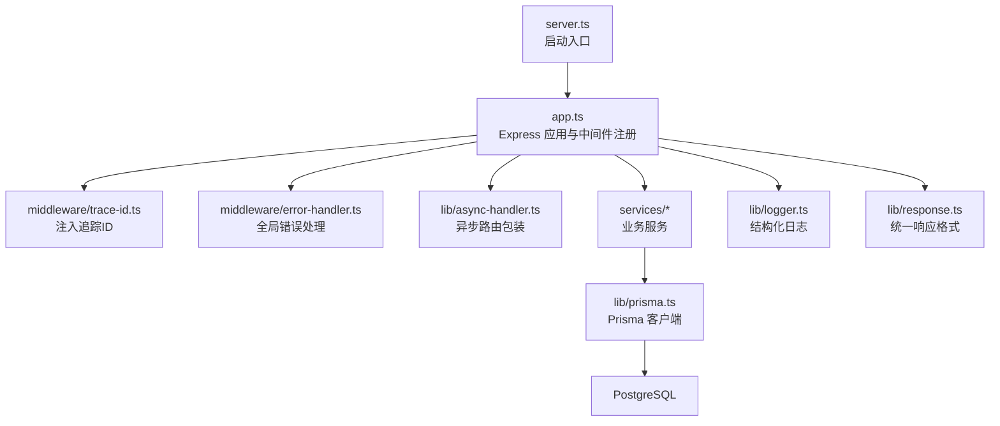
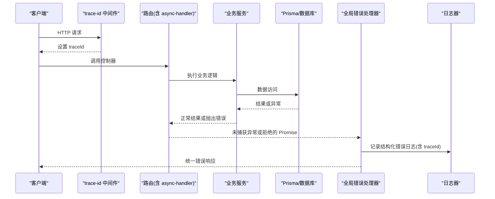
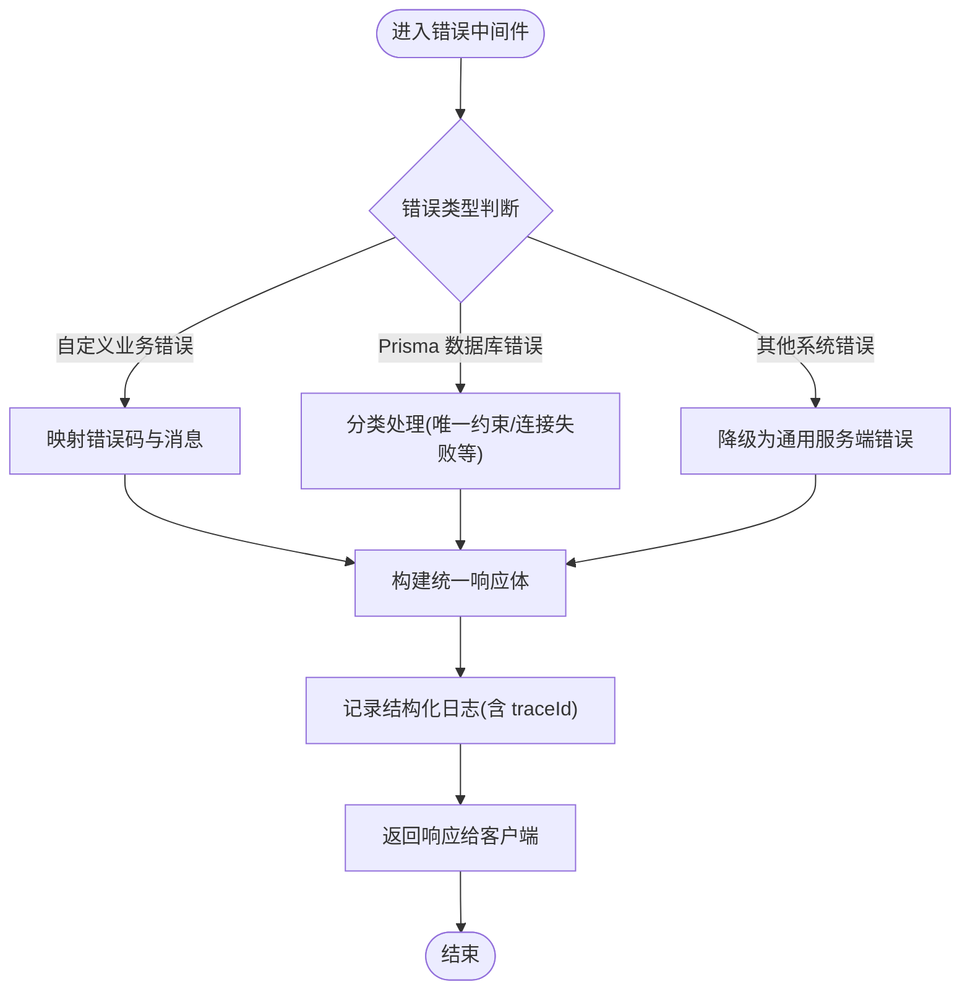
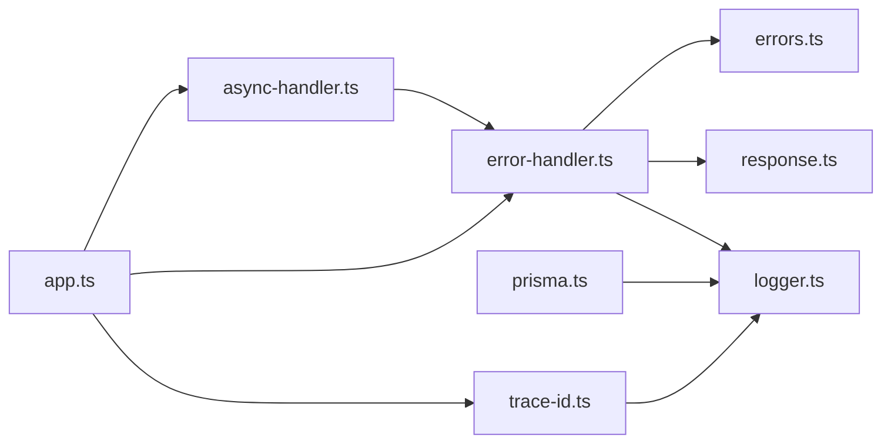

# 错误处理与异常管理

<cite>
**本文引用的文件**   
- [server/src/middleware/error-handler.ts](file://server/src/middleware/error-handler.ts)
- [server/src/lib/errors.ts](file://server/src/lib/errors.ts)
- [server/src/lib/response.ts](file://server/src/lib/response.ts)
- [server/src/lib/logger.ts](file://server/src/lib/logger.ts)
- [server/src/middleware/trace-id.ts](file://server/src/middleware/trace-id.ts)
- [server/src/lib/async-handler.ts](file://server/src/lib/async-handler.ts)
- [server/src/lib/prisma.ts](file://server/src/lib/prisma.ts)
- [server/src/app.ts](file://server/src/app.ts)
- [server/src/server.ts](file://server/src/server.ts)
</cite>

## 目录
1. [简介](#简介)
2. [项目结构](#项目结构)
3. [核心组件](#核心组件)
4. [架构总览](#架构总览)
5. [详细组件分析](#详细组件分析)
6. [依赖关系分析](#依赖关系分析)
7. [性能考量](#性能考量)
8. [故障排查指南](#故障排查指南)
9. [结论](#结论)
10. [附录](#附录)

## 简介
本文件系统化梳理 FY200 项目的错误处理模式，覆盖全局错误处理器、自定义错误类型、响应格式化、异步错误捕获、Promise rejection 处理、数据库异常策略、日志记录与追踪 ID 关联、用户友好消息生成、调试技巧、监控告警与故障恢复机制。目标是帮助开发者快速定位问题、统一错误语义、提升可观测性与稳定性。

## 项目结构
后端采用 Express 中间件链：helmet → cors → express.json → rate-limit → auth → permission → scope → softDelete → audit → Service → Prisma → PostgreSQL。错误处理贯穿请求生命周期，关键位置包括：
- 应用初始化与中间件注册（app.ts）
- 全局错误中间件（error-handler.ts）
- 自定义错误类型与工具（errors.ts）
- 统一响应封装（response.ts）
- 异步路由包装（async-handler.ts）
- 日志与追踪（logger.ts、trace-id.ts）
- 数据库客户端（prisma.ts）

**图表来源** 
- [server/src/server.ts](file://server/src/server.ts)
- [server/src/app.ts](file://server/src/app.ts)
- [server/src/middleware/trace-id.ts](file://server/src/middleware/trace-id.ts)
- [server/src/middleware/error-handler.ts](file://server/src/middleware/error-handler.ts)
- [server/src/lib/async-handler.ts](file://server/src/lib/async-handler.ts)
- [server/src/lib/logger.ts](file://server/src/lib/logger.ts)
- [server/src/lib/response.ts](file://server/src/lib/response.ts)
- [server/src/lib/prisma.ts](file://server/src/lib/prisma.ts)

**章节来源**
- [server/src/app.ts](file://server/src/app.ts)
- [server/src/server.ts](file://server/src/server.ts)

## 核心组件
- 全局错误处理器：集中捕获未处理异常、格式化错误响应、写入结构化日志并附带追踪 ID。
- 自定义错误类型：定义领域错误与系统错误，提供标准化字段与状态码映射。
- 异步错误捕获：通过 async-handler 包装路由，自动捕获 Promise rejection，避免未捕获异常导致进程崩溃。
- 数据库异常处理：基于 Prisma 错误分类（如唯一约束冲突、连接失败），转换为业务可读的错误响应。
- 统一响应格式：成功与失败路径均返回一致的结构，便于前端解析与展示。
- 日志与追踪：所有错误日志包含 traceId、请求上下文、堆栈摘要，支持链路追踪与聚合分析。

**章节来源**
- [server/src/middleware/error-handler.ts](file://server/src/middleware/error-handler.ts)
- [server/src/lib/errors.ts](file://server/src/lib/errors.ts)
- [server/src/lib/response.ts](file://server/src/lib/response.ts)
- [server/src/lib/async-handler.ts](file://server/src/lib/async-handler.ts)
- [server/src/lib/prisma.ts](file://server/src/lib/prisma.ts)
- [server/src/lib/logger.ts](file://server/src/lib/logger.ts)
- [server/src/middleware/trace-id.ts](file://server/src/middleware/trace-id.ts)

## 架构总览
错误处理的端到端流程如下：
- 请求进入后，trace-id 中间件生成或透传追踪 ID，附加到请求对象。
- 路由控制器使用 async-handler 包装，确保异步异常被捕获。
- 业务服务抛出自定义错误或标准错误；数据库层抛出 Prisma 错误。
- 全局错误中间件捕获所有异常，按错误类型分类，生成统一响应体，并记录结构化日志。
- 前端根据统一响应结构展示用户友好的提示。

**图表来源** 
- [server/src/middleware/trace-id.ts](file://server/src/middleware/trace-id.ts)
- [server/src/lib/async-handler.ts](file://server/src/lib/async-handler.ts)
- [server/src/middleware/error-handler.ts](file://server/src/middleware/error-handler.ts)
- [server/src/lib/logger.ts](file://server/src/lib/logger.ts)

## 详细组件分析

### 全局错误处理器（error-handler.ts）
职责：
- 捕获未处理异常与 Promise rejection。
- 识别错误类型（自定义错误、Prisma 错误、网络/IO 错误等）。
- 生成统一错误响应体（状态码、错误码、消息、traceId）。
- 输出结构化日志（堆栈、上下文、traceId）。

关键点：
- 对未知错误进行降级处理，避免泄露敏感信息。
- 区分客户端错误（4xx）与服务端错误（5xx）。
- 在开发环境输出更详细的堆栈，生产环境仅保留必要信息。

**图表来源** 
- [server/src/middleware/error-handler.ts](file://server/src/middleware/error-handler.ts)
- [server/src/lib/errors.ts](file://server/src/lib/errors.ts)
- [server/src/lib/logger.ts](file://server/src/lib/logger.ts)

**章节来源**
- [server/src/middleware/error-handler.ts](file://server/src/middleware/error-handler.ts)

### 自定义错误类型（errors.ts）
设计要点：
- 定义基础错误类，包含 code、message、statusCode、details、traceId 等字段。
- 派生具体业务错误（如参数校验失败、权限不足、资源不存在、重复提交等）。
- 提供错误码命名规范与范围划分（如 4000-4999 客户端错误，5000-5999 服务端错误）。
- 支持扩展 details 字段用于调试信息（脱敏后输出）。

使用建议：
- 在服务层抛出明确的自定义错误，避免直接抛出原生 Error。
- 将外部依赖异常转换为自定义错误，保持错误语义一致性。

**章节来源**
- [server/src/lib/errors.ts](file://server/src/lib/errors.ts)

### 统一响应格式（response.ts）
目标：
- 成功响应：{ success: true, data, meta }
- 错误响应：{ success: false, error: { code, message, traceId } }
- 分页与元数据：支持分页、时间戳、请求耗时等扩展字段。

优势：
- 前端统一解析，减少分支判断。
- 便于监控与统计（按错误码聚合）。

**章节来源**
- [server/src/lib/response.ts](file://server/src/lib/response.ts)

### 异步错误捕获（async-handler.ts）
作用：
- 包装 Express 路由函数，自动捕获 Promise rejection。
- 将异常传递给全局错误处理器，避免未捕获异常导致进程退出。
- 可选：记录请求耗时、埋点指标。

最佳实践：
- 所有路由控制器必须使用 async-handler 包装。
- 避免在路由中直接 try-catch，交由中间件统一处理。

**章节来源**
- [server/src/lib/async-handler.ts](file://server/src/lib/async-handler.ts)

### 数据库异常处理（prisma.ts）
策略：
- 捕获 Prisma 错误，分类处理：
  - 唯一约束冲突：返回 409 冲突错误，提示资源已存在。
  - 连接失败/超时：返回 503 服务不可用，触发重试或熔断。
  - 查询失败/语法错误：返回 500 内部错误，记录详细堆栈。
- 对外只暴露最小必要信息，避免泄露表结构与 SQL。

建议：
- 在 Prisma 客户端初始化时配置连接池与超时参数。
- 结合健康检查与熔断器，提升可用性。

**章节来源**
- [server/src/lib/prisma.ts](file://server/src/lib/prisma.ts)

### 日志与追踪（logger.ts、trace-id.ts）
日志：
- 结构化 JSON 日志，包含 level、msg、traceId、reqId、userId、durationMs、stack 等。
- 敏感信息脱敏（密码、令牌、身份证号等）。
- 分级输出（info/warn/error），便于日志采集与告警。

追踪：
- 每个请求分配唯一 traceId，贯穿中间件、服务、数据库调用。
- 支持跨服务链路追踪（可扩展为 OpenTelemetry）。

**章节来源**
- [server/src/lib/logger.ts](file://server/src/lib/logger.ts)
- [server/src/middleware/trace-id.ts](file://server/src/middleware/trace-id.ts)

## 依赖关系分析
错误处理模块之间的依赖关系如下：

**图表来源** 
- [server/src/middleware/error-handler.ts](file://server/src/middleware/error-handler.ts)
- [server/src/lib/errors.ts](file://server/src/lib/errors.ts)
- [server/src/lib/response.ts](file://server/src/lib/response.ts)
- [server/src/lib/logger.ts](file://server/src/lib/logger.ts)
- [server/src/lib/async-handler.ts](file://server/src/lib/async-handler.ts)
- [server/src/lib/prisma.ts](file://server/src/lib/prisma.ts)
- [server/src/middleware/trace-id.ts](file://server/src/middleware/trace-id.ts)
- [server/src/app.ts](file://server/src/app.ts)

**章节来源**
- [server/src/app.ts](file://server/src/app.ts)

## 性能考量
- 错误日志应避免同步阻塞，使用异步队列或缓冲写入。
- 堆栈信息仅在开发环境或特定错误级别输出，生产环境限制长度。
- 数据库错误分类与快速失败，避免长时间等待。
- 监控错误率与延迟，设置阈值告警。

[本节为通用指导，不直接分析具体文件]

## 故障排查指南
常见问题与解决步骤：
- 未捕获异常导致进程重启：确认所有路由是否使用 async-handler；检查 Promise 链是否遗漏 catch。
- 错误响应缺少 traceId：确认 trace-id 中间件是否在错误处理器之前执行。
- 数据库错误未正确分类：检查 prisma.ts 中的错误映射逻辑。
- 日志缺失或无法检索：确认日志级别与采集配置；验证 traceId 是否传递到下游。
- 用户看到敏感信息：检查错误消息是否脱敏；避免输出堆栈与 SQL。

调试技巧：
- 本地启用详细日志与堆栈输出。
- 使用 traceId 在日志系统中串联请求链路。
- 模拟边界条件（空输入、并发、超时）验证错误路径。

**章节来源**
- [server/src/middleware/error-handler.ts](file://server/src/middleware/error-handler.ts)
- [server/src/lib/logger.ts](file://server/src/lib/logger.ts)
- [server/src/lib/prisma.ts](file://server/src/lib/prisma.ts)

## 结论
FY200 项目的错误处理体系以“统一类型、统一响应、统一日志、统一追踪”为核心，通过中间件与服务层的协作，实现了从请求入口到数据库调用的全链路异常管理。遵循本文规范可有效降低故障定位成本、提升用户体验与系统稳定性。

[本节为总结性内容，不直接分析具体文件]

## 附录
- 错误码规范：建议按领域划分错误码段，便于前端与监控区分。
- 监控告警：基于错误码与错误率设置阈值，联动告警通道（邮件、短信、IM）。
- 故障恢复：结合重试、熔断、降级策略，提升系统在异常场景下的韧性。

[本节为补充说明，不直接分析具体文件]