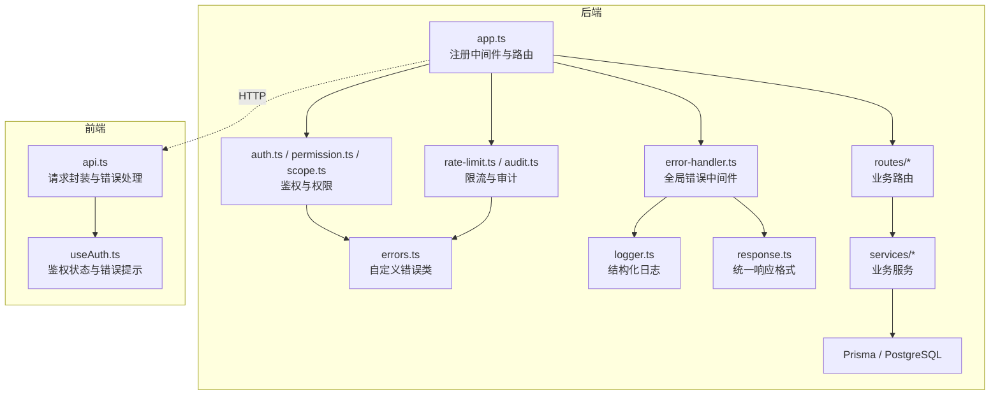
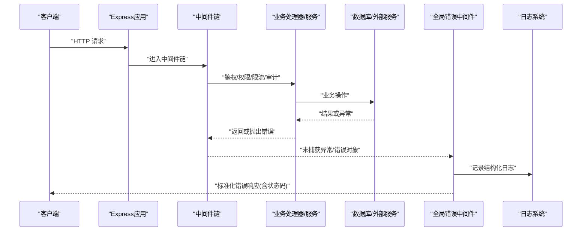
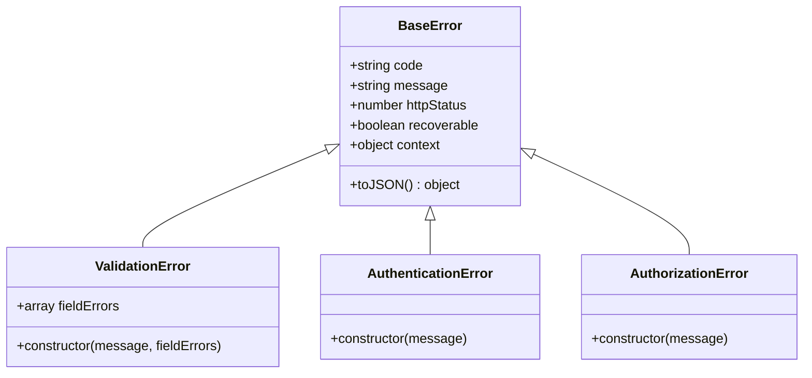
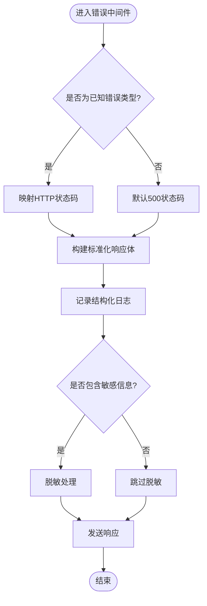
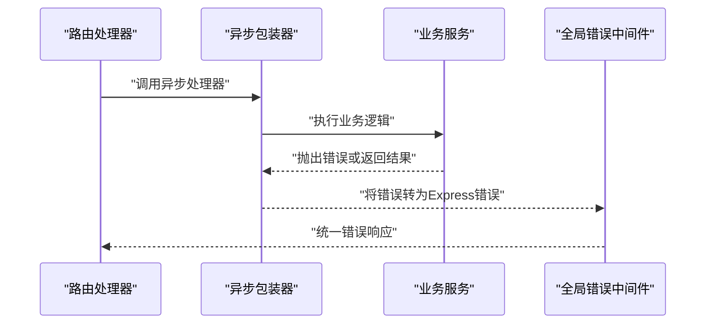
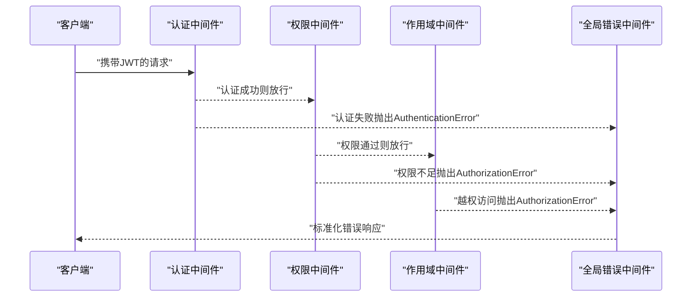
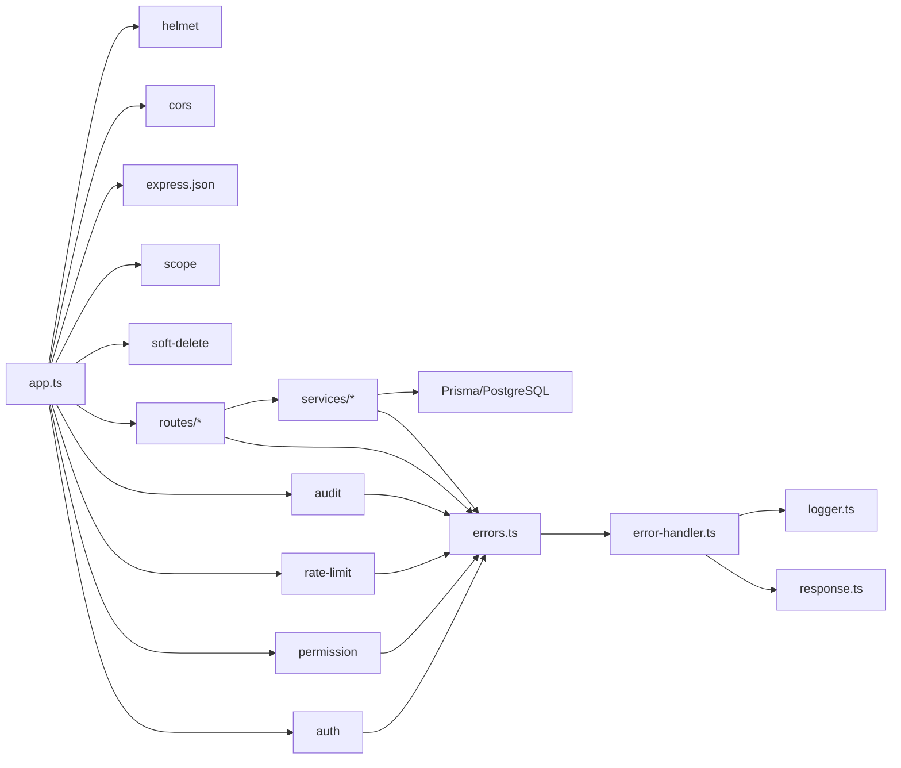

# 错误处理机制

<cite>
**本文引用的文件**
- [server/src/lib/errors.ts](file://server/src/lib/errors.ts)
- [server/src/middleware/error-handler.ts](file://server/src/middleware/error-handler.ts)
- [server/src/lib/async-handler.ts](file://server/src/lib/async-handler.ts)
- [server/src/middleware/auth.ts](file://server/src/middleware/auth.ts)
- [server/src/middleware/permission.ts](file://server/src/middleware/permission.ts)
- [server/src/middleware/scope.ts](file://server/src/middleware/scope.ts)
- [server/src/middleware/rate-limit.ts](file://server/src/middleware/rate-limit.ts)
- [server/src/middleware/audit.ts](file://server/src/middleware/audit.ts)
- [server/src/lib/logger.ts](file://server/src/lib/logger.ts)
- [server/src/lib/response.ts](file://server/src/lib/response.ts)
- [server/src/app.ts](file://server/src/app.ts)
- [server/src/server.ts](file://server/src/server.ts)
- [server/src/services/AuthService.ts](file://server/src/services/AuthService.ts)
- [server/src/routes/auth.ts](file://server/src/routes/auth.ts)
- [web/src/lib/api.ts](file://web/src/lib/api.ts)
- [web/src/hooks/useAuth.ts](file://web/src/hooks/useAuth.ts)
</cite>

## 目录
1. [简介](#简介)
2. [项目结构](#项目结构)
3. [核心组件](#核心组件)
4. [架构总览](#架构总览)
5. [详细组件分析](#详细组件分析)
6. [依赖关系分析](#依赖关系分析)
7. [性能考虑](#性能考虑)
8. [故障排查指南](#故障排查指南)
9. [结论](#结论)
10. [附录](#附录)

## 简介
本指南面向FY200项目的错误处理机制，覆盖自定义错误类层次、全局错误中间件、HTTP状态码映射、日志与监控告警集成、异步错误捕获最佳实践、国际化与用户友好提示、以及调试与排障方法。目标是帮助开发者在Express + Prisma + PostgreSQL技术栈下，构建一致、可观测、易维护的错误处理体系。

## 项目结构
后端错误处理相关代码主要分布在以下位置：
- 自定义错误类型定义：server/src/lib/errors.ts
- 全局错误处理中间件：server/src/middleware/error-handler.ts
- 异步路由包装器：server/src/lib/async-handler.ts
- 认证与授权中间件：server/src/middleware/auth.ts、server/src/middleware/permission.ts、server/src/middleware/scope.ts
- 限流与审计：server/src/middleware/rate-limit.ts、server/src/middleware/audit.ts
- 日志与响应封装：server/src/lib/logger.ts、server/src/lib/response.ts
- 应用装配与启动：server/src/app.ts、server/src/server.ts
- 前端API与鉴权Hook：web/src/lib/api.ts、web/src/hooks/useAuth.ts

图表来源
- [server/src/app.ts](file://server/src/app.ts)
- [server/src/middleware/error-handler.ts](file://server/src/middleware/error-handler.ts)
- [server/src/lib/errors.ts](file://server/src/lib/errors.ts)
- [server/src/lib/logger.ts](file://server/src/lib/logger.ts)
- [server/src/lib/response.ts](file://server/src/lib/response.ts)
- [server/src/middleware/auth.ts](file://server/src/middleware/auth.ts)
- [server/src/middleware/permission.ts](file://server/src/middleware/permission.ts)
- [server/src/middleware/scope.ts](file://server/src/middleware/scope.ts)
- [server/src/middleware/rate-limit.ts](file://server/src/middleware/rate-limit.ts)
- [server/src/middleware/audit.ts](file://server/src/middleware/audit.ts)
- [web/src/lib/api.ts](file://web/src/lib/api.ts)
- [web/src/hooks/useAuth.ts](file://web/src/hooks/useAuth.ts)

章节来源
- [server/src/app.ts](file://server/src/app.ts)
- [server/src/server.ts](file://server/src/server.ts)

## 核心组件
- 自定义错误类层次
  - BaseError：所有业务错误的基类，包含错误码、消息、HTTP状态码、是否可恢复等元数据。
  - ValidationError：参数校验失败或业务规则不满足时抛出。
  - AuthenticationError：身份认证失败（如JWT无效、过期、黑名单）。
  - AuthorizationError：权限不足或越权访问。
  - 其他领域错误（按需扩展）：如数据库错误、第三方API错误等。
- 全局错误处理中间件
  - 统一捕获同步/异步异常，识别错误类型，映射到HTTP状态码，输出标准化JSON响应，并记录结构化日志。
- 异步错误处理
  - 使用异步路由包装器将Promise拒绝转换为Express错误，避免遗漏未处理的Promise错误。
- 响应与日志
  - 统一响应体结构，便于前端解析；结构化日志包含traceId、错误码、堆栈摘要、请求上下文等。

章节来源
- [server/src/lib/errors.ts](file://server/src/lib/errors.ts)
- [server/src/middleware/error-handler.ts](file://server/src/middleware/error-handler.ts)
- [server/src/lib/async-handler.ts](file://server/src/lib/async-handler.ts)
- [server/src/lib/response.ts](file://server/src/lib/response.ts)
- [server/src/lib/logger.ts](file://server/src/lib/logger.ts)

## 架构总览
错误从各层抛出后，经中间件链传递至全局错误中间件，最终生成标准响应并记录日志。鉴权与权限中间件负责抛出AuthenticationError与AuthorizationError；限流与审计中间件负责限流与审计事件；业务服务抛出ValidationError等；数据库与外部调用错误由上层统一捕获并转换。

图表来源
- [server/src/app.ts](file://server/src/app.ts)
- [server/src/middleware/error-handler.ts](file://server/src/middleware/error-handler.ts)
- [server/src/lib/logger.ts](file://server/src/lib/logger.ts)

## 详细组件分析

### 自定义错误类层次设计
- BaseError
  - 职责：提供统一的错误元数据（code、message、httpStatus、recoverable、context等），支持序列化与堆栈信息。
  - 复杂度：O(1)构造与序列化。
  - 优化点：避免在错误路径中执行昂贵操作；仅保留必要上下文。
- ValidationError
  - 触发场景：输入校验失败、业务规则不满足。
  - HTTP状态码：通常为400或422。
  - 建议：附带字段级错误详情，便于前端定位。
- AuthenticationError
  - 触发场景：JWT无效、过期、黑名单、签名错误。
  - HTTP状态码：401。
  - 建议：区分“未登录”和“令牌失效”，引导刷新或重新登录。
- AuthorizationError
  - 触发场景：权限不足、资源越权。
  - HTTP状态码：403。
  - 建议：不泄露具体权限策略细节，仅告知无权限。

图表来源
- [server/src/lib/errors.ts](file://server/src/lib/errors.ts)

章节来源
- [server/src/lib/errors.ts](file://server/src/lib/errors.ts)

### 全局错误处理中间件
- 功能要点
  - 捕获同步与异步异常（通过async-handler包装）。
  - 识别错误类型，映射HTTP状态码。
  - 输出标准化JSON响应（包含code、message、details等）。
  - 记录结构化日志（包含traceId、请求方法、URL、错误码、堆栈摘要）。
  - 对敏感信息进行脱敏（如密码、Token）。
- 错误分类与状态码映射
  - 认证错误 → 401
  - 权限错误 → 403
  - 参数/业务校验错误 → 400/422
  - 限流错误 → 429
  - 未知错误 → 500（内部服务器错误）
- 监控与告警
  - 对高频错误码与特定错误类型进行计数与阈值告警（结合日志聚合平台）。
  - 关键错误（如5xx）触发即时告警。

图表来源
- [server/src/middleware/error-handler.ts](file://server/src/middleware/error-handler.ts)
- [server/src/lib/response.ts](file://server/src/lib/response.ts)
- [server/src/lib/logger.ts](file://server/src/lib/logger.ts)

章节来源
- [server/src/middleware/error-handler.ts](file://server/src/middleware/error-handler.ts)
- [server/src/lib/response.ts](file://server/src/lib/response.ts)
- [server/src/lib/logger.ts](file://server/src/lib/logger.ts)

### 异步错误处理与Promise捕获
- 使用异步路由包装器
  - 将异步函数中的Promise拒绝转换为Express错误，确保被全局错误中间件捕获。
  - 避免在每个路由中重复try/catch。
- 最佳实践
  - 所有异步控制器/服务调用均通过包装器执行。
  - 在服务层抛出明确的自定义错误类型，而非原始异常。
  - 对第三方调用设置超时与重试策略，并在失败时转换为业务错误。

图表来源
- [server/src/lib/async-handler.ts](file://server/src/lib/async-handler.ts)
- [server/src/middleware/error-handler.ts](file://server/src/middleware/error-handler.ts)

章节来源
- [server/src/lib/async-handler.ts](file://server/src/lib/async-handler.ts)

### 认证与授权错误处理
- 认证中间件
  - 校验JWT有效性、黑名单、过期时间。
  - 失败时抛出AuthenticationError（401）。
- 权限中间件
  - 基于角色/资源策略判断，失败时抛出AuthorizationError（403）。
- 作用域中间件
  - 基于租户/组织范围过滤数据，越权访问抛出AuthorizationError。

图表来源
- [server/src/middleware/auth.ts](file://server/src/middleware/auth.ts)
- [server/src/middleware/permission.ts](file://server/src/middleware/permission.ts)
- [server/src/middleware/scope.ts](file://server/src/middleware/scope.ts)
- [server/src/middleware/error-handler.ts](file://server/src/middleware/error-handler.ts)

章节来源
- [server/src/middleware/auth.ts](file://server/src/middleware/auth.ts)
- [server/src/middleware/permission.ts](file://server/src/middleware/permission.ts)
- [server/src/middleware/scope.ts](file://server/src/middleware/scope.ts)

### 限流与审计错误处理
- 限流中间件
  - 超过阈值时抛出限流错误（429），并记录请求频率与IP。
- 审计中间件
  - 记录关键操作的审计日志，失败时不影响主流程但记录错误。

章节来源
- [server/src/middleware/rate-limit.ts](file://server/src/middleware/rate-limit.ts)
- [server/src/middleware/audit.ts](file://server/src/middleware/audit.ts)

### 响应与日志标准化
- 响应体结构
  - 成功：{ code, data, message? }
  - 错误：{ code, message, details?, traceId? }
- 日志结构
  - 包含时间戳、级别、traceId、请求信息、错误码、堆栈摘要、脱敏后的上下文。

章节来源
- [server/src/lib/response.ts](file://server/src/lib/response.ts)
- [server/src/lib/logger.ts](file://server/src/lib/logger.ts)

### 前端错误处理与国际化
- API封装
  - 统一拦截HTTP错误，根据状态码与错误码映射为用户友好的提示信息。
  - 对401自动尝试刷新Token或跳转登录。
- 鉴权Hook
  - 管理用户会话与权限状态，捕获认证错误并提示重新登录。
- 国际化
  - 根据错误码选择多语言文案，避免直接暴露技术细节。

章节来源
- [web/src/lib/api.ts](file://web/src/lib/api.ts)
- [web/src/hooks/useAuth.ts](file://web/src/hooks/useAuth.ts)

## 依赖关系分析
- 中间件依赖顺序
  - helmet → cors → express.json → rate-limit → auth → permission → scope → soft-delete → audit → 业务路由
- 错误传播
  - 各中间件与服务层抛出自定义错误，最终由全局错误中间件统一处理。
- 外部依赖
  - Prisma/PostgreSQL异常需转换为业务错误，避免泄露底层实现。

图表来源
- [server/src/app.ts](file://server/src/app.ts)
- [server/src/middleware/error-handler.ts](file://server/src/middleware/error-handler.ts)
- [server/src/lib/errors.ts](file://server/src/lib/errors.ts)
- [server/src/lib/logger.ts](file://server/src/lib/logger.ts)
- [server/src/lib/response.ts](file://server/src/lib/response.ts)

章节来源
- [server/src/app.ts](file://server/src/app.ts)

## 性能考虑
- 错误对象创建开销
  - 避免在热路径中频繁创建复杂错误对象；仅在必要时附加上下文。
- 日志写入
  - 使用异步日志与批量写入，避免阻塞请求；控制堆栈长度与敏感信息。
- 错误统计
  - 对高频错误进行采样与聚合，减少监控压力。
- 前端错误提示
  - 避免重复请求导致的错误风暴；实现退避与去抖。

## 故障排查指南
- 常见问题
  - 未捕获的Promise拒绝：检查是否使用异步包装器。
  - 错误状态码不正确：确认错误类型与映射逻辑。
  - 日志缺失traceId：检查请求链路是否贯穿中间件。
  - 敏感信息泄露：确认脱敏逻辑生效。
- 调试步骤
  - 启用详细日志级别，定位错误源头。
  - 使用traceId追踪请求全链路。
  - 复现问题并验证错误映射与响应格式。
- 监控告警
  - 配置5xx错误阈值告警。
  - 对认证失败率与权限拒绝率设置预警。

章节来源
- [server/src/middleware/error-handler.ts](file://server/src/middleware/error-handler.ts)
- [server/src/lib/logger.ts](file://server/src/lib/logger.ts)

## 结论
通过统一的自定义错误类、全局错误中间件、异步包装器与标准化响应/日志，FY200项目实现了健壮、可观测、易维护的错误处理机制。结合前端错误处理与国际化，提升了用户体验与运维效率。建议持续完善错误分类、监控告警与自动化测试，以保障系统在复杂场景下的稳定性。

## 附录
- 错误码规范
  - 业务错误码按模块划分，保持唯一性与可读性。
- 最佳实践清单
  - 始终抛出自定义错误类型。
  - 使用异步包装器处理Promise。
  - 统一响应结构与日志格式。
  - 脱敏敏感信息。
  - 为关键错误配置告警。