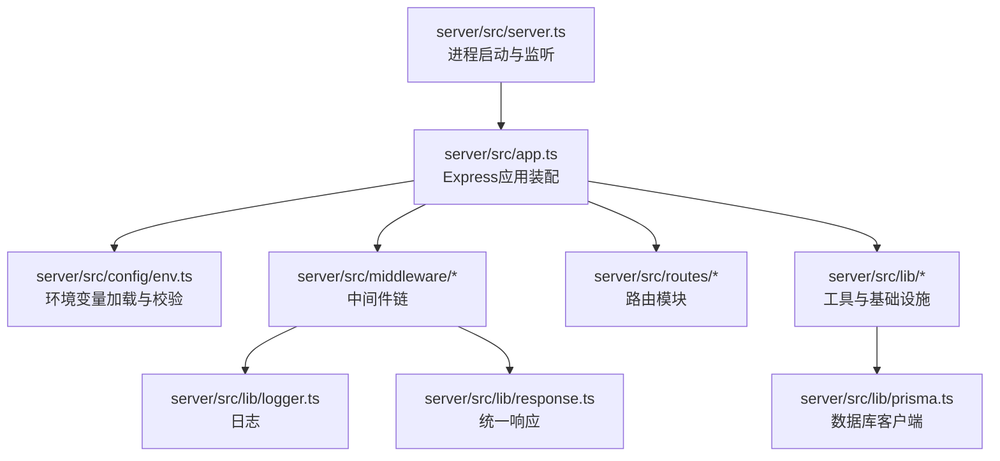
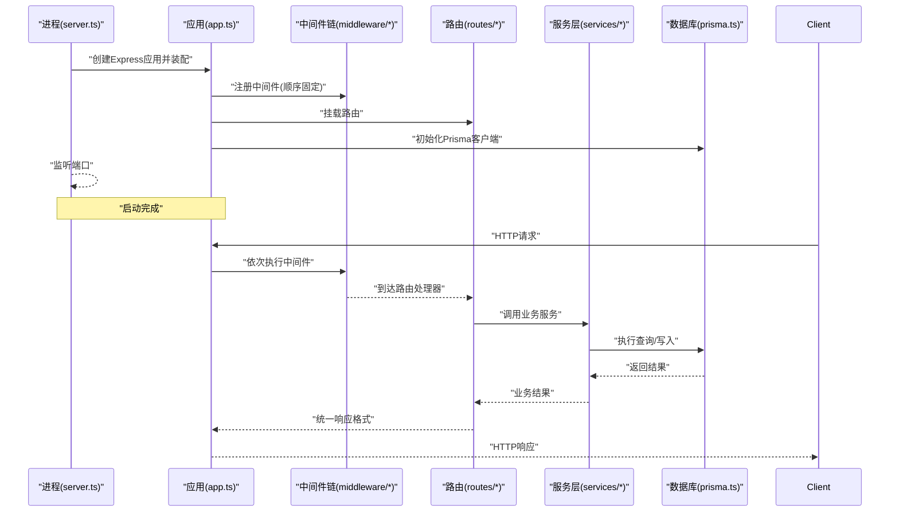
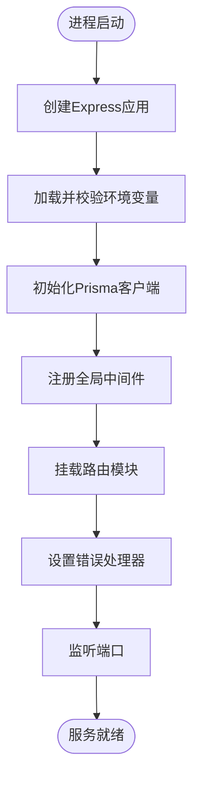
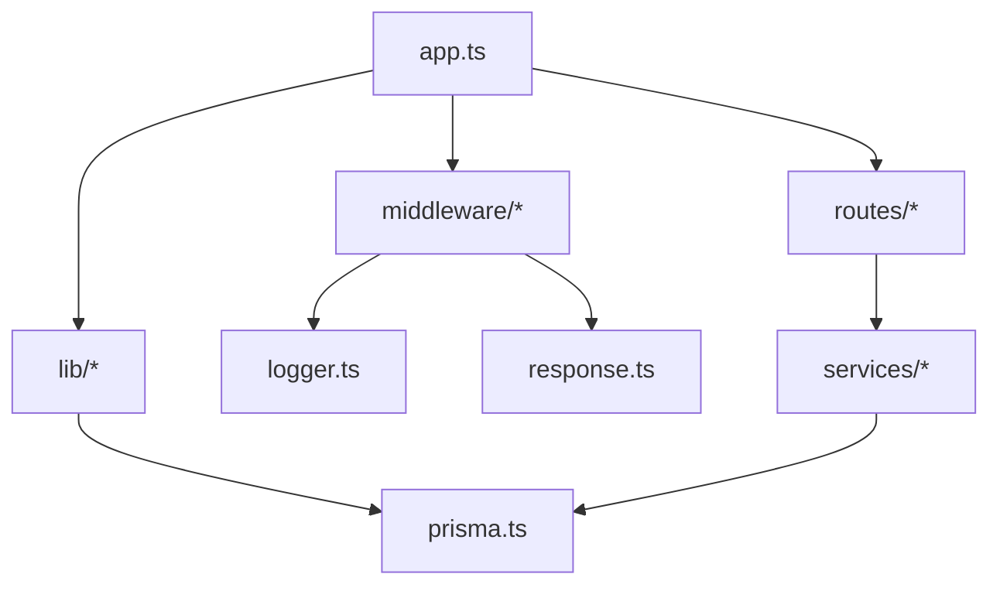

# Express服务器配置

<cite>
**本文引用的文件**   
- [server.ts](file://server/src/server.ts)
- [app.ts](file://server/src/app.ts)
- [env.ts](file://server/src/config/env.ts)
- [tsconfig.json](file://server/tsconfig.json)
- [package.json](file://server/package.json)
- [cors.ts](file://server/src/middleware/cors.ts)
- [helmet.ts](file://server/src/middleware/helmet.ts)
- [rate-limit.ts](file://server/src/middleware/rate-limit.ts)
- [auth.ts](file://server/src/middleware/auth.ts)
- [permission.ts](file://server/src/middleware/permission.ts)
- [scope.ts](file://server/src/middleware/scope.ts)
- [soft-delete.ts](file://server/src/middleware/soft-delete.ts)
- [audit.ts](file://server/src/middleware/audit.ts)
- [error-handler.ts](file://server/src/middleware/error-handler.ts)
- [logger.ts](file://server/src/lib/logger.ts)
- [prisma.ts](file://server/src/lib/prisma.ts)
- [async-handler.ts](file://server/src/lib/async-handler.ts)
- [response.ts](file://server/src/lib/response.ts)
- [ai-rate-limit.ts](file://server/src/middleware/ai-rate-limit.ts)
- [trace-id.ts](file://server/src/middleware/trace-id.ts)
- [admin.ts](file://server/src/routes/admin.ts)
- [ai.ts](file://server/src/routes/ai.ts)
- [auth.ts](file://server/src/routes/auth.ts)
- [dashboard.ts](file://server/src/routes/dashboard.ts)
- [data.ts](file://server/src/routes/data.ts)
- [indicators.ts](file://server/src/routes/indicators.ts)
- [reports.ts](file://server/src/routes/reports.ts)
</cite>

## 目录
1. [简介](#简介)
2. [项目结构](#项目结构)
3. [核心组件](#核心组件)
4. [架构总览](#架构总览)
5. [详细组件分析](#详细组件分析)
6. [依赖分析](#依赖分析)
7. [性能考虑](#性能考虑)
8. [故障排查指南](#故障排查指南)
9. [结论](#结论)
10. [附录](#附录)

## 简介
本指南面向FY200后端Express服务器的配置与使用，聚焦于服务器初始化流程、中间件注册顺序、环境变量与TypeScript编译配置、路由模块化设计、启动流程、错误处理与日志记录，以及开发与生产环境的差异化配置和性能优化（连接池、缓存策略等）。项目采用Express 4 + Prisma 5 + PostgreSQL 15 + JWT + DeepSeek API（SSE流式）技术栈，中间件执行链遵循严格顺序：安全头 → 跨域 → JSON解析 → 限流 → 鉴权 → 权限 → 数据范围 → 软删除 → 审计 → 业务服务 → 数据库。

## 项目结构
后端代码位于 server 目录，核心入口为 src/server.ts，应用实例在 src/app.ts 中构建，配置集中在 src/config/env.ts，中间件位于 src/middleware，路由位于 src/routes，通用库位于 src/lib，Prisma 模型与迁移位于 prisma 目录。

图表来源
- [server.ts](file://server/src/server.ts)
- [app.ts](file://server/src/app.ts)
- [env.ts](file://server/src/config/env.ts)
- [prisma.ts](file://server/src/lib/prisma.ts)
- [logger.ts](file://server/src/lib/logger.ts)
- [response.ts](file://server/src/lib/response.ts)

章节来源
- [server.ts](file://server/src/server.ts)
- [app.ts](file://server/src/app.ts)
- [env.ts](file://server/src/config/env.ts)

## 核心组件
- 服务器入口与监听：负责创建HTTP服务、挂载应用、启动端口监听与优雅关闭。
- 应用装配：集中注册全局中间件、挂载路由、设置错误处理器与响应格式。
- 配置管理：通过环境变量提供运行时配置，并在启动时进行类型化校验与默认值填充。
- 中间件链：按固定顺序注入安全、跨域、解析、限流、鉴权、权限、范围、软删除、审计等能力。
- 路由模块：按领域划分路由文件，每个路由文件内组织控制器与业务调用。
- 错误处理：统一异常捕获、错误码映射、结构化错误响应与日志输出。
- 日志记录：结构化日志、请求追踪ID、敏感信息脱敏与分级输出。
- 数据库连接：Prisma客户端初始化、连接池参数、重试与超时策略。

章节来源
- [server.ts](file://server/src/server.ts)
- [app.ts](file://server/src/app.ts)
- [env.ts](file://server/src/config/env.ts)
- [error-handler.ts](file://server/src/middleware/error-handler.ts)
- [logger.ts](file://server/src/lib/logger.ts)
- [prisma.ts](file://server/src/lib/prisma.ts)

## 架构总览
下图展示了从进程启动到请求处理的完整链路，包括中间件顺序、路由分发、服务层调用与数据库访问。

图表来源
- [server.ts](file://server/src/server.ts)
- [app.ts](file://server/src/app.ts)
- [auth.ts](file://server/src/middleware/auth.ts)
- [permission.ts](file://server/src/middleware/permission.ts)
- [scope.ts](file://server/src/middleware/scope.ts)
- [soft-delete.ts](file://server/src/middleware/soft-delete.ts)
- [audit.ts](file://server/src/middleware/audit.ts)
- [error-handler.ts](file://server/src/middleware/error-handler.ts)
- [prisma.ts](file://server/src/lib/prisma.ts)

## 详细组件分析

### 服务器初始化与启动流程
- 进程入口负责创建HTTP服务器、绑定端口、打印启动信息、注册信号处理以实现优雅关闭。
- 应用装配阶段集中注册全局中间件、挂载路由、设置错误处理器与响应包装器。
- 数据库连接在应用启动前初始化，确保后续请求可用。

图表来源
- [server.ts](file://server/src/server.ts)
- [app.ts](file://server/src/app.ts)
- [env.ts](file://server/src/config/env.ts)
- [prisma.ts](file://server/src/lib/prisma.ts)

章节来源
- [server.ts](file://server/src/server.ts)
- [app.ts](file://server/src/app.ts)
- [env.ts](file://server/src/config/env.ts)
- [prisma.ts](file://server/src/lib/prisma.ts)

### 中间件注册顺序与职责
中间件执行链顺序严格固定，确保安全性与一致性：
- helmet：设置安全相关响应头。
- cors：跨域资源共享策略。
- express.json：JSON请求体解析。
- rate-limit：全局速率限制。
- ai-rate-limit：AI接口专用限流。
- trace-id：生成或透传请求追踪ID。
- auth：JWT鉴权与黑名单校验。
- permission：基于角色的权限控制（默认拒绝）。
- scope：基于租户/组织的Prisma扩展数据范围。
- softDelete：软删除语义增强。
- audit：审计日志记录。
- error-handler：统一错误处理。

图表来源
- [helmet.ts](file://server/src/middleware/helmet.ts)
- [cors.ts](file://server/src/middleware/cors.ts)
- [rate-limit.ts](file://server/src/middleware/rate-limit.ts)
- [ai-rate-limit.ts](file://server/src/middleware/ai-rate-limit.ts)
- [trace-id.ts](file://server/src/middleware/trace-id.ts)
- [auth.ts](file://server/src/middleware/auth.ts)
- [permission.ts](file://server/src/middleware/permission.ts)
- [scope.ts](file://server/src/middleware/scope.ts)
- [soft-delete.ts](file://server/src/middleware/soft-delete.ts)
- [audit.ts](file://server/src/middleware/audit.ts)
- [error-handler.ts](file://server/src/middleware/error-handler.ts)

章节来源
- [app.ts](file://server/src/app.ts)
- [helmet.ts](file://server/src/middleware/helmet.ts)
- [cors.ts](file://server/src/middleware/cors.ts)
- [rate-limit.ts](file://server/src/middleware/rate-limit.ts)
- [ai-rate-limit.ts](file://server/src/middleware/ai-rate-limit.ts)
- [trace-id.ts](file://server/src/middleware/trace-id.ts)
- [auth.ts](file://server/src/middleware/auth.ts)
- [permission.ts](file://server/src/middleware/permission.ts)
- [scope.ts](file://server/src/middleware/scope.ts)
- [soft-delete.ts](file://server/src/middleware/soft-delete.ts)
- [audit.ts](file://server/src/middleware/audit.ts)
- [error-handler.ts](file://server/src/middleware/error-handler.ts)

### 环境变量配置（env.ts）
- 提供类型化的环境变量读取与校验，包含默认值与必填项检查。
- 关键配置项涵盖：
  - 服务器：端口、主机、环境标识、调试开关。
  - 数据库：连接字符串、连接池大小、超时、SSL模式。
  - 认证：JWT密钥、过期时间、刷新令牌策略。
  - 限流：全局与AI接口的速率限制阈值。
  - 日志：级别、输出目标、是否脱敏。
  - 外部API：DeepSeek API密钥、代理、超时。
- 启动时若缺失必要变量将抛出明确错误，便于快速定位配置问题。

章节来源
- [env.ts](file://server/src/config/env.ts)

### TypeScript编译配置与依赖管理
- tsconfig.json定义编译目标、模块系统、路径别名、严格模式与测试配置。
- package.json声明运行时与开发依赖，包括Express、Prisma、PostgreSQL驱动、JWT、限流、安全头等。
- 建议：
  - 保持严格模式开启以提升类型安全。
  - 使用路径别名简化导入。
  - 区分生产与开发依赖，避免冗余包体积。

章节来源
- [tsconfig.json](file://server/tsconfig.json)
- [package.json](file://server/package.json)

### 路由模块的组织与模块化设计
- 路由按领域划分：管理员、AI、认证、仪表盘、数据、指标、报表等。
- 每个路由文件内组织控制器函数，调用对应服务层方法，返回统一响应格式。
- 建议：
  - 路由文件命名清晰，职责单一。
  - 控制器仅做参数校验与调用服务，不写业务逻辑。
  - 使用异步处理器包装避免未捕获异常。

章节来源
- [admin.ts](file://server/src/routes/admin.ts)
- [ai.ts](file://server/src/routes/ai.ts)
- [auth.ts](file://server/src/routes/auth.ts)
- [dashboard.ts](file://server/src/routes/dashboard.ts)
- [data.ts](file://server/src/routes/data.ts)
- [indicators.ts](file://server/src/routes/indicators.ts)
- [reports.ts](file://server/src/routes/reports.ts)
- [async-handler.ts](file://server/src/lib/async-handler.ts)
- [response.ts](file://server/src/lib/response.ts)

### 错误处理机制
- 统一错误处理器捕获中间件与路由中的异常，转换为标准错误响应。
- 支持自定义错误类型、状态码映射与敏感信息过滤。
- 结合日志记录输出堆栈与上下文，便于排障。

章节来源
- [error-handler.ts](file://server/src/middleware/error-handler.ts)
- [logger.ts](file://server/src/lib/logger.ts)

### 日志记录配置
- 结构化日志输出，包含请求ID、用户信息、耗时、状态码等。
- 支持分级日志（debug、info、warn、error），可按环境切换。
- 敏感字段自动脱敏，避免泄露机密信息。

章节来源
- [logger.ts](file://server/src/lib/logger.ts)
- [trace-id.ts](file://server/src/middleware/trace-id.ts)

### 数据库连接与连接池
- Prisma客户端在启动时初始化，配置连接池大小、超时、重试策略。
- 根据环境动态调整连接参数，生产环境建议启用连接复用与持久化。
- 建议监控连接池使用率与慢查询，及时优化。

章节来源
- [prisma.ts](file://server/src/lib/prisma.ts)
- [env.ts](file://server/src/config/env.ts)

### AI双管道架构（SSE流式）
- polish管道：文本输入→脱敏→LLM→还原输出。
- analyze管道：结构化数据→计算→脱敏→LLM→生成报告。
- 限流与超时控制保障稳定性，SSE流式响应提升用户体验。

章节来源
- [ai.ts](file://server/src/routes/ai.ts)
- [ai-rate-limit.ts](file://server/src/middleware/ai-rate-limit.ts)
- [deepseek.ts](file://server/src/lib/deepseek.ts)

## 依赖分析
Express应用依赖中间件、路由、服务层与数据库客户端，各模块间耦合度低、职责清晰。

图表来源
- [app.ts](file://server/src/app.ts)
- [prisma.ts](file://server/src/lib/prisma.ts)
- [logger.ts](file://server/src/lib/logger.ts)
- [response.ts](file://server/src/lib/response.ts)

章节来源
- [app.ts](file://server/src/app.ts)
- [package.json](file://server/package.json)

## 性能考虑
- 连接池：合理设置Prisma连接池大小，避免过多连接导致资源竞争。
- 缓存策略：对热点数据使用内存缓存（如Redis），减少数据库压力。
- 限流：全局与AI接口分别限流，防止滥用与雪崩。
- 压缩：启用Gzip/Brotli压缩传输。
- 静态资源：分离静态资源托管，使用CDN加速。
- 监控：接入APM与指标采集，观察QPS、延迟、错误率。

[本节为通用指导，无需引用具体文件]

## 故障排查指南
- 启动失败：检查环境变量是否齐全，数据库连接是否正常。
- 鉴权失败：确认JWT密钥、过期时间与黑名单策略。
- 权限拒绝：检查角色与权限配置，确认默认拒绝策略。
- 限流触发：调整限流阈值或扩容实例。
- 数据库慢查询：使用Prisma日志与数据库慢查询日志定位。
- 日志缺失：确认日志级别与输出目标配置。

章节来源
- [env.ts](file://server/src/config/env.ts)
- [auth.ts](file://server/src/middleware/auth.ts)
- [permission.ts](file://server/src/middleware/permission.ts)
- [rate-limit.ts](file://server/src/middleware/rate-limit.ts)
- [logger.ts](file://server/src/lib/logger.ts)

## 结论
本指南系统梳理了FY200后端Express服务器的配置与运行要点，涵盖初始化流程、中间件顺序、环境变量、TypeScript编译、路由模块化、错误处理、日志记录与性能优化。遵循本文档可快速搭建、稳定运行并高效排障。

[本节为总结性内容，无需引用具体文件]

## 附录
- 开发环境与生产环境差异化配置建议：
  - 开发：开启详细日志、禁用部分安全检查、本地数据库直连。
  - 生产：关闭调试信息、启用HTTPS、连接池调优、限流收紧、外部API代理。
- 常用命令：
  - 启动开发：安装依赖后运行开发脚本。
  - 构建生产：编译TypeScript并打包。
  - 数据库迁移：执行Prisma迁移与种子数据。

[本节为补充说明，无需引用具体文件]