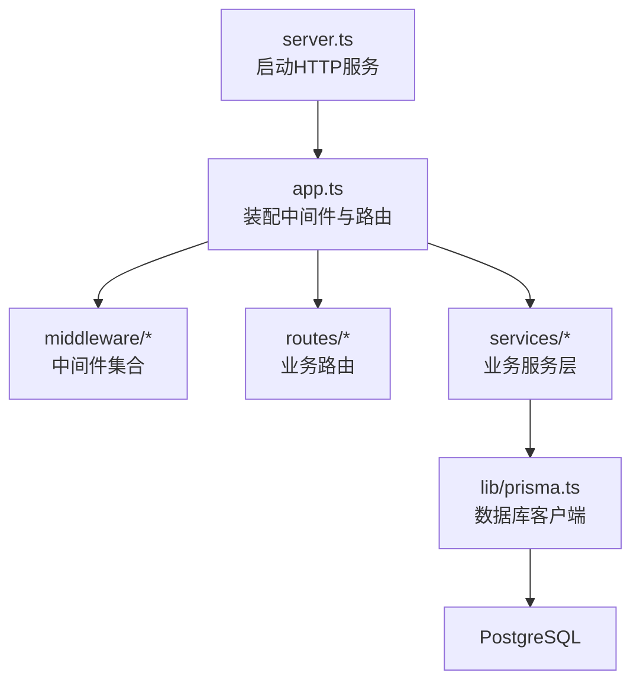
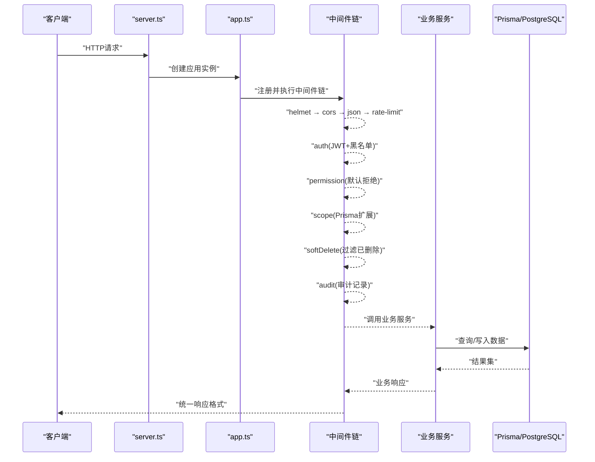
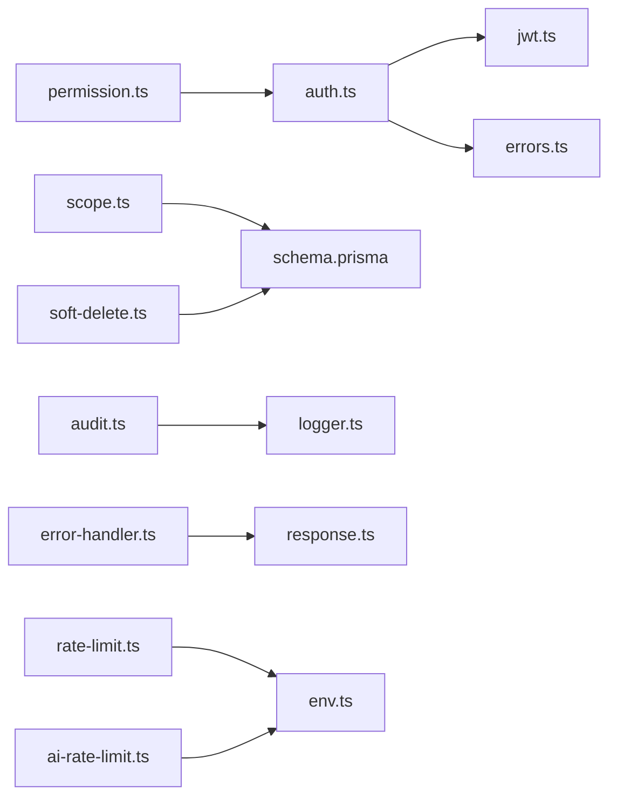

# 中间件开发

<cite>
**本文引用的文件**   
- [server.ts](file://server/src/server.ts)
- [app.ts](file://server/src/app.ts)
- [env.ts](file://server/src/config/env.ts)
- [helmet.ts](file://server/src/middleware/helmet.ts)
- [cors.ts](file://server/src/middleware/cors.ts)
- [rate-limit.ts](file://server/src/middleware/rate-limit.ts)
- [auth.ts](file://server/src/middleware/auth.ts)
- [permission.ts](file://server/src/middleware/permission.ts)
- [scope.ts](file://server/src/middleware/scope.ts)
- [soft-delete.ts](file://server/src/middleware/soft-delete.ts)
- [audit.ts](file://server/src/middleware/audit.ts)
- [error-handler.ts](file://server/src/middleware/error-handler.ts)
- [trace-id.ts](file://server/src/middleware/trace-id.ts)
- [jwt.ts](file://server/src/lib/jwt.ts)
- [logger.ts](file://server/src/lib/logger.ts)
- [errors.ts](file://server/src/lib/errors.ts)
- [async-handler.ts](file://server/src/lib/async-handler.ts)
- [response.ts](file://server/src/lib/response.ts)
- [schema.prisma](file://server/prisma/schema.prisma)
- [ai-rate-limit.ts](file://server/src/middleware/ai-rate-limit.ts)
</cite>

## 目录
1. [简介](#简介)
2. [项目结构](#项目结构)
3. [核心组件](#核心组件)
4. [架构总览](#架构总览)
5. [详细组件分析](#详细组件分析)
6. [依赖关系分析](#依赖关系分析)
7. [性能考量](#性能考量)
8. [故障排查指南](#故障排查指南)
9. [结论](#结论)
10. [附录](#附录)

## 简介
本指南面向FY200后端中间件开发与扩展，围绕Express中间件链的执行顺序、生命周期管理、自定义中间件模式（异步处理、错误传递、上下文共享），以及核心中间件的实现与配置进行系统化说明。同时提供测试方法、调试技巧、性能监控与日志记录最佳实践，帮助开发者快速构建稳定、可观测、可扩展的请求处理管线。

## 项目结构
FY200后端采用Express应用组织方式，中间件集中在src/middleware目录，按职责划分：安全头、跨域、限流、认证、权限、数据范围、软删除、审计、错误处理、链路追踪等。应用入口在server.ts中启动HTTP服务，app.ts中装配路由与中间件，config/env.ts集中管理环境变量。

图表来源
- [server.ts](file://server/src/server.ts)
- [app.ts](file://server/src/app.ts)

章节来源
- [server.ts](file://server/src/server.ts)
- [app.ts](file://server/src/app.ts)
- [env.ts](file://server/src/config/env.ts)

## 核心组件
- 执行链顺序（默认）：安全头 → 跨域 → JSON解析 → 请求限流 → JWT认证（含黑名单校验）→ 权限控制（默认拒绝）→ 数据范围控制（Prisma扩展）→ 软删除过滤 → 审计记录 → 业务服务 → Prisma → PostgreSQL
- 关键能力：
  - 统一错误处理与响应封装
  - 链路追踪ID注入与透传
  - 基于JWT的访问令牌校验与刷新策略
  - 基于角色/资源的细粒度权限控制
  - 基于租户/公司/部门的数据范围隔离
  - 软删除数据的自动过滤与一致性保障
  - 审计日志与操作留痕
  - AI接口专用限流与保护

章节来源
- [app.ts](file://server/src/app.ts)
- [auth.ts](file://server/src/middleware/auth.ts)
- [permission.ts](file://server/src/middleware/permission.ts)
- [scope.ts](file://server/src/middleware/scope.ts)
- [soft-delete.ts](file://server/src/middleware/soft-delete.ts)
- [audit.ts](file://server/src/middleware/audit.ts)
- [error-handler.ts](file://server/src/middleware/error-handler.ts)
- [trace-id.ts](file://server/src/middleware/trace-id.ts)
- [ai-rate-limit.ts](file://server/src/middleware/ai-rate-limit.ts)

## 架构总览
下图展示从请求进入至返回的全链路中间件调用序列，体现上下文共享与错误传播路径。

图表来源
- [server.ts](file://server/src/server.ts)
- [app.ts](file://server/src/app.ts)
- [auth.ts](file://server/src/middleware/auth.ts)
- [permission.ts](file://server/src/middleware/permission.ts)
- [scope.ts](file://server/src/middleware/scope.ts)
- [soft-delete.ts](file://server/src/middleware/soft-delete.ts)
- [audit.ts](file://server/src/middleware/audit.ts)
- [error-handler.ts](file://server/src/middleware/error-handler.ts)

## 详细组件分析

### 安全与基础中间件
- helmet：设置安全相关HTTP头，降低常见Web攻击面
- cors：配置跨域白名单、方法与头部策略
- express.json：解析JSON请求体，配合限流避免滥用
- trace-id：为每个请求生成唯一追踪ID，贯穿日志与审计

章节来源
- [helmet.ts](file://server/src/middleware/helmet.ts)
- [cors.ts](file://server/src/middleware/cors.ts)
- [trace-id.ts](file://server/src/middleware/trace-id.ts)

### 请求限流中间件
- rate-limit：通用请求限流，支持IP/用户维度计数与窗口控制
- ai-rate-limit：AI接口专用限流，结合SSE流式场景做更严格的节流

章节来源
- [rate-limit.ts](file://server/src/middleware/rate-limit.ts)
- [ai-rate-limit.ts](file://server/src/middleware/ai-rate-limit.ts)

### 认证中间件（JWT + 黑名单）
- 功能要点：
  - 从请求头提取access token并校验签名与过期时间
  - 校验token是否在黑名单中（登出或强制下线）
  - 将用户上下文挂载到req.user，供后续中间件使用
  - 支持refresh token轮转策略（access短效、refresh长效）
- 错误处理：未授权、令牌失效、黑名单命中等统一错误码与消息

章节来源
- [auth.ts](file://server/src/middleware/auth.ts)
- [jwt.ts](file://server/src/lib/jwt.ts)
- [errors.ts](file://server/src/lib/errors.ts)

### 权限控制中间件（默认拒绝）
- 功能要点：
  - 基于角色/资源/动作的RBAC模型，默认拒绝未显式授权的访问
  - 支持动态权限规则与资源级鉴权
  - 失败时返回明确的权限不足信息
- 扩展点：可通过策略函数或元数据声明式配置权限

章节来源
- [permission.ts](file://server/src/middleware/permission.ts)

### 数据范围控制中间件（Prisma扩展）
- 功能要点：
  - 基于租户/公司/部门等维度对查询自动附加过滤条件
  - 通过Prisma扩展注入where条件，保证数据隔离
  - 写操作时确保归属字段正确填充
- 适用场景：多租户、组织内数据隔离、行级权限

章节来源
- [scope.ts](file://server/src/middleware/scope.ts)
- [schema.prisma](file://server/prisma/schema.prisma)

### 软删除中间件
- 功能要点：
  - 查询时自动追加isDeleted=false条件，隐藏已删除数据
  - 更新/删除时标记为已删除而非物理删除
  - 与审计中间件联动记录变更轨迹
- 注意事项：需确保所有表包含软删除字段并在迁移中生效

章节来源
- [soft-delete.ts](file://server/src/middleware/soft-delete.ts)
- [schema.prisma](file://server/prisma/schema.prisma)

### 审计中间件
- 功能要点：
  - 记录关键操作的请求上下文、用户身份、资源与动作
  - 支持敏感字段脱敏与结构化输出
  - 异步落库或消息队列上报，避免阻塞主流程

章节来源
- [audit.ts](file://server/src/middleware/audit.ts)
- [logger.ts](file://server/src/lib/logger.ts)

### 错误处理与统一响应
- error-handler：捕获未处理异常、格式化错误响应、记录堆栈
- response：统一成功/失败响应结构与状态码
- async-handler：包装异步路由处理器，简化try/catch样板代码

章节来源
- [error-handler.ts](file://server/src/middleware/error-handler.ts)
- [response.ts](file://server/src/lib/response.ts)
- [async-handler.ts](file://server/src/lib/async-handler.ts)

### 自定义中间件开发模式
- 基本形态：接收(req, res, next)，在next()前后插入逻辑
- 异步处理：使用async/await并通过async-handler包裹，避免未捕获Promise拒绝
- 错误传递：抛出标准化错误对象，由error-handler统一处理
- 上下文共享：向req挂载用户、租户、追踪ID等上下文，供下游使用
- 组合与复用：通过高阶函数或工厂函数生成可配置的中间件实例

章节来源
- [auth.ts](file://server/src/middleware/auth.ts)
- [permission.ts](file://server/src/middleware/permission.ts)
- [scope.ts](file://server/src/middleware/scope.ts)
- [soft-delete.ts](file://server/src/middleware/soft-delete.ts)
- [audit.ts](file://server/src/middleware/audit.ts)
- [async-handler.ts](file://server/src/lib/async-handler.ts)
- [errors.ts](file://server/src/lib/errors.ts)

### 中间件配置选项与扩展点
- 环境变量驱动：通过env.ts集中读取配置（如限流阈值、CORS白名单、JWT密钥）
- 策略开关：可按路由或模块启用/禁用特定中间件（如AI接口单独限流）
- 扩展点：
  - 权限策略函数：用于动态判定是否允许访问
  - 数据范围策略：根据用户上下文动态注入过滤条件
  - 审计事件钩子：自定义审计事件类型与字段映射
  - 错误映射器：将领域错误映射为HTTP语义化响应

章节来源
- [env.ts](file://server/src/config/env.ts)
- [permission.ts](file://server/src/middleware/permission.ts)
- [scope.ts](file://server/src/middleware/scope.ts)
- [audit.ts](file://server/src/middleware/audit.ts)
- [ai-rate-limit.ts](file://server/src/middleware/ai-rate-limit.ts)

## 依赖关系分析
中间件之间通过Express上下文串联，强依赖顺序与职责边界清晰。核心依赖包括：
- 认证依赖JWT工具与错误定义
- 权限依赖用户上下文与策略函数
- 数据范围依赖Prisma扩展与Schema定义
- 审计依赖日志与异步任务
- 错误处理依赖统一响应与错误映射

图表来源
- [auth.ts](file://server/src/middleware/auth.ts)
- [jwt.ts](file://server/src/lib/jwt.ts)
- [permission.ts](file://server/src/middleware/permission.ts)
- [scope.ts](file://server/src/middleware/scope.ts)
- [soft-delete.ts](file://server/src/middleware/soft-delete.ts)
- [audit.ts](file://server/src/middleware/audit.ts)
- [error-handler.ts](file://server/src/middleware/error-handler.ts)
- [response.ts](file://server/src/lib/response.ts)
- [rate-limit.ts](file://server/src/middleware/rate-limit.ts)
- [ai-rate-limit.ts](file://server/src/middleware/ai-rate-limit.ts)
- [env.ts](file://server/src/config/env.ts)
- [schema.prisma](file://server/prisma/schema.prisma)

章节来源
- [app.ts](file://server/src/app.ts)
- [auth.ts](file://server/src/middleware/auth.ts)
- [permission.ts](file://server/src/middleware/permission.ts)
- [scope.ts](file://server/src/middleware/scope.ts)
- [soft-delete.ts](file://server/src/middleware/soft-delete.ts)
- [audit.ts](file://server/src/middleware/audit.ts)
- [error-handler.ts](file://server/src/middleware/error-handler.ts)
- [rate-limit.ts](file://server/src/middleware/rate-limit.ts)
- [ai-rate-limit.ts](file://server/src/middleware/ai-rate-limit.ts)
- [env.ts](file://server/src/config/env.ts)
- [schema.prisma](file://server/prisma/schema.prisma)

## 性能考量
- 中间件顺序优化：将轻量且必要的中间件前置（如trace-id、cors、json），将耗时操作后置（如审计落库）
- 限流与缓存：对高频接口启用rate-limit；对读多写少的数据使用缓存层
- 数据库查询优化：通过scope与Prisma扩展精准过滤，避免全表扫描；合理使用索引
- 异步与批处理：审计与指标上报采用异步队列，避免阻塞主线程
- SSE流式：AI接口使用SSE时需关注连接数与内存占用，合理设置超时与重试

[本节为通用指导，不直接分析具体文件]

## 故障排查指南
- 常见问题定位：
  - 认证失败：检查JWT签名、过期时间与黑名单状态
  - 权限不足：确认用户角色与资源动作匹配，查看权限策略函数
  - 数据范围异常：核查scope注入的where条件与用户上下文
  - 软删除问题：确认表结构与查询是否包含isDeleted过滤
  - 限流触发：检查rate-limit阈值与IP/用户维度计数
- 调试技巧：
  - 开启trace-id并在日志中打印，便于跨服务关联
  - 使用统一的错误响应结构，快速识别错误码与消息
  - 对关键中间件增加入参/出参日志（注意脱敏）
  - 使用集成测试模拟完整请求链路，覆盖异常分支

章节来源
- [auth.ts](file://server/src/middleware/auth.ts)
- [permission.ts](file://server/src/middleware/permission.ts)
- [scope.ts](file://server/src/middleware/scope.ts)
- [soft-delete.ts](file://server/src/middleware/soft-delete.ts)
- [rate-limit.ts](file://server/src/middleware/rate-limit.ts)
- [error-handler.ts](file://server/src/middleware/error-handler.ts)
- [logger.ts](file://server/src/lib/logger.ts)
- [errors.ts](file://server/src/lib/errors.ts)

## 结论
FY200中间件体系以清晰的执行顺序与职责边界为基础，结合JWT认证、RBAC权限、数据范围隔离、软删除与审计等核心能力，构建了高内聚、低耦合的请求处理管线。通过环境配置与策略扩展点，开发者可灵活定制行为，满足复杂业务需求。遵循本文的最佳实践，可有效提升系统的稳定性、可观测性与可维护性。

[本节为总结性内容，不直接分析具体文件]

## 附录
- 中间件开发清单：
  - 明确中间件职责与执行顺序
  - 使用async-handler包裹异步逻辑
  - 标准化错误对象与响应结构
  - 通过req上下文共享必要信息
  - 编写单元测试与集成测试覆盖正常与异常路径
- 推荐工具与约定：
  - 日志级别与脱敏规范
  - 错误码字典与国际化消息
  - 限流策略与告警阈值
  - 审计事件模型与存储策略

[本节为补充信息，不直接分析具体文件]