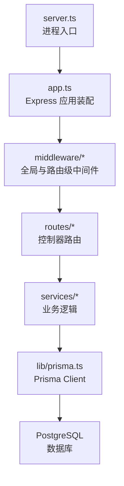
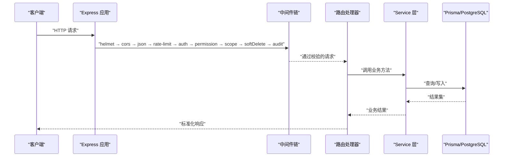
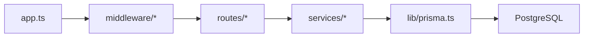
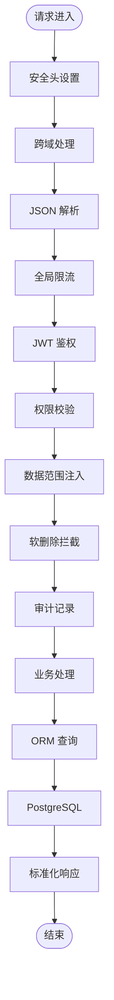

# 中间件生命周期与执行链

<cite>
**本文引用的文件**   
- [server.ts](file://server/server.ts)
- [app.ts](file://server/src/app.ts)
- [helmet.ts](file://server/src/middleware/helmet.ts)
- [cors.ts](file://server/src/middleware/cors.ts)
- [rate-limit.ts](file://server/src/middleware/rate-limit.ts)
- [ai-rate-limit.ts](file://server/src/middleware/ai-rate-limit.ts)
- [auth.ts](file://server/src/middleware/auth.ts)
- [permission.ts](file://server/src/middleware/permission.ts)
- [scope.ts](file://server/src/middleware/scope.ts)
- [soft-delete.ts](file://server/src/middleware/soft-delete.ts)
- [audit.ts](file://server/src/middleware/audit.ts)
- [error-handler.ts](file://server/src/middleware/error-handler.ts)
- [trace-id.ts](file://server/src/middleware/trace-id.ts)
- [prisma.ts](file://server/src/lib/prisma.ts)
- [env.ts](file://server/src/config/env.ts)
- [async-handler.ts](file://server/src/lib/async-handler.ts)
- [errors.ts](file://server/src/lib/errors.ts)
- [response.ts](file://server/src/lib/response.ts)
- [admin.ts](file://server/src/routes/admin.ts)
- [auth.ts](file://server/src/routes/auth.ts)
- [ai.ts](file://server/src/routes/ai.ts)
- [dashboard.ts](file://server/src/routes/dashboard.ts)
- [data.ts](file://server/src/routes/data.ts)
- [indicators.ts](file://server/src/routes/indicators.ts)
- [reports.ts](file://server/src/routes/reports.ts)
</cite>

## 目录
1. [简介](#简介)
2. [项目结构](#项目结构)
3. [核心组件](#核心组件)
4. [架构总览](#架构总览)
5. [详细组件分析](#详细组件分析)
6. [依赖关系分析](#依赖关系分析)
7. [性能考量](#性能考量)
8. [故障排查指南](#故障排查指南)
9. [结论](#结论)
10. [附录](#附录)

## 简介
本文件系统性梳理 FY200 后端 Express 应用的中间件生命周期与执行链，围绕“helmet → cors → express.json → rate-limit → auth → permission → scope → softDelete → audit → Service → Prisma → PostgreSQL”的既定顺序展开。文档将解释每个中间件的职责边界、错误处理机制、注册方式、参数传递与上下文共享模式，并提供自定义中间件的创建模板与最佳实践，帮助读者快速理解并安全扩展请求处理管线。

## 项目结构
FY200 后端采用分层组织：应用入口与路由注册位于 server/src，通用中间件集中在 middleware 目录，领域服务在 services，数据访问通过 Prisma 封装于 lib/prisma.ts，配置集中于 config/env.ts。Express 应用启动时按固定顺序挂载全局中间件，随后为各路由模块挂载业务中间件（鉴权、权限、范围、软删除、审计等），最终进入 Service 层调用 Prisma 访问 PostgreSQL。

图表来源
- [server.ts](file://server/server.ts)
- [app.ts](file://server/src/app.ts)

章节来源
- [server.ts](file://server/server.ts)
- [app.ts](file://server/src/app.ts)

## 核心组件
- 应用装配与中间件注册：Express 实例化后，依次注册安全、跨域、JSON 解析、限流、鉴权、权限、数据范围、软删除、审计等中间件，最后挂载路由。
- 错误处理：统一错误处理器捕获异常，标准化响应格式，记录日志，避免未处理拒绝导致进程崩溃。
- 上下文共享：通过 req/res 对象扩展（如用户信息、租户范围、追踪ID）在各中间件间传递。
- 异步包装：对基于回调或 Promise 的路由处理器进行统一包装，确保异常可被错误处理器捕获。

章节来源
- [app.ts](file://server/src/app.ts)
- [error-handler.ts](file://server/src/middleware/error-handler.ts)
- [async-handler.ts](file://server/src/lib/async-handler.ts)

## 架构总览
下图展示从 HTTP 请求到数据库响应的完整链路，体现中间件顺序与职责分工。

图表来源
- [app.ts](file://server/src/app.ts)
- [error-handler.ts](file://server/src/middleware/error-handler.ts)
- [prisma.ts](file://server/src/lib/prisma.ts)

## 详细组件分析

### 中间件执行顺序与职责
- helmet：设置安全相关响应头（CSP、X-Frame-Options 等），防御常见 Web 攻击面。
- cors：根据环境配置允许跨域，支持预检请求与凭据策略。
- express.json：解析 JSON 请求体，限制大小并处理非法 JSON。
- rate-limit：针对全局限流与 AI 专用限流（SSE 场景），防止滥用与资源耗尽。
- auth：JWT 验证与黑名单检查，注入用户上下文（如 userId、角色）。
- permission：默认拒绝策略，基于路由元数据或装饰器声明式授权。
- scope：通过 Prisma extension 注入数据范围（如公司/部门维度），自动过滤查询。
- softDelete：拦截写操作，将删除改为标记状态变更，保证历史可追溯。
- audit：记录关键操作的审计日志（谁、何时、做了什么、影响范围）。
- Service：业务编排与计算（指标公式、同比环比、AI 管道等）。
- Prisma：类型安全的 ORM 查询构建与事务管理。
- PostgreSQL：持久化存储。

章节来源
- [helmet.ts](file://server/src/middleware/helmet.ts)
- [cors.ts](file://server/src/middleware/cors.ts)
- [rate-limit.ts](file://server/src/middleware/rate-limit.ts)
- [ai-rate-limit.ts](file://server/src/middleware/ai-rate-limit.ts)
- [auth.ts](file://server/src/middleware/auth.ts)
- [permission.ts](file://server/src/middleware/permission.ts)
- [scope.ts](file://server/src/middleware/scope.ts)
- [soft-delete.ts](file://server/src/middleware/soft-delete.ts)
- [audit.ts](file://server/src/middleware/audit.ts)

### 中间件注册与装配
- 全局中间件：在应用启动阶段按顺序注册，确保所有请求都经过安全与基础处理。
- 路由级中间件：在路由定义前挂载，用于细粒度控制（如仅对特定接口启用限流或审计）。
- 错误处理中间件：必须放在所有路由之后，作为兜底捕获未处理异常。

章节来源
- [app.ts](file://server/src/app.ts)
- [error-handler.ts](file://server/src/middleware/error-handler.ts)

### 上下文共享与参数传递
- 请求上下文：req.user、req.scope、req.traceId 等字段在各中间件间共享。
- 响应上下文：res.locals 可用于传递下游需要的数据（如审计上下文）。
- 环境变量：通过 env.ts 集中读取，避免硬编码。

章节来源
- [env.ts](file://server/src/config/env.ts)
- [trace-id.ts](file://server/src/middleware/trace-id.ts)

### 错误处理机制
- 统一错误处理器：捕获同步/异步异常，区分业务错误与系统错误，返回标准格式。
- 异步包装：对路由处理器使用 asyncHandler 包裹，避免 try-catch 重复。
- 日志与追踪：结合 traceId 与结构化日志，便于问题定位。

章节来源
- [error-handler.ts](file://server/src/middleware/error-handler.ts)
- [async-handler.ts](file://server/src/lib/async-handler.ts)
- [errors.ts](file://server/src/lib/errors.ts)
- [response.ts](file://server/src/lib/response.ts)

### 自定义中间件模板与最佳实践
- 模板要点：
  - 明确输入校验与失败响应
  - 必要时扩展 req/res 上下文
  - 正确调用 next() 或提前返回
  - 使用 asyncHandler 包装异步逻辑
- 最佳实践：
  - 单一职责：每个中间件只做一件事
  - 幂等性：避免副作用或确保可重试
  - 可观测性：记录必要日志与指标
  - 安全性：最小权限原则与输入净化

章节来源
- [async-handler.ts](file://server/src/lib/async-handler.ts)
- [errors.ts](file://server/src/lib/errors.ts)

## 依赖关系分析
- 中间件耦合度低：通过 req/res 上下文解耦，便于独立测试与替换。
- 外部依赖：Prisma 与 PostgreSQL 通过 lib/prisma.ts 抽象，便于切换与扩展。
- 路由与服务：路由仅负责参数校验与编排，业务逻辑下沉至 Service。

图表来源
- [app.ts](file://server/src/app.ts)
- [prisma.ts](file://server/src/lib/prisma.ts)

章节来源
- [app.ts](file://server/src/app.ts)
- [prisma.ts](file://server/src/lib/prisma.ts)

## 性能考量
- 限流策略：全局限流与 AI 专用限流分离，避免长耗时 SSE 阻塞普通接口。
- 解析开销：合理设置 JSON 大小限制，避免过大请求体拖慢处理。
- 数据库访问：利用 Prisma 的连接池与查询优化，减少 N+1 查询。
- 缓存建议：热点数据可引入内存缓存（如 Redis），降低数据库压力。

[本节为通用指导，不直接分析具体文件]

## 故障排查指南
- 常见问题：
  - 跨域失败：检查 CORS 配置与预检请求
  - 鉴权失败：确认 JWT 有效性与黑名单状态
  - 权限拒绝：核对路由权限声明与用户角色
  - 数据范围错误：检查 scope 注入是否正确
  - 软删除误删：确认写操作是否被拦截并转为状态更新
- 定位手段：
  - 查看 traceId 关联日志
  - 开启调试日志与指标上报
  - 使用集成测试复现问题

章节来源
- [error-handler.ts](file://server/src/middleware/error-handler.ts)
- [auth.ts](file://server/src/middleware/auth.ts)
- [permission.ts](file://server/src/middleware/permission.ts)
- [scope.ts](file://server/src/middleware/scope.ts)
- [soft-delete.ts](file://server/src/middleware/soft-delete.ts)
- [audit.ts](file://server/src/middleware/audit.ts)

## 结论
FY200 的中间件链以清晰的分层与严格的顺序保障安全、稳定与可观测性。通过统一的错误处理、上下文共享与可扩展的中间件机制，团队可以快速迭代功能并保持系统健壮性。建议在新增功能时遵循单一职责与最小权限原则，充分利用现有模板与最佳实践，确保代码质量与运行稳定性。

## 附录

### 中间件执行流程图

图表来源
- [app.ts](file://server/src/app.ts)
- [error-handler.ts](file://server/src/middleware/error-handler.ts)
- [prisma.ts](file://server/src/lib/prisma.ts)

### 路由与中间件装配示例（路径引用）
- 管理员路由：[admin.ts](file://server/src/routes/admin.ts)
- 认证路由：[auth.ts](file://server/src/routes/auth.ts)
- AI 路由：[ai.ts](file://server/src/routes/ai.ts)
- 看板路由：[dashboard.ts](file://server/src/routes/dashboard.ts)
- 数据路由：[data.ts](file://server/src/routes/data.ts)
- 指标路由：[indicators.ts](file://server/src/routes/indicators.ts)
- 报表路由：[reports.ts](file://server/src/routes/reports.ts)

章节来源
- [admin.ts](file://server/src/routes/admin.ts)
- [auth.ts](file://server/src/routes/auth.ts)
- [ai.ts](file://server/src/routes/ai.ts)
- [dashboard.ts](file://server/src/routes/dashboard.ts)
- [data.ts](file://server/src/routes/data.ts)
- [indicators.ts](file://server/src/routes/indicators.ts)
- [reports.ts](file://server/src/routes/reports.ts)