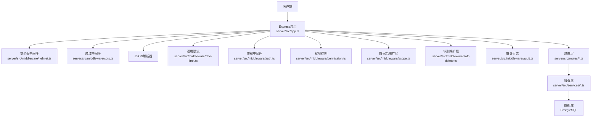
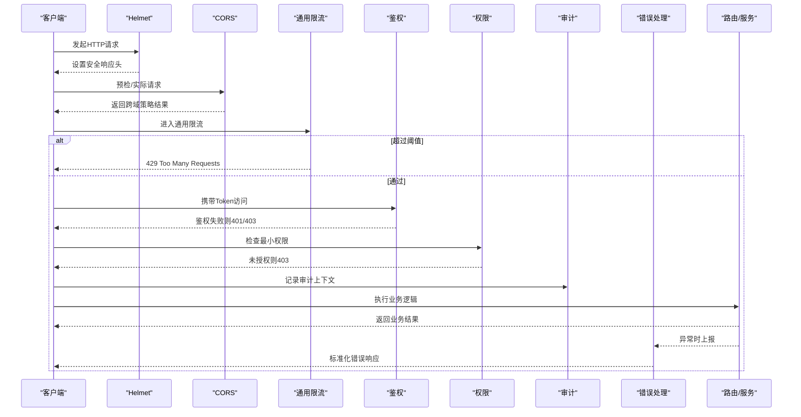
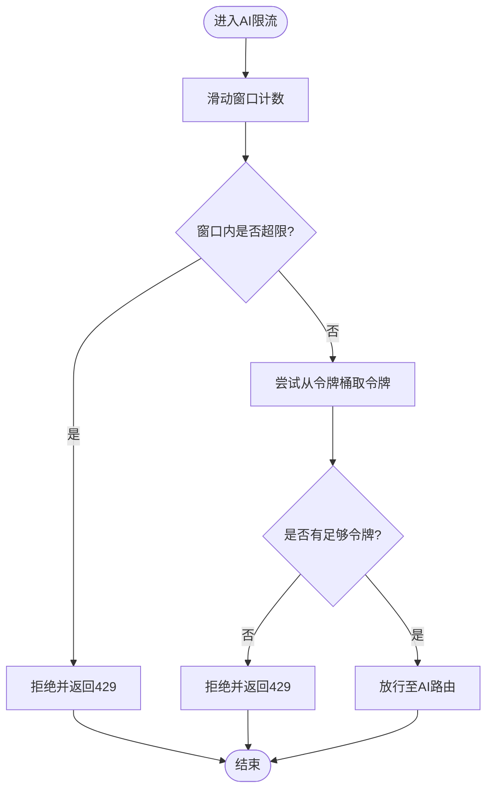
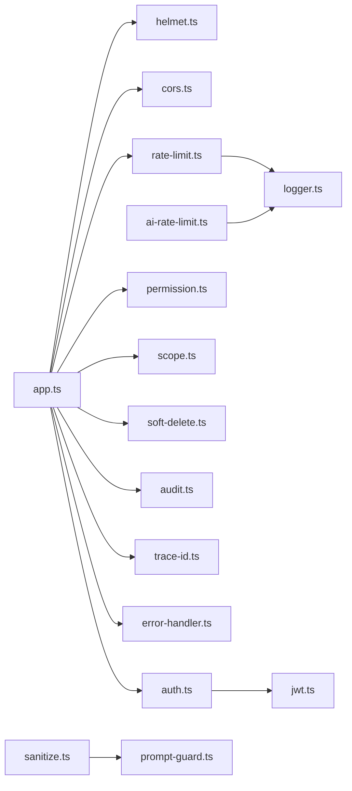

# 安全防护中间件

<cite>
**本文引用的文件**   
- [server/src/app.ts](file://server/src/app.ts)
- [server/src/server.ts](file://server/src/server.ts)
- [server/src/middleware/helmet.ts](file://server/src/middleware/helmet.ts)
- [server/src/middleware/cors.ts](file://server/src/middleware/cors.ts)
- [server/src/middleware/rate-limit.ts](file://server/src/middleware/rate-limit.ts)
- [server/src/middleware/ai-rate-limit.ts](file://server/src/middleware/ai-rate-limit.ts)
- [server/src/middleware/auth.ts](file://server/src/middleware/auth.ts)
- [server/src/middleware/permission.ts](file://server/src/middleware/permission.ts)
- [server/src/middleware/scope.ts](file://server/src/middleware/scope.ts)
- [server/src/middleware/soft-delete.ts](file://server/src/middleware/soft-delete.ts)
- [server/src/middleware/audit.ts](file://server/src/middleware/audit.ts)
- [server/src/middleware/error-handler.ts](file://server/src/middleware/error-handler.ts)
- [server/src/middleware/trace-id.ts](file://server/src/middleware/trace-id.ts)
- [server/src/lib/sanitize.ts](file://server/src/lib/sanitize.ts)
- [server/src/lib/prompt-guard.ts](file://server/src/lib/prompt-guard.ts)
- [server/src/lib/jwt.ts](file://server/src/lib/jwt.ts)
- [server/src/lib/logger.ts](file://server/src/lib/logger.ts)
- [server/src/lib/errors.ts](file://server/src/lib/errors.ts)
- [server/src/routes/ai.ts](file://server/src/routes/ai.ts)
- [server/src/services/AIProxyService.ts](file://server/src/services/AIProxyService.ts)
</cite>

## 目录
1. [简介](#简介)
2. [项目结构](#项目结构)
3. [核心组件](#核心组件)
4. [架构总览](#架构总览)
5. [详细组件分析](#详细组件分析)
6. [依赖关系分析](#依赖关系分析)
7. [性能考量](#性能考量)
8. [故障排查指南](#故障排查指南)
9. [结论](#结论)
10. [附录](#附录)

## 简介
本文件面向FY200安全防护中间件，系统性阐述HTTP安全头（Helmet）、CORS跨域策略、通用与AI专用请求频率限制、输入验证与输出清理、以及安全监控与告警配置。文档同时给出最佳实践与常见攻击防护方案，帮助开发者快速理解并正确落地安全能力。

## 项目结构
后端采用Express中间件链式处理，按固定顺序执行：helmet → cors → express.json → rate-limit → auth(JWT+黑名单) → permission(默认拒绝) → scope(Prisma扩展) → softDelete → audit → Service → Prisma → PostgreSQL。AI接口在通用限流基础上叠加专用限流，确保LLM调用资源可控。

图表来源
- [server/src/app.ts](file://server/src/app.ts)
- [server/src/middleware/helmet.ts](file://server/src/middleware/helmet.ts)
- [server/src/middleware/cors.ts](file://server/src/middleware/cors.ts)
- [server/src/middleware/rate-limit.ts](file://server/src/middleware/rate-limit.ts)
- [server/src/middleware/auth.ts](file://server/src/middleware/auth.ts)
- [server/src/middleware/permission.ts](file://server/src/middleware/permission.ts)
- [server/src/middleware/scope.ts](file://server/src/middleware/scope.ts)
- [server/src/middleware/soft-delete.ts](file://server/src/middleware/soft-delete.ts)
- [server/src/middleware/audit.ts](file://server/src/middleware/audit.ts)
- [server/src/routes/ai.ts](file://server/src/routes/ai.ts)
- [server/src/services/AIProxyService.ts](file://server/src/services/AIProxyService.ts)

章节来源
- [server/src/app.ts](file://server/src/app.ts)
- [server/src/server.ts](file://server/src/server.ts)

## 核心组件
- HTTP安全头（Helmet）：统一设置响应头，降低XSS、点击劫持等风险。
- CORS跨域策略：白名单域名、方法、头部与凭据控制。
- 通用请求限流：基于滑动窗口或令牌桶的IP/用户维度限流。
- AI专用限流：针对AI接口的令牌桶+滑动窗口组合策略，保护LLM调用成本与稳定性。
- 鉴权与授权：JWT校验、黑名单、最小权限原则（默认拒绝）。
- 输入验证与输出清理：严格校验请求体、过滤敏感信息，防止注入与越权。
- 审计与追踪：全链路TraceID、操作审计、错误上报。

章节来源
- [server/src/middleware/helmet.ts](file://server/src/middleware/helmet.ts)
- [server/src/middleware/cors.ts](file://server/src/middleware/cors.ts)
- [server/src/middleware/rate-limit.ts](file://server/src/middleware/rate-limit.ts)
- [server/src/middleware/ai-rate-limit.ts](file://server/src/middleware/ai-rate-limit.ts)
- [server/src/middleware/auth.ts](file://server/src/middleware/auth.ts)
- [server/src/middleware/permission.ts](file://server/src/middleware/permission.ts)
- [server/src/lib/sanitize.ts](file://server/src/lib/sanitize.ts)
- [server/src/lib/prompt-guard.ts](file://server/src/lib/prompt-guard.ts)
- [server/src/middleware/audit.ts](file://server/src/middleware/audit.ts)
- [server/src/middleware/trace-id.ts](file://server/src/middleware/trace-id.ts)

## 架构总览
下图展示一次典型API请求的安全处理流程，包括限流、鉴权、权限、审计与错误处理。

图表来源
- [server/src/middleware/helmet.ts](file://server/src/middleware/helmet.ts)
- [server/src/middleware/cors.ts](file://server/src/middleware/cors.ts)
- [server/src/middleware/rate-limit.ts](file://server/src/middleware/rate-limit.ts)
- [server/src/middleware/auth.ts](file://server/src/middleware/auth.ts)
- [server/src/middleware/permission.ts](file://server/src/middleware/permission.ts)
- [server/src/middleware/audit.ts](file://server/src/middleware/audit.ts)
- [server/src/middleware/error-handler.ts](file://server/src/middleware/error-handler.ts)

## 详细组件分析

### HTTP安全头（Helmet）
- 目标：通过响应头加固浏览器安全策略，减少XSS、点击劫持、MIME嗅探等风险。
- 关键点：
  - 启用默认安全头集合，必要时按需开启额外策略（如Content-Security-Policy）。
  - 避免在生产环境暴露调试信息。
  - 与CORS配合，确保跨域场景下安全头不被覆盖。
- 最佳实践：
  - 生产环境禁用调试头；对静态资源单独配置更严格的CSP。
  - 定期审查CSP白名单，遵循最小开放原则。

章节来源
- [server/src/middleware/helmet.ts](file://server/src/middleware/helmet.ts)

### CORS跨域策略
- 目标：精确控制允许的来源、方法与头部，防止非法跨域访问。
- 关键点：
  - 白名单来源列表，区分开发/测试/生产环境。
  - 仅放行必要的方法与头部；谨慎启用凭据模式。
  - 预检请求缓存优化，减少重复OPTIONS开销。
- 最佳实践：
  - 禁止使用通配符*作为来源；显式声明前端域名。
  - 对敏感接口关闭凭据模式，改用无状态Token。

章节来源
- [server/src/middleware/cors.ts](file://server/src/middleware/cors.ts)

### 通用请求限流（rate-limit）
- 目标：防止滥用与暴力破解，保障系统可用性。
- 实现要点：
  - 支持IP与用户维度限流，结合JWT识别用户。
  - 滑动窗口统计单位时间内的请求数，超限返回429。
  - 可配置全局与路径级限流规则。
- 最佳实践：
  - 登录、验证码等敏感接口设置更严格阈值。
  - 限流计数存储需具备高可用与一致性（内存/Redis）。

章节来源
- [server/src/middleware/rate-limit.ts](file://server/src/middleware/rate-limit.ts)

### AI接口专用限流（ai-rate-limit）
- 目标：保护LLM调用成本与稳定性，避免恶意刷量与突发流量冲击。
- 算法说明：
  - 令牌桶：为每个用户/租户维护令牌池，以固定速率补充令牌，请求消耗令牌，不足即拒绝。
  - 滑动窗口：统计最近N秒内请求次数，超出阈值直接拒绝，平滑突发流量。
  - 组合策略：先进行滑动窗口粗限，再通过令牌桶细限，兼顾吞吐与公平性。
- 关键参数：
  - 桶容量、补充速率、窗口大小、窗口步长、用户维度键。
- 最佳实践：
  - 根据模型调用成本与SLA动态调整参数。
  - 对批量任务与实时交互分别设置不同配额。
  - 限流指标接入监控，触发告警与自动扩容。

图表来源
- [server/src/middleware/ai-rate-limit.ts](file://server/src/middleware/ai-rate-limit.ts)

章节来源
- [server/src/middleware/ai-rate-limit.ts](file://server/src/middleware/ai-rate-limit.ts)
- [server/src/routes/ai.ts](file://server/src/routes/ai.ts)
- [server/src/services/AIProxyService.ts](file://server/src/services/AIProxyService.ts)

### 鉴权与授权（auth + permission）
- 鉴权（auth）：
  - 校验JWT有效性，支持access token短时效与refresh token轮转。
  - 黑名单机制拦截已注销或异常会话。
- 授权（permission）：
  - 默认拒绝策略，仅放行明确授权的接口。
  - 基于角色/资源的细粒度控制。
- 最佳实践：
  - Token最小化原则，避免在URL中传递敏感信息。
  - 定期轮换密钥，启用签名校验与时钟偏差容忍。

章节来源
- [server/src/middleware/auth.ts](file://server/src/middleware/auth.ts)
- [server/src/middleware/permission.ts](file://server/src/middleware/permission.ts)
- [server/src/lib/jwt.ts](file://server/src/lib/jwt.ts)

### 数据范围与软删除（scope + soft-delete）
- 数据范围（scope）：
  - 通过Prisma扩展注入组织/公司维度过滤条件，防止越权读取。
- 软删除（soft-delete）：
  - 查询默认排除已删除记录，写入标记删除时间戳。
- 最佳实践：
  - 所有查询必须经过scope扩展，避免遗漏过滤。
  - 定期归档与清理软删除数据。

章节来源
- [server/src/middleware/scope.ts](file://server/src/middleware/scope.ts)
- [server/src/middleware/soft-delete.ts](file://server/src/middleware/soft-delete.ts)

### 输入验证与输出清理
- 输入验证：
  - 严格校验请求体结构与类型，拒绝非法字段。
  - 对AI提示词进行白名单算子校验，禁止eval与危险函数。
- 输出清理：
  - 脱敏金额区间、公司名称映射，防止敏感信息泄露。
  - 统一错误响应格式，不暴露堆栈与内部细节。
- 最佳实践：
  - 前后端双重校验，服务端为准。
  - 对富文本与导入文件进行内容扫描与白名单过滤。

章节来源
- [server/src/lib/sanitize.ts](file://server/src/lib/sanitize.ts)
- [server/src/lib/prompt-guard.ts](file://server/src/lib/prompt-guard.ts)
- [server/src/lib/errors.ts](file://server/src/lib/errors.ts)

### 审计与追踪（audit + trace-id）
- 审计日志：
  - 记录关键操作、用户、资源、结果与耗时。
  - 敏感字段脱敏后落盘，便于合规审计。
- 追踪ID：
  - 全链路TraceID贯穿请求生命周期，便于问题定位。
- 最佳实践：
  - 异步写入审计日志，避免阻塞主流程。
  - 集中收集日志到日志平台，建立检索与告警规则。

章节来源
- [server/src/middleware/audit.ts](file://server/src/middleware/audit.ts)
- [server/src/middleware/trace-id.ts](file://server/src/middleware/trace-id.ts)
- [server/src/lib/logger.ts](file://server/src/lib/logger.ts)

### 错误处理（error-handler）
- 目标：统一异常捕获、标准化错误响应、安全地记录错误详情。
- 关键点：
  - 区分业务异常与系统异常，避免泄露内部信息。
  - 将关键错误上报监控平台，触发告警。
- 最佳实践：
  - 定义错误码体系，便于前端友好提示。
  - 对第三方调用失败进行降级与重试策略。

章节来源
- [server/src/middleware/error-handler.ts](file://server/src/middleware/error-handler.ts)
- [server/src/lib/errors.ts](file://server/src/lib/errors.ts)

## 依赖关系分析
中间件之间耦合度低、职责清晰，通过Express中间件链串联。核心依赖如下：
- helmet与cors为基础安全与跨域能力。
- rate-limit与ai-rate-limit提供通用与专用限流。
- auth与permission完成鉴权与授权。
- scope与soft-delete保证数据安全边界。
- audit与trace-id支撑可观测性。
- error-handler统一异常出口。

图表来源
- [server/src/app.ts](file://server/src/app.ts)
- [server/src/middleware/helmet.ts](file://server/src/middleware/helmet.ts)
- [server/src/middleware/cors.ts](file://server/src/middleware/cors.ts)
- [server/src/middleware/rate-limit.ts](file://server/src/middleware/rate-limit.ts)
- [server/src/middleware/ai-rate-limit.ts](file://server/src/middleware/ai-rate-limit.ts)
- [server/src/middleware/auth.ts](file://server/src/middleware/auth.ts)
- [server/src/middleware/permission.ts](file://server/src/middleware/permission.ts)
- [server/src/middleware/scope.ts](file://server/src/middleware/scope.ts)
- [server/src/middleware/soft-delete.ts](file://server/src/middleware/soft-delete.ts)
- [server/src/middleware/audit.ts](file://server/src/middleware/audit.ts)
- [server/src/middleware/trace-id.ts](file://server/src/middleware/trace-id.ts)
- [server/src/middleware/error-handler.ts](file://server/src/middleware/error-handler.ts)
- [server/src/lib/sanitize.ts](file://server/src/lib/sanitize.ts)
- [server/src/lib/prompt-guard.ts](file://server/src/lib/prompt-guard.ts)
- [server/src/lib/jwt.ts](file://server/src/lib/jwt.ts)
- [server/src/lib/logger.ts](file://server/src/lib/logger.ts)

章节来源
- [server/src/app.ts](file://server/src/app.ts)

## 性能考量
- 限流计算复杂度：滑动窗口O(1)更新与查询（环形缓冲），令牌桶O(1)取令牌。
- 存储选择：内存适合单机部署；分布式需Redis以保证一致性与高可用。
- 中间件顺序：将轻量且必要的中间件前置，减少无效处理。
- 日志与审计：异步写入，避免阻塞主线程；采样高频日志。
- 连接池：数据库连接池合理配置，避免连接耗尽。

[本节为通用指导，无需具体文件引用]

## 故障排查指南
- 常见问题：
  - 429过多：检查限流阈值与存储健康状态，确认是否存在异常流量。
  - 跨域失败：核对CORS白名单与方法/头部配置，确认预检请求缓存。
  - 鉴权失败：检查JWT签名、过期时间与黑名单同步。
  - 权限拒绝：确认权限策略与资源映射是否正确。
  - 审计缺失：检查审计中间件注册与日志通道。
- 排查步骤：
  - 查看TraceID关联日志，定位请求链路。
  - 打开调试日志，观察中间件执行顺序与返回值。
  - 检查限流存储（内存/Redis）状态与容量。
  - 核对CORS与安全头配置差异。

章节来源
- [server/src/middleware/error-handler.ts](file://server/src/middleware/error-handler.ts)
- [server/src/lib/logger.ts](file://server/src/lib/logger.ts)
- [server/src/middleware/audit.ts](file://server/src/middleware/audit.ts)
- [server/src/middleware/trace-id.ts](file://server/src/middleware/trace-id.ts)

## 结论
FY200安全防护中间件以“最小开放、纵深防御”为原则，构建了从HTTP安全头、跨域控制、通用与AI专用限流、鉴权授权、输入输出清洗到审计追踪的完整安全闭环。通过合理的中间件顺序与参数调优，可在保障安全的同时维持良好性能与用户体验。建议持续完善监控告警与自动化响应，提升整体安全韧性。

[本节为总结，无需具体文件引用]

## 附录
- 安全配置最佳实践清单：
  - 启用Helmet默认安全头，按需收紧CSP。
  - CORS白名单精确配置，禁用凭据模式除非必要。
  - 通用限流与AI专用限流分层配置，敏感接口更严格。
  - JWT短时效+刷新轮转，密钥定期轮换。
  - 默认拒绝权限策略，最小化授权范围。
  - 输入严格校验，输出脱敏清理。
  - 审计与追踪全链路覆盖，集中日志与告警。
- 常见攻击防护方案：
  - XSS：CSP、输出编码、输入过滤。
  - CSRF：SameSite Cookie、自定义头部校验。
  - 暴力破解：限流、验证码、账号锁定。
  - 注入：参数化查询、白名单算子、输入校验。
  - 越权：权限校验、数据范围过滤、最小权限。
  - 资源耗尽：限流、熔断、降级、弹性扩容。

[本节为通用指导，无需具体文件引用]