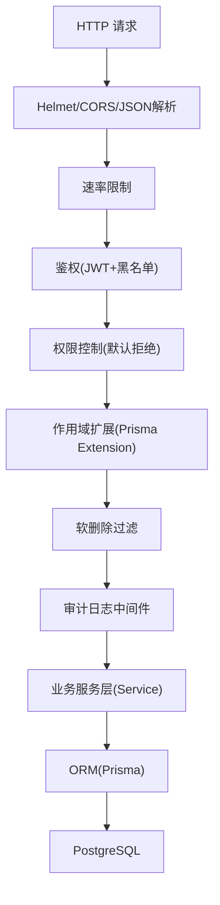
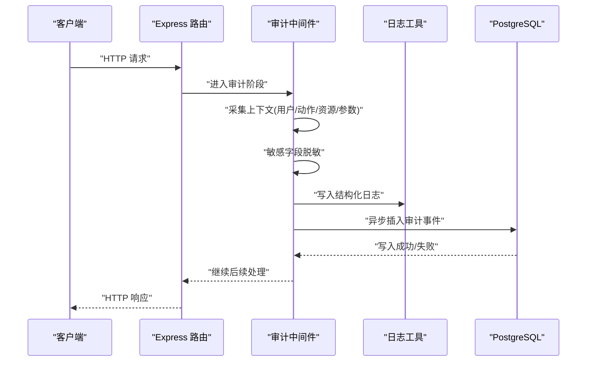
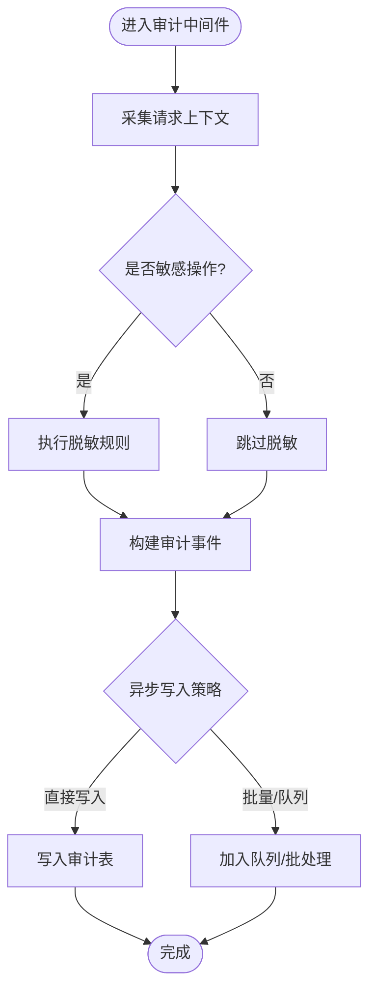
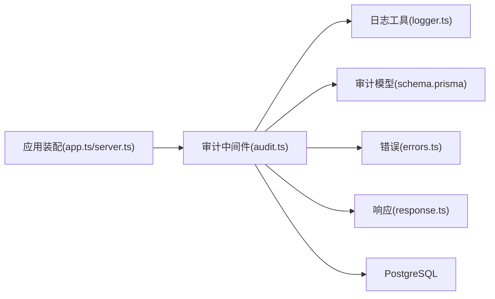

# 审计日志中间件

<cite>
**本文引用的文件**   
- [server/src/middleware/audit.ts](file://server/src/middleware/audit.ts)
- [server/src/lib/logger.ts](file://server/src/lib/logger.ts)
- [server/prisma/schema.prisma](file://server/prisma/schema.prisma)
- [server/prisma/init-audit.sql](file://server/prisma/init-audit.sql)
- [server/src/app.ts](file://server/src/app.ts)
- [server/src/server.ts](file://server/src/server.ts)
- [server/src/lib/errors.ts](file://server/src/lib/errors.ts)
- [server/src/lib/response.ts](file://server/src/lib/response.ts)
</cite>

## 目录
1. [简介](#简介)
2. [项目结构](#项目结构)
3. [核心组件](#核心组件)
4. [架构总览](#架构总览)
5. [详细组件分析](#详细组件分析)
6. [依赖关系分析](#依赖关系分析)
7. [性能考量](#性能考量)
8. [故障排查指南](#故障排查指南)
9. [结论](#结论)
10. [附录](#附录)

## 简介
本文件面向FY200财年经营数据分析平台的“审计日志中间件”，系统性阐述操作审计的捕获机制、日志格式规范、存储策略与查询接口，以及敏感数据脱敏与安全存储。文档同时覆盖审计规则配置方法、日志分析检索与导出能力，并提供性能优化建议与常见问题排查指引。该中间件位于Express请求处理链中，贯穿鉴权、权限、作用域、软删除等关键阶段之后，确保对业务操作的完整可追溯性。

## 项目结构
审计日志相关代码主要分布在以下位置：
- 中间件实现：server/src/middleware/audit.ts
- 日志记录工具：server/src/lib/logger.ts
- 数据库模型与初始化：server/prisma/schema.prisma、server/prisma/init-audit.sql
- 应用装配与启动：server/src/app.ts、server/src/server.ts
- 错误与响应封装：server/src/lib/errors.ts、server/src/lib/response.ts

图表来源
- [server/src/app.ts](file://server/src/app.ts)
- [server/src/server.ts](file://server/src/server.ts)

章节来源
- [server/src/app.ts](file://server/src/app.ts)
- [server/src/server.ts](file://server/src/server.ts)

## 核心组件
- 审计中间件（audit.ts）：在请求生命周期内采集上下文信息（用户、动作、资源、变更差异、耗时、结果），并异步落库。
- 日志工具（logger.ts）：统一结构化日志输出，支持分级、字段过滤与采样。
- 审计表模型（schema.prisma + init-audit.sql）：定义审计事件实体、索引与约束，支撑高效检索。
- 错误与响应（errors.ts、response.ts）：标准化异常与返回体，便于审计事件中的状态码与消息规范化。

章节来源
- [server/src/middleware/audit.ts](file://server/src/middleware/audit.ts)
- [server/src/lib/logger.ts](file://server/src/lib/logger.ts)
- [server/prisma/schema.prisma](file://server/prisma/schema.prisma)
- [server/prisma/init-audit.sql](file://server/prisma/init-audit.sql)
- [server/src/lib/errors.ts](file://server/src/lib/errors.ts)
- [server/src/lib/response.ts](file://server/src/lib/response.ts)

## 架构总览
审计中间件采用“拦截-采集-脱敏-异步落库”的模式，保证对主流程的低侵入与高吞吐。

图表来源
- [server/src/middleware/audit.ts](file://server/src/middleware/audit.ts)
- [server/src/lib/logger.ts](file://server/src/lib/logger.ts)
- [server/prisma/schema.prisma](file://server/prisma/schema.prisma)

## 详细组件分析

### 审计中间件（audit.ts）
- 职责
  - 捕获请求上下文：用户标识、IP、UA、租户/组织、请求ID、时间戳。
  - 识别操作类型：读/写/删/导入/导出/审批/配置变更等。
  - 追踪敏感操作：涉及金额、账号、权限、密钥、报表公式等。
  - 记录数据变更历史：对比变更前后的关键字段差异（diff）。
  - 脱敏处理：对绝对金额映射为区间、公司名称动态映射、手机号/邮箱掩码等。
  - 异步落库：不阻塞主流程，失败降级到本地日志或队列重试。
  - 性能保护：采样率、批量写入、超时与限流。

- 执行时机
  - 位于权限与作用域之后，确保仅对具备访问能力的操作进行审计。
  - 在软删除之前，避免被过滤的数据影响审计准确性。

- 关键行为
  - 请求开始：记录入参摘要、耗时起点、TraceId。
  - 请求结束：记录响应状态码、耗时、是否异常、审计事件ID。
  - 异常路径：捕获未处理异常，记录错误堆栈摘要与上下文快照。

图表来源
- [server/src/middleware/audit.ts](file://server/src/middleware/audit.ts)

章节来源
- [server/src/middleware/audit.ts](file://server/src/middleware/audit.ts)

### 日志工具（logger.ts）
- 职责
  - 统一结构化日志格式：包含级别、时间、模块、TraceId、用户、动作、资源、耗时、状态码、消息。
  - 支持字段白名单/黑名单过滤，避免敏感信息泄露。
  - 提供采样与节流，降低高频操作对系统的影响。
  - 兼容控制台与文件输出，便于本地调试与生产归档。

- 使用要点
  - 所有审计事件通过logger写入，确保一致性。
  - 对大对象进行摘要化，避免日志膨胀。
  - 结合环境变量控制日志级别与采样率。

章节来源
- [server/src/lib/logger.ts](file://server/src/lib/logger.ts)

### 审计数据模型与存储（schema.prisma + init-audit.sql）
- 模型设计要点
  - 审计事件实体：包含用户、租户、动作、资源、参数摘要、变更差异、状态码、耗时、TraceId、时间戳等。
  - 索引策略：按用户、时间范围、动作类型、资源类型建立复合索引，提升检索效率。
  - 分区与归档：可按时间分区，历史数据归档至冷存储。
  - 约束与唯一性：防止重复写入，保障审计完整性。

- 初始化脚本
  - 创建审计表、索引、触发器（可选）、视图（常用查询聚合）。
  - 预置审计分类字典与脱敏规则元数据。

章节来源
- [server/prisma/schema.prisma](file://server/prisma/schema.prisma)
- [server/prisma/init-audit.sql](file://server/prisma/init-audit.sql)

### 错误与响应（errors.ts、response.ts）
- 职责
  - 统一异常类型与错误码，便于审计事件中记录标准化状态。
  - 响应体封装：包含code、message、data、traceId，确保审计可关联。
  - 审计失败降级：当写入失败时，记录本地日志并上报监控告警。

章节来源
- [server/src/lib/errors.ts](file://server/src/lib/errors.ts)
- [server/src/lib/response.ts](file://server/src/lib/response.ts)

## 依赖关系分析
审计中间件依赖日志工具、数据库模型与错误响应模块；与应用装配层协同，确保中间件顺序正确执行。

图表来源
- [server/src/app.ts](file://server/src/app.ts)
- [server/src/server.ts](file://server/src/server.ts)
- [server/src/middleware/audit.ts](file://server/src/middleware/audit.ts)
- [server/src/lib/logger.ts](file://server/src/lib/logger.ts)
- [server/prisma/schema.prisma](file://server/prisma/schema.prisma)

章节来源
- [server/src/app.ts](file://server/src/app.ts)
- [server/src/server.ts](file://server/src/server.ts)
- [server/src/middleware/audit.ts](file://server/src/middleware/audit.ts)
- [server/src/lib/logger.ts](file://server/src/lib/logger.ts)
- [server/prisma/schema.prisma](file://server/prisma/schema.prisma)

## 性能考量
- 异步写入：审计事件采用异步写入，避免阻塞主请求链路。
- 采样与节流：对高频操作启用采样率，减少写入压力。
- 批量写入：合并多条审计事件成批次提交，降低数据库连接开销。
- 索引优化：针对常用查询维度建立复合索引，缩短扫描时间。
- 脱敏成本：仅在敏感操作路径执行脱敏，减少不必要的计算。
- 内存管理：对大对象进行摘要化处理，避免日志体积过大。
- 降级策略：写入失败时回退到本地日志与监控告警，保障可用性。

[本节为通用指导，无需特定文件引用]

## 故障排查指南
- 审计事件缺失
  - 检查中间件顺序是否正确（应在权限与作用域之后）。
  - 确认异步写入是否被限流或队列积压。
  - 查看数据库连接与事务状态。
- 敏感信息泄露
  - 校验脱敏规则是否生效，字段白名单/黑名单配置是否正确。
  - 审查日志输出级别与字段过滤策略。
- 性能抖动
  - 调整采样率与批量大小。
  - 检查索引命中情况与慢查询。
- 错误定位
  - 通过TraceId关联请求与审计事件。
  - 查看错误码与响应体，定位具体异常路径。

章节来源
- [server/src/lib/logger.ts](file://server/src/lib/logger.ts)
- [server/src/lib/errors.ts](file://server/src/lib/errors.ts)
- [server/src/lib/response.ts](file://server/src/lib/response.ts)

## 结论
FY200审计日志中间件以低侵入、高可靠的方式实现对用户行为、敏感操作与数据变更的全面审计。通过结构化日志、脱敏规则与异步落库，兼顾安全性与性能。配合合理的索引与采样策略，可在大规模场景下稳定运行。建议在生产环境持续监控审计写入延迟与错误率，定期归档历史数据，确保合规与可追溯性。

[本节为总结性内容，无需特定文件引用]

## 附录

### 审计规则配置方法
- 操作类型白名单：定义需要审计的动作集合（如CRUD、导入导出、审批、配置变更）。
- 敏感字段清单：列出需脱敏的字段名与脱敏策略（金额区间、公司映射、掩码）。
- 采样策略：按用户、租户、动作类型设置采样率。
- 写入策略：选择直接写入或批量/队列模式，配置批大小与超时。
- 日志级别：根据环境切换DEBUG/INFO/WARN/ERROR级别。

章节来源
- [server/src/middleware/audit.ts](file://server/src/middleware/audit.ts)
- [server/src/lib/logger.ts](file://server/src/lib/logger.ts)

### 日志格式规范
- 必填字段：时间戳、TraceId、用户ID、租户/组织、动作类型、资源类型、资源ID、状态码、耗时、消息。
- 可选字段：IP、UA、参数摘要、变更差异、错误堆栈摘要、审计事件ID。
- 脱敏要求：金额→区间、公司名→动态映射、联系方式→掩码。
- 序列化限制：避免超大对象，必要时进行摘要化。

章节来源
- [server/src/lib/logger.ts](file://server/src/lib/logger.ts)

### 存储策略
- 表结构：审计事件实体包含必要字段与索引。
- 分区与归档：按时间分区，历史数据迁移至冷存储。
- 备份与恢复：定期备份审计数据，确保灾难恢复能力。
- 访问控制：最小权限原则，限制审计表读写主体。

章节来源
- [server/prisma/schema.prisma](file://server/prisma/schema.prisma)
- [server/prisma/init-audit.sql](file://server/prisma/init-audit.sql)

### 查询接口与导出
- 查询维度：用户、时间范围、动作类型、资源类型、状态码、租户/组织。
- 排序与分页：按时间倒序，支持分页与游标。
- 导出格式：CSV/Excel，支持筛选条件与脱敏输出。
- 安全校验：导出需鉴权与审计，记录导出操作。

章节来源
- [server/src/middleware/audit.ts](file://server/src/middleware/audit.ts)
- [server/src/lib/response.ts](file://server/src/lib/response.ts)

### 敏感数据脱敏与安全存储
- 脱敏规则：金额区间化、公司名映射、联系方式掩码、密钥哈希。
- 传输加密：HTTPS与数据库TLS。
- 存储加密：敏感字段静态加密，密钥轮换。
- 访问审计：对审计数据本身的访问也进行审计。

章节来源
- [server/src/middleware/audit.ts](file://server/src/middleware/audit.ts)
- [server/src/lib/logger.ts](file://server/src/lib/logger.ts)