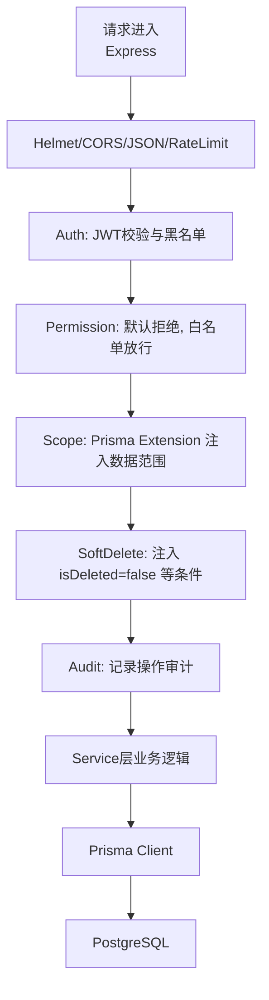
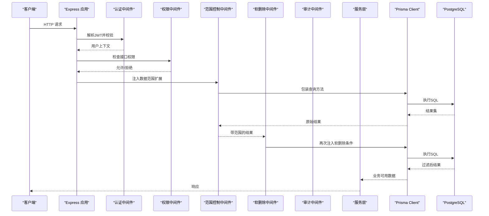
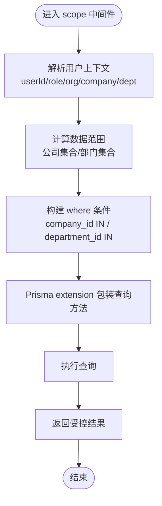
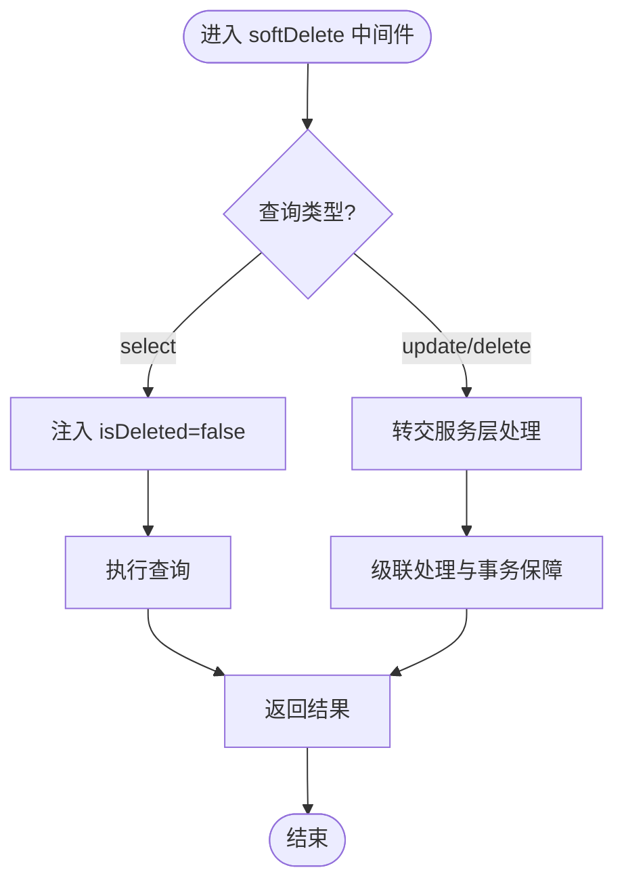
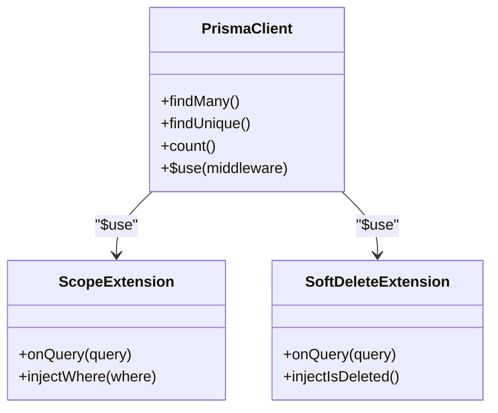
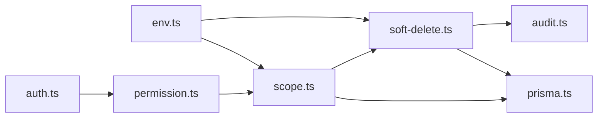

# 数据范围控制中间件

<cite>
**本文引用的文件**   
- [scope.ts](file://server/src/middleware/scope.ts)
- [soft-delete.ts](file://server/src/middleware/soft-delete.ts)
- [prisma.ts](file://server/src/lib/prisma.ts)
- [schema.prisma](file://server/prisma/schema.prisma)
- [auth.ts](file://server/src/middleware/auth.ts)
- [permission.ts](file://server/src/middleware/permission.ts)
- [audit.ts](file://server/src/middleware/audit.ts)
- [app.ts](file://server/src/app.ts)
- [env.ts](file://server/src/config/env.ts)
- [scope.test.ts](file://server/src/middleware/scope.test.ts)
- [soft-delete.test.ts](file://server/src/middleware/soft-delete.test.ts)
</cite>

## 目录
1. [简介](#简介)
2. [项目结构](#项目结构)
3. [核心组件](#核心组件)
4. [架构总览](#架构总览)
5. [详细组件分析](#详细组件分析)
6. [依赖关系分析](#依赖关系分析)
7. [性能考量](#性能考量)
8. [故障排查指南](#故障排查指南)
9. [结论](#结论)
10. [附录](#附录)

## 简介
本文件面向FY200财年经营数据分析平台的数据范围控制中间件，重点阐述基于Prisma extension的查询级数据隔离机制。内容涵盖：
- 按用户角色与组织层级自动过滤（公司维度、部门维度）
- 软删除中间件的逻辑删除标记、查询条件注入与级联处理
- 动态配置与性能优化策略
- 测试方法与调试技巧

后端技术栈为Express + Prisma + PostgreSQL，中间件执行链顺序为：helmet → cors → express.json → rate-limit → auth(JWT+黑名单) → permission(默认拒绝) → scope(Prisma extension) → softDelete → audit → Service → Prisma → PostgreSQL。

## 项目结构
围绕数据范围控制的代码主要位于server/src/middleware与server/src/lib，以及Prisma模型定义中。关键文件如下：
- 范围控制中间件：scope.ts
- 软删除中间件：soft-delete.ts
- Prisma客户端初始化与扩展装配：prisma.ts
- 权限与认证：auth.ts、permission.ts
- 审计中间件：audit.ts
- 应用路由注册与中间件挂载：app.ts
- 环境变量配置：env.ts
- 测试用例：scope.test.ts、soft-delete.test.ts
- 数据库模型与迁移：schema.prisma

图表来源
- [app.ts](file://server/src/app.ts)
- [auth.ts](file://server/src/middleware/auth.ts)
- [permission.ts](file://server/src/middleware/permission.ts)
- [scope.ts](file://server/src/middleware/scope.ts)
- [soft-delete.ts](file://server/src/middleware/soft-delete.ts)
- [audit.ts](file://server/src/middleware/audit.ts)
- [prisma.ts](file://server/src/lib/prisma.ts)

章节来源
- [app.ts](file://server/src/app.ts)
- [auth.ts](file://server/src/middleware/auth.ts)
- [permission.ts](file://server/src/middleware/permission.ts)
- [scope.ts](file://server/src/middleware/scope.ts)
- [soft-delete.ts](file://server/src/middleware/soft-delete.ts)
- [audit.ts](file://server/src/middleware/audit.ts)
- [prisma.ts](file://server/src/lib/prisma.ts)

## 核心组件
- 数据范围控制中间件（scope.ts）
  - 通过Prisma extension在查询前注入where条件，实现公司/部门维度的数据隔离
  - 支持按用户角色（如管理员、普通用户）与组织层级（公司、部门）动态计算可见范围
  - 提供可配置的规则开关与优先级，避免过度过滤或遗漏
- 软删除中间件（soft-delete.ts）
  - 统一注入isDeleted=false等过滤条件，确保查询不返回已删除记录
  - 对写入操作进行保护，防止误删；对级联删除进行安全处理
- Prisma客户端扩展（prisma.ts）
  - 将scope与softDelete作为全局extension注册到Prisma Client
  - 保证所有查询均经过统一的范围与软删除处理

章节来源
- [scope.ts](file://server/src/middleware/scope.ts)
- [soft-delete.ts](file://server/src/middleware/soft-delete.ts)
- [prisma.ts](file://server/src/lib/prisma.ts)

## 架构总览
下图展示从HTTP请求到数据库查询的完整链路，突出scope与softDelete在Prisma extension中的位置与作用点。

图表来源
- [app.ts](file://server/src/app.ts)
- [auth.ts](file://server/src/middleware/auth.ts)
- [permission.ts](file://server/src/middleware/permission.ts)
- [scope.ts](file://server/src/middleware/scope.ts)
- [soft-delete.ts](file://server/src/middleware/soft-delete.ts)
- [prisma.ts](file://server/src/lib/prisma.ts)

## 详细组件分析

### 数据范围控制中间件（scope.ts）
- 设计目标
  - 以Prisma extension为核心，拦截所有查询并在where中注入范围条件
  - 根据用户角色与组织层级自动计算可见的公司/部门集合
  - 支持多租户场景下的公司维度隔离与部门维度隔离
- 关键机制
  - 用户上下文：从JWT或会话中提取userId、roleId、orgId、companyId、deptId等
  - 范围计算：根据角色决定是“全公司”、“本部门”还是“指定部门”
  - where注入：对涉及company_id、department_id等字段的表追加IN或=条件
  - 覆盖策略：当存在显式授权时，优先使用授权范围而非默认范围
- 典型流程
  - 请求进入scope中间件
  - 解析用户上下文与权限策略
  - 生成范围条件对象
  - 通过Prisma extension包装findMany/findUnique/count等查询
  - 执行查询并返回受控结果

图表来源
- [scope.ts](file://server/src/middleware/scope.ts)

章节来源
- [scope.ts](file://server/src/middleware/scope.ts)

### 软删除中间件（soft-delete.ts）
- 设计目标
  - 统一处理逻辑删除，确保查询不返回已删除记录
  - 保护写入路径，避免直接更新isDeleted字段造成不一致
  - 对级联删除进行安全处理，防止数据泄露
- 关键机制
  - 查询注入：对所有select类查询注入isDeleted=false
  - 写入保护：拦截update/delete等操作，强制走业务逻辑层
  - 级联处理：在事务中处理关联实体的软删除状态一致性
- 典型流程
  - 请求进入softDelete中间件
  - 识别查询类型（select/update/delete）
  - select：注入isDeleted=false
  - update/delete：转交业务层进行软删除标记与级联处理
  - 返回受控结果

图表来源
- [soft-delete.ts](file://server/src/middleware/soft-delete.ts)

章节来源
- [soft-delete.ts](file://server/src/middleware/soft-delete.ts)

### Prisma客户端扩展（prisma.ts）
- 设计目标
  - 将scope与softDelete作为全局extension注册到Prisma Client
  - 保证所有查询均经过统一的范围与软删除处理
- 关键机制
  - 注册extension：在Prisma Client初始化时注入middleware
  - 钩子函数：在query执行前注入where条件，在query执行后处理结果
  - 错误处理：捕获异常并记录审计日志
- 典型流程
  - 初始化Prisma Client
  - 注册scope与softDelete extension
  - 暴露增强后的client供Service层使用

图表来源
- [prisma.ts](file://server/src/lib/prisma.ts)

章节来源
- [prisma.ts](file://server/src/lib/prisma.ts)

### 权限与认证（auth.ts、permission.ts）
- 认证中间件（auth.ts）
  - 解析JWT令牌，校验签名与过期时间
  - 提取用户上下文并挂载到请求对象
- 权限中间件（permission.ts）
  - 默认拒绝所有接口访问
  - 根据路由与角色白名单放行
  - 为scope中间件提供角色与组织信息

章节来源
- [auth.ts](file://server/src/middleware/auth.ts)
- [permission.ts](file://server/src/middleware/permission.ts)

### 审计中间件（audit.ts）
- 记录关键操作的审计日志
- 与scope/softDelete协作，记录数据范围与软删除状态变化

章节来源
- [audit.ts](file://server/src/middleware/audit.ts)

### 应用路由与中间件挂载（app.ts）
- 统一注册中间件顺序
- 确保scope与softDelete在正确的位置生效

章节来源
- [app.ts](file://server/src/app.ts)

### 环境变量配置（env.ts）
- 提供范围控制与软删除的配置项
- 支持动态开关与阈值调整

章节来源
- [env.ts](file://server/src/config/env.ts)

### 数据库模型与迁移（schema.prisma）
- 定义公司、部门、用户等实体及其关系
- 包含isDeleted字段用于软删除
- 定义索引与约束以优化查询性能

章节来源
- [schema.prisma](file://server/prisma/schema.prisma)

## 依赖关系分析
- 中间件依赖链
  - auth → permission → scope → softDelete → audit
- Prisma扩展依赖
  - prisma.ts依赖scope.ts与soft-delete.ts
- 配置依赖
  - env.ts为scope与softDelete提供运行时配置

图表来源
- [auth.ts](file://server/src/middleware/auth.ts)
- [permission.ts](file://server/src/middleware/permission.ts)
- [scope.ts](file://server/src/middleware/scope.ts)
- [soft-delete.ts](file://server/src/middleware/soft-delete.ts)
- [audit.ts](file://server/src/middleware/audit.ts)
- [prisma.ts](file://server/src/lib/prisma.ts)
- [env.ts](file://server/src/config/env.ts)

章节来源
- [auth.ts](file://server/src/middleware/auth.ts)
- [permission.ts](file://server/src/middleware/permission.ts)
- [scope.ts](file://server/src/middleware/scope.ts)
- [soft-delete.ts](file://server/src/middleware/soft-delete.ts)
- [audit.ts](file://server/src/middleware/audit.ts)
- [prisma.ts](file://server/src/lib/prisma.ts)
- [env.ts](file://server/src/config/env.ts)

## 性能考量
- 查询条件优化
  - 使用IN条件时限制集合大小，避免过大IN导致SQL性能下降
  - 为company_id、department_id、isDeleted等字段建立合适索引
- 缓存策略
  - 对用户范围计算结果进行短期缓存，减少重复计算
- 批量操作
  - 对批量查询使用分页与投影，仅返回必要字段
- 事务边界
  - 软删除级联操作应在事务中执行，确保一致性

[本节为通用指导，无需特定文件引用]

## 故障排查指南
- 常见问题
  - 数据未过滤：检查scope中间件是否正确注入where条件
  - 软删除失效：确认isDeleted字段是否存在且被正确注入
  - 权限问题：验证permission中间件是否放行相应接口
- 调试技巧
  - 启用Prisma日志输出，查看实际执行的SQL
  - 在scope与softDelete中添加临时日志，确认条件注入
  - 使用单元测试验证范围计算与软删除逻辑
- 测试方法
  - 编写针对scope的单元测试，模拟不同用户角色与组织层级
  - 编写针对soft-delete的单元测试，验证查询与写入行为

章节来源
- [scope.test.ts](file://server/src/middleware/scope.test.ts)
- [soft-delete.test.ts](file://server/src/middleware/soft-delete.test.ts)

## 结论
FY200数据范围控制中间件通过Prisma extension实现了灵活、高效的数据隔离机制。结合软删除中间件，确保了数据的逻辑删除与查询一致性。通过合理的配置与优化策略，系统能够在复杂的多租户与组织层级场景下提供可靠的数据访问控制。

[本节为总结性内容，无需特定文件引用]

## 附录
- 相关文档
  - API参考：API-Reference.md
  - 数据库模式：Database-Schema.md
  - 快速开始：Getting-Started.md
- 最佳实践
  - 始终通过Service层进行数据修改，避免绕过软删除保护
  - 定期审查权限配置，确保最小权限原则
  - 监控慢查询，优化索引与查询条件

[本节为补充信息，无需特定文件引用]