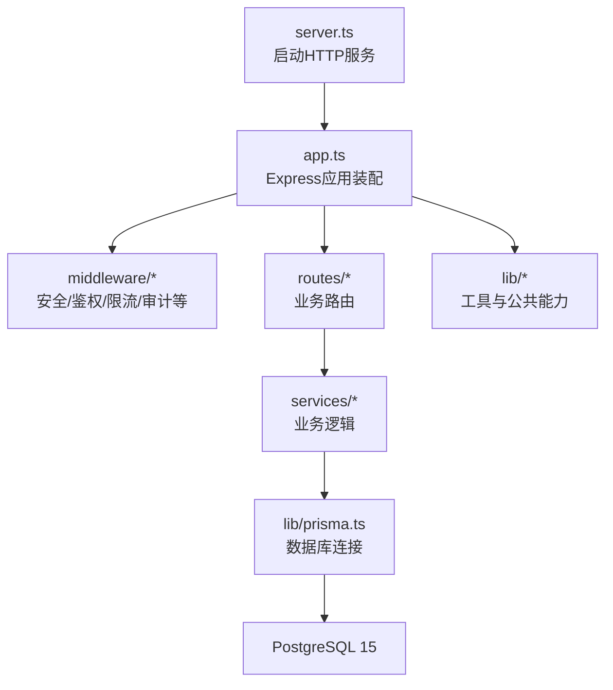
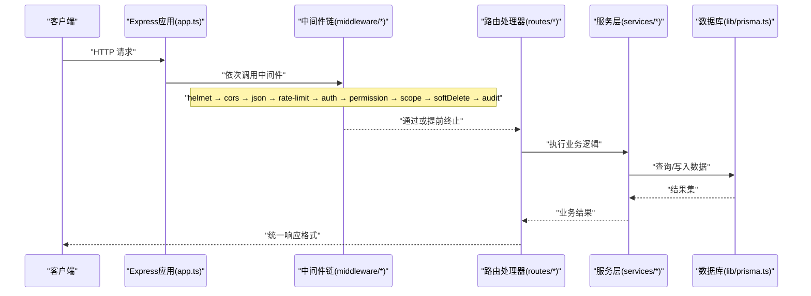
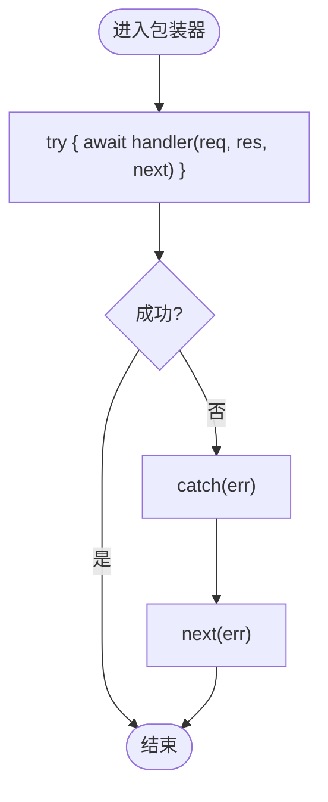
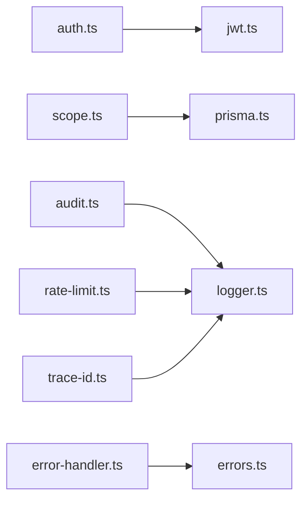

# 自定义中间件开发

<cite>
**本文引用的文件**   
- [server.ts](file://server/src/server.ts)
- [app.ts](file://server/src/app.ts)
- [async-handler.ts](file://server/src/lib/async-handler.ts)
- [response.ts](file://server/src/lib/response.ts)
- [errors.ts](file://server/src/lib/errors.ts)
- [logger.ts](file://server/src/lib/logger.ts)
- [jwt.ts](file://server/src/lib/jwt.ts)
- [prisma.ts](file://server/src/lib/prisma.ts)
- [helmet.ts](file://server/src/middleware/helmet.ts)
- [cors.ts](file://server/src/middleware/cors.ts)
- [rate-limit.ts](file://server/src/middleware/rate-limit.ts)
- [auth.ts](file://server/src/middleware/auth.ts)
- [permission.ts](file://server/src/middleware/permission.ts)
- [scope.ts](file://server/src/middleware/scope.ts)
- [soft-delete.ts](file://server/src/middleware/soft-delete.ts)
- [audit.ts](file://server/src/middleware/audit.ts)
- [trace-id.ts](file://server/src/middleware/trace-id.ts)
- [error-handler.ts](file://server/src/middleware/error-handler.ts)
</cite>

## 目录
1. [简介](#简介)
2. [项目结构](#项目结构)
3. [核心组件](#核心组件)
4. [架构总览](#架构总览)
5. [详细组件分析](#详细组件分析)
6. [依赖关系分析](#依赖关系分析)
7. [性能考量](#性能考量)
8. [故障排查指南](#故障排查指南)
9. [结论](#结论)
10. [附录](#附录)

## 简介
本指南面向在 FY200 项目中开发“自定义中间件”的工程师，围绕 Express 中间件的创建模式、同步与异步处理、错误传递与上下文共享、统一响应格式、测试与调试、配置选项、依赖注入与生命周期管理、常用模板与最佳实践、以及性能监控与错误处理集成进行系统化说明。项目采用 Express 4 + Prisma 5 + PostgreSQL 15 + JWT + DeepSeek API（SSE）技术栈，中间件执行链顺序为：helmet → cors → express.json → rate-limit → auth(JWT+黑名单) → permission(默认拒绝) → scope(Prisma extension) → softDelete → audit → Service → Prisma → PostgreSQL。

## 项目结构
FY200 后端位于 server 目录，中间件集中在 src/middleware，通用工具与库在 src/lib，路由在 src/routes，服务层在 src/services。应用入口通过 app.ts 装配中间件与路由，server.ts 启动 HTTP 服务。

图表来源 
- [server.ts](file://server/src/server.ts)
- [app.ts](file://server/src/app.ts)

章节来源
- [server.ts](file://server/src/server.ts)
- [app.ts](file://server/src/app.ts)

## 核心组件
- 异步处理器封装：用于将 async/await 路由函数包装为 Express 兼容的错误捕获形式，避免未捕获异常导致进程崩溃。
- 统一响应格式：对外暴露一致的 JSON 结构，便于前端解析与错误处理。
- 错误模型与转换：集中定义业务错误类型与 HTTP 状态码映射，保证错误信息一致性与可观测性。
- 日志与追踪：结构化日志输出与请求链路追踪 ID，便于问题定位。
- 认证与授权：JWT 校验、黑名单检查、权限策略与数据范围控制。
- 数据库扩展：基于 Prisma Extension 的数据作用域与软删除增强。

章节来源
- [async-handler.ts](file://server/src/lib/async-handler.ts)
- [response.ts](file://server/src/lib/response.ts)
- [errors.ts](file://server/src/lib/errors.ts)
- [logger.ts](file://server/src/lib/logger.ts)
- [jwt.ts](file://server/src/lib/jwt.ts)
- [prisma.ts](file://server/src/lib/prisma.ts)

## 架构总览
下图展示了从请求进入 Express 到返回响应的完整中间件链路与关键交互点。

图表来源 
- [app.ts](file://server/src/app.ts)
- [helmet.ts](file://server/src/middleware/helmet.ts)
- [cors.ts](file://server/src/middleware/cors.ts)
- [rate-limit.ts](file://server/src/middleware/rate-limit.ts)
- [auth.ts](file://server/src/middleware/auth.ts)
- [permission.ts](file://server/src/middleware/permission.ts)
- [scope.ts](file://server/src/middleware/scope.ts)
- [soft-delete.ts](file://server/src/middleware/soft-delete.ts)
- [audit.ts](file://server/src/middleware/audit.ts)
- [prisma.ts](file://server/src/lib/prisma.ts)

## 详细组件分析

### 异步处理器封装（async-handler）
- 设计目标：将 async/await 路由函数包装为 Express 兼容形式，自动捕获 Promise 拒绝并转换为标准错误响应。
- 关键点：
  - 使用 try/catch 包裹 await 调用，捕获异常后调用 next(err)。
  - 保持原函数的 this 与参数透传。
  - 与统一错误处理中间件配合，确保错误信息标准化。
- 适用场景：所有路由处理器都应使用该封装，避免未捕获异常。

图表来源 
- [async-handler.ts](file://server/src/lib/async-handler.ts)

章节来源
- [async-handler.ts](file://server/src/lib/async-handler.ts)

### 统一响应格式（response）
- 设计目标：对外提供一致的 JSON 结构，包含状态码、消息、数据体与可选的元信息。
- 关键点：
  - 成功响应：{ code, message, data }
  - 错误响应：{ code, message, details? }
  - 支持分页、时间戳、追踪ID等扩展字段。
- 使用建议：在服务层或控制器中统一构造响应对象，减少重复代码。

章节来源
- [response.ts](file://server/src/lib/response.ts)

### 错误模型与转换（errors）
- 设计目标：集中定义业务错误类型、HTTP 状态码映射与错误序列化规则。
- 关键点：
  - 区分系统错误、业务错误、参数校验错误。
  - 提供错误工厂方法，快速生成标准化错误对象。
  - 与错误处理中间件协作，输出可读且安全的错误信息。
- 安全注意：生产环境不泄露堆栈与内部细节。

章节来源
- [errors.ts](file://server/src/lib/errors.ts)

### 日志与追踪（logger）
- 设计目标：结构化日志输出，记录请求上下文、耗时、错误信息与用户标识。
- 关键点：
  - 结合 traceId 实现跨中间件链路追踪。
  - 敏感信息脱敏（如密码、令牌）。
  - 分级日志（info/warn/error），便于告警与采样。

章节来源
- [logger.ts](file://server/src/lib/logger.ts)

### 认证与授权（auth、permission、scope）
- 认证（auth）：
  - 校验 JWT access token，支持黑名单检查。
  - 将用户上下文挂载至 req.user。
- 权限（permission）：
  - 默认拒绝策略，需显式放行。
  - 支持角色/资源/动作三维权限模型。
- 数据范围（scope）：
  - 基于 Prisma Extension 注入数据作用域过滤。
  - 与软删除配合，确保数据隔离。

章节来源
- [auth.ts](file://server/src/middleware/auth.ts)
- [permission.ts](file://server/src/middleware/permission.ts)
- [scope.ts](file://server/src/middleware/scope.ts)
- [jwt.ts](file://server/src/lib/jwt.ts)

### 软删除与审计（soft-delete、audit）
- 软删除（soft-delete）：
  - 查询时自动追加 isDeleted=false 条件。
  - 更新/删除操作标记 isDeleted=true。
- 审计（audit）：
  - 记录关键操作的主体、时间、IP、变更摘要。
  - 与权限与数据范围联动，确保审计完整性。

章节来源
- [soft-delete.ts](file://server/src/middleware/soft-delete.ts)
- [audit.ts](file://server/src/middleware/audit.ts)

### 安全与限流（helmet、cors、rate-limit）
- helmet：设置安全相关响应头（CSP、X-Frame-Options 等）。
- cors：跨域配置，白名单域名与方法。
- rate-limit：按 IP/用户维度限流，防止滥用。

章节来源
- [helmet.ts](file://server/src/middleware/helmet.ts)
- [cors.ts](file://server/src/middleware/cors.ts)
- [rate-limit.ts](file://server/src/middleware/rate-limit.ts)

### 追踪ID（trace-id）
- 设计目标：为每个请求生成唯一 traceId，贯穿整个请求链路。
- 关键点：
  - 若上游已携带 traceId，则复用；否则生成新值。
  - 注入到日志与响应头，便于前端与网关关联。

章节来源
- [trace-id.ts](file://server/src/middleware/trace-id.ts)

### 错误处理（error-handler）
- 设计目标：集中处理未捕获异常与业务错误，输出标准化错误响应。
- 关键点：
  - 识别错误类型，映射到合适的 HTTP 状态码。
  - 生产环境隐藏敏感堆栈，仅返回必要信息。
  - 记录错误上下文（req、res、err）以便排查。

章节来源
- [error-handler.ts](file://server/src/middleware/error-handler.ts)

## 依赖关系分析
中间件之间通过 req/res/next 传递上下文，部分中间件依赖 lib 中的工具模块。下图展示关键依赖关系。

图表来源 
- [auth.ts](file://server/src/middleware/auth.ts)
- [jwt.ts](file://server/src/lib/jwt.ts)
- [scope.ts](file://server/src/middleware/scope.ts)
- [prisma.ts](file://server/src/lib/prisma.ts)
- [audit.ts](file://server/src/middleware/audit.ts)
- [logger.ts](file://server/src/lib/logger.ts)
- [error-handler.ts](file://server/src/middleware/error-handler.ts)
- [errors.ts](file://server/src/lib/errors.ts)
- [rate-limit.ts](file://server/src/middleware/rate-limit.ts)
- [trace-id.ts](file://server/src/middleware/trace-id.ts)

章节来源
- [app.ts](file://server/src/app.ts)

## 性能考量
- 中间件顺序优化：将无副作用的中间件（如 helmet、cors、trace-id）前置，减少后续开销。
- 限流与缓存：对高频接口启用 rate-limit 与响应缓存，降低数据库压力。
- 数据库查询优化：使用 Prisma 的 select/include 精确选择字段，避免 N+1 查询。
- 异步处理：所有 I/O 操作使用 async/await，避免阻塞事件循环。
- 日志采样：在高吞吐环境下对 debug 级别日志进行采样，降低 IO 压力。
- SSE 流式：AI 管道使用 SSE 流式输出，避免长连接占用过多内存。

[本节为通用指导，无需特定文件引用]

## 故障排查指南
- 常见问题定位：
  - 未捕获异常：确认是否使用 async-handler 包装路由处理器。
  - 权限拒绝：检查 permission 中间件策略与路由放行配置。
  - 数据不可见：确认 scope 与 soft-delete 是否正确注入。
  - 限流触发：查看 rate-limit 配置与阈值设置。
- 调试技巧：
  - 开启详细日志，结合 traceId 追踪请求链路。
  - 使用单元测试与集成测试覆盖边界条件。
  - 借助浏览器开发者工具与网络面板观察请求/响应。
- 错误处理：
  - 统一错误响应格式，便于前端提示与埋点。
  - 生产环境屏蔽敏感信息，保留必要上下文。

章节来源
- [error-handler.ts](file://server/src/middleware/error-handler.ts)
- [logger.ts](file://server/src/lib/logger.ts)
- [errors.ts](file://server/src/lib/errors.ts)

## 结论
通过统一的中间件架构与工具库，FY200 实现了高内聚、低耦合的请求处理流程。遵循本指南的创建模式与实践，可以快速构建稳定、可观测、易维护的自定义中间件，提升整体系统的可靠性与可运维性。

[本节为总结性内容，无需特定文件引用]

## 附录

### 自定义中间件开发模板（步骤清单）
- 明确职责：确定中间件负责的功能（鉴权、限流、审计等）。
- 选择模式：同步或异步处理，必要时使用 async-handler 封装。
- 上下文共享：通过 req 挂载必要数据（用户、租户、traceId）。
- 错误传递：抛出标准化错误或使用 next(err)。
- 配置选项：支持外部化配置（环境变量、配置文件）。
- 依赖注入：通过构造函数或闭包注入服务实例。
- 生命周期：初始化与销毁逻辑放在应用启动/关闭钩子。
- 测试覆盖：编写单元测试与集成测试，覆盖正常与异常路径。
- 性能优化：避免阻塞操作，合理使用缓存与批处理。
- 可观测性：输出结构化日志，关联 traceId。

[本节为模板性内容，无需特定文件引用]

### 常用中间件模板与最佳实践
- 安全类（helmet、cors）：最小权限原则，严格白名单。
- 鉴权类（auth、permission）：默认拒绝，显式放行；支持多策略组合。
- 数据类（scope、soft-delete）：与 ORM 扩展结合，确保一致性。
- 审计类（audit）：记录关键操作，保护隐私与合规。
- 限流类（rate-limit）：按 IP/用户维度限制，支持动态阈值。
- 追踪类（trace-id）：全链路追踪，便于问题定位。

[本节为最佳实践内容，无需特定文件引用]

### 性能监控与错误处理集成方案
- 指标采集：在关键中间件埋点，统计 QPS、延迟、错误率。
- 错误上报：将标准化错误上报至监控系统（如 Sentry）。
- 日志聚合：集中收集日志，支持检索与告警。
- 健康检查：提供 /health 端点，暴露服务状态。
- 熔断降级：对下游依赖（如 AI 服务）实施熔断与重试策略。

[本节为通用方案内容，无需特定文件引用]