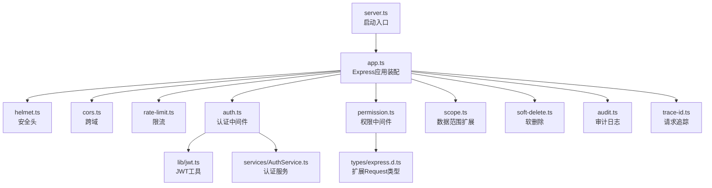
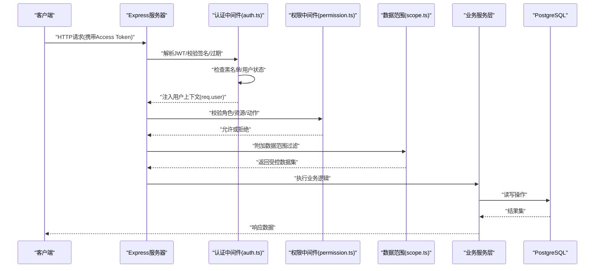
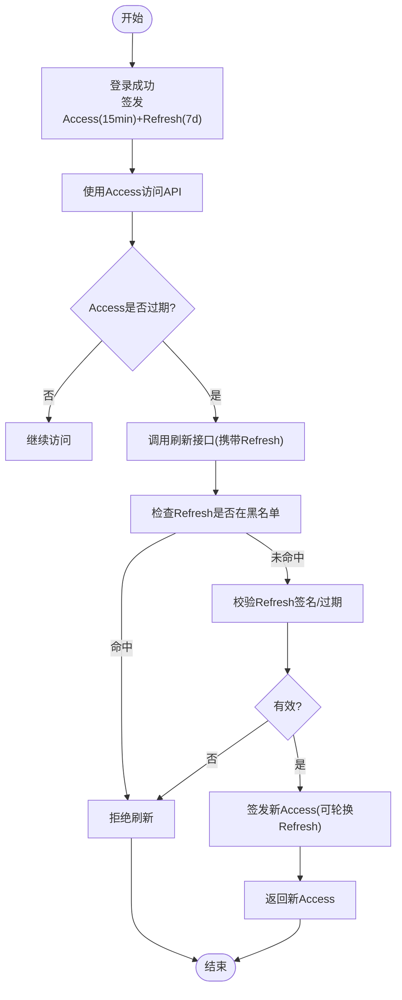
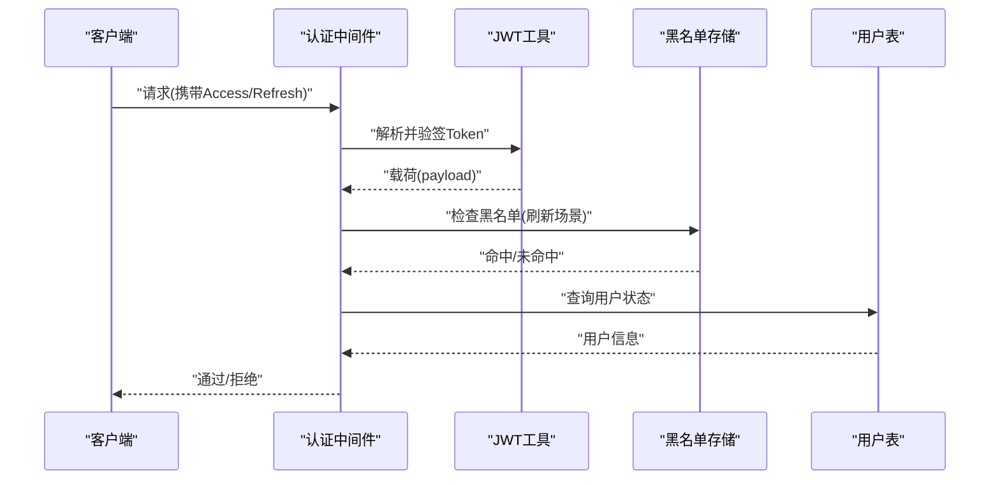
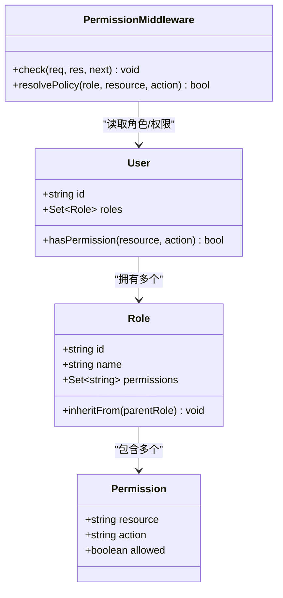
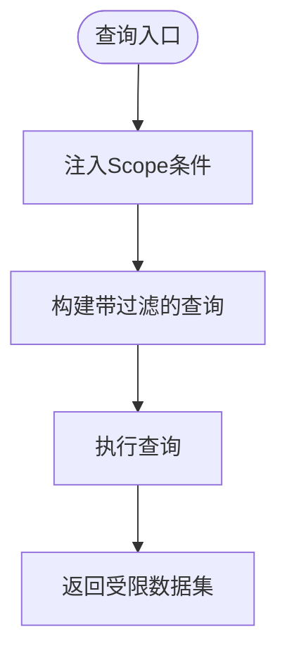
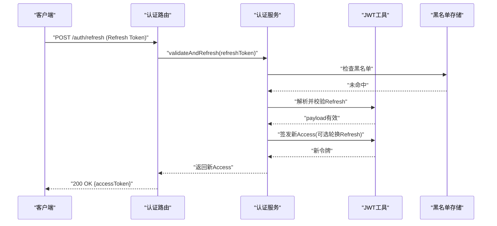
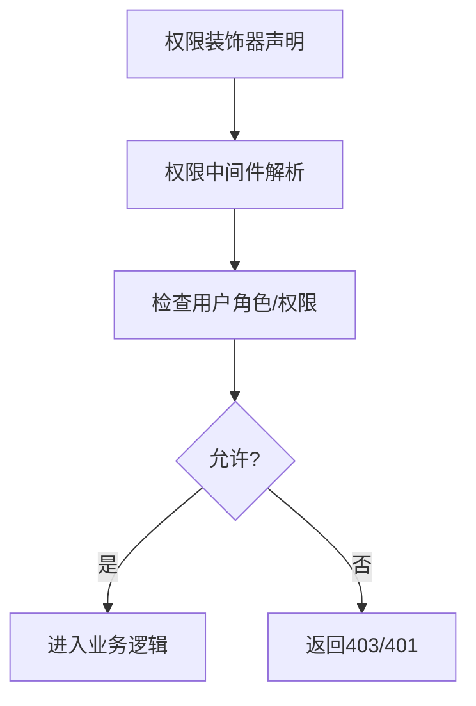
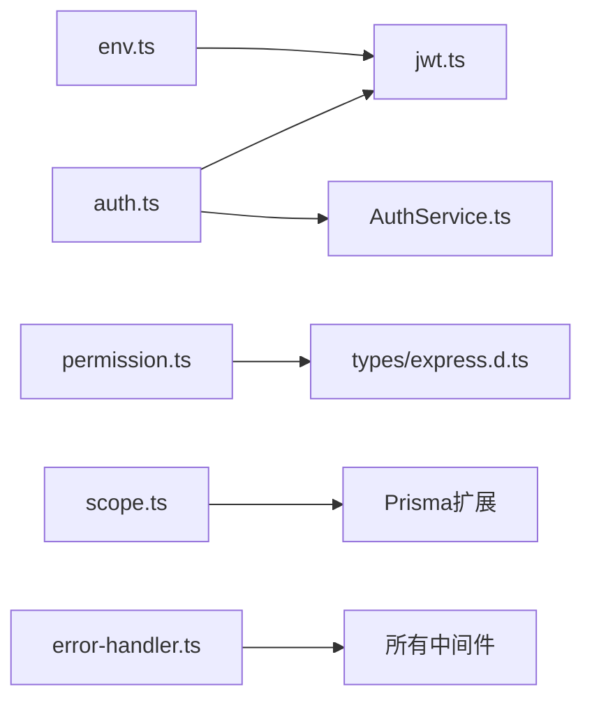

# 认证授权中间件

<cite>
**本文引用的文件**   
- [server.ts](file://server/server.ts)
- [app.ts](file://server/src/app.ts)
- [auth.ts](file://server/src/middleware/auth.ts)
- [permission.ts](file://server/src/middleware/permission.ts)
- [scope.ts](file://server/src/middleware/scope.ts)
- [jwt.ts](file://server/src/lib/jwt.ts)
- [AuthService.ts](file://server/src/services/AuthService.ts)
- [routes/auth.ts](file://server/src/routes/auth.ts)
- [env.ts](file://server/src/config/env.ts)
- [error-handler.ts](file://server/src/middleware/error-handler.ts)
- [rate-limit.ts](file://server/src/middleware/rate-limit.ts)
- [cors.ts](file://server/src/middleware/cors.ts)
- [helmet.ts](file://server/src/middleware/helmet.ts)
- [audit.ts](file://server/src/middleware/audit.ts)
- [soft-delete.ts](file://server/src/middleware/soft-delete.ts)
- [trace-id.ts](file://server/src/middleware/trace-id.ts)
- [types/express.d.ts](file://server/src/types/express.d.ts)
</cite>

## 目录
1. [简介](#简介)
2. [项目结构](#项目结构)
3. [核心组件](#核心组件)
4. [架构总览](#架构总览)
5. [详细组件分析](#详细组件分析)
6. [依赖关系分析](#依赖关系分析)
7. [性能考量](#性能考量)
8. [故障排查指南](#故障排查指南)
9. [结论](#结论)
10. [附录](#附录)

## 简介
本文件面向FY200项目的认证与授权中间件，系统性阐述JWT双令牌机制（access token 15分钟 + refresh token 7天）的实现原理、轮转策略与刷新流程；详述认证中间件的验证链路（令牌解析、黑名单检查、用户状态校验）；说明权限控制中间件的RBAC模型（角色继承、资源访问控制、默认拒绝）；并给出令牌刷新、会话管理与安全最佳实践，以及权限装饰器与测试用例示例。

后端技术栈：Express 4 + Prisma 5 + PostgreSQL 15 + JWT（access 15min + refresh 7day 轮转）+ DeepSeek API（SSE 流式）。中间件执行链顺序：helmet → cors → express.json → rate-limit → auth(JWT+黑名单) → permission(默认拒绝) → scope(Prisma extension) → softDelete → audit → Service → Prisma → PostgreSQL。

## 项目结构
认证授权相关代码主要分布在以下位置：
- 应用启动与中间件装配：server.ts、app.ts
- 认证中间件与权限中间件：middleware/auth.ts、middleware/permission.ts、middleware/scope.ts
- JWT工具与服务层：lib/jwt.ts、services/AuthService.ts
- 认证路由：routes/auth.ts
- 环境变量配置：config/env.ts
- 错误处理与通用中间件：middleware/error-handler.ts、middleware/rate-limit.ts、middleware/cors.ts、middleware/helmet.ts、middleware/audit.ts、middleware/soft-delete.ts、middleware/trace-id.ts
- Express类型扩展：types/express.d.ts

图表来源
- [server.ts](file://server/server.ts)
- [app.ts](file://server/src/app.ts)
- [helmet.ts](file://server/src/middleware/helmet.ts)
- [cors.ts](file://server/src/middleware/cors.ts)
- [rate-limit.ts](file://server/src/middleware/rate-limit.ts)
- [auth.ts](file://server/src/middleware/auth.ts)
- [permission.ts](file://server/src/middleware/permission.ts)
- [scope.ts](file://server/src/middleware/scope.ts)
- [soft-delete.ts](file://server/src/middleware/soft-delete.ts)
- [audit.ts](file://server/src/middleware/audit.ts)
- [trace-id.ts](file://server/src/middleware/trace-id.ts)
- [jwt.ts](file://server/src/lib/jwt.ts)
- [AuthService.ts](file://server/src/services/AuthService.ts)
- [types/express.d.ts](file://server/src/types/express.d.ts)

章节来源
- [server.ts](file://server/server.ts)
- [app.ts](file://server/src/app.ts)

## 核心组件
- 认证中间件（auth.ts）：负责从请求中解析JWT、校验签名与过期时间、查询黑名单、校验用户状态，并将用户上下文注入到req对象。
- 权限中间件（permission.ts）：基于RBAC进行资源访问控制，支持角色继承、默认拒绝策略，并在req上挂载权限信息供业务使用。
- 数据范围扩展（scope.ts）：通过Prisma扩展在查询时自动附加租户/组织/部门等数据范围过滤条件。
- JWT工具（jwt.ts）：封装签发、解析、刷新、黑名单管理接口，统一算法与密钥管理。
- 认证服务（AuthService.ts）：封装登录、登出、刷新令牌等业务逻辑，与数据库交互。
- 认证路由（routes/auth.ts）：暴露登录、登出、刷新令牌等HTTP端点。
- 环境变量（env.ts）：集中管理JWT密钥、过期时间、黑名单存储等配置。

章节来源
- [auth.ts](file://server/src/middleware/auth.ts)
- [permission.ts](file://server/src/middleware/permission.ts)
- [scope.ts](file://server/src/middleware/scope.ts)
- [jwt.ts](file://server/src/lib/jwt.ts)
- [AuthService.ts](file://server/src/services/AuthService.ts)
- [routes/auth.ts](file://server/src/routes/auth.ts)
- [env.ts](file://server/src/config/env.ts)

## 架构总览
下图展示了认证授权的端到端流程：客户端发起请求，依次经过安全头、跨域、限流、认证、权限、数据范围、软删除、审计等中间件，最终到达业务服务层与数据库。

图表来源
- [auth.ts](file://server/src/middleware/auth.ts)
- [permission.ts](file://server/src/middleware/permission.ts)
- [scope.ts](file://server/src/middleware/scope.ts)
- [AuthService.ts](file://server/src/services/AuthService.ts)

## 详细组件分析

### JWT双令牌机制与轮转策略
- Access Token（短期）：有效期15分钟，用于高频API调用，减少服务端校验成本。
- Refresh Token（长期）：有效期7天，用于换取新的Access Token，降低频繁登录体验损耗。
- 轮转策略：
  - 首次登录成功同时签发Access与Refresh Token。
  - Access Token过期后，客户端使用Refresh Token调用刷新接口获取新Access Token。
  - 刷新成功后可选择轮换Refresh Token（提升安全性），或保持原Refresh Token（简化实现）。
  - 登出时将当前Refresh Token加入黑名单，防止重用。
- 黑名单管理：
  - 使用内存或Redis存储已注销的Refresh Token及其过期时间。
  - 校验刷新Token时优先检查黑名单，命中则拒绝。

图表来源
- [jwt.ts](file://server/src/lib/jwt.ts)
- [AuthService.ts](file://server/src/services/AuthService.ts)
- [routes/auth.ts](file://server/src/routes/auth.ts)
- [env.ts](file://server/src/config/env.ts)

章节来源
- [jwt.ts](file://server/src/lib/jwt.ts)
- [AuthService.ts](file://server/src/services/AuthService.ts)
- [routes/auth.ts](file://server/src/routes/auth.ts)
- [env.ts](file://server/src/config/env.ts)

### 认证中间件验证流程
- 令牌解析：从请求头Authorization中解析Bearer Token，调用JWT工具解析并验签。
- 黑名单检查：若为刷新流程，检查Refresh Token是否在黑名单；若为访问流程，可根据策略检查Access Token黑名单（通常不强制）。
- 用户状态验证：根据用户ID查询用户状态（启用/禁用/锁定），确保仅允许活跃用户访问。
- 上下文注入：将用户信息（如id、角色、权限集合）挂载到req.user，供后续中间件与业务使用。

图表来源
- [auth.ts](file://server/src/middleware/auth.ts)
- [jwt.ts](file://server/src/lib/jwt.ts)
- [AuthService.ts](file://server/src/services/AuthService.ts)

章节来源
- [auth.ts](file://server/src/middleware/auth.ts)
- [jwt.ts](file://server/src/lib/jwt.ts)
- [AuthService.ts](file://server/src/services/AuthService.ts)

### RBAC权限模型与默认拒绝策略
- 角色与资源：
  - 角色（Role）：如admin、manager、analyst等，具备一组权限集合。
  - 资源（Resource）：如report、dashboard、data等。
  - 动作（Action）：如read、write、delete等。
- 角色继承：
  - 支持角色层级（如admin包含manager权限），权限判断时递归合并。
- 默认拒绝：
  - 未显式授予的访问一律拒绝，最小权限原则。
- 权限决策：
  - 中间件读取req.user.roles与目标资源的访问规则，计算是否允许。
  - 可在请求上下文中注入权限标记，便于前端渲染控制。

图表来源
- [permission.ts](file://server/src/middleware/permission.ts)
- [types/express.d.ts](file://server/src/types/express.d.ts)

章节来源
- [permission.ts](file://server/src/middleware/permission.ts)
- [types/express.d.ts](file://server/src/types/express.d.ts)

### 数据范围（Scope）与Prisma扩展
- 作用：在查询时自动附加租户/组织/部门等过滤条件，避免越权访问。
- 实现：通过Prisma扩展拦截查询，注入where条件。
- 适用场景：多租户隔离、部门数据隔离、个人数据隔离。

图表来源
- [scope.ts](file://server/src/middleware/scope.ts)

章节来源
- [scope.ts](file://server/src/middleware/scope.ts)

### 令牌刷新机制与会话管理
- 刷新接口：
  - 接收Refresh Token，校验签名与过期，检查黑名单。
  - 成功后签发新Access Token（可选轮换Refresh Token）。
- 会话管理：
  - 无状态设计为主，借助黑名单实现“伪会话”注销能力。
  - 可结合Redis实现分布式黑名单与过期清理。
- 安全建议：
  - Refresh Token应存储在HttpOnly Cookie或安全存储中。
  - 定期轮换Refresh Token以提升安全性。
  - 记录刷新事件用于审计与异常检测。

图表来源
- [routes/auth.ts](file://server/src/routes/auth.ts)
- [AuthService.ts](file://server/src/services/AuthService.ts)
- [jwt.ts](file://server/src/lib/jwt.ts)

章节来源
- [routes/auth.ts](file://server/src/routes/auth.ts)
- [AuthService.ts](file://server/src/services/AuthService.ts)
- [jwt.ts](file://server/src/lib/jwt.ts)

### 权限装饰器与测试用例示例
- 权限装饰器：
  - 在控制器或路由级别声明所需资源与动作，中间件在执行前进行校验。
  - 示例：@RequirePermission('report', 'read')。
- 测试用例：
  - 覆盖正常路径（有权限）、拒绝路径（无权限）、边界情况（角色继承、资源不存在）。
  - 模拟JWT载荷、黑名单命中、用户状态禁用等场景。

图表来源
- [permission.ts](file://server/src/middleware/permission.ts)
- [types/express.d.ts](file://server/src/types/express.d.ts)

章节来源
- [permission.ts](file://server/src/middleware/permission.ts)
- [types/express.d.ts](file://server/src/types/express.d.ts)

## 依赖关系分析
认证授权模块依赖关系如下：
- 认证中间件依赖JWT工具与认证服务。
- 权限中间件依赖用户上下文与权限策略定义。
- 数据范围中间件依赖Prisma扩展机制。
- 环境变量提供密钥与过期时间配置。
- 错误处理中间件统一捕获并返回标准化错误。

图表来源
- [auth.ts](file://server/src/middleware/auth.ts)
- [jwt.ts](file://server/src/lib/jwt.ts)
- [AuthService.ts](file://server/src/services/AuthService.ts)
- [permission.ts](file://server/src/middleware/permission.ts)
- [scope.ts](file://server/src/middleware/scope.ts)
- [env.ts](file://server/src/config/env.ts)
- [error-handler.ts](file://server/src/middleware/error-handler.ts)
- [types/express.d.ts](file://server/src/types/express.d.ts)

章节来源
- [auth.ts](file://server/src/middleware/auth.ts)
- [jwt.ts](file://server/src/lib/jwt.ts)
- [AuthService.ts](file://server/src/services/AuthService.ts)
- [permission.ts](file://server/src/middleware/permission.ts)
- [scope.ts](file://server/src/middleware/scope.ts)
- [env.ts](file://server/src/config/env.ts)
- [error-handler.ts](file://server/src/middleware/error-handler.ts)
- [types/express.d.ts](file://server/src/types/express.d.ts)

## 性能考量
- JWT解析开销低，适合高频校验；建议缓存用户权限集合以减少重复查询。
- 黑名单存储建议使用Redis，支持过期键自动清理与高并发访问。
- 权限判断采用O(1)查找（哈希集合），避免递归遍历大权限树。
- 数据范围过滤在Prisma层完成，减少无效数据传输。
- 限流中间件保护认证接口，防止暴力破解与滥用。

[本节为通用指导，无需特定文件引用]

## 故障排查指南
- 常见错误：
  - 401 Unauthorized：JWT签名无效、过期或黑名单命中。
  - 403 Forbidden：权限不足或角色缺失。
  - 500 Internal Server Error：数据库连接失败或内部异常。
- 排查步骤：
  - 检查请求头Authorization格式与Token内容。
  - 查看黑名单存储是否误命中。
  - 确认用户状态是否被禁用或锁定。
  - 检查权限策略配置与角色继承关系。
- 日志与追踪：
  - 启用trace-id中间件关联请求链路。
  - 审计中间件记录关键操作与异常。

章节来源
- [error-handler.ts](file://server/src/middleware/error-handler.ts)
- [trace-id.ts](file://server/src/middleware/trace-id.ts)
- [audit.ts](file://server/src/middleware/audit.ts)

## 结论
FY200项目的认证授权中间件采用JWT双令牌机制与RBAC权限模型，结合黑名单、数据范围与默认拒绝策略，构建了安全、可扩展的访问控制体系。通过清晰的中间件执行链与模块化设计，既保证了安全性，又兼顾了性能与可维护性。建议在生产环境中启用Redis黑名单、加强Token存储安全、完善审计与监控，以进一步提升系统健壮性。

[本节为总结，无需特定文件引用]

## 附录
- 安全最佳实践：
  - 使用强随机密钥与算法（如RS256/ES256）。
  - 限制Token生命周期，及时轮换Refresh Token。
  - 对敏感接口实施额外校验（如IP白名单、设备指纹）。
  - 定期审计权限分配与访问日志。
- 部署建议：
  - 使用HTTPS强制加密传输。
  - 配置CORS严格白名单。
  - 启用Helmet安全头防护。
  - 合理设置限流阈值与冷却时间。

[本节为补充信息，无需特定文件引用]