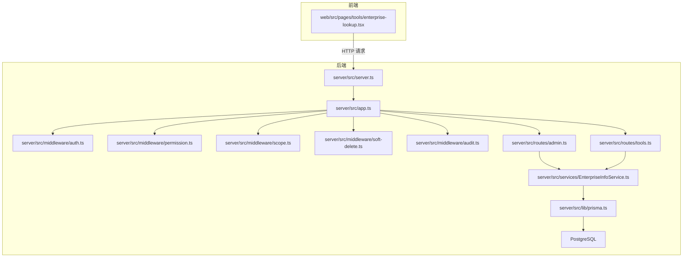
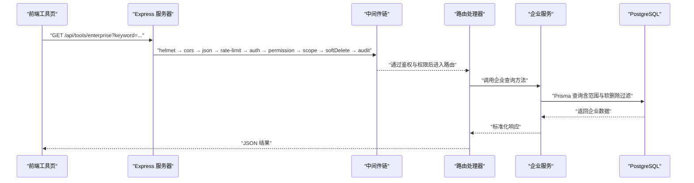
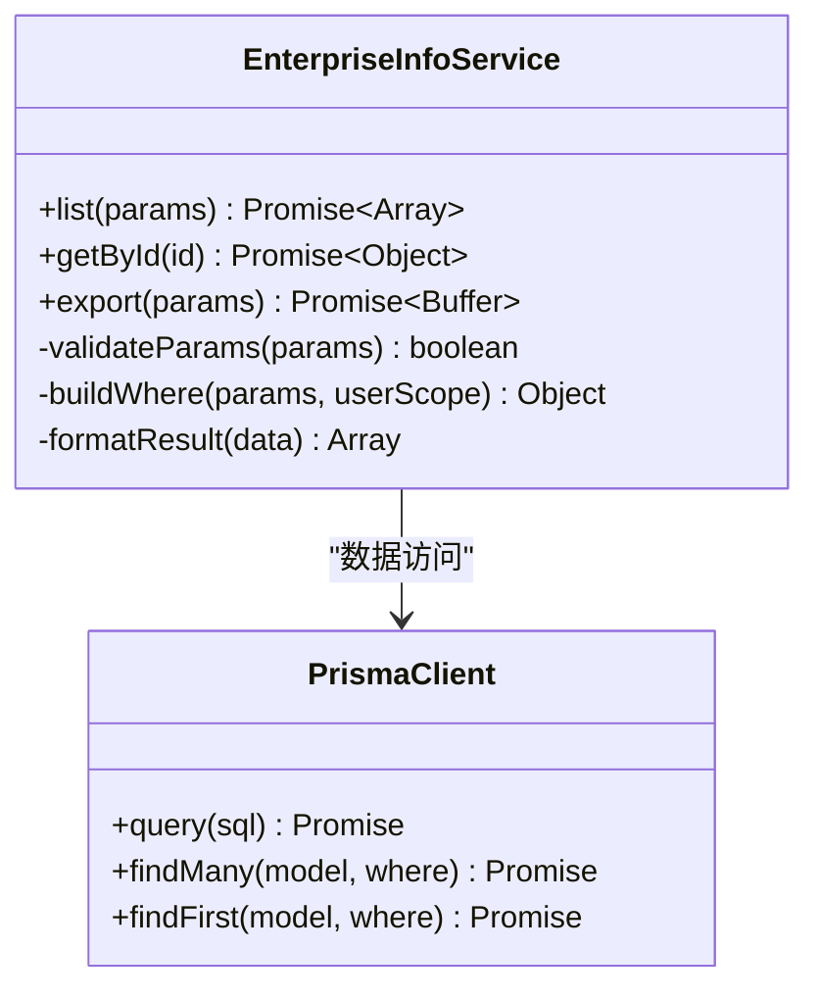
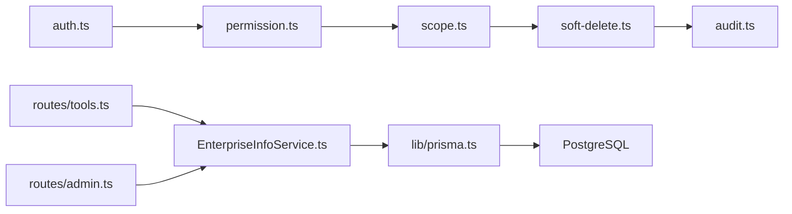

# 企业信息查询服务

<cite>
**本文引用的文件**   
- [server/src/app.ts](file://server/src/app.ts)
- [server/src/server.ts](file://server/src/server.ts)
- [server/src/middleware/auth.ts](file://server/src/middleware/auth.ts)
- [server/src/middleware/permission.ts](file://server/src/middleware/permission.ts)
- [server/src/middleware/scope.ts](file://server/src/middleware/scope.ts)
- [server/src/middleware/soft-delete.ts](file://server/src/middleware/soft-delete.ts)
- [server/src/middleware/audit.ts](file://server/src/middleware/audit.ts)
- [server/src/lib/prisma.ts](file://server/src/lib/prisma.ts)
- [server/src/services/EnterpriseInfoService.ts](file://server/src/services/EnterpriseInfoService.ts)
- [server/src/routes/admin.ts](file://server/src/routes/admin.ts)
- [server/src/routes/tools.ts](file://server/src/routes/tools.ts)
- [server/src/lib/errors.ts](file://server/src/lib/errors.ts)
- [server/src/lib/response.ts](file://server/src/lib/response.ts)
- [server/src/config/env.ts](file://server/src/config/env.ts)
- [server/prisma/schema.prisma](file://server/prisma/schema.prisma)
- [web/src/pages/tools/enterprise-lookup.tsx](file://web/src/pages/tools/enterprise-lookup.tsx)
</cite>

## 目录
1. [简介](#简介)
2. [项目结构](#项目结构)
3. [核心组件](#核心组件)
4. [架构总览](#架构总览)
5. [详细组件分析](#详细组件分析)
6. [依赖关系分析](#依赖关系分析)
7. [性能考量](#性能考量)
8. [故障排查指南](#故障排查指南)
9. [结论](#结论)
10. [附录](#附录)

## 简介
本仓库为“浙江壹品慧财年经营数据分析平台”的企业信息查询服务部分，聚焦企业维度数据的统一查询、权限与范围控制、审计与软删除等能力。后端采用 Express + Prisma + PostgreSQL，前端提供工具页用于企业查询。中间件执行链遵循严格顺序：安全头 → 跨域 → JSON解析 → 限流 → 鉴权（JWT+黑名单）→ 权限（默认拒绝）→ 数据范围（Prisma扩展）→ 软删除过滤 → 审计 → 业务服务 → Prisma → 数据库。计算类指标使用安全公式解析，AI双管道用于文本与结构化分析的脱敏与生成。

## 项目结构
本项目采用前后端分离的模块化组织方式：
- server：Express 应用、中间件、路由、服务层、Prisma 数据访问、配置与环境变量
- web：React 前端页面与组件，包含企业查询工具页
- prisma：数据库模型与迁移
- docs：项目文档与规范

图表来源
- [server/src/app.ts](file://server/src/app.ts)
- [server/src/server.ts](file://server/src/server.ts)
- [server/src/middleware/auth.ts](file://server/src/middleware/auth.ts)
- [server/src/middleware/permission.ts](file://server/src/middleware/permission.ts)
- [server/src/middleware/scope.ts](file://server/src/middleware/scope.ts)
- [server/src/middleware/soft-delete.ts](file://server/src/middleware/soft-delete.ts)
- [server/src/middleware/audit.ts](file://server/src/middleware/audit.ts)
- [server/src/routes/admin.ts](file://server/src/routes/admin.ts)
- [server/src/routes/tools.ts](file://server/src/routes/tools.ts)
- [server/src/services/EnterpriseInfoService.ts](file://server/src/services/EnterpriseInfoService.ts)
- [server/src/lib/prisma.ts](file://server/src/lib/prisma.ts)

章节来源
- [server/src/app.ts](file://server/src/app.ts)
- [server/src/server.ts](file://server/src/server.ts)

## 核心组件
- 应用启动与中间件装配：Express 应用初始化、全局中间件注册、错误处理、路由挂载
- 鉴权与权限：JWT 校验、黑名单检查、基于角色的权限控制（默认拒绝）
- 数据范围控制：通过 Prisma 扩展注入当前用户的数据范围（如公司维度）
- 软删除与审计：查询自动过滤已删除记录；关键操作写入审计日志
- 企业服务：企业查询、筛选、分页、排序、导出等能力封装
- 数据访问：Prisma Client 实例化与连接管理
- 错误与响应：统一错误类型与响应格式
- 配置与环境：环境变量加载与校验

章节来源
- [server/src/app.ts](file://server/src/app.ts)
- [server/src/middleware/auth.ts](file://server/src/middleware/auth.ts)
- [server/src/middleware/permission.ts](file://server/src/middleware/permission.ts)
- [server/src/middleware/scope.ts](file://server/src/middleware/scope.ts)
- [server/src/middleware/soft-delete.ts](file://server/src/middleware/soft-delete.ts)
- [server/src/middleware/audit.ts](file://server/src/middleware/audit.ts)
- [server/src/services/EnterpriseInfoService.ts](file://server/src/services/EnterpriseInfoService.ts)
- [server/src/lib/prisma.ts](file://server/src/lib/prisma.ts)
- [server/src/lib/errors.ts](file://server/src/lib/errors.ts)
- [server/src/lib/response.ts](file://server/src/lib/response.ts)
- [server/src/config/env.ts](file://server/src/config/env.ts)

## 架构总览
系统采用分层架构：前端通过 HTTP 调用后端 API，后端由 Express 路由分发到具体服务，服务通过 Prisma 访问数据库。中间件链保证安全、权限、范围、审计与一致性。

图表来源
- [server/src/server.ts](file://server/src/server.ts)
- [server/src/app.ts](file://server/src/app.ts)
- [server/src/middleware/auth.ts](file://server/src/middleware/auth.ts)
- [server/src/middleware/permission.ts](file://server/src/middleware/permission.ts)
- [server/src/middleware/scope.ts](file://server/src/middleware/scope.ts)
- [server/src/middleware/soft-delete.ts](file://server/src/middleware/soft-delete.ts)
- [server/src/middleware/audit.ts](file://server/src/middleware/audit.ts)
- [server/src/routes/tools.ts](file://server/src/routes/tools.ts)
- [server/src/services/EnterpriseInfoService.ts](file://server/src/services/EnterpriseInfoService.ts)
- [server/src/lib/prisma.ts](file://server/src/lib/prisma.ts)

## 详细组件分析

### 应用启动与中间件装配
- 负责创建 Express 应用、注册全局中间件、挂载路由、设置错误处理与端口监听
- 中间件顺序严格遵循项目规范，确保安全性与可观测性

章节来源
- [server/src/app.ts](file://server/src/app.ts)
- [server/src/server.ts](file://server/src/server.ts)

### 鉴权与权限控制
- 鉴权：解析 JWT，校验令牌有效性，支持黑名单拦截
- 权限：基于角色或策略的访问控制，默认拒绝未明确授权的路径
- 将用户上下文注入请求对象，供后续中间件与服务使用

章节来源
- [server/src/middleware/auth.ts](file://server/src/middleware/auth.ts)
- [server/src/middleware/permission.ts](file://server/src/middleware/permission.ts)

### 数据范围控制（Scope）
- 通过 Prisma 扩展在查询时动态注入 where 条件，限制用户仅能访问其范围内的企业数据
- 与软删除结合，确保查询结果不包含已删除记录

章节来源
- [server/src/middleware/scope.ts](file://server/src/middleware/scope.ts)
- [server/src/middleware/soft-delete.ts](file://server/src/middleware/soft-delete.ts)

### 审计与软删除
- 审计：对关键写操作记录审计日志，便于追踪与合规
- 软删除：查询自动过滤 isDeleted=true 的记录，避免误删影响

章节来源
- [server/src/middleware/audit.ts](file://server/src/middleware/audit.ts)
- [server/src/middleware/soft-delete.ts](file://server/src/middleware/soft-delete.ts)

### 企业服务（EnterpriseInfoService）
- 提供企业信息的查询、筛选、分页、排序、导出等功能
- 内部调用 Prisma 进行数据访问，并统一错误与响应格式
- 与权限与范围中间件协作，确保数据安全

图表来源
- [server/src/services/EnterpriseInfoService.ts](file://server/src/services/EnterpriseInfoService.ts)
- [server/src/lib/prisma.ts](file://server/src/lib/prisma.ts)

章节来源
- [server/src/services/EnterpriseInfoService.ts](file://server/src/services/EnterpriseInfoService.ts)

### 路由与接口
- 工具路由：提供企业查询相关接口，如列表、详情、导出
- 管理路由：可能包含企业维护、批量导入等管理功能
- 路由处理器负责参数校验、调用服务层、返回统一响应

章节来源
- [server/src/routes/tools.ts](file://server/src/routes/tools.ts)
- [server/src/routes/admin.ts](file://server/src/routes/admin.ts)

### 数据模型与数据库
- Prisma Schema 定义企业实体字段、索引与关联关系
- 迁移脚本管理数据库结构演进
- 查询通过 Prisma 扩展注入范围与软删除条件

章节来源
- [server/prisma/schema.prisma](file://server/prisma/schema.prisma)

### 前端工具页
- 提供企业查询界面，支持关键词搜索、筛选、分页展示
- 调用后端 API 获取企业数据并渲染

章节来源
- [web/src/pages/tools/enterprise-lookup.tsx](file://web/src/pages/tools/enterprise-lookup.tsx)

## 依赖关系分析
- 中间件依赖：auth → permission → scope → softDelete → audit
- 服务依赖：EnterpriseInfoService → Prisma → PostgreSQL
- 路由依赖：tools/admin → EnterpriseInfoService
- 前端依赖：enterprise-lookup → 后端 API

图表来源
- [server/src/middleware/auth.ts](file://server/src/middleware/auth.ts)
- [server/src/middleware/permission.ts](file://server/src/middleware/permission.ts)
- [server/src/middleware/scope.ts](file://server/src/middleware/scope.ts)
- [server/src/middleware/soft-delete.ts](file://server/src/middleware/soft-delete.ts)
- [server/src/middleware/audit.ts](file://server/src/middleware/audit.ts)
- [server/src/routes/tools.ts](file://server/src/routes/tools.ts)
- [server/src/routes/admin.ts](file://server/src/routes/admin.ts)
- [server/src/services/EnterpriseInfoService.ts](file://server/src/services/EnterpriseInfoService.ts)
- [server/src/lib/prisma.ts](file://server/src/lib/prisma.ts)

章节来源
- [server/src/app.ts](file://server/src/app.ts)
- [server/src/services/EnterpriseInfoService.ts](file://server/src/services/EnterpriseInfoService.ts)

## 性能考量
- 查询优化：合理使用索引、分页与字段投影，避免全表扫描
- 缓存策略：对热点企业查询结果进行短期缓存（如 Redis），降低数据库压力
- 异步处理：导出等耗时操作采用异步任务队列，避免阻塞请求
- 连接池：合理配置 Prisma 连接池大小，平衡并发与资源占用
- 公式计算：使用安全公式解析器，避免 eval 带来的性能与安全开销

[本节为通用指导，不直接分析具体文件]

## 故障排查指南
- 鉴权失败：检查 JWT 是否有效、是否在黑名单中，确认中间件顺序正确
- 权限拒绝：确认用户角色与路由权限配置一致，默认拒绝策略生效
- 数据为空：检查数据范围是否正确注入，软删除标记是否影响查询
- 审计缺失：确认审计中间件是否注册，写操作是否触发审计逻辑
- 数据库连接：检查 Prisma 连接配置、环境变量与网络连通性

章节来源
- [server/src/middleware/auth.ts](file://server/src/middleware/auth.ts)
- [server/src/middleware/permission.ts](file://server/src/middleware/permission.ts)
- [server/src/middleware/scope.ts](file://server/src/middleware/scope.ts)
- [server/src/middleware/soft-delete.ts](file://server/src/middleware/soft-delete.ts)
- [server/src/middleware/audit.ts](file://server/src/middleware/audit.ts)
- [server/src/lib/prisma.ts](file://server/src/lib/prisma.ts)
- [server/src/lib/errors.ts](file://server/src/lib/errors.ts)
- [server/src/lib/response.ts](file://server/src/lib/response.ts)
- [server/src/config/env.ts](file://server/src/config/env.ts)

## 结论
企业信息查询服务通过严格的中间件链与分层架构，实现了安全、可控、可审计的企业数据查询能力。结合 Prisma 数据范围与软删除机制，确保了数据的一致性与安全性。前端工具页提供了直观的操作界面，满足内部管理需求。未来可进一步优化查询性能与用户体验，增强缓存与异步处理能力。

[本节为总结性内容，不直接分析具体文件]

## 附录
- 环境变量配置：参考 env.ts 中的配置项说明
- 错误码与响应格式：参考 errors.ts 与 response.ts 的定义
- 数据库模型：参考 schema.prisma 中的实体定义与关系

章节来源
- [server/src/config/env.ts](file://server/src/config/env.ts)
- [server/src/lib/errors.ts](file://server/src/lib/errors.ts)
- [server/src/lib/response.ts](file://server/src/lib/response.ts)
- [server/prisma/schema.prisma](file://server/prisma/schema.prisma)