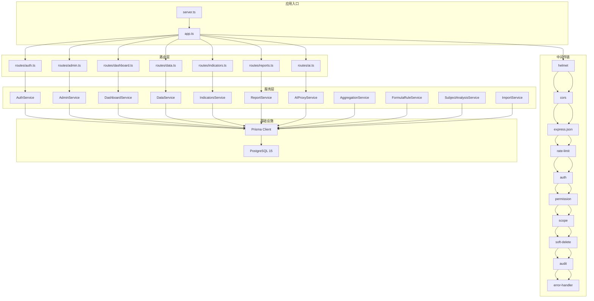
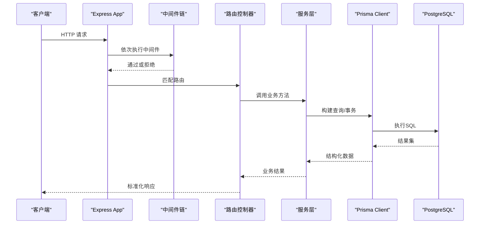
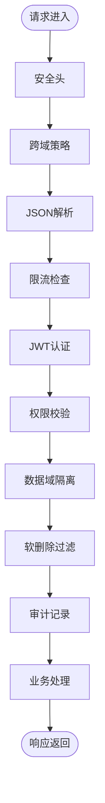
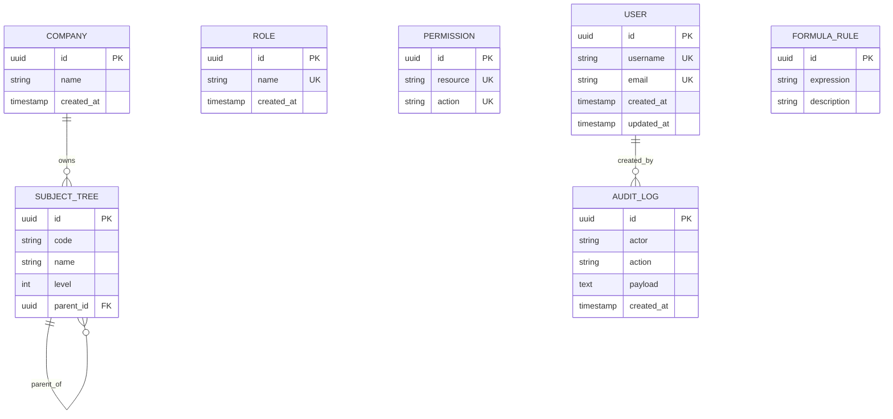
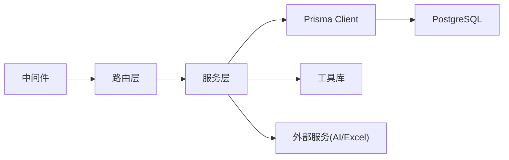

# 后端开发指南

<cite>
**本文引用的文件**   
- [server/src/app.ts](file://server/src/app.ts)
- [server/src/server.ts](file://server/src/server.ts)
- [server/src/config/env.ts](file://server/src/config/env.ts)
- [server/src/lib/prisma.ts](file://server/src/lib/prisma.ts)
- [server/src/lib/errors.ts](file://server/src/lib/errors.ts)
- [server/src/lib/response.ts](file://server/src/lib/response.ts)
- [server/src/middleware/auth.ts](file://server/src/middleware/auth.ts)
- [server/src/middleware/permission.ts](file://server/src/middleware/permission.ts)
- [server/src/middleware/scope.ts](file://server/src/middleware/scope.ts)
- [server/src/middleware/rate-limit.ts](file://server/src/middleware/rate-limit.ts)
- [server/src/middleware/helmet.ts](file://server/src/middleware/helmet.ts)
- [server/src/middleware/cors.ts](file://server/src/middleware/cors.ts)
- [server/src/middleware/error-handler.ts](file://server/src/middleware/error-handler.ts)
- [server/src/middleware/audit.ts](file://server/src/middleware/audit.ts)
- [server/src/middleware/soft-delete.ts](file://server/src/middleware/soft-delete.ts)
- [server/src/middleware/trace-id.ts](file://server/src/middleware/trace-id.ts)
- [server/src/routes/admin.ts](file://server/src/routes/admin.ts)
- [server/src/routes/ai.ts](file://server/src/routes/ai.ts)
- [server/src/routes/auth.ts](file://server/src/routes/auth.ts)
- [server/src/routes/dashboard.ts](file://server/src/routes/dashboard.ts)
- [server/src/routes/data.ts](file://server/src/routes/data.ts)
- [server/src/routes/indicators.ts](file://server/src/routes/indicators.ts)
- [server/src/routes/reports.ts](file://server/src/routes/reports.ts)
- [server/src/services/AuthService.ts](file://server/src/services/AuthService.ts)
- [server/src/services/AdminService.ts](file://server/src/services/AdminService.ts)
- [server/src/services/DashboardService.ts](file://server/src/services/DashboardService.ts)
- [server/src/services/DataService.ts](file://server/src/services/DataService.ts)
- [server/src/services/IndicatorsService.ts](file://server/src/services/IndicatorsService.ts)
- [server/src/services/ReportService.ts](file://server/src/services/ReportService.ts)
- [server/src/services/AIProxyService.ts](file://server/src/services/AIProxyService.ts)
- [server/src/services/AggregationService.ts](file://server/src/services/AggregationService.ts)
- [server/src/services/FormulaRuleService.ts](file://server/src/services/FormulaRuleService.ts)
- [server/src/services/SubjectAnalysisService.ts](file://server/src/services/SubjectAnalysisService.ts)
- [server/src/services/ImportService.ts](file://server/src/services/ImportService.ts)
- [server/prisma/schema.prisma](file://server/prisma/schema.prisma)
- [server/prisma/migrations/20260722121714_init/migration.sql](file://server/prisma/migrations/20260722121714_init/migration.sql)
- [server/prisma/migrations/20260722142144_add_formula_rule/migration.sql](file://server/prisma/migrations/20260722142144_add_formula_rule/migration.sql)
- [server/prisma/migrations/20260723120000_add_subject_analysis/migration.sql](file://server/prisma/migrations/20260723120000_add_subject_analysis/migration.sql)
- [server/prisma/migrations/20260724120000_remove_business_unit_org_scope/migration.sql](file://server/prisma/migrations/20260724120000_remove_business_unit_org_scope/migration.sql)
- [server/tsconfig.json](file://server/tsconfig.json)
- [server/package.json](file://server/package.json)
</cite>

## 目录
1. [简介](#简介)
2. [项目结构](#项目结构)
3. [核心组件](#核心组件)
4. [架构总览](#架构总览)
5. [详细组件分析](#详细组件分析)
6. [依赖关系分析](#依赖关系分析)
7. [性能考虑](#性能考虑)
8. [故障排查指南](#故障排查指南)
9. [结论](#结论)
10. [附录](#附录)

## 简介
本指南面向FY200后端的开发与维护，聚焦Express服务器配置与路由组织、服务层业务封装模式、中间件扩展方法、Prisma ORM使用规范（模型定义、查询构建、数据迁移）、TypeScript最佳实践（类型定义、接口设计、错误处理），以及API路由开发规范（RESTful原则、请求响应格式、错误码标准）。同时提供中间件开发指南（认证、授权、限流、安全防护）和性能优化与调试技巧。

## 项目结构
后端位于 server 目录，采用分层架构：
- 入口与装配：app.ts、server.ts
- 配置与环境：config/env.ts
- 中间件：middleware/*（安全、鉴权、审计、限流等）
- 路由：routes/*（按领域划分）
- 服务层：services/*（业务逻辑封装）
- 工具库：lib/*（通用能力：日志、JWT、Excel、公式、脱敏等）
- 数据库：prisma/*（schema、迁移、种子数据）
- 测试：test/*、*.test.ts

图表来源
- [server/src/app.ts](file://server/src/app.ts)
- [server/src/server.ts](file://server/src/server.ts)
- [server/src/middleware/helmet.ts](file://server/src/middleware/helmet.ts)
- [server/src/middleware/cors.ts](file://server/src/middleware/cors.ts)
- [server/src/middleware/rate-limit.ts](file://server/src/middleware/rate-limit.ts)
- [server/src/middleware/auth.ts](file://server/src/middleware/auth.ts)
- [server/src/middleware/permission.ts](file://server/src/middleware/permission.ts)
- [server/src/middleware/scope.ts](file://server/src/middleware/scope.ts)
- [server/src/middleware/soft-delete.ts](file://server/src/middleware/soft-delete.ts)
- [server/src/middleware/audit.ts](file://server/src/middleware/audit.ts)
- [server/src/middleware/error-handler.ts](file://server/src/middleware/error-handler.ts)
- [server/src/lib/prisma.ts](file://server/src/lib/prisma.ts)

章节来源
- [server/src/app.ts](file://server/src/app.ts)
- [server/src/server.ts](file://server/src/server.ts)
- [server/package.json](file://server/package.json)

## 核心组件
- Express应用装配：统一注册中间件、挂载路由、全局错误处理与优雅关闭。
- 中间件链：安全头、CORS、JSON解析、限流、认证、权限、数据域隔离、软删除、审计、错误处理。
- 路由层：按领域拆分，职责单一，仅做参数校验与调用服务层。
- 服务层：封装业务逻辑，组合多个Prisma查询与外部服务（如AI代理）。
- Prisma ORM：集中式客户端、Schema驱动、迁移管理、扩展注入（scope）。
- 工具库：日志、JWT、脱敏、公式计算、Excel导入导出、指标值处理、提示词防护等。

章节来源
- [server/src/app.ts](file://server/src/app.ts)
- [server/src/middleware/auth.ts](file://server/src/middleware/auth.ts)
- [server/src/middleware/permission.ts](file://server/src/middleware/permission.ts)
- [server/src/middleware/scope.ts](file://server/src/middleware/scope.ts)
- [server/src/lib/prisma.ts](file://server/src/lib/prisma.ts)

## 架构总览
系统遵循“请求进入 → 中间件链 → 路由 → 服务层 → Prisma → 数据库”的标准流程。所有异常由统一错误处理器捕获并返回标准化响应。

图表来源
- [server/src/app.ts](file://server/src/app.ts)
- [server/src/middleware/error-handler.ts](file://server/src/middleware/error-handler.ts)
- [server/src/lib/prisma.ts](file://server/src/lib/prisma.ts)

## 详细组件分析

### Express服务器配置与启动
- 启动流程：server.ts创建HTTP服务器实例，app.ts装配中间件与路由，统一错误处理与监听端口。
- 环境变量：通过config/env.ts读取并校验必要配置（数据库连接、JWT密钥、CORS白名单、限流策略等）。
- 健康检查与优雅关闭：在进程信号中释放资源（关闭Prisma连接、清理定时器）。

章节来源
- [server/src/server.ts](file://server/src/server.ts)
- [server/src/app.ts](file://server/src/app.ts)
- [server/src/config/env.ts](file://server/src/config/env.ts)

### 中间件链与扩展开发
- 执行顺序：helmet → cors → express.json → rate-limit → auth(JWT+黑名单) → permission(默认拒绝) → scope(Prisma extension) → softDelete → audit → Service → Prisma → PostgreSQL。
- 认证中间件：解析JWT、校验签名与过期、黑名单检查、注入用户上下文。
- 权限中间件：基于角色/资源的访问控制，默认拒绝，显式放行。
- 数据域隔离：通过Prisma扩展注入租户/组织范围，自动附加过滤条件。
- 软删除：对受保护实体追加 isDeleted 过滤，避免误删数据泄露。
- 审计：记录关键操作（谁、何时、做了什么、影响范围）。
- 限流：按IP/用户维度限制请求频率，防止滥用。
- 安全头与CORS：最小化暴露面，严格跨域策略。
- 错误处理：统一捕获、格式化、记录追踪ID。

图表来源
- [server/src/middleware/helmet.ts](file://server/src/middleware/helmet.ts)
- [server/src/middleware/cors.ts](file://server/src/middleware/cors.ts)
- [server/src/middleware/rate-limit.ts](file://server/src/middleware/rate-limit.ts)
- [server/src/middleware/auth.ts](file://server/src/middleware/auth.ts)
- [server/src/middleware/permission.ts](file://server/src/middleware/permission.ts)
- [server/src/middleware/scope.ts](file://server/src/middleware/scope.ts)
- [server/src/middleware/soft-delete.ts](file://server/src/middleware/soft-delete.ts)
- [server/src/middleware/audit.ts](file://server/src/middleware/audit.ts)

章节来源
- [server/src/middleware/auth.ts](file://server/src/middleware/auth.ts)
- [server/src/middleware/permission.ts](file://server/src/middleware/permission.ts)
- [server/src/middleware/scope.ts](file://server/src/middleware/scope.ts)
- [server/src/middleware/rate-limit.ts](file://server/src/middleware/rate-limit.ts)
- [server/src/middleware/helmet.ts](file://server/src/middleware/helmet.ts)
- [server/src/middleware/cors.ts](file://server/src/middleware/cors.ts)
- [server/src/middleware/soft-delete.ts](file://server/src/middleware/soft-delete.ts)
- [server/src/middleware/audit.ts](file://server/src/middleware/audit.ts)

### 路由层开发规范
- 领域划分：auth、admin、dashboard、data、indicators、reports、ai。
- RESTful原则：资源名词化、HTTP动词语义化、状态码规范、分页与过滤参数约定。
- 请求/响应格式：统一包装成功/失败结构，包含code、message、data、traceId。
- 错误码标准：业务错误与系统错误分离，便于前端处理与监控告警。
- 示例路径参考：
  - 认证：登录、刷新令牌、登出、令牌黑名单
  - 管理：用户/角色/权限管理
  - 看板：聚合指标、趋势、同比环比
  - 数据：导入导出、公式规则维护
  - 指标：指标树、计算规则、分析
  - 报表：生成、预览、导出
  - AI：文本润色、结构化分析（SSE流式）

章节来源
- [server/src/routes/auth.ts](file://server/src/routes/auth.ts)
- [server/src/routes/admin.ts](file://server/src/routes/admin.ts)
- [server/src/routes/dashboard.ts](file://server/src/routes/dashboard.ts)
- [server/src/routes/data.ts](file://server/src/routes/data.ts)
- [server/src/routes/indicators.ts](file://server/src/routes/indicators.ts)
- [server/src/routes/reports.ts](file://server/src/routes/reports.ts)
- [server/src/routes/ai.ts](file://server/src/routes/ai.ts)
- [server/src/lib/response.ts](file://server/src/lib/response.ts)

### 服务层业务封装模式
- 职责边界：路由仅负责参数校验与调度，服务层实现业务编排与数据访问。
- 组合查询：将复杂查询拆分为可复用片段，支持事务与并发控制。
- 外部集成：AI代理、Excel导入导出、指标计算、公式解析等。
- 错误处理：抛出领域异常，由统一错误处理器转换为标准响应。
- 典型服务：
  - AuthService：JWT签发、刷新、黑名单管理
  - AdminService：管理员与权限相关操作
  - DashboardService：看板聚合与趋势计算
  - DataService：数据导入、公式规则维护
  - IndicatorsService：指标树与计算
  - ReportService：报表生成与导出
  - AIProxyService：LLM代理（双管道：polish/analyze）
  - AggregationService：聚合计算（同比/环比实时）
  - FormulaRuleService：公式规则校验与执行
  - SubjectAnalysisService：科目分析
  - ImportService：Excel导入与校验

章节来源
- [server/src/services/AuthService.ts](file://server/src/services/AuthService.ts)
- [server/src/services/AdminService.ts](file://server/src/services/AdminService.ts)
- [server/src/services/DashboardService.ts](file://server/src/services/DashboardService.ts)
- [server/src/services/DataService.ts](file://server/src/services/DataService.ts)
- [server/src/services/IndicatorsService.ts](file://server/src/services/IndicatorsService.ts)
- [server/src/services/ReportService.ts](file://server/src/services/ReportService.ts)
- [server/src/services/AIProxyService.ts](file://server/src/services/AIProxyService.ts)
- [server/src/services/AggregationService.ts](file://server/src/services/AggregationService.ts)
- [server/src/services/FormulaRuleService.ts](file://server/src/services/FormulaRuleService.ts)
- [server/src/services/SubjectAnalysisService.ts](file://server/src/services/SubjectAnalysisService.ts)
- [server/src/services/ImportService.ts](file://server/src/services/ImportService.ts)

### Prisma ORM使用模式
- Schema驱动：以schema.prisma为唯一数据源，生成类型安全的Client。
- 模型定义：实体字段、关系、索引、约束清晰表达；敏感字段脱敏策略在服务层或扩展层处理。
- 查询构建：优先使用Prisma原生查询构造器，复杂场景使用raw SQL但需加审计与缓存。
- 数据迁移：每次变更提交migration，保持环境一致性；回滚策略明确。
- 扩展注入：通过scope中间件注入租户/组织范围，自动附加过滤条件。
- 事务与并发：批量写入使用事务，避免脏读与竞态条件。

图表来源
- [server/prisma/schema.prisma](file://server/prisma/schema.prisma)

章节来源
- [server/prisma/schema.prisma](file://server/prisma/schema.prisma)
- [server/prisma/migrations/20260722121714_init/migration.sql](file://server/prisma/migrations/20260722121714_init/migration.sql)
- [server/prisma/migrations/20260722142144_add_formula_rule/migration.sql](file://server/prisma/migrations/20260722142144_add_formula_rule/migration.sql)
- [server/prisma/migrations/20260723120000_add_subject_analysis/migration.sql](file://server/prisma/migrations/20260723120000_add_subject_analysis/migration.sql)
- [server/prisma/migrations/20260724120000_remove_business_unit_org_scope/migration.sql](file://server/prisma/migrations/20260724120000_remove_business_unit_org_scope/migration.sql)
- [server/src/lib/prisma.ts](file://server/src/lib/prisma.ts)

### TypeScript最佳实践
- 类型定义：集中声明接口与枚举，避免any；服务层输入输出强类型。
- 接口设计：路由参数、查询体、响应体分别定义，保证前后端契约一致。
- 错误处理：自定义错误类，携带code与message；统一错误处理器转换。
- 配置校验：环境变量启动时校验，缺失则快速失败。
- 工具函数：纯函数优先，单元测试覆盖关键逻辑。

章节来源
- [server/tsconfig.json](file://server/tsconfig.json)
- [server/src/lib/errors.ts](file://server/src/lib/errors.ts)
- [server/src/lib/response.ts](file://server/src/lib/response.ts)
- [server/src/config/env.ts](file://server/src/config/env.ts)

### API路由开发规范
- RESTful设计：资源命名复数化，动词使用GET/POST/PUT/PATCH/DELETE。
- 请求/响应格式：统一包装成功/失败结构，包含code、message、data、traceId。
- 错误码标准：业务错误与系统错误分离，便于前端处理与监控告警。
- 分页与过滤：统一page、pageSize、sort、filter参数约定。
- 版本化：必要时在URL前缀引入v1/v2，向后兼容。

章节来源
- [server/src/lib/response.ts](file://server/src/lib/response.ts)
- [server/src/lib/errors.ts](file://server/src/lib/errors.ts)

### 中间件开发指南
- 认证：JWT解析、签名校验、黑名单检查、上下文注入。
- 授权：角色/资源权限矩阵，默认拒绝，显式放行。
- 限流：按IP/用户维度限制，支持滑动窗口与令牌桶。
- 安全防护：安全头、CORS、输入校验、防注入。
- 审计：记录关键操作，便于追溯与合规。
- 软删除：自动附加isDeleted过滤，避免数据泄露。
- 追踪：traceId贯穿全链路，便于问题定位。

章节来源
- [server/src/middleware/auth.ts](file://server/src/middleware/auth.ts)
- [server/src/middleware/permission.ts](file://server/src/middleware/permission.ts)
- [server/src/middleware/rate-limit.ts](file://server/src/middleware/rate-limit.ts)
- [server/src/middleware/helmet.ts](file://server/src/middleware/helmet.ts)
- [server/src/middleware/cors.ts](file://server/src/middleware/cors.ts)
- [server/src/middleware/audit.ts](file://server/src/middleware/audit.ts)
- [server/src/middleware/soft-delete.ts](file://server/src/middleware/soft-delete.ts)
- [server/src/middleware/trace-id.ts](file://server/src/middleware/trace-id.ts)

### AI双管道架构（SSE流式）
- polish管道：文本→脱敏→LLM→还原，用于文本润色。
- analyze管道：结构化→计算→脱敏→LLM→生成，用于数据分析。
- 脱敏规则：绝对金额→区间，公司名→动态映射。
- SSE流式：服务端推送增量结果，提升交互体验。

章节来源
- [server/src/services/AIProxyService.ts](file://server/src/services/AIProxyService.ts)
- [server/src/routes/ai.ts](file://server/src/routes/ai.ts)

## 依赖关系分析
- 模块耦合：路由低耦合，依赖服务层；服务层依赖Prisma与工具库；中间件独立且可插拔。
- 外部依赖：PostgreSQL、DeepSeek API、JWT库、Excel处理库、日志与监控。
- 循环依赖：通过依赖注入与服务工厂避免循环引用。

图表来源
- [server/src/app.ts](file://server/src/app.ts)
- [server/src/lib/prisma.ts](file://server/src/lib/prisma.ts)

章节来源
- [server/src/app.ts](file://server/src/app.ts)
- [server/package.json](file://server/package.json)

## 性能考虑
- 数据库：合理索引、避免N+1查询、使用Prisma关联查询与select/include优化。
- 缓存：热点数据缓存（Redis），失效策略明确。
- 异步：高IO任务异步化，队列化处理导入导出与AI调用。
- 连接池：Prisma连接池大小调优，避免连接耗尽。
- 流式：大文件导出与AI响应使用流式传输，降低内存占用。
- 监控：指标采集与慢查询分析，持续优化。

[本节为通用指导，不直接分析具体文件]

## 故障排查指南
- 统一错误处理：捕获未处理异常，记录traceId与堆栈，返回标准化错误。
- 日志：结构化日志，分级输出，便于检索与分析。
- 调试：本地数据库脚本、CORS检查、AI连通性测试脚本。
- 常见问题：
  - JWT无效：检查密钥、过期时间、黑名单。
  - 权限拒绝：确认角色与资源映射。
  - 数据域隔离：检查scope扩展是否生效。
  - 导入失败：校验模板与数据格式。
  - AI超时：检查网络与配额。

章节来源
- [server/src/middleware/error-handler.ts](file://server/src/middleware/error-handler.ts)
- [server/src/lib/logger.ts](file://server/src/lib/logger.ts)
- [server/scripts/cors-check.ts](file://server/scripts/cors-check.ts)
- [server/scripts/ai-smoke.ts](file://server/scripts/ai-smoke.ts)
- [server/scripts/ai-http-live.ts](file://server/scripts/ai-http-live.ts)

## 结论
本指南总结了FY200后端的架构与实践要点，涵盖Express配置、中间件链、路由与服务层组织、Prisma ORM使用、TypeScript最佳实践、API规范与中间件开发方法。遵循本文档可提升代码质量、可维护性与安全性，并为后续扩展奠定基础。

## 附录
- 环境变量清单：数据库连接、JWT密钥、CORS白名单、限流阈值、AI API密钥等。
- 迁移命令：初始化、新增、回滚、验证。
- 测试策略：单元测试、集成测试、端到端测试。
- 部署建议：容器化、环境变量注入、健康检查、滚动更新。

[本节为通用指导，不直接分析具体文件]