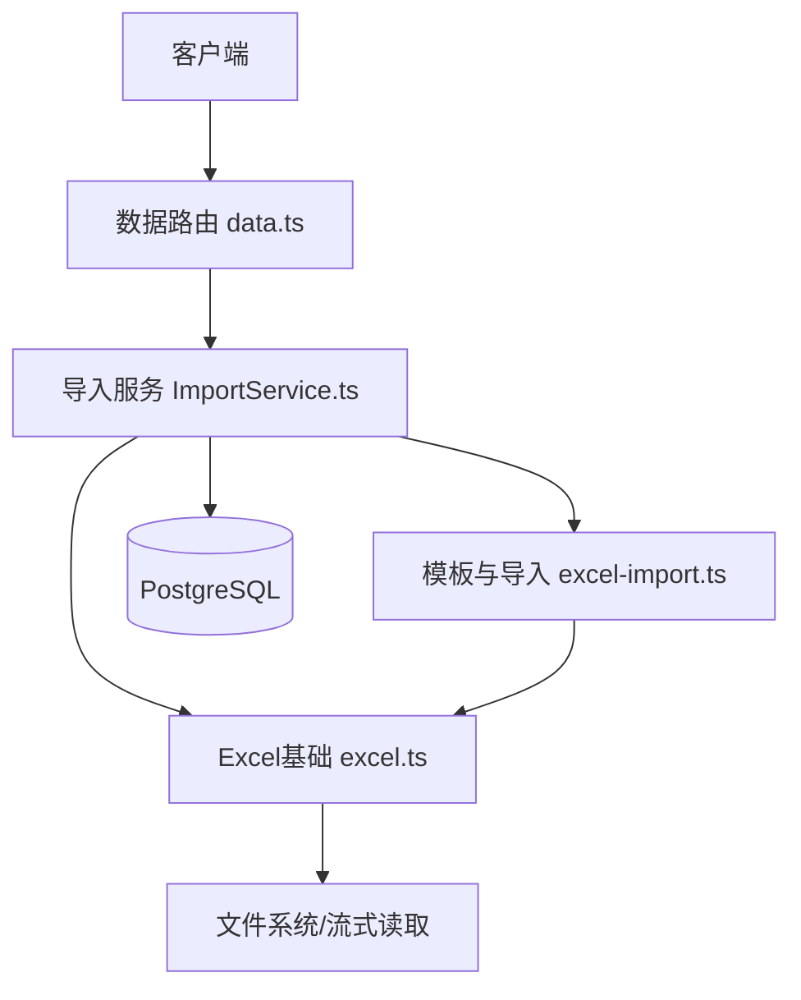
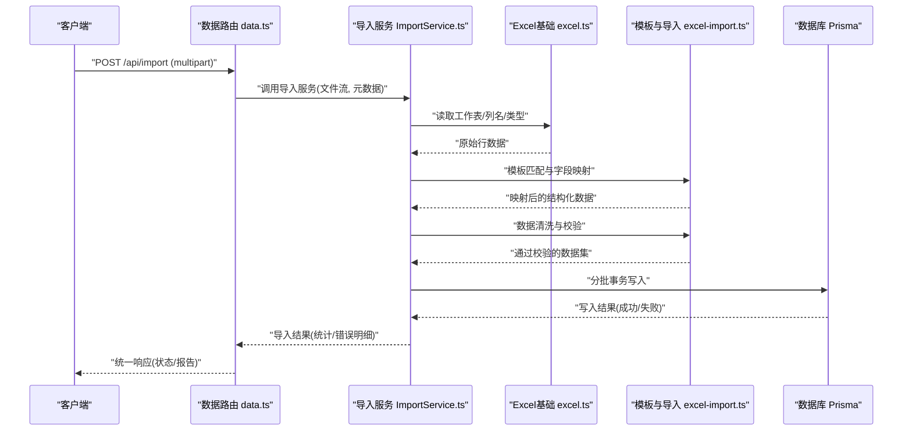
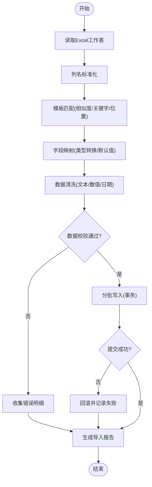
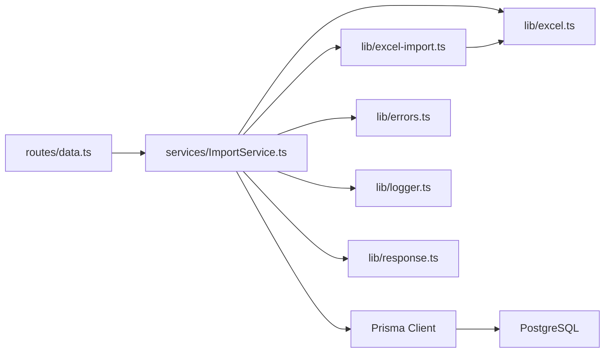

# Excel处理工具

<cite>
**本文引用的文件**   
- [excel-import.ts](file://server/src/lib/excel-import.ts)
- [excel.ts](file://server/src/lib/excel.ts)
- [ImportService.ts](file://server/src/services/ImportService.ts)
- [data.ts](file://server/src/routes/data.ts)
- [schema.prisma](file://server/prisma/schema.prisma)
- [env.ts](file://server/src/config/env.ts)
- [errors.ts](file://server/src/lib/errors.ts)
- [logger.ts](file://server/src/lib/logger.ts)
- [response.ts](file://server/src/lib/response.ts)
- [excel-import.test.ts](file://server/src/lib/excel-import.test.ts)
</cite>

## 目录
1. [简介](#简介)
2. [项目结构](#项目结构)
3. [核心组件](#核心组件)
4. [架构总览](#架构总览)
5. [详细组件分析](#详细组件分析)
6. [依赖关系分析](#依赖关系分析)
7. [性能考量](#性能考量)
8. [故障排查指南](#故障排查指南)
9. [结论](#结论)
10. [附录](#附录)

## 简介
本文件为FY200 Excel处理工具库的权威文档，聚焦Excel文件解析、数据格式转换与批量导入处理的完整流程。内容涵盖：
- 模板匹配算法与字段映射配置
- 数据验证规则与错误处理机制
- 内存优化策略与大文件处理能力
- 数据清洗方法与导入最佳实践
- 性能调优与故障排查指南

本项目定位为“Excel进、看板/报表出”的内部管理口径财务数据平台，单位统一为万元/人民币。后端技术栈采用Express 4 + Prisma 5 + PostgreSQL 15，中间件执行链顺序为：helmet → cors → express.json → rate-limit → auth(JWT+黑名单) → permission(默认拒绝) → scope(Prisma extension) → softDelete → audit → Service → Prisma → PostgreSQL。计算类指标使用安全公式解析（白名单算子 +-*/()，禁止 eval），同比/环比由后端实时计算不存库。

## 项目结构
Excel导入相关能力主要分布在服务端lib与服务层：
- lib/excel.ts：Excel基础能力封装（读取、列名标准化、类型推断等）
- lib/excel-import.ts：模板匹配、字段映射、数据清洗、校验与批量写入
- services/ImportService.ts：导入事务编排、并发控制、错误聚合与结果汇总
- routes/data.ts：HTTP接口入口，接收上传文件并调用导入服务
- prisma/schema.prisma：导入目标表结构与约束定义
- config/env.ts：导入相关环境变量（如并发度、批大小、超时等）
- lib/errors.ts / logger.ts / response.ts：错误模型、日志与统一响应

**图表来源** 
- [data.ts](file://server/src/routes/data.ts)
- [ImportService.ts](file://server/src/services/ImportService.ts)
- [excel.ts](file://server/src/lib/excel.ts)
- [excel-import.ts](file://server/src/lib/excel-import.ts)

**章节来源**
- [excel-import.ts](file://server/src/lib/excel-import.ts)
- [excel.ts](file://server/src/lib/excel.ts)
- [ImportService.ts](file://server/src/services/ImportService.ts)
- [data.ts](file://server/src/routes/data.ts)
- [schema.prisma](file://server/prisma/schema.prisma)
- [env.ts](file://server/src/config/env.ts)

## 核心组件
- Excel基础能力（excel.ts）
  - 负责Excel文件的读取、工作表选择、列名规范化、单元格类型推断与空值处理
  - 提供流式或分页读取能力以支持大文件
- 模板匹配与导入（excel-import.ts）
  - 实现模板匹配算法（基于列名相似度、固定位置、正则/关键字匹配）
  - 字段映射配置（源列到目标字段的映射规则、类型转换、默认值填充）
  - 数据清洗（去空白、日期/金额格式化、单位换算至万元）
  - 数据验证（必填、唯一性、范围、枚举、外键存在性）
  - 批量写入（事务内分批插入，失败行记录与汇总）
- 导入服务（ImportService.ts）
  - 编排导入流程：文件校验→解析→映射→清洗→校验→批量入库
  - 并发控制与批大小限制，避免OOM
  - 错误聚合与结果报告（成功数、失败数、错误明细）
- HTTP入口（data.ts）
  - 接收multipart/form-data上传，鉴权后调用导入服务
  - 返回统一的导入任务状态与结果

**章节来源**
- [excel.ts](file://server/src/lib/excel.ts)
- [excel-import.ts](file://server/src/lib/excel-import.ts)
- [ImportService.ts](file://server/src/services/ImportService.ts)
- [data.ts](file://server/src/routes/data.ts)

## 架构总览
下图展示从文件上传到数据落库的端到端流程，包含模板匹配、字段映射、数据清洗、校验与批量写入的关键环节。

**图表来源** 
- [data.ts](file://server/src/routes/data.ts)
- [ImportService.ts](file://server/src/services/ImportService.ts)
- [excel.ts](file://server/src/lib/excel.ts)
- [excel-import.ts](file://server/src/lib/excel-import.ts)

## 详细组件分析

### Excel基础能力（excel.ts）
- 功能要点
  - 多工作表识别与选择（按名称或索引）
  - 列名标准化（去除空格、统一大小写、特殊字符替换）
  - 单元格类型推断（字符串、数字、布尔、日期）
  - 空值与异常值处理（跳过空行、占位符清理）
  - 流式读取与分页（减少内存占用）
- 复杂度与性能
  - 时间复杂度O(N×M)，N为行数，M为列数
  - 空间复杂度受批大小与缓存策略影响，建议批大小≤1000行
- 错误处理
  - 文件损坏/编码异常时抛出可读错误
  - 列缺失/类型不匹配时返回可修复提示

**章节来源**
- [excel.ts](file://server/src/lib/excel.ts)

### 模板匹配与字段映射（excel-import.ts）
- 模板匹配算法
  - 基于列名相似度（编辑距离/归一化）与关键字匹配
  - 支持固定位置映射（首列、末列等）与正则表达式匹配
  - 多模板优先级排序与回退策略
- 字段映射配置
  - 源列到目标字段的映射表（含类型转换、默认值、计算公式）
  - 动态映射（根据组织/科目树自动映射）
- 数据清洗方法
  - 文本清洗（去空白、全角转半角、换行符替换）
  - 数值清洗（千分位逗号移除、货币符号去除、单位换算至万元）
  - 日期清洗（多种格式解析、时区处理）
- 数据验证规则
  - 必填校验、长度限制、数值范围、枚举值、唯一性、外键存在性
  - 自定义校验器（业务规则扩展点）
- 批量写入策略
  - 事务内分批插入（每批固定行数）
  - 失败行隔离与错误明细收集
  - 重试与幂等（基于业务主键）

**图表来源** 
- [excel-import.ts](file://server/src/lib/excel-import.ts)

**章节来源**
- [excel-import.ts](file://server/src/lib/excel-import.ts)

### 导入服务（ImportService.ts）
- 流程编排
  - 文件校验（类型、大小、权限）
  - 调用Excel基础能力解析
  - 模板匹配与字段映射
  - 数据清洗与校验
  - 批量写入与事务管理
  - 错误聚合与结果汇总
- 并发与批处理
  - 并发度控制（避免DB连接池耗尽）
  - 批大小可调（内存与吞吐平衡）
- 错误处理与恢复
  - 分类错误（解析错误、校验错误、写入错误）
  - 部分失败不影响其他批次
  - 重试策略（网络抖动、死锁）

**章节来源**
- [ImportService.ts](file://server/src/services/ImportService.ts)

### HTTP入口（data.ts）
- 接口设计
  - POST /api/import：接收Excel文件上传
  - 请求体：multipart/form-data（file、templateId、options）
  - 响应：统一导入任务状态与结果摘要
- 鉴权与限流
  - JWT鉴权与权限检查
  - 速率限制保护
- 错误响应
  - 统一错误码与消息
  - 失败原因定位（行号、列名、错误类型）

**章节来源**
- [data.ts](file://server/src/routes/data.ts)

### 数据模型（schema.prisma）
- 导入目标表结构
  - 主键、唯一约束、外键约束
  - 审计字段（创建时间、更新时间）
- 约束与索引
  - 复合索引提升查询性能
  - 唯一约束防止重复导入

**章节来源**
- [schema.prisma](file://server/prisma/schema.prisma)

### 配置与环境（env.ts）
- 导入相关环境变量
  - 并发度（CONCURRENT_IMPORTS）
  - 批大小（IMPORT_BATCH_SIZE）
  - 超时（IMPORT_TIMEOUT_MS）
  - 最大文件大小（MAX_FILE_SIZE_MB）
- 安全与审计
  - 审计开关、日志级别

**章节来源**
- [env.ts](file://server/src/config/env.ts)

### 错误与日志（errors.ts, logger.ts, response.ts）
- 错误模型
  - 分类错误类型（ValidationError、ParseError、WriteError）
  - 错误上下文（行号、列名、期望值、实际值）
- 日志记录
  - 结构化日志（导入ID、用户、文件信息、耗时）
  - 敏感信息脱敏
- 统一响应
  - 成功/失败包装
  - 分页与总量信息

**章节来源**
- [errors.ts](file://server/src/lib/errors.ts)
- [logger.ts](file://server/src/lib/logger.ts)
- [response.ts](file://server/src/lib/response.ts)

## 依赖关系分析

**图表来源** 
- [data.ts](file://server/src/routes/data.ts)
- [ImportService.ts](file://server/src/services/ImportService.ts)
- [excel.ts](file://server/src/lib/excel.ts)
- [excel-import.ts](file://server/src/lib/excel-import.ts)
- [errors.ts](file://server/src/lib/errors.ts)
- [logger.ts](file://server/src/lib/logger.ts)
- [response.ts](file://server/src/lib/response.ts)

**章节来源**
- [data.ts](file://server/src/routes/data.ts)
- [ImportService.ts](file://server/src/services/ImportService.ts)
- [excel.ts](file://server/src/lib/excel.ts)
- [excel-import.ts](file://server/src/lib/excel-import.ts)
- [errors.ts](file://server/src/lib/errors.ts)
- [logger.ts](file://server/src/lib/logger.ts)
- [response.ts](file://server/src/lib/response.ts)

## 性能考量
- 内存优化
  - 流式读取Excel，避免一次性加载全部数据
  - 批大小控制在1000行以内，降低内存峰值
  - 及时释放临时对象与缓冲区
- 并发控制
  - 限制并发导入任务数，避免DB连接池耗尽
  - 单任务内并行写入需谨慎，优先串行批处理
- 数据库优化
  - 使用事务批量插入，减少往返开销
  - 合理索引设计，避免全表扫描
- 模板匹配优化
  - 预编译正则与相似度计算缓存
  - 多模板优先级排序，减少无效匹配
- 监控与度量
  - 记录导入耗时、成功率、错误分布
  - 告警阈值（失败率>5%触发告警）

[本节为通用性能指导，无需特定文件引用]

## 故障排查指南
- 常见问题
  - 模板匹配失败：检查列名标准化规则与模板配置
  - 数据类型错误：确认日期/金额格式与单位换算
  - 唯一性冲突：检查业务主键与重复数据
  - 外键不存在：确保关联数据已导入或启用延迟校验
- 错误定位
  - 查看导入报告中的错误明细（行号、列名、错误类型）
  - 检查日志中的导入ID与上下文信息
  - 复现问题时使用最小数据集
- 恢复策略
  - 部分失败不影响其他批次，修正后重新导入失败行
  - 启用幂等导入，避免重复数据
  - 调整批大小与并发度，缓解资源压力

**章节来源**
- [excel-import.test.ts](file://server/src/lib/excel-import.test.ts)
- [errors.ts](file://server/src/lib/errors.ts)
- [logger.ts](file://server/src/lib/logger.ts)

## 结论
FY200 Excel处理工具库提供了完整的Excel导入解决方案，涵盖模板匹配、字段映射、数据清洗、校验与批量写入。通过流式读取、批处理与事务管理，实现了高可靠与大文件处理能力。结合统一错误模型与结构化日志，便于问题定位与系统监控。遵循本文的最佳实践与性能调优建议，可显著提升导入效率与稳定性。

[本节为总结性内容，无需特定文件引用]

## 附录
- 最佳实践
  - 使用标准模板，减少匹配歧义
  - 预处理Excel数据，确保格式规范
  - 分批次导入大文件，避免超时
  - 启用审计与日志，便于追溯
- 性能调优
  - 调整批大小与并发度，观察内存与CPU使用
  - 优化数据库索引与查询计划
  - 使用缓存减少重复计算
- 故障排查清单
  - 检查文件编码与格式
  - 验证模板配置与字段映射
  - 查看错误报告与日志
  - 复现问题并逐步缩小范围

[本节为补充性内容，无需特定文件引用]