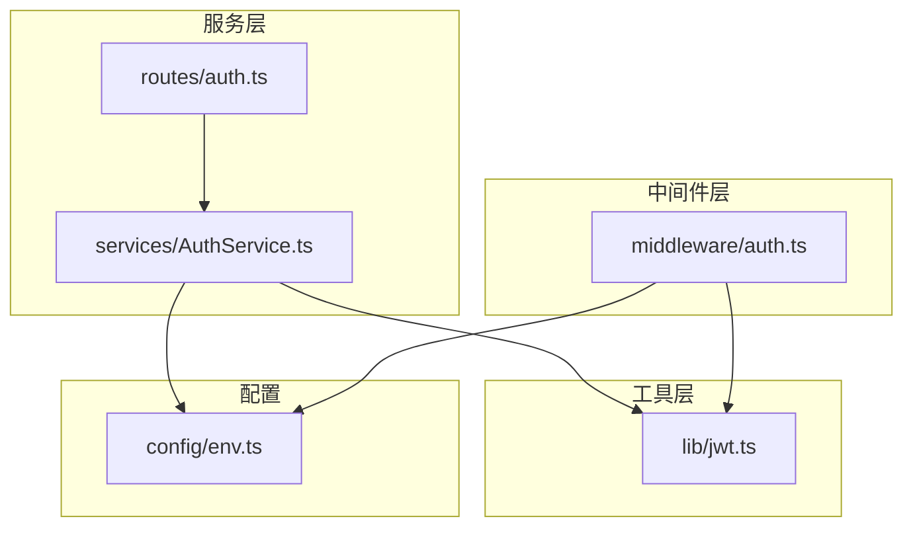
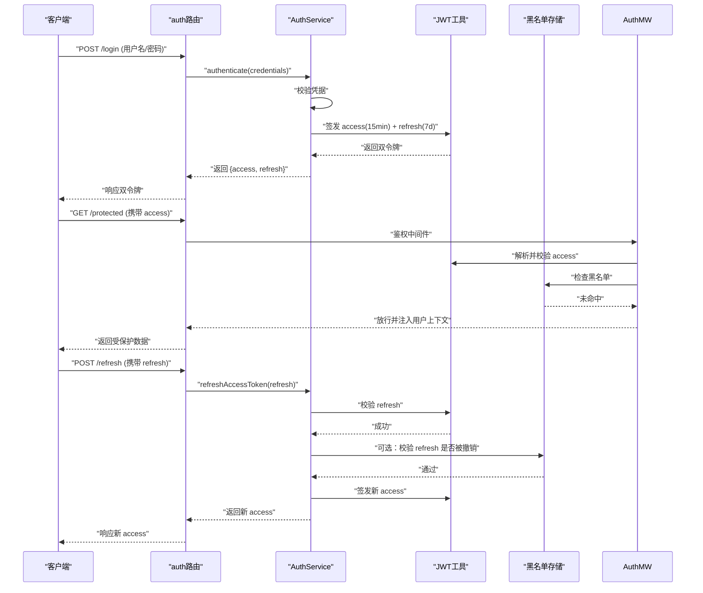
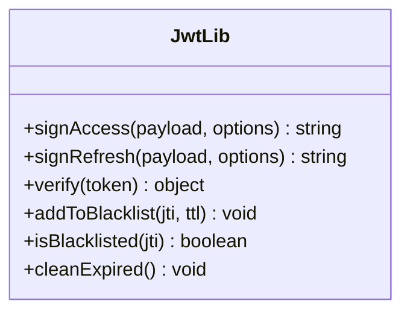
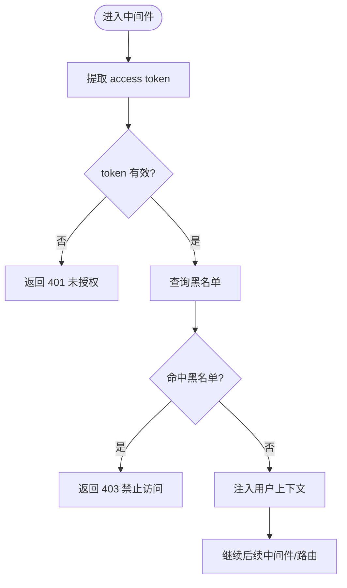
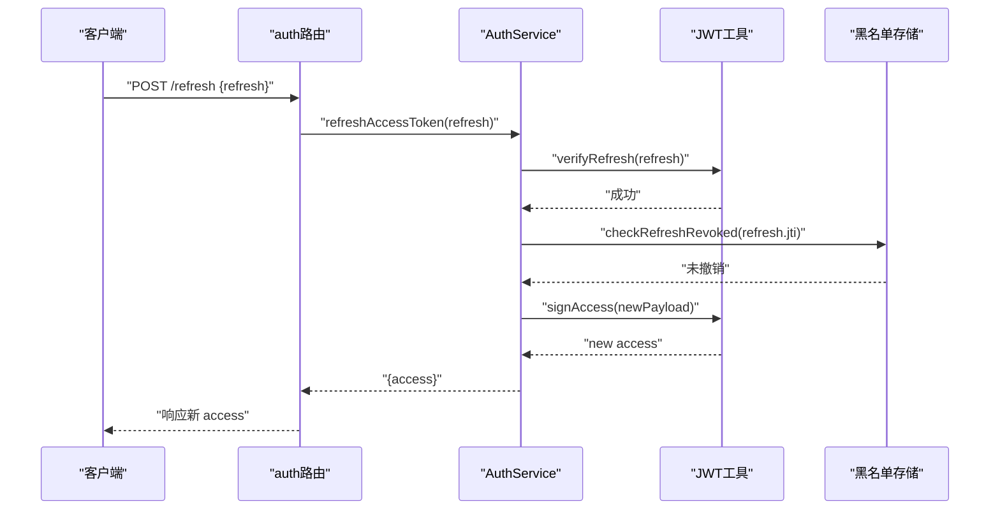
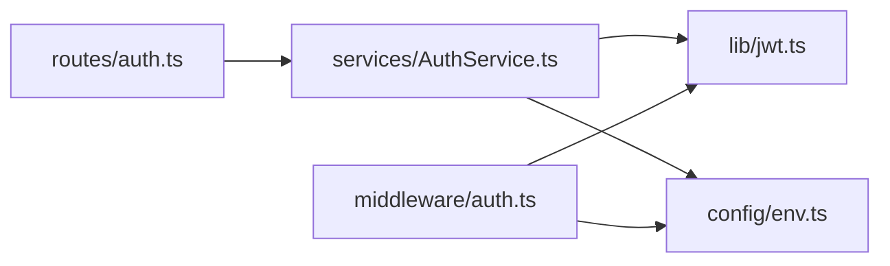

# JWT认证库

<cite>
**本文引用的文件**
- [server/src/lib/jwt.ts](file://server/src/lib/jwt.ts)
- [server/src/lib/jwt.test.ts](file://server/src/lib/jwt.test.ts)
- [server/src/middleware/auth.ts](file://server/src/middleware/auth.ts)
- [server/src/middleware/auth.test.ts](file://server/src/middleware/auth.test.ts)
- [server/src/routes/auth.ts](file://server/src/routes/auth.ts)
- [server/src/services/AuthService.ts](file://server/src/services/AuthService.ts)
- [server/src/services/AuthService.test.ts](file://server/src/services/AuthService.test.ts)
- [server/src/config/env.ts](file://server/src/config/env.ts)
</cite>

## 目录
1. [简介](#简介)
2. [项目结构](#项目结构)
3. [核心组件](#核心组件)
4. [架构总览](#架构总览)
5. [详细组件分析](#详细组件分析)
6. [依赖关系分析](#依赖关系分析)
7. [性能考虑](#性能考虑)
8. [故障排查指南](#故障排查指南)
9. [结论](#结论)
10. [附录](#附录)

## 简介
本文件为 FY200 项目的 JWT 认证工具库文档，聚焦双令牌机制（access token 15分钟 + refresh token 7天）的实现原理与轮转策略。内容涵盖：
- 令牌结构与生成、验证、刷新流程
- 黑名单管理与撤销策略
- 安全配置项与错误处理
- 性能优化建议与最佳实践
- 常见问题与解决方案

后端技术栈采用 Express 4 + Prisma 5 + PostgreSQL 15 + JWT（access 15min + refresh 7day 轮转）+ DeepSeek API（SSE 流式）。中间件执行链顺序为：helmet → cors → express.json → rate-limit → auth(JWT+黑名单) → permission(默认拒绝) → scope(Prisma extension) → softDelete → audit → Service → Prisma → PostgreSQL。

## 项目结构
JWT 相关代码主要分布在以下位置：
- 工具层：server/src/lib/jwt.ts（JWT 工具函数与配置）
- 中间件层：server/src/middleware/auth.ts（鉴权中间件，含黑名单校验）
- 路由与服务层：server/src/routes/auth.ts、server/src/services/AuthService.ts（登录、签发、刷新、登出等）
- 配置与环境：server/src/config/env.ts（密钥、过期时间、黑名单存储等）
- 测试用例：jwt.test.ts、auth.test.ts、AuthService.test.ts

图表来源
- [server/src/routes/auth.ts](file://server/src/routes/auth.ts)
- [server/src/services/AuthService.ts](file://server/src/services/AuthService.ts)
- [server/src/middleware/auth.ts](file://server/src/middleware/auth.ts)
- [server/src/lib/jwt.ts](file://server/src/lib/jwt.ts)
- [server/src/config/env.ts](file://server/src/config/env.ts)

章节来源
- [server/src/lib/jwt.ts](file://server/src/lib/jwt.ts)
- [server/src/middleware/auth.ts](file://server/src/middleware/auth.ts)
- [server/src/routes/auth.ts](file://server/src/routes/auth.ts)
- [server/src/services/AuthService.ts](file://server/src/services/AuthService.ts)
- [server/src/config/env.ts](file://server/src/config/env.ts)

## 核心组件
- JWT 工具库（lib/jwt.ts）
  - 负责 access/refresh 令牌的签发、解析、校验、签名算法与密钥管理
  - 提供统一的错误类型与异常封装
- 鉴权中间件（middleware/auth.ts）
  - 从请求头提取并解析 access token
  - 校验黑名单（如 Redis/内存），失败则拒绝访问
  - 将用户上下文注入到请求对象供后续权限控制使用
- 认证服务（services/AuthService.ts）
  - 登录成功后签发双令牌
  - 刷新 access token（基于 refresh token）
  - 登出时加入黑名单或撤销会话
- 认证路由（routes/auth.ts）
  - 暴露 /login、/refresh、/logout 等接口
- 环境配置（config/env.ts）
  - 定义 JWT 密钥、算法、过期时间、黑名单存储参数等

章节来源
- [server/src/lib/jwt.ts](file://server/src/lib/jwt.ts)
- [server/src/middleware/auth.ts](file://server/src/middleware/auth.ts)
- [server/src/services/AuthService.ts](file://server/src/services/AuthService.ts)
- [server/src/routes/auth.ts](file://server/src/routes/auth.ts)
- [server/src/config/env.ts](file://server/src/config/env.ts)

## 架构总览
下图展示了从客户端发起登录到获取双令牌，再到受保护资源访问的完整流程，以及 refresh 与黑名单的关键交互点。

图表来源
- [server/src/routes/auth.ts](file://server/src/routes/auth.ts)
- [server/src/services/AuthService.ts](file://server/src/services/AuthService.ts)
- [server/src/middleware/auth.ts](file://server/src/middleware/auth.ts)
- [server/src/lib/jwt.ts](file://server/src/lib/jwt.ts)

## 详细组件分析

### JWT 工具库（lib/jwt.ts）
职责与要点：
- 令牌结构
  - access token：短生命周期（约15分钟），包含用户标识、角色/权限摘要、签发时间、过期时间等
  - refresh token：长生命周期（约7天），仅用于换取新的 access token，建议最小化载荷
- 生成与校验
  - 使用强随机密钥与推荐算法（如 RS256/HS256），支持多环境密钥轮换
  - 校验包括：签名有效性、过期时间、必要字段存在性
- 黑名单集成
  - 提供“加入黑名单”“查询黑名单”“批量清理”等接口
  - 支持按 token jti 或子集键值进行快速查找
- 错误处理
  - 统一错误码与消息，区分“无效签名”“已过期”“不在白名单”等场景
- 性能与安全
  - 避免在 token 中存放敏感信息
  - 对高频操作（解析、黑名单查询）做缓存与超时控制

图表来源
- [server/src/lib/jwt.ts](file://server/src/lib/jwt.ts)

章节来源
- [server/src/lib/jwt.ts](file://server/src/lib/jwt.ts)
- [server/src/lib/jwt.test.ts](file://server/src/lib/jwt.test.ts)

### 鉴权中间件（middleware/auth.ts）
职责与要点：
- 从请求头读取 access token 并进行解析与校验
- 调用黑名单服务判断是否被撤销
- 将用户上下文挂载到 req.user，供权限与范围控制使用
- 失败时返回标准错误响应（如 401/403）

图表来源
- [server/src/middleware/auth.ts](file://server/src/middleware/auth.ts)

章节来源
- [server/src/middleware/auth.ts](file://server/src/middleware/auth.ts)
- [server/src/middleware/auth.test.ts](file://server/src/middleware/auth.test.ts)

### 认证服务（services/AuthService.ts）
职责与要点：
- 登录：校验凭据后签发双令牌
- 刷新：校验 refresh token 后签发新的 access token
- 登出：将当前 refresh token 或相关会话加入黑名单
- 与数据库交互：必要时记录审计日志、更新最后登录时间等

图表来源
- [server/src/services/AuthService.ts](file://server/src/services/AuthService.ts)
- [server/src/lib/jwt.ts](file://server/src/lib/jwt.ts)

章节来源
- [server/src/services/AuthService.ts](file://server/src/services/AuthService.ts)
- [server/src/services/AuthService.test.ts](file://server/src/services/AuthService.test.ts)

### 认证路由（routes/auth.ts）
职责与要点：
- 暴露登录、刷新、登出等接口
- 输入校验与速率限制
- 调用 AuthService 完成业务逻辑并返回标准化响应

章节来源
- [server/src/routes/auth.ts](file://server/src/routes/auth.ts)

### 环境配置（config/env.ts）
职责与要点：
- JWT 密钥与算法配置
- access/refresh 过期时间
- 黑名单存储连接参数（Redis/内存）
- 调试与日志级别开关

章节来源
- [server/src/config/env.ts](file://server/src/config/env.ts)

## 依赖关系分析
- 模块耦合
  - routes/auth.ts 依赖 services/AuthService.ts
  - services/AuthService.ts 依赖 lib/jwt.ts 与 config/env.ts
  - middleware/auth.ts 依赖 lib/jwt.ts 与 config/env.ts
- 外部依赖
  - 黑名单存储（Redis/内存）
  - 数据库（Prisma/PostgreSQL）用于用户信息与审计日志

图表来源
- [server/src/routes/auth.ts](file://server/src/routes/auth.ts)
- [server/src/services/AuthService.ts](file://server/src/services/AuthService.ts)
- [server/src/lib/jwt.ts](file://server/src/lib/jwt.ts)
- [server/src/middleware/auth.ts](file://server/src/middleware/auth.ts)
- [server/src/config/env.ts](file://server/src/config/env.ts)

章节来源
- [server/src/routes/auth.ts](file://server/src/routes/auth.ts)
- [server/src/services/AuthService.ts](file://server/src/services/AuthService.ts)
- [server/src/lib/jwt.ts](file://server/src/lib/jwt.ts)
- [server/src/middleware/auth.ts](file://server/src/middleware/auth.ts)
- [server/src/config/env.ts](file://server/src/config/env.ts)

## 性能考虑
- 令牌解析开销
  - 尽量精简 payload，减少序列化/反序列化成本
  - 对高频解析可引入本地缓存（注意一致性）
- 黑名单查询
  - 使用高性能存储（Redis）并设置合理 TTL
  - 批量清理过期条目，降低存储膨胀
- 并发与限流
  - 登录与刷新接口需配合 rate-limit 中间件防止暴力破解
  - 对黑名单写入与查询设置超时与重试上限
- 密钥轮换
  - 支持多密钥并行校验，平滑过渡，避免抖动

[本节为通用指导，不直接分析具体文件]

## 故障排查指南
常见错误与定位方法：
- 401 未授权
  - 可能原因：access token 缺失、格式错误、签名无效、已过期
  - 排查：检查请求头、查看 JWT 解析日志、确认密钥一致
- 403 禁止访问
  - 可能原因：token 在黑名单中、权限不足
  - 排查：查询黑名单存储、核对权限策略
- 刷新失败
  - 可能原因：refresh token 过期、已被撤销、jti 不匹配
  - 排查：检查 refresh 有效期、撤销记录、jti 生成规则
- 性能问题
  - 可能原因：黑名单查询慢、解析频繁、密钥轮换导致额外校验
  - 排查：监控 Redis 延迟、CPU 使用率、解析耗时

章节来源
- [server/src/middleware/auth.ts](file://server/src/middleware/auth.ts)
- [server/src/lib/jwt.ts](file://server/src/lib/jwt.ts)
- [server/src/services/AuthService.ts](file://server/src/services/AuthService.ts)

## 结论
FY200 的 JWT 认证库通过双令牌机制实现了高安全与良好用户体验的平衡：
- access token 短生命周期保障接口安全
- refresh token 长生命周期提升用户体验
- 黑名单机制支持即时撤销与会话管理
- 中间件与服务的清晰分层便于扩展与维护

建议在生产环境中启用强密钥、严格速率限制、完善的监控与告警，并定期审计令牌策略与黑名单清理策略。

[本节为总结性内容，不直接分析具体文件]

## 附录

### 令牌结构定义（建议）
- access token
  - 必需字段：用户ID、角色/权限摘要、签发时间、过期时间、唯一标识（jti）
  - 可选字段：租户/组织ID、设备指纹（谨慎使用）
- refresh token
  - 必需字段：唯一标识（jti）、签发时间、过期时间
  - 可选字段：用户ID（用于审计）、设备指纹（谨慎使用）

[本节为概念性说明，不直接分析具体文件]

### 安全配置选项（建议）
- 算法与密钥
  - 使用强随机密钥，生产环境使用独立密钥
  - 推荐算法：RS256/ES256（非对称）或 HS256（对称）
- 过期策略
  - access：15分钟；refresh：7天
  - 支持动态调整与灰度发布
- 黑名单存储
  - 使用 Redis，设置合理的 TTL 与淘汰策略
  - 支持按 jti 快速查询与批量清理

[本节为概念性说明，不直接分析具体文件]

### 最佳实践
- 前端存储
  - access token 存内存，refresh token 存 httpOnly cookie 或安全存储
- 刷新策略
  - 仅在 access 即将过期或失效时触发刷新
  - 刷新失败应引导重新登录
- 撤销与会话
  - 登出时将 refresh 加入黑名单
  - 支持强制下线（管理员操作）
- 审计与监控
  - 记录登录、刷新、登出事件
  - 监控失败率、延迟与黑名单大小

[本节为概念性说明，不直接分析具体文件]

### 常见问题与解决方案
- Q：如何平滑轮换密钥？
  - A：支持多密钥并行校验，优先使用最新密钥签发，旧密钥保留一段时间
- Q：如何处理并发刷新导致的竞态？
  - A：对同一用户的刷新请求加锁，确保串行化处理
- Q：黑名单过大影响性能？
  - A：定期清理过期条目，使用分片或分区存储，监控命中率

[本节为概念性说明，不直接分析具体文件]