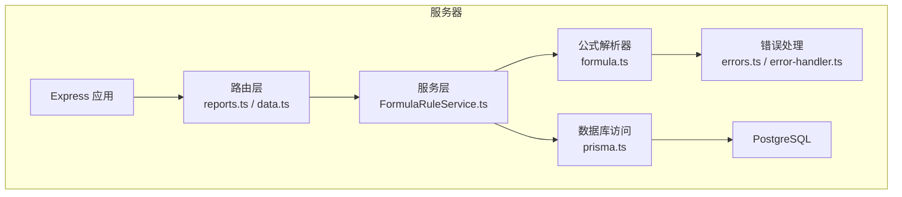
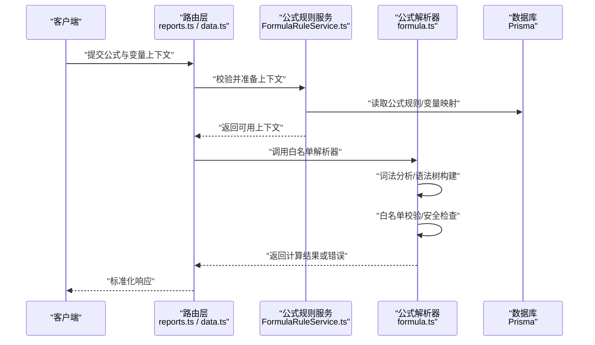
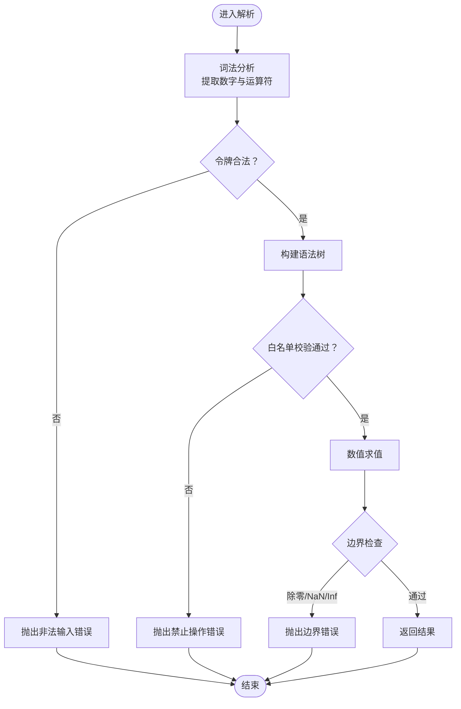
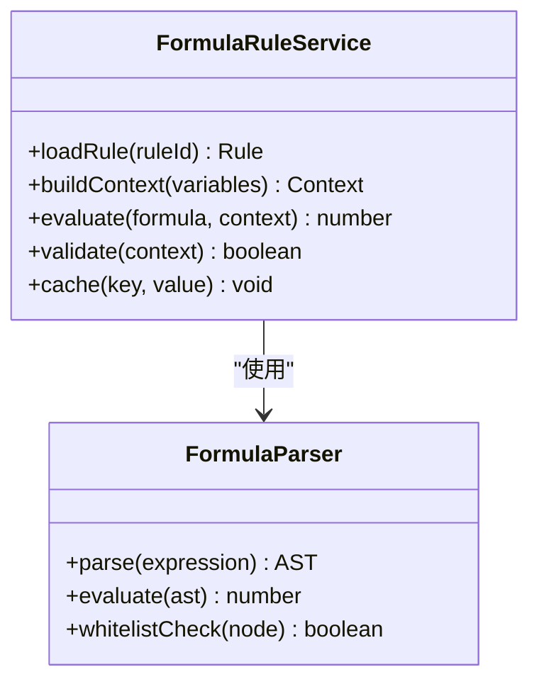
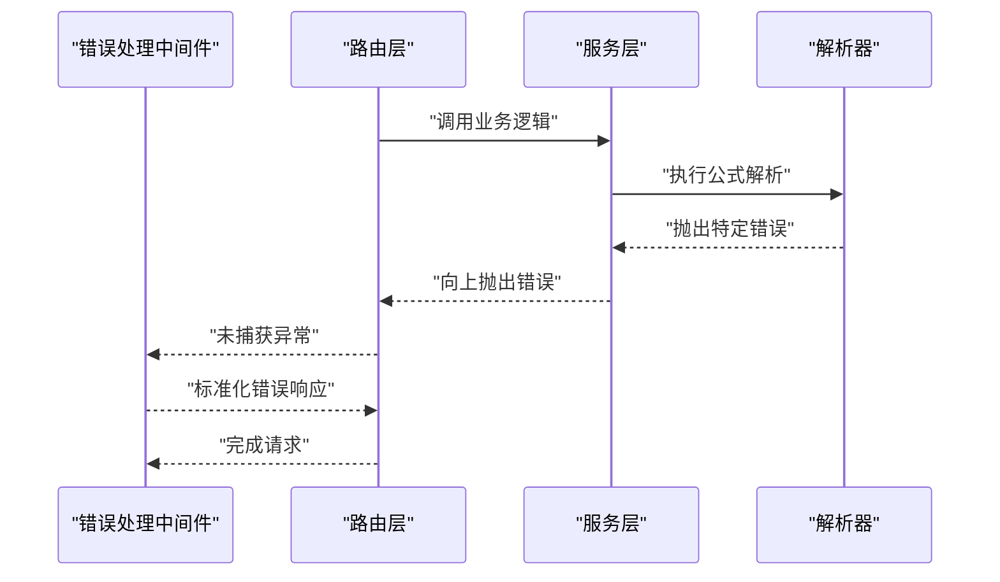
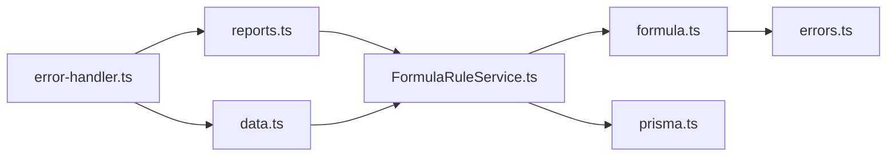

# 公式解析器

<cite>
**本文引用的文件**   
- [server/src/lib/formula.ts](file://server/src/lib/formula.ts)
- [server/src/lib/formula.test.ts](file://server/src/lib/formula.test.ts)
- [server/src/services/FormulaRuleService.ts](file://server/src/services/FormulaRuleService.ts)
- [server/src/services/formula-validation.test.ts](file://server/src/services/formula-validation.test.ts)
- [server/src/middleware/error-handler.ts](file://server/src/middleware/error-handler.ts)
- [server/src/lib/errors.ts](file://server/src/lib/errors.ts)
- [server/src/routes/reports.ts](file://server/src/routes/reports.ts)
- [server/src/routes/data.ts](file://server/src/routes/data.ts)
- [server/src/lib/prisma.ts](file://server/src/lib/prisma.ts)
- [server/prisma/schema.prisma](file://server/prisma/schema.prisma)
</cite>

## 目录
1. [简介](#简介)
2. [项目结构](#项目结构)
3. [核心组件](#核心组件)
4. [架构总览](#架构总览)
5. [详细组件分析](#详细组件分析)
6. [依赖关系分析](#依赖关系分析)
7. [性能考量](#性能考量)
8. [故障排查指南](#故障排查指南)
9. [结论](#结论)
10. [附录](#附录)

## 简介
本文件面向FY200安全公式解析器的设计与实现，聚焦“白名单算子”机制、公式语法规范、变量替换、错误处理与性能优化。系统采用严格的白名单策略（仅允许加减乘除与括号），禁止任意代码执行（如eval），确保在财务数据口径统一、单位一致（万元/人民币）的前提下，安全、稳定地计算指标。

## 项目结构
与安全公式解析相关的后端代码主要位于 server/src/lib 与 server/src/services 下，并通过路由层暴露接口供报表与数据服务调用。数据库侧通过 Prisma Schema 管理公式规则等元数据。

图表来源
- [server/src/routes/reports.ts](file://server/src/routes/reports.ts)
- [server/src/routes/data.ts](file://server/src/routes/data.ts)
- [server/src/services/FormulaRuleService.ts](file://server/src/services/FormulaRuleService.ts)
- [server/src/lib/formula.ts](file://server/src/lib/formula.ts)
- [server/src/lib/errors.ts](file://server/src/lib/errors.ts)
- [server/src/middleware/error-handler.ts](file://server/src/middleware/error-handler.ts)
- [server/src/lib/prisma.ts](file://server/src/lib/prisma.ts)
- [server/prisma/schema.prisma](file://server/prisma/schema.prisma)

章节来源
- [server/src/lib/formula.ts](file://server/src/lib/formula.ts)
- [server/src/services/FormulaRuleService.ts](file://server/src/services/FormulaRuleService.ts)
- [server/src/routes/reports.ts](file://server/src/routes/reports.ts)
- [server/src/routes/data.ts](file://server/src/routes/data.ts)
- [server/src/lib/prisma.ts](file://server/src/lib/prisma.ts)
- [server/prisma/schema.prisma](file://server/prisma/schema.prisma)

## 核心组件
- 公式解析器（formula.ts）：实现基于词法分析与表达式求值的白名单解析器，仅支持 + - * / ( )，拒绝任何危险函数或外部调用。
- 公式规则服务（FormulaRuleService.ts）：负责公式规则的持久化、校验、版本管理与上下文注入（变量映射）。
- 错误处理（errors.ts, error-handler.ts）：统一异常类型与HTTP错误响应，保障解析失败的可观测性与可恢复性。
- 路由层（reports.ts, data.ts）：对外暴露公式验证、计算与规则管理的API。

章节来源
- [server/src/lib/formula.ts](file://server/src/lib/formula.ts)
- [server/src/services/FormulaRuleService.ts](file://server/src/services/FormulaRuleService.ts)
- [server/src/lib/errors.ts](file://server/src/lib/errors.ts)
- [server/src/middleware/error-handler.ts](file://server/src/middleware/error-handler.ts)
- [server/src/routes/reports.ts](file://server/src/routes/reports.ts)
- [server/src/routes/data.ts](file://server/src/routes/data.ts)

## 架构总览
下图展示了从请求到公式计算的完整链路，强调白名单解析与错误处理的关键节点。

图表来源
- [server/src/routes/reports.ts](file://server/src/routes/reports.ts)
- [server/src/routes/data.ts](file://server/src/routes/data.ts)
- [server/src/services/FormulaRuleService.ts](file://server/src/services/FormulaRuleService.ts)
- [server/src/lib/formula.ts](file://server/src/lib/formula.ts)
- [server/src/lib/prisma.ts](file://server/src/lib/prisma.ts)

## 详细组件分析

### 公式解析器（白名单算子）
- 支持的运算符：加、减、乘、除与括号，用于组合数值表达式。
- 安全策略：严格白名单，禁止任何函数调用、属性访问、字符串拼接为代码、以及 eval 类执行机制。
- 解析流程：词法分析 → 语法树构建 → 白名单校验 → 数值求值。
- 边界条件：除零保护、NaN/Infinity 拦截、非法字符过滤、括号匹配校验。
- 性能优化：预编译表达式、缓存AST、避免重复解析；对高频公式进行结果缓存。

图表来源
- [server/src/lib/formula.ts](file://server/src/lib/formula.ts)
- [server/src/lib/errors.ts](file://server/src/lib/errors.ts)

章节来源
- [server/src/lib/formula.ts](file://server/src/lib/formula.ts)
- [server/src/lib/formula.test.ts](file://server/src/lib/formula.test.ts)

### 公式规则服务（变量替换与上下文）
- 职责：加载公式规则、合并变量上下文、执行公式计算、记录审计日志。
- 变量替换：将模板中的占位符替换为实际数值，支持嵌套表达式与多变量组合。
- 校验：对变量类型、范围、缺失情况进行校验，保证计算安全。
- 缓存：对相同规则+上下文的计算结果进行短期缓存，提升性能。

图表来源
- [server/src/services/FormulaRuleService.ts](file://server/src/services/FormulaRuleService.ts)
- [server/src/lib/formula.ts](file://server/src/lib/formula.ts)

章节来源
- [server/src/services/FormulaRuleService.ts](file://server/src/services/FormulaRuleService.ts)
- [server/src/services/formula-validation.test.ts](file://server/src/services/formula-validation.test.ts)

### 错误处理与统一响应
- 错误分类：输入非法、白名单违规、边界异常（除零、NaN）、运行时异常。
- 统一处理：中间件捕获异常，转换为标准HTTP响应，包含错误码与消息。
- 可观测性：记录关键错误信息，便于追踪与告警。

图表来源
- [server/src/middleware/error-handler.ts](file://server/src/middleware/error-handler.ts)
- [server/src/lib/errors.ts](file://server/src/lib/errors.ts)

章节来源
- [server/src/middleware/error-handler.ts](file://server/src/middleware/error-handler.ts)
- [server/src/lib/errors.ts](file://server/src/lib/errors.ts)

### 单元测试方法
- 覆盖场景：基础运算、括号优先级、除零、非法字符、危险函数拦截、变量替换、上下文缺失。
- 断言策略：输入→输出映射、异常类型与消息、性能阈值。
- 工具建议：使用异步测试框架，模拟数据库与缓存行为。

章节来源
- [server/src/lib/formula.test.ts](file://server/src/lib/formula.test.ts)
- [server/src/services/formula-validation.test.ts](file://server/src/services/formula-validation.test.ts)

## 依赖关系分析
- 路由层依赖服务层，服务层依赖解析器与数据库。
- 错误处理贯穿全链路，确保异常一致性。
- 数据库通过 Prisma 提供类型安全的查询与变更。

图表来源
- [server/src/routes/reports.ts](file://server/src/routes/reports.ts)
- [server/src/routes/data.ts](file://server/src/routes/data.ts)
- [server/src/services/FormulaRuleService.ts](file://server/src/services/FormulaRuleService.ts)
- [server/src/lib/formula.ts](file://server/src/lib/formula.ts)
- [server/src/lib/prisma.ts](file://server/src/lib/prisma.ts)
- [server/src/lib/errors.ts](file://server/src/lib/errors.ts)
- [server/src/middleware/error-handler.ts](file://server/src/middleware/error-handler.ts)

章节来源
- [server/src/routes/reports.ts](file://server/src/routes/reports.ts)
- [server/src/routes/data.ts](file://server/src/routes/data.ts)
- [server/src/services/FormulaRuleService.ts](file://server/src/services/FormulaRuleService.ts)
- [server/src/lib/formula.ts](file://server/src/lib/formula.ts)
- [server/src/lib/prisma.ts](file://server/src/lib/prisma.ts)
- [server/src/lib/errors.ts](file://server/src/lib/errors.ts)
- [server/src/middleware/error-handler.ts](file://server/src/middleware/error-handler.ts)

## 性能考量
- 表达式预编译：对常用公式进行AST缓存，减少重复解析开销。
- 结果缓存：基于规则ID与变量哈希的短期缓存，避免重复计算。
- 流式处理：对大数据集采用分块计算，降低内存峰值。
- 监控与限流：对高频公式计算设置速率限制，防止资源耗尽。

[本节为通用指导，不直接分析具体文件]

## 故障排查指南
- 常见错误：
  - 非法字符或危险函数：检查输入是否包含非白名单符号或函数调用。
  - 除零或NaN：确认变量范围与边界条件。
  - 变量缺失：检查上下文是否完整注入。
- 定位步骤：
  - 查看错误响应中的错误码与消息。
  - 检查日志中的解析阶段与异常堆栈。
  - 复现最小用例，逐步缩小问题范围。
- 修复建议：
  - 修正公式语法或变量映射。
  - 增加输入校验与默认值处理。
  - 调整缓存策略与限流参数。

章节来源
- [server/src/lib/errors.ts](file://server/src/lib/errors.ts)
- [server/src/middleware/error-handler.ts](file://server/src/middleware/error-handler.ts)

## 结论
FY200安全公式解析器通过严格的白名单机制与完善的错误处理，确保了财务指标计算的安全性与稳定性。结合预编译、缓存与监控策略，系统在性能与可靠性之间取得平衡。未来可扩展自定义算子（需经过安全评审）与更丰富的变量类型支持。

[本节为总结性内容，不直接分析具体文件]

## 附录
- 公式语法规范：仅支持 + - * / ( )，数字字面量，无函数调用。
- 变量替换机制：占位符→数值映射，支持嵌套与多变量组合。
- 最佳实践：
  - 优先使用简单表达式，避免复杂嵌套。
  - 对敏感变量进行脱敏与范围校验。
  - 定期审查公式规则与权限控制。

[本节为概念性内容，不直接分析具体文件]