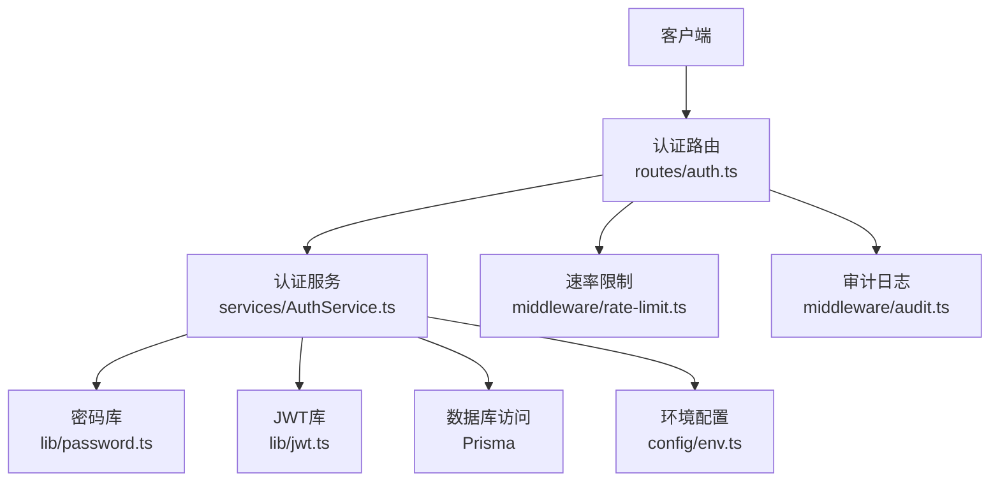
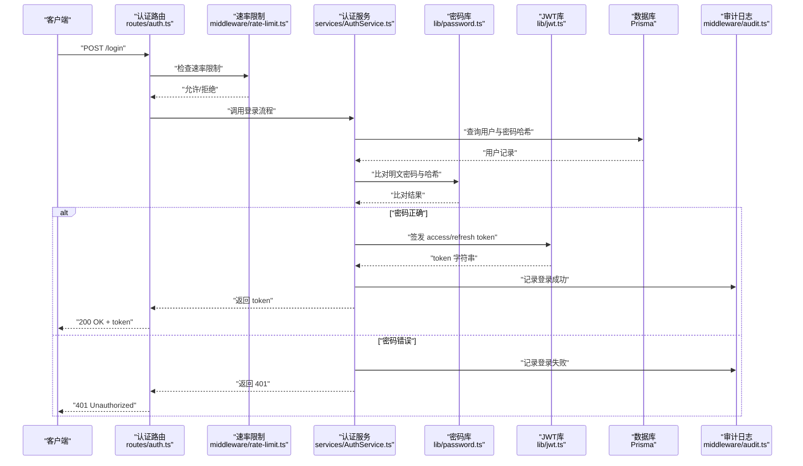
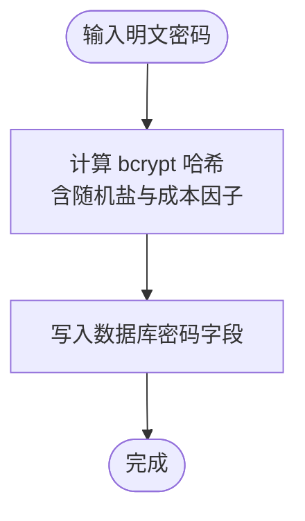
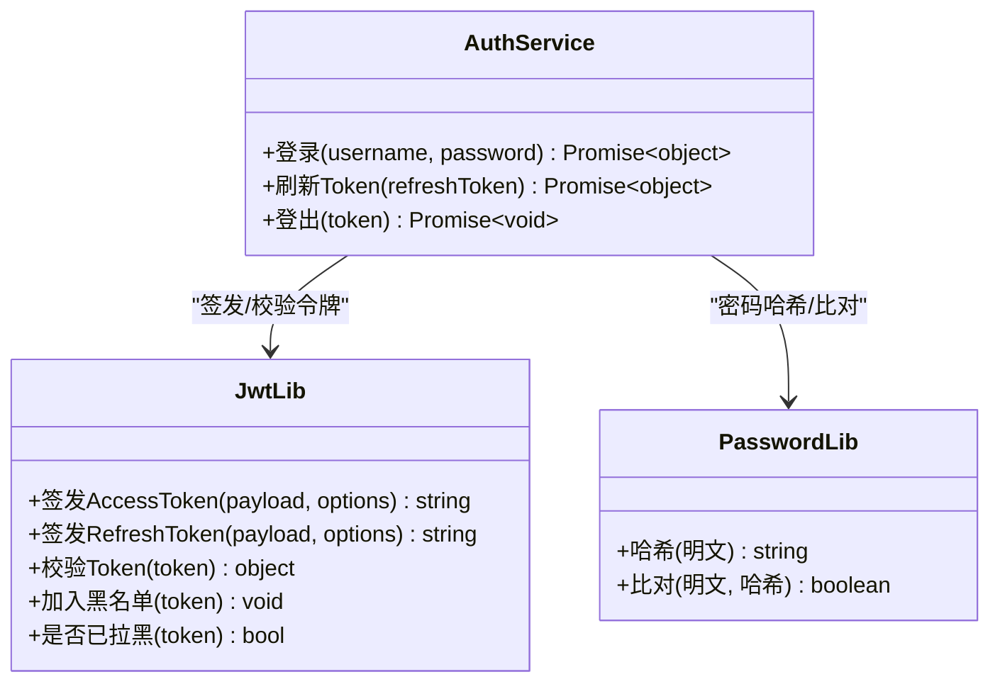
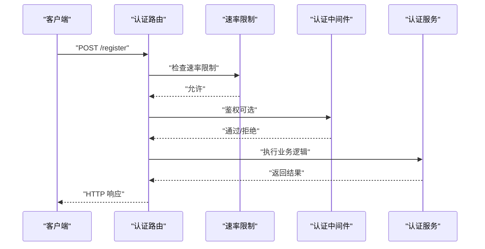
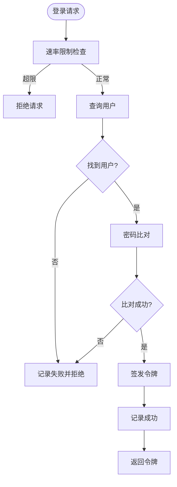
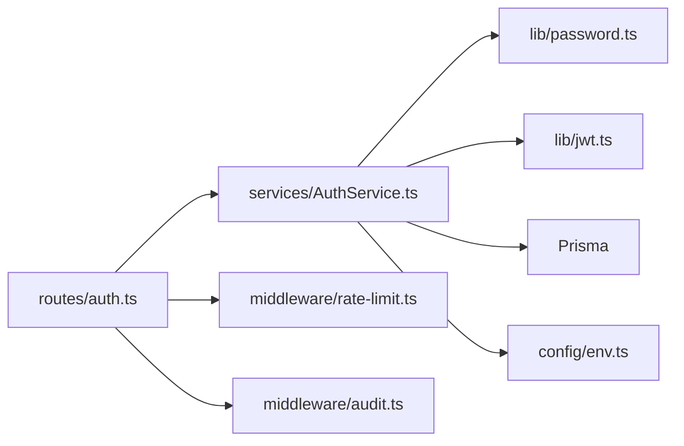
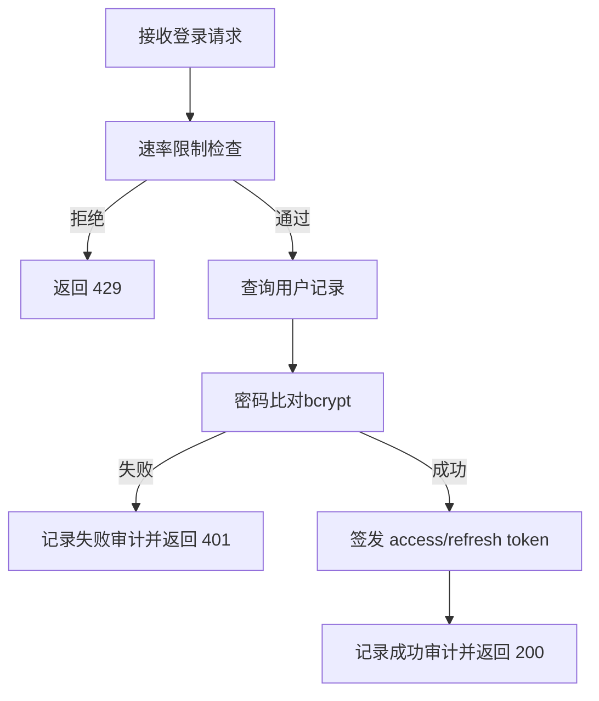

# 加密解密工具

<cite>
**本文引用的文件**   
- [server/src/lib/password.ts](file://server/src/lib/password.ts)
- [server/src/lib/jwt.ts](file://server/src/lib/jwt.ts)
- [server/src/middleware/auth.ts](file://server/src/middleware/auth.ts)
- [server/src/services/AuthService.ts](file://server/src/services/AuthService.ts)
- [server/src/routes/auth.ts](file://server/src/routes/auth.ts)
- [server/src/config/env.ts](file://server/src/config/env.ts)
- [server/src/middleware/rate-limit.ts](file://server/src/middleware/rate-limit.ts)
- [server/src/middleware/audit.ts](file://server/src/middleware/audit.ts)
- [server/prisma/schema.prisma](file://server/prisma/schema.prisma)
</cite>

## 目录
1. [简介](#简介)
2. [项目结构](#项目结构)
3. [核心组件](#核心组件)
4. [架构总览](#架构总览)
5. [详细组件分析](#详细组件分析)
6. [依赖关系分析](#依赖关系分析)
7. [性能考量](#性能考量)
8. [故障排查指南](#故障排查指南)
9. [结论](#结论)
10. [附录](#附录)

## 简介
本文件为 FY200 项目的“加密解密工具”专项文档，聚焦密码哈希算法（bcrypt）、盐值生成策略与安全存储方案；说明加密配置项、密钥管理与版本兼容性处理；给出密码验证流程、暴力破解防护措施与安全审计日志记录；并提供加密算法升级迁移指南与安全最佳实践。读者可据此理解并安全地维护与扩展系统的认证与数据安全能力。

## 项目结构
围绕认证与安全的后端实现主要位于 server 目录：
- 密码与令牌相关库：lib/password.ts、lib/jwt.ts
- 认证中间件与服务：middleware/auth.ts、services/AuthService.ts
- 路由入口：routes/auth.ts
- 环境变量与配置：config/env.ts
- 防护与审计：middleware/rate-limit.ts、middleware/audit.ts
- 数据模型与迁移：prisma/schema.prisma

图表来源
- [server/src/routes/auth.ts](file://server/src/routes/auth.ts)
- [server/src/services/AuthService.ts](file://server/src/services/AuthService.ts)
- [server/src/lib/password.ts](file://server/src/lib/password.ts)
- [server/src/lib/jwt.ts](file://server/src/lib/jwt.ts)
- [server/src/middleware/rate-limit.ts](file://server/src/middleware/rate-limit.ts)
- [server/src/middleware/audit.ts](file://server/src/middleware/audit.ts)
- [server/src/config/env.ts](file://server/src/config/env.ts)

章节来源
- [server/src/lib/password.ts](file://server/src/lib/password.ts)
- [server/src/lib/jwt.ts](file://server/src/lib/jwt.ts)
- [server/src/middleware/auth.ts](file://server/src/middleware/auth.ts)
- [server/src/services/AuthService.ts](file://server/src/services/AuthService.ts)
- [server/src/routes/auth.ts](file://server/src/routes/auth.ts)
- [server/src/config/env.ts](file://server/src/config/env.ts)
- [server/src/middleware/rate-limit.ts](file://server/src/middleware/rate-limit.ts)
- [server/src/middleware/audit.ts](file://server/src/middleware/audit.ts)
- [server/prisma/schema.prisma](file://server/prisma/schema.prisma)

## 核心组件
- 密码库（password.ts）：封装 bcrypt 的哈希与比对，负责盐值生成与成本参数管理，提供统一的加解密接口。
- JWT 库（jwt.ts）：封装 access/refresh token 的签发、校验与轮转逻辑，支持黑名单与过期策略。
- 认证服务（AuthService.ts）：编排登录、注册、密码重置等业务流程，协调密码库与 JWT 库，并与数据库交互。
- 认证中间件（auth.ts）：解析请求中的 JWT，校验签名与有效性，注入用户上下文。
- 认证路由（auth.ts）：暴露登录、注册、登出等 HTTP 端点，串联速率限制与审计。
- 速率限制（rate-limit.ts）：对认证相关接口进行限流，抵御暴力破解。
- 审计（audit.ts）：记录关键安全事件（登录成功/失败、权限变更等）。
- 环境配置（env.ts）：集中管理密钥、成本因子、令牌有效期等敏感配置。
- 数据模型（schema.prisma）：定义用户表及密码字段长度、索引等约束。

章节来源
- [server/src/lib/password.ts](file://server/src/lib/password.ts)
- [server/src/lib/jwt.ts](file://server/src/lib/jwt.ts)
- [server/src/services/AuthService.ts](file://server/src/services/AuthService.ts)
- [server/src/middleware/auth.ts](file://server/src/middleware/auth.ts)
- [server/src/routes/auth.ts](file://server/src/routes/auth.ts)
- [server/src/middleware/rate-limit.ts](file://server/src/middleware/rate-limit.ts)
- [server/src/middleware/audit.ts](file://server/src/middleware/audit.ts)
- [server/src/config/env.ts](file://server/src/config/env.ts)
- [server/prisma/schema.prisma](file://server/prisma/schema.prisma)

## 架构总览
下图展示从客户端发起登录到返回令牌的端到端调用链，以及密码哈希、令牌签发与审计的关键节点。

图表来源
- [server/src/routes/auth.ts](file://server/src/routes/auth.ts)
- [server/src/middleware/rate-limit.ts](file://server/src/middleware/rate-limit.ts)
- [server/src/services/AuthService.ts](file://server/src/services/AuthService.ts)
- [server/src/lib/password.ts](file://server/src/lib/password.ts)
- [server/src/lib/jwt.ts](file://server/src/lib/jwt.ts)
- [server/src/middleware/audit.ts](file://server/src/middleware/audit.ts)

## 详细组件分析

### 密码库（bcrypt）与盐值策略
- 哈希算法：采用 bcrypt，具备抗彩虹表与自适应成本特性。
- 盐值生成：由 bcrypt 内部随机生成，无需业务侧显式管理，确保相同密码在不同时间/环境下产生不同哈希。
- 成本参数：通过环境变量或配置文件控制，建议根据服务器性能动态调整，平衡安全性与响应时延。
- 存储格式：将 bcrypt 输出直接存入数据库密码字段，避免二次编码。
- 比对流程：使用 bcrypt 提供的比对函数，避免时序攻击。

图表来源
- [server/src/lib/password.ts](file://server/src/lib/password.ts)

章节来源
- [server/src/lib/password.ts](file://server/src/lib/password.ts)

### JWT 令牌与轮转策略
- Access Token：短期有效（如 15 分钟），用于接口鉴权。
- Refresh Token：长期有效（如 7 天），用于刷新 access token。
- 黑名单机制：登出或强制下线时将 refresh token 加入黑名单，防止重用。
- 签发与校验：统一在 jwt.ts 中实现，包含签名密钥、过期时间与载荷校验。
- 安全存储：前端应安全存储 token（如内存或 httpOnly cookie），避免 XSS 窃取。

图表来源
- [server/src/lib/jwt.ts](file://server/src/lib/jwt.ts)
- [server/src/services/AuthService.ts](file://server/src/services/AuthService.ts)
- [server/src/lib/password.ts](file://server/src/lib/password.ts)

章节来源
- [server/src/lib/jwt.ts](file://server/src/lib/jwt.ts)
- [server/src/services/AuthService.ts](file://server/src/services/AuthService.ts)

### 认证中间件与路由编排
- 中间件 auth.ts：解析请求头中的 Authorization，校验 JWT，注入用户上下文，未通过则拒绝。
- 路由 auth.ts：聚合登录、注册、登出等端点，前置速率限制与审计。
- 执行顺序：helmet → cors → express.json → rate-limit → auth → permission → scope → softDelete → audit → Service → Prisma → PostgreSQL。

图表来源
- [server/src/routes/auth.ts](file://server/src/routes/auth.ts)
- [server/src/middleware/auth.ts](file://server/src/middleware/auth.ts)
- [server/src/middleware/rate-limit.ts](file://server/src/middleware/rate-limit.ts)

章节来源
- [server/src/middleware/auth.ts](file://server/src/middleware/auth.ts)
- [server/src/routes/auth.ts](file://server/src/routes/auth.ts)

### 密码验证流程与暴力破解防护
- 登录流程：查询用户 → 比对密码 → 签发令牌 → 审计记录。
- 防护策略：
  - 速率限制：对登录/注册/重置密码接口进行频率限制。
  - 账户锁定：连续失败 N 次后临时锁定账户（建议实现）。
  - 验证码/人机校验：高风险操作引入验证码。
  - 审计告警：异常登录行为触发告警。

图表来源
- [server/src/services/AuthService.ts](file://server/src/services/AuthService.ts)
- [server/src/middleware/rate-limit.ts](file://server/src/middleware/rate-limit.ts)
- [server/src/middleware/audit.ts](file://server/src/middleware/audit.ts)

章节来源
- [server/src/services/AuthService.ts](file://server/src/services/AuthService.ts)
- [server/src/middleware/rate-limit.ts](file://server/src/middleware/rate-limit.ts)
- [server/src/middleware/audit.ts](file://server/src/middleware/audit.ts)

### 安全审计日志记录
- 记录内容：登录成功/失败、登出、令牌刷新、权限变更、异常事件。
- 输出位置：集中日志系统（如文件/ELK/云日志服务），便于检索与告警。
- 脱敏要求：不记录明文密码、敏感个人信息；仅记录必要标识与结果。

章节来源
- [server/src/middleware/audit.ts](file://server/src/middleware/audit.ts)

### 配置项与环境变量
- 密码成本因子：控制 bcrypt 计算强度，需结合硬件性能评估。
- JWT 密钥：access/refresh 签名密钥，必须保密且定期轮换。
- 令牌有效期：access/refresh 过期时间，影响用户体验与安全性。
- 速率限制阈值：按 IP/用户维度限制请求频率。
- 审计开关：控制是否记录审计日志。

章节来源
- [server/src/config/env.ts](file://server/src/config/env.ts)

### 数据模型与存储约束
- 用户表：包含用户名、邮箱、密码哈希、创建/更新时间等。
- 密码字段：长度需满足 bcrypt 输出上限（通常 60+ 字符），建议使用足够宽的 varchar/text。
- 索引：对用户名/邮箱建立唯一索引，提升查询效率与一致性。

章节来源
- [server/prisma/schema.prisma](file://server/prisma/schema.prisma)

## 依赖关系分析
- 模块耦合：
  - AuthService 依赖 PasswordLib 与 JwtLib，解耦了密码与令牌的具体实现。
  - 路由层仅编排流程，不承载业务细节，保持高内聚低耦合。
- 外部依赖：
  - bcrypt：密码哈希。
  - jsonwebtoken：JWT 签发与校验。
  - Prisma：ORM 访问数据库。
- 潜在循环依赖：应避免在 lib 层反向依赖 services 或 routes。

图表来源
- [server/src/routes/auth.ts](file://server/src/routes/auth.ts)
- [server/src/services/AuthService.ts](file://server/src/services/AuthService.ts)
- [server/src/lib/password.ts](file://server/src/lib/password.ts)
- [server/src/lib/jwt.ts](file://server/src/lib/jwt.ts)
- [server/src/middleware/rate-limit.ts](file://server/src/middleware/rate-limit.ts)
- [server/src/middleware/audit.ts](file://server/src/middleware/audit.ts)
- [server/src/config/env.ts](file://server/src/config/env.ts)

章节来源
- [server/src/routes/auth.ts](file://server/src/routes/auth.ts)
- [server/src/services/AuthService.ts](file://server/src/services/AuthService.ts)
- [server/src/lib/password.ts](file://server/src/lib/password.ts)
- [server/src/lib/jwt.ts](file://server/src/lib/jwt.ts)
- [server/src/middleware/rate-limit.ts](file://server/src/middleware/rate-limit.ts)
- [server/src/middleware/audit.ts](file://server/src/middleware/audit.ts)
- [server/src/config/env.ts](file://server/src/config/env.ts)

## 性能考量
- bcrypt 成本因子：过高会导致登录延迟上升，过低降低安全性。建议压测后确定合理值。
- 并发与线程池：bcrypt 可能阻塞事件循环，必要时考虑 worker 线程或异步队列。
- 缓存策略：对频繁读取的用户信息可使用 Redis 缓存，但密码哈希不得缓存明文。
- 数据库索引：确保用户名/邮箱唯一索引，减少全表扫描。

[本节为通用指导，不直接分析具体文件]

## 故障排查指南
- 登录失败：
  - 检查速率限制是否误拦截。
  - 核对密码哈希是否正确生成与存储。
  - 查看审计日志定位失败原因。
- 令牌无效：
  - 确认 JWT 签名密钥一致。
  - 检查 access/refresh 过期时间设置。
  - 核查黑名单是否误加入。
- 性能问题：
  - 降低 bcrypt 成本因子或扩容 CPU。
  - 优化数据库查询与索引。

章节来源
- [server/src/middleware/rate-limit.ts](file://server/src/middleware/rate-limit.ts)
- [server/src/lib/password.ts](file://server/src/lib/password.ts)
- [server/src/lib/jwt.ts](file://server/src/lib/jwt.ts)
- [server/src/middleware/audit.ts](file://server/src/middleware/audit.ts)

## 结论
FY200 的认证与安全体系以 bcrypt 为核心，配合 JWT 短效 access 与长效 refresh 轮转，辅以速率限制与审计日志，形成较为完整的安全闭环。建议在后续迭代中持续优化成本因子、完善账户锁定策略、加强密钥轮换与审计告警，确保系统在性能与安全之间取得最佳平衡。

[本节为总结性内容，不直接分析具体文件]

## 附录

### 密码验证流程图（代码级）

图表来源
- [server/src/services/AuthService.ts](file://server/src/services/AuthService.ts)
- [server/src/middleware/rate-limit.ts](file://server/src/middleware/rate-limit.ts)
- [server/src/middleware/audit.ts](file://server/src/middleware/audit.ts)

### 加密算法升级迁移指南
- 目标：平滑迁移至更高强度的哈希算法（如 argon2id），同时兼容旧 bcrypt 哈希。
- 步骤：
  1. 新增配置项：默认算法、兼容模式开关、迁移批次大小。
  2. 登录路径增强：若检测到旧哈希，后台异步重哈希为新算法，下次登录生效。
  3. 批量迁移：对历史数据进行分批重哈希，避免一次性锁表。
  4. 回滚预案：保留旧哈希字段，失败时回退至原算法。
  5. 灰度发布：先小流量验证，逐步全量。
- 注意事项：
  - 禁止在生产环境同步重哈希大表。
  - 严格测试新旧算法比对逻辑。
  - 审计记录迁移进度与异常。

[本节为通用指导，不直接分析具体文件]

### 安全最佳实践清单
- 密码存储：仅存 bcrypt/argon2 哈希，禁止明文或可逆加密。
- 令牌管理：short-lived access + long-lived refresh，支持黑名单与自动轮换。
- 传输安全：全站 HTTPS，启用 HSTS。
- 输入校验：严格白名单校验，防注入与越权。
- 审计与监控：关键操作留痕，异常行为告警。
- 密钥管理：使用环境变量或密钥管理服务，定期轮换。
- 合规与最小权限：按需授权，最小化数据访问范围。

[本节为通用指导，不直接分析具体文件]